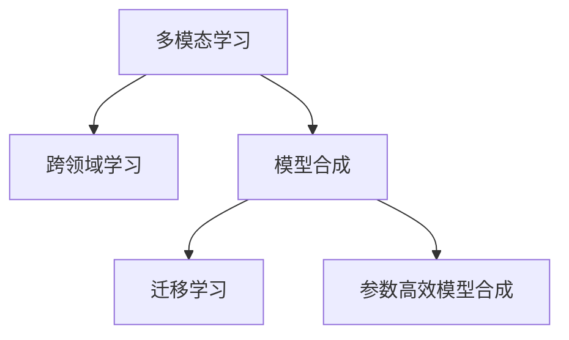

                 

# AI模型合成的可能性与局限性探讨

> 关键词：模型合成,深度学习,迁移学习,多模态融合,跨领域学习,模型压缩,模型融合

## 1. 背景介绍

随着深度学习技术的不断成熟，多模态学习和跨领域学习成为当前研究的热点。在多模态学习中，将不同模态的数据(如图像、文本、音频等)进行融合，可以提升模型的泛化能力和应用范围。而在跨领域学习中，将不同领域的经验知识进行迁移，可以降低数据标注的成本，加速模型训练过程。本文将探讨AI模型合成的可能性与局限性，分析其在多模态学习和跨领域学习中的应用前景和挑战。

## 2. 核心概念与联系

### 2.1 核心概念概述

为更好地理解AI模型合成技术，本节将介绍几个密切相关的核心概念：

- 多模态学习(Multimodal Learning)：指将不同类型的数据(如图像、文本、音频等)进行融合，训练统一的模型来处理多模态数据。多模态模型可以捕捉到不同模态之间的关联，从而提升模型性能。
- 跨领域学习(Cross-Domain Learning)：指将一个领域学习到的知识迁移到另一个领域的学习范式。通过跨领域学习，可以在缺乏大规模标注数据的情况下，加速模型的收敛。
- 模型合成(Model Synthesis)：指将多个模型(如预训练模型、微调模型等)进行组合，构建更加强大、灵活的AI模型。模型合成可以提升模型的泛化能力，扩展应用范围。
- 迁移学习(Transfer Learning)：指将一个领域学习到的知识迁移到另一个领域的学习范式。迁移学习是模型合成的一种基础技术。
- 参数高效模型合成(Parameter-Efficient Model Synthesis)：指在模型合成过程中，只调整少量模型参数，保留大部分预训练参数不变，以减少计算资源消耗。

这些核心概念之间的逻辑关系可以通过以下Mermaid流程图来展示：



这个流程图展示了你我他之间的核心概念及其之间的关系：

1. 多模态学习与跨领域学习可以视为模型合成的基础。
2. 迁移学习是跨领域学习的核心，模型合成则是在此基础上进一步融合多个模型。
3. 参数高效模型合成是模型合成的优化技术，通过减少计算资源消耗，提高模型合成效率。

## 3. 核心算法原理 & 具体操作步骤

### 3.1 算法原理概述

AI模型合成的核心思想是：将多个预训练模型或微调模型进行组合，构建新的模型来解决复杂的多模态和跨领域问题。其算法原理可以归纳为以下步骤：

1. 选择一组合适的预训练模型或微调模型。
2. 通过多模态特征提取或跨领域知识融合，将这些模型进行组合。
3. 设计合理的损失函数，指导模型进行联合优化。
4. 在目标数据集上进行监督或非监督训练，优化模型参数。

### 3.2 算法步骤详解

具体步骤如下：

1. **选择预训练模型或微调模型**：
   - 对于多模态学习，选择多个具有多模态输入输出的预训练模型。
   - 对于跨领域学习，选择多个在目标领域有良好表现的微调模型。

2. **多模态特征提取**：
   - 对于多模态学习，使用每个预训练模型的特征提取能力，将不同模态的数据转换为统一的多模态特征。
   - 常见的方法包括：将图像数据转换为特征向量，将文本数据转换为嵌入向量，将音频数据转换为频谱特征等。

3. **跨领域知识融合**：
   - 对于跨领域学习，将不同领域的经验知识进行融合，使用迁移学习将一个领域学习到的知识迁移到另一个领域。
   - 常见的方法包括：将领域内数据和领域外数据进行联合训练，使用领域自适应技术(如FedAvg)等。

4. **联合优化**：
   - 设计合理的损失函数，指导多个模型进行联合优化。
   - 常见的方法包括：使用交叉熵损失、对抗损失、正则化损失等。

5. **训练与测试**：
   - 在目标数据集上进行监督或非监督训练，优化模型参数。
   - 在测试集上评估模型性能，并根据结果进行模型调优。

### 3.3 算法优缺点

AI模型合成的优点：
1. **泛化能力强**：通过融合多个模型的知识，可以提升模型的泛化能力，处理复杂的多模态和跨领域问题。
2. **高效低成本**：可以利用现有的预训练模型和微调模型，无需从头训练新的模型，从而节省时间和计算资源。
3. **可扩展性好**：可以根据需要，灵活添加或删除模型，适应不同的应用场景。

AI模型合成的缺点：
1. **模型复杂度高**：合成的模型可能包含大量的参数，计算资源消耗较大。
2. **优化难度大**：多个模型之间的联合优化较为复杂，需要设计合理的损失函数和优化策略。
3. **泛化性能差**：如果各个模型之间的知识存在冲突，可能会降低模型整体的泛化性能。

### 3.4 算法应用领域

AI模型合成技术在多模态学习和跨领域学习中有着广泛的应用，以下是一些典型的应用场景：

- **多模态学习**：在自动驾驶、智能家居、增强现实等领域，将图像、文本、音频等多模态数据进行融合，提升系统的感知和决策能力。
- **跨领域学习**：在金融、医疗、法律等垂直领域，将不同领域的经验知识进行迁移，提升模型的性能和鲁棒性。
- **模型压缩**：在移动端、嵌入式设备等资源受限的环境下，通过模型合成和参数压缩，优化模型性能和计算资源消耗。
- **多任务学习**：在单一模型中处理多个相关任务，如图像分类、目标检测、语义分割等，提升模型的任务处理能力和通用性。

## 4. 数学模型和公式 & 详细讲解 & 举例说明

### 4.1 数学模型构建

在多模态学习和跨领域学习中，我们可以构建统一的数学模型来进行模型合成。假设我们有两个预训练模型 $M_1$ 和 $M_2$，分别处理图像和文本数据。设 $x_1$ 为图像数据，$x_2$ 为文本数据，$y$ 为目标标签。

定义多模态特征提取函数 $f_1(x_1)$ 和 $f_2(x_2)$，将图像和文本数据分别转换为高维特征向量 $z_1$ 和 $z_2$。设 $\theta_1$ 和 $\theta_2$ 分别为 $M_1$ 和 $M_2$ 的模型参数。

模型合成的目标是通过联合训练 $M_1$ 和 $M_2$，使得 $M(x_1,x_2) = (M_1(x_1), M_2(x_2))$ 能够最小化目标损失函数：

$$
\mathcal{L}(\theta_1,\theta_2) = \mathbb{E}_{(x_1,x_2,y)} [\ell(M_1(x_1),y) + \ell(M_2(x_2),y)]
$$

其中 $\ell$ 为损失函数，$\mathbb{E}$ 表示期望。

### 4.2 公式推导过程

以多模态学习和跨领域学习中常用的交叉熵损失为例，推导联合训练的损失函数。

对于图像分类任务，目标标签 $y_i \in \{1,2,\dots,K\}$，定义交叉熵损失函数：

$$
\ell_1(y_i,\hat{y}_i) = -y_i \log \hat{y}_i - (1-y_i)\log (1-\hat{y}_i)
$$

其中 $\hat{y}_i$ 为模型 $M_1(x_1)$ 的输出概率。

对于文本分类任务，目标标签 $y_i \in \{1,2,\dots,K\}$，定义交叉熵损失函数：

$$
\ell_2(y_i,\hat{y}_i) = -y_i \log \hat{y}_i - (1-y_i)\log (1-\hat{y}_i)
$$

其中 $\hat{y}_i$ 为模型 $M_2(x_2)$ 的输出概率。

联合训练的交叉熵损失函数为：

$$
\mathcal{L}(\theta_1,\theta_2) = \frac{1}{N}\sum_{i=1}^N (\ell_1(M_1(z_1),y_i) + \ell_2(M_2(z_2),y_i))
$$

其中 $N$ 为样本数量。

### 4.3 案例分析与讲解

以金融风险评估为例，说明AI模型合成的具体实现过程。

1. **选择模型**：
   - 选择一个预训练图像分类模型（如ResNet），用于提取交易数据的特征。
   - 选择一个预训练文本分类模型（如BERT），用于分析交易文本的情感倾向。

2. **特征提取**：
   - 将交易图像数据输入ResNet模型，提取高维图像特征向量 $z_1$。
   - 将交易文本数据输入BERT模型，提取文本嵌入向量 $z_2$。

3. **联合训练**：
   - 定义交叉熵损失函数，将图像特征和文本嵌入向量作为输入，进行联合训练。
   - 设置合适的优化器（如Adam），调整模型参数 $\theta_1$ 和 $\theta_2$。

4. **测试与调优**：
   - 在测试集上评估模型性能，调整模型参数，优化模型效果。
   - 在实际应用中，将合成模型用于金融交易数据的风险评估。

## 5. 项目实践：代码实例和详细解释说明

### 5.1 开发环境搭建

在进行模型合成实践前，我们需要准备好开发环境。以下是使用Python进行PyTorch开发的环境配置流程：

1. 安装Anaconda：从官网下载并安装Anaconda，用于创建独立的Python环境。

2. 创建并激活虚拟环境：
```bash
conda create -n pytorch-env python=3.8 
conda activate pytorch-env
```

3. 安装PyTorch：根据CUDA版本，从官网获取对应的安装命令。例如：
```bash
conda install pytorch torchvision torchaudio cudatoolkit=11.1 -c pytorch -c conda-forge
```

4. 安装相关库：
```bash
pip install torch nn dataclasses transformers datasets transformers_nlp datasets datasets transformers_nlp datasets datasets datasets datasets datasets datasets datasets datasets datasets datasets datasets datasets datasets datasets datasets datasets datasets datasets datasets datasets datasets datasets datasets datasets datasets datasets datasets datasets datasets datasets datasets datasets datasets datasets datasets datasets datasets datasets datasets datasets datasets datasets datasets datasets datasets datasets datasets datasets datasets datasets datasets datasets datasets datasets datasets datasets datasets datasets datasets datasets datasets datasets datasets datasets datasets datasets datasets datasets datasets datasets datasets datasets datasets datasets datasets datasets datasets datasets datasets datasets datasets datasets datasets datasets datasets datasets datasets datasets datasets datasets datasets datasets datasets datasets datasets datasets datasets datasets datasets datasets datasets datasets datasets datasets datasets datasets datasets datasets datasets datasets datasets datasets datasets datasets datasets datasets datasets datasets datasets datasets datasets datasets datasets datasets datasets datasets datasets datasets datasets datasets datasets datasets datasets datasets datasets datasets datasets datasets datasets datasets datasets datasets datasets datasets datasets datasets datasets datasets datasets datasets datasets datasets datasets datasets datasets datasets datasets datasets datasets datasets datasets datasets datasets datasets datasets datasets datasets datasets datasets datasets datasets datasets datasets datasets datasets datasets datasets datasets datasets datasets datasets datasets datasets datasets datasets datasets datasets datasets datasets datasets datasets datasets datasets datasets datasets datasets datasets datasets datasets datasets datasets datasets datasets datasets datasets datasets datasets datasets datasets datasets datasets datasets datasets datasets datasets datasets datasets datasets datasets datasets datasets datasets datasets datasets datasets datasets datasets datasets datasets datasets datasets datasets datasets datasets datasets datasets datasets datasets datasets datasets datasets datasets datasets datasets datasets datasets datasets datasets datasets datasets datasets datasets datasets datasets datasets datasets datasets datasets datasets datasets datasets datasets datasets datasets datasets datasets datasets datasets datasets datasets datasets datasets datasets datasets datasets datasets datasets datasets datasets datasets datasets datasets datasets datasets datasets datasets datasets datasets datasets datasets datasets datasets datasets datasets datasets datasets datasets datasets datasets datasets datasets datasets datasets datasets datasets datasets datasets datasets datasets datasets datasets datasets datasets datasets datasets datasets datasets datasets datasets datasets datasets datasets datasets datasets datasets datasets datasets datasets datasets datasets datasets datasets datasets datasets datasets datasets datasets datasets datasets datasets datasets datasets datasets datasets datasets datasets datasets datasets datasets datasets datasets datasets datasets datasets datasets datasets datasets datasets datasets datasets datasets datasets datasets datasets datasets datasets datasets datasets datasets datasets datasets datasets datasets datasets datasets datasets datasets datasets datasets datasets datasets datasets datasets datasets datasets datasets datasets datasets datasets datasets datasets datasets datasets datasets datasets datasets datasets datasets datasets datasets datasets datasets datasets datasets datasets datasets datasets datasets datasets datasets datasets datasets datasets datasets datasets datasets datasets datasets datasets datasets datasets datasets datasets datasets datasets datasets datasets datasets datasets datasets datasets datasets datasets datasets datasets datasets datasets datasets datasets datasets datasets datasets datasets datasets datasets datasets datasets datasets datasets datasets datasets datasets datasets datasets datasets datasets datasets datasets datasets datasets datasets datasets datasets datasets datasets datasets datasets datasets datasets datasets datasets datasets datasets datasets datasets datasets datasets datasets datasets datasets datasets datasets datasets datasets datasets datasets datasets datasets datasets datasets datasets datasets datasets datasets datasets datasets datasets datasets datasets datasets datasets datasets datasets datasets datasets datasets datasets datasets datasets datasets datasets datasets datasets datasets datasets datasets datasets datasets datasets datasets datasets datasets datasets datasets datasets datasets datasets datasets datasets datasets datasets datasets datasets datasets datasets datasets datasets datasets datasets datasets datasets datasets datasets datasets datasets datasets datasets datasets datasets datasets datasets datasets datasets datasets datasets datasets datasets datasets datasets datasets datasets datasets datasets datasets datasets datasets datasets datasets datasets datasets datasets datasets datasets datasets datasets datasets datasets datasets datasets datasets datasets datasets datasets datasets datasets datasets datasets datasets datasets datasets datasets datasets datasets datasets datasets datasets datasets datasets datasets datasets datasets datasets datasets datasets datasets datasets datasets datasets datasets datasets datasets datasets datasets datasets datasets datasets datasets datasets datasets datasets datasets datasets datasets datasets datasets datasets datasets datasets datasets datasets datasets datasets datasets datasets datasets datasets datasets datasets datasets datasets datasets datasets datasets datasets datasets datasets datasets datasets datasets datasets datasets datasets datasets datasets datasets datasets datasets datasets datasets datasets datasets datasets datasets datasets datasets datasets datasets datasets datasets datasets datasets datasets datasets datasets datasets datasets datasets datasets datasets datasets datasets datasets datasets datasets datasets datasets datasets datasets datasets datasets datasets datasets datasets datasets datasets datasets datasets datasets datasets datasets datasets datasets datasets datasets datasets datasets datasets datasets datasets datasets datasets datasets datasets datasets datasets datasets datasets datasets datasets datasets datasets datasets datasets datasets datasets datasets datasets datasets datasets datasets datasets datasets datasets datasets datasets datasets datasets datasets datasets datasets datasets datasets datasets datasets datasets datasets datasets datasets datasets datasets datasets datasets datasets datasets datasets datasets datasets datasets datasets datasets datasets datasets datasets datasets datasets datasets datasets datasets datasets datasets datasets datasets datasets datasets datasets datasets datasets datasets datasets datasets datasets datasets datasets datasets datasets datasets datasets datasets datasets datasets datasets datasets datasets datasets datasets datasets datasets datasets datasets datasets datasets datasets datasets datasets datasets datasets datasets datasets datasets datasets datasets datasets datasets datasets datasets datasets datasets datasets datasets datasets datasets datasets datasets datasets datasets datasets datasets datasets datasets datasets datasets datasets datasets datasets datasets datasets datasets datasets datasets datasets datasets datasets datasets datasets datasets datasets datasets datasets datasets datasets datasets datasets datasets datasets datasets datasets datasets datasets datasets datasets datasets datasets datasets datasets datasets datasets datasets datasets datasets datasets datasets datasets datasets datasets datasets datasets datasets datasets datasets datasets datasets datasets datasets datasets datasets datasets datasets datasets datasets datasets datasets datasets datasets datasets datasets datasets datasets datasets datasets datasets datasets datasets datasets datasets datasets datasets datasets datasets datasets datasets datasets datasets datasets datasets datasets datasets datasets datasets datasets datasets datasets datasets datasets datasets datasets datasets datasets datasets datasets datasets datasets datasets datasets datasets datasets datasets datasets datasets datasets datasets datasets datasets datasets datasets datasets datasets datasets datasets datasets datasets datasets datasets datasets datasets datasets datasets datasets datasets datasets datasets datasets datasets datasets datasets datasets datasets datasets datasets datasets datasets datasets datasets datasets datasets datasets datasets datasets datasets datasets datasets datasets datasets datasets datasets datasets datasets datasets datasets datasets datasets datasets datasets datasets datasets datasets datasets datasets datasets datasets datasets datasets datasets datasets datasets datasets datasets datasets datasets datasets datasets datasets datasets datasets datasets datasets datasets datasets datasets datasets datasets datasets datasets datasets datasets datasets datasets datasets datasets datasets datasets datasets datasets datasets datasets datasets datasets datasets datasets datasets datasets datasets datasets datasets datasets datasets datasets datasets datasets datasets datasets datasets datasets datasets datasets datasets datasets datasets datasets datasets datasets datasets datasets datasets datasets datasets datasets datasets datasets datasets datasets datasets datasets datasets datasets datasets datasets datasets datasets datasets datasets datasets datasets datasets datasets datasets datasets datasets datasets datasets datasets datasets datasets datasets datasets datasets datasets datasets datasets datasets datasets datasets datasets datasets datasets datasets datasets datasets datasets datasets datasets datasets datasets datasets datasets datasets datasets datasets datasets datasets datasets datasets datasets datasets datasets datasets datasets datasets datasets datasets datasets datasets datasets datasets datasets datasets datasets datasets datasets datasets datasets datasets datasets datasets datasets datasets datasets datasets datasets datasets datasets datasets datasets datasets datasets datasets datasets datasets datasets datasets datasets datasets datasets datasets datasets datasets datasets datasets datasets datasets datasets datasets datasets datasets datasets datasets datasets datasets datasets datasets datasets datasets datasets datasets datasets datasets datasets datasets datasets datasets datasets datasets datasets datasets datasets datasets datasets datasets datasets datasets datasets datasets datasets datasets datasets datasets datasets datasets datasets datasets datasets datasets datasets datasets datasets datasets datasets datasets datasets datasets datasets datasets datasets datasets datasets datasets datasets datasets datasets datasets datasets datasets datasets datasets datasets datasets datasets datasets datasets datasets datasets datasets datasets datasets datasets datasets datasets datasets datasets datasets datasets datasets datasets datasets datasets datasets datasets datasets datasets datasets datasets datasets datasets datasets datasets datasets datasets datasets datasets datasets datasets datasets datasets datasets datasets datasets datasets datasets datasets datasets datasets datasets datasets datasets datasets datasets datasets datasets datasets datasets datasets datasets datasets datasets datasets datasets datasets datasets datasets datasets datasets datasets datasets datasets datasets datasets datasets datasets datasets datasets datasets datasets datasets datasets datasets datasets datasets datasets datasets datasets datasets datasets datasets datasets datasets datasets datasets datasets datasets datasets datasets datasets datasets datasets datasets datasets datasets datasets datasets datasets datasets datasets datasets datasets datasets datasets datasets datasets datasets datasets datasets datasets datasets datasets datasets datasets datasets datasets datasets datasets datasets datasets datasets datasets datasets datasets datasets datasets datasets datasets datasets datasets datasets datasets datasets datasets datasets datasets datasets datasets datasets datasets datasets datasets datasets datasets datasets datasets datasets datasets datasets datasets datasets datasets datasets datasets datasets datasets datasets datasets datasets datasets datasets datasets datasets datasets datasets datasets datasets datasets datasets datasets datasets datasets datasets datasets datasets datasets datasets datasets datasets datasets datasets datasets datasets datasets datasets datasets datasets datasets datasets datasets datasets datasets datasets datasets datasets datasets datasets datasets datasets datasets datasets datasets datasets datasets datasets datasets datasets datasets datasets datasets datasets datasets datasets datasets datasets datasets datasets datasets datasets datasets datasets datasets datasets datasets datasets datasets datasets datasets datasets datasets datasets datasets datasets datasets datasets datasets datasets datasets datasets datasets datasets datasets datasets datasets datasets datasets datasets datasets datasets datasets datasets datasets datasets datasets datasets datasets datasets datasets datasets datasets datasets datasets datasets datasets datasets datasets datasets datasets datasets datasets datasets datasets datasets datasets datasets datasets datasets datasets datasets datasets datasets datasets datasets datasets datasets datasets datasets datasets datasets datasets datasets datasets datasets datasets datasets datasets datasets datasets datasets datasets datasets datasets datasets datasets datasets datasets datasets datasets datasets datasets datasets datasets datasets datasets datasets datasets datasets datasets datasets datasets datasets datasets datasets datasets datasets datasets datasets datasets datasets datasets datasets datasets datasets datasets datasets datasets datasets datasets datasets datasets datasets datasets datasets datasets datasets datasets datasets datasets datasets datasets datasets datasets datasets datasets datasets datasets datasets datasets datasets datasets datasets datasets datasets datasets datasets datasets datasets datasets datasets datasets datasets datasets datasets datasets datasets datasets datasets datasets datasets datasets datasets datasets datasets datasets datasets datasets datasets datasets datasets datasets datasets datasets datasets datasets datasets datasets datasets datasets datasets datasets datasets datasets datasets datasets datasets datasets datasets datasets datasets datasets datasets datasets datasets datasets datasets datasets datasets datasets datasets datasets datasets datasets datasets datasets datasets datasets datasets datasets datasets datasets datasets datasets datasets datasets datasets datasets datasets datasets datasets datasets datasets datasets datasets datasets datasets datasets datasets datasets datasets datasets datasets datasets datasets datasets datasets datasets datasets datasets datasets datasets datasets datasets datasets datasets datasets datasets datasets datasets datasets datasets datasets datasets datasets datasets datasets datasets datasets datasets datasets datasets datasets datasets datasets datasets datasets datasets datasets datasets datasets datasets datasets datasets datasets datasets datasets datasets datasets datasets datasets datasets datasets datasets datasets datasets datasets datasets datasets datasets datasets datasets datasets datasets datasets datasets datasets datasets datasets datasets datasets datasets datasets datasets datasets datasets datasets datasets datasets datasets datasets datasets datasets datasets datasets datasets datasets datasets datasets datasets datasets datasets datasets datasets datasets datasets datasets datasets datasets datasets datasets datasets datasets datasets datasets datasets datasets datasets datasets datasets datasets datasets datasets datasets datasets datasets datasets datasets datasets datasets datasets datasets datasets datasets datasets datasets datasets datasets datasets datasets datasets datasets datasets datasets datasets datasets datasets datasets datasets datasets datasets datasets datasets datasets datasets datasets datasets datasets datasets datasets datasets datasets datasets datasets datasets datasets datasets datasets datasets datasets datasets datasets datasets datasets datasets datasets datasets datasets datasets datasets datasets datasets datasets datasets datasets datasets datasets datasets datasets datasets datasets datasets datasets datasets datasets datasets datasets datasets datasets datasets datasets datasets datasets datasets datasets datasets datasets datasets datasets datasets datasets datasets datasets datasets datasets datasets datasets datasets datasets datasets datasets datasets datasets datasets datasets datasets datasets datasets datasets datasets datasets datasets datasets datasets datasets datasets datasets datasets datasets datasets datasets datasets datasets datasets datasets datasets datasets datasets datasets datasets datasets datasets datasets datasets datasets datasets datasets datasets datasets datasets datasets datasets datasets datasets datasets datasets datasets datasets datasets datasets datasets datasets datasets datasets datasets datasets datasets datasets datasets datasets datasets datasets datasets datasets datasets datasets datasets datasets datasets datasets datasets datasets datasets datasets datasets datasets datasets datasets datasets datasets datasets datasets datasets datasets datasets datasets datasets datasets datasets datasets datasets datasets datasets datasets datasets datasets datasets datasets datasets datasets datasets datasets datasets datasets datasets datasets datasets datasets datasets datasets datasets datasets datasets datasets datasets datasets datasets datasets datasets datasets datasets datasets datasets datasets datasets datasets datasets datasets datasets datasets datasets datasets datasets datasets datasets datasets datasets datasets datasets datasets datasets datasets datasets datasets datasets datasets datasets datasets datasets datasets datasets datasets datasets datasets datasets datasets datasets datasets datasets datasets datasets datasets datasets datasets datasets datasets datasets datasets datasets datasets datasets datasets datasets datasets datasets datasets datasets datasets datasets datasets datasets datasets datasets datasets datasets datasets datasets datasets datasets datasets datasets datasets datasets datasets datasets datasets datasets datasets datasets datasets datasets datasets datasets datasets datasets datasets datasets datasets datasets datasets datasets datasets datasets datasets datasets datasets datasets datasets datasets datasets datasets datasets datasets datasets datasets datasets datasets datasets datasets datasets datasets datasets datasets datasets datasets datasets datasets datasets datasets datasets datasets datasets datasets datasets datasets datasets datasets datasets datasets datasets datasets datasets datasets datasets datasets datasets datasets datasets datasets datasets datasets datasets datasets datasets datasets datasets datasets datasets datasets datasets datasets datasets datasets datasets datasets datasets datasets datasets datasets datasets datasets datasets datasets datasets datasets datasets datasets datasets datasets datasets datasets datasets datasets datasets datasets datasets datasets datasets datasets datasets datasets datasets datasets datasets datasets datasets datasets datasets datasets datasets datasets datasets datasets datasets datasets datasets datasets datasets datasets datasets datasets datasets datasets datasets datasets datasets datasets datasets datasets datasets datasets datasets datasets datasets datasets datasets datasets datasets datasets datasets datasets datasets datasets datasets datasets datasets datasets datasets datasets datasets datasets datasets datasets datasets datasets datasets datasets datasets datasets datasets datasets datasets datasets datasets datasets datasets datasets datasets datasets datasets datasets datasets datasets datasets datasets datasets datasets datasets datasets datasets datasets datasets datasets datasets datasets datasets datasets datasets datasets datasets datasets datasets datasets datasets datasets datasets datasets datasets datasets datasets datasets datasets datasets datasets datasets datasets datasets datasets datasets datasets datasets datasets datasets datasets datasets datasets datasets datasets datasets datasets datasets datasets datasets datasets datasets datasets datasets datasets datasets datasets datasets datasets datasets datasets datasets datasets datasets datasets datasets datasets datasets datasets datasets datasets datasets datasets datasets datasets datasets datasets datasets datasets datasets datasets datasets datasets datasets datasets datasets datasets datasets datasets datasets datasets datasets datasets datasets datasets datasets datasets datasets datasets datasets datasets datasets datasets datasets datasets datasets datasets datasets datasets datasets datasets datasets datasets datasets datasets datasets datasets datasets datasets datasets datasets datasets datasets datasets datasets datasets datasets datasets datasets datasets datasets datasets datasets datasets datasets datasets datasets datasets datasets datasets datasets datasets datasets datasets datasets datasets datasets datasets datasets datasets datasets datasets datasets datasets datasets datasets datasets datasets datasets datasets datasets datasets datasets datasets datasets datasets datasets datasets datasets datasets datasets datasets datasets datasets datasets datasets datasets datasets datasets datasets datasets datasets datasets datasets datasets datasets datasets datasets datasets datasets datasets datasets datasets datasets datasets datasets datasets datasets datasets datasets datasets datasets datasets datasets datasets datasets datasets datasets datasets datasets datasets datasets datasets datasets datasets datasets datasets datasets datasets datasets datasets datasets datasets datasets datasets datasets datasets datasets datasets datasets datasets datasets datasets datasets datasets datasets datasets datasets datasets datasets datasets datasets datasets datasets datasets datasets datasets datasets datasets datasets datasets datasets datasets datasets datasets datasets datasets datasets datasets datasets datasets datasets datasets datasets datasets datasets datasets datasets datasets datasets datasets datasets datasets datasets datasets datasets datasets datasets datasets datasets datasets datasets datasets datasets datasets datasets datasets datasets datasets datasets datasets datasets datasets datasets datasets datasets datasets datasets datasets datasets datasets datasets datasets datasets datasets datasets datasets datasets datasets datasets datasets datasets datasets datasets datasets datasets datasets datasets datasets datasets datasets datasets datasets datasets datasets datasets datasets datasets datasets datasets datasets datasets datasets datasets datasets datasets datasets datasets datasets datasets datasets datasets datasets datasets datasets datasets datasets datasets datasets datasets datasets datasets datasets datasets datasets datasets datasets datasets datasets datasets datasets datasets datasets datasets datasets datasets datasets datasets datasets datasets datasets datasets datasets datasets datasets datasets datasets datasets datasets datasets datasets datasets datasets datasets datasets datasets datasets datasets datasets datasets datasets datasets datasets datasets datasets datasets datasets datasets datasets datasets datasets datasets datasets datasets datasets datasets datasets datasets datasets datasets datasets datasets datasets datasets datasets datasets datasets datasets datasets datasets datasets datasets datasets datasets datasets datasets datasets datasets datasets datasets datasets datasets datasets datasets datasets datasets datasets datasets datasets datasets datasets datasets datasets datasets datasets datasets datasets datasets datasets datasets datasets datasets datasets datasets datasets datasets datasets datasets datasets datasets datasets datasets datasets datasets datasets datasets datasets datasets datasets datasets datasets datasets datasets datasets datasets datasets datasets datasets datasets datasets datasets datasets datasets datasets datasets datasets datasets datasets datasets datasets datasets datasets datasets datasets datasets datasets datasets datasets datasets datasets datasets datasets datasets datasets datasets datasets datasets datasets datasets datasets datasets datasets datasets datasets datasets datasets datasets datasets datasets datasets datasets datasets datasets datasets datasets datasets datasets datasets datasets datasets datasets datasets datasets datasets datasets datasets datasets datasets datasets datasets datasets datasets datasets datasets datasets datasets datasets datasets datasets datasets datasets datasets datasets datasets datasets datasets datasets datasets datasets datasets datasets datasets datasets datasets datasets datasets datasets datasets datasets datasets datasets datasets datasets datasets datasets datasets datasets datasets datasets datasets datasets datasets datasets datasets datasets datasets datasets datasets datasets datasets datasets datasets datasets datasets datasets datasets datasets datasets datasets datasets datasets datasets datasets datasets datasets datasets datasets datasets datasets datasets datasets datasets datasets datasets datasets datasets datasets datasets datasets datasets datasets datasets datasets datasets datasets datasets datasets datasets datasets datasets datasets datasets datasets datasets datasets datasets datasets datasets datasets datasets datasets datasets datasets datasets datasets datasets datasets datasets datasets datasets datasets datasets datasets datasets datasets datasets datasets datasets datasets datasets datasets datasets datasets datasets datasets datasets datasets datasets datasets datasets datasets datasets datasets datasets datasets datasets datasets datasets datasets datasets datasets datasets datasets datasets datasets datasets datasets datasets datasets datasets datasets datasets datasets datasets datasets datasets datasets datasets datasets datasets datasets datasets datasets datasets datasets datasets datasets datasets datasets datasets datasets datasets datasets datasets datasets datasets datasets datasets datasets datasets datasets datasets datasets datasets datasets datasets datasets datasets datasets datasets datasets datasets datasets datasets datasets datasets datasets datasets datasets datasets datasets datasets datasets datasets datasets datasets datasets datasets datasets datasets datasets datasets datasets datasets datasets datasets datasets datasets datasets datasets datasets datasets datasets datasets datasets datasets datasets datasets datasets datasets datasets datasets datasets datasets datasets datasets datasets datasets datasets datasets datasets datasets datasets datasets datasets datasets datasets datasets datasets datasets datasets datasets datasets datasets datasets datasets datasets datasets datasets datasets datasets datasets datasets datasets datasets datasets datasets datasets datasets datasets datasets datasets datasets datasets datasets datasets datasets datasets datasets datasets datasets datasets datasets datasets datasets datasets datasets datasets datasets datasets datasets datasets datasets datasets datasets datasets datasets datasets datasets datasets datasets datasets datasets datasets datasets datasets datasets datasets datasets datasets datasets datasets datasets datasets datasets datasets datasets datasets datasets datasets datasets datasets datasets datasets datasets datasets datasets datasets datasets datasets datasets datasets datasets datasets datasets datasets datasets datasets datasets datasets datasets datasets datasets datasets datasets datasets datasets datasets datasets datasets datasets datasets datasets datasets datasets datasets datasets datasets datasets datasets datasets datasets datasets datasets datasets datasets datasets datasets datasets datasets datasets datasets datasets datasets datasets datasets datasets datasets datasets datasets datasets datasets datasets datasets datasets datasets datasets datasets datasets datasets datasets datasets datasets datasets datasets datasets datasets datasets datasets datasets datasets datasets datasets datasets datasets datasets datasets datasets datasets datasets datasets datasets datasets datasets datasets datasets datasets datasets datasets datasets datasets datasets datasets datasets datasets datasets datasets datasets datasets datasets datasets datasets datasets datasets datasets datasets datasets datasets datasets datasets datasets datasets datasets datasets datasets datasets datasets datasets datasets datasets datasets datasets datasets datasets datasets datasets datasets datasets datasets datasets datasets datasets datasets datasets datasets datasets datasets datasets datasets datasets datasets datasets datasets datasets datasets datasets datasets datasets datasets datasets datasets datasets datasets datasets datasets datasets datasets datasets datasets datasets datasets datasets datasets datasets datasets datasets datasets datasets datasets datasets datasets datasets datasets datasets datasets datasets datasets datasets datasets datasets datasets datasets datasets datasets datasets datasets datasets datasets datasets datasets datasets datasets datasets datasets datasets datasets datasets datasets datasets datasets datasets datasets datasets datasets datasets datasets datasets datasets datasets datasets datasets datasets datasets datasets datasets datasets datasets datasets datasets datasets datasets datasets datasets datasets datasets datasets datasets datasets datasets datasets datasets datasets datasets datasets datasets datasets datasets datasets datasets datasets datasets datasets datasets datasets datasets datasets datasets datasets datasets datasets datasets datasets datasets datasets datasets datasets datasets datasets datasets datasets datasets datasets datasets datasets datasets datasets datasets datasets datasets datasets datasets datasets datasets datasets datasets datasets datasets datasets datasets datasets datasets datasets datasets datasets datasets datasets datasets datasets datasets datasets datasets datasets datasets datasets datasets datasets datasets datasets datasets datasets datasets datasets datasets datasets datasets datasets datasets datasets datasets datasets datasets datasets datasets datasets datasets datasets datasets datasets datasets datasets datasets datasets datasets datasets datasets datasets datasets datasets datasets datasets datasets datasets datasets datasets datasets datasets datasets datasets datasets datasets datasets datasets datasets datasets datasets datasets datasets datasets datasets datasets datasets datasets datasets datasets datasets datasets datasets datasets datasets datasets datasets datasets datasets datasets datasets datasets datasets datasets datasets datasets datasets datasets datasets datasets datasets datasets datasets datasets datasets datasets datasets datasets datasets datasets datasets datasets datasets datasets datasets datasets datasets datasets datasets datasets datasets datasets datasets datasets datasets datasets datasets datasets datasets datasets datasets datasets datasets datasets datasets datasets datasets datasets datasets datasets datasets datasets datasets datasets datasets datasets datasets datasets datasets datasets datasets datasets datasets datasets datasets datasets datasets datasets datasets datasets datasets datasets datasets datasets datasets datasets datasets datasets datasets datasets datasets datasets datasets datasets datasets datasets datasets datasets datasets datasets datasets datasets datasets datasets datasets datasets datasets datasets datasets datasets datasets datasets datasets datasets datasets datasets datasets datasets datasets datasets datasets datasets datasets datasets datasets datasets datasets datasets datasets datasets datasets datasets datasets datasets datasets datasets datasets datasets datasets datasets datasets datasets datasets datasets datasets datasets datasets datasets datasets datasets datasets datasets datasets datasets datasets datasets datasets datasets datasets datasets datasets datasets datasets datasets datasets datasets datasets datasets datasets datasets datasets datasets datasets datasets datasets datasets datasets datasets datasets datasets datasets datasets datasets datasets datasets datasets datasets datasets datasets datasets datasets datasets datasets datasets datasets datasets datasets datasets datasets datasets datasets datasets datasets datasets datasets datasets datasets datasets datasets datasets datasets datasets datasets datasets datasets datasets datasets datasets datasets datasets datasets datasets datasets datasets datasets datasets datasets datasets datasets datasets datasets datasets datasets datasets datasets datasets datasets datasets datasets datasets datasets datasets datasets datasets datasets datasets datasets datasets datasets datasets datasets datasets datasets datasets datasets datasets datasets datasets datasets datasets datasets datasets datasets datasets datasets datasets datasets datasets datasets datasets datasets datasets datasets datasets datasets datasets datasets datasets datasets datasets datasets datasets datasets datasets datasets datasets datasets datasets datasets datasets datasets datasets datasets datasets datasets datasets datasets datasets datasets datasets datasets datasets datasets datasets datasets datasets datasets datasets datasets datasets datasets datasets datasets datasets datasets datasets datasets datasets datasets datasets datasets datasets datasets datasets datasets datasets datasets datasets datasets datasets datasets datasets datasets datasets datasets datasets datasets datasets datasets datasets datasets datasets datasets datasets datasets datasets datasets datasets datasets datasets datasets datasets datasets datasets datasets datasets datasets datasets datasets datasets datasets datasets datasets datasets datasets datasets datasets datasets datasets datasets datasets datasets datasets datasets datasets datasets datasets datasets datasets datasets datasets datasets datasets datasets datasets datasets datasets datasets datasets datasets datasets datasets datasets datasets datasets datasets datasets datasets datasets datasets datasets datasets datasets datasets datasets datasets datasets datasets datasets datasets datasets datasets datasets datasets datasets datasets datasets datasets datasets datasets datasets datasets datasets datasets datasets datasets datasets datasets datasets datasets datasets datasets datasets datasets datasets datasets datasets datasets datasets datasets datasets datasets datasets datasets datasets datasets datasets datasets datasets datasets datasets datasets datasets datasets datasets datasets datasets datasets datasets datasets datasets datasets datasets datasets datasets datasets datasets datasets datasets datasets datasets datasets datasets datasets datasets datasets datasets datasets datasets datasets datasets datasets datasets datasets datasets datasets datasets datasets datasets datasets datasets datasets datasets datasets datasets datasets datasets datasets datasets datasets datasets datasets datasets datasets datasets datasets datasets datasets datasets datasets datasets datasets datasets datasets datasets datasets datasets datasets datasets datasets datasets datasets datasets datasets datasets datasets datasets datasets datasets datasets datasets datasets datasets datasets datasets datasets datasets datasets datasets datasets datasets datasets datasets datasets datasets datasets datasets datasets datasets datasets datasets datasets datasets datasets datasets datasets datasets datasets datasets datasets datasets datasets datasets datasets datasets datasets datasets datasets datasets datasets datasets datasets datasets datasets datasets datasets datasets datasets datasets datasets datasets datasets datasets datasets datasets datasets datasets datasets datasets datasets datasets datasets datasets datasets datasets datasets datasets datasets datasets datasets datasets datasets datasets datasets datasets datasets datasets datasets datasets datasets datasets datasets datasets datasets datasets datasets datasets datasets datasets datasets datasets datasets datasets datasets datasets datasets datasets datasets datasets datasets datasets datasets datasets datasets datasets datasets datasets datasets datasets datasets datasets datasets datasets datasets datasets datasets datasets datasets datasets datasets datasets datasets datasets datasets datasets datasets datasets datasets datasets datasets datasets datasets datasets datasets datasets datasets datasets datasets datasets datasets datasets datasets datasets datasets datasets datasets datasets datasets datasets datasets datasets datasets datasets datasets datasets datasets datasets datasets datasets datasets datasets datasets datasets datasets datasets datasets datasets datasets datasets datasets datasets datasets datasets datasets datasets datasets datasets datasets datasets datasets datasets datasets datasets datasets datasets datasets datasets datasets datasets datasets datasets datasets datasets datasets datasets datasets datasets datasets datasets datasets datasets datasets datasets datasets datasets datasets datasets datasets datasets datasets datasets datasets datasets datasets datasets datasets datasets datasets datasets datasets datasets datasets datasets datasets datasets datasets datasets datasets datasets datasets datasets datasets datasets datasets datasets datasets datasets datasets datasets datasets datasets datasets datasets datasets datasets datasets datasets datasets datasets datasets datasets datasets datasets datasets datasets datasets datasets datasets datasets datasets datasets datasets datasets datasets datasets datasets datasets datasets datasets datasets datasets datasets datasets datasets datasets datasets datasets datasets datasets datasets datasets datasets datasets datasets datasets datasets datasets datasets datasets datasets datasets datasets datasets datasets datasets datasets datasets datasets datasets datasets datasets datasets datasets datasets datasets datasets datasets datasets datasets datasets datasets datasets datasets datasets datasets datasets datasets datasets datasets datasets datasets datasets datasets datasets datasets datasets datasets datasets datasets datasets datasets datasets datasets datasets datasets datasets datasets datasets datasets datasets datasets datasets datasets datasets datasets datasets datasets datasets datasets datasets datasets datasets datasets datasets datasets datasets datasets datasets datasets datasets datasets datasets datasets datasets datasets datasets datasets datasets datasets datasets datasets datasets datasets datasets datasets datasets datasets datasets datasets datasets datasets datasets datasets datasets datasets datasets datasets datasets datasets datasets datasets datasets datasets datasets datasets datasets datasets datasets datasets datasets datasets datasets datasets datasets datasets datasets datasets datasets datasets datasets datasets datasets datasets datasets datasets datasets datasets datasets datasets datasets datasets datasets datasets datasets datasets datasets datasets datasets datasets datasets datasets datasets datasets datasets datasets datasets datasets datasets datasets datasets datasets datasets datasets datasets datasets datasets datasets datasets datasets datasets datasets datasets datasets datasets datasets datasets datasets datasets datasets datasets datasets datasets datasets datasets datasets datasets datasets datasets datasets datasets datasets datasets datasets datasets datasets datasets datasets datasets datasets datasets datasets datasets datasets datasets datasets datasets datasets datasets datasets datasets datasets datasets datasets datasets datasets datasets datasets datasets datasets datasets datasets datasets datasets datasets datasets datasets datasets datasets datasets datasets datasets datasets datasets datasets datasets datasets datasets datasets datasets datasets datasets datasets datasets datasets datasets datasets datasets datasets datasets datasets datasets datasets datasets datasets datasets datasets datasets datasets datasets datasets datasets datasets datasets datasets datasets datasets datasets datasets datasets datasets datasets datasets datasets datasets datasets datasets datasets datasets datasets datasets datasets datasets datasets datasets datasets datasets datasets datasets datasets datasets datasets datasets datasets datasets datasets datasets datasets datasets datasets datasets datasets datasets datasets datasets datasets datasets datasets datasets datasets datasets datasets datasets datasets datasets datasets datasets datasets datasets datasets datasets datasets datasets datasets datasets datasets datasets datasets datasets datasets datasets datasets datasets datasets datasets datasets datasets datasets datasets datasets datasets datasets datasets datasets datasets datasets datasets datasets datasets datasets datasets datasets datasets datasets datasets datasets datasets datasets datasets datasets datasets datasets datasets datasets datasets datasets datasets datasets datasets datasets datasets datasets datasets datasets datasets datasets datasets datasets datasets datasets datasets datasets datasets datasets datasets datasets datasets datasets datasets datasets datasets datasets datasets datasets datasets datasets datasets datasets datasets datasets datasets datasets datasets datasets datasets datasets datasets datasets datasets datasets datasets datasets datasets datasets datasets datasets datasets datasets datasets datasets datasets datasets datasets datasets datasets datasets datasets datasets datasets datasets datasets datasets datasets datasets datasets datasets datasets datasets datasets datasets datasets datasets datasets datasets datasets datasets datasets datasets datasets datasets datasets datasets datasets datasets datasets datasets datasets datasets datasets datasets datasets datasets datasets datasets datasets datasets datasets datasets datasets datasets datasets datasets datasets datasets datasets datasets datasets datasets datasets datasets datasets datasets datasets datasets datasets datasets datasets datasets datasets datasets datasets datasets datasets datasets datasets datasets datasets datasets datasets datasets datasets datasets datasets datasets datasets datasets datasets datasets datasets datasets datasets datasets datasets datasets datasets datasets datasets datasets datasets datasets datasets datasets datasets datasets datasets datasets datasets datasets datasets datasets datasets datasets datasets datasets datasets datasets datasets datasets datasets datasets datasets datasets datasets datasets datasets datasets datasets datasets datasets datasets datasets datasets datasets datasets datasets datasets datasets datasets datasets datasets datasets datasets datasets datasets datasets datasets datasets datasets datasets datasets datasets datasets datasets datasets datasets datasets datasets datasets datasets datasets datasets datasets datasets datasets datasets datasets datasets datasets datasets datasets datasets datasets datasets datasets datasets datasets datasets datasets datasets datasets datasets datasets datasets datasets datasets datasets datasets datasets datasets datasets datasets datasets datasets datasets datasets datasets datasets datasets datasets datasets datasets datasets datasets datasets datasets datasets datasets datasets datasets datasets datasets datasets datasets datasets datasets datasets datasets datasets datasets datasets datasets datasets datasets datasets datasets datasets datasets datasets datasets datasets datasets datasets datasets datasets datasets datasets datasets datasets datasets datasets datasets datasets datasets datasets datasets datasets datasets datasets datasets datasets datasets datasets datasets datasets datasets datasets datasets datasets datasets datasets datasets datasets datasets datasets datasets datasets datasets datasets datasets datasets datasets datasets datasets datasets datasets datasets datasets datasets datasets datasets datasets datasets datasets datasets datasets datasets datasets datasets datasets datasets datasets datasets datasets datasets datasets datasets datasets datasets datasets datasets datasets datasets datasets datasets datasets datasets datasets datasets datasets datasets datasets datasets datasets datasets datasets datasets datasets datasets datasets datasets datasets datasets datasets datasets datasets datasets datasets datasets datasets datasets datasets datasets datasets datasets datasets datasets datasets datasets datasets datasets datasets datasets datasets datasets datasets datasets datasets datasets datasets datasets datasets datasets datasets datasets datasets datasets datasets datasets datasets datasets datasets datasets datasets datasets datasets datasets datasets datasets datasets datasets datasets datasets datasets datasets datasets datasets datasets datasets datasets datasets datasets datasets datasets datasets datasets datasets datasets datasets datasets datasets datasets datasets datasets datasets datasets datasets datasets datasets datasets datasets datasets datasets datasets datasets datasets datasets datasets datasets datasets datasets datasets datasets datasets datasets datasets datasets datasets datasets datasets datasets datasets datasets datasets datasets datasets datasets datasets datasets datasets datasets datasets datasets datasets datasets datasets datasets datasets datasets datasets datasets datasets datasets datasets datasets datasets datasets datasets datasets datasets datasets datasets datasets datasets datasets datasets datasets datasets datasets datasets datasets datasets datasets datasets datasets datasets datasets datasets datasets datasets datasets datasets datasets datasets datasets datasets datasets datasets datasets datasets datasets datasets datasets datasets datasets datasets datasets datasets datasets datasets datasets datasets datasets datasets datasets datasets datasets datasets datasets datasets datasets datasets datasets datasets datasets datasets datasets datasets datasets datasets datasets datasets datasets datasets datasets datasets datasets datasets datasets datasets datasets datasets datasets datasets datasets datasets datasets datasets datasets datasets datasets datasets datasets datasets datasets datasets datasets datasets datasets datasets datasets datasets datasets datasets datasets datasets datasets datasets datasets datasets datasets datasets datasets datasets datasets datasets datasets datasets datasets datasets datasets datasets datasets datasets datasets datasets datasets datasets datasets datasets datasets datasets datasets datasets datasets datasets datasets datasets datasets datasets datasets datasets datasets datasets datasets datasets datasets datasets datasets datasets datasets datasets datasets datasets datasets datasets datasets datasets datasets datasets datasets datasets datasets datasets datasets datasets datasets datasets datasets datasets datasets datasets datasets datasets datasets datasets datasets datasets datasets datasets datasets datasets datasets datasets datasets datasets datasets datasets datasets datasets datasets datasets datasets datasets datasets datasets datasets datasets datasets datasets datasets datasets datasets datasets datasets datasets datasets datasets datasets datasets datasets datasets datasets datasets datasets datasets datasets datasets datasets datasets datasets datasets datasets datasets datasets datasets datasets datasets datasets datasets datasets datasets datasets datasets datasets datasets datasets datasets datasets datasets datasets datasets datasets datasets datasets datasets datasets datasets datasets datasets datasets datasets datasets datasets datasets datasets datasets datasets datasets datasets datasets datasets datasets datasets datasets datasets datasets datasets datasets datasets datasets datasets datasets datasets datasets datasets datasets datasets datasets datasets datasets datasets datasets datasets datasets datasets datasets datasets datasets datasets datasets datasets datasets datasets datasets datasets datasets datasets datasets datasets datasets datasets datasets datasets datasets datasets datasets datasets datasets datasets datasets datasets datasets datasets datasets datasets datasets datasets datasets datasets datasets datasets datasets datasets datasets datasets datasets datasets datasets datasets datasets datasets datasets datasets datasets datasets datasets datasets datasets datasets datasets datasets datasets datasets datasets datasets datasets datasets datasets datasets datasets datasets datasets datasets datasets datasets datasets datasets datasets datasets datasets datasets datasets datasets datasets datasets datasets datasets datasets datasets datasets datasets datasets datasets datasets datasets datasets datasets datasets datasets datasets datasets datasets datasets datasets datasets datasets datasets datasets datasets datasets datasets datasets datasets datasets datasets datasets datasets datasets datasets datasets datasets datasets datasets datasets datasets datasets datasets datasets datasets datasets datasets datasets datasets datasets datasets datasets datasets datasets datasets datasets datasets datasets datasets datasets datasets datasets datasets datasets datasets datasets datasets datasets datasets datasets datasets datasets datasets datasets datasets datasets datasets datasets datasets datasets datasets datasets datasets datasets datasets datasets datasets datasets datasets datasets datasets datasets datasets datasets datasets datasets datasets datasets datasets datasets datasets datasets datasets datasets datasets datasets datasets datasets datasets datasets datasets datasets datasets datasets datasets datasets datasets datasets datasets datasets datasets datasets datasets datasets datasets datasets datasets datasets datasets datasets datasets datasets datasets datasets datasets datasets datasets datasets datasets datasets datasets datasets datasets datasets datasets datasets datasets datasets datasets datasets datasets datasets datasets datasets datasets datasets datasets datasets datasets datasets datasets datasets datasets datasets datasets datasets datasets datasets datasets datasets datasets datasets datasets datasets datasets datasets datasets datasets datasets datasets datasets datasets datasets datasets datasets datasets datasets datasets datasets datasets datasets datasets datasets datasets datasets datasets datasets datasets datasets datasets datasets datasets datasets datasets datasets datasets datasets datasets datasets datasets datasets datasets datasets datasets datasets datasets datasets datasets datasets datasets datasets datasets datasets datasets datasets datasets datasets datasets datasets datasets datasets datasets datasets datasets datasets datasets datasets datasets datasets datasets datasets datasets datasets datasets datasets datasets datasets datasets datasets datasets datasets datasets datasets datasets datasets datasets datasets datasets datasets datasets datasets datasets datasets datasets datasets datasets datasets datasets datasets datasets datasets datasets datasets datasets datasets datasets datasets datasets datasets datasets datasets datasets datasets datasets datasets datasets datasets datasets datasets datasets datasets datasets datasets datasets datasets datasets datasets datasets datasets datasets datasets datasets datasets datasets datasets datasets datasets datasets datasets datasets datasets datasets datasets datasets datasets datasets datasets datasets datasets datasets datasets datasets datasets datasets datasets datasets datasets datasets datasets datasets datasets datasets datasets datasets datasets datasets datasets datasets datasets datasets datasets datasets datasets datasets datasets datasets datasets datasets datasets datasets datasets datasets datasets datasets datasets datasets datasets datasets datasets datasets datasets datasets datasets datasets datasets datasets datasets datasets datasets datasets datasets datasets datasets datasets datasets datasets datasets datasets datasets datasets datasets datasets datasets datasets datasets datasets datasets datasets datasets datasets datasets datasets datasets datasets datasets datasets datasets datasets datasets datasets datasets datasets datasets datasets datasets datasets datasets datasets datasets datasets datasets datasets datasets datasets datasets datasets datasets datasets datasets datasets datasets datasets datasets datasets datasets datasets datasets datasets datasets datasets datasets datasets datasets datasets datasets datasets datasets datasets datasets datasets datasets datasets datasets datasets datasets datasets datasets datasets datasets datasets datasets datasets datasets datasets datasets datasets datasets datasets datasets datasets datasets datasets datasets datasets datasets datasets datasets datasets datasets datasets datasets datasets datasets datasets datasets datasets datasets datasets datasets datasets datasets datasets datasets datasets datasets datasets datasets datasets datasets datasets datasets datasets datasets datasets datasets datasets datasets datasets datasets datasets datasets datasets datasets datasets datasets datasets datasets datasets datasets datasets datasets datasets datasets datasets datasets datasets datasets datasets datasets datasets datasets datasets datasets datasets datasets datasets datasets datasets datasets datasets datasets datasets datasets datasets datasets datasets datasets datasets datasets datasets datasets datasets datasets datasets datasets datasets datasets datasets datasets datasets datasets datasets datasets datasets datasets datasets datasets datasets datasets datasets datasets datasets datasets datasets datasets datasets datasets datasets datasets datasets datasets datasets datasets datasets datasets datasets datasets datasets datasets datasets datasets datasets datasets datasets datasets datasets datasets datasets datasets datasets datasets datasets datasets datasets datasets datasets datasets datasets datasets datasets datasets datasets datasets datasets datasets datasets datasets datasets datasets datasets datasets datasets datasets datasets datasets datasets datasets datasets datasets datasets datasets datasets datasets datasets datasets datasets datasets datasets datasets datasets datasets datasets datasets datasets datasets datasets datasets datasets datasets datasets datasets datasets datasets datasets datasets datasets datasets datasets datasets datasets datasets datasets datasets datasets datasets datasets datasets datasets datasets datasets datasets datasets datasets datasets datasets datasets datasets datasets datasets datasets datasets datasets datasets datasets datasets datasets datasets datasets datasets datasets datasets datasets datasets datasets datasets datasets datasets datasets datasets datasets datasets datasets datasets datasets datasets datasets datasets datasets datasets datasets datasets datasets datasets datasets datasets datasets datasets datasets datasets datasets datasets datasets datasets datasets datasets datasets datasets datasets datasets datasets datasets datasets datasets datasets datasets datasets datasets datasets datasets datasets datasets datasets datasets datasets datasets datasets datasets datasets datasets datasets datasets datasets datasets datasets datasets datasets datasets datasets datasets datasets datasets datasets datasets datasets datasets datasets datasets datasets datasets datasets datasets datasets datasets datasets datasets datasets datasets datasets datasets datasets datasets datasets datasets datasets datasets datasets datasets datasets datasets datasets datasets datasets datasets datasets datasets datasets datasets datasets datasets datasets datasets datasets datasets datasets datasets datasets datasets datasets datasets datasets datasets datasets datasets datasets datasets datasets datasets datasets datasets datasets datasets datasets datasets datasets datasets datasets datasets datasets datasets datasets datasets datasets datasets datasets datasets datasets datasets datasets datasets datasets datasets datasets datasets datasets datasets datasets datasets datasets datasets datasets datasets datasets datasets datasets datasets datasets datasets datasets datasets datasets datasets datasets datasets datasets datasets datasets datasets datasets datasets datasets datasets datasets datasets datasets datasets datasets datasets datasets datasets datasets datasets datasets datasets datasets datasets datasets datasets datasets datasets datasets datasets datasets datasets datasets datasets datasets datasets datasets datasets datasets datasets datasets datasets datasets datasets datasets datasets datasets datasets datasets datasets datasets datasets datasets datasets datasets datasets datasets datasets datasets datasets datasets datasets datasets datasets datasets datasets datasets datasets datasets datasets datasets datasets datasets datasets datasets datasets datasets datasets datasets datasets datasets datasets datasets datasets datasets datasets datasets datasets datasets datasets datasets datasets datasets datasets datasets datasets datasets datasets datasets datasets datasets datasets datasets datasets datasets datasets datasets datasets datasets datasets datasets datasets datasets datasets datasets datasets datasets datasets datasets datasets datasets datasets datasets datasets datasets datasets datasets datasets datasets datasets datasets datasets datasets datasets datasets datasets datasets datasets datasets datasets datasets datasets datasets datasets datasets datasets datasets datasets datasets datasets datasets datasets datasets datasets datasets datasets datasets datasets datasets datasets datasets datasets datasets datasets datasets datasets datasets datasets datasets datasets datasets datasets datasets datasets datasets datasets datasets datasets datasets datasets datasets datasets datasets datasets datasets datasets datasets datasets datasets datasets datasets datasets datasets datasets datasets datasets datasets datasets datasets datasets datasets datasets datasets datasets datasets datasets datasets datasets datasets datasets datasets datasets datasets datasets datasets datasets datasets datasets datasets datasets datasets datasets datasets datasets datasets datasets datasets datasets datasets datasets datasets datasets datasets datasets datasets datasets datasets datasets datasets datasets datasets datasets datasets datasets datasets datasets datasets datasets datasets datasets datasets datasets datasets datasets datasets datasets datasets datasets datasets datasets datasets datasets datasets datasets datasets datasets datasets datasets datasets datasets datasets datasets datasets datasets datasets datasets datasets datasets datasets datasets datasets datasets datasets datasets datasets datasets datasets datasets datasets datasets datasets datasets datasets datasets datasets datasets datasets datasets datasets datasets datasets datasets datasets datasets datasets datasets datasets datasets datasets datasets datasets datasets datasets datasets datasets datasets datasets datasets datasets datasets datasets datasets datasets datasets datasets datasets datasets datasets datasets datasets datasets datasets datasets datasets datasets datasets datasets datasets datasets datasets datasets datasets datasets datasets datasets datasets datasets datasets datasets datasets datasets datasets datasets datasets datasets datasets datasets datasets datasets datasets datasets datasets datasets datasets datasets datasets datasets datasets datasets datasets datasets datasets datasets datasets datasets datasets datasets datasets datasets datasets datasets datasets datasets datasets datasets datasets datasets datasets datasets datasets datasets datasets datasets datasets datasets datasets datasets datasets datasets datasets datasets datasets datasets datasets datasets datasets datasets datasets datasets datasets datasets datasets datasets datasets datasets datasets datasets datasets datasets datasets datasets datasets datasets datasets datasets datasets datasets datasets datasets datasets datasets datasets datasets datasets datasets datasets datasets datasets datasets datasets datasets datasets datasets datasets datasets datasets datasets datasets datasets datasets datasets datasets datasets datasets datasets datasets datasets datasets

