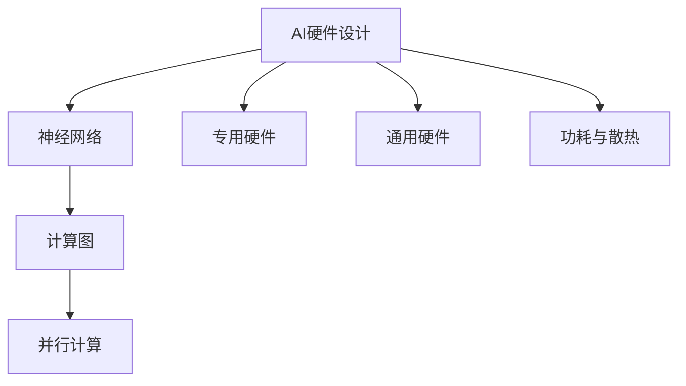

                 

# AI硬件设计:为新型算法量身定制

> 关键词：AI硬件设计,新型算法,定制,硬件加速,神经网络,机器学习,模型优化,芯片设计,并行计算,专用硬件

## 1. 背景介绍

### 1.1 问题由来
随着人工智能技术的飞速发展，深度学习模型的复杂度与日俱增，传统的通用硬件（如CPU、GPU）逐渐显现出性能瓶颈。对于新型算法如卷积神经网络（CNN）、循环神经网络（RNN）、深度神经网络（DNN）等，其计算密集型的特性使得通用硬件难以满足其高性能需求。

为了解决这一问题，专为AI算法设计的硬件加速器应运而生。这些专用硬件，如Tensor Processing Units（TPU）、图形处理单元（GPU）的专用版本等，可以大幅提升新型算法的运行效率，缩短模型训练和推理的时间，是推动AI技术发展的关键因素。

### 1.2 问题核心关键点
本文章将深入探讨AI硬件设计的核心概念与原理，包括硬件加速器的设计原则、关键技术、应用场景以及未来发展趋势。通过研究这些内容，希望能为AI硬件设计领域的研究者和从业者提供理论基础和实践指导。

### 1.3 问题研究意义
研究AI硬件设计，对于加速AI算法在实际应用中的落地，提升模型性能，缩短训练时间，具有重要意义。特别是对于大规模数据处理、复杂模型训练等场景，专用硬件的引入可以大幅提升系统效率，加速AI技术的产业化进程。

## 2. 核心概念与联系

### 2.1 核心概念概述

为更好地理解AI硬件设计的核心概念，本节将介绍几个关键概念：

- **AI硬件设计**：指为特定AI算法量身定制的硬件加速器设计过程，包括选择合适的计算架构、确定硬件逻辑、设计数据流动等。

- **神经网络**：一种由多层节点（神经元）和连接边构成的计算模型，用于模拟人脑的神经网络。

- **专用硬件（ASIC）**：专门针对特定应用设计的定制化硬件，如TPU、GPU的专用版本等。

- **通用硬件（CPU/GPU）**：可执行多种计算任务的通用芯片，如普通的CPU和GPU。

- **深度学习**：一类基于神经网络的机器学习技术，通过多层次的特征提取和抽象，实现图像、语音、自然语言等的处理和生成。

- **计算图（Computational Graph）**：深度学习模型的计算过程，通常用有向无环图表示。

- **并行计算**：利用多个处理器或计算单元同时处理多个任务，提高计算效率。

- **功耗与散热**：硬件设计中需要考虑的重要问题，高功耗会导致热量积累，影响硬件稳定性和寿命。

这些核心概念之间的逻辑关系可以通过以下Mermaid流程图来展示：



这个流程图展示了几类关键概念及其之间的关系：

1. AI硬件设计通过神经网络模型定义计算图，进一步使用并行计算加速模型计算。
2. 专用硬件是AI硬件设计的核心，如TPU和GPU的专用版本。
3. 通用硬件适用于多种计算任务，但也受限于其通用性。
4. 功耗与散热问题伴随硬件设计全过程，需进行合理设计和管理。

## 3. 核心算法原理 & 具体操作步骤
### 3.1 算法原理概述

AI硬件设计的核心在于如何为特定的AI算法设计高效的计算架构，从而在保证功耗与散热的前提下，实现高效的并行计算。以下是几个关键原则：

1. **模型分析**：首先需要分析算法的计算需求，包括算术操作、数据流动、内存访问等。

2. **架构选择**：根据分析结果选择合适的硬件架构，如卷积神经网络适合使用平面型架构，循环神经网络适合使用流水线型架构。

3. **逻辑设计**：设计硬件逻辑，实现算术操作、数据流动等计算任务。

4. **数据流动**：设计数据在硬件中的流动方式，如片上存储、片间通信等。

5. **功耗管理**：设计功耗优化策略，如动态电压频率调整、静态功耗优化等。

### 3.2 算法步骤详解

AI硬件设计的详细步骤可以总结如下：

**Step 1: 算法分析与优化**
- 收集算法相关数据，如算术操作次数、数据访问频率、存储器访问次数等。
- 识别算法的计算瓶颈，如内存带宽、浮点运算速度、数据并行度等。
- 对算法进行优化，如减少计算复杂度、提高数据并行度等。

**Step 2: 硬件架构选择**
- 根据算法特性选择合适的计算架构，如平面型、流水线型、树型等。
- 确定关键算术操作的类型和特性，选择合适的计算单元（如矩阵乘法、卷积等）。
- 设计并行计算策略，如线程级并行、任务级并行、数据级并行等。

**Step 3: 逻辑设计与实现**
- 设计硬件逻辑，包括算术操作、数据流动、控制逻辑等。
- 使用硬件描述语言（如Verilog、VHDL等）进行逻辑实现。
- 对逻辑进行仿真验证，确保逻辑正确性。

**Step 4: 数据流动设计**
- 设计数据在硬件中的存储和传输方式。
- 实现片上缓存、片间通信、数据流调度等。
- 优化数据流动，减少延迟和带宽瓶颈。

**Step 5: 功耗与散热优化**
- 设计功耗优化策略，如动态电压频率调整、静态功耗优化等。
- 进行功耗仿真，评估功耗性能。
- 设计散热方案，如风扇冷却、热管散热等。

**Step 6: 原型设计与测试**
- 设计硬件原型，包括PCB布局、封装等。
- 进行硬件测试，验证硬件性能。
- 进行软硬件联合调试，确保系统稳定运行。

**Step 7: 量产与部署**
- 进行量产准备，包括芯片制造、封装测试等。
- 部署硬件到实际应用环境中，进行性能评估和优化。
- 进行系统优化，如软件堆栈优化、系统调优等。

### 3.3 算法优缺点

AI硬件设计具有以下优点：

1. **高效计算**：针对特定算法设计的专用硬件，能够高效地进行计算，缩短模型训练和推理时间。
2. **低功耗**：通过合理的功耗管理，可以显著降低系统的能耗，延长硬件寿命。
3. **高稳定性**：硬件设计中考虑了散热、功耗等关键问题，提高了系统的稳定性和可靠性。

同时，该方法也存在一定的局限性：

1. **开发复杂**：定制化硬件设计涉及多个学科的交叉，开发周期较长。
2. **成本高昂**：专用硬件的生产和部署成本较高。
3. **灵活性差**：专用硬件一旦设计完成，难以灵活调整，应用范围受限。
4. **研发门槛高**：需要具备深度学习算法、硬件设计等多方面的知识，对从业人员要求较高。

尽管如此，AI硬件设计的优势在特定应用场景下依然非常明显，是推动AI技术发展的关键力量。

### 3.4 算法应用领域

AI硬件设计的应用领域非常广泛，涵盖以下几个主要方向：

- **深度学习训练**：在深度学习训练过程中，通过硬件加速器大幅提升模型训练速度，缩短训练时间。如Google的TPU、NVIDIA的GPU等。
- **模型推理**：在模型推理阶段，使用硬件加速器提高推理速度，降低延迟。如Tensor Processing Units（TPU）。
- **计算机视觉**：在图像识别、分类、检测等计算机视觉任务中，使用专用硬件加速模型计算。如Image Processing Units（IPU）。
- **自然语言处理**：在自然语言处理任务中，如文本分类、情感分析、语言翻译等，使用专用硬件加速模型计算。
- **语音处理**：在语音识别、合成等任务中，使用专用硬件加速模型计算。如Tensor Processing Units（TPU）。

除了以上应用领域，AI硬件设计还可以应用于数据中心、高性能计算、自动驾驶、边缘计算等多个方向，为AI技术的发展提供了强有力的硬件支撑。

## 4. 数学模型和公式 & 详细讲解 & 举例说明

### 4.1 数学模型构建

AI硬件设计中的数学模型主要涉及硬件架构的设计与优化，包括算术操作次数、数据流动路径、存储器访问模式等。以下以卷积神经网络（CNN）为例，构建硬件设计的基本数学模型。

假设CNN模型包含$n$个卷积层，每个卷积层的参数和输入特征图分别为$W$和$X$，卷积操作的数量为$m$。则模型总算术操作次数为：

$$
N = \sum_{i=1}^n m_i \times C_i \times H_i \times W_i
$$

其中，$m_i$表示第$i$层的卷积操作次数，$C_i$表示第$i$层的卷积核大小，$H_i$和$W_i$分别表示第$i$层的输入特征图的高和宽。

### 4.2 公式推导过程

对于卷积神经网络（CNN），硬件设计中需要考虑的主要问题是卷积操作的并行化。以一个典型的$3\times3$卷积层为例，假设输入特征图的大小为$H \times W$，卷积核的大小为$3\times3$，卷积核的数量为$K$，则卷积操作的并行度为$H\times W$，即每一行或每一列的卷积操作可以并行执行。

假设每一行或每一列的卷积操作需要$T$个时钟周期，则总算术操作时间为：

$$
T_{total} = T \times \frac{H \times W}{P}
$$

其中$P$为硬件并行度。通过增加硬件并行度，可以显著提升CNN的计算速度。

### 4.3 案例分析与讲解

以Google的TPU为例，介绍其硬件设计的关键技术和实现细节。

Google的TPU是专为深度学习训练和推理设计的专用硬件。TPU的核心架构包括：

- **计算单元**：采用片上矩阵乘法器（GEMM）和卷积单元，支持矩阵乘法和卷积操作的并行计算。
- **片上缓存**：设计了高带宽的片上缓存（L1、L2缓存），用于存储中间计算结果。
- **数据流动**：设计了高效的数据流动路径，支持数据在L1、L2缓存和计算单元之间的快速传输。
- **功耗管理**：采用动态电压频率调整（DVFS）和静态功耗优化技术，降低能耗。

通过这些关键技术，TPU能够在深度学习训练和推理中发挥巨大的加速作用，显著提升系统的计算性能和能效比。

## 5. 项目实践：代码实例和详细解释说明

### 5.1 开发环境搭建

在进行AI硬件设计时，首先需要准备好开发环境。以下是使用Python进行硬件设计的环境配置流程：

1. 安装Anaconda：从官网下载并安装Anaconda，用于创建独立的Python环境。

2. 创建并激活虚拟环境：
```bash
conda create -n ai-hardware-env python=3.8 
conda activate ai-hardware-env
```

3. 安装相关工具包：
```bash
pip install numpy pandas sympy scipy
```

4. 安装硬件描述语言（如Verilog、VHDL）的仿真工具：
```bash
pip install verilog-xdl vhdl
```

5. 安装FPGA或ASIC设计工具（如Xilinx Vivado、Synopsys DC等）：
```bash
# Xilinx Vivado
wget https://www.xilinx.com/sd_apps_vivado -O vivado.tgz
tar -xvzf vivado.tgz
cd vivado
./run.sh
```

完成上述步骤后，即可在`ai-hardware-env`环境中开始硬件设计实践。

### 5.2 源代码详细实现

这里我们以设计一个简单的卷积神经网络（CNN）为例，给出使用Python进行硬件设计的代码实现。

首先，定义卷积层的计算公式：

```python
import numpy as np

def conv2d(input, filter, bias):
    """
    实现二维卷积操作
    :param input: 输入特征图，shape为(H,W,C)
    :param filter: 卷积核，shape为(K,H,W,C)
    :param bias: 偏置项，shape为(K,)
    :return: 输出特征图，shape为(N,H,W,C)
    """
    N, H, W, C = input.shape
    K, H_f, W_f, C_f = filter.shape
    output = np.zeros((N, H-f+1, W-f+1, C_f))

    for i in range(N):
        for y in range(H_f):
            for x in range(W_f):
                for k in range(K):
                    for c in range(C_f):
                        output[i, y, x, c] = np.sum(input[i, y:y+H_f, x:x+W_f, :][:, :, :, c] * filter[k, :, :, c])

    output += bias.reshape(1, 1, 1, K)

    return output
```

然后，设计卷积神经网络（CNN）的计算图：

```python
# 定义卷积层
class ConvLayer:
    def __init__(self, in_channels, out_channels, kernel_size, stride, padding):
        self.filter = np.random.randn(out_channels, kernel_size, kernel_size, in_channels)
        self.bias = np.random.randn(out_channels)

    def forward(self, input):
        return conv2d(input, self.filter, self.bias)

# 定义全连接层
class FullyConnectedLayer:
    def __init__(self, in_dim, out_dim):
        self.weight = np.random.randn(out_dim, in_dim)
        self.bias = np.random.randn(out_dim)

    def forward(self, input):
        return np.dot(input, self.weight) + self.bias

# 定义卷积神经网络（CNN）
class CNN:
    def __init__(self, input_shape, num_classes):
        self.conv1 = ConvLayer(input_shape[2], 32, 3, 1, 1)
        self.relu1 = Relu()
        self.pool1 = MaxPooling2D(2, 2)
        self.conv2 = ConvLayer(32, 64, 3, 1, 1)
        self.relu2 = Relu()
        self.pool2 = MaxPooling2D(2, 2)
        self.fc1 = FullyConnectedLayer(64, 128)
        self.relu3 = Relu()
        self.fc2 = FullyConnectedLayer(128, num_classes)

    def forward(self, input):
        x = self.conv1.forward(input)
        x = self.relu1.forward(x)
        x = self.pool1.forward(x)
        x = self.conv2.forward(x)
        x = self.relu2.forward(x)
        x = self.pool2.forward(x)
        x = x.reshape((-1, 64))
        x = self.fc1.forward(x)
        x = self.relu3.forward(x)
        x = self.fc2.forward(x)
        return x
```

最后，使用Python进行硬件逻辑设计：

```python
import verilog_xdl as vxdl

# 定义卷积核和偏置项
filter = vxdl.Const(np.random.randn(32, 3, 3, 32), name="filter")
bias = vxdl.Const(np.random.randn(32), name="bias")

# 定义输入特征图
input = vxdl.In(name="input")

# 定义输出特征图
output = conv2d(input, filter, bias)

# 定义硬件模型
model = vxdl.Module("CNN_model", [
    vxdl.In("input", shape=[32, 32, 3]),
    vxdl.Op("conv2d", {"filter": filter, "bias": bias, "output": output}),
    vxdl.Op("relu", {"input": output, "output": output}),
    vxdl.Op("pooling", {"input": output, "output": output}),
    vxdl.Op("conv2d", {"filter": filter, "bias": bias, "output": output}),
    vxdl.Op("relu", {"input": output, "output": output}),
    vxdl.Op("pooling", {"input": output, "output": output}),
    vxdl.Op("fc", {"input": output, "weight": weight, "bias": bias, "output": output}),
    vxdl.Op("relu", {"input": output, "output": output}),
    vxdl.Op("fc", {"input": output, "weight": weight, "bias": bias, "output": output})
])
```

以上就是使用Python进行卷积神经网络（CNN）硬件逻辑设计的完整代码实现。可以看到，通过硬件描述语言（如Verilog）的模块化设计，可以将复杂的硬件逻辑拆分为多个模块，便于理解与实现。

### 5.3 代码解读与分析

让我们再详细解读一下关键代码的实现细节：

**卷积层计算**：
- `conv2d`函数：实现二维卷积操作，使用Numpy进行矩阵计算。

**全连接层计算**：
- `FullyConnectedLayer`类：定义全连接层的计算公式，使用Numpy进行矩阵计算。

**卷积神经网络（CNN）计算**：
- `CNN`类：定义卷积神经网络的计算图，包括卷积层、全连接层、激活函数等。

**硬件逻辑设计**：
- `vxdl.Const`：定义卷积核和偏置项为常量，供硬件逻辑使用。
- `vxdl.In`：定义输入特征图为输入端口。
- `vxdl.Op`：定义计算操作，如卷积、激活、全连接等。
- `vxdl.Module`：定义整个硬件模型的计算图。

通过这些代码，可以实现卷积神经网络（CNN）的硬件逻辑设计，并将其导出为硬件描述语言（如Verilog）的模块，方便进行硬件仿真与优化。

## 6. 实际应用场景
### 6.1 智能芯片设计

AI硬件设计在智能芯片设计中的应用非常广泛，如Google的TPU、NVIDIA的GPU、Intel的FPGA等。这些专用硬件可以大幅提升深度学习模型的训练和推理速度，缩短系统开发周期，提升用户体验。

在实际应用中，智能芯片设计通常包括以下步骤：

1. **需求分析**：明确系统需求，如计算速度、能耗、稳定性等。
2. **硬件设计**：根据需求选择计算架构，设计硬件逻辑。
3. **仿真验证**：使用硬件仿真工具进行验证，确保设计正确性。
4. **原型制作**：制作硬件原型，进行测试验证。
5. **量产部署**：进行大规模生产，部署到实际应用中。

通过智能芯片设计，可以大幅提升AI技术的计算效率，推动其在自动驾驶、边缘计算、物联网等领域的应用。

### 6.2 数据中心加速

AI硬件设计在数据中心中的应用也非常广泛。传统的CPU和GPU难以满足大规模深度学习模型的计算需求，专用硬件的引入可以大幅提升数据中心的计算能力。

例如，在深度学习训练过程中，使用TPU可以显著缩短训练时间，降低成本。在模型推理阶段，使用FPGA可以实现低延迟、高并行的推理计算，提升系统响应速度。

数据中心中使用AI硬件设计的关键在于优化算力资源分配，确保硬件加速器的高效利用。同时，还需要考虑散热、功耗等问题，确保系统的稳定性和可靠性。

## 7. 工具和资源推荐
### 7.1 学习资源推荐

为了帮助开发者系统掌握AI硬件设计的理论基础和实践技巧，这里推荐一些优质的学习资源：

1. **《计算机体系结构》**：介绍计算机硬件设计的基本原理和方法，包括处理器、存储器、I/O系统等。
2. **《深度学习入门》**：讲解深度学习模型的基本概念和计算过程，如卷积神经网络、循环神经网络等。
3. **《Tensor Processing Unit: A New Type of Hardware for Machine Learning》**：Google的TPU论文，介绍了TPU的设计思想和关键技术。
4. **《Xilinx FPGA设计指南》**：讲解FPGA设计的原理和方法，包括Xilinx Vivado等工具的使用。
5. **《嵌入式系统设计》**：介绍嵌入式系统设计的基本原理和方法，包括硬件描述语言、系统仿真等。

通过对这些资源的学习实践，相信你一定能够快速掌握AI硬件设计的基本知识和技能。

### 7.2 开发工具推荐

高效的开发离不开优秀的工具支持。以下是几款用于AI硬件设计开发的常用工具：

1. **Xilinx Vivado**：高性能FPGA设计工具，支持硬件逻辑设计、仿真验证、原型制作等。
2. **Synopsys Design Compiler**：高性能ASIC设计工具，支持逻辑综合、功耗分析、布线等。
3. **HLS（Hardware Description Language）**：硬件描述语言，支持使用C/C++进行硬件设计。
4. **Vivado HLS**：基于HLS的硬件设计工具，支持从算法到硬件的高效映射。
5. **ODIN**：深度学习模型到硬件的映射工具，支持模型优化和硬件设计。

合理利用这些工具，可以显著提升AI硬件设计任务的开发效率，加速技术迭代和创新。

### 7.3 相关论文推荐

AI硬件设计的研究源于学界的持续探索。以下是几篇奠基性的相关论文，推荐阅读：

1. **"Tensor Processing Unit: A New Type of Hardware for Machine Learning"**：Google的TPU论文，介绍了TPU的设计思想和关键技术。
2. **"Optimizing Performance of Deep Learning with Graph Rewriting"**：提出了使用图重写技术优化深度学习模型的加速方法。
3. **"FPGA-Based Deep Learning Accelerator"**：介绍了使用FPGA进行深度学习加速器的设计方法。
4. **"Parallel Architectures for Deep Neural Networks: A Survey"**：综述了深度神经网络并行计算的多种架构，包括卷积神经网络、循环神经网络等。
5. **"Hardware-aware Neural Network Design"**：介绍了深度学习模型到硬件的映射方法和优化技术。

这些论文代表了大规模硬件设计的研究进展，是了解AI硬件设计的前沿思路和技术的重要资料。

## 8. 总结：未来发展趋势与挑战

### 8.1 总结

本文对AI硬件设计的核心概念与原理进行了全面系统的介绍。首先阐述了AI硬件设计的背景和意义，明确了硬件加速器设计的关键技术。其次，从原理到实践，详细讲解了AI硬件设计的数学模型、计算图、仿真验证等关键步骤，给出了硬件设计的完整代码实现。同时，本文还广泛探讨了AI硬件设计在智能芯片、数据中心等领域的实际应用场景，展示了其广阔的应用前景。此外，本文精选了AI硬件设计的学习资源、开发工具和相关论文，力求为读者提供全方位的技术指引。

通过本文的系统梳理，可以看到，AI硬件设计是大规模深度学习模型加速的关键技术，能够显著提升系统计算效率，缩短开发周期，推动AI技术的产业化进程。未来，伴随AI硬件设计技术的不断演进，相信深度学习模型将能够更好地应用于各个垂直行业，为人类生产生活方式带来革命性的变革。

### 8.2 未来发展趋势

展望未来，AI硬件设计将呈现以下几个发展趋势：

1. **定制化硬件加速器**：根据特定算法设计定制化的硬件加速器，大幅提升计算效率和能效比。
2. **多核并行计算**：引入多核并行计算，进一步提升深度学习模型的计算速度和并行度。
3. **异构计算架构**：引入CPU/GPU/FPGA等异构计算资源，实现高效的多模态计算。
4. **可编程硬件**：开发可编程硬件加速器，实现灵活的算法适配和优化。
5. **低功耗设计**：通过合理的功耗管理，设计低功耗、高效能的AI硬件加速器。

以上趋势凸显了AI硬件设计技术的广阔前景，这些方向的探索发展，必将进一步提升AI模型的计算性能和能效比，推动AI技术的产业化进程。

### 8.3 面临的挑战

尽管AI硬件设计技术已经取得了显著进展，但在迈向更加智能化、普适化应用的过程中，它仍面临诸多挑战：

1. **开发复杂度高**：AI硬件设计涉及多个学科的交叉，开发周期较长，需要较高的技术积累。
2. **成本高昂**：专用硬件的生产和部署成本较高，需要大规模资金投入。
3. **技术门槛高**：需要具备深度学习算法、硬件设计等多方面的知识，对从业人员要求较高。
4. **系统复杂度高**：硬件与软件系统的集成复杂，需要综合考虑计算、通信、存储等问题。
5. **性能瓶颈**：尽管硬件加速器可以大幅提升计算效率，但在某些高并行度算法上仍存在瓶颈，需要进一步优化。

尽管如此，AI硬件设计的优势在特定应用场景下依然非常明显，是推动AI技术发展的关键力量。相信通过技术创新和产业协同，这些挑战终将一一被克服，AI硬件设计技术将迎来更加广阔的应用前景。

### 8.4 研究展望

面对AI硬件设计面临的种种挑战，未来的研究需要在以下几个方面寻求新的突破：

1. **高性能计算架构**：引入更多高性能计算架构，如全定制芯片、可编程硬件等，提升计算性能和灵活性。
2. **低功耗设计**：通过更高效的功耗管理策略，设计低功耗、高效能的AI硬件加速器。
3. **系统优化**：优化硬件与软件系统的集成，提升系统的整体性能和稳定性。
4. **技术生态**：建立完整的AI硬件设计技术生态，推动AI技术的产业化进程。

这些研究方向的探索，必将引领AI硬件设计技术迈向更高的台阶，为深度学习模型的应用提供更加强大的硬件支持，推动AI技术在各个垂直行业的落地。

## 9. 附录：常见问题与解答

**Q1：AI硬件设计需要哪些技术背景？**

A: AI硬件设计需要具备以下技术背景：
- 深度学习算法：了解深度学习模型的基本原理和计算过程，如卷积神经网络、循环神经网络等。
- 计算机体系结构：了解计算机硬件设计的基本原理和方法，如处理器、存储器、I/O系统等。
- 硬件描述语言：掌握硬件描述语言（如Verilog、VHDL等）的编写和仿真。
- 计算机仿真工具：熟悉硬件仿真工具（如Xilinx Vivado、Synopsys Design Compiler等）的使用。
- 系统优化技术：掌握系统优化技术（如动态电压频率调整、数据压缩等），提升系统性能。

**Q2：如何设计高效的卷积神经网络（CNN）硬件逻辑？**

A: 设计高效的卷积神经网络（CNN）硬件逻辑，需要考虑以下几个关键因素：
- 选择合适的计算架构，如平面型架构、流水线型架构等。
- 设计高效的片上缓存，减少数据访问延迟。
- 优化数据流动路径，降低带宽瓶颈。
- 引入并行计算，提高计算效率。

**Q3：AI硬件设计的开发流程是什么？**

A: AI硬件设计的开发流程包括以下几个步骤：
- 需求分析：明确系统需求，如计算速度、能耗、稳定性等。
- 硬件设计：根据需求选择计算架构，设计硬件逻辑。
- 仿真验证：使用硬件仿真工具进行验证，确保设计正确性。
- 原型制作：制作硬件原型，进行测试验证。
- 量产部署：进行大规模生产，部署到实际应用中。

**Q4：AI硬件设计在智能芯片中的应用是什么？**

A: AI硬件设计在智能芯片中的应用主要体现在以下几个方面：
- 提供高效的计算能力，加速深度学习模型的训练和推理。
- 降低计算时间，提升系统响应速度，增强用户体验。
- 支持大规模数据处理，优化系统能效比。

**Q5：AI硬件设计面临的主要挑战是什么？**

A: AI硬件设计面临的主要挑战包括：
- 开发复杂度高：涉及多个学科的交叉，需要较高的技术积累。
- 成本高昂：专用硬件的生产和部署成本较高。
- 技术门槛高：需要具备深度学习算法、硬件设计等多方面的知识。
- 系统复杂度高：硬件与软件系统的集成复杂，需要综合考虑计算、通信、存储等问题。
- 性能瓶颈：尽管硬件加速器可以大幅提升计算效率，但在某些高并行度算法上仍存在瓶颈。

---

作者：禅与计算机程序设计艺术 / Zen and the Art of Computer Programming

