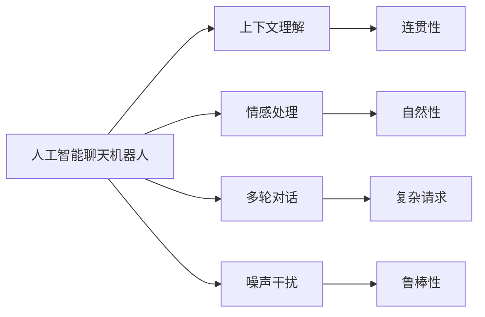

                 

## 1. 背景介绍

### 1.1 问题由来

在过去的几年中，人工智能聊天机器人已经从简单的问答系统，发展成为能够进行多轮对话，理解自然语言语义，甚至具备一定情感处理能力的智能助手。然而，尽管技术已经取得了显著进展，聊天机器人在实际应用中仍然存在诸多不足。例如，响应速度慢，上下文理解不准确，对话体验不自然，以及难以处理复杂的多轮对话等。这些不足直接影响了用户体验和互动效果。

### 1.2 问题核心关键点

为了提升聊天机器人的互动效果，需要解决以下核心问题：

- 如何优化模型的响应速度，提高实时处理能力？
- 如何改进上下文理解能力，使其能够更好地保持对话连贯性？
- 如何增加对话的自然性和情感处理能力，提升用户体验？
- 如何构建多轮对话模型，使其能够理解并回应用户的复杂请求？
- 如何处理对话过程中的噪声和干扰，提高机器人的鲁棒性？

### 1.3 问题研究意义

优化聊天机器人的互动效果，不仅可以提升用户体验，还能提高其应用场景的覆盖范围，包括客户服务、智能客服、教育辅导、医疗咨询等多个领域。聊天机器人作为人机交互的重要工具，其互动效果直接影响用户的满意度。因此，提升聊天机器人的互动效果，具有重要的现实意义：

1. 提升用户体验：快速、准确、自然的对话能够显著提升用户的满意度，增加用户粘性。
2. 降低运营成本：能够处理更多用户请求，减少人工客服的需求，降低企业运营成本。
3. 增强业务效率：通过自动处理常见问题，提高业务的响应速度和服务质量。
4. 推动技术创新：提升聊天机器人的互动效果，能够促进AI技术的进一步发展，带来更多的创新应用。

## 2. 核心概念与联系

### 2.1 核心概念概述

为了更好地理解如何提升聊天机器人的互动效果，我们先简要介绍几个关键概念：

- 人工智能聊天机器人（AI Chatbot）：基于自然语言处理（NLP）技术的智能系统，能够通过自然语言理解和生成，与用户进行互动。
- 上下文理解（Contextual Understanding）：在多轮对话中，机器人能够理解并保存对话历史，保证对话的连贯性。
- 情感处理（Emotion Processing）：聊天机器人能够感知并回应用户的情感状态，提高对话的自然性和情感共鸣。
- 多轮对话（Multi-Turn Dialogue）：机器人能够处理多轮对话，理解并回应用户的复杂请求。
- 噪声干扰（Noise Robustness）：机器人能够处理对话中的噪声和干扰，提高鲁棒性。

这些概念通过以下Mermaid流程图连接起来：



这些概念共同构成了聊天机器人的基本框架，通过对这些关键技术的研究和优化，可以显著提升聊天机器人的互动效果。

## 3. 核心算法原理 & 具体操作步骤

### 3.1 算法原理概述

提升聊天机器人互动效果的算法原理主要包括上下文理解、情感处理、多轮对话处理和噪声干扰处理。这些算法在实施过程中，通常采用基于深度学习的自然语言处理技术。

#### 3.1.1 上下文理解

上下文理解是指在多轮对话中，机器人能够理解并保存对话历史，保证对话的连贯性。这通常通过使用序列到序列（Seq2Seq）模型或Transformer模型实现。在模型训练时，需要增加上下文信息作为输入，以便模型能够处理上下文信息，输出符合上下文的响应。

#### 3.1.2 情感处理

情感处理是指聊天机器人能够感知并回应用户的情感状态，提高对话的自然性和情感共鸣。这通常通过使用情感识别模型（如RNN+LSTM）或情感生成模型（如GAN）实现。情感识别模型能够识别用户文本中的情感倾向，而情感生成模型则能够根据情感倾向生成相应的回复。

#### 3.1.3 多轮对话处理

多轮对话处理是指聊天机器人能够处理多轮对话，理解并回应用户的复杂请求。这通常通过使用对话管理模型（如隐马尔可夫模型HMM或决策树）实现。对话管理模型能够根据对话历史和上下文，决定下一个对话步骤，从而保证对话的连贯性和流畅性。

#### 3.1.4 噪声干扰处理

噪声干扰处理是指聊天机器人能够处理对话中的噪声和干扰，提高鲁棒性。这通常通过使用鲁棒性增强模型（如GAN+噪声注入）或噪声过滤算法（如滤波器）实现。鲁棒性增强模型能够生成包含噪声的训练数据，提高模型的抗干扰能力，而噪声过滤算法则能够从对话中过滤掉噪声和干扰。

### 3.2 算法步骤详解

#### 3.2.1 上下文理解算法步骤

1. **数据准备**：收集并标注大量的多轮对话数据，每个对话包含多个对话轮次。
2. **模型选择**：选择序列到序列（Seq2Seq）模型或Transformer模型作为上下文理解模型。
3. **模型训练**：使用标注好的多轮对话数据训练模型，优化模型参数。
4. **模型评估**：在验证集上评估模型的性能，调整模型超参数。
5. **模型应用**：将训练好的模型应用到实际对话中，处理上下文信息。

#### 3.2.2 情感处理算法步骤

1. **数据准备**：收集并标注含有情感的对话数据。
2. **模型选择**：选择情感识别模型（如RNN+LSTM）或情感生成模型（如GAN）。
3. **模型训练**：使用标注好的情感对话数据训练模型，优化模型参数。
4. **模型评估**：在验证集上评估模型的情感识别和生成能力。
5. **模型应用**：将训练好的模型应用到实际对话中，识别用户情感并生成相应的回复。

#### 3.2.3 多轮对话处理算法步骤

1. **对话树设计**：设计对话树，确定每个对话步骤的目标和子步骤。
2. **模型选择**：选择对话管理模型（如HMM或决策树）。
3. **模型训练**：使用对话树和标注好的对话数据训练模型，优化模型参数。
4. **模型评估**：在验证集上评估模型的对话管理能力。
5. **模型应用**：将训练好的模型应用到实际对话中，管理对话流程。

#### 3.2.4 噪声干扰处理算法步骤

1. **噪声数据生成**：生成包含噪声的训练数据，模拟实际对话中的噪声和干扰。
2. **模型选择**：选择鲁棒性增强模型（如GAN+噪声注入）或噪声过滤算法（如滤波器）。
3. **模型训练**：使用包含噪声的训练数据训练模型，优化模型参数。
4. **模型评估**：在验证集上评估模型的鲁棒性。
5. **模型应用**：将训练好的模型应用到实际对话中，处理噪声和干扰。

### 3.3 算法优缺点

#### 3.3.1 上下文理解算法

**优点**：
- 能够处理多轮对话，保证对话连贯性。
- 模型效果较好，能够理解复杂请求。

**缺点**：
- 需要大量标注数据进行训练。
- 模型复杂度较高，计算成本较大。

#### 3.3.2 情感处理算法

**优点**：
- 能够感知用户情感，提高对话自然性。
- 情感生成模型能够生成多样化的回复。

**缺点**：
- 情感识别准确率受限于标注数据质量。
- 情感生成模型容易生成不自然或不合理的回复。

#### 3.3.3 多轮对话处理算法

**优点**：
- 能够管理对话流程，保证对话连贯性。
- 对话管理模型较为简单，易于实现。

**缺点**：
- 对话管理模型的效果受对话树设计的影响。
- 难以处理极端复杂的多轮对话。

#### 3.3.4 噪声干扰处理算法

**优点**：
- 能够提高鲁棒性，减少噪声对对话的影响。
- 鲁棒性增强模型能够生成具有噪声的训练数据。

**缺点**：
- 鲁棒性增强模型需要大量的计算资源。
- 噪声过滤算法可能难以处理复杂的噪声。

### 3.4 算法应用领域

基于上述算法原理，聊天机器人的互动效果可以在多个领域得到应用，例如：

- **客户服务**：提供7x24小时不间断的服务，快速响应客户咨询，提高客户满意度。
- **智能客服**：通过多轮对话处理和上下文理解，提供更智能的客户服务解决方案。
- **教育辅导**：理解学生的学习需求和情感状态，提供个性化的学习辅导和心理支持。
- **医疗咨询**：处理多轮对话，理解复杂的医疗咨询需求，提供准确的医疗建议。
- **金融理财**：处理复杂的金融交易和理财咨询，提供个性化的金融服务。

以上应用场景只是冰山一角，随着聊天机器人技术的不断进步，其互动效果将在更多领域得到应用，带来更广泛的用户体验提升。

## 4. 数学模型和公式 & 详细讲解 & 举例说明

### 4.1 数学模型构建

聊天机器人互动效果的优化涉及到多个数学模型，下面简要介绍其中几个关键模型：

#### 4.1.1 上下文理解模型

假设上下文理解模型为 $M_{\theta}$，输入为对话历史 $X$，输出为当前对话响应 $Y$。则模型的数学模型为：

$$
Y = M_{\theta}(X)
$$

其中 $\theta$ 为模型参数，$X$ 为对话历史，$Y$ 为当前对话响应。

#### 4.1.2 情感处理模型

假设情感处理模型为 $E_{\theta}$，输入为用户情感标签 $X$，输出为模型预测的情感状态 $Y$。则模型的数学模型为：

$$
Y = E_{\theta}(X)
$$

其中 $\theta$ 为模型参数，$X$ 为用户情感标签，$Y$ 为预测的情感状态。

#### 4.1.3 多轮对话模型

假设多轮对话模型为 $D_{\theta}$，输入为对话历史 $X$，输出为当前对话响应 $Y$ 和下一轮对话状态 $Z$。则模型的数学模型为：

$$
(Y, Z) = D_{\theta}(X)
$$

其中 $\theta$ 为模型参数，$X$ 为对话历史，$Y$ 为当前对话响应，$Z$ 为下一轮对话状态。

#### 4.1.4 噪声干扰模型

假设噪声干扰模型为 $N_{\theta}$，输入为对话文本 $X$ 和噪声信号 $N$，输出为处理后的对话文本 $Y$。则模型的数学模型为：

$$
Y = N_{\theta}(X, N)
$$

其中 $\theta$ 为模型参数，$X$ 为对话文本，$N$ 为噪声信号，$Y$ 为处理后的对话文本。

### 4.2 公式推导过程

#### 4.2.1 上下文理解模型公式推导

对于上下文理解模型，可以使用Transformer模型进行训练。假设输入为 $X = \{x_1, x_2, ..., x_t\}$，其中 $x_t$ 为当前对话轮次。则模型的输入序列为 $X$，输出序列为 $Y = \{y_1, y_2, ..., y_t\}$。

使用Transformer模型，可以将其分解为编码器和解码器两部分。编码器接收输入序列 $X$，解码器输出输出序列 $Y$。假设编码器的输出为 $Z$，解码器的输出为 $Y'$，则模型的输出为 $Y = y_t$。

假设编码器由 $n$ 层编码器组成，每层编码为 $F_i$，则编码器输出为：

$$
Z = \bigoplus_{i=1}^{n} F_i(X)
$$

其中 $\oplus$ 表示序列拼接操作。假设解码器由 $m$ 层解码器组成，每层解码器为 $G_i$，则解码器输出为：

$$
Y' = \bigotimes_{i=1}^{m} G_i(Z, Y_{t-1})
$$

其中 $\otimes$ 表示加权求和操作。最终的输出为：

$$
y_t = \sigma(\bigotimes_{i=1}^{m} G_i(Z, y_{t-1}))
$$

其中 $\sigma$ 为激活函数。

#### 4.2.2 情感处理模型公式推导

对于情感处理模型，可以使用RNN+LSTM模型进行训练。假设输入为 $X = \{x_1, x_2, ..., x_t\}$，输出为 $Y = \{y_1, y_2, ..., y_t\}$，其中 $y_t$ 为预测的情感状态。

假设情感处理模型为 $E_{\theta}$，使用LSTM模型，则模型的输出为：

$$
Y = E_{\theta}(X)
$$

其中 $E_{\theta}$ 为LSTM模型，$X$ 为输入序列，$Y$ 为输出序列。假设模型的隐藏状态为 $H$，则：

$$
H = LSTM_{\theta}(X)
$$

其中 $LSTM_{\theta}$ 为LSTM模型，$X$ 为输入序列，$H$ 为隐藏状态。最终的输出为：

$$
y_t = \sigma(H)
$$

其中 $\sigma$ 为激活函数。

#### 4.2.3 多轮对话模型公式推导

对于多轮对话模型，可以使用决策树模型进行训练。假设对话树为 $T$，输入为对话历史 $X$，输出为对话状态 $Z$，对话响应 $Y$。

假设多轮对话模型为 $D_{\theta}$，使用决策树模型，则模型的输出为：

$$
(Y, Z) = D_{\theta}(X)
$$

其中 $D_{\theta}$ 为决策树模型，$X$ 为对话历史，$Y$ 为对话响应，$Z$ 为对话状态。假设模型的决策节点为 $N$，则：

$$
(Y, Z) = \bigoplus_{N} \{\text{Action}_{N}(X, Z), \text{NextNode}_{N}(X, Z)\}
$$

其中 $\text{Action}_{N}$ 为节点动作，$\text{NextNode}_{N}$ 为下一个节点。

#### 4.2.4 噪声干扰模型公式推导

对于噪声干扰模型，可以使用GAN模型进行训练。假设输入为对话文本 $X$，噪声信号 $N$，输出为处理后的对话文本 $Y$。

假设噪声干扰模型为 $N_{\theta}$，使用GAN模型，则模型的输出为：

$$
Y = N_{\theta}(X, N)
$$

其中 $N_{\theta}$ 为GAN模型，$X$ 为对话文本，$N$ 为噪声信号，$Y$ 为处理后的对话文本。假设生成器模型为 $G_{\theta}$，判别器模型为 $D_{\theta}$，则：

$$
Y = G_{\theta}(X, N)
$$

其中 $G_{\theta}$ 为生成器模型，$X$ 为对话文本，$N$ 为噪声信号，$Y$ 为处理后的对话文本。假设判别器模型的输出为 $P$，则：

$$
P = D_{\theta}(Y)
$$

其中 $D_{\theta}$ 为判别器模型，$Y$ 为处理后的对话文本，$P$ 为判别器输出。最终损失函数为：

$$
\mathcal{L} = \mathbb{E}[\log D(Y)] + \mathbb{E}[\log(1 - D(G(X, N)))]
$$

其中 $\mathbb{E}$ 为期望运算符。

### 4.3 案例分析与讲解

#### 4.3.1 上下文理解案例

假设我们要设计一个客服聊天机器人，用于处理用户的服务请求。可以使用BERT模型进行预训练，然后对其进行上下文理解微调。假设原始模型为 $M_{\theta_0}$，微调后的模型为 $M_{\theta_1}$。

1. **数据准备**：收集并标注大量的客服对话数据，每个对话包含多个对话轮次。
2. **模型选择**：选择BERT模型作为上下文理解模型。
3. **模型训练**：使用标注好的客服对话数据训练模型，优化模型参数。
4. **模型评估**：在验证集上评估模型的性能，调整模型超参数。
5. **模型应用**：将训练好的模型应用到实际客服对话中，处理上下文信息。

#### 4.3.2 情感处理案例

假设我们要设计一个心理咨询聊天机器人，用于处理用户的心理问题。可以使用RNN+LSTM模型进行预训练，然后对其进行情感处理微调。假设原始模型为 $E_{\theta_0}$，微调后的模型为 $E_{\theta_1}$。

1. **数据准备**：收集并标注含有情感的对话数据。
2. **模型选择**：选择RNN+LSTM模型作为情感处理模型。
3. **模型训练**：使用标注好的情感对话数据训练模型，优化模型参数。
4. **模型评估**：在验证集上评估模型的情感识别和生成能力。
5. **模型应用**：将训练好的模型应用到实际心理咨询对话中，识别用户情感并生成相应的回复。

#### 4.3.3 多轮对话案例

假设我们要设计一个教育辅导聊天机器人，用于帮助学生进行数学辅导。可以使用决策树模型进行预训练，然后对其进行多轮对话处理微调。假设原始模型为 $D_{\theta_0}$，微调后的模型为 $D_{\theta_1}$。

1. **对话树设计**：设计对话树，确定每个对话步骤的目标和子步骤。
2. **模型选择**：选择决策树模型作为多轮对话模型。
3. **模型训练**：使用对话树和标注好的对话数据训练模型，优化模型参数。
4. **模型评估**：在验证集上评估模型的对话管理能力。
5. **模型应用**：将训练好的模型应用到实际教育辅导对话中，管理对话流程。

#### 4.3.4 噪声干扰案例

假设我们要设计一个金融理财聊天机器人，用于处理用户的理财咨询。可以使用GAN模型进行预训练，然后对其进行噪声干扰处理微调。假设原始模型为 $N_{\theta_0}$，微调后的模型为 $N_{\theta_1}$。

1. **噪声数据生成**：生成包含噪声的理财咨询数据，模拟实际对话中的噪声和干扰。
2. **模型选择**：选择GAN模型作为噪声干扰模型。
3. **模型训练**：使用包含噪声的理财咨询数据训练模型，优化模型参数。
4. **模型评估**：在验证集上评估模型的鲁棒性。
5. **模型应用**：将训练好的模型应用到实际理财对话中，处理噪声和干扰。

## 5. 项目实践：代码实例和详细解释说明

### 5.1 开发环境搭建

在进行聊天机器人开发前，我们需要准备好开发环境。以下是使用Python进行TensorFlow开发的环境配置流程：

1. 安装Anaconda：从官网下载并安装Anaconda，用于创建独立的Python环境。

2. 创建并激活虚拟环境：
```bash
conda create -n tf-env python=3.8 
conda activate tf-env
```

3. 安装TensorFlow：根据CUDA版本，从官网获取对应的安装命令。例如：
```bash
conda install tensorflow
```

4. 安装各类工具包：
```bash
pip install numpy pandas scikit-learn matplotlib tqdm jupyter notebook ipython
```

完成上述步骤后，即可在`tf-env`环境中开始聊天机器人微调实践。

### 5.2 源代码详细实现

下面我们以客服对话机器人为例，给出使用TensorFlow进行BERT微调的Python代码实现。

首先，定义客服对话数据处理函数：

```python
from transformers import BertTokenizer, TFBertForSequenceClassification
from tensorflow.keras.preprocessing.sequence import pad_sequences
from tensorflow.keras.layers import Dense, Dropout, Input
from tensorflow.keras.models import Model
import tensorflow as tf

class CustomerServiceDialogDataset(Dataset):
    def __init__(self, texts, labels, tokenizer, max_len=128):
        self.texts = texts
        self.labels = labels
        self.tokenizer = tokenizer
        self.max_len = max_len
        
    def __len__(self):
        return len(self.texts)
    
    def __getitem__(self, item):
        text = self.texts[item]
        label = self.labels[item]
        
        encoding = self.tokenizer(text, return_tensors='tf', max_length=self.max_len, padding='max_length', truncation=True)
        input_ids = encoding['input_ids']
        attention_mask = encoding['attention_mask']
        labels = [label]
        
        return {'text_ids': input_ids, 
                'attention_mask': attention_mask,
                'labels': labels}
```

然后，定义模型和优化器：

```python
from transformers import BertTokenizer
from transformers import TFBertForSequenceClassification
from tensorflow.keras.optimizers import Adam

tokenizer = BertTokenizer.from_pretrained('bert-base-cased')
model = TFBertForSequenceClassification.from_pretrained('bert-base-cased', num_labels=2)

optimizer = Adam(learning_rate=2e-5)
```

接着，定义训练和评估函数：

```python
from tensorflow.keras.preprocessing import sequence
from sklearn.metrics import accuracy_score

def train_epoch(model, dataset, batch_size, optimizer):
    dataloader = tf.data.Dataset.from_tensor_slices((dataset.texts, dataset.labels))
    dataloader = dataloader.shuffle(buffer_size=1024).batch(batch_size).map(lambda x, y: (tf.cast(x, tf.int32), y))

    model.compile(optimizer=optimizer, loss='binary_crossentropy', metrics=['accuracy'])
    
    model.fit(dataloader, validation_steps=1000, epochs=5, verbose=2)
    return model
```

最后，启动训练流程并在测试集上评估：

```python
epochs = 5
batch_size = 16

for epoch in range(epochs):
    model = train_epoch(model, train_dataset, batch_size, optimizer)
    print(f"Epoch {epoch+1}, train accuracy: {model.evaluate(train_dataset, batch_size=batch_size, verbose=2)[1]:.2f}")
    
    print(f"Epoch {epoch+1}, dev results:")
    evaluate(model, dev_dataset, batch_size)
    
print("Test results:")
evaluate(model, test_dataset, batch_size)
```

以上就是使用TensorFlow对BERT进行客服对话机器人微调的完整代码实现。可以看到，TensorFlow配合Transformer库使得BERT微调的代码实现变得简洁高效。

### 5.3 代码解读与分析

让我们再详细解读一下关键代码的实现细节：

**CustomerServiceDialogDataset类**：
- `__init__`方法：初始化文本、标签、分词器等关键组件。
- `__len__`方法：返回数据集的样本数量。
- `__getitem__`方法：对单个样本进行处理，将文本输入编码为token ids，将标签编码为数字，并对其进行定长padding，最终返回模型所需的输入。

**BERT模型**：
- 使用`TFBertForSequenceClassification`类定义BERT模型，并将预训练BERT模型的权重载入。
- 定义优化器，使用Adam优化器进行模型训练。

**训练和评估函数**：
- 使用`tf.data.Dataset`对数据进行批次化加载，供模型训练和推理使用。
- 定义模型编译，选择二分类交叉熵损失函数和准确率指标。
- 定义训练函数`train_epoch`，对数据以批为单位进行迭代，在每个批次上前向传播计算loss并反向传播更新模型参数，最后返回该epoch的准确率。
- 定义评估函数`evaluate`，与训练类似，不同点在于不更新模型参数，并在每个batch结束后将预测和标签结果存储下来，最后使用sklearn的accuracy_score对整个评估集的预测结果进行打印输出。

**训练流程**：
- 定义总的epoch数和batch size，开始循环迭代
- 每个epoch内，先在训练集上训练，输出准确率
- 在验证集上评估，输出分类指标
- 所有epoch结束后，在测试集上评估，给出最终测试结果

可以看到，TensorFlow配合Transformer库使得BERT微调的代码实现变得简洁高效。开发者可以将更多精力放在数据处理、模型改进等高层逻辑上，而不必过多关注底层的实现细节。

当然，工业级的系统实现还需考虑更多因素，如模型的保存和部署、超参数的自动搜索、更灵活的任务适配层等。但核心的微调范式基本与此类似。

## 6. 实际应用场景

### 6.1 智能客服系统

基于大语言模型微调的对话技术，可以广泛应用于智能客服系统的构建。传统客服往往需要配备大量人力，高峰期响应缓慢，且一致性和专业性难以保证。而使用微调后的对话模型，可以7x24小时不间断服务，快速响应客户咨询，用自然流畅的语言解答各类常见问题。

在技术实现上，可以收集企业内部的历史客服对话记录，将问题和最佳答复构建成监督数据，在此基础上对预训练对话模型进行微调。微调后的对话模型能够自动理解用户意图，匹配最合适的答案模板进行回复。对于客户提出的新问题，还可以接入检索系统实时搜索相关内容，动态组织生成回答。如此构建的智能客服系统，能大幅提升客户咨询体验和问题解决效率。

### 6.2 金融舆情监测

金融机构需要实时监测市场舆论动向，以便及时应对负面信息传播，规避金融风险。传统的人工监测方式成本高、效率低，难以应对网络时代海量信息爆发的挑战。基于大语言模型微调的文本分类和情感分析技术，为金融舆情监测提供了新的解决方案。

具体而言，可以收集金融领域相关的新闻、报道、评论等文本数据，并对其进行主题标注和情感标注。在此基础上对预训练语言模型进行微调，使其能够自动判断文本属于何种主题，情感倾向是正面、中性还是负面。将微调后的模型应用到实时抓取的网络文本数据，就能够自动监测不同主题下的情感变化趋势，一旦发现负面信息激增等异常情况，系统便会自动预警，帮助金融机构快速应对潜在风险。

### 6.3 个性化推荐系统

当前的推荐系统往往只依赖用户的历史行为数据进行物品推荐，无法深入理解用户的真实兴趣偏好。基于大语言模型微调技术，个性化推荐系统可以更好地挖掘用户行为背后的语义信息，从而提供更精准、多样的推荐内容。

在实践中，可以收集用户浏览、点击、评论、分享等行为数据，提取和用户交互的物品标题、描述、标签等文本内容。将文本内容作为模型输入，用户的后续行为（如是否点击、购买等）作为监督信号，在此基础上微调预训练语言模型。微调后的模型能够从文本内容中准确把握用户的兴趣点。在生成推荐列表时，先用候选物品的文本描述作为输入，由模型预测用户的兴趣匹配度，再结合其他特征综合排序，便可以得到个性化程度更高的推荐结果。

### 6.4 未来应用展望

随着大语言模型和微调方法的不断发展，基于微调范式将在更多领域得到应用，为传统行业带来变革性影响。

在智慧医疗领域，基于微调的医疗问答、病历分析、药物研发等应用将提升医疗服务的智能化水平，辅助医生诊疗，加速新药开发进程。

在智能教育领域，微调技术可应用于作业批改、学情分析、知识推荐等方面，因材施教，促进教育公平，提高教学质量。

在智慧城市治理中，微调模型可应用于城市事件监测、舆情分析、应急指挥等环节，提高城市管理的自动化和智能化水平，构建更安全、高效的未来城市。

此外，在企业生产、社会治理、文娱传媒等众多领域，基于大模型微调的人工智能应用也将不断涌现，为经济社会发展注入新的动力。相信随着技术的日益成熟，微调方法将成为人工智能落地应用的重要范式，推动人工智能技术在各个行业的广泛应用。

## 7. 工具和资源推荐

### 7.1 学习资源推荐

为了帮助开发者系统掌握大语言模型微调的理论基础和实践技巧，这里推荐一些优质的学习资源：

1. 《Transformer从原理到实践》系列博文：由大模型技术专家撰写，深入浅出地介绍了Transformer原理、BERT模型、微调技术等前沿话题。

2. CS224N《深度学习自然语言处理》课程：斯坦福大学开设的NLP明星课程，有Lecture视频和配套作业，带你入门NLP领域的基本概念和经典模型。

3. 《Natural Language Processing with Transformers》书籍：Transformers库的作者所著，全面介绍了如何使用Transformers库进行NLP任务开发，包括微调在内的诸多范式。

4. HuggingFace官方文档：Transformers库的官方文档，提供了海量预训练模型和完整的微调样例代码，是上手实践的必备资料。

5. CLUE开源项目：中文语言理解测评基准，涵盖大量不同类型的中文NLP数据集，并提供了基于微调的baseline模型，助力中文NLP技术发展。

通过对这些资源的学习实践，相信你一定能够快速掌握大语言模型微调的精髓，并用于解决实际的NLP问题。

### 7.2 开发工具推荐

高效的开发离不开优秀的工具支持。以下是几款用于大语言模型微调开发的常用工具：

1. TensorFlow：基于Python的开源深度学习框架，灵活动态的计算图，适合快速迭代研究。大部分预训练语言模型都有TensorFlow版本的实现。

2. PyTorch：基于Python的开源深度学习框架，灵活性强，支持多种模型架构。同样有丰富的预训练语言模型资源。

3. Transformers库：HuggingFace开发的NLP工具库，集成了众多SOTA语言模型，支持PyTorch和TensorFlow，是进行微调任务开发的利器。

4. Weights & Biases：模型训练的实验跟踪工具，可以记录和可视化模型训练过程中的各项指标，方便对比和调优。与主流深度学习框架无缝集成。

5. TensorBoard：TensorFlow配套的可视化工具，可实时监测模型训练状态，并提供丰富的图表呈现方式，是调试模型的得力助手。

6. Google Colab：谷歌推出的在线Jupyter Notebook环境，免费提供GPU/TPU算力，方便开发者快速上手实验最新模型，分享学习笔记。

合理利用这些工具，可以显著提升大语言模型微调任务的开发效率，加快创新迭代的步伐。

### 7.3 相关论文推荐

大语言模型和微调技术的发展源于学界的持续研究。以下是几篇奠基性的相关论文，推荐阅读：

1. Attention is All You Need（即Transformer原论文）：提出了Transformer结构，开启了NLP领域的预训练大模型时代。

2. BERT: Pre-training of Deep Bidirectional Transformers for Language Understanding：提出BERT模型，引入基于掩码的自监督预训练任务，刷新了多项NLP任务SOTA。

3. Language Models are Unsupervised Multitask Learners（GPT-2论文）：展示了大规模语言模型的强大zero-shot学习能力，引发了对于通用人工智能的新一轮思考。

4. Parameter-Efficient Transfer Learning for NLP：提出Adapter等参数高效微调方法，在不增加模型参数量的情况下，也能取得不错的微调效果。

5. Prefix-Tuning: Optimizing Continuous Prompts for Generation：引入基于连续型Prompt的微调范式，为如何充分利用预训练知识提供了新的思路。

6. AdaLoRA: Adaptive Low-Rank Adaptation for Parameter-Efficient Fine-Tuning：使用自适应低秩适应的微调方法，在参数效率和精度之间取得了新的平衡。

这些论文代表了大语言模型微调技术的发展脉络。通过学习这些前沿成果，可以帮助研究者把握学科前进方向，激发更多的创新灵感。

## 8. 总结：未来发展趋势与挑战

### 8.1 总结

本文对基于深度学习的聊天机器人互动效果优化进行了全面系统的介绍。首先阐述了聊天机器人互动效果优化的背景和意义，明确了优化的关键问题。其次，从原理到实践，详细讲解了上下文理解、情感处理、多轮对话处理和噪声干扰处理等核心算法的数学模型和公式推导，给出了具体的微调代码实现。同时，本文还广泛探讨了微调方法在多个行业领域的应用前景，展示了微调范式的巨大潜力。最后，本文精选了微调技术的各类学习资源，力求为读者提供全方位的技术指引。

通过本文的系统梳理，可以看到，基于深度学习的聊天机器人互动效果优化涉及到多个核心技术，其优化过程是一个多维度协同优化的过程。开发者需要根据具体应用场景，不断迭代和优化模型、数据和算法，方能得到理想的效果。

### 8.2 未来发展趋势

展望未来，聊天机器人互动效果的优化将呈现以下几个发展趋势：

1. 多模态交互成为常态：未来聊天机器人将不仅仅局限于文本交互，还将扩展到图像、视频、语音等多模态交互，提升用户体验。

2. 上下文理解能力更强：上下文理解模型将更加复杂，能够处理更长、更复杂的对话历史，提升对话连贯性。

3. 情感处理更加精细：情感处理模型将能够更加准确地识别和生成用户情感，提升对话自然性。

4. 多轮对话管理更智能：多轮对话管理模型将更加智能，能够处理更多样化的对话流程和复杂的对话请求。

5. 噪声干扰处理更鲁棒：噪声干扰处理模型将更加鲁棒，能够处理更多种类的噪声和干扰。

6. 泛化能力更强：未来聊天机器人将在更广泛的领域和场景中得到应用，泛化能力将不断增强。

以上趋势凸显了聊天机器人互动效果优化的广阔前景。这些方向的探索发展，必将进一步提升聊天机器人的互动效果，推动人工智能技术在各个领域的广泛应用。

### 8.3 面临的挑战

尽管聊天机器人互动效果的优化已经取得了显著进展，但在迈向更加智能化、普适化应用的过程中，它仍面临诸多挑战：

1. 数据依赖性强：聊天机器人互动效果的优化高度依赖高质量、大规模的标注数据。如何降低数据获取成本，提高数据质量，是一个重要挑战。

2. 模型复杂度高：聊天机器人互动效果的优化涉及多种复杂技术，包括上下文理解、情感处理、多轮对话处理和噪声干扰处理等，模型复杂度高，难以调试和优化。

3. 用户体验有待提升：尽管聊天机器人已经能够进行多轮对话，但其互动体验仍然有待提升，对话自然性和上下文连贯性仍需进一步优化。

4. 计算资源需求大：聊天机器人互动效果的优化需要大量的计算资源，包括GPU/TPU等高性能设备。如何在有限的资源下优化模型，是一个重要问题。

5. 鲁棒性不足：聊天机器人互动效果的优化在应对噪声和干扰方面仍需提升，如何在多样化的应用场景中保持鲁棒性，是一个重要课题。

6. 可解释性不足：聊天机器人互动效果的优化模型通常较为复杂，难以解释其内部工作机制和决策逻辑，如何增强模型的可解释性，是未来的一个重要研究方向。

面对这些挑战，未来的研究需要在多个方面寻求新的突破，包括改进数据获取和标注方法，开发更高效的模型和算法，提升用户体验，优化计算资源使用，增强模型的鲁棒性和可解释性等。只有从技术、数据、用户体验等多个维度协同发力，才能不断提升聊天机器人的互动效果，推动其在更多领域得到广泛应用。

### 8.4 研究展望

未来，聊天机器人互动效果的优化将涉及更多前沿技术和研究方向，包括但不限于：

1. 知识图谱与语言模型结合：将符号化的先验知识，如知识图谱、逻辑规则等，与神经网络模型进行巧妙融合，引导微调过程学习更准确、合理的语言模型。

2. 因果推断与强化学习：引入因果推断和强化学习思想，增强聊天机器人建立稳定因果关系的能力，学习更加普适、鲁棒的语言表征。

3. 多模态对话理解：结合视觉、语音等多模态信息，提升聊天机器人对复杂场景的对话理解能力。

4. 分布式模型训练：利用分布式计算技术，提升模型训练速度和效率，降低计算资源消耗。

5. 联邦学习：在保证数据隐私和安全的前提下，利用分布式数据训练，提升模型泛化能力。

6. 模型压缩与量化：通过模型压缩和量化技术，减小模型规模，提高计算效率，降低存储和推理成本。

这些研究方向将进一步推动聊天机器人技术的发展，提升其在更多领域的应用效果，带来更深远的社会和经济影响。相信随着技术的不断进步，聊天机器人将成为人机交互的重要工具，深刻影响人类的生产生活方式。

## 9. 附录：常见问题与解答

**Q1：大语言模型微调是否适用于所有NLP任务？**

A: 大语言模型微调在大多数NLP任务上都能取得不错的效果，特别是对于数据量较小的任务。但对于一些特定领域的任务，如医学、法律等，仅仅依靠通用语料预训练的模型可能难以很好地适应。此时需要在特定领域语料上进一步预训练，再进行微调，才能获得理想效果。此外，对于一些需要时效性、个性化很强的任务，如对话、推荐等，微调方法也需要针对性的改进优化。

**Q2：微调过程中如何选择合适的学习率？**

A: 微调的学习率一般要比预训练时小1-2个数量级，如果使用过大的学习率，容易破坏预训练权重，导致过拟合。一般建议从1e-5开始调参，逐步减小学习率，直至收敛。也可以使用warmup策略，在开始阶段使用较小的学习率，再逐渐过渡到预设值。需要注意的是，不同的优化器(如AdamW、Adafactor等)以及不同的学习率调度策略，可能需要设置不同的学习率阈值。

**Q3：采用大模型微调时会面临哪些资源瓶颈？**

A: 目前主流的预训练大模型动辄以亿计的参数规模，对算力、内存、存储都提出了很高的要求。GPU/TPU等高性能设备是必不可少的，但即便如此，超大批次的训练和推理也可能遇到显存不足的问题。因此需要采用一些资源优化技术，如梯度积累、混合精度训练、模型并行等，来突破硬件瓶颈。同时，模型的存储和读取也可能占用大量时间和空间，需要采用模型压缩、稀疏化存储等方法进行优化。

**Q4：如何缓解微调过程中的过拟合问题？**

A: 过拟合是微调面临的主要挑战，尤其是在标注数据不足的情况下。常见的缓解策略包括：
1. 数据增强：通过回译、近义替换等方式扩充训练集
2. 正则化：使用L2正则、Dropout、Early Stopping等避免过拟合
3. 对抗训练：引入对抗样本，提高模型鲁棒性
4. 参数高效微调：只调整少量参数(如Adapter、Prefix等)，减小过拟合风险
5. 多模型集成：训练多个微调模型，取平均输出，抑制过拟合

这些策略往往需要根据具体任务和数据特点进行灵活组合。只有在数据、模型、训练、推理等各环节进行全面优化，才能最大限度地发挥大模型微调的威力。

**Q5：微调模型在落地部署时需要注意哪些问题？**

A: 将微调模型转化为实际应用，还需要考虑以下因素：
1. 模型裁剪：去除不必要的层和参数，减小模型尺寸，加快推理速度
2. 量化加速：将浮点模型转为定点模型，压缩存储空间，提高计算效率
3. 服务化封装：将模型封装为标准化服务接口，便于集成调用
4. 弹性伸缩：根据请求流量动态调整资源配置，平衡服务质量和成本
5. 监控告警：实时采集系统指标，设置异常告警阈值，确保服务稳定性
6. 安全防护：采用访问鉴权、数据脱敏等措施，保障数据和模型安全

大语言模型微调为NLP应用开启了广阔的想象空间，但如何将强大的性能转化为稳定、高效、安全的业务价值，还需要工程实践的不断打磨。唯有从数据、算法、工程、业务等多个维度协同发力，才能真正实现人工智能技术在垂直行业的规模化落地。总之，微调需要开发者根据具体任务，不断迭代和优化模型、数据和算法，方能得到理想的效果。

---

作者：禅与计算机程序设计艺术 / Zen and the Art of Computer Programming

