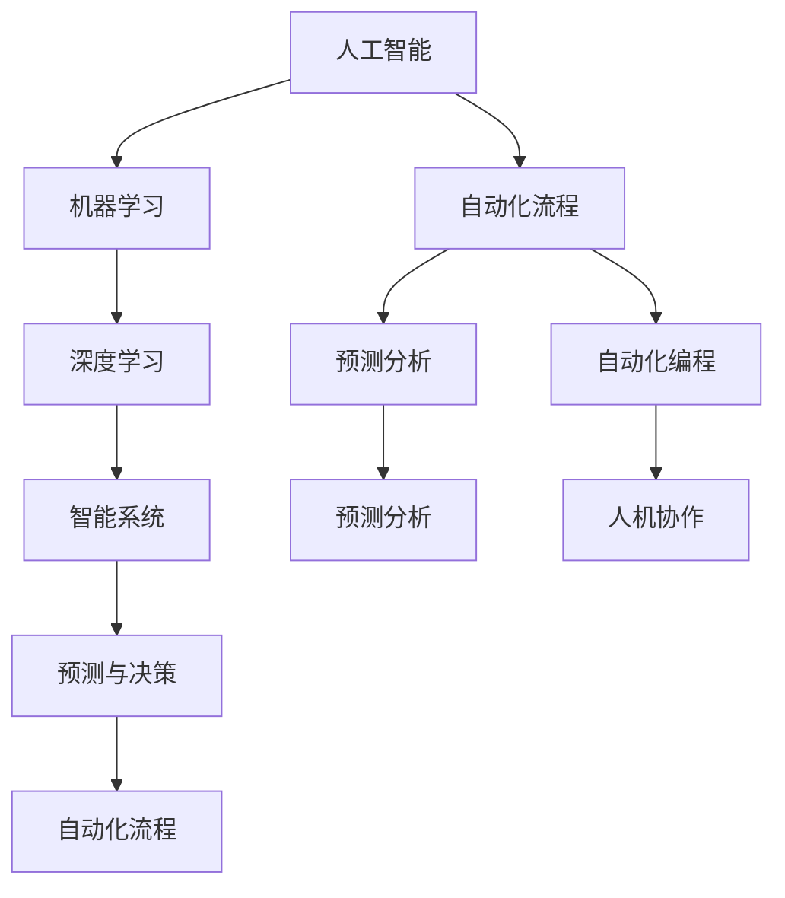

                 

# AI自动化的未来发展趋势

> 关键词：人工智能,自动化,机器学习,深度学习,智能系统,自动化流程,预测分析,自动化编程,人机协作

## 1. 背景介绍

### 1.1 问题由来
近年来，随着人工智能(AI)技术的迅猛发展，AI自动化已成为推动各行各业数字化转型和提升生产效率的重要引擎。无论是智能制造、金融科技、医疗健康，还是零售电商、物流仓储，AI自动化都在助力企业构建智能化运营体系，引领产业变革。然而，随着技术的深入应用，AI自动化面临诸多挑战，如算法复杂度提升、数据隐私问题、模型可解释性等。针对这些挑战，本文将深入探讨AI自动化的未来发展趋势，旨在为开发者和行业从业者提供有价值的参考。

### 1.2 问题核心关键点
AI自动化技术的核心在于通过机器学习、深度学习等先进算法，实现智能系统的自动决策和优化控制。其关键点包括：

1. **算法复杂度**：AI自动化算法，尤其是深度学习模型，往往具有较高的计算复杂度，需要强大的计算资源。
2. **数据隐私**：在AI自动化过程中，如何保护数据隐私和安全性，是一个重要且敏感的问题。
3. **模型可解释性**：随着模型复杂度的提升，模型的可解释性变得尤为重要，这关系到用户信任和法规合规。
4. **预测与决策**：AI自动化的核心在于预测和决策，如何提高预测准确性、优化决策过程，是AI自动化的重要目标。
5. **自动化编程与协作**：自动化编程和智能协作工具的发展，将进一步提升AI自动化的效率和效果。

## 2. 核心概念与联系

### 2.1 核心概念概述

AI自动化涉及多个核心概念，以下是对这些概念的简要介绍及其相互联系：

- **人工智能(AI)**：涵盖机器学习、深度学习、自然语言处理等技术，旨在实现智能系统的自动决策和优化。
- **自动化流程**：通过算法和系统工具，实现生产流程的自动化和优化，提升效率和质量。
- **机器学习**：基于数据和算法，使机器具备学习能力和决策能力。
- **深度学习**：一种特殊的机器学习技术，通过多层神经网络模型，解决复杂非线性问题。
- **智能系统**：结合AI技术和自动化流程，实现自动化的智能决策和优化控制。
- **预测分析**：利用历史数据和算法，预测未来趋势和行为。
- **自动化编程**：通过工具和技术，自动生成或优化程序代码，提升软件开发效率。
- **人机协作**：在智能系统的辅助下，实现人与机器的协同工作，提升工作效率和质量。

这些概念通过以下Mermaid流程图展现其联系：



这个流程图展示了大语言模型与自动化流程之间的关系：

1. **算法支持**：人工智能算法提供技术支持，机器学习和深度学习是AI自动化的核心技术。
2. **系统工具**：自动化流程和预测分析工具使AI技术得以应用。
3. **编程自动化**：自动化编程技术提升软件开发的效率和质量。
4. **人机协作**：智能系统和自动化流程提升人机协作的效率和效果。

## 3. 核心算法原理 & 具体操作步骤

### 3.1 算法原理概述

AI自动化的核心算法包括机器学习和深度学习，其基本原理如下：

- **机器学习**：通过数据训练模型，使模型具备预测和决策能力。
- **深度学习**：通过多层神经网络模型，自动提取特征和规律，解决复杂问题。

AI自动化的具体步骤如下：

1. **数据准备**：收集和整理数据，进行数据预处理和特征工程。
2. **模型训练**：使用训练数据集训练模型，调整模型参数，使其具备预测和决策能力。
3. **模型部署**：将训练好的模型部署到生产环境中，实现自动化决策和优化。
4. **监测与优化**：实时监测模型性能，根据反馈数据调整模型参数，持续优化模型效果。

### 3.2 算法步骤详解

以深度学习模型为例，具体算法步骤如下：

**Step 1: 数据准备**
- 收集与任务相关的数据集，并进行数据预处理和特征工程。
- 数据预处理包括数据清洗、缺失值处理、数据转换等步骤。
- 特征工程包括特征选择、特征提取和特征缩放等，确保数据适合模型训练。

**Step 2: 模型训练**
- 选择适合的深度学习模型，如卷积神经网络(CNN)、循环神经网络(RNN)、Transformer等。
- 设定模型的超参数，如学习率、批大小、迭代次数等。
- 使用训练数据集训练模型，通过反向传播算法更新模型参数，最小化损失函数。
- 定期在验证集上评估模型性能，防止过拟合。

**Step 3: 模型部署**
- 将训练好的模型部署到生产环境中，实现自动化决策和优化。
- 根据具体应用场景，设计模型接口和数据流。
- 集成必要的中间件和监控工具，确保模型稳定运行。

**Step 4: 监测与优化**
- 实时监测模型性能，记录模型输出和预测结果。
- 根据反馈数据调整模型参数，持续优化模型效果。
- 定期更新模型，引入新数据和算法，提升模型性能。

### 3.3 算法优缺点

AI自动化的主要优点包括：

1. **效率提升**：自动化流程和智能决策显著提升生产效率和质量。
2. **成本降低**：通过智能决策和优化控制，减少人力和物力成本。
3. **灵活性高**：结合机器学习模型，可以灵活应对复杂多变的数据和任务。
4. **可扩展性**：AI自动化可以扩展到不同规模和类型的应用场景。

其缺点主要包括：

1. **数据质量要求高**：AI自动化的效果依赖于数据质量，数据偏差和噪声可能导致预测失误。
2. **模型复杂度高**：深度学习模型计算复杂度高，需要强大的计算资源。
3. **模型可解释性不足**：深度学习模型的决策过程缺乏可解释性，用户难以理解。
4. **隐私和安全问题**：数据隐私和安全是AI自动化面临的重要挑战，需要严格的数据管理和保护措施。

### 3.4 算法应用领域

AI自动化在多个领域具有广泛的应用前景，包括但不限于：

- **智能制造**：通过自动化生产线、智能仓储系统，提升生产效率和质量。
- **金融科技**：利用AI自动化进行风险管理、欺诈检测、客户服务自动化等。
- **医疗健康**：实现病患监测、诊断分析、治疗方案推荐等。
- **零售电商**：通过AI自动化实现库存管理、推荐系统、客户服务自动化等。
- **物流仓储**：实现智能调度、路径规划、物流追踪等。

## 4. 数学模型和公式 & 详细讲解 & 举例说明

### 4.1 数学模型构建

以深度学习模型为例，其数学模型构建过程如下：

- **输入层**：将原始数据转换为模型可处理的向量形式。
- **隐藏层**：通过多层神经网络模型，自动提取特征和规律。
- **输出层**：根据任务需求，设计输出层的结构和激活函数。
- **损失函数**：选择适合的损失函数，如均方误差(MSE)、交叉熵(Cross-Entropy)等，评估模型预测与真实标签之间的差异。
- **优化算法**：选择适合的优化算法，如梯度下降(GD)、Adam、RMSprop等，最小化损失函数，更新模型参数。

### 4.2 公式推导过程

以多层神经网络为例，其基本公式如下：

- **输入层**：$x_1, x_2, ..., x_n$
- **隐藏层**：通过权重矩阵和激活函数，得到输出 $h_1, h_2, ..., h_m$
- **输出层**：通过权重矩阵和激活函数，得到最终输出 $y_1, y_2, ..., y_k$

其中，权重矩阵和激活函数的具体选择，取决于任务的性质和数据特征。

### 4.3 案例分析与讲解

以图像分类任务为例，其具体实现过程如下：

**Step 1: 数据准备**
- 收集和整理图像数据集，并进行数据预处理和特征工程。

**Step 2: 模型训练**
- 选择卷积神经网络(CNN)模型，定义模型结构。
- 设定模型的超参数，如学习率、批大小、迭代次数等。
- 使用训练数据集训练模型，通过反向传播算法更新模型参数。

**Step 3: 模型部署**
- 将训练好的模型部署到生产环境中，实现图像分类任务。
- 设计模型接口和数据流，集成必要的中间件和监控工具。

**Step 4: 监测与优化**
- 实时监测模型性能，记录模型输出和预测结果。
- 根据反馈数据调整模型参数，持续优化模型效果。

## 5. 项目实践：代码实例和详细解释说明

### 5.1 开发环境搭建

在进行AI自动化项目实践前，我们需要准备好开发环境。以下是使用Python进行TensorFlow开发的环境配置流程：

1. 安装Anaconda：从官网下载并安装Anaconda，用于创建独立的Python环境。

2. 创建并激活虚拟环境：
```bash
conda create -n tf-env python=3.8 
conda activate tf-env
```

3. 安装TensorFlow：根据CUDA版本，从官网获取对应的安装命令。例如：
```bash
conda install tensorflow-gpu=2.4.0
```

4. 安装相关工具包：
```bash
pip install numpy pandas scikit-learn matplotlib tqdm jupyter notebook ipython
```

完成上述步骤后，即可在`tf-env`环境中开始AI自动化实践。

### 5.2 源代码详细实现

以下是一个简单的图像分类任务的TensorFlow代码实现，具体步骤如下：

**Step 1: 数据准备**
- 使用TensorFlow的`tf.keras.datasets`模块加载数据集。

```python
import tensorflow as tf

(x_train, y_train), (x_test, y_test) = tf.keras.datasets.cifar10.load_data()
```

**Step 2: 模型训练**
- 定义卷积神经网络模型，使用`tf.keras.Model`构建。

```python
model = tf.keras.Sequential([
    tf.keras.layers.Conv2D(32, (3, 3), activation='relu', input_shape=(32, 32, 3)),
    tf.keras.layers.MaxPooling2D((2, 2)),
    tf.keras.layers.Flatten(),
    tf.keras.layers.Dense(10, activation='softmax')
])
```

**Step 3: 模型训练和评估**
- 编译模型，定义损失函数、优化器和评估指标。
- 使用训练数据集训练模型，并在验证集上评估性能。

```python
model.compile(optimizer='adam', loss='sparse_categorical_crossentropy', metrics=['accuracy'])
model.fit(x_train, y_train, epochs=10, validation_data=(x_test, y_test))
```

**Step 4: 模型部署**
- 在生产环境中部署模型，实现自动化决策和优化。

```python
model.save('model.h5')
```

### 5.3 代码解读与分析

让我们再详细解读一下关键代码的实现细节：

**图像分类任务代码**

```python
import tensorflow as tf

# 加载数据集
(x_train, y_train), (x_test, y_test) = tf.keras.datasets.cifar10.load_data()

# 数据预处理
x_train = x_train / 255.0
x_test = x_test / 255.0

# 定义模型
model = tf.keras.Sequential([
    tf.keras.layers.Conv2D(32, (3, 3), activation='relu', input_shape=(32, 32, 3)),
    tf.keras.layers.MaxPooling2D((2, 2)),
    tf.keras.layers.Flatten(),
    tf.keras.layers.Dense(10, activation='softmax')
])

# 编译模型
model.compile(optimizer='adam', loss='sparse_categorical_crossentropy', metrics=['accuracy'])

# 训练模型
model.fit(x_train, y_train, epochs=10, validation_data=(x_test, y_test))

# 保存模型
model.save('model.h5')
```

可以看到，TensorFlow提供了高度抽象和易于使用的API，使得AI自动化的项目开发变得非常高效。开发者可以专注于模型选择和训练策略，而不必过多关注底层的实现细节。

## 6. 实际应用场景

### 6.1 智能制造

AI自动化在智能制造中的应用包括自动化生产线、智能仓储系统等。通过机器学习和深度学习技术，可以实现生产流程的自动化和优化控制，提升生产效率和质量。

**应用示例**：
- **自动化生产线**：利用机器视觉和深度学习技术，实现产品质量检测和分类。
- **智能仓储系统**：通过智能调度算法，优化仓储物料管理，提高物流效率。

### 6.2 金融科技

金融科技是AI自动化应用的另一个重要领域，涵盖风险管理、欺诈检测、客户服务自动化等。

**应用示例**：
- **风险管理**：利用深度学习模型，预测客户信用风险，优化贷款审批流程。
- **欺诈检测**：通过异常检测算法，识别可疑交易行为，减少金融欺诈损失。
- **客户服务自动化**：使用自然语言处理技术，实现智能客服系统，提升客户体验。

### 6.3 医疗健康

医疗健康领域应用AI自动化，可以实现病患监测、诊断分析、治疗方案推荐等。

**应用示例**：
- **病患监测**：利用机器学习算法，实时监测患者健康数据，预测病情变化。
- **诊断分析**：通过深度学习模型，分析医学影像和病历数据，辅助医生诊断。
- **治疗方案推荐**：结合病患历史数据和诊疗经验，推荐最佳治疗方案。

### 6.4 零售电商

零售电商领域利用AI自动化，实现库存管理、推荐系统、客户服务自动化等。

**应用示例**：
- **库存管理**：通过预测分析算法，优化库存水平，减少库存成本。
- **推荐系统**：利用协同过滤和深度学习技术，提升个性化推荐效果。
- **客户服务自动化**：使用自然语言处理技术，实现智能客服系统，提升客户体验。

## 7. 工具和资源推荐

### 7.1 学习资源推荐

为了帮助开发者系统掌握AI自动化的理论和实践，以下是一些优质的学习资源：

1. **《深度学习》课程**：斯坦福大学开设的深度学习课程，涵盖深度学习基础和高级技术，是学习AI自动化的入门教材。
2. **TensorFlow官方文档**：提供了完整的TensorFlow开发指南和示例代码，是学习AI自动化的必备工具。
3. **PyTorch官方文档**：提供了丰富的PyTorch开发指南和教程，是学习AI自动化的另一个重要平台。
4. **《机器学习实战》书籍**：详细介绍了机器学习和深度学习的基础知识和实战技巧，适合初学者入门。
5. **Kaggle平台**：提供大量数据集和竞赛，可以锻炼AI自动化的实战能力。

通过对这些资源的学习实践，相信你一定能够系统掌握AI自动化的精髓，并用于解决实际问题。

### 7.2 开发工具推荐

高效的开发离不开优秀的工具支持。以下是几款用于AI自动化开发的常用工具：

1. **TensorFlow**：基于Python的开源深度学习框架，支持GPU加速，适合大规模深度学习模型的开发。
2. **PyTorch**：基于Python的开源深度学习框架，灵活动态的计算图，适合快速迭代研究。
3. **Keras**：高级神经网络API，提供简单易用的接口，适合快速原型开发。
4. **Jupyter Notebook**：交互式开发环境，支持Python、R等多种编程语言，方便快速迭代和实验。
5. **GitHub**：开源代码托管平台，提供丰富的开源项目和协作工具，方便开发者学习和交流。

合理利用这些工具，可以显著提升AI自动化的开发效率，加快创新迭代的步伐。

### 7.3 相关论文推荐

AI自动化的发展离不开学界的持续研究。以下是几篇奠基性的相关论文，推荐阅读：

1. **《深度学习》书籍**：由深度学习领域的权威学者撰写，全面介绍了深度学习的原理和应用。
2. **《自动机器学习：方法、系统和挑战》论文**：综述了自动机器学习领域的研究进展，提供了自动化的策略和方法。
3. **《强化学习》书籍**：介绍了强化学习的原理和应用，提供了AI自动化中常见的决策优化方法。
4. **《深度学习架构与实践》书籍**：深入探讨了深度学习架构的设计和实现，提供了实用的开发技巧和案例。

这些论文代表了大语言模型微调技术的发展脉络。通过学习这些前沿成果，可以帮助研究者把握学科前进方向，激发更多的创新灵感。

## 8. 总结：未来发展趋势与挑战

### 8.1 总结

本文对AI自动化的未来发展趋势进行了全面系统的探讨。首先阐述了AI自动化的背景和核心关键点，明确了AI自动化的重要价值和应用场景。其次，从原理到实践，详细讲解了AI自动化的数学模型和操作步骤，给出了AI自动化项目开发的完整代码实例。同时，本文还广泛探讨了AI自动化在多个行业领域的应用前景，展示了AI自动化的巨大潜力。此外，本文精选了AI自动化的各类学习资源，力求为开发者和行业从业者提供有价值的参考。

通过本文的系统梳理，可以看到，AI自动化技术正在成为各行各业数字化转型的重要引擎，极大地提升了生产效率和质量。未来，伴随AI技术的不断进步，AI自动化将进一步拓展其应用边界，为各行各业带来更深刻的影响。

### 8.2 未来发展趋势

展望未来，AI自动化的主要发展趋势包括：

1. **计算资源的提升**：随着算力成本的下降和计算资源的丰富，AI自动化的算法复杂度将得到提升，解决更复杂的问题。
2. **数据隐私保护**：在数据隐私和安全方面，未来的AI自动化将更加注重数据管理和保护措施，确保数据安全。
3. **模型可解释性**：随着模型复杂度的提升，模型的可解释性变得尤为重要，未来的AI自动化将注重模型的解释和理解。
4. **自动化编程和协作**：自动化编程和智能协作工具的发展，将进一步提升AI自动化的效率和效果。
5. **多模态融合**：未来的AI自动化将融合视觉、语音、文本等多模态数据，提升模型的综合能力。
6. **人机协作**：AI自动化将更多地关注人机协作，提升生产效率和工作体验。

以上趋势凸显了AI自动化的广阔前景。这些方向的探索发展，必将进一步提升AI自动化的性能和效果，为各行各业带来更多的创新和变革。

### 8.3 面临的挑战

尽管AI自动化技术已经取得了瞩目成就，但在迈向更加智能化、普适化应用的过程中，它仍面临着诸多挑战：

1. **数据质量问题**：AI自动化的效果依赖于数据质量，数据偏差和噪声可能导致预测失误。
2. **模型复杂度高**：深度学习模型计算复杂度高，需要强大的计算资源。
3. **模型可解释性不足**：深度学习模型的决策过程缺乏可解释性，用户难以理解。
4. **隐私和安全问题**：数据隐私和安全是AI自动化面临的重要挑战，需要严格的数据管理和保护措施。
5. **自动化编程和协作**：自动化编程和智能协作工具的发展，仍面临技术瓶颈和应用障碍。
6. **多模态融合**：多模态数据的融合和协同建模，仍需要更多的算法和工具支持。

正视AI自动化面临的这些挑战，积极应对并寻求突破，将是大语言模型微调技术走向成熟的必由之路。

### 8.4 研究展望

面对AI自动化所面临的种种挑战，未来的研究需要在以下几个方面寻求新的突破：

1. **探索更高效的算法和模型**：开发更加高效、易解释的AI自动化算法和模型，提高模型性能和可解释性。
2. **提升数据质量和处理能力**：利用数据增强、数据清洗等技术，提高数据质量和处理能力，减少数据偏差和噪声。
3. **引入更多先验知识**：将符号化的先验知识，如知识图谱、逻辑规则等，与神经网络模型进行巧妙融合，引导AI自动化过程学习更准确、合理的语言模型。
4. **融合因果分析和博弈论工具**：引入因果分析方法，识别出AI自动化的决策关键特征，增强输出解释的因果性和逻辑性。借助博弈论工具，主动探索并规避模型的脆弱点，提高系统稳定性。
5. **纳入伦理道德约束**：在AI自动化训练目标中引入伦理导向的评估指标，过滤和惩罚有偏见、有害的输出倾向。同时加强人工干预和审核，建立模型行为的监管机制，确保输出符合人类价值观和伦理道德。

这些研究方向的探索，必将引领AI自动化技术迈向更高的台阶，为构建安全、可靠、可解释、可控的智能系统铺平道路。面向未来，AI自动化需要与其他人工智能技术进行更深入的融合，如知识表示、因果推理、强化学习等，多路径协同发力，共同推动自然语言理解和智能交互系统的进步。只有勇于创新、敢于突破，才能不断拓展AI自动化的边界，让智能技术更好地造福人类社会。

## 9. 附录：常见问题与解答

**Q1: AI自动化的主要优点有哪些？**

A: AI自动化的主要优点包括：
1. **效率提升**：自动化流程和智能决策显著提升生产效率和质量。
2. **成本降低**：通过智能决策和优化控制，减少人力和物力成本。
3. **灵活性高**：结合机器学习模型，可以灵活应对复杂多变的数据和任务。
4. **可扩展性**：AI自动化可以扩展到不同规模和类型的应用场景。

**Q2: 如何提高AI自动化的模型可解释性？**

A: 提高AI自动化的模型可解释性，可以采取以下措施：
1. **引入可解释性模块**：在模型中添加可解释性模块，如LIME、SHAP等，提供模型决策的可视化解释。
2. **简化模型结构**：使用更简单的模型结构，减少计算复杂度，提高模型可解释性。
3. **模型解释技术**：利用模型解释技术，如梯度值、激活值等，分析模型内部工作机制，提供决策依据。
4. **数据驱动解释**：利用数据驱动的解释方法，如因果推断、对比学习等，提高模型的解释力和可信度。

**Q3: 如何应对AI自动化的数据质量问题？**

A: 应对AI自动化的数据质量问题，可以采取以下措施：
1. **数据清洗**：通过数据清洗，去除数据中的噪声和异常值，提高数据质量。
2. **数据增强**：利用数据增强技术，扩充数据集，增加数据多样性，减少数据偏差。
3. **数据预处理**：使用数据预处理技术，如归一化、标准化、特征工程等，提升数据质量。
4. **数据验证**：通过数据验证技术，如交叉验证、异常检测等，评估数据质量，确保模型训练数据的高质量。

**Q4: 如何优化AI自动化的资源消耗？**

A: 优化AI自动化的资源消耗，可以采取以下措施：
1. **模型裁剪**：去除不必要的层和参数，减小模型尺寸，加快推理速度。
2. **量化加速**：将浮点模型转为定点模型，压缩存储空间，提高计算效率。
3. **模型并行**：利用模型并行技术，如数据并行、模型并行等，提升计算效率和模型容量。
4. **算法优化**：优化算法，减少计算复杂度，提高计算效率。

**Q5: 如何提高AI自动化的数据隐私保护？**

A: 提高AI自动化的数据隐私保护，可以采取以下措施：
1. **数据加密**：使用数据加密技术，保护数据隐私。
2. **联邦学习**：采用联邦学习技术，在不共享数据的情况下，进行模型训练和优化。
3. **差分隐私**：使用差分隐私技术，在保护数据隐私的前提下，提供模型训练的准确性。
4. **隐私计算**：利用隐私计算技术，如多方安全计算、同态加密等，保护数据隐私。

---

作者：禅与计算机程序设计艺术 / Zen and the Art of Computer Programming

