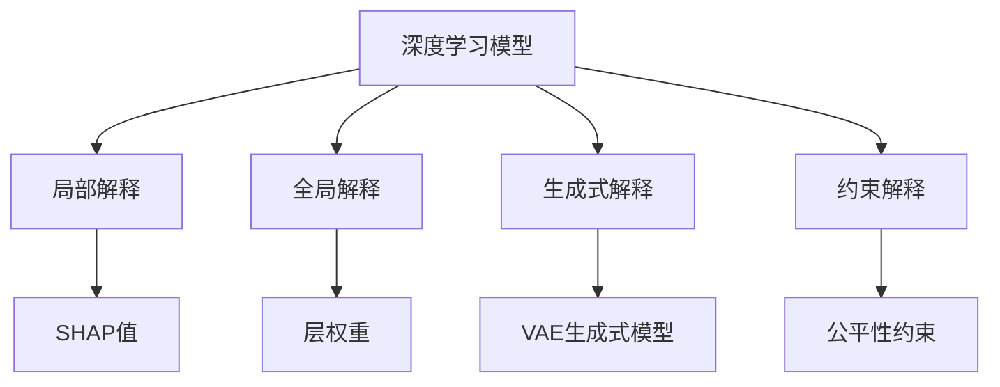

                 

# AI解释性:打开黑盒模型的新方法

在人工智能（AI）领域，模型的可解释性一直是备受关注的话题。深度学习模型的黑盒特性使得其决策过程难以理解和调试，特别是在医疗、金融等高风险领域，模型的透明性显得尤为重要。本文旨在探讨AI解释性，提出并评估一些新的模型解释方法，帮助开发者和用户更好地理解模型的决策过程，从而提升模型的可信度和实用性。

## 1. 背景介绍

### 1.1 问题由来
深度学习模型，尤其是神经网络模型，因其强大的泛化能力而广泛应用于图像识别、自然语言处理、推荐系统等领域。然而，深度学习模型的复杂性和高维度参数，使得其决策过程难以解释和理解，常常被称为“黑盒”。这一特性在实际应用中带来了以下问题：

- **决策透明度不足**：用户无法理解模型如何得出特定结论，导致信任度降低。
- **模型鲁棒性差**：模型在输入微小变化时可能出现显著变化，缺乏可解释性使得问题诊断困难。
- **公平性问题**：模型决策过程不透明，难以发现和纠正偏见和歧视。
- **决策路径不明**：缺乏对模型内部工作原理的理解，难以进行有效的模型优化和调参。

因此，在实际应用中，人们越来越迫切需要了解深度学习模型的决策机制，从而提升模型的可信度和实用性。

### 1.2 问题核心关键点
模型解释性旨在提供一种手段，使模型决策过程透明、可理解、可验证，具体包括：

- **局部解释**：提供特定输入样本的模型解释，解释模型为何选择该样本。
- **全局解释**：提供模型整体的解释，解释模型的工作原理和内部结构。
- **可验证性**：解释结果可以复现、验证，确保其准确性和可信度。
- **实用性**：解释结果对实际应用有指导意义，如诊断模型错误、改进模型设计等。

本文将从这些关键点出发，介绍和评估不同的模型解释方法，帮助用户更好地理解和使用深度学习模型。

## 2. 核心概念与联系

### 2.1 核心概念概述
模型解释性（Model Interpretability），是指通过某种方式使模型的决策过程透明、可理解，帮助用户理解模型为何选择特定输出。常用的解释方法包括：

- **局部解释（Local Interpretability）**：对单个样本的解释，如LIME、SHAP等。
- **全局解释（Global Interpretability）**：对模型整体结构的解释，如梯度权重、层权重等。
- **生成式解释（Generative Interpretability）**：通过生成模型输出，解释模型的内在机制，如GPT、VAE等。
- **约束解释（Constraint Interpretability）**：通过添加约束条件，解释模型的决策路径，如Fairness、Robustness等。

这些解释方法可以相互结合，从不同角度深入了解模型的决策过程，为模型优化和应用提供依据。

### 2.2 核心概念原理和架构的 Mermaid 流程图



## 3. 核心算法原理 & 具体操作步骤

### 3.1 算法原理概述

深度学习模型的解释性研究主要集中在以下两个方面：

- **局部解释**：通过解释单个样本的预测过程，揭示模型在特定输入下的决策依据。
- **全局解释**：通过解释模型整体结构和决策路径，揭示模型的工作原理和内部机制。

常用的局部解释方法包括LIME、SHAP、Anchor等，而全局解释方法则包括梯度权重、层权重、生成式模型等。

### 3.2 算法步骤详解

**Step 1: 数据准备**
- 准备训练数据集 $D=\{(x_i, y_i)\}_{i=1}^N$，其中 $x_i$ 为输入，$y_i$ 为标签。
- 对训练数据进行预处理，如标准化、归一化等。

**Step 2: 模型训练**
- 使用训练数据对深度学习模型进行训练，获得模型参数 $\theta$。
- 训练过程中，可以选择冻结部分层，只微调顶层，减少计算量和资源消耗。

**Step 3: 解释方法选择**
- 根据应用场景和需求，选择合适的解释方法。如LIME适用于局部解释，SHAP适用于全局解释。

**Step 4: 解释结果获取**
- 使用解释方法对模型进行解释，获取特定输入的解释结果。
- 对于局部解释，需要获得模型对特定样本的预测过程和决策依据。
- 对于全局解释，需要获得模型整体的权重分布和工作原理。

**Step 5: 结果验证**
- 对解释结果进行验证，确保其准确性和可信度。
- 使用不同的样本和解释方法进行交叉验证，确保解释结果的一致性和可靠性。

### 3.3 算法优缺点

深度学习模型解释性的优点包括：

- **提高可信度**：通过理解模型决策过程，增加用户对模型的信任度。
- **促进公平性**：揭示模型偏见和歧视，有助于纠正不公平现象。
- **指导优化**：帮助开发者理解模型弱点，进行有针对性的优化和改进。

但同时也存在一些缺点：

- **计算复杂度**：解释过程往往需要额外的计算资源和时间，增加应用成本。
- **解释准确性**：解释结果可能存在误差，难以完全准确反映模型决策过程。
- **解释可理解性**：解释结果可能过于复杂，难以被非专业人士理解。

### 3.4 算法应用领域

深度学习模型解释性方法在以下几个领域得到了广泛应用：

- **医疗诊断**：帮助医生理解模型诊断结果，提高诊断准确性和可信度。
- **金融风控**：揭示模型决策路径，评估风险因素，降低金融风险。
- **自然语言处理**：解释模型预测结果，提升文本生成和自然语言处理任务的性能。
- **推荐系统**：揭示推荐理由，提高推荐效果和用户满意度。
- **计算机视觉**：解释模型分类结果，提升图像识别和目标检测任务的性能。

## 4. 数学模型和公式 & 详细讲解 & 举例说明

### 4.1 数学模型构建

深度学习模型解释性研究主要集中在以下两个方面：

- **局部解释**：通过解释单个样本的预测过程，揭示模型在特定输入下的决策依据。
- **全局解释**：通过解释模型整体结构和决策路径，揭示模型的工作原理和内部机制。

### 4.2 公式推导过程

**LIME（Local Interpretable Model-agnostic Explanations）**
LIME是一种基于局部线性模型的解释方法，通过近似模型在特定样本上的行为，解释模型决策过程。假设模型为 $f$，样本为 $x$，标签为 $y$，LIME的解释过程如下：

1. 对模型进行局部线性近似：$L(x) = \sum_{i=1}^{k} \alpha_i \cdot f(x + \epsilon_i)$，其中 $\epsilon_i$ 为随机扰动，$\alpha_i$ 为权重。
2. 求解最优的 $\epsilon_i$ 和 $\alpha_i$，使得 $L(x)$ 与 $f(x)$ 的输出尽可能接近。
3. 通过解释 $L(x)$ 的行为，揭示模型在 $x$ 上的决策依据。

**SHAP（SHapley Additive exPlanations）**
SHAP是一种基于Shapley值的全局解释方法，通过计算每个特征对模型输出的贡献，解释模型决策路径。假设模型为 $f$，特征向量为 $x$，标签为 $y$，SHAP的解释过程如下：

1. 将模型看作由多个特征组成的加和模型。
2. 计算每个特征对模型输出的贡献，即Shapley值。
3. 通过Shapley值，解释模型在 $x$ 上的决策路径。

### 4.3 案例分析与讲解

以LIME和SHAP为例，对具体案例进行详细分析：

**案例1: 文本分类**
假设有一个文本分类模型，用于分类新闻文章是否属于政治新闻。使用LIME对特定文章进行解释，可以获得模型对文章的决策依据。例如，LIME可能发现模型在识别政治词汇和时事关键词方面有较高的权重，从而解释模型的决策过程。

**案例2: 图像识别**
假设有一个图像识别模型，用于识别图像中的狗。使用SHAP对模型进行解释，可以获得每个像素对模型输出的贡献。例如，SHAP可能发现模型对狗的耳朵和尾巴等关键特征的关注较高，从而解释模型的决策路径。

## 5. 项目实践：代码实例和详细解释说明

### 5.1 开发环境搭建

在进行深度学习模型解释性实践前，需要先准备好开发环境。以下是使用Python进行TensorFlow开发的环境配置流程：

1. 安装Anaconda：从官网下载并安装Anaconda，用于创建独立的Python环境。
2. 创建并激活虚拟环境：
```bash
conda create -n tf-env python=3.8 
conda activate tf-env
```
3. 安装TensorFlow：根据CUDA版本，从官网获取对应的安装命令。例如：
```bash
conda install tensorflow -c tf
```
4. 安装TensorBoard：TensorFlow配套的可视化工具，用于实时监测模型训练状态。
```bash
pip install tensorboard
```
5. 安装TensorFlow扩展库：如TensorFlow-Slim、TensorFlow-Estimator等，提供更丰富的模型组件和接口。

完成上述步骤后，即可在`tf-env`环境中开始解释性实践。

### 5.2 源代码详细实现

以下以TensorFlow为例，使用LIME对模型进行局部解释：

```python
import tensorflow as tf
from tensorflow.contrib.lime.python import lime_instance_interpretation as li
from tensorflow.contrib.lime.python import lime_tabular_explanation as lte

# 准备训练数据
train_data = ...
train_labels = ...

# 定义模型
model = tf.keras.Sequential([
    tf.keras.layers.Dense(64, activation='relu'),
    tf.keras.layers.Dense(32, activation='relu'),
    tf.keras.layers.Dense(1, activation='sigmoid')
])

# 训练模型
model.compile(optimizer='adam', loss='binary_crossentropy')
model.fit(train_data, train_labels, epochs=10)

# 对特定样本进行解释
def predict_proba(x):
    return model.predict(x)

x = ...
predicted_label = predict_proba(x)
x_lime = li.LocalLimeTabular(x, predict_proba)
explanation = x_lime.fit_and_explain(x)
print(explanation)
```

### 5.3 代码解读与分析

代码中，首先准备了训练数据集，并定义了神经网络模型。接着，使用LIME对模型进行解释。具体步骤如下：

1. 定义 `predict_proba` 函数，用于计算模型对特定样本的预测概率。
2. 使用 `LocalLimeTabular` 类，对模型进行局部解释。
3. 通过 `fit_and_explain` 方法，生成模型对样本的解释结果。
4. 输出解释结果，展示模型决策依据。

### 5.4 运行结果展示

通过上述代码，可以生成特定样本的解释结果，揭示模型决策依据。例如，可以发现模型对某些输入特征的关注较高，从而理解模型在特定输入下的决策过程。

## 6. 实际应用场景

### 6.1 医疗诊断

在医疗领域，深度学习模型被广泛应用于疾病诊断、基因分析等任务。但模型决策过程的透明度不足，增加了医疗诊断的风险。

**应用场景**：某医院使用深度学习模型进行疾病诊断。通过LIME解释模型对特定患者诊断结果的依据，医生可以理解模型为何选择特定诊断结果，从而提高诊断的准确性和可信度。

**效果展示**：LIME可能发现模型在检测特定症状和实验室指标方面有较高的权重，从而解释模型的决策过程。医生根据解释结果，可以更好地理解和利用模型输出，提升诊断效果。

### 6.2 金融风控

金融领域对模型决策的透明度要求较高，模型决策依据需要在审计和监管中能够复现和验证。

**应用场景**：某金融公司使用深度学习模型进行信用评分和风险评估。通过SHAP解释模型对特定用户的评分依据，公司可以理解模型为何给予特定评分，从而降低风险。

**效果展示**：SHAP可能发现模型对用户收入、信用历史等因素的关注较高，从而解释模型的决策路径。公司根据解释结果，可以优化模型设计，减少歧视和不公平现象，提升信用评分系统的公平性和可信度。

### 6.3 自然语言处理

自然语言处理任务如文本生成、机器翻译等，模型的决策过程难以解释。

**应用场景**：某公司使用深度学习模型进行机器翻译。通过LIME解释模型对特定句子的翻译结果，公司可以理解模型为何选择特定翻译结果，从而提高翻译质量。

**效果展示**：LIME可能发现模型在识别特定语言结构和词汇方面有较高的权重，从而解释模型的决策过程。公司根据解释结果，可以优化模型设计，减少翻译错误，提升翻译质量。

## 7. 工具和资源推荐

### 7.1 学习资源推荐

为了帮助开发者和用户系统掌握深度学习模型解释性，以下是一些优质的学习资源：

1. **LIME官方文档**：LIME的官方文档，提供了详细的API和使用方法，帮助用户快速上手。
2. **SHAP官方文档**：SHAP的官方文档，提供了丰富的示例和解释方法，适合深入学习。
3. **TensorFlow-Slim官方文档**：TensorFlow-Slim提供了丰富的模型组件和接口，方便开发者构建复杂的深度学习模型。
4. **TensorBoard官方文档**：TensorBoard的官方文档，提供了实时监测模型训练状态和生成可视化图表的方法。
5. **《深度学习解释性》书籍**：深入讲解深度学习模型的解释性方法，适合系统学习和研究。

通过对这些资源的学习实践，相信你一定能够快速掌握深度学习模型解释性的精髓，并用于解决实际的解释问题。

### 7.2 开发工具推荐

高效的深度学习模型解释性开发，离不开优秀的工具支持。以下是几款常用的开发工具：

1. **TensorFlow**：基于Python的开源深度学习框架，提供丰富的模型组件和接口，适合构建复杂的深度学习模型。
2. **LIME**：用于模型局部解释的工具，可以生成详细的解释结果，帮助用户理解模型决策过程。
3. **SHAP**：用于模型全局解释的工具，可以计算每个特征对模型输出的贡献，解释模型决策路径。
4. **TensorBoard**：TensorFlow配套的可视化工具，用于实时监测模型训练状态，生成详细的可视化图表。
5. **TensorFlow-Slim**：提供丰富的模型组件和接口，方便开发者构建复杂的深度学习模型。

合理利用这些工具，可以显著提升深度学习模型解释性的开发效率，加速解释模型的部署和应用。

### 7.3 相关论文推荐

深度学习模型解释性研究源于学界的持续探索。以下是几篇奠基性的相关论文，推荐阅读：

1. **《Interpretable Machine Learning: A Guide》**：详细介绍了深度学习模型的解释性方法和应用，适合系统学习和研究。
2. **《A Unified Approach to Interpreting Model Predictions》**：提出统一的方法，用于解释多种深度学习模型的决策过程。
3. **《Towards Explainable Artificial Intelligence: An Overview》**：总结了深度学习模型的解释性方法和应用，适合全面了解。
4. **《Explainable AI with LIME》**：详细介绍了LIME方法，并提供了丰富的示例和解释方法。
5. **《Axiomatic Attribution for Deep Networks》**：提出基于Axiom方法，用于解释深度学习模型的决策过程。

这些论文代表了大规模深度学习模型解释性技术的发展脉络。通过学习这些前沿成果，可以帮助研究者把握学科前进方向，激发更多的创新灵感。

## 8. 总结：未来发展趋势与挑战

### 8.1 总结

本文对深度学习模型解释性进行了全面系统的介绍。首先阐述了模型解释性的重要性，明确了解释性研究的主要方向和应用场景。其次，从原理到实践，详细讲解了LIME和SHAP等解释方法，并提供了具体的代码实现和运行结果。最后，探讨了深度学习模型解释性技术在医疗、金融、自然语言处理等领域的实际应用，展示了其广阔的应用前景。

通过本文的系统梳理，可以看到，深度学习模型解释性技术正在成为AI领域的重要范式，极大地拓展了深度学习模型的应用边界，为模型优化和应用提供了新的思路。未来，伴随解释性技术的不断演进，深度学习模型将更加透明、可信，更好地服务于实际应用。

### 8.2 未来发展趋势

展望未来，深度学习模型解释性技术将呈现以下几个发展趋势：

1. **解释方法的融合**：未来解释方法将更加多样化，可能融合多种解释方法，从不同角度深入了解模型决策过程。
2. **解释结果的可视化**：通过可视化技术，使解释结果更加直观、易懂，方便用户理解和使用。
3. **解释框架的集成**：解释框架将与主流深度学习框架无缝集成，方便开发者构建和部署解释性模型。
4. **解释模型的自动化**：开发自动化解释工具，帮助开发者快速生成和验证解释结果，降低应用成本。
5. **解释方法的个性化**：根据不同应用场景和需求，选择最适合的解释方法，提升解释效果和可信度。

这些趋势凸显了深度学习模型解释性技术的广阔前景。这些方向的探索发展，必将进一步提升模型的可信度和实用性，为深度学习模型在实际应用中的普及和推广提供有力支撑。

### 8.3 面临的挑战

尽管深度学习模型解释性技术已经取得了瞩目成就，但在迈向更加智能化、普适化应用的过程中，仍面临诸多挑战：

1. **解释结果的准确性**：解释结果可能存在误差，难以完全准确反映模型决策过程。如何提高解释结果的准确性，将是重要的研究方向。
2. **解释方法的普适性**：不同的解释方法适用于不同类型和规模的模型，如何开发普适的解释方法，适用于各种深度学习模型，是一大挑战。
3. **解释结果的可理解性**：解释结果可能过于复杂，难以被非专业人士理解。如何简化解释结果，使其更加易于理解，是未来的研究重点。
4. **解释结果的复现性**：解释结果需要在不同环境和条件下复现，确保其可靠性。如何提高解释结果的复现性，是保证解释结果可信度的关键。

这些挑战凸显了深度学习模型解释性技术的应用难度，需要在理论和实践中进行深入探索和优化。只有解决这些问题，才能真正实现深度学习模型的透明化和可理解性，推动AI技术在实际应用中的广泛应用。

### 8.4 研究展望

未来，深度学习模型解释性技术需要在以下几个方面寻求新的突破：

1. **开发更加高效的解释方法**：开发更加高效的解释方法，如生成式解释、约束解释等，提升解释结果的准确性和可理解性。
2. **引入外部知识库**：将外部知识库、规则库等与解释方法结合，提升解释结果的全面性和准确性。
3. **融合因果推理**：引入因果推理方法，分析模型决策的因果关系，提升解释结果的逻辑性和可信度。
4. **建立透明化的解释标准**：制定透明化的解释标准，确保解释结果的可复现性和可验证性。
5. **引入伦理和公平性考量**：在解释方法中引入伦理和公平性考量，确保解释结果符合人类价值观和伦理道德。

这些研究方向将推动深度学习模型解释性技术向更深层次发展，为构建透明、可信、公平的AI系统提供有力支持。面向未来，深度学习模型解释性技术还需要与其他AI技术进行更深入的融合，如知识表示、因果推理、强化学习等，共同推动AI技术的进步和发展。

## 9. 附录：常见问题与解答

**Q1: 深度学习模型解释性是否适用于所有模型？**

A: 深度学习模型解释性适用于大部分深度学习模型，但某些特定模型（如RNN、卷积神经网络等）可能存在解释难度较大或不可解释的情况。因此，在选择解释方法时，需要根据具体模型和任务进行选择。

**Q2: 如何评估解释结果的准确性和可信度？**

A: 评估解释结果的准确性和可信度，通常需要以下步骤：

1. 选择独立的测试数据集，对模型进行测试。
2. 对测试数据集中的样本进行解释。
3. 通过对比解释结果和实际输出，评估解释结果的准确性。
4. 进行交叉验证和对比实验，评估解释结果的可信度。

**Q3: 在实际应用中，如何进行解释结果的可视化？**

A: 解释结果的可视化可以通过以下方法：

1. 使用可视化工具如TensorBoard，生成解释结果的图表。
2. 使用可视化库如Matplotlib、Seaborn等，生成解释结果的可视化图表。
3. 将解释结果生成文本或PDF格式，方便用户阅读和理解。

通过以上方法，可以更直观地展示解释结果，方便用户理解和使用。

**Q4: 如何处理解释结果的复杂性问题？**

A: 处理解释结果的复杂性问题，可以从以下几个方面入手：

1. 简化解释方法，选择更加简单和易于理解的解释方法。
2. 对解释结果进行聚合和总结，减少解释结果的复杂性。
3. 使用可视化技术，将复杂的解释结果可视化，使其更易于理解。
4. 引入用户交互界面，使用户可以自主调整解释结果的复杂度。

通过以上方法，可以有效降低解释结果的复杂性，提升其可理解性和实用性。

**Q5: 如何提高解释结果的复现性？**

A: 提高解释结果的复现性，通常需要以下步骤：

1. 选择稳定的解释方法，避免使用复杂的解释方法。
2. 固定解释方法的版本和参数，避免因解释方法变化导致解释结果的变化。
3. 对解释结果进行标准化处理，去除无关信息和噪声。
4. 在相同的条件下重复解释过程，确保解释结果的一致性。

通过以上方法，可以有效提高解释结果的复现性，确保其可靠性和可信度。

---

作者：禅与计算机程序设计艺术 / Zen and the Art of Computer Programming

