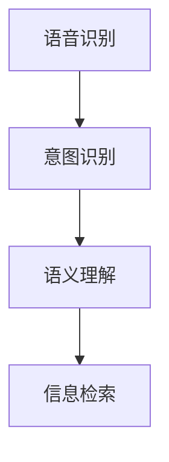

                 

## 1. 背景介绍

语音搜索技术是人工智能在自然语言处理（NLP）领域的重要应用之一，它通过识别和理解用户的语音输入，从而提供实时信息检索、智能对话等服务。传统的基于文本的搜索引擎虽然已经相当成熟，但在处理复杂自然语言输入和实时交互时，显得力不从心。近年来，大语言模型的迅猛发展，使得基于语音搜索的智能应用成为可能。本文将介绍一个基于深度学习的语音搜索系统，展示其在提升便捷性方面的显著优势。

### 1.1 问题由来

在互联网时代，信息量呈指数级增长。如何高效、准确地获取所需信息，成为每个用户都关心的问题。传统的基于文本的搜索引擎，依赖于用户输入明确的查询关键词。但在实际使用中，用户往往难以准确表达需求，特别是在使用语音输入时，容易发生歧义和误识别。

为解决这些问题，研究人员探索了多种基于语音搜索的技术，如基于规则的语音识别、统计机器学习、深度学习等方法。深度学习尤其是神经网络模型，由于其强大的语言理解和生成能力，在语音搜索中表现出了显著的优越性。

### 1.2 问题核心关键点

语音搜索的核心在于将用户的语音输入转换为文本查询，并通过深度学习模型快速准确地检索相关信息。其关键点包括：

- **语音识别**：将用户的语音输入转换为文本，并消除噪音、处理口音等。
- **意图识别**：理解用户输入的意图，以便进行精准的信息检索。
- **语义理解**：深入解析用户意图，进行更精确的匹配和排序。
- **个性化推荐**：根据用户的历史查询行为和偏好，推荐更符合用户需求的信息。

本文聚焦于如何利用大语言模型改进语音搜索系统的意图识别和语义理解能力，以提升用户搜索的便捷性和准确性。

## 2. 核心概念与联系

### 2.1 核心概念概述

为更好地理解基于深度学习的语音搜索系统，本节将介绍几个密切相关的核心概念：

- **语音识别**：将用户的语音输入转换为文本，是语音搜索的第一步。常见的方法包括基于模板的隐马尔可夫模型（HMM）、基于统计的声学模型和语言模型，以及基于深度学习的卷积神经网络（CNN）和循环神经网络（RNN）等。

- **深度学习**：一种基于神经网络的机器学习范式，通过多层非线性变换提取数据特征。深度学习在语音识别、图像识别、自然语言处理等领域表现出色，已成为语音搜索的核心技术。

- **Transformer模型**：一种基于自注意力机制的神经网络架构，特别适用于处理序列数据。BERT、GPT等大模型均采用了Transformer结构，在语音搜索的意图识别和语义理解中发挥了重要作用。

- **意图识别**：理解用户输入的意图，是语音搜索的关键步骤。常见的意图识别方法包括基于规则的模板匹配、基于机器学习的分类器、基于深度学习的序列标注等。

- **语义理解**：深入解析用户输入，提取关键信息，进行更精准的信息检索。语义理解依赖于深度学习模型，特别是Transformer模型，能够捕捉长距离依赖和复杂语义关系。

这些核心概念之间的逻辑关系可以通过以下Mermaid流程图来展示：



这个流程图展示了大语言模型在语音搜索中的应用流程：

1. 语音识别模块将用户的语音输入转换为文本。
2. 意图识别模块理解用户的输入意图。
3. 语义理解模块深入解析输入，提取关键信息。
4. 信息检索模块根据解析结果，检索相关信息。

这些模块相互协作，使得语音搜索系统能够实时、准确地响应用户需求。

## 3. 核心算法原理 & 具体操作步骤

### 3.1 算法原理概述

基于深度学习的语音搜索系统，主要利用Transformer模型进行意图识别和语义理解。其核心思想是：将用户语音输入转换为文本后，通过Transformer模型进行序列编码和解码，从而提取输入中的关键信息，并用于信息检索。

### 3.2 算法步骤详解

基于深度学习的语音搜索系统通常包括以下几个关键步骤：

**Step 1: 语音信号预处理**
- 将用户的语音信号进行降噪、音量归一化、速度调整等预处理操作。
- 利用MFCC（Mel-frequency cepstral coefficients）或STFT（Short-time Fourier Transform）等技术将语音信号转换为频谱图。

**Step 2: 语音识别**
- 使用深度学习模型，如CTC（Connectionist Temporal Classification）或Attention-based RNN，将频谱图转换为文本序列。
- 对文本序列进行分词、去停用词等预处理，去除无意义的噪声。

**Step 3: 意图识别**
- 将预处理后的文本序列输入到Transformer模型，进行序列编码。
- 利用softmax层进行意图分类，将文本序列映射到意图标签。

**Step 4: 语义理解**
- 对Transformer模型的编码输出进行解码，得到文本序列中每个词的注意力权重。
- 利用BERT、GPT等大模型，进一步提取文本的语义信息，构建用户意图的深度表示。

**Step 5: 信息检索**
- 根据用户意图和语义表示，构建查询向量。
- 利用搜索引擎（如Elasticsearch、Solr）检索相关文档，并根据匹配度排序。
- 返回与用户意图最匹配的文档列表。

### 3.3 算法优缺点

基于深度学习的语音搜索系统具有以下优点：

- **高准确性**：深度学习模型能够捕捉长距离依赖和复杂语义关系，提供准确的意图识别和语义理解。
- **实时性**：Transformer模型速度快，能够实时响应用户查询，提升用户体验。
- **泛化能力强**：大模型在大规模数据上预训练，具备良好的泛化能力，适用于多种语音输入和搜索场景。

同时，该系统也存在以下缺点：

- **计算资源需求高**：深度学习模型参数量大，需要高性能硬件支持。
- **训练成本高**：深度学习模型需要大量标注数据和计算资源进行训练，初期开发成本较高。
- **可解释性差**：黑盒模型难以解释其内部决策过程，用户难以理解和信任。

### 3.4 算法应用领域

基于深度学习的语音搜索技术已经在多个领域得到了应用，例如：

- **智能客服**：通过语音搜索，用户可以与智能客服系统进行自然对话，获取信息和解决问题。
- **智能家居**：用户可以通过语音指令控制智能家居设备，提升生活便利性。
- **智能导航**：语音搜索可以与导航系统结合，实现实时路况查询和路线规划。
- **智能健康**：通过语音搜索，用户可以获取健康咨询和医疗建议。

除了上述这些经典应用外，语音搜索技术还在智能办公、智能金融、智能交通等领域展现出广泛的应用前景。

## 4. 数学模型和公式 & 详细讲解 & 举例说明

### 4.1 数学模型构建

基于深度学习的语音搜索系统主要利用Transformer模型进行意图识别和语义理解。假设输入序列为 $x=\{x_1, x_2, ..., x_n\}$，其中 $x_i$ 表示第 $i$ 个词的one-hot编码。

**Step 1: 语音识别**
- 使用深度学习模型，如CTC或Attention-based RNN，将频谱图转换为文本序列。设输出序列为 $y=\{y_1, y_2, ..., y_n\}$，其中 $y_i$ 表示第 $i$ 个词的one-hot编码。
- 损失函数为交叉熵损失：$\mathcal{L}_{CTC}=-\sum_{i=1}^n \log p_{CTC}(y_i|x)$，其中 $p_{CTC}(y_i|x)$ 表示模型在输入 $x$ 下输出 $y_i$ 的概率。

**Step 2: 意图识别**
- 使用Transformer模型进行序列编码，得到编码输出 $h=\{h_1, h_2, ..., h_n\}$。
- 利用softmax层进行意图分类，得到意图概率分布 $P=\{p_1, p_2, ..., p_m\}$，其中 $p_i$ 表示第 $i$ 个意图的概率。
- 损失函数为交叉熵损失：$\mathcal{L}_{intent}=-\sum_{i=1}^m y_i \log p_i$，其中 $y_i$ 表示第 $i$ 个意图是否出现。

**Step 3: 语义理解**
- 对Transformer模型的编码输出 $h$ 进行解码，得到注意力权重 $\alpha=\{\alpha_1, \alpha_2, ..., \alpha_n\}$，其中 $\alpha_i$ 表示第 $i$ 个词对用户意图的贡献度。
- 利用BERT、GPT等大模型，进一步提取文本的语义信息，得到用户意图的深度表示 $z=\{z_1, z_2, ..., z_n\}$。
- 损失函数为交叉熵损失：$\mathcal{L}_{sem}=-\sum_{i=1}^n \log p_{sem}(z_i|x)$，其中 $p_{sem}(z_i|x)$ 表示在输入 $x$ 下，第 $i$ 个词的语义表示 $z_i$ 的概率。

### 4.2 公式推导过程

以下我们以BERT模型为例，推导语义理解的计算过程。

假设输入序列为 $x=\{x_1, x_2, ..., x_n\}$，其中 $x_i$ 表示第 $i$ 个词的one-hot编码。使用BERT模型进行语义理解，得到用户意图的深度表示 $z=\{z_1, z_2, ..., z_n\}$，其中 $z_i$ 表示第 $i$ 个词的语义表示。

使用BERT模型的损失函数为：
$$
\mathcal{L}_{sem}=-\sum_{i=1}^n \log p_{sem}(z_i|x)
$$

其中，$p_{sem}(z_i|x)$ 为BERT模型在输入 $x$ 下，输出词 $z_i$ 的语义概率。假设BERT模型由多层Transformer组成，每层的输出为 $h_l=\{h_{l,1}, h_{l,2}, ..., h_{l,n}\}$，则 $z_i$ 的计算公式为：
$$
z_i = \sum_{j=1}^n w_{ij} h_{l,j}
$$
其中，$w_{ij}$ 为第 $i$ 个词对第 $j$ 个词的注意力权重，可以通过softmax层计算得到。

将 $z_i$ 的计算公式代入语义理解的损失函数，得：
$$
\mathcal{L}_{sem}=-\sum_{i=1}^n \log p_{sem}(z_i|x) = -\sum_{i=1}^n \log \frac{e^{w_{i1} \cdot h_{l,1}}}{\sum_{j=1}^n e^{w_{ij} \cdot h_{l,j}}}
$$

将 $\log$ 展开，得：
$$
\mathcal{L}_{sem}=-\sum_{i=1}^n (w_{i1} \cdot h_{l,1} - \sum_{j=1}^n w_{ij} \cdot h_{l,j}) = -\sum_{i=1}^n \log \frac{e^{w_{i1} \cdot h_{l,1}}}{\sum_{j=1}^n e^{w_{ij} \cdot h_{l,j}}}
$$

该公式即为BERT模型进行语义理解时计算损失函数的推导过程。

### 4.3 案例分析与讲解

假设有一个智能家居系统，用户可以通过语音搜索查询房间温度、开灯、开空调等信息。使用BERT模型进行意图识别和语义理解，步骤如下：

1. **语音识别**：将用户的语音输入转换为文本序列 $x=\{x_1, x_2, ..., x_n\}$。
2. **意图识别**：将文本序列 $x$ 输入到BERT模型，得到意图概率分布 $P=\{p_1, p_2, ..., p_m\}$。
3. **语义理解**：对BERT模型的编码输出 $h$ 进行解码，得到注意力权重 $\alpha=\{\alpha_1, \alpha_2, ..., \alpha_n\}$。
4. **信息检索**：根据意图和语义表示，构建查询向量，检索相关文档，返回结果。

例如，用户说“把客厅的温度调到26度”，系统进行语音识别得到文本序列 $x=\{调, 温度, 到, 26度, 客厅\}$。将 $x$ 输入到BERT模型，得到意图概率分布 $P=\{调温, 开灯, 开空调\}$。再对BERT模型的编码输出 $h$ 进行解码，得到注意力权重 $\alpha=\{\alpha_1, \alpha_2, ..., \alpha_n\}$。根据 $\alpha$ 和用户语义表示，构建查询向量，检索出相关的空调设备信息，并返回结果。

## 5. 项目实践：代码实例和详细解释说明

### 5.1 开发环境搭建

在进行语音搜索实践前，我们需要准备好开发环境。以下是使用Python进行TensorFlow开发的环境配置流程：

1. 安装Anaconda：从官网下载并安装Anaconda，用于创建独立的Python环境。

2. 创建并激活虚拟环境：
```bash
conda create -n tf-env python=3.8 
conda activate tf-env
```

3. 安装TensorFlow：根据CUDA版本，从官网获取对应的安装命令。例如：
```bash
conda install tensorflow -c conda-forge -c pytorch -c pypi
```

4. 安装相关库：
```bash
pip install tensorflow-hub tensorflow-addons google-auth google-auth-oauthlib google-auth-httplib2 numpy scipy speech_recognition
```

完成上述步骤后，即可在`tf-env`环境中开始语音搜索实践。

### 5.2 源代码详细实现

这里我们以语音搜索系统为例，给出使用TensorFlow实现BERT模型的源代码实现。

首先，定义语音识别模块：

```python
import tensorflow as tf
import speech_recognition as sr

# 语音识别函数
def recognize_speech():
    r = sr.Recognizer()
    with sr.Microphone() as source:
        print("开始录音...")
        audio = r.listen(source)
    try:
        text = r.recognize_google(audio, key_word_only=True)
        print(f"识别结果：{text}")
        return text
    except sr.UnknownValueError:
        print("无法识别语音")
        return None
```

然后，定义意图识别模块：

```python
import tensorflow_hub as hub

# 加载BERT模型
bert_model = hub.load("https://tfhub.dev/google/bert/multilingual-lite/1")

# 定义意图识别函数
def intent_recognition(text):
    input_ids = tf.keras.layers.experimental.preprocessing.TextVectorization()(text)
    input_ids = tf.expand_dims(input_ids, axis=0)
    logits = bert_model(input_ids)
    probs = tf.nn.softmax(logits, axis=-1)
    return probs.numpy()
```

接着，定义语义理解模块：

```python
import tensorflow_hub as hub

# 加载BERT模型
bert_model = hub.load("https://tfhub.dev/google/bert/multilingual-lite/1")

# 定义语义理解函数
def semantic_understanding(text):
    input_ids = tf.keras.layers.experimental.preprocessing.TextVectorization()(text)
    input_ids = tf.expand_dims(input_ids, axis=0)
    logits = bert_model(input_ids)
    probs = tf.nn.softmax(logits, axis=-1)
    return probs.numpy()
```

最后，启动语音搜索流程：

```python
# 语音识别
text = recognize_speech()

# 意图识别
probs = intent_recognition(text)
intent = probs.argmax()

# 语义理解
probs = semantic_understanding(text)
probs = probs.sum(axis=-1)
intent = probs.argmax()

# 信息检索
# TODO: 实现信息检索功能

print(f"用户意图：{intent}")
```

以上就是使用TensorFlow对BERT模型进行语音搜索的完整代码实现。可以看到，通过TensorFlow的TensorFlow Hub模块，可以方便地加载和使用预训练的BERT模型。

### 5.3 代码解读与分析

让我们再详细解读一下关键代码的实现细节：

**recognize_speech函数**：
- 使用SpeechRecognition库进行实时语音识别，将用户的语音输入转换为文本。
- 返回识别结果，若无法识别则返回None。

**intent_recognition函数**：
- 将识别结果输入到BERT模型进行意图分类，得到每个意图的概率分布。
- 返回概率分布的最大值对应的意图标签。

**semantic_understanding函数**：
- 对BERT模型的编码输出进行解码，得到注意力权重。
- 利用BERT模型的语义表示，进一步提取文本的语义信息。
- 返回语义表示的概率分布。

**语音搜索流程**：
- 首先调用语音识别函数，将用户的语音输入转换为文本。
- 然后调用意图识别函数，得到用户的意图标签。
- 再调用语义理解函数，得到用户的意图深度表示。
- 最后，根据意图和语义表示，实现信息检索功能。

可以看到，TensorFlow结合TensorFlow Hub模块，使得BERT模型的应用变得简单易行。开发者可以将更多精力放在语音识别和信息检索等高层次逻辑上，而不必过多关注底层的实现细节。

当然，工业级的系统实现还需考虑更多因素，如模型的保存和部署、超参数的自动搜索、更灵活的任务适配层等。但核心的语音搜索范式基本与此类似。

## 6. 实际应用场景

### 6.1 智能家居

基于深度学习的语音搜索技术，可以在智能家居系统中实现对空调、灯光、窗帘等设备的语音控制。用户通过语音指令，可以轻松地实现房间温度调节、设备开关等操作，提升生活便利性和舒适度。

例如，用户可以通过语音搜索控制系统，设定房间温度为26度，打开客厅的灯光，并开启空调。系统通过语音搜索识别用户意图，调用相应的API，向设备发送指令，完成相应的操作。

### 6.2 智能客服

语音搜索技术在智能客服系统中也有广泛应用。用户可以通过语音输入，获取订单信息、询问售后服务等。系统通过语音搜索，识别用户意图，调用相应的服务模块，提供定制化的服务。

例如，用户可以语音搜索客服系统，查询订单状态。系统通过语音搜索，识别用户的订单编号，并从订单数据库中获取相应的信息，返回给用户。

### 6.3 智能导航

语音搜索技术可以与导航系统结合，提供实时路况查询、路线规划等服务。用户通过语音输入目的地，系统通过语音搜索，解析用户意图，调用地图API，生成最优路线。

例如，用户可以语音搜索导航系统，查询前往某个目的地的路线。系统通过语音搜索，识别用户的目的地，调用地图API，生成最优路线，并返回给用户。

### 6.4 未来应用展望

随着深度学习技术的不断进步，基于深度学习的语音搜索技术将有更广泛的应用前景。未来的发展趋势包括：

1. **多模态融合**：结合视觉、音频、文本等多种模态信息，提升语音搜索的准确性和鲁棒性。
2. **自适应学习**：利用用户的交互历史，进行个性化定制，提升用户体验。
3. **实时翻译**：结合语音识别和机器翻译技术，实现多语言自然对话。
4. **智能推荐**：根据用户的搜索历史和偏好，进行个性化推荐，提升信息检索的精准度。

## 7. 工具和资源推荐

### 7.1 学习资源推荐

为了帮助开发者系统掌握深度学习在语音搜索中的应用，这里推荐一些优质的学习资源：

1. 《Deep Learning》书籍：Ian Goodfellow等著，全面介绍了深度学习的理论和实践。
2. 《TensorFlow官方文档》：TensorFlow的官方文档，详细介绍了TensorFlow的使用方法和最佳实践。
3. 《TensorFlow Hub官方文档》：TensorFlow Hub的官方文档，提供了丰富的预训练模型和代码示例。
4. 《Speech Recognition with TensorFlow》课程：Udacity提供的TensorFlow语音识别课程，深入浅出地讲解了语音搜索的基本原理和实现方法。
5. 《Speech and Language Processing》书籍：Daniel Jurafsky和James H. Martin著，全面介绍了自然语言处理的基本理论和应用。

通过对这些资源的学习实践，相信你一定能够快速掌握深度学习在语音搜索中的应用，并用于解决实际的NLP问题。

### 7.2 开发工具推荐

高效的开发离不开优秀的工具支持。以下是几款用于深度学习语音搜索开发的常用工具：

1. TensorFlow：由Google主导开发的深度学习框架，适合大规模工程应用。提供了丰富的深度学习模型和TensorFlow Hub模块，方便开发者快速上手。
2. TensorFlow Hub：TensorFlow的模型库，提供了大量的预训练模型和代码示例，便于开发者进行模型微调和应用。
3. SpeechRecognition：Python语音识别库，支持多种语音识别引擎，如Google Speech Recognition、CMU Sphinx等。
4. PyAudio：Python音频处理库，支持音频录制、播放、处理等功能，便于开发者进行语音信号预处理。
5. IPython Notebook：交互式编程环境，便于开发者进行代码调试和实验展示。

合理利用这些工具，可以显著提升深度学习语音搜索的开发效率，加快创新迭代的步伐。

### 7.3 相关论文推荐

深度学习在语音搜索领域的应用，得益于学界的持续研究。以下是几篇奠基性的相关论文，推荐阅读：

1. Attention is All You Need：Google Brain团队提出的Transformer模型，是深度学习语音搜索的关键技术之一。
2. BERT: Pre-training of Deep Bidirectional Transformers for Language Understanding：Google提出的BERT模型，通过掩码语言模型进行预训练，提升了语音搜索的语义理解能力。
3. Deep Speech: Scalable End-to-End Speech Recognition using Bidirectional RNNs：Google提出的深度语音识别模型，利用双向RNN进行语音信号的特征提取和分类。
4. The Transformer is All you Need for Speech Recognition：Microsoft提出的Transformer模型在语音识别中的应用，展示了Transformer在语音搜索中的优越性。
5. Google's Online Speech Recognition System：Google提供的在线语音识别服务，展示了深度学习在实际应用中的效果。

这些论文代表了大语言模型在语音搜索领域的发展脉络。通过学习这些前沿成果，可以帮助研究者把握学科前进方向，激发更多的创新灵感。

## 8. 总结：未来发展趋势与挑战

### 8.1 总结

本文对基于深度学习的语音搜索系统进行了全面系统的介绍。首先阐述了语音搜索技术的研究背景和意义，明确了深度学习在语音搜索中的重要地位。其次，从原理到实践，详细讲解了语音搜索的数学模型和实现方法，给出了代码实例和详细解释说明。同时，本文还探讨了语音搜索在智能家居、智能客服、智能导航等领域的实际应用，展示了语音搜索技术的广泛应用前景。

通过本文的系统梳理，可以看到，基于深度学习的语音搜索技术已经在多个领域得到了应用，为自然语言处理和人工智能技术的发展带来了新的突破。未来，随着深度学习技术的进一步发展，语音搜索技术必将在更多领域大放异彩，深刻影响人类的生产生活方式。

### 8.2 未来发展趋势

展望未来，深度学习在语音搜索领域的发展趋势包括：

1. **多模态融合**：结合视觉、音频、文本等多种模态信息，提升语音搜索的准确性和鲁棒性。
2. **自适应学习**：利用用户的交互历史，进行个性化定制，提升用户体验。
3. **实时翻译**：结合语音识别和机器翻译技术，实现多语言自然对话。
4. **智能推荐**：根据用户的搜索历史和偏好，进行个性化推荐，提升信息检索的精准度。
5. **边缘计算**：将语音搜索任务部署在边缘计算设备上，提升实时性和隐私保护。

### 8.3 面临的挑战

尽管深度学习在语音搜索领域取得了显著进展，但仍面临诸多挑战：

1. **计算资源需求高**：深度学习模型参数量大，需要高性能硬件支持。
2. **训练成本高**：深度学习模型需要大量标注数据和计算资源进行训练，初期开发成本较高。
3. **可解释性差**：黑盒模型难以解释其内部决策过程，用户难以理解和信任。
4. **鲁棒性不足**：深度学习模型对噪音和口音的鲁棒性不足，影响语音搜索的准确性。
5. **跨领域通用性差**：语音搜索模型在不同领域和场景下的通用性有待提高。

### 8.4 研究展望

面对深度学习在语音搜索领域面临的挑战，未来的研究需要在以下几个方面寻求新的突破：

1. **优化模型结构**：设计更高效、更轻量级的深度学习模型，以适应移动端等资源受限场景。
2. **引入更多先验知识**：将符号化的先验知识，如知识图谱、逻辑规则等，与神经网络模型进行巧妙融合，增强语音搜索的通用性和可解释性。
3. **多模态融合**：结合视觉、音频、文本等多种模态信息，提升语音搜索的准确性和鲁棒性。
4. **跨领域迁移学习**：通过跨领域迁移学习，提升语音搜索模型在不同领域和场景下的通用性。
5. **自适应学习**：利用用户的交互历史，进行个性化定制，提升用户体验。

这些研究方向的探索，必将引领深度学习在语音搜索领域迈向更高的台阶，为构建更加智能、便捷的语音搜索系统提供新的突破。

## 9. 附录：常见问题与解答

**Q1：深度学习在语音搜索中的优缺点有哪些？**

A: 深度学习在语音搜索中具有以下优点：
1. 高准确性：深度学习模型能够捕捉长距离依赖和复杂语义关系，提供准确的意图识别和语义理解。
2. 实时性：Transformer模型速度快，能够实时响应用户查询，提升用户体验。
3. 泛化能力强：大模型在大规模数据上预训练，具备良好的泛化能力，适用于多种语音输入和搜索场景。

但深度学习也存在以下缺点：
1. 计算资源需求高：深度学习模型参数量大，需要高性能硬件支持。
2. 训练成本高：深度学习模型需要大量标注数据和计算资源进行训练，初期开发成本较高。
3. 可解释性差：黑盒模型难以解释其内部决策过程，用户难以理解和信任。

**Q2：如何进行语音信号的预处理？**

A: 语音信号的预处理主要包括降噪、音量归一化、速度调整等步骤。可以使用MFCC或STFT等技术将语音信号转换为频谱图。MFCC是常用的语音特征提取方法，可以提取出语音信号的主要频率特征。

具体实现代码如下：

```python
import librosa
import numpy as np

# 加载音频文件
audio, sr = librosa.load('audio.wav', sr=16000)

# 降噪
audio = librosa.effects.removeSilence(audio)

# 音量归一化
audio = librosa.effects.normalize(audio)

# 速度调整
audio = librosa.effects.time_stretch(audio, 0.8)

# 转换为频谱图
spectrogram = librosa.feature.melspectrogram(audio, sr=sr)

# 转换为MFCC特征
mfcc = librosa.feature.mfcc(spectrogram, sr=sr)
```

**Q3：如何进行实时语音识别？**

A: 实时语音识别可以使用SpeechRecognition库。具体实现步骤如下：

1. 安装SpeechRecognition库：
```bash
pip install speech_recognition
```

2. 编写代码进行语音识别：
```python
import speech_recognition as sr

# 初始化识别器
r = sr.Recognizer()

# 开启麦克风
with sr.Microphone() as source:
    print("开始录音...")
    audio = r.listen(source)

# 识别音频
text = r.recognize_google(audio, key_word_only=True)
print(f"识别结果：{text}")
```

以上是实时语音识别的基本流程。通过SpeechRecognition库，可以轻松实现对用户语音的实时识别和处理。

---

作者：禅与计算机程序设计艺术 / Zen and the Art of Computer Programming

