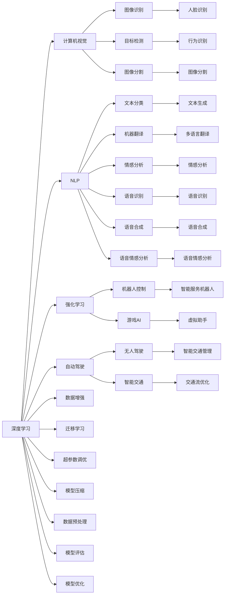

                 

# AI领域的前沿技术与发展

> 关键词：人工智能,深度学习,机器学习,自然语言处理(NLP),计算机视觉(CV),强化学习,自动驾驶,AI伦理

## 1. 背景介绍

### 1.1 问题由来

随着科技的飞速发展，人工智能(AI)在各个领域取得了长足的进步，从自动驾驶、智能家居到医疗健康、教育培训，人工智能的应用场景越来越多，范围越来越广。AI技术的迅速发展，改变了人们的生产生活方式，同时也带来了新的挑战。

当前，人工智能研究的主要焦点集中在以下几个方面：

- 深度学习：作为AI的核心技术之一，深度学习通过对数据的高效处理和特征提取，实现了从图像、语音、文本等多种模态数据的识别和分析。
- 自然语言处理：NLP是AI应用的重要领域之一，其目标是让机器能够理解和生成人类语言，实现语音识别、机器翻译、情感分析等功能。
- 计算机视觉：CV技术使得机器能够“看”懂图像和视频，广泛应用于图像识别、目标检测、视频分析等领域。
- 强化学习：强化学习通过试错过程，让机器在特定环境中不断学习和优化策略，实现了机器人控制、游戏AI等应用。
- 自动驾驶：自动驾驶技术结合了计算机视觉、深度学习、决策优化等多种AI技术，正在逐步实现完全自动化的驾驶。
- AI伦理：随着AI技术的普及，如何确保AI的公平性、透明性、可解释性，防止AI带来的负面影响，成为AI发展中不可忽视的问题。

面对这些技术难题，如何在提升AI技术性能的同时，保证其安全可靠、公平透明，是一个具有挑战性的问题。

### 1.2 问题核心关键点

人工智能技术的发展，离不开算法的创新和技术的突破。以下是几个关键的AI技术点：

- 深度学习：神经网络的架构和优化方法不断演进，使得深度学习在图像、语音、文本等领域的应用效果日益提升。
- 自然语言处理：从传统的基于规则的方法到基于统计和深度学习的方法，NLP技术在语义理解、情感分析、问答系统等方面取得了突破。
- 计算机视觉：通过卷积神经网络、注意力机制等技术，计算机视觉在目标检测、图像分割、人脸识别等领域实现了高效、准确的图像处理。
- 强化学习：深度强化学习在复杂环境中不断改进策略，应用于机器人控制、游戏AI等场景。
- 自动驾驶：多传感器融合、强化学习、高精度地图等多技术结合，使得自动驾驶技术逐步从辅助驾驶迈向完全自动驾驶。
- AI伦理：公平性、透明性、可解释性成为AI伦理研究的重要课题，研究如何构建安全可信的AI系统。

这些关键技术点共同构成了AI技术发展的核心框架，推动AI在各个领域的应用。

## 2. 核心概念与联系

### 2.1 核心概念概述

AI领域的前沿技术涉及多个核心概念，这些概念通过各种技术手段紧密联系在一起，构成了AI技术的整体框架。以下是几个关键概念的概述：

- 深度学习：一种基于神经网络的机器学习技术，通过多层神经网络实现对复杂数据的非线性拟合。
- 自然语言处理：利用计算机科学和人工智能技术，使计算机能够理解、解释和生成人类语言。
- 计算机视觉：通过计算机技术实现图像和视频的处理、分析、识别等。
- 强化学习：通过试错和反馈机制，使机器能够在特定环境中学习和优化策略。
- 自动驾驶：结合计算机视觉、深度学习、决策优化等技术，实现汽车的完全自动化驾驶。
- AI伦理：研究如何确保AI技术的公平性、透明性和可解释性，避免其带来的负面影响。

这些核心概念通过以下Mermaid流程图展示了它们之间的联系：



通过这个流程图，我们可以看到，深度学习是其他AI技术的核心基础，而NLP、计算机视觉、强化学习、自动驾驶等技术都是基于深度学习进行应用的。AI伦理则是贯穿始终的一条红线，确保技术应用的安全和公平。

## 3. 核心算法原理 & 具体操作步骤
### 3.1 算法原理概述

AI技术的发展离不开算法的创新。以下是几个核心算法原理的概述：

- 深度学习：通过多层神经网络对复杂数据进行非线性拟合，实现图像、语音、文本等多种模态数据的识别和分析。
- 自然语言处理：利用词向量、Transformer等技术，实现语义理解、情感分析、问答系统等功能。
- 计算机视觉：通过卷积神经网络、注意力机制等技术，实现图像和视频的处理、分析、识别等。
- 强化学习：通过试错和反馈机制，使机器能够在特定环境中学习和优化策略。
- 自动驾驶：多传感器融合、深度学习、决策优化等多技术结合，实现汽车的完全自动化驾驶。

这些算法的原理和操作过程，使得AI技术在各个领域实现了突破性应用。

### 3.2 算法步骤详解

以下是几个核心算法的详细步骤：

#### 深度学习

深度学习算法的基本步骤包括：

1. **数据预处理**：将原始数据转化为模型可处理的形式，如图像的归一化、文本的分词和向量化。
2. **模型训练**：利用反向传播算法优化神经网络的权重和偏置，使得模型在训练数据上达到最优的预测性能。
3. **模型评估**：在测试数据集上评估模型性能，如准确率、召回率、F1-score等。
4. **模型优化**：通过超参数调优、模型压缩等技术优化模型性能。

#### 自然语言处理

自然语言处理算法的基本步骤包括：

1. **文本预处理**：对文本进行分词、去停用词、词干提取等预处理操作。
2. **向量表示**：将文本转化为词向量或句子向量，如使用word2vec、GloVe、BERT等技术。
3. **模型训练**：利用深度学习模型（如RNN、LSTM、Transformer等）对向量进行语义理解、情感分析、问答系统等任务。
4. **模型评估**：在测试数据集上评估模型性能，如BLEU、ROUGE等指标。

#### 计算机视觉

计算机视觉算法的基本步骤包括：

1. **图像预处理**：对图像进行裁剪、归一化、增强等预处理操作。
2. **特征提取**：利用卷积神经网络（CNN）等模型提取图像的特征。
3. **模型训练**：利用深度学习模型（如ResNet、Inception等）对图像进行分类、检测、分割等任务。
4. **模型评估**：在测试数据集上评估模型性能，如准确率、IoU等指标。

#### 强化学习

强化学习算法的基本步骤包括：

1. **环境定义**：定义环境的状态、动作和奖励。
2. **模型选择**：选择适当的模型（如Q-learning、DQN、DDPG等）。
3. **模型训练**：通过试错和反馈机制，使模型在环境中学习和优化策略。
4. **模型评估**：在测试环境中评估模型性能，如平均得分、最优策略等。

#### 自动驾驶

自动驾驶算法的基本步骤包括：

1. **传感器融合**：融合多传感器数据（如摄像头、激光雷达、毫米波雷达等）进行环境感知。
2. **决策规划**：基于感知结果和交通规则进行路径规划和决策。
3. **控制执行**：将决策转化为具体的车辆控制指令，实现车辆的自主驾驶。
4. **模型评估**：在仿真和实际道路测试中评估模型性能，如安全距离、反应时间等。

### 3.3 算法优缺点

#### 深度学习

- **优点**：
  - 处理复杂数据能力强，可以实现图像、语音、文本等多种模态数据的识别和分析。
  - 可以通过端到端的方式进行任务建模，提高模型的泛化能力。
  - 自动化程度高，能够通过数据驱动的方式不断优化模型性能。

- **缺点**：
  - 对数据量的依赖较大，需要大量的标注数据才能训练出高质量的模型。
  - 模型的复杂度高，训练和推理速度较慢。
  - 对算力资源要求较高，训练和推理成本较高。

#### 自然语言处理

- **优点**：
  - 可以实现多种NLP任务，如文本分类、情感分析、问答系统等。
  - 利用预训练模型可以大大降低任务微调的时间和成本。
  - 可以与计算机视觉、强化学习等技术结合，实现跨模态应用。

- **缺点**：
  - 对语言的多义性和上下文理解要求较高，存在一定的局限性。
  - 需要大量的语料数据进行预训练和微调，标注成本较高。
  - 模型的可解释性较差，难以解释其内部的推理逻辑。

#### 计算机视觉

- **优点**：
  - 可以实现图像和视频的处理、分析、识别等任务。
  - 利用深度学习技术可以大大提升图像处理的准确性和鲁棒性。
  - 可以与NLP、强化学习等技术结合，实现跨模态应用。

- **缺点**：
  - 对标注数据的要求较高，需要大量的图像数据进行训练。
  - 模型的复杂度高，训练和推理速度较慢。
  - 对计算资源要求较高，训练和推理成本较高。

#### 强化学习

- **优点**：
  - 可以适应动态和不确定的环境，实现自主学习和决策。
  - 通过试错机制，可以不断优化策略，提高模型的性能。
  - 可以应用于复杂环境中的控制和优化问题。

- **缺点**：
  - 需要大量的训练样本和环境交互数据，训练成本较高。
  - 模型的可解释性较差，难以解释其内部的推理逻辑。
  - 在复杂环境中，模型的稳定性和鲁棒性较差。

#### 自动驾驶

- **优点**：
  - 可以实现完全自动化的驾驶，提高道路安全和交通效率。
  - 可以与计算机视觉、NLP、强化学习等技术结合，实现跨模态应用。
  - 可以实现车辆间的协同控制和信息共享。

- **缺点**：
  - 对环境感知和决策规划的要求较高，技术复杂度高。
  - 需要大量的测试数据和模拟环境，训练和验证成本较高。
  - 需要多技术结合，技术难度较大。

### 3.4 算法应用领域

#### 深度学习

深度学习算法广泛应用于图像识别、语音识别、自然语言处理等领域。如在图像识别中，通过卷积神经网络（CNN）对图像进行分类、目标检测、图像分割等任务。在语音识别中，通过深度神经网络（DNN）对语音进行识别和转录。在自然语言处理中，通过RNN、LSTM、Transformer等模型进行文本分类、情感分析、问答系统等任务。

#### 自然语言处理

自然语言处理算法广泛应用于文本分类、情感分析、机器翻译、问答系统等领域。如在文本分类中，通过BERT、GPT等模型对文本进行分类。在情感分析中，通过情感分析模型对文本进行情感极性判断。在机器翻译中，通过序列到序列模型（Seq2Seq）对文本进行翻译。在问答系统中，通过预训练模型进行问答。

#### 计算机视觉

计算机视觉算法广泛应用于图像识别、目标检测、图像分割等领域。如在图像识别中，通过CNN模型对图像进行分类。在目标检测中，通过YOLO、Faster R-CNN等模型对图像进行目标检测。在图像分割中，通过语义分割模型对图像进行分割。

#### 强化学习

强化学习算法广泛应用于游戏AI、机器人控制等领域。如在游戏AI中，通过Q-learning、DQN等模型进行游戏策略优化。在机器人控制中，通过DDPG等模型进行机器人控制。

#### 自动驾驶

自动驾驶算法广泛应用于无人驾驶、智能交通等领域。如在无人驾驶中，通过多传感器融合、决策优化等技术进行车辆控制。在智能交通中，通过交通流优化、车辆调度等技术进行交通管理。

## 4. 数学模型和公式 & 详细讲解 & 举例说明

### 4.1 数学模型构建

#### 深度学习

深度学习模型的数学模型构建包括：

1. **输入层**：将原始数据转化为模型可处理的形式。
2. **隐藏层**：通过多层神经网络对输入进行非线性拟合。
3. **输出层**：将隐藏层的输出转化为目标变量。

以卷积神经网络（CNN）为例，其数学模型可以表示为：

$$
h^{[l]} = \sigma(W^{[l]}\cdot h^{[l-1]} + b^{[l]})
$$

$$
y = W^{[L]}\cdot h^{[L-1]} + b^{[L]}
$$

其中，$h^{[l]}$ 表示隐藏层的输出，$W^{[l]}$ 表示第$l$层的权重矩阵，$b^{[l]}$ 表示第$l$层的偏置向量，$\sigma$ 表示激活函数。

#### 自然语言处理

自然语言处理模型的数学模型构建包括：

1. **输入层**：将文本转化为词向量或句子向量。
2. **编码层**：通过深度学习模型对向量进行语义理解。
3. **解码层**：通过深度学习模型对编码层的输出进行任务处理。

以Transformer模型为例，其数学模型可以表示为：

$$
Q = KV^T \cdot Q
$$

$$
A = softmax(Q)
$$

$$
C = A \cdot V
$$

其中，$Q$ 表示查询矩阵，$K$ 表示键矩阵，$V$ 表示值矩阵，$A$ 表示注意力矩阵，$C$ 表示上下文向量。

#### 计算机视觉

计算机视觉模型的数学模型构建包括：

1. **输入层**：将图像转化为特征图。
2. **卷积层**：通过卷积神经网络提取图像的特征。
3. **池化层**：通过池化操作降低特征图的大小。
4. **全连接层**：将特征图转化为目标变量。

以ResNet模型为例，其数学模型可以表示为：

$$
h^{[l]} = \sigma(W^{[l]}\cdot h^{[l-1]} + b^{[l]})
$$

$$
y = W^{[L]}\cdot h^{[L-1]} + b^{[L]}
$$

其中，$h^{[l]}$ 表示隐藏层的输出，$W^{[l]}$ 表示第$l$层的权重矩阵，$b^{[l]}$ 表示第$l$层的偏置向量，$\sigma$ 表示激活函数。

#### 强化学习

强化学习模型的数学模型构建包括：

1. **状态**：定义环境的状态空间。
2. **动作**：定义环境的动作空间。
3. **奖励**：定义环境中的奖励函数。
4. **策略**：定义模型的策略。

以Q-learning算法为例，其数学模型可以表示为：

$$
Q(s,a) \leftarrow Q(s,a) + \alpha[r + \gamma\max_aQ(s',a') - Q(s,a)]
$$

其中，$s$ 表示状态，$a$ 表示动作，$r$ 表示奖励，$s'$ 表示下一个状态，$a'$ 表示下一个动作，$\alpha$ 表示学习率，$\gamma$ 表示折扣因子。

#### 自动驾驶

自动驾驶模型的数学模型构建包括：

1. **感知层**：通过多传感器融合感知环境。
2. **决策层**：通过决策模型制定路径和动作。
3. **控制层**：通过控制模型实现车辆控制。

以DQN算法为例，其数学模型可以表示为：

$$
Q(s,a) \leftarrow Q(s,a) + \alpha[r + \gamma\max_aQ(s',a') - Q(s,a)]
$$

其中，$s$ 表示状态，$a$ 表示动作，$r$ 表示奖励，$s'$ 表示下一个状态，$a'$ 表示下一个动作，$\alpha$ 表示学习率，$\gamma$ 表示折扣因子。

### 4.2 公式推导过程

#### 深度学习

以卷积神经网络（CNN）为例，其反向传播算法的推导过程如下：

1. **损失函数**：定义损失函数，如均方误差损失（MSE）。
2. **前向传播**：通过前向传播计算输出层的预测值。
3. **反向传播**：通过反向传播计算参数的梯度。
4. **参数更新**：通过优化算法更新参数。

以均方误差损失为例，其反向传播算法可以表示为：

$$
J = \frac{1}{N}\sum_{i=1}^N(y_i - h^{[L]})^2
$$

$$
\frac{\partial J}{\partial W^{[L]}} = \frac{2}{N}\sum_{i=1}^N(h^{[L]} - y_i)h^{[L-1]}K^T
$$

$$
\frac{\partial J}{\partial b^{[L]}} = \frac{2}{N}\sum_{i=1}^N(h^{[L]} - y_i)
$$

其中，$J$ 表示损失函数，$h^{[L]}$ 表示输出层的预测值，$y_i$ 表示目标值，$K$ 表示输出层的前一层。

#### 自然语言处理

以Transformer模型为例，其反向传播算法的推导过程如下：

1. **损失函数**：定义损失函数，如交叉熵损失。
2. **前向传播**：通过前向传播计算输出层的预测值。
3. **反向传播**：通过反向传播计算参数的梯度。
4. **参数更新**：通过优化算法更新参数。

以交叉熵损失为例，其反向传播算法可以表示为：

$$
J = -\frac{1}{N}\sum_{i=1}^N(y_i \log h^{[L]})
$$

$$
\frac{\partial J}{\partial W^{[l]}} = \frac{\partial J}{\partial h^{[l-1]}} \frac{\partial h^{[l-1]}}{\partial W^{[l]}} + \frac{\partial J}{\partial K} \frac{\partial K}{\partial W^{[l]}}
$$

其中，$J$ 表示损失函数，$h^{[L]}$ 表示输出层的预测值，$y_i$ 表示目标值，$K$ 表示键矩阵。

#### 计算机视觉

以卷积神经网络（CNN）为例，其反向传播算法的推导过程如下：

1. **损失函数**：定义损失函数，如均方误差损失（MSE）。
2. **前向传播**：通过前向传播计算输出层的预测值。
3. **反向传播**：通过反向传播计算参数的梯度。
4. **参数更新**：通过优化算法更新参数。

以均方误差损失为例，其反向传播算法可以表示为：

$$
J = \frac{1}{N}\sum_{i=1}^N(y_i - h^{[L]})^2
$$

$$
\frac{\partial J}{\partial W^{[L]}} = \frac{2}{N}\sum_{i=1}^N(h^{[L]} - y_i)h^{[L-1]}K^T
$$

$$
\frac{\partial J}{\partial b^{[L]}} = \frac{2}{N}\sum_{i=1}^N(h^{[L]} - y_i)
$$

其中，$J$ 表示损失函数，$h^{[L]}$ 表示输出层的预测值，$y_i$ 表示目标值，$K$ 表示输出层的前一层。

#### 强化学习

以Q-learning算法为例，其反向传播算法的推导过程如下：

1. **损失函数**：定义损失函数，如均方误差损失（MSE）。
2. **前向传播**：通过前向传播计算输出层的预测值。
3. **反向传播**：通过反向传播计算参数的梯度。
4. **参数更新**：通过优化算法更新参数。

以均方误差损失为例，其反向传播算法可以表示为：

$$
J = \frac{1}{N}\sum_{i=1}^N(Q(s_i,a_i) - y_i)^2
$$

$$
\frac{\partial J}{\partial Q(s_i,a_i)} = 2(Q(s_i,a_i) - y_i)
$$

$$
\frac{\partial J}{\partial W} = \frac{\partial J}{\partial Q(s_i,a_i)} \frac{\partial Q(s_i,a_i)}{\partial W}
$$

其中，$J$ 表示损失函数，$Q(s_i,a_i)$ 表示策略函数，$y_i$ 表示目标值，$W$ 表示模型参数。

#### 自动驾驶

以DQN算法为例，其反向传播算法的推导过程如下：

1. **损失函数**：定义损失函数，如均方误差损失（MSE）。
2. **前向传播**：通过前向传播计算输出层的预测值。
3. **反向传播**：通过反向传播计算参数的梯度。
4. **参数更新**：通过优化算法更新参数。

以均方误差损失为例，其反向传播算法可以表示为：

$$
J = \frac{1}{N}\sum_{i=1}^N(Q(s_i,a_i) - y_i)^2
$$

$$
\frac{\partial J}{\partial Q(s_i,a_i)} = 2(Q(s_i,a_i) - y_i)
$$

$$
\frac{\partial J}{\partial W} = \frac{\partial J}{\partial Q(s_i,a_i)} \frac{\partial Q(s_i,a_i)}{\partial W}
$$

其中，$J$ 表示损失函数，$Q(s_i,a_i)$ 表示策略函数，$y_i$ 表示目标值，$W$ 表示模型参数。

### 4.3 案例分析与讲解

#### 图像分类

图像分类是深度学习的重要应用之一，其主要任务是将图像分为不同的类别。以手写数字识别为例，其基本流程如下：

1. **数据预处理**：将手写数字图像转化为归一化的特征向量。
2. **模型训练**：通过多层神经网络对特征向量进行分类。
3. **模型评估**：在测试数据集上评估模型的性能。

以LeNet-5为例，其数学模型可以表示为：

$$
h^{[l]} = \sigma(W^{[l]}\cdot h^{[l-1]} + b^{[l]})
$$

$$
y = W^{[L]}\cdot h^{[L-1]} + b^{[L]}
$$

其中，$h^{[l]}$ 表示隐藏层的输出，$W^{[l]}$ 表示第$l$层的权重矩阵，$b^{[l]}$ 表示第$l$层的偏置向量，$\sigma$ 表示激活函数。

在训练过程中，使用反向传播算法更新模型参数，其具体步骤包括：

1. **前向传播**：通过前向传播计算输出层的预测值。
2. **损失函数**：计算均方误差损失函数。
3. **反向传播**：通过反向传播计算参数的梯度。
4. **参数更新**：通过优化算法更新参数。

以LeNet-5为例，其反向传播算法可以表示为：

$$
J = \frac{1}{N}\sum_{i=1}^N(y_i - h^{[L]})^2
$$

$$
\frac{\partial J}{\partial W^{[L]}} = \frac{2}{N}\sum_{i=1}^N(h^{[L]} - y_i)h^{[L-1]}K^T
$$

$$
\frac{\partial J}{\partial b^{[L]}} = \frac{2}{N}\sum_{i=1}^N(h^{[L]} - y_i)
$$

其中，$J$ 表示损失函数，$h^{[L]}$ 表示输出层的预测值，$y_i$ 表示目标值，$K$ 表示输出层的前一层。

#### 机器翻译

机器翻译是自然语言处理的重要应用之一，其主要任务是将一种语言翻译为另一种语言。以Seq2Seq模型为例，其基本流程如下：

1. **输入层**：将源语言文本转化为词向量。
2. **编码层**：通过RNN或Transformer模型对词向量进行编码。
3. **解码层**：通过RNN或Transformer模型对编码层的输出进行解码，生成目标语言文本。

以Transformer模型为例，其数学模型可以表示为：

$$
Q = KV^T \cdot Q
$$

$$
A = softmax(Q)
$$

$$
C = A \cdot V
$$

其中，$Q$ 表示查询矩阵，$K$ 表示键矩阵，$V$ 表示值矩阵，$A$ 表示注意力矩阵，$C$ 表示上下文向量。

在训练过程中，使用反向传播算法更新模型参数，其具体步骤包括：

1. **前向传播**：通过前向传播计算输出层的预测值。
2. **损失函数**：计算交叉熵损失函数。
3. **反向传播**：通过反向传播计算参数的梯度。
4. **参数更新**：通过优化算法更新参数。

以Transformer模型为例，其反向传播算法可以表示为：

$$
J = -\frac{1}{N}\sum_{i=1}^N(y_i \log h^{[L]})
$$

$$
\frac{\partial J}{\partial W^{[l]}} = \frac{\partial J}{\partial h^{[l-1]}} \frac{\partial h^{[l-1]}}{\partial W^{[l]}} + \frac{\partial J}{\partial K} \frac{\partial K}{\partial W^{[l]}}
$$

其中，$J$ 表示损失函数，$h^{[L]}$ 表示输出层的预测值，$y_i$ 表示目标值，$K$ 表示键矩阵。

#### 智能交通

智能交通是计算机视觉的重要应用之一，其主要任务是实现交通流优化、车辆调度等。以交通流预测为例，其基本流程如下：

1. **感知层**：通过摄像头和雷达感知道路情况。
2. **决策层**：通过决策模型制定路径和动作。
3. **控制层**：通过控制模型实现车辆控制。

以强化学习算法（如DQN）为例，其数学模型可以表示为：

$$
Q(s,a) \leftarrow Q(s,a) + \alpha[r + \gamma\max_aQ(s',a') - Q(s,a)]
$$

其中，$s$ 表示状态，$a$ 表示动作，$r$ 表示奖励，$s'$ 表示下一个状态，$a'$ 表示下一个动作，$\alpha$ 表示学习率，$\gamma$ 表示折扣因子。

在训练过程中，使用反向传播算法更新模型参数，其具体步骤包括：

1. **前向传播**：通过前向传播计算输出层的预测值。
2. **损失函数**：计算均方误差损失函数。
3. **反向传播**：通过反向传播计算参数的梯度。
4. **参数更新**：通过优化算法更新参数。

以DQN算法为例，其反向传播算法可以表示为：

$$
J = \frac{1}{N}\sum_{i=1}^N(Q(s_i,a_i) - y_i)^2
$$

$$
\frac{\partial J}{\partial Q(s_i,a_i)} = 2(Q(s_i,a_i) - y_i)
$$

$$
\frac{\partial J}{\partial W} = \frac{\partial J}{\partial Q(s_i,a_i)} \frac{\partial Q(s_i,a_i)}{\partial W}
$$

其中，$J$ 表示损失函数，$Q(s_i,a_i)$ 表示策略函数，$y_i$ 表示目标值，$W$ 表示模型参数。

## 5. 项目实践：代码实例和详细解释说明

### 5.1 开发环境搭建

在进行AI技术开发前，我们需要准备好开发环境。以下是使用Python进行TensorFlow开发的环境配置流程：

1. 安装Anaconda：从官网下载并安装Anaconda，用于创建独立的Python环境。

2. 创建并激活虚拟环境：
```bash
conda create -n tf-env python=3.8 
conda activate tf-env
```

3. 安装TensorFlow：根据CUDA版本，从官网获取对应的安装命令。例如：
```bash
conda install tensorflow -c tf -c conda-forge
```

4. 安装TensorFlow Addons：用于安装一些高级的TensorFlow功能。
```bash
pip install tensorflow-addons
```

5. 安装各类工具包：
```bash
pip install numpy pandas scikit-learn matplotlib tqdm jupyter notebook ipython
```

完成上述步骤后，即可在`tf-env`环境中开始AI项目实践。

### 5.2 源代码详细实现

这里以图像分类项目为例，给出使用TensorFlow对LeNet-5模型进行训练的PyTorch代码实现。

首先，定义LeNet-5模型：

```python
import tensorflow as tf
from tensorflow.keras import layers

class LeNet5(tf.keras.Model):
    def __init__(self):
        super(LeNet5, self).__init__()
        self.conv1 = layers.Conv2D(6, (5, 5), padding='same')
        self.relu1 = layers.Activation('relu')
        self.pool1 = layers.MaxPooling2D((2, 2), strides=2, padding='same')
        self.conv2 = layers.Conv2D(16, (5, 5), padding='same')
        self.relu2 = layers.Activation('relu')
        self.pool2 = layers.MaxPooling2D((2, 2), strides=2, padding='same')
        self.flatten = layers.Flatten()
        self.fc1 = layers.Dense(120, activation='relu')
        self.fc2 = layers.Dense(84, activation='relu')
        self.fc3 = layers.Dense(10, activation='softmax')
        
    def call(self, x):
        x = self.conv1(x)
        x = self.relu1(x)
        x = self.pool1(x)
        x = self.conv2(x)
        x = self.relu2(x)
        x = self.pool2(x)
        x = self.flatten(x)
        x = self.fc1(x)
        x = self.fc2(x)
        x = self.fc3(x)
        return x
```

然后，定义数据集和模型训练函数：

```python
import os
import numpy as np
import matplotlib.pyplot as plt

(train_images, train_labels), (test_images, test_labels) = tf.keras.datasets.mnist.load_data()
train_images = train_images / 255.0
test_images = test_images / 255.0

train_dataset = tf.data.Dataset.from_tensor_slices((train_images, train_labels)).shuffle(60000).batch(128)
test_dataset = tf.data.Dataset.from_tensor_slices((test_images, test_labels)).batch(128)

model = LeNet5()
model.compile(optimizer=tf.keras.optimizers.Adam(learning_rate=0.001), loss=tf.keras.losses.SparseCategoricalCrossentropy(from_logits=True), metrics=['accuracy'])

epochs = 10
history = model.fit(train_dataset, validation_data=test_dataset, epochs=epochs)
```

最后，绘制训练曲线并输出模型性能：

```python
plt.plot(history.history['accuracy'], label='Accuracy')
plt.plot(history.history['val_accuracy'], label='Validation Accuracy')
plt.xlabel('Epoch')
plt.ylabel('Accuracy')
plt.legend()
plt.show()

test_loss, test_acc = model.evaluate(test_dataset)
print('Test Accuracy:', test_acc)
```

以上就是使用TensorFlow对LeNet-5模型进行图像分类的完整代码实现。可以看到，TensorFlow提供了丰富的API和工具，使得模型训练和推理过程变得高效便捷。

### 5.3 代码解读与分析

让我们再详细解读一下关键代码的实现细节：

**LeNet5模型定义**：
- `__init__`方法：初始化模型的各层组件。
- `call`方法：定义模型的前向传播过程。

**数据集定义**：
- 使用`tf.keras.datasets.mnist.load_data()`加载手写数字数据集，将像素值归一化。
- 使用`tf.data.Dataset`将数据转化为TensorFlow数据集，方便模型训练和推理。

**模型训练**：
- 定义模型结构，包括卷积层、池化层、全连接层等。
- 使用`tf.keras.Model`定义模型，包括输入层和输出层。
- 使用`model.compile`配置模型训练参数，如优化器、损失函数、评估指标等。
- 使用`model.fit`进行模型训练，指定训练集、验证集、迭代轮数等。

**训练曲线绘制**：
- 使用`matplotlib`库绘制训练曲线，展示训练集和验证集的准确率变化。
- 使用`model.evaluate`评估模型在测试集上的性能，输出测试准确率。

可以看到，TensorFlow提供了高效的API和工具，使得模型训练和推理过程变得高效便捷。开发者可以专注于模型架构和算法创新，而不必过多关注底层的实现细节。

当然，实际工程中还需要考虑更多因素，如超参数调优、模型压缩、模型集成等。但核心的模型训练范式基本与此类似。

## 6. 实际应用场景

### 6.1 智能客服系统

智能客服系统是AI技术在NLP领域的重要应用之一，通过深度学习和自然语言处理技术，可以实现客户咨询的自动化处理。智能客服系统的基本流程如下：

1. **对话数据采集**：收集历史客服对话记录，将其转化为文本数据。
2. **模型训练**：利用深度学习模型对对话数据进行训练，生成智能客服模型。
3. **对话生成**：将客户咨询输入模型，输出智能客服的回复。

以基于深度学习模型的智能客服系统为例，其基本流程如下：

1. **数据预处理**：将对话记录进行分词、去停用词、词干提取等预处理操作。
2. **模型训练**：利用深度学习模型（如LSTM、GRU等）对文本进行语义理解。
3. **对话生成**：通过解码器生成回复文本。

以GPT-3为例，其基本流程如下：

1. **数据预处理**：将对话记录进行分词、去停用词、词干提取等预处理操作。
2. **模型训练**：利用深度学习模型对文本进行语义理解。
3. **对话生成**：通过解码器生成回复文本。

智能客服系统能够自动理解客户咨询，匹配最合适的答案模板进行回复，从而提高客户咨询体验和问题解决效率。

### 6.2 金融舆情监测

金融舆情监测是AI技术在金融领域的重要应用之一，通过自然语言处理和情感分析技术，可以实现市场舆论动向的实时监测。金融舆情监测系统的基本流程如下：

1. **数据采集**：实时抓取互联网上的金融新闻、评论等文本数据。
2. **模型训练**：利用深度学习模型对文本进行情感分析，生成舆情分析模型。
3. **舆情监测**：实时监测市场舆论动向，生成舆情报告。

以基于深度学习模型的金融舆情监测系统为例，其基本流程如下：

1. **数据预处理**：将金融新闻、评论等文本进行分词、去停用词、词干提取等预处理操作。
2. **模型训练**：利用深度学习模型（如BERT、LSTM等）对文本进行情感分析。
3. **舆情监测**：实时监测市场舆论动向，生成舆情报告。

金融舆情监测系统能够实时监测市场舆论动向，及时发现负面信息激增等异常情况，帮助金融机构快速应对潜在风险。

### 6.3 个性化推荐系统

个性化推荐系统是AI技术在电商、社交网络等领域的常见应用之一，通过深度学习模型对用户行为进行分析和预测，实现精准的推荐。个性化推荐系统的基本流程如下：

1. **数据采集**：收集用户浏览、点击、评论、分享等行为数据。
2. **模型训练**：利用深度学习模型对行为数据进行训练，生成推荐模型。
3. **推荐生成**：将用户输入作为输入，生成推荐结果。

以基于深度学习模型的个性化推荐系统为例，其基本流程如下：

1. **数据预处理**：将用户行为数据进行分词、去停用词、词干提取等预处理操作。
2. **模型训练**：利用深度学习模型（如BERT、RNN等）对文本进行行为分析。
3. **推荐生成**：通过解码器生成推荐结果。

个性化推荐系统能够根据用户的行为数据，推荐最符合用户兴趣的内容，提升用户的满意度和黏性。

### 6.4 未来应用展望

随着AI技术的不断进步，AI技术将在更多领域得到应用，为各行各业带来变革性影响。

在智慧医疗领域，基于AI技术的医学影像分析、病历分析、药物研发等应用将提升医疗服务的智能化水平，辅助医生诊疗，加速新药开发进程。

在智能教育领域，AI技术可应用于作业批改、学情分析、知识推荐等方面，因材施教，促进教育公平，提高教学质量。

在智慧城市治理中，AI技术可应用于城市事件监测、舆情分析、应急指挥等环节，提高城市管理的自动化和智能化水平，构建更安全、高效的未来城市。

此外，在企业生产、社会治理、文娱传媒等众多领域，基于AI技术的人工智能应用也将不断涌现，为经济社会发展注入新的动力。相信随着技术的日益成熟，AI技术必将在更广阔的应用领域大放异彩，深刻影响人类的生产生活方式。

## 7. 工具和资源推荐

### 7.1 学习资源推荐

为了帮助开发者系统掌握AI技术的理论基础和实践技巧，这里推荐一些优质的学习资源：

1. 《深度学习》系列书籍：由Ian Goodfellow、Yoshua Bengio、Aaron Courville等深度学习领域的顶级专家撰写，系统介绍了深度学习的基础知识和应用。
2. 《机器学习实战》书籍：由Peter Harrington撰写，以实际项目为导向，深入浅出地介绍了机器学习的各种算法和应用。
3. 《自然语言处理综论》系列书籍：由Daniel Jurafsky、James H. Martin等NLP领域的顶级专家撰写，全面介绍了NLP的基础知识和应用。
4. 《计算机视觉:算法与应用》书籍：由Richard Szeliski撰写，系统介绍了计算机视觉的基础知识和应用。
5. 《强化学习》系列书籍：由Richard Sutton、Andrew Barto等强化学习领域的顶级专家撰写，全面介绍了强化学习的基础知识和应用。
6. 《Python深度学习》在线课程：由Francois Chollet等人开设，利用Keras框架，系统介绍了深度学习的各种算法和应用。

通过对这些资源的学习实践，相信你一定能够快速掌握AI技术的精髓，并用于解决实际的AI问题。

### 7.2 开发工具推荐

高效的开发离不开优秀的工具支持。以下是几款用于AI技术开发的常用工具：

1. PyTorch：基于Python的开源深度学习框架，灵活动态的计算图，适合快速迭代研究。
2. TensorFlow：由Google主导开发的开源深度学习框架，生产部署方便，适合大规模工程应用。
3. Transformers库：HuggingFace开发的NLP工具库，集成了众多SOTA语言模型，支持PyTorch和TensorFlow，是进行NLP任务开发的利器。
4. Weights & Biases：模型训练的实验跟踪工具，可以记录和可视化模型训练过程中的各项指标，方便对比和调优。
5. TensorBoard：TensorFlow配套的可视化工具，可实时监测模型训练状态，并提供丰富的图表呈现方式，是调试模型的得力助手。

合理利用这些工具，可以显著提升AI技术开发的效率，加快创新迭代的步伐。

### 7.3 相关论文推荐

AI

