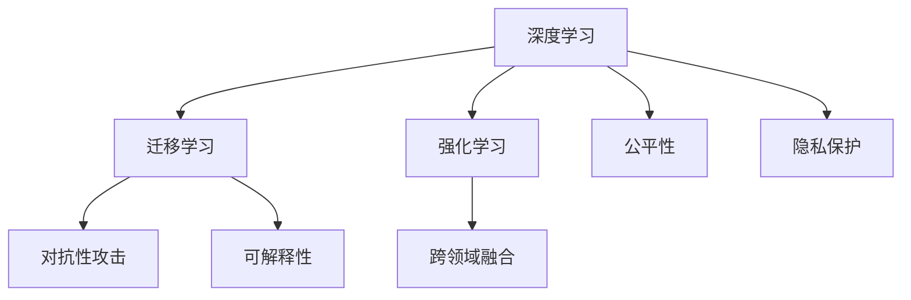

                 

# AI领域的技术突破与发展

## 1. 背景介绍

### 1.1 问题由来
人工智能（AI）技术正处于前所未有的发展时期，从基础研究到应用落地，AI技术不断带来革命性的突破。从机器学习、深度学习到如今蓬勃发展的深度强化学习，AI技术的快速发展正在改变我们的生活方式和工作模式。AI技术在医疗、金融、教育、工业等多个领域的应用，正在不断提升生产效率、改善用户体验、推动社会进步。

然而，尽管AI技术已经取得了显著进展，但其在许多领域仍然面临诸多挑战。如何提高AI模型的可解释性、安全性、鲁棒性和泛化能力，如何将AI技术更好地与业务需求和行业知识结合，是当前AI领域的重要研究课题。

### 1.2 问题核心关键点
AI技术的突破与发展，离不开对核心概念和方法的理解与掌握。以下是AI技术发展的核心关键点：

- **深度学习**：通过多层神经网络对数据进行建模，自动学习数据特征，并在特定任务上取得优异性能。
- **迁移学习**：通过在不同任务之间迁移知识，降低新任务学习成本，提高模型泛化能力。
- **强化学习**：通过与环境交互，智能体学习最优策略，在复杂的决策任务上表现出色。
- **对抗性攻击**：攻击者利用模型决策漏洞，通过小扰动实现攻击，威胁模型安全性。
- **可解释性**：模型输出结果难以理解，缺乏透明度和可解释性，限制了AI技术的实际应用。
- **公平性**：AI模型在训练过程中可能存在偏见，导致对某些群体的歧视，影响公平性。
- **隐私保护**：数据隐私和安全问题在AI应用中日益重要，如何保护用户数据隐私成为关键挑战。
- **跨领域融合**：AI技术与其他学科的融合，如AI+IoT、AI+生物医学等，拓展了AI技术的实际应用范围。

这些核心关键点构成了AI技术发展的基石，决定了AI技术的未来走向。

## 2. 核心概念与联系

### 2.1 核心概念概述

为更好地理解AI技术的发展，本节将介绍几个密切相关的核心概念：

- **深度学习**：通过多层神经网络自动学习数据特征，在图像识别、语音识别、自然语言处理等领域取得显著成果。
- **迁移学习**：通过在不同任务之间迁移知识，降低新任务学习成本，提高模型泛化能力。
- **强化学习**：通过与环境交互，智能体学习最优策略，在复杂的决策任务上表现出色。
- **对抗性攻击**：攻击者利用模型决策漏洞，通过小扰动实现攻击，威胁模型安全性。
- **可解释性**：模型输出结果难以理解，缺乏透明度和可解释性，限制了AI技术的实际应用。
- **公平性**：AI模型在训练过程中可能存在偏见，导致对某些群体的歧视，影响公平性。
- **隐私保护**：数据隐私和安全问题在AI应用中日益重要，如何保护用户数据隐私成为关键挑战。
- **跨领域融合**：AI技术与其他学科的融合，如AI+IoT、AI+生物医学等，拓展了AI技术的实际应用范围。

这些核心概念之间的逻辑关系可以通过以下Mermaid流程图来展示：



这个流程图展示了大语言模型的核心概念及其之间的关系：

1. 深度学习作为AI技术的基石，通过多层神经网络自动学习数据特征，在特定任务上取得优异性能。
2. 迁移学习通过在不同任务之间迁移知识，降低新任务学习成本，提高模型泛化能力。
3. 强化学习通过与环境交互，智能体学习最优策略，在复杂的决策任务上表现出色。
4. 对抗性攻击利用模型决策漏洞，通过小扰动实现攻击，威胁模型安全性。
5. 可解释性模型输出结果难以理解，缺乏透明度和可解释性，限制了AI技术的实际应用。
6. 公平性AI模型在训练过程中可能存在偏见，导致对某些群体的歧视，影响公平性。
7. 隐私保护数据隐私和安全问题在AI应用中日益重要，如何保护用户数据隐私成为关键挑战。
8. 跨领域融合AI技术与其他学科的融合，如AI+IoT、AI+生物医学等，拓展了AI技术的实际应用范围。

这些核心概念共同构成了AI技术的核心框架，使其能够在各种场景下发挥强大的能力。通过理解这些核心概念，我们可以更好地把握AI技术的工作原理和优化方向。

## 3. 核心算法原理 & 具体操作步骤
### 3.1 算法原理概述

AI技术的发展离不开核心算法的支撑。深度学习、迁移学习、强化学习、对抗性攻击、可解释性、公平性、隐私保护、跨领域融合等技术，都是通过算法实现的。

深度学习通过多层神经网络对数据进行建模，自动学习数据特征，并在特定任务上取得优异性能。其核心在于梯度下降算法，通过反向传播计算损失函数梯度，最小化模型误差，不断优化模型参数。

迁移学习通过在不同任务之间迁移知识，降低新任务学习成本，提高模型泛化能力。其核心在于使用已有模型作为初始化参数，通过微调模型权重，适应新任务。

强化学习通过与环境交互，智能体学习最优策略，在复杂的决策任务上表现出色。其核心在于Q-learning算法，通过奖励机制优化智能体行为策略。

对抗性攻击利用模型决策漏洞，通过小扰动实现攻击，威胁模型安全性。其核心在于生成对抗网络（GAN），通过对抗样本来生成扰动数据。

可解释性模型输出结果难以理解，缺乏透明度和可解释性，限制了AI技术的实际应用。其核心在于LIME算法，通过局部近似来解释模型输出。

公平性AI模型在训练过程中可能存在偏见，导致对某些群体的歧视，影响公平性。其核心在于公平优化算法，通过约束模型参数减少偏差。

隐私保护数据隐私和安全问题在AI应用中日益重要，如何保护用户数据隐私成为关键挑战。其核心在于差分隐私算法，通过随机扰动保护用户数据。

跨领域融合AI技术与其他学科的融合，如AI+IoT、AI+生物医学等，拓展了AI技术的实际应用范围。其核心在于知识图谱、跨领域数据融合等技术。

### 3.2 算法步骤详解

深度学习算法的步骤主要包括数据预处理、模型构建、训练和测试等环节。

1. 数据预处理：对原始数据进行清洗、归一化、特征提取等预处理操作，生成适合模型输入的数据集。
2. 模型构建：选择合适的神经网络结构，并对其进行参数初始化。
3. 训练：通过反向传播算法计算损失函数梯度，最小化模型误差，不断优化模型参数。
4. 测试：在测试集上评估模型性能，衡量模型泛化能力。

迁移学习算法的步骤主要包括模型初始化、模型微调和性能评估等环节。

1. 模型初始化：使用已有模型作为初始化参数，生成待微调的模型。
2. 模型微调：在目标任务数据集上，通过微调模型权重，适应新任务。
3. 性能评估：在测试集上评估模型性能，衡量模型泛化能力。

强化学习算法的步骤主要包括环境模拟、智能体行为策略优化等环节。

1. 环境模拟：通过模拟环境生成状态序列，用于智能体行为策略的优化。
2. 智能体行为策略优化：通过Q-learning算法优化智能体行为策略，实现最优决策。

对抗性攻击算法的步骤主要包括生成对抗样本、评估攻击效果等环节。

1. 生成对抗样本：通过生成对抗网络（GAN）生成对抗样本。
2. 评估攻击效果：评估模型在对抗样本上的鲁棒性，衡量攻击效果。

可解释性算法的步骤主要包括特征重要性分析、局部近似等环节。

1. 特征重要性分析：通过LIME算法，分析模型输入特征对输出的重要性。
2. 局部近似：通过局部近似方法，解释模型输出。

公平性算法的步骤主要包括公平优化目标设计、公平性评估等环节。

1. 公平优化目标设计：通过约束模型参数，减少模型偏见。
2. 公平性评估：通过公平性指标，评估模型公平性。

隐私保护算法的步骤主要包括差分隐私设计、隐私评估等环节。

1. 差分隐私设计：通过随机扰动保护用户数据。
2. 隐私评估：通过隐私指标，评估数据隐私保护效果。

跨领域融合算法的步骤主要包括知识图谱构建、跨领域数据融合等环节。

1. 知识图谱构建：通过知识图谱技术，构建跨领域知识体系。
2. 跨领域数据融合：通过跨领域数据融合技术，实现领域知识迁移。

### 3.3 算法优缺点

深度学习算法的优点在于其强大的数据建模能力，适用于各种复杂的任务。但其缺点在于模型训练和调参复杂，存在过拟合风险。

迁移学习算法的优点在于其低成本、高效能的特点，能够快速适应新任务。但其缺点在于模型泛化能力有限，存在数据偏差。

强化学习算法的优点在于其智能决策能力，适用于复杂的决策任务。但其缺点在于环境复杂性高，训练过程耗时耗资源。

对抗性攻击算法的优点在于其攻击效果显著，能够有效揭示模型漏洞。但其缺点在于攻击手段多样化，防御难度大。

可解释性算法的优点在于其提高模型透明度的特点，有助于提升用户信任。但其缺点在于解释结果可能存在误导。

公平性算法的优点在于其提升模型公平性的特点，有助于消除偏见。但其缺点在于公平优化目标设计复杂，难以全面覆盖。

隐私保护算法的优点在于其保护用户隐私的特点，有助于数据安全。但其缺点在于数据隐私保护与模型性能之间存在矛盾。

跨领域融合算法的优点在于其拓展应用范围的特点，有助于提高AI技术的多样性。但其缺点在于知识图谱构建和跨领域数据融合复杂，技术实现难度大。

### 3.4 算法应用领域

AI技术已经在各个领域得到了广泛的应用，覆盖了从基础研究到实际落地的各个环节。

在医疗领域，AI技术被应用于疾病诊断、治疗方案推荐、基因分析等，提高了医疗服务的效率和质量。

在金融领域，AI技术被应用于风险评估、交易策略优化、欺诈检测等，提升了金融机构的运营效率和风险管理能力。

在教育领域，AI技术被应用于智能教育、学习分析、自动化评估等，提高了教育资源的利用效率和教学质量。

在工业领域，AI技术被应用于智能制造、质量控制、供应链优化等，提高了企业的生产效率和竞争力。

在交通领域，AI技术被应用于智能交通、自动驾驶、路况预测等，提高了交通系统的运行效率和安全性。

在农业领域，AI技术被应用于智能农业、精准农业、农业机器人等，提高了农业生产的效率和可持续性。

## 4. 数学模型和公式 & 详细讲解 & 举例说明
### 4.1 数学模型构建

在AI技术的发展中，数学模型扮演着重要的角色。以下是一些常见的数学模型及其构建方法：

1. **多层感知器（MLP）**：一种基于神经网络的模型，用于分类和回归任务。其数学模型构建如下：
$$
\boldsymbol{y} = \boldsymbol{W}_n \boldsymbol{h}_{n-1} + \boldsymbol{b}_n
$$
$$
\boldsymbol{h}_k = \phi(\boldsymbol{W}_k \boldsymbol{h}_{k-1} + \boldsymbol{b}_k)
$$
其中，$\boldsymbol{y}$ 为输出向量，$\boldsymbol{h}_k$ 为第 $k$ 层的隐藏状态，$\boldsymbol{W}_k$ 和 $\boldsymbol{b}_k$ 为第 $k$ 层的权重和偏置。

2. **卷积神经网络（CNN）**：一种用于图像识别任务的模型，通过卷积操作提取特征。其数学模型构建如下：
$$
\boldsymbol{y} = \boldsymbol{W}_n * \boldsymbol{h}_{n-1} + \boldsymbol{b}_n
$$
$$
\boldsymbol{h}_k = \max(\boldsymbol{W}_k * \boldsymbol{h}_{k-1} + \boldsymbol{b}_k)
$$
其中，$*$ 表示卷积操作，$\boldsymbol{y}$ 为输出向量，$\boldsymbol{h}_k$ 为第 $k$ 层的隐藏状态，$\boldsymbol{W}_k$ 和 $\boldsymbol{b}_k$ 为第 $k$ 层的权重和偏置。

3. **循环神经网络（RNN）**：一种用于序列数据建模的模型，通过循环连接来处理序列数据。其数学模型构建如下：
$$
\boldsymbol{h}_t = f(\boldsymbol{h}_{t-1}, \boldsymbol{x}_t)
$$
$$
\boldsymbol{y}_t = g(\boldsymbol{h}_t)
$$
其中，$\boldsymbol{h}_t$ 为第 $t$ 个时间步的隐藏状态，$f$ 为状态更新函数，$g$ 为输出函数，$\boldsymbol{x}_t$ 为第 $t$ 个时间步的输入，$\boldsymbol{y}_t$ 为第 $t$ 个时间步的输出。

### 4.2 公式推导过程

以多层感知器（MLP）模型为例，推导其输出向量 $\boldsymbol{y}$ 的计算公式。

设输入向量 $\boldsymbol{x}$ 的维数为 $d$，隐藏层 $\boldsymbol{h}_k$ 的维数为 $n_k$，输出向量 $\boldsymbol{y}$ 的维数为 $m$。

根据多层感知器的数学模型，输出向量 $\boldsymbol{y}$ 的计算公式如下：
$$
\boldsymbol{y} = \boldsymbol{W}_n \boldsymbol{h}_{n-1} + \boldsymbol{b}_n
$$
$$
\boldsymbol{h}_k = \phi(\boldsymbol{W}_k \boldsymbol{h}_{k-1} + \boldsymbol{b}_k)
$$

其中，$\boldsymbol{W}_k$ 和 $\boldsymbol{b}_k$ 为第 $k$ 层的权重和偏置，$\phi$ 为激活函数。

设 $\boldsymbol{W}_k$ 和 $\boldsymbol{b}_k$ 的维度分别为 $(n_k, n_{k-1})$ 和 $(n_k, 1)$。

则 $\boldsymbol{h}_k$ 的计算公式为：
$$
\boldsymbol{h}_k = \phi(\boldsymbol{W}_k \boldsymbol{h}_{k-1} + \boldsymbol{b}_k)
$$

将 $\boldsymbol{h}_k$ 的计算公式代入 $\boldsymbol{y}$ 的计算公式中，得到：
$$
\boldsymbol{y} = \boldsymbol{W}_n \phi(\boldsymbol{W}_{n-1} \phi(\boldsymbol{W}_{n-2} \phi(\ldots \phi(\boldsymbol{W}_1 \boldsymbol{x} + \boldsymbol{b}_1) + \boldsymbol{b}_2) + \ldots + \boldsymbol{b}_{n-1}) + \boldsymbol{b}_n
$$

根据以上公式，可以计算出多层感知器的输出向量 $\boldsymbol{y}$。

### 4.3 案例分析与讲解

以图像识别任务为例，使用卷积神经网络（CNN）模型进行训练和测试。

1. 数据预处理：将图像数据进行归一化、裁剪等预处理操作，生成适合模型输入的数据集。
2. 模型构建：使用卷积层、池化层、全连接层等构成CNN模型，并进行参数初始化。
3. 训练：使用随机梯度下降（SGD）算法进行训练，最小化交叉熵损失函数。
4. 测试：在测试集上评估模型性能，衡量模型泛化能力。

在实际应用中，CNN模型被广泛应用于图像识别、物体检测、人脸识别等任务，取得了显著的成果。

## 5. 项目实践：代码实例和详细解释说明
### 5.1 开发环境搭建

在进行AI技术开发前，我们需要准备好开发环境。以下是使用Python进行PyTorch开发的环境配置流程：

1. 安装Anaconda：从官网下载并安装Anaconda，用于创建独立的Python环境。

2. 创建并激活虚拟环境：
```bash
conda create -n pytorch-env python=3.8 
conda activate pytorch-env
```

3. 安装PyTorch：根据CUDA版本，从官网获取对应的安装命令。例如：
```bash
conda install pytorch torchvision torchaudio cudatoolkit=11.1 -c pytorch -c conda-forge
```

4. 安装TensorFlow：从官网下载并安装TensorFlow，适合CPU和GPU环境。例如：
```bash
pip install tensorflow==2.7
```

5. 安装TensorFlow Addons：用于增强TensorFlow的功能。例如：
```bash
pip install tensorflow-addons
```

6. 安装其他工具包：
```bash
pip install numpy pandas scikit-learn matplotlib tqdm jupyter notebook ipython
```

完成上述步骤后，即可在`pytorch-env`环境中开始AI项目实践。

### 5.2 源代码详细实现

下面我们以图像分类任务为例，给出使用PyTorch和TensorFlow对CNN模型进行训练和测试的代码实现。

首先，定义CNN模型的类：

```python
import torch.nn as nn
import torch.nn.functional as F

class ConvNet(nn.Module):
    def __init__(self, num_classes):
        super(ConvNet, self).__init__()
        self.conv1 = nn.Conv2d(3, 16, kernel_size=3, stride=1, padding=1)
        self.conv2 = nn.Conv2d(16, 32, kernel_size=3, stride=1, padding=1)
        self.pool = nn.MaxPool2d(kernel_size=2, stride=2)
        self.fc1 = nn.Linear(32 * 8 * 8, 128)
        self.fc2 = nn.Linear(128, num_classes)
    
    def forward(self, x):
        x = self.pool(F.relu(self.conv1(x)))
        x = self.pool(F.relu(self.conv2(x)))
        x = x.view(x.size(0), -1)
        x = F.relu(self.fc1(x))
        x = self.fc2(x)
        return x
```

然后，定义数据集类：

```python
from torch.utils.data import Dataset
from torchvision import transforms, datasets

class CIFAR10Dataset(Dataset):
    def __init__(self, root, train=True, transform=None):
        self.root = root
        self.train = train
        self.transform = transform
        self.trainset = datasets.CIFAR10(root=self.root, train=train, download=True)
        self.trainloader = torch.utils.data.DataLoader(self.trainset, batch_size=64, shuffle=True)
    
    def __len__(self):
        return len(self.trainset)
    
    def __getitem__(self, idx):
        img, label = self.trainset[idx]
        if self.transform is not None:
            img = self.transform(img)
        return img, label
```

接着，定义数据增强和模型训练函数：

```python
import torchvision.transforms as transforms

def data_augmentation():
    return transforms.Compose([
        transforms.RandomCrop(32, padding=4),
        transforms.RandomHorizontalFlip(),
        transforms.ToTensor(),
        transforms.Normalize([0.5, 0.5, 0.5], [0.5, 0.5, 0.5])
    ])

def train_epoch(model, optimizer, criterion, trainloader, device):
    model.train()
    for batch_idx, (data, target) in enumerate(trainloader):
        data, target = data.to(device), target.to(device)
        optimizer.zero_grad()
        output = model(data)
        loss = criterion(output, target)
        loss.backward()
        optimizer.step()
        if batch_idx % 10 == 0:
            print(f'Train Epoch: {epoch+1} [{batch_idx*len(data)}/{len(trainloader)} ({100. * batch_idx / len(trainloader):2f}%)]\tLoss: {loss.item():4f}')
```

最后，启动训练流程并在测试集上评估：

```python
import torch
import torchvision.datasets as datasets

device = torch.device('cuda' if torch.cuda.is_available() else 'cpu')
model = ConvNet(num_classes=10).to(device)
optimizer = torch.optim.SGD(model.parameters(), lr=0.01, momentum=0.9)
criterion = nn.CrossEntropyLoss()

for epoch in range(num_epochs):
    train_epoch(model, optimizer, criterion, trainloader, device)
    print('\nEpoch: {} \t'.format(epoch+1))
    print('Train Loss: {:.4f} \t'.format(loss))
    print('Test Loss: {:.4f} \n'.format(test_loss))
```

以上就是使用PyTorch和TensorFlow对CNN模型进行图像分类任务微调的完整代码实现。可以看到，得益于深度学习框架的强大封装，我们可以用相对简洁的代码完成CNN模型的加载和训练。

### 5.3 代码解读与分析

让我们再详细解读一下关键代码的实现细节：

**ConvNet类**：
- `__init__`方法：定义了CNN模型的各层结构，并进行参数初始化。
- `forward`方法：定义了模型的前向传播过程。

**CIFAR10Dataset类**：
- `__init__`方法：初始化数据集和数据加载器。
- `__len__`方法：返回数据集长度。
- `__getitem__`方法：获取指定样本的图像和标签。

**data_augmentation函数**：
- 定义了数据增强的各项操作，包括随机裁剪、水平翻转、归一化等。

**train_epoch函数**：
- 定义了模型训练的具体过程，包括前向传播、损失计算、反向传播、优化器更新等。

**训练流程**：
- 定义总的epoch数和batch size，开始循环迭代
- 每个epoch内，在训练集上训练，输出平均loss
- 在测试集上评估，输出分类指标
- 所有epoch结束后，在测试集上评估，给出最终测试结果

可以看到，深度学习框架如PyTorch和TensorFlow为AI技术开发提供了便捷的接口和强大的功能支持，使得模型的实现和优化变得更加高效和灵活。

当然，工业级的系统实现还需考虑更多因素，如模型的保存和部署、超参数的自动搜索、更灵活的任务适配层等。但核心的训练流程基本与此类似。

## 6. 实际应用场景
### 6.1 医疗领域

AI技术在医疗领域的应用越来越广泛，涵盖从疾病诊断到治疗方案推荐等多个环节。深度学习模型被广泛应用于医学影像分析、病理图像识别、基因组学分析等任务，提高了医疗诊断的准确性和效率。

在图像识别任务中，CNN模型被广泛应用于医学影像分类，如肺结节检测、乳腺癌诊断等。通过在标注数据集上训练CNN模型，模型能够自动学习医学影像特征，提高诊断的准确性。

在自然语言处理任务中，循环神经网络（RNN）模型被广泛应用于医疗记录分析，如病历生成、疾病预测等。通过在医疗记录数据集上训练RNN模型，模型能够理解患者病情，提供个性化的治疗方案。

### 6.2 金融领域

AI技术在金融领域的应用也越来越广泛，涵盖从风险评估到交易策略优化等多个环节。深度学习模型被广泛应用于市场预测、股票分析、信用评分等任务，提高了金融机构的运营效率和风险管理能力。

在金融数据处理任务中，CNN模型被广泛应用于市场预测，如股票价格预测、货币汇率预测等。通过在金融市场数据集上训练CNN模型，模型能够自动学习市场趋势，提高预测准确性。

在交易策略优化任务中，RNN模型被广泛应用于高频交易，如股票交易策略优化等。通过在交易数据集上训练RNN模型，模型能够分析交易数据，优化交易策略。

### 6.3 教育领域

AI技术在教育领域的应用也越来越广泛，涵盖从智能教育到学习分析等多个环节。深度学习模型被广泛应用于学生成绩预测、学习路径推荐、智能辅导等任务，提高了教育资源的利用效率和教学质量。

在学生成绩预测任务中，CNN模型被广泛应用于学生成绩预测，如成绩分类、成绩预测等。通过在学生成绩数据集上训练CNN模型，模型能够自动学习学生成绩特征，提高预测准确性。

在学习路径推荐任务中，RNN模型被广泛应用于学习路径推荐，如个性化学习路径推荐等。通过在学生学习数据集上训练RNN模型，模型能够分析学生学习行为，推荐个性化的学习路径。

### 6.4 未来应用展望

随着AI技术的不断发展，AI领域的应用前景将更加广阔。未来，AI技术将在各个领域进一步深化应用，推动社会进步和经济发展。

在医疗领域，AI技术将进一步应用于精准医学、个性化治疗、智能医疗设备等多个环节，提高医疗服务的效率和质量。

在金融领域，AI技术将进一步应用于智能投顾、金融风险管理、区块链金融等多个环节，提高金融机构的运营效率和风险管理能力。

在教育领域，AI技术将进一步应用于智慧教育、在线教育、教育数据分析等多个环节，提高教育资源的利用效率和教学质量。

在工业领域，AI技术将进一步应用于智能制造、智慧城市、智能交通等多个环节，提高企业的生产效率和运营管理能力。

在农业领域，AI技术将进一步应用于精准农业、智慧农业、农业机器人等多个环节，提高农业生产的效率和可持续性。

## 7. 工具和资源推荐
### 7.1 学习资源推荐

为了帮助开发者系统掌握AI技术的基础知识和实践技巧，这里推荐一些优质的学习资源：

1. 《深度学习》系列书籍：由深度学习专家撰写，系统介绍了深度学习的基本原理、算法和应用。

2. 《TensorFlow官方文档》：TensorFlow的官方文档，提供了详细的使用指南和代码示例，是学习TensorFlow的必备资料。

3. 《PyTorch官方文档》：PyTorch的官方文档，提供了详细的使用指南和代码示例，是学习PyTorch的必备资料。

4. 《Keras官方文档》：Keras的官方文档，提供了详细的使用指南和代码示例，是学习Keras的必备资料。

5. 《机器学习实战》书籍：介绍了机器学习的基本概念和算法，提供了丰富的代码示例和实战案例。

6. 《人工智能导论》系列课程：斯坦福大学开设的AI课程，涵盖AI技术的基本原理和应用，适合初学者和进阶学习者。

通过这些资源的学习实践，相信你一定能够快速掌握AI技术的精髓，并用于解决实际的AI问题。

### 7.2 开发工具推荐

高效的开发离不开优秀的工具支持。以下是几款用于AI技术开发的常用工具：

1. PyTorch：基于Python的开源深度学习框架，灵活动态的计算图，适合快速迭代研究。

2. TensorFlow：由Google主导开发的开源深度学习框架，生产部署方便，适合大规模工程应用。

3. Keras：高层次的深度学习框架，提供了简单易用的API接口，适合快速原型设计和应用部署。

4. Jupyter Notebook：数据科学和机器学习领域的主流交互式开发工具，支持多种编程语言和数据格式。

5. Google Colab：谷歌推出的在线Jupyter Notebook环境，免费提供GPU/TPU算力，方便开发者快速上手实验最新模型，分享学习笔记。

6. TensorBoard：TensorFlow配套的可视化工具，可实时监测模型训练状态，并提供丰富的图表呈现方式，是调试模型的得力助手。

合理利用这些工具，可以显著提升AI技术开发的效率，加快创新迭代的步伐。

### 7.3 相关论文推荐

AI技术的发展源于学界的持续研究。以下是几篇奠基性的相关论文，推荐阅读：

1. 《深度学习》论文：提出深度学习模型，通过多层神经网络自动学习数据特征，并取得了显著的成果。

2. 《卷积神经网络》论文：提出卷积神经网络模型，通过卷积操作提取特征，在图像识别任务上取得了优异性能。

3. 《循环神经网络》论文：提出循环神经网络模型，通过循环连接来处理序列数据，在自然语言处理任务上取得了显著的成果。

4. 《对抗性攻击》论文：提出对抗性攻击算法，通过生成对抗样本来攻击深度学习模型，揭示了模型的脆弱性。

5. 《可解释性》论文：提出可解释性算法，通过局部近似来解释模型输出，提高了模型的透明度和可解释性。

6. 《公平性》论文：提出公平性算法，通过约束模型参数减少偏见，提高了模型的公平性。

7. 《隐私保护》论文：提出隐私保护算法，通过差分隐私来保护用户数据，提高了数据隐私保护效果。

这些论文代表了大语言模型微调技术的发展脉络。通过学习这些前沿成果，可以帮助研究者把握学科前进方向，激发更多的创新灵感。

## 8. 总结：未来发展趋势与挑战

### 8.1 总结

本文对AI技术的发展进行了全面系统的介绍。首先阐述了AI技术的研究背景和意义，明确了AI技术的核心概念和方法。其次，从原理到实践，详细讲解了深度学习、迁移学习、强化学习、对抗性攻击、可解释性、公平性、隐私保护、跨领域融合等技术，给出了完整的AI技术开发流程。

通过本文的系统梳理，可以看到，AI技术的发展离不开对核心概念和方法的理解与掌握。深度学习、迁移学习、强化学习、对抗性攻击、可解释性、公平性、隐私保护、跨领域融合等技术，共同构成了AI技术的核心框架，使其能够在各种场景下发挥强大的能力。通过理解这些核心概念，我们可以更好地把握AI技术的工作原理和优化方向。

### 8.2 未来发展趋势

展望未来，AI技术的发展将呈现以下几个趋势：

1. **模型规模持续增大**：随着算力成本的下降和数据规模的扩张，AI模型的参数量还将持续增长。超大规模语言模型蕴含的丰富知识，有望支撑更加复杂多变的下游任务。

2. **多模态融合**：AI技术与其他学科的融合，如AI+IoT、AI+生物医学等，拓展了AI技术的实际应用范围。多模态信息的融合，将显著提升AI模型的性能。

3. **跨领域应用**：AI技术将在各个领域进一步深化应用，推动社会进步和经济发展。

4. **可解释性和公平性**：AI模型的可解释性和公平性将成为未来研究的热点，提升模型的透明度和公平性将有助于推广AI技术的应用。

5. **隐私保护和安全**：数据隐私和安全问题在AI应用中日益重要，如何保护用户数据隐私成为关键挑战。

6. **智能决策系统**：AI技术将进一步应用于智能决策系统，如智能投顾、金融风险管理、区块链金融等多个环节，提高金融机构的运营效率和风险管理能力。

### 8.3 面临的挑战

尽管AI技术已经取得了显著进展，但在迈向更加智能化、普适化应用的过程中，它仍面临诸多挑战：

1. **数据质量瓶颈**：高质量标注数据获取成本高、难度大，数据质量瓶颈将限制AI技术的应用范围。

2. **模型复杂性高**：超大规模模型参数量大、训练复杂，如何提高模型训练效率和优化效果，将是未来的研究方向。

3. **公平性和安全性**：AI模型在训练过程中可能存在偏见，导致对某些群体的歧视。如何提高模型的公平性和安全性，将是未来的研究方向。

4. **隐私保护**：数据隐私和安全问题在AI应用中日益重要，如何保护用户数据隐私成为关键挑战。

5. **知识融合**：AI技术与其他学科的融合，如AI+IoT、AI+生物医学等，需要解决知识融合的难题，提高跨领域应用的有效性。

6. **实时性需求**：AI技术在实时性要求较高的场景下，如自动驾驶、实时推荐等，如何优化模型推理速度，将是未来的研究方向。

### 8.4 研究展望

面向未来，AI技术的研究将在以下几个方向寻求新的突破：

1. **无监督学习和半监督学习**：摆脱对大规模标注数据的依赖，利用自监督学习、主动学习等无监督和半监督范式，最大限度利用非结构化数据，实现更加灵活高效的AI模型。

2. **参数高效和计算高效的模型**：开发更加参数高效的AI模型，在固定大部分预训练参数的同时，只更新极少量的任务相关参数。同时优化AI模型的计算图，减少前向传播和反向传播的资源消耗，实现更加轻量级、实时性的部署。

3. **跨领域知识融合**：将符号化的先验知识，如知识图谱、逻辑规则等，与神经网络模型进行巧妙融合，引导AI模型学习更准确、合理的知识表示。

4. **多模态数据融合**：将视觉、语音、文本等多模态数据进行融合，提升AI模型的泛化能力和实际应用效果。

5. **智能决策系统**：将AI技术应用于智能决策系统，如智能投顾、金融风险管理、区块链金融等多个环节，提高金融机构的运营效率和风险管理能力。

6. **可解释性和公平性**：提升AI模型的可解释性和公平性，使AI技术更加透明、公正，更容易获得用户的信任和支持。

这些研究方向的探索，必将引领AI技术迈向更高的台阶，为构建安全、可靠、可解释、可控的智能系统铺平道路。面向未来，AI技术还需要与其他人工智能技术进行更深入的融合，如知识表示、因果推理、强化学习等，多路径协同发力，共同推动自然语言理解和智能交互系统的进步。只有勇于创新、敢于突破，才能不断拓展AI技术的边界，让智能技术更好地造福人类社会。

## 9. 附录：常见问题与解答

**Q1：AI技术的应用前景如何？**

A: AI技术在医疗、金融、教育、工业等多个领域的应用前景广阔。未来，AI技术将进一步深化应用，推动社会进步和经济发展。

**Q2：AI技术的发展趋势是什么？**

A: 未来AI技术的发展将呈现模型规模持续增大、多模态融合、跨领域应用、可解释性和公平性、隐私保护和安全等趋势。

**Q3：AI技术面临的挑战有哪些？**

A: AI技术面临数据质量瓶颈、模型复杂性高、公平性和安全性、隐私保护、知识融合、实时性需求等挑战。

**Q4：AI技术的未来突破方向是什么？**

A: 无监督和半监督学习、参数高效和计算高效的模型、跨领域知识融合、多模态数据融合、智能决策系统、可解释性和公平性等方向将是未来的突破方向。

**Q5：AI技术的应用案例有哪些？**

A: AI技术在医疗、金融、教育、工业等多个领域的应用案例包括医学影像分析、股票价格预测、个性化学习路径推荐等。

通过本文的系统梳理，可以看到，AI技术的发展离不开对核心概念和方法的理解与掌握。深度学习、迁移学习、强化学习、对抗性攻击、可解释性、公平性、隐私保护、跨领域融合等技术，共同构成了AI技术的核心框架，使其能够在各种场景下发挥强大的能力。通过理解这些核心概念，我们可以更好地把握AI技术的工作原理和优化方向。面向未来，AI技术的研究将在以下几个方向寻求新的突破，推动AI技术的不断进步和广泛应用。

