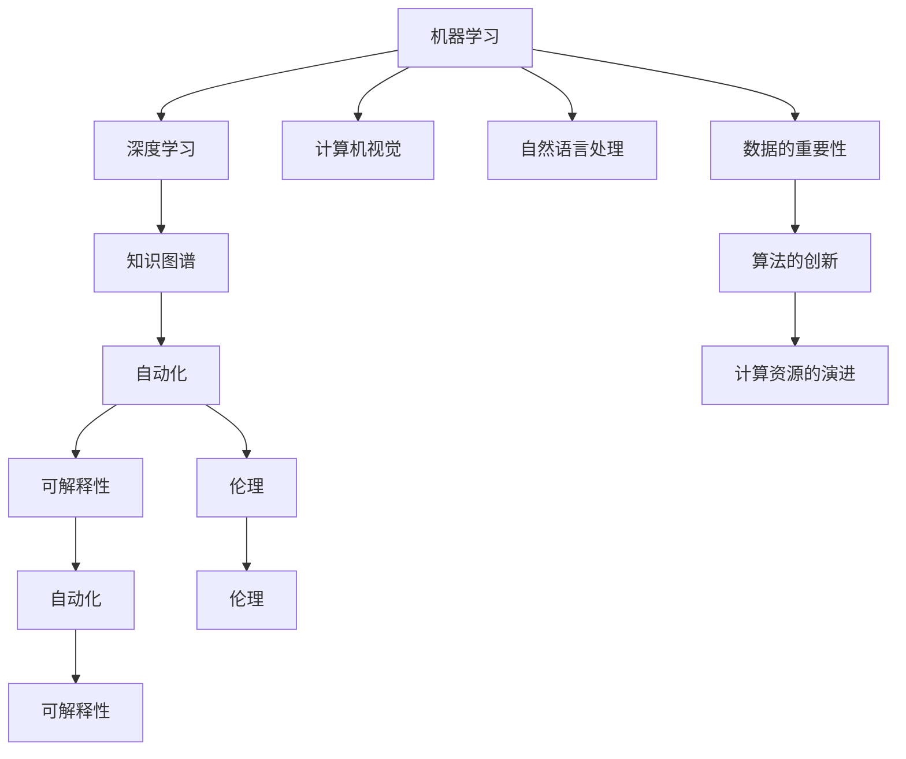

                 

# AI领域的独特时刻与未来发展

> 关键词：AI革命,机器学习,深度学习,计算机视觉,自然语言处理,知识图谱,自动化,可解释性,伦理

## 1. 背景介绍

### 1.1 问题由来
过去数十年间，人工智能(AI)技术以惊人的速度发展，从早期的基于规则的专家系统到深度学习模型的兴起，AI已经从概念走向实用，渗透到各行各业。AI技术的演进，不仅改变了个体的工作方式，也塑造了全球经济的结构。本文将从AI领域的几个独特时刻出发，探讨AI技术未来的发展趋势和面临的挑战。

### 1.2 问题核心关键点
AI技术的演进是一个持续迭代的过程，以下是几个核心关键点：
- **数据的重要性**：AI技术的进步，依赖于大量高质量的数据。无论是计算机视觉、自然语言处理，还是机器学习，数据的获取和标注都是瓶颈。
- **算法的创新**：算法是AI技术的核心。从传统的线性回归、决策树到深度学习，每一次算法突破都大幅提升AI的性能和应用范围。
- **计算资源的演进**：AI模型的训练和推理依赖于高性能计算资源。从GPU到TPU，计算资源的提升为更大规模模型的训练提供了可能。
- **可解释性和伦理**：AI模型的复杂性使得其决策过程难以解释，这引发了伦理和安全问题，如AI偏见、隐私保护等。
- **跨领域的融合**：AI技术正在与医疗、金融、教育、交通等众多领域结合，推动行业智能化升级。

### 1.3 问题研究意义
理解AI领域的独特时刻和未来发展，有助于把握技术趋势，为AI应用开发者提供方向。AI技术的未来方向和挑战不仅涉及技术本身，还涉及伦理、法律、社会等多个维度，因此这一领域的研究具有重要的现实意义。

## 2. 核心概念与联系

### 2.1 核心概念概述

为更好地理解AI技术的发展脉络，本节将介绍几个密切相关的核心概念：

- **机器学习(ML)**：通过数据训练模型，使模型能够对新数据进行预测或分类。机器学习是AI技术的基础。
- **深度学习(Deep Learning, DL)**：一种特殊形式的机器学习，使用多层神经网络进行特征提取和模式识别。深度学习在图像识别、语音识别、自然语言处理等领域取得了巨大成功。
- **计算机视觉(CV)**：使计算机能够理解、解释和利用视觉信息，如图像分类、目标检测、图像生成等。
- **自然语言处理(NLP)**：使计算机能够理解和生成自然语言，如文本分类、语言翻译、问答系统等。
- **知识图谱(KG)**：通过结构化的语义网络，将知识进行形式化表示，广泛应用于推荐系统、问答系统等。
- **自动化(Autonomy)**：自动执行任务，无需人工干预，如自动化驾驶、机器人操作等。
- **可解释性(Interpretability)**：理解AI模型决策过程的能力，对于医疗、金融等高风险领域尤为重要。
- **伦理(Ethics)**：AI技术在应用中必须遵循的伦理规范，如隐私保护、偏见消除、安全性等。

这些核心概念之间的逻辑关系可以通过以下Mermaid流程图来展示：



这个流程图展示了几大AI技术领域及其之间的关系：

1. 机器学习是AI的基础，深度学习是其重要分支。
2. 计算机视觉和自然语言处理是机器学习和深度学习的典型应用。
3. 知识图谱为机器学习和深度学习提供了知识支持，提升了AI模型的理解和推理能力。
4. 自动化和可解释性是AI技术应用的重要考量，关系到技术的安全性和可信度。
5. 伦理问题贯穿于AI技术的各个环节，确保技术的可持续发展和社会责任。

## 3. 核心算法原理 & 具体操作步骤
### 3.1 算法原理概述

AI技术的发展离不开算法原理的突破和创新。以下是几个核心算法原理的概述：

- **梯度下降法(Gradient Descent)**：用于优化神经网络模型参数的算法，通过计算损失函数对参数的梯度，迭代调整参数以最小化损失。
- **卷积神经网络(CNN)**：一种专门用于图像处理的神经网络，通过卷积操作提取特征。
- **循环神经网络(RNN)**：一种能够处理序列数据的神经网络，广泛应用于语音识别、自然语言处理等领域。
- **长短期记忆网络(LSTM)**：一种改进的RNN，能够处理长序列数据，避免了梯度消失问题。
- **Transformer**：一种基于自注意力机制的神经网络架构，广泛应用于机器翻译、文本生成等任务。
- **生成对抗网络(GAN)**：一种生成模型，通过两个神经网络之间的对抗训练，生成逼真的图像、音频等。

### 3.2 算法步骤详解

以**Transformer**架构为例，介绍其具体实现步骤：

1. **输入编码**：将输入序列通过嵌入层转换为向量表示。
2. **自注意力机制**：计算输入序列中每个位置与其他位置的注意力权重，提取关键特征。
3. **前向传播**：通过多层自注意力机制，逐层提取特征。
4. **输出解码**：将最后一层的输出向量通过全连接层和softmax函数，得到预测结果。
5. **损失计算**：计算预测结果与真实标签之间的交叉熵损失，反向传播更新模型参数。

### 3.3 算法优缺点

深度学习和Transformer等算法具有以下优点：
- **强大的表示能力**：能够从数据中提取复杂的特征和模式，提升了AI模型的性能。
- **可扩展性强**：通过增加网络层数和宽度，可以轻松提升模型性能。
- **应用广泛**：广泛应用于计算机视觉、自然语言处理、语音识别等多个领域。

但这些算法也存在一定的局限性：
- **计算资源需求高**：大规模深度学习模型需要大量的计算资源。
- **数据需求大**：模型训练依赖于大量高质量的数据，数据获取和标注成本高。
- **可解释性差**：深度学习模型往往是"黑盒"，难以解释其决策过程。
- **模型过拟合风险高**：在训练数据不足时，模型容易过拟合，泛化性能下降。

### 3.4 算法应用领域

深度学习和Transformer架构在以下几个领域得到了广泛应用：

- **计算机视觉**：如物体检测、图像分割、人脸识别等任务。
- **自然语言处理**：如文本分类、机器翻译、文本生成等任务。
- **语音识别**：如语音识别、语音合成等任务。
- **推荐系统**：如商品推荐、音乐推荐等任务。
- **游戏AI**：如自动对弈、智能游戏角色等任务。

## 4. 数学模型和公式 & 详细讲解 & 举例说明

### 4.1 数学模型构建

本节将使用数学语言对AI技术中的关键模型进行详细讲解。

- **多层感知机(MLP)**：输入层、隐藏层和输出层，通过线性变换和激活函数进行处理。
- **卷积神经网络(CNN)**：卷积操作和池化操作，用于提取图像特征。
- **循环神经网络(RNN)**：递归神经网络结构，用于处理序列数据。
- **长短期记忆网络(LSTM)**：通过门控机制处理长序列数据，避免梯度消失。
- **Transformer**：基于自注意力机制，用于处理序列数据。

### 4.2 公式推导过程

以**卷积神经网络**为例，推导其前向传播过程和反向传播过程：

前向传播：
$$
y^{(l+1)} = \sigma(\mathbf{W}^{(l+1)} y^{(l)} + \mathbf{b}^{(l+1)})
$$

反向传播：
$$
\Delta y^{(l)} = \delta^{(l+1)} (\mathbf{W}^{(l+1)})^T
$$
$$
\Delta \mathbf{W}^{(l+1)} = \eta y^{(l+1)} \delta^{(l+1)} (\mathbf{y}^{(l)})^T
$$
$$
\Delta b^{(l+1)} = \eta y^{(l+1)} \delta^{(l+1)}
$$

其中，$\sigma$为激活函数，$\eta$为学习率，$\delta^{(l+1)}$为误差信号。

### 4.3 案例分析与讲解

以**图像分类**任务为例，分析CNN模型的实现步骤：

1. **数据预处理**：将图像转换为张量，并进行归一化处理。
2. **卷积层**：通过卷积操作提取图像特征，使用ReLU激活函数。
3. **池化层**：通过池化操作减小特征图尺寸，减少参数量。
4. **全连接层**：将特征图展开，通过全连接层进行分类。
5. **softmax层**：将分类结果通过softmax函数转换为概率分布。

## 5. 项目实践：代码实例和详细解释说明

### 5.1 开发环境搭建

在进行AI项目实践前，我们需要准备好开发环境。以下是使用Python进行PyTorch开发的环境配置流程：

1. 安装Anaconda：从官网下载并安装Anaconda，用于创建独立的Python环境。

2. 创建并激活虚拟环境：
```bash
conda create -n pytorch-env python=3.8 
conda activate pytorch-env
```

3. 安装PyTorch：根据CUDA版本，从官网获取对应的安装命令。例如：
```bash
conda install pytorch torchvision torchaudio cudatoolkit=11.1 -c pytorch -c conda-forge
```

4. 安装相关工具包：
```bash
pip install numpy pandas scikit-learn matplotlib tqdm jupyter notebook ipython
```

完成上述步骤后，即可在`pytorch-env`环境中开始AI项目的开发。

### 5.2 源代码详细实现

下面以**图像分类**任务为例，给出使用PyTorch进行CNN模型训练的完整代码实现。

```python
import torch
import torch.nn as nn
import torch.optim as optim
from torchvision import datasets, transforms
from torch.utils.data import DataLoader

# 定义CNN模型
class Net(nn.Module):
    def __init__(self):
        super(Net, self).__init__()
        self.conv1 = nn.Conv2d(3, 6, 5)
        self.pool = nn.MaxPool2d(2, 2)
        self.conv2 = nn.Conv2d(6, 16, 5)
        self.fc1 = nn.Linear(16 * 5 * 5, 120)
        self.fc2 = nn.Linear(120, 84)
        self.fc3 = nn.Linear(84, 10)

    def forward(self, x):
        x = self.pool(torch.relu(self.conv1(x)))
        x = self.pool(torch.relu(self.conv2(x)))
        x = x.view(-1, 16 * 5 * 5)
        x = torch.relu(self.fc1(x))
        x = torch.relu(self.fc2(x))
        x = self.fc3(x)
        return x

# 加载数据集
transform = transforms.Compose([
    transforms.ToTensor(),
    transforms.Normalize((0.5, 0.5, 0.5), (0.5, 0.5, 0.5))
])
trainset = datasets.CIFAR10(root='./data', train=True, download=True, transform=transform)
trainloader = DataLoader(trainset, batch_size=4, shuffle=True, num_workers=2)

# 定义损失函数和优化器
net = Net()
criterion = nn.CrossEntropyLoss()
optimizer = optim.SGD(net.parameters(), lr=0.001, momentum=0.9)

# 训练模型
for epoch in range(2):  # 多次遍历训练集
    running_loss = 0.0
    for i, data in enumerate(trainloader, 0):
        inputs, labels = data
        optimizer.zero_grad()
        outputs = net(inputs)
        loss = criterion(outputs, labels)
        loss.backward()
        optimizer.step()

        running_loss += loss.item()
        if i % 2000 == 1999:  # 每2000次输出一次统计信息
            print('[%d, %5d] loss: %.3f' %
                  (epoch + 1, i + 1, running_loss / 2000))
            running_loss = 0.0

print('Finished Training')
```

以上就是使用PyTorch进行图像分类任务训练的完整代码实现。可以看到，得益于PyTorch的强大封装，我们可以用相对简洁的代码完成CNN模型的训练和评估。

### 5.3 代码解读与分析

让我们再详细解读一下关键代码的实现细节：

**Net类**：
- `__init__`方法：定义CNN模型的各层结构。
- `forward`方法：定义前向传播过程。

**trainset和trainloader**：
- `transform`变量：定义数据预处理步骤，包括将图像转换为张量和归一化。
- `datasets.CIFAR10`：加载CIFAR-10数据集。
- `DataLoader`：定义数据批处理，方便模型的训练。

**训练循环**：
- `optimizer.zero_grad()`：清除梯度，准备反向传播。
- `optimizer.step()`：更新模型参数，完成一次迭代。
- `running_loss += loss.item()`：累加当前批次的损失，用于输出统计信息。

**输出统计信息**：
- `epoch + 1`：当前训练轮数。
- `i + 1`：当前训练步数。
- `running_loss / 2000`：当前批次的平均损失。

可以看到，PyTorch提供了丰富的工具和API，使得AI项目开发更加高效便捷。开发者可以更多地关注模型设计和算法优化，而不必过多关注底层实现细节。

## 6. 实际应用场景

### 6.1 智能交通系统

AI技术在智能交通系统中得到了广泛应用，包括交通流量预测、自动驾驶、智能信号灯控制等。智能交通系统通过实时采集交通数据，利用AI模型进行分析和预测，优化交通流量，提高道路通行效率。

以自动驾驶为例，AI模型通过摄像头和激光雷达采集周围环境数据，结合高精度地图和实时交通数据，进行路径规划和决策，自动驾驶车辆能够在复杂的交通环境中安全行驶。

### 6.2 智能医疗诊断

AI技术在医疗领域的应用也取得了显著成果。智能医疗诊断系统利用AI模型对医学影像、病历等数据进行分析，辅助医生进行疾病诊断和治疗决策。

例如，AI模型可以对X光、CT扫描等医学影像进行自动分析，检测出病变区域和疑似癌症细胞，显著提高了诊断的准确性和效率。智能医疗系统还可以根据患者的病历数据，预测疾病发展趋势，提供个性化的治疗方案。

### 6.3 金融风险管理

AI技术在金融领域的应用主要集中在风险管理和投资决策。智能金融系统利用AI模型对海量交易数据进行分析，识别出潜在的风险点和投资机会。

例如，AI模型可以对历史交易数据进行建模，预测股票市场的走势，辅助投资者进行买卖决策。智能金融系统还可以对金融风险进行实时监控，及时发现异常交易，保障金融系统的稳定性和安全性。

### 6.4 未来应用展望

未来，AI技术将进一步向更广泛的领域渗透，带来更多的创新应用：

- **智慧城市**：AI技术将应用于城市管理、交通控制、公共安全等环节，提升城市的智能化水平。
- **智能制造**：AI技术将应用于生产流程优化、设备维护、质量控制等环节，提高制造业的效率和质量。
- **智能教育**：AI技术将应用于个性化学习、智能辅导、教育管理等环节，提升教育质量和学习效果。
- **智能家居**：AI技术将应用于智能家电、家庭安防、生活服务等领域，提升家庭生活的便利性和安全性。

## 7. 工具和资源推荐

### 7.1 学习资源推荐

为了帮助开发者系统掌握AI技术的基础知识和前沿进展，这里推荐一些优质的学习资源：

1. 《深度学习》课程：斯坦福大学开设的深度学习课程，系统讲解深度学习的基本原理和应用。
2. 《Python数据科学手册》：介绍Python在数据科学和机器学习中的应用，适合初学者入门。
3. 《TensorFlow官方文档》：TensorFlow的官方文档，提供了详尽的API文档和示例代码。
4. Kaggle竞赛：通过参与Kaggle的机器学习竞赛，实战练习并学习前沿技术。
5. Coursera、Udacity等在线课程平台：提供大量优质的AI课程，覆盖从基础到高级的内容。

通过对这些资源的学习实践，相信你一定能够快速掌握AI技术的精髓，并用于解决实际的AI问题。

### 7.2 开发工具推荐

高效的开发离不开优秀的工具支持。以下是几款用于AI开发常用的工具：

1. PyTorch：基于Python的开源深度学习框架，灵活动态的计算图，适合快速迭代研究。
2. TensorFlow：由Google主导开发的开源深度学习框架，生产部署方便，适合大规模工程应用。
3. Jupyter Notebook：交互式编程环境，方便快速验证模型效果，支持丰富的库和数据格式。
4. Scikit-learn：Python数据科学库，提供了丰富的机器学习算法和工具。
5. Keras：高层深度学习API，提供了简单易用的API接口，适合快速构建和测试模型。
6. OpenCV：计算机视觉库，提供了丰富的图像处理和分析工具。

合理利用这些工具，可以显著提升AI项目的开发效率，加快创新迭代的步伐。

### 7.3 相关论文推荐

AI技术的演进离不开学界的持续研究。以下是几篇奠基性的相关论文，推荐阅读：

1. **深度学习**：
   - 《深度学习》：Ian Goodfellow, Yoshua Bengio, Aaron Courville著。

2. **计算机视觉**：
   - 《计算机视觉：模型、学习和推理》：Simon J.D. Prince著。

3. **自然语言处理**：
   - 《自然语言处理综论》：Daniel Jurafsky, James H. Martin著。

4. **知识图谱**：
   - 《知识图谱：构建和应用》：Lise Getoor, Brendan C. O. Frasincar著。

5. **自动化**：
   - 《机器人学：系统、设计、算法与应用》：Nikolaos M. Varoutis, George C. Patrinos, Ilias K. Paraskevopoulos著。

这些论文代表了大AI技术的发展脉络。通过学习这些前沿成果，可以帮助研究者把握学科前进方向，激发更多的创新灵感。

## 8. 总结：未来发展趋势与挑战

### 8.1 总结

本文对AI技术的发展脉络和未来趋势进行了全面系统的介绍。从机器学习、深度学习、计算机视觉、自然语言处理等核心概念出发，详细讲解了这些技术在实际应用中的具体实现。通过系统梳理AI技术的演变过程，希望为开发者提供明确的指导和方向。

### 8.2 未来发展趋势

展望未来，AI技术将呈现以下几个发展趋势：

1. **模型规模的扩大**：随着算力成本的下降和数据量的增加，模型规模将进一步扩大。超大规模模型将带来更强大的表示能力和泛化性能。
2. **跨领域的融合**：AI技术将与更多领域进行融合，如医疗、金融、教育等，推动各行业的智能化升级。
3. **可解释性和透明度**：AI模型将更加注重可解释性和透明度，确保模型的决策过程符合伦理规范。
4. **伦理和安全**：AI技术的应用将更加注重伦理和安全问题，确保技术的安全性和公平性。
5. **自动化和智能**：AI系统将更加自动化和智能化，能够自主学习、决策和执行任务。

### 8.3 面临的挑战

尽管AI技术取得了显著进展，但在迈向更加智能化、普适化应用的过程中，仍面临诸多挑战：

1. **数据隐私和安全**：大规模数据采集和使用带来了隐私和安全问题，需要建立严格的数据保护机制。
2. **公平性和偏见**：AI模型可能存在偏见和歧视，需要采取措施确保模型的公平性和公正性。
3. **算力资源限制**：大规模模型训练和推理需要高性能计算资源，存在资源瓶颈。
4. **模型复杂性**：模型越复杂，越难以理解和解释，需要找到模型和解释之间的平衡。
5. **伦理和法规**：AI技术的应用需要遵守伦理和法规，确保技术的可持续发展。

### 8.4 研究展望

未来，AI技术的研究方向需要从以下几个方面进行探索：

1. **知识图谱和符号表示**：如何将知识图谱与神经网络结合，提升模型的语义理解和推理能力。
2. **可解释性和透明性**：如何提升AI模型的可解释性和透明性，确保模型的决策过程符合伦理规范。
3. **公平性和偏见**：如何消除AI模型的偏见，确保模型的公平性和公正性。
4. **跨领域的应用**：如何将AI技术应用于更多领域，推动各行业的智能化升级。
5. **伦理和法规**：如何建立伦理和法规框架，确保AI技术的应用符合伦理规范和法规要求。

这些研究方向将推动AI技术向更加智能化、普适化、可解释化方向发展，为构建智能社会奠定坚实基础。

## 9. 附录：常见问题与解答

**Q1：AI技术在哪些领域有应用？**

A: AI技术在多个领域得到了广泛应用，包括计算机视觉、自然语言处理、医疗、金融、交通、教育、智能制造等。例如，图像识别、语音识别、自动驾驶、智能医疗、智能金融、智能交通等。

**Q2：AI技术的核心是什么？**

A: AI技术的核心是算法，包括机器学习、深度学习、自然语言处理等。AI技术的进步依赖于算法的创新和优化。

**Q3：AI技术的发展趋势是什么？**

A: AI技术的发展趋势包括模型规模的扩大、跨领域的融合、可解释性和透明性、公平性和偏见、自动化和智能等。未来，AI技术将更加智能化、普适化和可解释化。

**Q4：AI技术面临的主要挑战是什么？**

A: AI技术面临的主要挑战包括数据隐私和安全、公平性和偏见、算力资源限制、模型复杂性、伦理和法规等。未来，需要在这几个方面进行深入研究，推动AI技术的可持续发展。

**Q5：如何提升AI模型的可解释性？**

A: 提升AI模型的可解释性可以从以下几个方面进行：
1. 使用可解释的模型架构，如决策树、线性回归等。
2. 引入可解释性技术，如LIME、SHAP等，解释模型的决策过程。
3. 优化模型的训练过程，使得模型决策过程更加透明。

通过这些方法，可以显著提升AI模型的可解释性，增强模型的可信度和安全性。

---

作者：禅与计算机程序设计艺术 / Zen and the Art of Computer Programming

