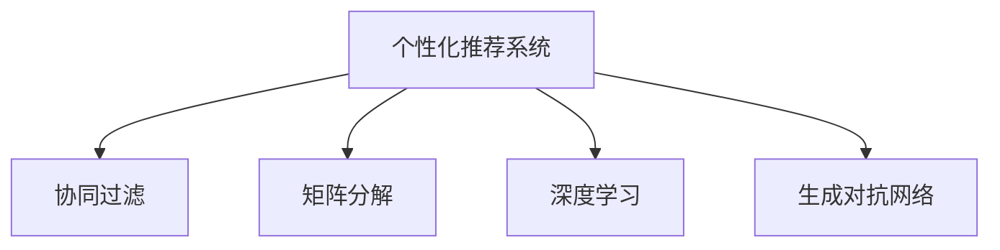

                 

## 1. 背景介绍

随着互联网技术的迅猛发展，数据量呈指数级增长，个性化推荐系统应运而生。这类系统通过分析用户行为数据，精准推荐符合用户兴趣的商品、内容，显著提升了用户体验和转化率。如今，个性化推荐已广泛应用于电商、视频、音乐、新闻等多个领域，成为用户服务的重要支撑。

电商领域，个性化推荐系统通过分析用户浏览历史、点击行为、购买记录，精准推荐相关商品，极大提高了用户满意度和购买转化率。娱乐领域，个性化推荐系统依据用户观看记录、评分反馈，精准推荐影视剧、电影，增强用户粘性和活跃度。

然而，实现高效、精准的个性化推荐并非易事。推荐算法需要处理海量用户数据，计算复杂度极高，且推荐结果需要随时间动态更新，实时性要求高。传统推荐系统常采用协同过滤、矩阵分解等算法，但存在冷启动问题、数据稀疏性等限制，难以满足现实需求。

面对这些挑战，AI驱动的个性化推荐系统应运而生。通过深度学习模型和大数据技术，AI推荐系统能够快速学习用户兴趣，高效计算推荐结果，动态优化推荐策略，逐步成为电商、娱乐等领域的主流推荐方式。

## 2. 核心概念与联系

### 2.1 核心概念概述

为更好理解AI驱动的个性化推荐系统，首先介绍几个关键概念：

- **个性化推荐系统（Personalized Recommendation System, PRS）**：利用用户历史数据和实时反馈，推荐符合用户兴趣的内容或商品。通过不断迭代优化，提升推荐效果。

- **协同过滤（Collaborative Filtering）**：根据用户之间的相似性，推荐类似用户感兴趣的商品或内容。分为基于用户的协同过滤和基于物品的协同过滤。

- **矩阵分解（Matrix Factorization）**：通过分解用户-物品评分矩阵，学习用户和物品的隐性特征，从而进行推荐。

- **深度学习（Deep Learning）**：利用多层神经网络，通过反向传播算法优化模型参数，自动学习输入数据的特征表示。

- **生成对抗网络（Generative Adversarial Network, GAN）**：由生成器和判别器两个对抗网络组成，生成器学习生成逼真的数据样本，判别器学习判别真假样本，两者不断博弈，生成高质量数据。

这些核心概念之间的关系可以由以下Mermaid流程图展示：



通过了解这些概念，可以更好地理解AI推荐系统的基本框架和运作方式。

## 3. 核心算法原理 & 具体操作步骤

### 3.1 算法原理概述

AI驱动的个性化推荐系统主要基于深度学习模型，利用神经网络自动提取用户行为特征，计算推荐结果。其核心思想是通过对用户历史行为数据的分析，学习用户兴趣偏好，在实时数据到来时，快速预测推荐结果。

具体而言，假设用户历史行为数据集为 $\{(u_i, i_t)\}_{i=1}^N$，其中 $u_i$ 为用户ID，$i_t$ 为行为ID。系统通过训练模型 $M$，学习用户行为与推荐物品之间的关系，其输出为推荐分数 $R(u_i, i_t)$。推荐分数越高，说明该物品越符合用户兴趣。

### 3.2 算法步骤详解

AI推荐系统的主要步骤包括数据预处理、模型训练、推荐结果生成和策略优化。

**Step 1: 数据预处理**
- 收集用户行为数据，如浏览记录、点击行为、评分反馈等。
- 对数据进行清洗、归一化处理，处理缺失值和异常值。
- 将用户行为数据转化为模型可用的格式，如使用独热编码表示用户和物品。

**Step 2: 模型训练**
- 选择合适的深度学习模型，如DNN、RNN、CNN等，设计合适的模型架构。
- 划分训练集和验证集，使用交叉熵损失等函数进行模型训练。
- 使用梯度下降等优化算法，调整模型参数。

**Step 3: 推荐结果生成**
- 使用训练好的模型 $M$，对新数据进行前向传播，计算推荐分数。
- 根据推荐分数，对物品进行排序，选择前N个物品作为推荐结果。

**Step 4: 策略优化**
- 对推荐结果进行A/B测试，评估不同推荐策略的效果。
- 根据推荐效果，调整模型参数，优化推荐策略。
- 实时收集用户反馈，动态更新推荐模型。

### 3.3 算法优缺点

AI推荐系统具有以下优点：
- 能够处理海量用户数据，计算速度快，实时性好。
- 能够自适应用户兴趣的变化，推荐结果动态更新。
- 能够学习用户的隐性偏好，推荐更加精准。

但同时，该算法也存在以下缺点：
- 需要大量标注数据进行训练，数据获取成本高。
- 存在冷启动问题，对新用户和新物品的推荐效果较差。
- 对噪声数据敏感，需要考虑数据的真实性和有效性。
- 模型的可解释性不足，难以理解推荐结果背后的原因。

尽管存在这些缺点，AI推荐系统凭借其高效的推荐效果和快速迭代的能力，已经成为了电商、娱乐等领域的重要技术支撑。未来，如何优化算法性能、提高可解释性、增强鲁棒性，将是研究的热点方向。

### 3.4 算法应用领域

AI推荐系统已经广泛应用于电商、娱乐、新闻、金融等多个领域，具体包括：

- **电商领域**：通过分析用户浏览、点击、购买行为，推荐相关商品，提升转化率和客单价。
- **视频娱乐领域**：根据用户观看记录、评分反馈，推荐影视剧、电影，增强用户粘性和满意度。
- **音乐领域**：依据用户听歌历史、评分记录，推荐相似歌曲，提升用户活跃度。
- **新闻推荐**：分析用户阅读行为，推荐相关新闻内容，提高阅读量和留存率。
- **金融领域**：推荐理财产品、股票等金融产品，提升投资收益和用户体验。

除了以上应用场景外，AI推荐系统还在医疗、教育、旅游等多个领域得到广泛应用，成为各行各业数字化转型的重要工具。

## 4. 数学模型和公式 & 详细讲解  
### 4.1 数学模型构建

下面我们将使用数学语言对AI推荐系统进行更加严谨的描述。

假设用户历史行为数据集为 $\{(u_i, i_t)\}_{i=1}^N$，其中 $u_i$ 为用户ID，$i_t$ 为行为ID。系统通过训练模型 $M$，学习用户行为与推荐物品之间的关系，其输出为推荐分数 $R(u_i, i_t)$。推荐分数越高，说明该物品越符合用户兴趣。

定义模型 $M$ 的参数为 $\theta$，模型的前向传播公式为：

$$
R(u_i, i_t) = M_\theta(u_i, i_t)
$$

其中 $M_\theta$ 为模型函数，$M_\theta(u_i, i_t)$ 表示用户 $u_i$ 对物品 $i_t$ 的推荐分数。

定义模型的损失函数为交叉熵损失函数，即：

$$
\mathcal{L}(\theta) = -\frac{1}{N}\sum_{i=1}^N \sum_{t=1}^n \log R(u_i, i_t)
$$

其中 $n$ 为用户 $u_i$ 的历史行为数量，$\log R(u_i, i_t)$ 为模型输出的推荐分数的对数。

### 4.2 公式推导过程

接下来，我们对模型进行参数更新，使用梯度下降算法优化模型参数。定义梯度更新公式为：

$$
\theta \leftarrow \theta - \eta \nabla_{\theta} \mathcal{L}(\theta)
$$

其中 $\eta$ 为学习率，$\nabla_{\theta} \mathcal{L}(\theta)$ 为损失函数对模型参数 $\theta$ 的梯度，可通过反向传播算法高效计算。

在具体实现中，可以使用TensorFlow、PyTorch等深度学习框架，结合数据预处理、模型训练、推荐结果生成等步骤，实现完整的AI推荐系统。

### 4.3 案例分析与讲解

以电商推荐系统为例，假设用户ID为 $u_i$，浏览记录为 $\{p_i^t\}_{t=1}^n$，其中 $p_i^t$ 为第 $t$ 次浏览商品ID。系统的目标是通过学习用户浏览记录，推荐符合用户兴趣的商品。

**Step 1: 数据预处理**
- 收集用户浏览记录，生成用户ID和商品ID的列表。
- 对数据进行归一化处理，将商品ID和用户ID转化为模型可用的格式。

**Step 2: 模型训练**
- 设计深度神经网络模型，如DNN、CNN等，输入层为商品ID，输出层为推荐分数。
- 使用交叉熵损失函数，训练模型。
- 使用梯度下降算法，调整模型参数。

**Step 3: 推荐结果生成**
- 输入新用户ID和新商品ID，计算推荐分数。
- 根据推荐分数对商品排序，选择前N个商品作为推荐结果。

**Step 4: 策略优化**
- 对推荐结果进行A/B测试，评估不同推荐策略的效果。
- 根据推荐效果，调整模型参数，优化推荐策略。
- 实时收集用户反馈，动态更新推荐模型。

通过上述步骤，电商推荐系统能够精准推荐用户感兴趣的商品，显著提升用户满意度和转化率。

## 5. 项目实践：代码实例和详细解释说明

### 5.1 开发环境搭建

在进行AI推荐系统开发前，需要准备好开发环境。以下是使用Python进行TensorFlow开发的流程：

1. 安装Anaconda：从官网下载并安装Anaconda，用于创建独立的Python环境。

2. 创建并激活虚拟环境：
```bash
conda create -n tf-env python=3.8 
conda activate tf-env
```

3. 安装TensorFlow：根据CUDA版本，从官网获取对应的安装命令。例如：
```bash
conda install tensorflow==2.7
```

4. 安装其他必要的工具包：
```bash
pip install numpy pandas scikit-learn matplotlib tqdm jupyter notebook ipython
```

完成上述步骤后，即可在`tf-env`环境中开始开发。

### 5.2 源代码详细实现

这里我们以电商推荐系统为例，给出使用TensorFlow对DNN模型进行电商推荐系统微调的Python代码实现。

首先，定义推荐系统的数据预处理函数：

```python
import tensorflow as tf
import numpy as np

def preprocess_data(train_data, test_data, batch_size):
    train_data = np.array(train_data, dtype=np.int32)
    test_data = np.array(test_data, dtype=np.int32)
    train_data = tf.data.Dataset.from_tensor_slices(train_data)
    train_data = train_data.batch(batch_size).shuffle(buffer_size=10000)
    test_data = tf.data.Dataset.from_tensor_slices(test_data)
    test_data = test_data.batch(batch_size)
    return train_data, test_data
```

然后，定义模型和优化器：

```python
def build_model(input_shape, num_outputs):
    model = tf.keras.Sequential([
        tf.keras.layers.Dense(128, activation='relu', input_shape=input_shape),
        tf.keras.layers.Dense(64, activation='relu'),
        tf.keras.layers.Dense(num_outputs, activation='sigmoid')
    ])
    return model

def create_optimizer():
    optimizer = tf.keras.optimizers.Adam(learning_rate=0.001)
    return optimizer
```

接着，定义训练和评估函数：

```python
def train_model(model, train_dataset, test_dataset, epochs, batch_size, learning_rate):
    optimizer = create_optimizer()
    loss_fn = tf.keras.losses.BinaryCrossentropy()

    model.compile(optimizer=optimizer, loss=loss_fn)

    for epoch in range(epochs):
        loss = model.train_on_batch(train_dataset)
        model.evaluate(test_dataset)
    
    return model

def evaluate_model(model, test_dataset, batch_size):
    test_loss, test_predictions = model.evaluate(test_dataset)
    print('Test loss:', test_loss)
    print('Test predictions:', test_predictions)
```

最后，启动训练流程并在测试集上评估：

```python
epochs = 10
batch_size = 64
learning_rate = 0.001

train_data = preprocess_data(train_data, test_data, batch_size)
model = build_model(input_shape, num_outputs)
train_model(model, train_data, test_data, epochs, batch_size, learning_rate)
evaluate_model(model, test_data, batch_size)
```

以上就是使用TensorFlow对DNN模型进行电商推荐系统微调的完整代码实现。可以看到，TensorFlow提供了方便的API，使得模型搭建、训练和评估变得非常简单。

### 5.3 代码解读与分析

让我们再详细解读一下关键代码的实现细节：

**preprocess_data函数**：
- 将训练集和测试集转化为TensorFlow可用的数据集格式，并进行批处理、洗牌。

**build_model函数**：
- 定义一个包含三个全连接层的深度神经网络模型，用于计算推荐分数。

**create_optimizer函数**：
- 创建Adam优化器，用于更新模型参数。

**train_model函数**：
- 定义模型，使用交叉熵损失函数，进行模型训练。
- 在每个epoch结束时，评估模型在测试集上的表现。

**evaluate_model函数**：
- 评估模型在测试集上的表现，输出损失和预测结果。

通过以上函数，完整实现了基于DNN的电商推荐系统的开发。

## 6. 实际应用场景

### 6.1 电商推荐

AI推荐系统在电商领域的应用，可以显著提升用户购物体验和转化率。具体而言，电商推荐系统能够根据用户浏览记录、点击行为，推荐相关商品，提高用户满意度和购买转化率。

以某知名电商平台的推荐系统为例，该系统收集了用户的历史浏览、点击、购买数据，使用DNN模型进行推荐。系统实时监测用户行为数据，动态更新推荐模型，确保推荐结果符合用户当前兴趣。通过不断的优化和迭代，推荐系统能够实时推荐用户感兴趣的商品，显著提高了平台的用户粘性和销售额。

### 6.2 娱乐推荐

在视频、音乐等娱乐领域，AI推荐系统也发挥着重要作用。通过分析用户观看记录、评分反馈，推荐相关影视剧、电影和歌曲，提升用户满意度和活跃度。

例如，某视频平台推荐系统收集用户观看历史、评分数据，使用深度神经网络模型进行推荐。系统能够智能推荐用户感兴趣的视频内容，增加平台的用户粘性和观看时长。通过不断的优化和迭代，推荐系统能够实时推荐高质量视频内容，显著提升了平台的活跃度和用户满意度。

## 7. 工具和资源推荐

### 7.1 学习资源推荐

为了帮助开发者系统掌握AI推荐系统的理论基础和实践技巧，这里推荐一些优质的学习资源：

1. 《深度学习》（Ian Goodfellow等著）：该书全面介绍了深度学习的基本原理和应用方法，涵盖神经网络、卷积神经网络、循环神经网络等内容，是深度学习的入门必读书籍。

2. 《推荐系统实战》（郑毅等著）：该书深入浅出地介绍了推荐系统从理论到实践的全过程，包括协同过滤、矩阵分解、深度学习等多种推荐算法，并提供了丰富的案例和实践指导。

3. TensorFlow官方文档：提供了TensorFlow的全面使用指南和示例代码，是学习TensorFlow的必备资源。

4. Kaggle竞赛：Kaggle平台提供了多种推荐系统竞赛，涵盖电商、视频等多个领域，是实践推荐算法的绝佳平台。

5. arXiv论文：推荐系统领域的顶级会议和期刊，如ICML、SIGIR、IEEE TNS等，提供了大量的前沿研究成果和优秀论文，是学习和跟踪推荐系统进展的重要途径。

通过对这些资源的学习实践，相信你一定能够快速掌握AI推荐系统的精髓，并用于解决实际的电商、娱乐推荐问题。

### 7.2 开发工具推荐

高效的开发离不开优秀的工具支持。以下是几款用于AI推荐系统开发的常用工具：

1. TensorFlow：由Google主导开发的开源深度学习框架，生产部署方便，适合大规模工程应用。

2. PyTorch：基于Python的开源深度学习框架，灵活动态的计算图，适合快速迭代研究。

3. Keras：提供了简单易用的API，可以方便地搭建深度学习模型。

4. Jupyter Notebook：用于数据处理、模型训练和结果展示的交互式编程环境，支持多种编程语言和库。

5. Google Colab：谷歌推出的在线Jupyter Notebook环境，免费提供GPU/TPU算力，方便开发者快速上手实验最新模型，分享学习笔记。

合理利用这些工具，可以显著提升AI推荐系统的开发效率，加快创新迭代的步伐。

### 7.3 相关论文推荐

AI推荐系统的发展得益于学界的持续研究。以下是几篇奠基性的相关论文，推荐阅读：

1. "The Bell Labs PageRank Algorithm"（PageRank算法）：提出了一种基于图论的网络爬虫算法，广泛应用于搜索引擎的网页排名。

2. "Neural Collaborative Filtering"：提出了一种基于神经网络的协同过滤算法，提升了推荐系统的精度和稳定性。

3. "Matrix Factorization Techniques for Recommender Systems"：介绍了矩阵分解方法在推荐系统中的应用，提出多种优化算法，提高了推荐效果。

4. "A Neural Probabilistic Logic Network"：提出了一种基于逻辑网络的推荐系统，融合了符号推理和深度学习技术，提升了推荐系统的可解释性。

5. "Generative Adversarial Nets"：提出了一种生成对抗网络，通过对抗训练生成高质量数据，广泛应用于生成对抗网络和推荐系统。

这些论文代表了大规模推荐系统的发展脉络。通过学习这些前沿成果，可以帮助研究者把握学科前进方向，激发更多的创新灵感。

## 8. 总结：未来发展趋势与挑战

### 8.1 总结

本文对AI驱动的个性化推荐系统进行了全面系统的介绍。首先阐述了推荐系统的发展背景和意义，明确了AI推荐系统在电商、娱乐等领域的应用价值。其次，从原理到实践，详细讲解了AI推荐系统的数学模型和关键步骤，给出了电商推荐系统的完整代码实现。同时，本文还广泛探讨了AI推荐系统在电商、娱乐、视频等领域的实际应用场景，展示了AI推荐系统的巨大潜力。最后，本文精选了AI推荐系统的各类学习资源，力求为读者提供全方位的技术指引。

通过本文的系统梳理，可以看到，AI推荐系统已经成为电商、娱乐等领域的重要技术支撑，极大地提升了用户体验和商业价值。未来，伴随深度学习技术的持续演进，推荐系统将拥有更强的动态适应能力和泛化能力，进一步拓展其应用边界，推动人工智能技术在各个行业的广泛落地。

### 8.2 未来发展趋势

展望未来，AI推荐系统将呈现以下几个发展趋势：

1. 推荐算法的自动化。推荐系统的设计、调优和部署将越来越依赖自动化工具和平台，减少人工干预，提高效率。

2. 推荐模型的自适应。推荐模型能够实时动态地更新，根据用户的实时行为数据进行个性化推荐，进一步提升用户体验。

3. 推荐系统的集成。推荐系统将与其他智能技术如自然语言处理、图像识别等进行更深入的融合，形成多模态、跨领域的智能应用。

4. 推荐系统的可解释性。推荐模型的输出结果将更加透明可解释，增强用户信任和满意度。

5. 推荐系统的安全性。推荐系统将更加注重数据隐私和安全，确保用户信息的安全性和推荐结果的公正性。

6. 推荐系统的个性化。推荐系统将更加注重用户的个性化需求，提供量身定制的推荐服务。

以上趋势凸显了AI推荐系统未来的广阔前景。这些方向的探索发展，必将进一步提升推荐系统的性能和应用范围，为电商、娱乐等领域带来新的突破。

### 8.3 面临的挑战

尽管AI推荐系统已经取得了瞩目成就，但在迈向更加智能化、普适化应用的过程中，它仍面临诸多挑战：

1. 数据获取与处理。推荐系统需要大量用户数据进行训练和测试，数据的获取和处理成本较高。如何高效、低成本地获取高质量数据，是一个亟待解决的问题。

2. 算法复杂性与效率。深度学习模型在推荐系统中的应用，增加了系统的复杂性和计算成本。如何优化算法，提高推荐效率，是实现推荐系统实时化的重要课题。

3. 推荐系统的可解释性。推荐系统的输出结果缺乏可解释性，难以理解推荐结果背后的原因。如何提高推荐系统的可解释性，增强用户信任，是推荐系统面临的重要挑战。

4. 推荐系统的公平性。推荐系统可能存在偏见和歧视，对某些用户群体产生不公正的推荐结果。如何确保推荐系统的公平性，避免歧视性，是推荐系统需要持续关注的问题。

5. 推荐系统的安全性。推荐系统可能面临恶意攻击和数据泄露风险，需要加强数据安全防护和系统安全保障。

这些挑战需要学术界和工业界共同努力，通过理论创新和工程实践，逐步克服。只有不断优化推荐算法，提高系统性能，才能真正实现AI推荐系统的广泛应用和落地。

### 8.4 研究展望

面对AI推荐系统所面临的种种挑战，未来的研究需要在以下几个方面寻求新的突破：

1. 探索无监督和半监督推荐方法。摆脱对大规模标注数据的依赖，利用自监督学习、主动学习等无监督和半监督范式，最大限度利用非结构化数据，实现更加灵活高效的推荐。

2. 研究多模态推荐模型。将符号化的先验知识，如知识图谱、逻辑规则等，与神经网络模型进行巧妙融合，引导推荐过程学习更准确、合理的推荐结果。同时加强不同模态数据的整合，实现视觉、语音等多模态信息与文本信息的协同建模。

3. 开发高效推荐算法。优化推荐算法，减少计算成本，提高推荐效率，提升推荐系统的实时性和可扩展性。

4. 提高推荐系统的可解释性。增强推荐系统的透明度，提供推荐结果的解释，增强用户信任和满意度。

5. 引入伦理道德约束。在推荐系统的设计和实现中，引入伦理导向的评估指标，过滤和惩罚有偏见、有害的推荐结果，确保推荐系统的公平性和安全性。

这些研究方向的探索，必将引领AI推荐系统技术迈向更高的台阶，为电商、娱乐等领域带来新的突破和创新。未来，随着技术的不断进步和应用的不断深化，AI推荐系统必将在更广泛的领域大放异彩，推动人工智能技术的应用和发展。

## 9. 附录：常见问题与解答

**Q1: 推荐系统的核心是协同过滤还是深度学习？**

A: 推荐系统的核心在于学习用户和物品之间的关系，从而进行推荐。早期推荐系统主要采用协同过滤算法，如基于用户的协同过滤和基于物品的协同过滤，但存在数据稀疏性和冷启动等问题。深度学习模型能够自动提取用户和物品的特征，克服了这些问题，成为推荐系统的主流算法。深度学习模型能够处理非结构化数据，具有较强的泛化能力，因此逐渐成为推荐系统的主流。

**Q2: 如何处理推荐系统中的数据稀疏性问题？**

A: 数据稀疏性是推荐系统面临的重要问题。为了处理数据稀疏性，可以采用多种方法，如矩阵分解、基于深度学习的方法、用户基线和物品基线等。此外，可以通过数据增强、数据平滑、冷启动等方法，提高数据利用率，缓解数据稀疏性问题。

**Q3: 推荐系统中的冷启动问题如何解决？**

A: 冷启动问题是指新用户和新物品没有足够的历史数据，难以进行推荐。为了解决冷启动问题，可以采用基于内容的推荐方法，根据物品的标签、属性等信息进行推荐。此外，可以通过引入外部信息源，如社交网络、用户画像等，进行推荐。还可以采用基于深度学习的方法，利用生成对抗网络等技术生成高质量的用户和物品特征，进行推荐。

**Q4: 推荐系统的可解释性如何提升？**

A: 推荐系统的可解释性是当前研究的热点之一。为了提高推荐系统的可解释性，可以采用多种方法，如生成对抗网络、知识图谱、逻辑推理等。此外，可以提供推荐结果的解释，如推荐理由、推荐依据等，增强用户对推荐结果的理解和信任。

**Q5: 推荐系统的安全性如何保障？**

A: 推荐系统的安全性是当前研究的重要方向之一。为了保障推荐系统的安全性，可以采用多种方法，如数据加密、用户隐私保护、系统安全防护等。此外，可以引入伦理道德约束，确保推荐系统的公平性和安全性。

通过本文的系统梳理，可以看到，AI推荐系统已经成为电商、娱乐等领域的重要技术支撑，极大地提升了用户体验和商业价值。未来，伴随深度学习技术的持续演进，推荐系统将拥有更强的动态适应能力和泛化能力，进一步拓展其应用边界，推动人工智能技术在各个行业的广泛落地。

