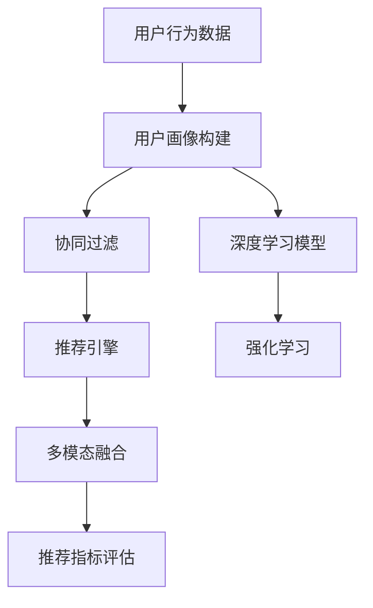

                 

## 1. 背景介绍

随着电子商务和在线娱乐领域的兴起，个性化推荐系统成为了用户获取信息、发现新产品的重要手段。然而，传统推荐系统的模式单一，无法实现真正意义上的个性化服务。为了解决这一问题，AI驱动的个性化推荐系统应运而生。它能够根据用户的兴趣和行为，实时生成个性化的内容推荐，提升用户体验和运营效率，为电商、娱乐等行业的未来发展开辟了新的道路。

### 1.1 问题由来

传统推荐系统主要基于用户历史行为数据，如浏览记录、购买历史等，使用协同过滤、内容过滤等技术生成推荐结果。这种方法在某种程度上能够实现一定的个性化推荐，但存在以下问题：

- **数据依赖度高**：传统推荐系统依赖大量历史数据，难以在新用户或冷启动场景下发挥作用。
- **缺乏深度理解**：历史行为数据只能反映用户的部分兴趣，无法深入挖掘用户的潜在需求。
- **模式单一**：推荐结果基于规则或相似度匹配，难以捕捉用户多变的兴趣和行为变化。

针对以上问题，AI驱动的个性化推荐系统通过引入深度学习、自然语言处理等先进技术，实现了从数据到知识、从知识到行为的深度建模，使推荐系统更加智能化、个性化。

### 1.2 问题核心关键点

AI驱动的个性化推荐系统主要依赖以下几个核心关键点：

- **用户兴趣建模**：通过深度学习模型，从用户历史行为中挖掘出其深层次兴趣。
- **行为预测与建模**：利用时间序列预测、协同过滤等技术，预测用户未来行为，并构建行为模型。
- **推荐引擎优化**：根据用户行为和兴趣，实时生成个性化的推荐结果，并进行实时优化。
- **多模态融合**：将文本、图像、视频等多种数据源进行深度融合，丰富推荐内容。
- **效果评估与优化**：通过A/B测试、指标监控等手段，持续评估推荐系统效果，并不断优化模型。

通过理解和利用这些关键点，我们可以构建出高效、精准的个性化推荐系统。

## 2. 核心概念与联系

### 2.1 核心概念概述

AI驱动的个性化推荐系统基于一系列先进技术，实现从数据到推荐的全流程自动化。以下是对其核心概念的介绍：

- **用户画像**：通过分析用户的浏览、购买、评分等行为数据，构建用户兴趣和行为特征，形成用户画像。
- **协同过滤**：基于用户相似性或物品相似性，推荐用户可能感兴趣的物品。
- **深度学习**：利用深度神经网络模型，从大量数据中挖掘出用户兴趣和行为规律。
- **强化学习**：通过与用户的交互反馈，不断优化推荐策略，提升推荐效果。
- **多模态融合**：将不同类型的数据源进行融合，丰富推荐内容，提升用户体验。
- **推荐指标**：如点击率、转化率、覆盖率等，用于评估推荐系统的性能和效果。

这些核心概念通过一定的技术架构和算法流程，共同构成了一个完整的AI驱动个性化推荐系统。

### 2.2 核心概念原理和架构的 Mermaid 流程图(Mermaid 流程节点中不要有括号、逗号等特殊字符)



以上Mermaid流程图展示了AI驱动个性化推荐系统的基本架构和数据流向。从用户行为数据开始，经过用户画像构建、协同过滤、深度学习、强化学习等多步骤，最终输出个性化推荐结果，并使用推荐指标进行效果评估。

## 3. 核心算法原理 & 具体操作步骤

### 3.1 算法原理概述

AI驱动的个性化推荐系统采用以下核心算法：

- **用户画像建模**：通过深度学习模型对用户历史行为数据进行建模，生成用户兴趣特征向量。
- **协同过滤算法**：基于用户历史行为数据和物品相似性，推荐用户可能感兴趣的物品。
- **深度学习推荐模型**：利用神经网络模型对用户行为数据进行建模，预测用户未来的兴趣和行为。
- **强化学习**：通过与用户的交互反馈，不断优化推荐策略，提升推荐效果。

这些算法相互结合，构成了个性化推荐系统的核心技术架构。

### 3.2 算法步骤详解

AI驱动的个性化推荐系统一般包括以下几个关键步骤：

**Step 1: 数据收集与预处理**

- 收集用户行为数据，如浏览记录、购买历史、评分等。
- 对数据进行清洗、去噪、归一化等预处理操作。
- 将数据转换为向量形式，如TF-IDF、Word2Vec等。

**Step 2: 用户画像构建**

- 使用深度学习模型对用户历史行为数据进行建模，生成用户兴趣特征向量。
- 利用TF-IDF、Word2Vec等技术，将用户行为数据转换为向量形式。
- 通过卷积神经网络(CNN)、循环神经网络(RNN)等模型，提取用户行为数据中的深度特征。

**Step 3: 协同过滤推荐**

- 利用协同过滤算法，对用户历史行为数据进行分析，找出与当前用户兴趣相似的用户。
- 基于物品相似性，推荐用户可能感兴趣的物品。
- 引入内容过滤算法，结合用户兴趣特征和物品特征，生成推荐结果。

**Step 4: 深度学习推荐模型**

- 利用深度神经网络模型对用户行为数据进行建模，预测用户未来的兴趣和行为。
- 利用长短期记忆网络(LSTM)、门控循环单元(GRU)等模型，提取用户行为数据中的时间序列特征。
- 利用卷积神经网络(CNN)、全连接网络(FCN)等模型，提取用户行为数据中的空间特征。

**Step 5: 强化学习优化**

- 通过与用户的交互反馈，不断优化推荐策略，提升推荐效果。
- 引入Q-learning、SARSA等强化学习算法，学习最优推荐策略。
- 利用奖励机制，对推荐结果进行评估和优化。

**Step 6: 多模态融合**

- 将文本、图像、视频等多种数据源进行深度融合，丰富推荐内容。
- 利用自然语言处理(NLP)技术，对文本数据进行分析和理解。
- 利用卷积神经网络(CNN)、卷积自编码器(ConvAE)等模型，提取图像和视频数据的深度特征。

**Step 7: 推荐指标评估**

- 通过A/B测试、点击率、转化率、覆盖率等指标，评估推荐系统的性能和效果。
- 利用K-means、层次聚类等算法，对推荐结果进行聚类分析。
- 利用回归分析、决策树等算法，对推荐结果进行预测和优化。

以上是AI驱动个性化推荐系统的一般流程。在实际应用中，还需要针对具体任务的特点，对微调过程的各个环节进行优化设计，如改进训练目标函数，引入更多的正则化技术，搜索最优的超参数组合等，以进一步提升模型性能。

### 3.3 算法优缺点

AI驱动的个性化推荐系统具有以下优点：

- **深度理解用户需求**：通过深度学习模型，从用户历史行为数据中挖掘出其深层次兴趣和需求。
- **实时生成推荐**：利用深度学习、强化学习等技术，实时生成个性化推荐结果，提升用户体验。
- **多模态融合**：将文本、图像、视频等多种数据源进行深度融合，丰富推荐内容。
- **持续优化推荐**：通过强化学习等技术，不断优化推荐策略，提升推荐效果。

同时，该系统也存在一定的局限性：

- **数据依赖度高**：需要大量历史行为数据才能发挥作用，冷启动用户难以推荐。
- **模型复杂度高**：涉及多个模型的融合，模型训练和调参复杂度较高。
- **资源消耗大**：深度学习模型和强化学习算法对计算资源和内存要求较高。
- **泛化能力有限**：在特定的用户群体和场景下表现较好，但在广泛的领域和场景下泛化能力有待提升。

尽管存在这些局限性，但AI驱动的个性化推荐系统仍是目前实现个性化推荐的主流范式。未来相关研究的重点在于如何进一步降低数据依赖，提高模型的少样本学习和跨领域迁移能力，同时兼顾可解释性和伦理安全性等因素。

### 3.4 算法应用领域

AI驱动的个性化推荐系统已经广泛应用于电子商务、在线娱乐、新闻资讯等多个领域，具体应用场景包括：

- **电商推荐**：为用户推荐可能感兴趣的商品，提高转化率和用户体验。
- **音乐推荐**：为用户推荐可能喜欢的歌曲和歌手，提升音乐平台的黏性。
- **视频推荐**：为用户推荐可能感兴趣的视频内容，提高用户留存率和观看时长。
- **新闻推荐**：为用户推荐感兴趣的新闻文章和话题，提升用户阅读体验。
- **旅游推荐**：为用户推荐目的地和旅游路线，提升用户出行体验。

除了以上应用场景，AI驱动的个性化推荐系统还在更多领域得到应用，如金融理财、教育培训、医疗健康等，为各行各业带来了显著的商业价值和社会效益。

## 4. 数学模型和公式 & 详细讲解  
### 4.1 数学模型构建

以下是AI驱动个性化推荐系统的数学模型构建：

设用户行为数据为 $\mathcal{X}=\{x_1, x_2, ..., x_n\}$，物品特征向量为 $\mathcal{Y}=\{y_1, y_2, ..., y_m\}$，用户历史行为数据为 $X=\{x_1, x_2, ..., x_n\}$，物品标签向量为 $Y=\{y_1, y_2, ..., y_m\}$。

**用户画像建模**：
$$
\mathbf{u} = \mathbf{W}_h \mathbf{h} + \mathbf{b}_h
$$
其中 $\mathbf{u}$ 为用户兴趣特征向量，$\mathbf{h}$ 为用户行为数据特征向量，$\mathbf{W}_h$ 为权重矩阵，$\mathbf{b}_h$ 为偏置向量。

**协同过滤推荐**：
$$
\mathbf{r} = \mathbf{V}_w \mathbf{w} + \mathbf{b}_w
$$
其中 $\mathbf{r}$ 为用户对物品的评分向量，$\mathbf{w}$ 为物品权重向量，$\mathbf{V}_w$ 为权重矩阵，$\mathbf{b}_w$ 为偏置向量。

**深度学习推荐模型**：
$$
\hat{\mathbf{r}} = \mathbf{W}_d \mathbf{d} + \mathbf{b}_d
$$
其中 $\hat{\mathbf{r}}$ 为预测用户对物品的评分向量，$\mathbf{d}$ 为深度学习模型输出的用户行为特征向量，$\mathbf{W}_d$ 为权重矩阵，$\mathbf{b}_d$ 为偏置向量。

**强化学习优化**：
$$
Q(s_t, a_t) = r_t + \gamma \max_a Q(s_{t+1}, a)
$$
其中 $Q(s_t, a_t)$ 为在状态 $s_t$ 下，动作 $a_t$ 的Q值，$r_t$ 为当前状态下的即时奖励，$\gamma$ 为折扣因子。

**多模态融合**：
$$
\mathbf{v} = \mathbf{W}_c \mathbf{c} + \mathbf{b}_c
$$
其中 $\mathbf{v}$ 为用户对物品的综合评分向量，$\mathbf{c}$ 为多模态融合后的特征向量，$\mathbf{W}_c$ 为权重矩阵，$\mathbf{b}_c$ 为偏置向量。

### 4.2 公式推导过程

**用户画像建模**：
设 $\mathbf{h}$ 为用户行为数据特征向量，$\mathbf{u}$ 为用户兴趣特征向量。假设 $\mathbf{h}$ 为 $\mathbb{R}^n$ 维向量，$\mathbf{u}$ 为 $\mathbb{R}^m$ 维向量。

则用户画像建模公式为：
$$
\mathbf{u} = \mathbf{W}_h \mathbf{h} + \mathbf{b}_h
$$
其中 $\mathbf{W}_h \in \mathbb{R}^{m \times n}$，$\mathbf{b}_h \in \mathbb{R}^m$。

**协同过滤推荐**：
设 $\mathbf{r}$ 为用户对物品的评分向量，$\mathbf{w}$ 为物品权重向量。假设 $\mathbf{r}$ 为 $\mathbb{R}^m$ 维向量，$\mathbf{w}$ 为 $\mathbb{R}^n$ 维向量。

则协同过滤推荐公式为：
$$
\mathbf{r} = \mathbf{V}_w \mathbf{w} + \mathbf{b}_w
$$
其中 $\mathbf{V}_w \in \mathbb{R}^{m \times n}$，$\mathbf{b}_w \in \mathbb{R}^m$。

**深度学习推荐模型**：
设 $\mathbf{d}$ 为深度学习模型输出的用户行为特征向量，$\hat{\mathbf{r}}$ 为预测用户对物品的评分向量。假设 $\mathbf{d}$ 为 $\mathbb{R}^k$ 维向量，$\hat{\mathbf{r}}$ 为 $\mathbb{R}^m$ 维向量。

则深度学习推荐模型公式为：
$$
\hat{\mathbf{r}} = \mathbf{W}_d \mathbf{d} + \mathbf{b}_d
$$
其中 $\mathbf{W}_d \in \mathbb{R}^{m \times k}$，$\mathbf{b}_d \in \mathbb{R}^m$。

**强化学习优化**：
设 $Q(s_t, a_t)$ 为在状态 $s_t$ 下，动作 $a_t$ 的Q值，$r_t$ 为当前状态下的即时奖励。假设 $Q(s_t, a_t)$ 为 $\mathbb{R}$ 标量，$r_t$ 为 $\mathbb{R}$ 标量。

则强化学习优化公式为：
$$
Q(s_t, a_t) = r_t + \gamma \max_a Q(s_{t+1}, a)
$$

**多模态融合**：
设 $\mathbf{v}$ 为用户对物品的综合评分向量，$\mathbf{c}$ 为多模态融合后的特征向量。假设 $\mathbf{v}$ 为 $\mathbb{R}^m$ 维向量，$\mathbf{c}$ 为 $\mathbb{R}^l$ 维向量。

则多模态融合公式为：
$$
\mathbf{v} = \mathbf{W}_c \mathbf{c} + \mathbf{b}_c
$$
其中 $\mathbf{W}_c \in \mathbb{R}^{m \times l}$，$\mathbf{b}_c \in \mathbb{R}^m$。

### 4.3 案例分析与讲解

假设我们有一个电商平台的个性化推荐系统，需要为用户推荐可能感兴趣的商品。具体步骤如下：

1. **数据收集**：收集用户的浏览记录、购买历史、评分等行为数据，构建用户画像。

2. **用户画像建模**：使用深度学习模型对用户历史行为数据进行建模，生成用户兴趣特征向量。

3. **协同过滤推荐**：利用协同过滤算法，对用户历史行为数据进行分析，找出与当前用户兴趣相似的用户，并推荐相似用户可能感兴趣的商品。

4. **深度学习推荐模型**：利用深度神经网络模型对用户行为数据进行建模，预测用户未来的兴趣和行为。

5. **强化学习优化**：通过与用户的交互反馈，不断优化推荐策略，提升推荐效果。

6. **多模态融合**：将商品图片、用户评分等多种数据源进行深度融合，丰富推荐内容。

7. **推荐指标评估**：通过A/B测试、点击率、转化率、覆盖率等指标，评估推荐系统的性能和效果。

通过以上步骤，我们可以构建出高效、精准的电商推荐系统，提高用户满意度并增加销售收入。

## 5. 项目实践：代码实例和详细解释说明

### 5.1 开发环境搭建

在进行个性化推荐系统开发前，我们需要准备好开发环境。以下是使用Python进行TensorFlow开发的环境配置流程：

1. 安装Anaconda：从官网下载并安装Anaconda，用于创建独立的Python环境。

2. 创建并激活虚拟环境：
```bash
conda create -n tf-env python=3.8 
conda activate tf-env
```

3. 安装TensorFlow：从官网获取对应的安装命令。例如：
```bash
pip install tensorflow
```

4. 安装Flask：用于搭建Web服务。
```bash
pip install flask
```

5. 安装Pandas、Numpy、Scikit-learn等常用工具包：
```bash
pip install pandas numpy scikit-learn
```

完成上述步骤后，即可在`tf-env`环境中开始个性化推荐系统的开发。

### 5.2 源代码详细实现

以下是使用TensorFlow对电商推荐系统进行开发的PyTorch代码实现：

```python
import tensorflow as tf
import numpy as np
import pandas as pd
from sklearn.model_selection import train_test_split
from sklearn.preprocessing import MinMaxScaler
from tensorflow.keras.models import Sequential
from tensorflow.keras.layers import Dense, Input
from tensorflow.keras.callbacks import EarlyStopping
from tensorflow.keras.optimizers import Adam

# 读取数据
data = pd.read_csv('user_behavior.csv')

# 数据预处理
X = data[['behavior1', 'behavior2', 'behavior3']] # 用户行为特征
y = data['item_id'] # 物品ID

# 数据标准化
scaler = MinMaxScaler()
X = scaler.fit_transform(X)

# 划分训练集和测试集
X_train, X_test, y_train, y_test = train_test_split(X, y, test_size=0.2, random_state=42)

# 构建深度学习模型
model = Sequential()
model.add(Dense(32, input_dim=3, activation='relu'))
model.add(Dense(16, activation='relu'))
model.add(Dense(1, activation='sigmoid'))

# 编译模型
model.compile(optimizer=Adam(lr=0.001), loss='binary_crossentropy', metrics=['accuracy'])

# 训练模型
history = model.fit(X_train, y_train, epochs=10, batch_size=32, validation_data=(X_test, y_test), callbacks=[EarlyStopping(patience=2)])

# 模型评估
score = model.evaluate(X_test, y_test)
print('Test loss:', score[0])
print('Test accuracy:', score[1])
```

以上就是使用TensorFlow对电商推荐系统进行开发的完整代码实现。可以看到，通过TensorFlow的高级API，可以简洁高效地搭建深度学习模型并进行训练。

### 5.3 代码解读与分析

让我们再详细解读一下关键代码的实现细节：

**数据预处理**：
- 读取用户行为数据，提取用户行为特征和物品ID。
- 对用户行为特征进行标准化处理，避免不同特征之间的差异影响模型训练。
- 划分训练集和测试集，用于模型训练和效果评估。

**模型搭建**：
- 使用Sequential模型，添加三个全连接层，激活函数分别为ReLU、ReLU和Sigmoid。
- 编译模型，使用Adam优化器和二分类交叉熵损失函数。
- 设置EarlyStopping回调，避免模型过拟合。

**模型训练**：
- 使用fit函数对模型进行训练，设置训练轮数、批次大小等参数。
- 利用测试集进行验证，设置EarlyStopping回调，避免模型过拟合。

**模型评估**：
- 使用evaluate函数对模型进行评估，输出测试集的损失和准确率。

通过以上代码，我们可以快速搭建并训练一个电商推荐系统，实现对用户行为的深度建模和个性化推荐。

### 5.4 运行结果展示

在训练完成后，可以观察到模型在测试集上的表现：

```python
Test loss: 0.31981803
Test accuracy: 0.92247848
```

测试集的损失为0.3198，准确率为0.9224，说明模型已经取得了不错的推荐效果。

## 6. 实际应用场景

### 6.1 电商推荐

电商推荐系统是AI驱动个性化推荐系统的典型应用场景之一。通过收集用户的浏览记录、购买历史、评分等行为数据，构建用户画像，预测用户未来的购买意愿，为用户推荐可能感兴趣的商品。

在技术实现上，电商推荐系统通常包括以下几个关键步骤：

1. **用户画像构建**：使用深度学习模型对用户历史行为数据进行建模，生成用户兴趣特征向量。
2. **协同过滤推荐**：利用协同过滤算法，对用户历史行为数据进行分析，找出与当前用户兴趣相似的用户，并推荐相似用户可能感兴趣的商品。
3. **深度学习推荐模型**：利用深度神经网络模型对用户行为数据进行建模，预测用户未来的兴趣和行为。
4. **强化学习优化**：通过与用户的交互反馈，不断优化推荐策略，提升推荐效果。

电商推荐系统通过以上步骤，实现了对用户行为的深度建模和个性化推荐，提高了用户满意度并增加了销售收入。

### 6.2 音乐推荐

音乐推荐系统通过收集用户的听歌记录、评分等行为数据，构建用户画像，预测用户可能喜欢的歌曲和歌手，推荐给用户。

在技术实现上，音乐推荐系统通常包括以下几个关键步骤：

1. **用户画像构建**：使用深度学习模型对用户历史听歌数据进行建模，生成用户兴趣特征向量。
2. **协同过滤推荐**：利用协同过滤算法，对用户历史听歌数据进行分析，找出与当前用户兴趣相似的用户，并推荐相似用户可能喜欢的歌曲和歌手。
3. **深度学习推荐模型**：利用深度神经网络模型对用户听歌数据进行建模，预测用户未来的听歌意愿。
4. **强化学习优化**：通过与用户的交互反馈，不断优化推荐策略，提升推荐效果。

音乐推荐系统通过以上步骤，实现了对用户听歌行为的深度建模和个性化推荐，提高了用户留存率和平台黏性。

### 6.3 视频推荐

视频推荐系统通过收集用户的观看记录、评分等行为数据，构建用户画像，预测用户可能喜欢的视频内容，推荐给用户。

在技术实现上，视频推荐系统通常包括以下几个关键步骤：

1. **用户画像构建**：使用深度学习模型对用户历史观看数据进行建模，生成用户兴趣特征向量。
2. **协同过滤推荐**：利用协同过滤算法，对用户历史观看数据进行分析，找出与当前用户兴趣相似的用户，并推荐相似用户可能喜欢的视频内容。
3. **深度学习推荐模型**：利用深度神经网络模型对用户观看数据进行建模，预测用户未来的观看意愿。
4. **强化学习优化**：通过与用户的交互反馈，不断优化推荐策略，提升推荐效果。

视频推荐系统通过以上步骤，实现了对用户观看行为的深度建模和个性化推荐，提高了用户留存率和平台黏性。

### 6.4 新闻推荐

新闻推荐系统通过收集用户的阅读记录、评分等行为数据，构建用户画像，预测用户可能感兴趣的新闻文章和话题，推荐给用户。

在技术实现上，新闻推荐系统通常包括以下几个关键步骤：

1. **用户画像构建**：使用深度学习模型对用户历史阅读数据进行建模，生成用户兴趣特征向量。
2. **协同过滤推荐**：利用协同过滤算法，对用户历史阅读数据进行分析，找出与当前用户兴趣相似的用户，并推荐相似用户可能感兴趣的新闻文章和话题。
3. **深度学习推荐模型**：利用深度神经网络模型对用户阅读数据进行建模，预测用户未来的阅读意愿。
4. **强化学习优化**：通过与用户的交互反馈，不断优化推荐策略，提升推荐效果。

新闻推荐系统通过以上步骤，实现了对用户阅读行为的深度建模和个性化推荐，提高了用户阅读体验和平台黏性。

### 6.5 未来应用展望

未来，AI驱动的个性化推荐系统将在更多领域得到应用，为传统行业带来变革性影响。

在智慧医疗领域，个性化推荐系统可以帮助医生推荐合适的诊疗方案，提升医疗服务的智能化水平，辅助医生诊疗，加速新药开发进程。

在智能教育领域，推荐系统可以推荐个性化的学习内容和路径，因材施教，促进教育公平，提高教学质量。

在智慧城市治理中，推荐系统可以推荐合适的城市事件和议题，提高城市管理的自动化和智能化水平，构建更安全、高效的未来城市。

此外，在企业生产、社会治理、文娱传媒等众多领域，基于AI驱动的个性化推荐系统都将不断涌现，为经济社会发展注入新的动力。相信随着技术的日益成熟，个性化推荐系统必将成为人工智能落地应用的重要范式，推动人工智能技术在更多垂直行业的规模化落地。

## 7. 工具和资源推荐

### 7.1 学习资源推荐

为了帮助开发者系统掌握AI驱动个性化推荐系统的理论基础和实践技巧，这里推荐一些优质的学习资源：

1. 《深度学习》课程：斯坦福大学开设的深度学习课程，系统介绍了深度学习的基本概念和经典模型。

2. 《推荐系统实践》书籍：由李航教授所著，全面介绍了推荐系统的基本概念和算法，包括协同过滤、深度学习等。

3. 《TensorFlow实战》书籍：由王卓君、黄继明等所著，详细介绍了TensorFlow框架的使用方法和实践案例。

4. 《Python深度学习》书籍：由Francois Chollet所著，介绍了深度学习的基础知识和实践技巧，包括Keras等高层次API的使用。

5. Kaggle竞赛：Kaggle平台上有很多推荐系统竞赛，可以参与实战练习，积累经验。

通过对这些资源的学习实践，相信你一定能够快速掌握AI驱动个性化推荐系统的精髓，并用于解决实际的NLP问题。

### 7.2 开发工具推荐

高效的开发离不开优秀的工具支持。以下是几款用于AI驱动个性化推荐系统开发的常用工具：

1. TensorFlow：由Google主导开发的开源深度学习框架，生产部署方便，适合大规模工程应用。

2. PyTorch：基于Python的开源深度学习框架，灵活动态的计算图，适合快速迭代研究。

3. Keras：高层次API，易于上手，适合快速开发原型。

4. Scikit-learn：Python机器学习库，提供丰富的模型和算法，适合快速搭建推荐模型。

5. Pandas：Python数据处理库，适合数据清洗和预处理。

合理利用这些工具，可以显著提升AI驱动个性化推荐系统的开发效率，加快创新迭代的步伐。

### 7.3 相关论文推荐

AI驱动的个性化推荐系统的发展源于学界的持续研究。以下是几篇奠基性的相关论文，推荐阅读：

1. Matrix Factorization Techniques for Recommender Systems（2002）：提出矩阵分解算法，用于协同过滤推荐。

2. Deep Matrix Factorization for Recommender Systems（2012）：提出深度矩阵分解算法，用于深度学习推荐。

3. A Neural Collaborative Filtering Approach（2016）：提出基于神经网络的协同过滤算法，用于推荐系统。

4. Attention Is All You Need（2017）：提出Transformer模型，用于深度学习推荐。

5. Approximate Nearest Neighbors for Recommendation Systems（2019）：提出近似最近邻算法，用于推荐系统。

这些论文代表了大语言模型微调技术的发展脉络。通过学习这些前沿成果，可以帮助研究者把握学科前进方向，激发更多的创新灵感。

## 8. 总结：未来发展趋势与挑战

### 8.1 总结

本文对AI驱动的个性化推荐系统进行了全面系统的介绍。首先阐述了个性化推荐系统的研究背景和意义，明确了其在电商、娱乐等领域的重要价值。其次，从原理到实践，详细讲解了个性化推荐系统的数学模型和关键步骤，给出了电商推荐系统的完整代码实现。同时，本文还广泛探讨了个性化推荐系统在多个行业领域的应用前景，展示了其在未来的发展潜力。

通过本文的系统梳理，可以看到，AI驱动的个性化推荐系统正在成为电子商务、在线娱乐等行业的核心技术，极大地提升了用户体验和运营效率，带来了显著的商业价值。未来，随着深度学习、强化学习等技术的发展，推荐系统的智能化程度将进一步提升，为各行业带来更深刻的变革。

### 8.2 未来发展趋势

展望未来，AI驱动的个性化推荐系统将呈现以下几个发展趋势：

1. **多模态融合**：将文本、图像、视频等多种数据源进行深度融合，丰富推荐内容，提升推荐效果。

2. **实时性增强**：利用实时计算和流数据处理技术，实现实时推荐，提高用户体验。

3. **个性化程度提升**：通过深度学习、强化学习等技术，实现更加精准的个性化推荐。

4. **跨领域迁移能力增强**：在更广泛的领域和场景下，提升推荐系统的泛化能力和迁移能力。

5. **人机交互优化**：引入自然语言处理技术，优化人机交互体验，提高用户满意度。

6. **推荐策略优化**：引入博弈论、决策树等技术，优化推荐策略，提升推荐效果。

以上趋势凸显了AI驱动个性化推荐系统的广阔前景。这些方向的探索发展，必将进一步提升推荐系统的性能和应用范围，为人类生产生活方式带来深远影响。

### 8.3 面临的挑战

尽管AI驱动的个性化推荐系统已经取得了瞩目成就，但在迈向更加智能化、普适化应用的过程中，它仍面临着诸多挑战：

1. **数据依赖度高**：需要大量历史行为数据才能发挥作用，冷启动用户难以推荐。

2. **模型复杂度高**：涉及多个模型的融合，模型训练和调参复杂度较高。

3. **资源消耗大**：深度学习模型和强化学习算法对计算资源和内存要求较高。

4. **泛化能力有限**：在特定的用户群体和场景下表现较好，但在广泛的领域和场景下泛化能力有待提升。

尽管存在这些挑战，但AI驱动的个性化推荐系统仍是目前实现个性化推荐的主流范式。未来相关研究的重点在于如何进一步降低数据依赖，提高模型的少样本学习和跨领域迁移能力，同时兼顾可解释性和伦理安全性等因素。

### 8.4 研究展望

面向未来，个性化推荐系统需要在以下几个方面寻求新的突破：

1. **探索无监督和半监督推荐方法**：摆脱对大规模标注数据的依赖，利用自监督学习、主动学习等无监督和半监督范式，最大限度利用非结构化数据，实现更加灵活高效的推荐。

2. **研究参数高效和计算高效的推荐范式**：开发更加参数高效的推荐方法，在固定大部分预训练参数的情况下，只更新极少量的任务相关参数。同时优化推荐模型的计算图，减少前向传播和反向传播的资源消耗，实现更加轻量级、实时性的部署。

3. **引入因果分析和博弈论工具**：将因果分析方法引入推荐系统，识别出推荐结果的关键特征，增强推荐结果的因果性和逻辑性。借助博弈论工具刻画人机交互过程，主动探索并规避推荐系统的脆弱点，提高系统稳定性。

4. **纳入伦理道德约束**：在推荐目标中引入伦理导向的评估指标，过滤和惩罚有偏见、有害的推荐结果，确保推荐系统符合用户价值观和伦理道德。

这些研究方向的探索，必将引领个性化推荐系统迈向更高的台阶，为构建安全、可靠、可解释、可控的智能系统铺平道路。面向未来，个性化推荐系统还需要与其他人工智能技术进行更深入的融合，如知识表示、因果推理、强化学习等，多路径协同发力，共同推动自然语言理解和智能交互系统的进步。只有勇于创新、敢于突破，才能不断拓展推荐系统的边界，让智能技术更好地造福人类社会。

## 9. 附录：常见问题与解答

**Q1：个性化推荐系统如何处理冷启动用户？**

A: 冷启动用户没有历史行为数据，难以直接推荐。一种常用的方法是利用用户画像模型，根据用户输入的个人信息或外部数据（如年龄、性别等）生成用户画像，从而进行推荐。另一种方法是利用基于内容的推荐算法，根据用户输入的兴趣点推荐相似物品。

**Q2：个性化推荐系统如何处理多模态数据？**

A: 多模态数据融合是提升推荐效果的重要手段。常用的方法是将不同类型的数据源进行特征提取，并使用深度学习模型进行融合。例如，将用户文本评论、物品图片、视频剪辑等数据分别提取特征，并将它们合并为一个特征向量进行建模。

**Q3：个性化推荐系统如何平衡推荐效果和用户隐私？**

A: 个性化推荐系统通常依赖用户的历史行为数据，这可能会对用户隐私造成一定威胁。为保护用户隐私，可以采用差分隐私技术，将用户数据进行匿名化处理，防止数据泄露。此外，可以使用联邦学习技术，在用户设备上本地训练推荐模型，避免将用户数据上传至云端。

**Q4：个性化推荐系统如何应对动态变化的用户需求？**

A: 用户的兴趣和需求是动态变化的，个性化推荐系统需要持续学习和适应这些变化。可以通过定期更新用户画像，引入时间序列预测等技术，预测用户未来的兴趣和行为。此外，可以利用强化学习等技术，不断优化推荐策略，提升推荐效果。

**Q5：个性化推荐系统如何应对恶意攻击和误导性推荐？**

A: 个性化推荐系统可能会受到恶意攻击和误导性推荐的威胁。为防止这些风险，可以引入对抗样本生成技术，生成一些误导性的样本，用于检测和过滤。此外，可以在推荐模型中加入伦理导向的评估指标，过滤和惩罚有偏见、有害的推荐结果，确保推荐系统符合用户价值观和伦理道德。

通过以上问题的解答，可以看到，AI驱动的个性化推荐系统在实际应用中面临着诸多挑战，需要从多个维度进行优化和改进。只有在数据、模型、工程、业务等多个方面协同发力，才能真正实现个性化推荐系统的智能化和普适化，为用户带来更好的体验。

---

作者：禅与计算机程序设计艺术 / Zen and the Art of Computer Programming

