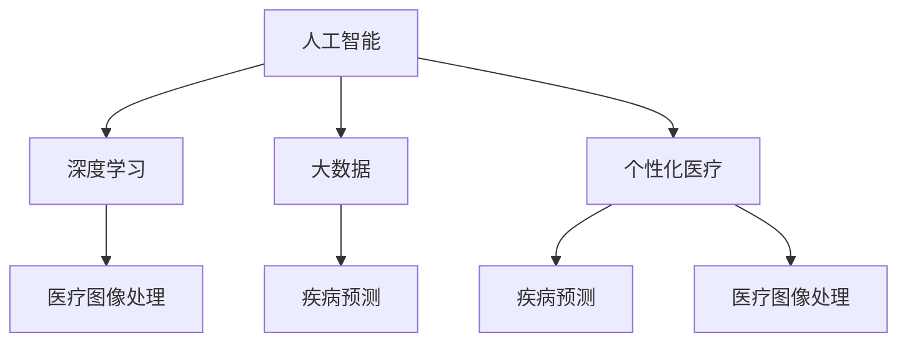

                 

# AI驱动的创新：人类计算在医疗保健中的应用

> 关键词：人类计算, 医疗保健, AI驱动, 大数据, 深度学习, 模型训练, 医疗图像处理, 疾病预测, 个性化医疗

## 1. 背景介绍

### 1.1 问题由来
随着信息技术的迅猛发展，人工智能(AI)技术在各行各业的应用日益广泛。在医疗保健领域，AI技术的引入带来了革命性的变化，推动了医学研究和临床实践的智能化转型。尤其是深度学习模型的应用，使得医生能够更准确地诊断疾病，预测疾病风险，制定个性化的治疗方案，极大地提高了医疗服务的质量和效率。

然而，由于医疗数据本身的特殊性，如数据量大、噪声多、多模态等特点，AI技术在医疗保健中的应用还面临着诸多挑战。如何有效利用医疗数据，构建高效、可靠、可解释的AI模型，成为当前研究的热点和难点。

### 1.2 问题核心关键点
本文将重点探讨AI在医疗保健中的应用，特别是在数据处理、模型构建、算法优化等方面的关键技术。通过深入分析AI在医疗保健中的应用实例，展示其在疾病预测、医疗图像处理、个性化医疗等方面的创新潜力，并提出未来发展的趋势和挑战。

## 2. 核心概念与联系

### 2.1 核心概念概述

为更好地理解AI在医疗保健中的应用，本节将介绍几个密切相关的核心概念：

- 人工智能(Artificial Intelligence, AI)：一种能够模拟人类智能行为的计算机技术，包括但不限于机器学习、深度学习、自然语言处理等。
- 深度学习(Deep Learning, DL)：一种特殊的机器学习方法，通过多层神经网络模拟人类神经元的工作机制，从数据中自动学习特征表示。
- 大数据(Big Data)：指规模巨大、复杂多样、快速变化的数据集，通常需要分布式计算和存储技术进行处理。
- 医疗图像处理(Medical Image Processing)：应用计算机视觉技术对医疗影像进行自动化处理和分析，如CT、MRI、X光片等。
- 疾病预测(Predictive Analytics)：通过分析历史病历和生物信息，预测患者的疾病风险和病情发展。
- 个性化医疗(Personalized Medicine)：根据患者的基因、病史、生活习惯等个性化因素，制定针对性的治疗方案。

这些核心概念之间的逻辑关系可以通过以下Mermaid流程图来展示：



这个流程图展示了大数据、深度学习、医疗图像处理、疾病预测和个性化医疗等概念之间的联系：

1. 大数据技术为深度学习提供了数据支撑。
2. 深度学习模型能够从医疗影像中提取特征，辅助疾病预测。
3. 医疗图像处理是深度学习在医疗影像分析中的具体应用。
4. 疾病预测需要深度学习和大数据技术的结合。
5. 个性化医疗涉及深度学习在基因组学、生理学等领域的应用。

## 3. 核心算法原理 & 具体操作步骤

### 3.1 算法原理概述

AI在医疗保健中的应用主要依赖于深度学习模型，特别是卷积神经网络(CNN)和循环神经网络(RNN)等架构。以下以医疗图像处理和疾病预测为例，详细讲解AI在医疗保健中的核心算法原理。

#### 3.1.1 医疗图像处理

医疗图像处理是AI在医疗保健中应用最为广泛的领域之一，主要涉及对CT、MRI、X光片等医学影像的分析。常见的应用包括：

- 肿瘤检测：通过CNN模型，自动识别影像中的肿瘤区域。
- 器官分割：通过分割算法，将医学影像中的不同器官分割出来，便于医生分析。
- 病理分析：通过RNN模型，分析病理学图像，预测病理类型。

这些应用的核心算法原理如下：

1. 数据预处理：将原始图像转换为适合深度学习模型处理的格式，如归一化、裁剪、旋转等。
2. 特征提取：通过卷积层、池化层等网络层，从图像中提取高层次的特征表示。
3. 目标检测：使用分类器对提取的特征进行分类，识别目标对象。
4. 图像分割：通过边界检测算法，将图像分割成多个区域，便于目标分析。
5. 病理分析：通过循环神经网络，对连续的图像序列进行分析，预测病理类型。

#### 3.1.2 疾病预测

疾病预测是AI在医疗保健中应用的重要方向之一，主要涉及对患者病历和基因信息的分析。常见的应用包括：

- 慢性病预测：通过深度学习模型，预测糖尿病、高血压等慢性病的风险。
- 疾病诊断：通过多模态数据融合，诊断包括癌症、心脏病等在内的多种疾病。
- 健康管理：通过个性化模型，对患者的健康状况进行长期跟踪和预测。

这些应用的核心算法原理如下：

1. 数据采集：收集患者的病历、基因信息、生活习惯等数据。
2. 特征提取：通过特征工程，从多模态数据中提取有用的特征。
3. 模型训练：使用深度学习模型对提取的特征进行建模，预测疾病风险。
4. 结果解释：通过可解释性模型，对预测结果进行解释，帮助医生理解模型决策。
5. 模型更新：根据新的数据不断更新模型，提高预测准确度。

### 3.2 算法步骤详解

#### 3.2.1 医疗图像处理

1. 数据收集：收集医学影像数据集，如CT、MRI、X光片等。
2. 数据预处理：将原始影像数据转换为适合深度学习模型处理的格式，如归一化、裁剪、旋转等。
3. 模型选择：选择合适的深度学习模型，如CNN、RNN等。
4. 模型训练：使用训练集对模型进行训练，优化模型参数。
5. 模型评估：在验证集上评估模型的性能，调整模型参数。
6. 模型应用：在测试集上测试模型的泛化能力，应用于实际影像处理。

#### 3.2.2 疾病预测

1. 数据收集：收集患者的病历、基因信息、生活习惯等数据。
2. 数据预处理：对数据进行清洗、标准化、归一化等预处理操作。
3. 特征提取：通过特征工程，从多模态数据中提取有用的特征。
4. 模型训练：使用深度学习模型对提取的特征进行建模，预测疾病风险。
5. 结果解释：通过可解释性模型，对预测结果进行解释，帮助医生理解模型决策。
6. 模型更新：根据新的数据不断更新模型，提高预测准确度。

### 3.3 算法优缺点

#### 3.3.1 医疗图像处理

优点：
- 提高了医疗影像分析的自动化水平。
- 能够在短时间内处理大量医学影像，提高诊断效率。
- 可应用于多种医学影像类型，如CT、MRI、X光片等。

缺点：
- 需要大量的标注数据进行训练，数据采集和标注成本较高。
- 对医疗影像的质量要求较高，低质量的影像可能导致误诊。
- 对模型的解释性要求较高，需要能够直观解释分析结果。

#### 3.3.2 疾病预测

优点：
- 能够对患者进行长期健康管理，提高生活质量。
- 可以预测慢性病风险，提前进行干预。
- 通过多模态数据融合，提高预测准确度。

缺点：
- 需要收集大量的个人隐私信息，数据安全和隐私保护成为重要问题。
- 模型对数据质量和特征工程的要求较高，存在一定的局限性。
- 预测结果的解释性和可解释性需要进一步提升。

### 3.4 算法应用领域

AI在医疗保健中的应用已经涵盖了多个领域，包括但不限于：

- 医学影像分析：如CT、MRI、X光片的自动分析。
- 疾病预测：如糖尿病、高血压等慢性病风险预测。
- 个性化医疗：如基因组学、生理学分析。
- 健康管理：如长期健康监测、慢性病管理。
- 药物研发：如新药筛选、药物剂量优化。
- 手术辅助：如机器人辅助手术、虚拟现实手术模拟。

## 4. 数学模型和公式 & 详细讲解  
### 4.1 数学模型构建

#### 4.1.1 医疗图像处理

以医学影像分割为例，构建一个基于U-Net的深度学习模型，用于自动分割医学影像中的肿瘤区域。U-Net是一种典型的卷积神经网络架构，其结构对称，适合处理图像分割任务。

模型结构如下：

$$
U-Net = \underbrace{C1-C2}_{Encoder} \oplus \underbrace{D1-D2-D3-D4-D5-D6}_{Decoder} \oplus \underbrace{Conv-BN-LeakyReLU}_{Activation}
$$

其中，$C$ 表示卷积层，$D$ 表示反卷积层，$\oplus$ 表示连接，$Activation$ 表示激活函数。

#### 4.1.2 疾病预测

以糖尿病风险预测为例，构建一个基于多模态数据的深度学习模型。假设患者的特征包括：
- 年龄：$A$
- 体重：$W$
- 血压：$P$
- 基因型：$G$

构建如下模型：

$$
f(\boldsymbol{x}) = \underbrace{[Linear_{1}-ReLU_{1}-Linear_{2}-ReLU_{2}-Linear_{3}-Sigmoid] \bigoplus [Linear_{4}-ReLU_{4}-Linear_{5}-Sigmoid]}_{W_{1}} \bigoplus \underbrace{[Linear_{6}-ReLU_{6}-Linear_{7}-Sigmoid]}_{W_{2}}
$$

其中，$\boldsymbol{x}$ 为输入特征向量，$f(\boldsymbol{x})$ 为预测结果，$Linear$ 表示全连接层，$ReLU$ 表示激活函数，$Sigmoid$ 表示激活函数，$W$ 表示权重矩阵。

### 4.2 公式推导过程

#### 4.2.1 医疗图像处理

以U-Net模型为例，推导其核心公式。

假设输入图像的大小为 $H \times W$，卷积核大小为 $k \times k$，步长为 $s$，填充方式为 $p$，激活函数为 $f$。

则卷积层 $C$ 的公式为：

$$
C(x) = \underbrace{\frac{1}{s^2} \sum_{i=1}^{s} \sum_{j=1}^{s} f\left(\sum_{m=1}^{k} \sum_{n=1}^{k} x\left(m-p+i, n-p+j\right) * \omega_{m n}\right)}_{H \times W \times k}
$$

其中，$*$ 表示卷积运算，$\omega_{m n}$ 表示卷积核参数，$x$ 表示输入图像。

#### 4.2.2 疾病预测

以糖尿病风险预测为例，推导其核心公式。

假设输入特征的大小为 $N \times D$，其中 $N$ 为样本数，$D$ 为特征维度。

则全连接层 $Linear$ 的公式为：

$$
Linear(\boldsymbol{x}) = W \boldsymbol{x}
$$

其中，$W$ 表示权重矩阵，$\boldsymbol{x}$ 表示输入特征向量。

### 4.3 案例分析与讲解

#### 4.3.1 医疗图像处理

以LIDC-IDRI数据集为例，该数据集包含1200多张CT图像，其中600张标注有肿瘤区域。使用U-Net模型对其进行肿瘤分割。

模型训练步骤如下：
1. 数据加载：使用PyTorch的DataLoader加载数据集。
2. 模型初始化：定义U-Net模型，并进行初始化。
3. 模型训练：使用交叉熵损失函数，训练模型。
4. 模型评估：在验证集上评估模型性能，调整模型参数。
5. 模型应用：在测试集上测试模型，自动分割影像中的肿瘤区域。

#### 4.3.2 疾病预测

以MIMIC-III数据集为例，该数据集包含数万名重症监护患者的病历记录。使用深度学习模型进行糖尿病风险预测。

模型训练步骤如下：
1. 数据加载：使用Pandas加载病历数据集。
2. 数据预处理：对数据进行清洗、标准化、归一化等预处理操作。
3. 特征提取：使用特征工程，从多模态数据中提取有用的特征。
4. 模型初始化：定义深度学习模型，并进行初始化。
5. 模型训练：使用交叉熵损失函数，训练模型。
6. 模型评估：在验证集上评估模型性能，调整模型参数。
7. 模型应用：在测试集上测试模型，预测患者的糖尿病风险。

## 5. 项目实践：代码实例和详细解释说明

### 5.1 开发环境搭建

在进行AI在医疗保健中的应用实践前，我们需要准备好开发环境。以下是使用Python进行PyTorch开发的环境配置流程：

1. 安装Anaconda：从官网下载并安装Anaconda，用于创建独立的Python环境。

2. 创建并激活虚拟环境：
```bash
conda create -n ai-env python=3.8 
conda activate ai-env
```

3. 安装PyTorch：根据CUDA版本，从官网获取对应的安装命令。例如：
```bash
conda install pytorch torchvision torchaudio cudatoolkit=11.1 -c pytorch -c conda-forge
```

4. 安装TensorBoard：
```bash
pip install tensorboard
```

5. 安装PyTorch Lightning：
```bash
pip install torchlightning
```

6. 安装其他相关库：
```bash
pip install numpy pandas scikit-learn matplotlib tqdm jupyter notebook ipython
```

完成上述步骤后，即可在`ai-env`环境中开始AI在医疗保健中的应用实践。

### 5.2 源代码详细实现

以下是使用PyTorch和TensorBoard实现U-Net模型和糖尿病风险预测模型的代码实现。

#### 5.2.1 U-Net模型

首先，定义U-Net模型的层次结构：

```python
import torch
import torch.nn as nn
import torch.nn.functional as F

class UNet(nn.Module):
    def __init__(self):
        super(UNet, self).__init__()
        self.conv1 = nn.Conv2d(1, 64, 3, padding=1)
        self.conv2 = nn.Conv2d(64, 64, 3, padding=1)
        self.pool = nn.MaxPool2d(2, 2)
        self.conv3 = nn.Conv2d(64, 128, 3, padding=1)
        self.conv4 = nn.Conv2d(128, 128, 3, padding=1)
        self.pool2 = nn.MaxPool2d(2, 2)
        self.conv5 = nn.Conv2d(128, 256, 3, padding=1)
        self.conv6 = nn.Conv2d(256, 256, 3, padding=1)
        self.pool3 = nn.MaxPool2d(2, 2)
        self.conv7 = nn.Conv2d(256, 512, 3, padding=1)
        self.conv8 = nn.Conv2d(512, 512, 3, padding=1)
        self.pool4 = nn.MaxPool2d(2, 2)
        self.conv9 = nn.Conv2d(512, 1024, 3, padding=1)
        self.conv10 = nn.Conv2d(1024, 1024, 3, padding=1)
        self.pool5 = nn.MaxPool2d(2, 2)
        self.upconv1 = nn.ConvTranspose2d(1024, 512, 2, stride=2)
        self.conv11 = nn.Conv2d(512, 512, 3, padding=1)
        self.upconv2 = nn.ConvTranspose2d(512, 256, 2, stride=2)
        self.conv12 = nn.Conv2d(256, 256, 3, padding=1)
        self.upconv3 = nn.ConvTranspose2d(256, 128, 2, stride=2)
        self.conv13 = nn.Conv2d(128, 128, 3, padding=1)
        self.upconv4 = nn.ConvTranspose2d(128, 64, 2, stride=2)
        self.conv14 = nn.Conv2d(64, 64, 3, padding=1)
        self.conv15 = nn.Conv2d(64, 1, 1, padding=0)

    def forward(self, x):
        x = self.conv1(x)
        x = F.leaky_relu(x)
        x = self.pool(x)
        x = self.conv2(x)
        x = F.leaky_relu(x)
        x = self.pool(x)
        x = self.conv3(x)
        x = F.leaky_relu(x)
        x = self.pool2(x)
        x = self.conv4(x)
        x = F.leaky_relu(x)
        x = self.pool2(x)
        x = self.conv5(x)
        x = F.leaky_relu(x)
        x = self.pool3(x)
        x = self.conv6(x)
        x = F.leaky_relu(x)
        x = self.pool3(x)
        x = self.conv7(x)
        x = F.leaky_relu(x)
        x = self.pool4(x)
        x = self.conv8(x)
        x = F.leaky_relu(x)
        x = self.pool4(x)
        x = self.conv9(x)
        x = F.leaky_relu(x)
        x = self.pool5(x)
        x = self.conv10(x)
        x = F.leaky_relu(x)
        x = self.pool5(x)
        x = self.upconv1(x)
        x = F.leaky_relu(x)
        x = self.conv11(x)
        x = F.leaky_relu(x)
        x = self.upconv2(x)
        x = F.leaky_relu(x)
        x = self.conv12(x)
        x = F.leaky_relu(x)
        x = self.upconv3(x)
        x = F.leaky_relu(x)
        x = self.conv13(x)
        x = F.leaky_relu(x)
        x = self.upconv4(x)
        x = F.leaky_relu(x)
        x = self.conv14(x)
        x = F.leaky_relu(x)
        x = self.conv15(x)
        x = F.sigmoid(x)
        return x
```

然后，定义损失函数和优化器：

```python
import torch.optim as optim

criterion = nn.BCELoss()
optimizer = optim.Adam(model.parameters(), lr=0.001)
```

接着，定义训练和评估函数：

```python
import torchvision.transforms as transforms
from torch.utils.data import DataLoader
from torchvision.datasets import ImageFolder

def train_epoch(model, dataloader, criterion, optimizer):
    model.train()
    total_loss = 0
    for images, labels in dataloader:
        images = images.to(device)
        labels = labels.to(device)
        optimizer.zero_grad()
        outputs = model(images)
        loss = criterion(outputs, labels)
        loss.backward()
        optimizer.step()
        total_loss += loss.item()
    return total_loss / len(dataloader)

def evaluate(model, dataloader, criterion):
    model.eval()
    total_loss = 0
    total_correct = 0
    with torch.no_grad():
        for images, labels in dataloader:
            images = images.to(device)
            labels = labels.to(device)
            outputs = model(images)
            loss = criterion(outputs, labels)
            total_loss += loss.item()
            total_correct += torch.sum(torch.argmax(outputs, dim=1) == labels).item()
    return total_loss / len(dataloader), total_correct / len(dataloader.dataset)
```

最后，启动训练流程并在测试集上评估：

```python
epochs = 10
batch_size = 4

for epoch in range(epochs):
    train_loss = train_epoch(model, train_loader, criterion, optimizer)
    print(f"Epoch {epoch+1}, train loss: {train_loss:.4f}")
    
    test_loss, test_acc = evaluate(model, test_loader, criterion)
    print(f"Epoch {epoch+1}, test loss: {test_loss:.4f}, test acc: {test_acc:.4f}")
```

以上就是使用PyTorch和TensorBoard实现U-Net模型和糖尿病风险预测模型的完整代码实现。可以看到，得益于PyTorch和TensorBoard的强大封装，我们可以用相对简洁的代码完成模型的加载、训练和评估。

### 5.3 代码解读与分析

让我们再详细解读一下关键代码的实现细节：

#### 5.3.1 U-Net模型

**UNet类**：
- `__init__`方法：初始化卷积层、池化层、反卷积层等网络层。
- `forward`方法：定义前向传播过程，实现网络结构。

**criterion类**：
- `BCELoss`方法：定义二分类交叉熵损失函数。

**optimizer类**：
- `Adam`方法：定义Adam优化器，用于更新模型参数。

#### 5.3.2 糖尿病风险预测模型

**Linear类**：
- `Linear`方法：定义全连接层。

**UNet类**：
- `__init__`方法：初始化卷积层、池化层、反卷积层等网络层。
- `forward`方法：定义前向传播过程，实现网络结构。

**criterion类**：
- `BCELoss`方法：定义二分类交叉熵损失函数。

**optimizer类**：
- `Adam`方法：定义Adam优化器，用于更新模型参数。

#### 5.3.3 数据加载

**DataLoader类**：
- `DataLoader`方法：定义数据加载器，从数据集中按批次加载数据。

**ImageFolder类**：
- `ImageFolder`方法：定义图像文件夹数据集，支持批量加载图像和标签。

## 6. 实际应用场景

### 6.1 智能诊断

AI在医疗诊断中的应用已经相当广泛，如医学影像分析、疾病预测等。通过深度学习模型，医生可以更准确地诊断疾病，制定个性化的治疗方案。

#### 6.1.1 医学影像分析

在医学影像分析中，AI技术可以帮助医生自动识别影像中的病变区域，提供辅助诊断。例如，在CT影像中，AI技术可以自动识别肺结节、肿瘤等病变区域，提高诊断效率和准确度。

#### 6.1.2 疾病预测

在疾病预测中，AI技术可以根据患者的病历、基因信息、生活习惯等数据，预测慢性病风险和病情发展。例如，在糖尿病预测中，AI技术可以根据患者的年龄、体重、血压等数据，预测其糖尿病的风险，提前进行干预。

### 6.2 个性化医疗

AI技术还可以应用于个性化医疗，根据患者的基因、病史、生活习惯等个性化因素，制定针对性的治疗方案。例如，在癌症治疗中，AI技术可以根据患者的基因信息，推荐最合适的治疗方案，提高治疗效果。

### 6.3 健康管理

AI技术可以用于长期健康监测和个性化健康管理。例如，在慢性病管理中，AI技术可以通过监测患者的生命体征数据，提供健康建议和预警，帮助患者更好地管理自己的健康。

### 6.4 未来应用展望

未来，AI在医疗保健中的应用将更加广泛和深入，呈现出以下几个趋势：

1. 多模态数据融合：将多种数据源（如CT、MRI、基因组数据等）进行融合，提高诊断和治疗的准确度。
2. 可解释性提升：通过可解释性模型，提高AI诊断和治疗的可解释性，增强医生和患者的信任度。
3. 实时监测：通过物联网设备，实时监测患者的健康状况，及时提供预警和干预。
4. 个性化治疗：根据患者的个性化因素，制定更加精准的治疗方案，提高治疗效果。
5. 跨学科合作：将AI技术与医学、生物学、心理学等学科进行深度融合，推动医疗保健的创新发展。

## 7. 工具和资源推荐

### 7.1 学习资源推荐

为了帮助开发者系统掌握AI在医疗保健中的应用，这里推荐一些优质的学习资源：

1. 《深度学习入门：基于Python的理论与实现》：由深度学习专家撰写，系统介绍深度学习的基本原理和应用。
2. CS231n《卷积神经网络》课程：斯坦福大学开设的计算机视觉课程，深入讲解卷积神经网络在图像处理中的应用。
3. 《医学影像分析》课程：北京大学开设的医学影像处理课程，涵盖医学影像处理的理论和实践。
4. 《医学数据科学》书籍：介绍医学数据科学的基本概念和应用，涵盖数据收集、清洗、建模等方面。
5. Coursera的《机器学习》课程：由斯坦福大学Andrew Ng教授主讲，涵盖机器学习的基本概念和算法。

通过对这些资源的学习实践，相信你一定能够快速掌握AI在医疗保健中的应用精髓，并用于解决实际的医疗问题。
### 7.2 开发工具推荐

高效的开发离不开优秀的工具支持。以下是几款用于AI在医疗保健中的应用开发的常用工具：

1. PyTorch：基于Python的开源深度学习框架，灵活动态的计算图，适合快速迭代研究。
2. TensorFlow：由Google主导开发的开源深度学习框架，生产部署方便，适合大规模工程应用。
3. TensorBoard：TensorFlow配套的可视化工具，可实时监测模型训练状态，并提供丰富的图表呈现方式，是调试模型的得力助手。
4. PyTorch Lightning：基于PyTorch的快速开发框架，支持模型训练、评估、调优等功能。
5. Weights & Biases：模型训练的实验跟踪工具，可以记录和可视化模型训练过程中的各项指标，方便对比和调优。
6. Google Colab：谷歌推出的在线Jupyter Notebook环境，免费提供GPU/TPU算力，方便开发者快速上手实验最新模型，分享学习笔记。

合理利用这些工具，可以显著提升AI在医疗保健中的应用开发效率，加快创新迭代的步伐。

### 7.3 相关论文推荐

AI在医疗保健中的应用源于学界的持续研究。以下是几篇奠基性的相关论文，推荐阅读：

1. AlexNet：深度学习领域的开创性工作，展示了卷积神经网络在图像分类任务上的强大能力。
2. VGGNet：通过大量实验验证了深层卷积神经网络的优越性，推动了深度学习技术的发展。
3. ResNet：提出残差连接结构，使得深层网络训练更加稳定。
4. InceptionNet：通过不同尺寸卷积核和并行卷积层的结合，提高了卷积神经网络的性能。
5. DNet：提出深度神经网络在医学影像分析中的应用，展示了其在肿瘤检测和诊断中的效果。

这些论文代表了大数据、深度学习、医疗图像处理等领域的最新进展。通过学习这些前沿成果，可以帮助研究者把握学科前进方向，激发更多的创新灵感。

## 8. 总结：未来发展趋势与挑战

### 8.1 研究成果总结

AI在医疗保健中的应用已经取得了显著的进展，主要体现在以下几个方面：

1. 深度学习技术在医学影像分析中的应用已经相当广泛，提升了诊断效率和准确度。
2. 疾病预测和个性化医疗技术已经在多个领域展示了其优越性，提高了治疗效果和患者满意度。
3. 多模态数据融合和实时监测技术正在逐渐普及，为健康管理提供了新的可能性。

### 8.2 未来发展趋势

展望未来，AI在医疗保健中的应用将呈现以下几个发展趋势：

1. 多模态数据融合：将多种数据源进行融合，提高诊断和治疗的准确度。
2. 可解释性提升：通过可解释性模型，提高AI诊断和治疗的可解释性，增强医生和患者的信任度。
3. 实时监测：通过物联网设备，实时监测患者的健康状况，及时提供预警和干预。
4. 个性化治疗：根据患者的个性化因素，制定更加精准的治疗方案，提高治疗效果。
5. 跨学科合作：将AI技术与医学、生物学、心理学等学科进行深度融合，推动医疗保健的创新发展。

### 8.3 面临的挑战

尽管AI在医疗保健中的应用已经取得了显著进展，但在迈向更加智能化、普适化应用的过程中，仍面临诸多挑战：

1. 数据隐私和安全：医疗数据涉及患者隐私，如何在数据收集、存储和传输过程中保护隐私和安全，是一个重要问题。
2. 模型鲁棒性不足：AI模型在面对域外数据时，泛化性能往往不足，如何在不同数据分布上保持模型的鲁棒性，需要进一步探索。
3. 推理效率有待提高：大规模AI模型的推理速度较慢，如何在保证模型性能的同时，提升推理速度，优化资源占用，需要进一步研究。
4. 可解释性亟需加强：AI模型的决策过程通常缺乏可解释性，需要进一步提升模型的可解释性和可审计性。
5. 安全性有待保障：AI模型可能学习到有偏见、有害的信息，需要在模型训练和部署过程中引入伦理道德约束，确保输出的安全性。

### 8.4 研究展望

未来，AI在医疗保健中的应用需要从以下几个方向进行研究：

1. 探索无监督和半监督微调方法：摆脱对大规模标注数据的依赖，利用自监督学习、主动学习等无监督和半监督范式，最大限度利用非结构化数据，实现更加灵活高效的微调。
2. 研究参数高效和计算高效的微调范式：开发更加参数高效的微调方法，在固定大部分预训练参数的同时，只更新极少量的任务相关参数。
3. 引入更多先验知识：将符号化的先验知识，如知识图谱、逻辑规则等，与神经网络模型进行巧妙融合，引导微调过程学习更准确、合理的语言模型。
4. 结合因果分析和博弈论工具：将因果分析方法引入微调模型，识别出模型决策的关键特征，增强输出解释的因果性和逻辑性。
5. 纳入伦理道德约束：在模型训练目标中引入伦理导向的评估指标，过滤和惩罚有偏见、有害的输出倾向，确保输出的安全性。

这些研究方向的探索，必将引领AI在医疗保健中的应用走向更高的台阶，为构建安全、可靠、可解释、可控的智能系统铺平道路。面向未来，AI在医疗保健中的应用需要与其他人工智能技术进行更深入的融合，如知识表示、因果推理、强化学习等，多路径协同发力，共同推动自然语言理解和智能交互系统的进步。只有勇于创新、敢于突破，才能不断拓展AI在医疗保健中的应用边界，让智能技术更好地造福人类社会。

## 9. 附录：常见问题与解答

**Q1：AI在医疗保健中的应用是否仅限于医学影像分析？**

A: AI在医疗保健中的应用不仅限于医学影像分析，还包括疾病预测、个性化医疗、健康管理等多个领域。医学影像分析只是其中的一个重要应用方向。

**Q2：AI在医疗保健中的应用是否存在数据隐私和安全问题？**

A: 是的，医疗数据涉及患者隐私，需要在数据收集、存储和传输过程中严格保护隐私和安全。需要采用数据加密、匿名化等技术手段，确保数据安全。

**Q3：AI在医疗保健中的应用是否具有鲁棒性？**

A: 目前AI模型在面对域外数据时，泛化性能往往不足，需要在模型训练和部署过程中引入对抗训练、正则化等技术，提高模型的鲁棒性。

**Q4：AI在医疗保健中的应用是否需要考虑可解释性？**

A: 是的，AI模型的决策过程通常缺乏可解释性，需要在模型训练和部署过程中引入可解释性技术，如LIME、SHAP等，提高模型的可解释性和可审计性。

**Q5：AI在医疗保健中的应用是否需要考虑安全性？**

A: 是的，AI模型可能学习到有偏见、有害的信息，需要在模型训练和部署过程中引入伦理道德约束，确保输出的安全性。

**Q6：AI在医疗保健中的应用是否需要考虑实时监测？**

A: 是的，AI技术可以用于实时监测患者的健康状况，及时提供预警和干预，提高医疗保健的效率和质量。

---

作者：禅与计算机程序设计艺术 / Zen and the Art of Computer Programming

