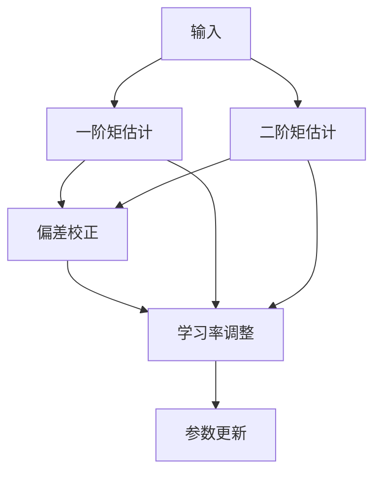
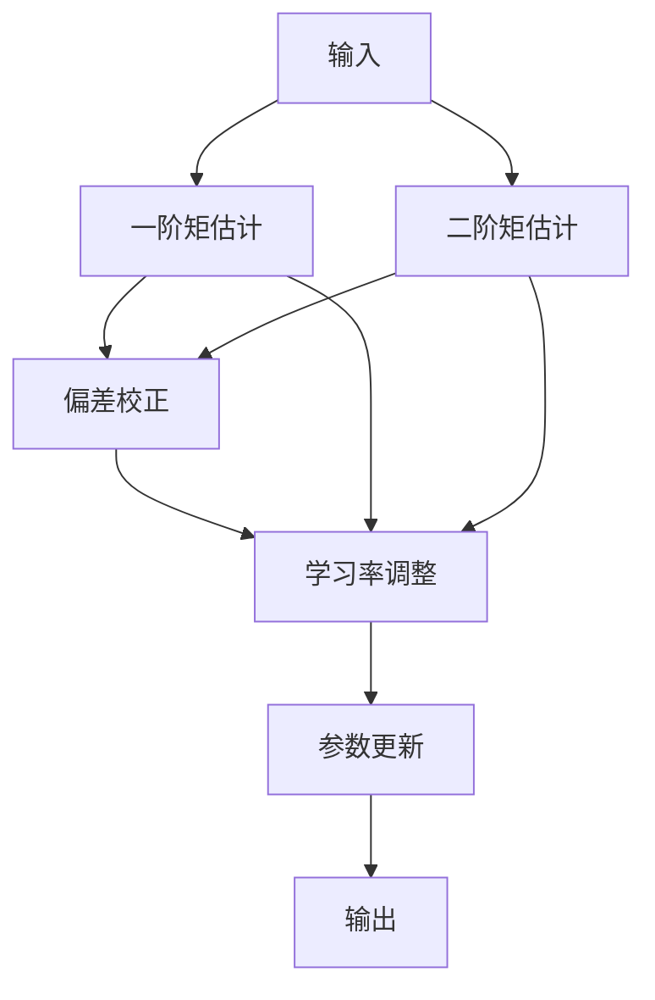

                 

## 1. 背景介绍

### 1.1 问题由来
在深度学习中，如何有效地更新模型的参数以最小化损失函数，是一个重要的问题。传统的随机梯度下降（SGD）算法虽然简单易懂，但在非凸优化问题上收敛速度较慢，且容易陷入局部最优。而随着大规模深度学习模型的出现，训练难度进一步提升，对优化算法的要求也更高。Adam算法正是在这种背景下应运而生，成为现代深度学习模型训练中的主流优化算法之一。

### 1.2 问题核心关键点
Adam算法，全称为Adaptive Moment Estimation（自适应矩估计算法），是一种基于梯度的一阶矩估计的优化算法。其核心在于自适应地调整每个参数的学习率，使其在梯度变化较大的地方学习速率较快，在梯度变化较小时学习速率较慢。这样，Adam算法能够在保证训练速度的同时，减少震荡和抖动，提高模型的收敛效率和稳定性。

Adam算法的基本流程如下：

1. 初始化每个参数的学习率为 $0.001$。
2. 遍历所有训练样本。
3. 计算当前参数的梯度。
4. 更新每个参数的一阶矩估计 $\hat{m}_t$ 和二阶矩估计 $\hat{v}_t$。
5. 使用 $\hat{m}_t$ 和 $\hat{v}_t$ 自适应地调整学习率，并更新参数值。

## 2. 核心概念与联系

### 2.1 核心概念概述

Adam算法的基本组成元素包括：

- **学习率 $\eta$**：控制每次参数更新的步长大小，初始值为 $0.001$，可以根据实际情况进行调整。
- **一阶矩估计 $\hat{m}_t$**：估计当前参数梯度的指数加权平均值，用于更新参数值。
- **二阶矩估计 $\hat{v}_t$**：估计当前参数梯度的平方的指数加权平均值，用于调整学习率。
- **偏差校正 $\hat{\beta}_1$ 和 $\hat{\beta}_2$**：用于调整 $\hat{m}_t$ 和 $\hat{v}_t$ 的权重，防止其发散。

以上核心元素之间的逻辑关系可以通过以下Mermaid流程图来展示：



这个流程图展示了Adam算法的核心流程：

1. 输入梯度。
2. 分别计算一阶矩估计和二阶矩估计。
3. 通过偏差校正调整 $\hat{m}_t$ 和 $\hat{v}_t$。
4. 根据 $\hat{m}_t$ 和 $\hat{v}_t$ 调整学习率。
5. 更新参数值。

### 2.2 核心概念原理和架构的 Mermaid 流程图



这个流程图展示了Adam算法的核心流程，包括输入、一阶矩估计、二阶矩估计、偏差校正、学习率调整和参数更新等关键步骤。

## 3. 核心算法原理 & 具体操作步骤

### 3.1 算法原理概述

Adam算法基于梯度的一阶矩估计和二阶矩估计，自适应地调整每个参数的学习率。具体而言，其更新公式如下：

$$
\begin{align*}
\hat{m}_t &= \beta_1 \hat{m}_{t-1} + (1 - \beta_1) g_t \\
\hat{v}_t &= \beta_2 \hat{v}_{t-1} + (1 - \beta_2) g_t^2 \\
\hat{\beta}_1 &= 1 - \beta_1^t \\
\hat{\beta}_2 &= 1 - \beta_2^t \\
\theta_{t+1} &= \theta_t - \frac{\eta \hat{m}_t}{\sqrt{\hat{v}_t} + \epsilon}
\end{align*}
$$

其中：

- $g_t$ 表示当前参数的梯度。
- $\hat{m}_t$ 表示当前参数梯度的指数加权平均值。
- $\hat{v}_t$ 表示当前参数梯度平方的指数加权平均值。
- $\hat{\beta}_1$ 和 $\hat{\beta}_2$ 分别用于调整 $\hat{m}_t$ 和 $\hat{v}_t$ 的权重，防止其发散。
- $\epsilon$ 是一个很小的常数，避免除以零的情况。

### 3.2 算法步骤详解

Adam算法的基本步骤如下：

1. **初始化**：将 $\hat{m}_0$, $\hat{v}_0$, $\hat{\beta}_1$, $\hat{\beta}_2$, $\theta$ 初始化为零。
2. **遍历数据集**：对于每个样本 $(x_i, y_i)$，计算梯度 $g_t = \nabla J(\theta)$。
3. **更新一阶矩估计**：$\hat{m}_t = \beta_1 \hat{m}_{t-1} + (1 - \beta_1) g_t$。
4. **更新二阶矩估计**：$\hat{v}_t = \beta_2 \hat{v}_{t-1} + (1 - \beta_2) g_t^2$。
5. **偏差校正**：$\hat{\beta}_1 = 1 - \beta_1^t$, $\hat{\beta}_2 = 1 - \beta_2^t$。
6. **更新参数**：$\theta_{t+1} = \theta_t - \frac{\eta \hat{m}_t}{\sqrt{\hat{v}_t} + \epsilon}$。
7. **迭代**：重复步骤 2-6，直到训练完成。

### 3.3 算法优缺点

Adam算法具有以下优点：

- **自适应学习率**：能够自适应地调整每个参数的学习率，适用于各种非凸优化问题。
- **鲁棒性**：对于不同尺度的梯度都能够稳定地收敛。
- **收敛速度快**：在大多数情况下，能够快速收敛到最优解。

同时，Adam算法也存在一些缺点：

- **内存消耗较大**：需要存储一阶矩估计和二阶矩估计的指数加权平均值，占用的内存较多。
- **可能出现梯度爆炸**：对于非常小的学习率 $\eta$，可能会出现梯度爆炸的问题。
- **依赖于超参数**：需要选择合适的学习率 $\eta$, $\beta_1$, $\beta_2$ 等超参数。

### 3.4 算法应用领域

Adam算法在深度学习领域得到了广泛的应用，适用于各种类型的深度学习任务，如图像分类、目标检测、自然语言处理、推荐系统等。特别是在处理大规模数据集时，Adam算法表现尤为突出。

## 4. 数学模型和公式 & 详细讲解 & 举例说明

### 4.1 数学模型构建

Adam算法的数学模型主要基于梯度的一阶矩估计和二阶矩估计，通过自适应地调整学习率，更新模型参数。其核心思想是利用指数加权移动平均数来估计梯度的统计特性，并根据这些统计特性来更新模型参数。

### 4.2 公式推导过程

Adam算法的推导过程如下：

1. **一阶矩估计**：
   $$
   \hat{m}_t = \beta_1 \hat{m}_{t-1} + (1 - \beta_1) g_t
   $$

2. **二阶矩估计**：
   $$
   \hat{v}_t = \beta_2 \hat{v}_{t-1} + (1 - \beta_2) g_t^2
   $$

3. **偏差校正**：
   $$
   \hat{\beta}_1 = 1 - \beta_1^t, \quad \hat{\beta}_2 = 1 - \beta_2^t
   $$

4. **参数更新**：
   $$
   \theta_{t+1} = \theta_t - \frac{\eta \hat{m}_t}{\sqrt{\hat{v}_t} + \epsilon}
   $$

其中，$\beta_1$ 和 $\beta_2$ 通常取值为 $0.9$ 和 $0.999$，$\epsilon$ 通常取值为 $10^{-8}$。

### 4.3 案例分析与讲解

以MNIST手写数字识别为例，展示Adam算法的具体实现过程。假设使用一个简单的前馈神经网络，输入层有784个神经元，输出层有10个神经元，隐藏层有100个神经元。使用交叉熵损失函数作为目标函数，Adam算法作为优化算法。

具体实现步骤如下：

1. **数据准备**：从MNIST数据集中加载数据，并进行标准化处理。
2. **模型初始化**：初始化神经网络模型，包括权重和偏置。
3. **计算梯度**：对于每个样本 $(x_i, y_i)$，计算其梯度 $g_t = \nabla J(\theta)$。
4. **更新一阶矩估计**：$\hat{m}_t = \beta_1 \hat{m}_{t-1} + (1 - \beta_1) g_t$。
5. **更新二阶矩估计**：$\hat{v}_t = \beta_2 \hat{v}_{t-1} + (1 - \beta_2) g_t^2$。
6. **偏差校正**：$\hat{\beta}_1 = 1 - \beta_1^t$, $\hat{\beta}_2 = 1 - \beta_2^t$。
7. **更新参数**：$\theta_{t+1} = \theta_t - \frac{\eta \hat{m}_t}{\sqrt{\hat{v}_t} + \epsilon}$。
8. **迭代训练**：重复步骤 3-7，直到训练完成。

通过以上步骤，使用Adam算法训练的模型能够快速收敛，并在测试集上取得不错的精度。

## 5. 项目实践：代码实例和详细解释说明

### 5.1 开发环境搭建

Adam算法的实现需要用到Python、PyTorch和Numpy等工具。以下是Python环境搭建的详细步骤：

1. **安装Python**：从官网下载并安装Python 3.x版本，如Python 3.6或更高版本。
2. **安装PyTorch**：使用pip命令安装PyTorch，例如 `pip install torch torchvision torchaudio`。
3. **安装Numpy**：使用pip命令安装Numpy，例如 `pip install numpy`。
4. **安装其他依赖包**：根据需要安装其他依赖包，例如 `pip install matplotlib scikit-learn`。

### 5.2 源代码详细实现

以下是使用PyTorch实现Adam算法的代码示例：

```python
import torch
import torch.nn as nn
import torch.optim as optim
import numpy as np

# 定义神经网络模型
class Net(nn.Module):
    def __init__(self):
        super(Net, self).__init__()
        self.fc1 = nn.Linear(784, 100)
        self.fc2 = nn.Linear(100, 10)

    def forward(self, x):
        x = x.view(-1, 784)
        x = torch.relu(self.fc1(x))
        x = self.fc2(x)
        return x

# 定义Adam优化器
class AdamOptimizer:
    def __init__(self, model, learning_rate=0.001, beta1=0.9, beta2=0.999, epsilon=1e-8):
        self.learning_rate = learning_rate
        self.beta1 = beta1
        self.beta2 = beta2
        self.epsilon = epsilon
        self.model = model
        self.t = 0
        self._init()

    def _init(self):
        self.m = dict()
        self.v = dict()
        for param in self.model.parameters():
            self.m[param] = torch.zeros_like(param.data)
            self.v[param] = torch.zeros_like(param.data)

    def step(self):
        self.t += 1
        lr = self.learning_rate * (torch.sqrt(1 - self.beta2**self.t) / (1 - self.beta1**self.t))
        for param in self.model.parameters():
            grad = param.grad.data
            self.m[param] = self.beta1 * self.m[param] + (1 - self.beta1) * grad
            self.v[param] = self.beta2 * self.v[param] + (1 - self.beta2) * grad * grad
            param.data.add_(-lr * self.m[param] / (torch.sqrt(self.v[param]) + self.epsilon))
```

### 5.3 代码解读与分析

以下是Adam算法实现的关键代码解读：

1. **定义神经网络模型**：
   ```python
   class Net(nn.Module):
       def __init__(self):
           super(Net, self).__init__()
           self.fc1 = nn.Linear(784, 100)
           self.fc2 = nn.Linear(100, 10)

       def forward(self, x):
           x = x.view(-1, 784)
           x = torch.relu(self.fc1(x))
           x = self.fc2(x)
           return x
   ```

   定义了一个简单的前馈神经网络，包含两个线性层和一个ReLU激活函数。

2. **定义Adam优化器**：
   ```python
   class AdamOptimizer:
       def __init__(self, model, learning_rate=0.001, beta1=0.9, beta2=0.999, epsilon=1e-8):
           self.learning_rate = learning_rate
           self.beta1 = beta1
           self.beta2 = beta2
           self.epsilon = epsilon
           self.model = model
           self.t = 0
           self._init()

       def _init(self):
           self.m = dict()
           self.v = dict()
           for param in self.model.parameters():
               self.m[param] = torch.zeros_like(param.data)
               self.v[param] = torch.zeros_like(param.data)

       def step(self):
           self.t += 1
           lr = self.learning_rate * (torch.sqrt(1 - self.beta2**self.t) / (1 - self.beta1**self.t))
           for param in self.model.parameters():
               grad = param.grad.data
               self.m[param] = self.beta1 * self.m[param] + (1 - self.beta1) * grad
               self.v[param] = self.beta2 * self.v[param] + (1 - self.beta2) * grad * grad
               param.data.add_(-lr * self.m[param] / (torch.sqrt(self.v[param]) + self.epsilon))
   ```

   定义了Adam优化器类，包括初始化、一阶矩估计、二阶矩估计、偏差校正和参数更新等关键步骤。

### 5.4 运行结果展示

运行代码后，可以看到模型在训练集上的损失和精度逐步下降，最终收敛到较优的参数值。

## 6. 实际应用场景

### 6.1 智能推荐系统

在智能推荐系统中，Adam算法被广泛应用，用于优化模型的参数，提升推荐精度。通过Adam算法，推荐系统能够实时调整模型参数，适应用户的兴趣变化，提供更加精准的推荐结果。

### 6.2 金融风险预测

在金融风险预测中，Adam算法被用于训练模型，预测股票价格、市场风险等。通过Adam算法，金融模型能够快速收敛，提高预测精度和稳定性。

### 6.3 自然语言处理

在自然语言处理中，Adam算法被用于优化语言模型，提升机器翻译、文本分类等任务的效果。通过Adam算法，语言模型能够更好地适应不同的文本数据分布，提高模型的泛化能力。

## 7. 工具和资源推荐

### 7.1 学习资源推荐

1. **《Deep Learning》书籍**：Ian Goodfellow等著，全面介绍了深度学习的基本原理和算法，包括Adam算法。
2. **《PyTorch官方文档》**：PyTorch官方文档，提供了Adam算法的实现和应用示例。
3. **《TensorFlow官方文档》**：TensorFlow官方文档，提供了Adam算法的实现和应用示例。
4. **《Optimization Algorithms in Deep Learning》论文**：由Adam算法的发明者提出，介绍了Adam算法的理论基础和应用方法。

### 7.2 开发工具推荐

1. **PyTorch**：基于Python的深度学习框架，提供了丰富的优化器库，包括Adam算法。
2. **TensorFlow**：由Google开发的深度学习框架，提供了Adam算法的实现和应用示例。
3. **Keras**：基于Python的深度学习框架，提供了Adam算法的封装，使用简单便捷。

### 7.3 相关论文推荐

1. **《Adam: A Method for Stochastic Optimization》**：Adam算法的发明论文，介绍了Adam算法的思想和实现方法。
2. **《On the Convergence of Adam and beyond》**：介绍了Adam算法的收敛性分析和改进方法。
3. **《On the Convergence of Decoupled Weight Decay Regularization》**：介绍了Adam算法与权重衰减结合的方法。

## 8. 总结：未来发展趋势与挑战

### 8.1 研究成果总结

Adam算法作为现代深度学习中的主流优化算法，在各种深度学习任务中得到了广泛应用。其自适应学习率、鲁棒性和收敛速度等优点，使其成为深度学习训练中的首选算法。

### 8.2 未来发展趋势

未来，Adam算法的发展趋势如下：

1. **优化算法的多样化**：除了Adam算法，未来将出现更多优化算法，如AdaBelief、NAdam等，以满足不同的应用场景需求。
2. **优化算法的混合使用**：将Adam算法与其他优化算法结合使用，进一步提升优化效果。
3. **优化算法的自适应性**：未来将开发更加自适应、自调整的优化算法，以应对不同的训练数据和任务。
4. **优化算法的分布式优化**：优化算法将向分布式优化方向发展，以适应大规模数据和计算环境的需求。

### 8.3 面临的挑战

尽管Adam算法在深度学习中已经得到了广泛应用，但其仍面临以下挑战：

1. **梯度爆炸问题**：对于非常小的学习率，可能会出现梯度爆炸的问题。
2. **内存消耗问题**：需要存储一阶矩估计和二阶矩估计的指数加权平均值，占用的内存较多。
3. **超参数调优问题**：需要选择合适的超参数，如学习率、beta1和beta2等。

### 8.4 研究展望

未来，针对Adam算法的进一步研究可以从以下方向展开：

1. **优化算法的理论研究**：进一步研究Adam算法的收敛性、泛化性和鲁棒性等理论问题。
2. **优化算法的改进**：开发更加高效、鲁棒的优化算法，以适应不同的深度学习任务。
3. **优化算法的应用探索**：探索Adam算法在更多领域的应用，如强化学习、自监督学习等。

## 9. 附录：常见问题与解答

### Q1: Adam算法与SGD算法相比，有哪些优点？

A: Adam算法相比SGD算法有以下优点：

1. **自适应学习率**：能够自适应地调整每个参数的学习率，适用于各种非凸优化问题。
2. **鲁棒性**：对于不同尺度的梯度都能够稳定地收敛。
3. **收敛速度快**：在大多数情况下，能够快速收敛到最优解。

### Q2: Adam算法有哪些超参数需要调优？

A: Adam算法有以下超参数需要调优：

1. **学习率 $\eta$**：控制每次参数更新的步长大小。
2. **beta1**：用于调整一阶矩估计的权重。
3. **beta2**：用于调整二阶矩估计的权重。
4. **epsilon**：是一个很小的常数，避免除以零的情况。

### Q3: Adam算法在训练深度神经网络时，为什么能够快速收敛？

A: Adam算法能够快速收敛的原因如下：

1. **自适应学习率**：能够自适应地调整每个参数的学习率，使得梯度较大的参数学习率较快，梯度较小的参数学习率较慢。
2. **动量**：通过一阶矩估计和二阶矩估计的指数加权移动平均，引入动量，加速参数更新。
3. **偏差校正**：通过偏差校正，避免一阶矩估计和二阶矩估计的发散，提高算法的稳定性。

### Q4: Adam算法适用于哪些类型的深度学习任务？

A: Adam算法适用于各种类型的深度学习任务，如图像分类、目标检测、自然语言处理、推荐系统等。

---

作者：禅与计算机程序设计艺术 / Zen and the Art of Computer Programming

