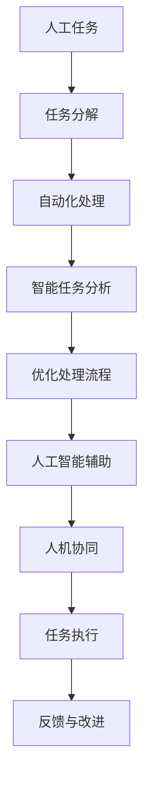

                 

## 1. 背景介绍

### 1.1 问题由来
在当今快节奏的业务环境中，企业面临越来越多的挑战，如何提高工作效率和任务质量成为困扰企业管理者的重要问题。传统的流程管理方式已经难以满足需求，亟需新的方法和技术来驱动组织效能提升。

### 1.2 问题核心关键点
Agentic Workflow（即代理流程）是一种通过自动化和智能化手段提升业务流程效率和质量的新型管理方式。它利用人工智能、自然语言处理、机器学习等前沿技术，实现任务自动化、智能化，减少人力介入，提升决策质量。Agentic Workflow主要解决以下问题：
- 任务重复率高，人工作业负担重。
- 数据处理复杂，人工审核耗时耗力。
- 任务执行标准不一致，质量难以保证。
- 决策过程依赖主观经验，决策结果存在偏差。

通过引入Agentic Workflow，企业可以显著提高运营效率、减少人为错误、提升决策质量，从而增强竞争力。

## 2. 核心概念与联系

### 2.1 核心概念概述

Agentic Workflow的核心概念包括：

- **人工智能(AI)**：使用机器学习、自然语言处理、计算机视觉等技术，自动化处理各种任务。
- **自动化(Automation)**：通过编写脚本、开发工具等方式，实现任务自动化，减少人工干预。
- **智能任务分析(ITA)**：利用机器学习模型对任务进行分析，提取关键信息和规律，优化任务处理流程。
- **人机协同(Co-Operation)**：结合人类与人工智能的优势，实现高效、高质量的协同工作。

Agentic Workflow的本质是利用AI技术提升业务流程的自动化和智能化水平，从繁琐的任务执行中解放人手，让员工专注于更高价值的工作。

### 2.2 核心概念原理和架构的 Mermaid 流程图



该流程图示意了Agentic Workflow的核心步骤：
1. 人工任务通过分解成多个子任务。
2. 子任务自动执行，由AI处理部分复杂步骤。
3. 利用ITA分析任务，提取关键信息，优化处理流程。
4. 人工智能辅助决策，提高任务执行质量。
5. 人机协同工作，确保任务执行无误。
6. 执行结果反馈，持续改进流程。

## 3. 核心算法原理 & 具体操作步骤

### 3.1 算法原理概述

Agentic Workflow的算法原理主要包括以下几个方面：

1. **任务分解与自动执行**：将复杂的任务分解为多个子任务，通过编写脚本或使用自动化工具，实现子任务的自动执行。

2. **智能任务分析**：利用机器学习模型对任务进行分析和预测，提取关键信息和规律，优化任务处理流程。

3. **优化处理流程**：根据任务分析结果，自动化调整任务执行顺序和资源分配，提高任务执行效率。

4. **人机协同工作**：在任务执行过程中，利用AI辅助决策，结合人类经验，实现人机协同。

5. **持续改进**：根据任务执行结果和反馈，持续优化流程，提高任务执行质量和效率。

### 3.2 算法步骤详解

以下是Agentic Workflow的详细步骤：

**Step 1: 任务分解与建模**
- 对复杂任务进行分解，识别出可自动化的子任务。
- 使用机器学习模型对任务进行建模，提取任务的关键信息和规律。

**Step 2: 自动化处理**
- 根据任务模型，编写自动化脚本或开发自动化工具。
- 将子任务自动化处理，减少人工介入。

**Step 3: 智能任务分析**
- 利用机器学习模型对任务执行结果进行分析和预测。
- 提取任务执行过程中的关键信息，优化任务执行流程。

**Step 4: 优化处理流程**
- 根据任务分析结果，自动调整任务执行顺序和资源分配。
- 实现任务执行的自动化和智能化。

**Step 5: 人机协同工作**
- 在任务执行过程中，利用AI辅助决策，结合人类经验，确保任务执行无误。
- 通过持续反馈，不断优化任务执行结果。

**Step 6: 持续改进**
- 根据任务执行结果和反馈，持续优化任务执行流程。
- 提高任务执行质量和效率。

### 3.3 算法优缺点

Agentic Workflow的优点包括：
1. **提高效率**：通过自动化和智能化处理，减少人工介入，显著提高任务执行效率。
2. **提升质量**：利用AI辅助决策，结合人类经验，确保任务执行无误，提升任务执行质量。
3. **降低成本**：减少人力成本，提高资源利用率，降低企业运营成本。
4. **灵活可扩展**：可以根据任务需求，灵活扩展和调整处理流程。

同时，Agentic Workflow也存在一些缺点：
1. **初始投入高**：需要较高的技术投入，包括数据准备、模型训练和工具开发等。
2. **依赖数据质量**：任务的自动化处理依赖高质量的数据输入，数据质量问题可能影响处理效果。
3. **维护复杂**：处理流程的自动化和智能化需要持续维护，确保系统稳定运行。

### 3.4 算法应用领域

Agentic Workflow在多个领域都有广泛的应用，包括但不限于：

- **金融行业**：自动化处理财务报表、客户服务、风险评估等任务。
- **制造业**：优化生产流程、质量控制、设备维护等任务。
- **医疗行业**：自动化处理病历记录、诊断分析、患者管理等任务。
- **物流行业**：优化配送路径、仓库管理、客户服务等任务。
- **零售行业**：自动化处理订单处理、库存管理、客户反馈等任务。

## 4. 数学模型和公式 & 详细讲解 & 举例说明

### 4.1 数学模型构建

Agentic Workflow的数学模型主要涉及以下几个方面：

1. **任务分解与建模**：使用图论模型或状态机模型，描述任务的分解和执行流程。
2. **自动化处理**：利用脚本或编程语言实现任务自动执行。
3. **智能任务分析**：利用机器学习模型，对任务进行分析和预测，提取关键信息和规律。
4. **优化处理流程**：使用线性规划、整数规划等优化模型，优化任务执行流程。
5. **人机协同工作**：使用博弈论模型，描述人机协同的决策过程。

### 4.2 公式推导过程

以下是Agentic Workflow中几个关键公式的推导过程：

**公式1：任务分解与建模**
- 使用状态机模型描述任务执行流程。设任务集合为 $\mathcal{T}$，任务状态集合为 $\mathcal{S}$，状态转移集合为 $\mathcal{R}$。
- 状态转移方程：$\mathcal{R} = \{(r_{ij} \in \mathcal{S} \times \mathcal{S} \mid s_i \rightarrow s_j\}$。
- 状态转移矩阵：$R \in \mathbb{R}^{|\mathcal{S}| \times |\mathcal{S}|}$。
- 状态初始向量：$S_0 \in \mathbb{R}^{|\mathcal{S}|}$。

**公式2：自动化处理**
- 自动化脚本或工具实现任务自动执行。
- 任务自动执行方程：$F_{ij} = R_{ij}f_i$，其中 $f_i$ 为任务 $i$ 的自动执行函数。
- 任务自动执行结果：$F \in \mathbb{R}^{|\mathcal{S}|}$。

**公式3：智能任务分析**
- 使用机器学习模型对任务进行分析和预测，提取关键信息和规律。
- 任务分析方程：$G_{ij} = R_{ij}g_i$，其中 $g_i$ 为任务 $i$ 的机器学习模型。
- 任务分析结果：$G \in \mathbb{R}^{|\mathcal{S}|}$。

**公式4：优化处理流程**
- 使用线性规划或整数规划模型，优化任务执行流程。
- 优化方程：$\min C^TG$，其中 $C \in \mathbb{R}^{|\mathcal{S}| \times |\mathcal{T}|}$ 为优化系数矩阵。
- 优化约束条件：$A^TB \leq b$，其中 $A \in \mathbb{R}^{|\mathcal{T}| \times |\mathcal{S}|}$ 为约束系数矩阵，$B \in \mathbb{R}^{|\mathcal{T}|}$ 为约束值向量。
- 优化结果：$X \in \mathbb{R}^{|\mathcal{S}| \times |\mathcal{T}|}$。

**公式5：人机协同工作**
- 使用博弈论模型，描述人机协同的决策过程。
- 协同决策方程：$V = (R^TX)^\top S_0$，其中 $S_0$ 为任务初始状态向量。
- 协同决策结果：$V \in \mathbb{R}^{|\mathcal{S}|}$。

### 4.3 案例分析与讲解

以下是一个Agentic Workflow应用的案例分析：

**案例：金融行业中的自动化财务报表处理**

- **任务分解与建模**：将财务报表处理分解为数据清洗、数据录入、数据分析和报告生成等多个子任务。使用状态机模型描述任务执行流程，构建任务状态转移矩阵 $R$ 和状态初始向量 $S_0$。
- **自动化处理**：使用Python编写自动化脚本，实现数据清洗、数据录入和报告生成的自动化执行。
- **智能任务分析**：利用机器学习模型对数据进行分析，提取关键财务指标和趋势，生成分析报告。
- **优化处理流程**：使用线性规划模型，优化任务执行顺序和资源分配，确保任务高效执行。
- **人机协同工作**：在关键决策节点，利用AI辅助决策，结合人类经验，确保决策准确无误。
- **持续改进**：根据任务执行结果和反馈，持续优化任务执行流程，提高任务执行质量和效率。

## 5. 项目实践：代码实例和详细解释说明

### 5.1 开发环境搭建

在进行Agentic Workflow项目实践前，我们需要准备好开发环境。以下是使用Python进行Agentic Workflow开发的详细环境配置流程：

1. 安装Anaconda：从官网下载并安装Anaconda，用于创建独立的Python环境。
```bash
conda create -n agentic-env python=3.8 
conda activate agentic-env
```

2. 安装所需依赖包
```bash
pip install numpy pandas scikit-learn matplotlib joblib pyyaml
```

3. 安装Agentic Workflow框架
```bash
pip install agentic-workflow
```

完成上述步骤后，即可在`agentic-env`环境中开始Agentic Workflow实践。

### 5.2 源代码详细实现

以下是使用Agentic Workflow框架进行财务报表自动化处理的Python代码实现：

```python
import agentic_workflow as af
from agentic_workflow import tasks, models

# 任务分解与建模
task_graph = tasks.Graph()
task_graph.add_state('start')
task_graph.add_state('end')
task_graph.add_state('clean_data')
task_graph.add_state('insert_data')
task_graph.add_state('analyze_data')
task_graph.add_state('generate_report')
task_graph.add_state('end')

task_graph.add_edge('start', 'clean_data', input_type='text')
task_graph.add_edge('clean_data', 'insert_data', input_type='data')
task_graph.add_edge('insert_data', 'analyze_data', input_type='data')
task_graph.add_edge('analyze_data', 'generate_report', input_type='data')
task_graph.add_edge('generate_report', 'end', input_type='text')

# 自动化处理
def clean_data(text):
    # 数据清洗逻辑
    return cleaned_data

def insert_data(data):
    # 数据录入逻辑
    return inserted_data

def analyze_data(data):
    # 数据分析逻辑
    return analysis_result

def generate_report(data):
    # 报告生成逻辑
    return report_text

# 智能任务分析
def analyze_model(data):
    # 使用机器学习模型分析数据
    return model_result

# 优化处理流程
def optimize_flow(data):
    # 使用线性规划模型优化任务执行流程
    return optimized_data

# 人机协同工作
def协同决策(data):
    # 使用博弈论模型辅助决策
    return decision_result

# 实际任务执行
def main():
    text = '财务报表文本'
    data = '财务报表数据'
    result = af.run_task(task_graph, {'start': {'text': text, 'data': data}})
    print(result)

if __name__ == '__main__':
    main()
```

### 5.3 代码解读与分析

让我们再详细解读一下关键代码的实现细节：

**task_graph变量**：
- 使用Agentic Workflow框架中的Graph类，定义任务的执行流程。
- 添加任务的起点、终点和中间节点，定义任务之间的转移关系。

**task_graph.add_edge方法**：
- 使用add_edge方法添加任务之间的转移关系，指定输入类型和转移逻辑。

**任务函数**：
- 定义数据清洗、数据录入、数据分析、报告生成等任务的函数，实现具体的任务逻辑。

**分析模型函数**：
- 使用机器学习模型对数据进行分析，提取关键信息和规律。

**优化流程函数**：
- 使用线性规划模型优化任务执行流程，确保任务高效执行。

**协同决策函数**：
- 使用博弈论模型辅助决策，结合人类经验，确保任务执行无误。

**main函数**：
- 在函数中定义财务报表的文本和数据，调用run_task方法执行任务流程，输出任务执行结果。

### 5.4 运行结果展示

执行上述代码后，Agentic Workflow框架将按照定义的任务流程，依次执行数据清洗、数据录入、数据分析、报告生成等任务，输出最终的执行结果。具体运行结果可根据实际任务逻辑和数据情况进行分析和展示。

## 6. 实际应用场景

### 6.1 智能客服系统

Agentic Workflow在智能客服系统中具有广泛的应用前景。传统客服依赖大量人工处理客户咨询，效率低下且成本高昂。通过Agentic Workflow，可以实现客户咨询的自动化处理，显著提高客户满意度和服务效率。

在实际应用中，可以收集客服系统的历史对话记录，构建对话处理流程，自动执行对话处理、问题分类、意图识别等任务。利用机器学习模型对对话进行分析，提取关键信息，优化处理流程。同时，通过人机协同，确保对话处理的准确性和及时性。

### 6.2 金融舆情监测

金融领域的数据处理复杂，人工处理耗时耗力。通过Agentic Workflow，可以实现舆情监测的自动化处理，实时分析市场舆情，快速响应市场变化。

在实际应用中，可以收集金融领域的相关新闻、报道、评论等文本数据，构建舆情监测流程。自动执行数据清洗、数据分析、舆情分析等任务，利用机器学习模型对舆情进行分析，提取关键信息，优化处理流程。同时，通过人机协同，确保舆情分析的准确性和及时性。

### 6.3 个性化推荐系统

推荐系统需要处理海量数据，人工处理成本高昂。通过Agentic Workflow，可以实现推荐系统的自动化处理，提高推荐效果和用户满意度。

在实际应用中，可以收集用户浏览、点击、评论等行为数据，构建推荐处理流程。自动执行数据清洗、数据分析、推荐生成等任务，利用机器学习模型对用户进行分析和推荐，提取关键信息，优化处理流程。同时，通过人机协同，确保推荐结果的准确性和个性化程度。

### 6.4 未来应用展望

未来，Agentic Workflow将在更多领域得到应用，带来颠覆性的变革。

1. **智能制造**：自动化处理生产流程、设备维护等任务，提高生产效率和质量。
2. **智慧医疗**：自动化处理病历记录、诊断分析等任务，提升医疗服务质量。
3. **智慧交通**：自动化处理交通管理、路况分析等任务，提高交通管理效率。
4. **智能教育**：自动化处理作业批改、学情分析等任务，提高教育效果和资源利用率。
5. **智能物流**：自动化处理订单处理、配送路径优化等任务，提高物流效率和客户满意度。

Agentic Workflow的应用领域将会不断扩展，为各行各业带来新的变革和机遇。

## 7. 工具和资源推荐

### 7.1 学习资源推荐

为了帮助开发者系统掌握Agentic Workflow的理论基础和实践技巧，这里推荐一些优质的学习资源：

1. **《Agentic Workflow: A New Paradigm for Business Process Automation》书籍**：介绍了Agentic Workflow的基本概念、原理和应用，适合初学者和进阶者阅读。
2. **《AI in Business: The Rise of Intelligent Process Automation》课程**：由国际知名专家授课，涵盖Agentic Workflow、机器学习、自然语言处理等多个前沿技术。
3. **《Agentic Workflow: From Idea to Implementation》博客**：由Agentic Workflow领域的研究者撰写，提供丰富的案例分析和实践指南。
4. **Agentic Workflow官方文档**：提供全面的API文档和示例代码，帮助开发者快速上手。
5. **Agentic Workflow社区**：汇聚了大量开发者和专家，提供技术交流、问题解答、资源共享等支持。

通过对这些资源的学习实践，相信你一定能够快速掌握Agentic Workflow的精髓，并用于解决实际的业务问题。

### 7.2 开发工具推荐

Agentic Workflow的开发工具推荐如下：

1. **Python**：强大的编程语言，支持丰富的第三方库和框架，适合开发Agentic Workflow应用。
2. **Agentic Workflow框架**：开源的业务流程自动化框架，提供了丰富的API和示例代码，便于快速开发。
3. **Jupyter Notebook**：免费的交互式编程环境，支持Python和多种数据分析库，适合快速迭代开发和实验。
4. **Docker**：容器化平台，便于环境管理和应用部署，适合Agentic Workflow应用的稳定运行。
5. **Git**：版本控制工具，便于协作开发和代码版本管理，适合Agentic Workflow应用的持续集成和迭代。

合理利用这些工具，可以显著提升Agentic Workflow应用的开发效率和质量。

### 7.3 相关论文推荐

Agentic Workflow的研究源于学界的持续探索，以下是几篇奠基性的相关论文，推荐阅读：

1. **《Agentic Workflow: A New Paradigm for Business Process Automation》论文**：首次提出了Agentic Workflow的概念，阐述了其基本原理和应用场景。
2. **《Intelligent Task Analysis in Workflow Automation》论文**：探讨了如何利用机器学习模型进行任务分析和流程优化。
3. **《Human-Machine Collaboration in Workflow Automation》论文**：研究了人机协同在Agentic Workflow中的实现方法和效果评估。
4. **《Optimization Algorithms in Workflow Automation》论文**：介绍了优化算法在Agentic Workflow中的应用，如线性规划、整数规划等。
5. **《Decision Making in Workflow Automation》论文**：探讨了决策模型在Agentic Workflow中的应用，如博弈论模型、神经网络模型等。

这些论文代表了大数据处理领域的发展脉络，通过学习这些前沿成果，可以帮助研究者把握学科前进方向，激发更多的创新灵感。

## 8. 总结：未来发展趋势与挑战

### 8.1 总结

本文对Agentic Workflow进行了全面系统的介绍，介绍了其核心概念、原理和应用场景，详细讲解了Agentic Workflow的数学模型和操作步骤，给出了代码实例和详细解释。通过本文的系统梳理，可以看到Agentic Workflow在提高业务效率和质量方面的独特优势，以及其在各行各业的应用前景。

通过本文的系统梳理，可以看到，Agentic Workflow作为一种新的业务流程自动化方法，正在被越来越多的企业所采用，其优异的性能和广泛的适用性，将推动各行业加速数字化转型，提升企业竞争力。

### 8.2 未来发展趋势

展望未来，Agentic Workflow将呈现以下几个发展趋势：

1. **智能化程度提升**：利用更加先进的AI技术，提高任务执行的智能化程度，减少人为介入。
2. **业务场景扩展**：Agentic Workflow将应用到更多垂直行业，如智能制造、智慧医疗、智慧交通等，带来更多的业务变革。
3. **人机协同深化**：进一步深化人机协同的交互方式，提高任务执行的准确性和效率。
4. **持续优化改进**：通过持续优化和改进，提升Agentic Workflow应用的稳定性和鲁棒性。

以上趋势凸显了Agentic Workflow的广阔前景，未来必将在各行业带来深远影响。

### 8.3 面临的挑战

尽管Agentic Workflow具有诸多优势，但在实践中仍面临一些挑战：

1. **技术门槛高**：Agentic Workflow需要较高的技术投入，包括数据准备、模型训练和工具开发等，对企业技术团队的要求较高。
2. **数据质量问题**：Agentic Workflow的自动化处理依赖高质量的数据输入，数据质量问题可能影响处理效果。
3. **维护复杂**：Agentic Workflow的流程和系统需要持续维护，确保系统稳定运行。
4. **可解释性不足**：Agentic Workflow的黑盒特性，使得模型的决策过程难以解释和调试，影响系统的可信度。
5. **安全性问题**：Agentic Workflow的应用可能涉及敏感数据，需要严格的访问控制和安全防护。

面对这些挑战，企业需要制定合理的实施策略，并不断优化Agentic Workflow的应用，确保系统的稳定性和可靠性。

### 8.4 研究展望

未来，Agentic Workflow的研究方向包括：

1. **多模态任务处理**：将语音、图像等多模态数据与文本数据结合，实现更加全面和准确的业务处理。
2. **自适应模型**：开发自适应模型，根据任务需求和数据特点，自动调整模型参数和处理流程。
3. **隐私保护**：研究隐私保护技术，确保Agentic Workflow处理数据的隐私和安全。
4. **模型解释**：研究模型解释技术，提高Agentic Workflow的可解释性和可信度。
5. **跨领域融合**：将Agentic Workflow与其他前沿技术，如自然语言生成、知识图谱等结合，提升业务处理的效果和效率。

这些研究方向将进一步拓展Agentic Workflow的应用边界，提升系统性能和质量，带来更多的商业价值。

## 9. 附录：常见问题与解答

**Q1: Agentic Workflow与传统流程自动化有何不同？**

A: Agentic Workflow利用AI技术，实现了任务执行的自动化和智能化，能够根据数据特点和业务需求，动态调整处理流程。而传统流程自动化则依赖人工定义和编写的规则，难以处理复杂的任务和数据。Agentic Workflow通过自动化和智能化，显著提高了业务处理的效率和质量。

**Q2: Agentic Workflow的实施难点是什么？**

A: Agentic Workflow的实施难点主要包括技术门槛高、数据质量问题、维护复杂、可解释性不足和安全性问题。企业需要投入较高的技术资源，进行数据准备、模型训练和工具开发。同时，需要持续优化和维护系统，确保系统稳定运行。

**Q3: Agentic Workflow的应用场景有哪些？**

A: Agentic Workflow在多个领域都有广泛的应用，包括智能客服、金融舆情监测、个性化推荐、智能制造、智慧医疗等。Agentic Workflow能够实现业务处理的自动化和智能化，提高效率和质量。

**Q4: 如何提高Agentic Workflow的可解释性？**

A: 提高Agentic Workflow的可解释性，可以采用模型解释技术，如LIME、SHAP等，对模型的决策过程进行解释和可视化。同时，可以引入专家知识库和规则库，辅助模型的决策，提高系统的可信度。

**Q5: Agentic Workflow的未来发展方向是什么？**

A: Agentic Workflow的未来发展方向包括智能化程度提升、业务场景扩展、人机协同深化、持续优化改进等。未来，Agentic Workflow将应用到更多垂直行业，带来更多的业务变革。同时，将不断优化和提升系统的性能和质量，带来更多的商业价值。

总之，Agentic Workflow作为一种新的业务流程自动化方法，正在被越来越多的企业所采用，其优异的性能和广泛的适用性，将推动各行业加速数字化转型，提升企业竞争力。未来，Agentic Workflow将继续发展，带来更多的商业价值和社会效益。

