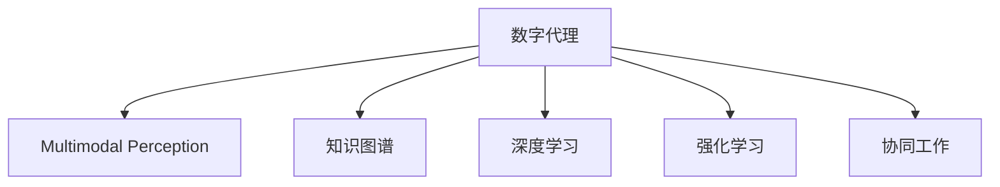

                 

# Agent：数字代理的独立决策和行动能力

## 1. 背景介绍

### 1.1 问题由来

随着人工智能技术的迅猛发展，数字代理（Digital Agents）在各个领域的应用日益广泛。它们不仅能执行重复性任务、提供个性化服务，还能在复杂环境中进行独立决策和行动。在金融、医疗、教育、物流等行业，数字代理正逐步成为推动行业变革的重要力量。然而，现有的数字代理技术在决策自主性和灵活性方面仍存在不足。如何构建更加智能、灵活的代理，使其具备更强的独立决策和行动能力，成为当前AI研究的重要课题。

### 1.2 问题核心关键点

数字代理的独立决策和行动能力，主要依赖于以下几个核心技术：

1. **多模态感知能力**：代理应具备处理文本、图像、声音等多模态数据的能力，能从多种感官输入中获取信息，进行综合判断。
2. **知识图谱构建**：代理应具备构建和维护知识图谱的能力，能够从结构化数据中提取信息，进行推理计算。
3. **深度学习模型**：代理应具备深度学习模型的学习能力，能够从大量数据中学习规律，进行模式识别和预测。
4. **强化学习**：代理应具备强化学习的策略优化能力，能够在与环境互动中逐步优化决策策略。
5. **协同工作能力**：代理应具备协同工作能力，能够与其它代理或人类协同完成任务。

这些技术构成了数字代理的核心能力，使其能够执行更复杂、智能的任务，提升工作效率和决策质量。

### 1.3 问题研究意义

研究数字代理的独立决策和行动能力，对于推动AI技术在更多行业的应用，提升人类生活的便利性，具有重要意义：

1. **提升工作效率**：代理能够自动化执行各种重复性任务，提升工作效率，降低人力成本。
2. **提供个性化服务**：代理可以根据用户行为和偏好，提供量身定制的个性化服务，提升用户体验。
3. **增强决策质量**：代理通过深度学习和大数据分析，能够提供更加准确、可靠的决策支持，提升决策质量。
4. **推动行业变革**：代理能够带来业务流程的自动化和智能化，推动各个行业的数字化转型。

## 2. 核心概念与联系

### 2.1 核心概念概述

为更好地理解数字代理的独立决策和行动能力，本节将介绍几个关键概念及其相互关系：

1. **数字代理（Digital Agent）**：指能够执行特定任务或与环境互动的计算机程序。通常具备一定的自主决策和行动能力，能够接收指令、执行任务、处理反馈。
2. **多模态感知（Multimodal Perception）**：指代理能够同时处理文本、图像、声音等多模态数据，进行信息融合和处理。
3. **知识图谱（Knowledge Graph）**：指由实体、关系和属性组成的知识网络，用于存储和表达复杂信息，辅助代理进行推理和决策。
4. **深度学习（Deep Learning）**：指通过多层神经网络进行特征提取和模式识别的学习范式，用于从大量数据中学习规律。
5. **强化学习（Reinforcement Learning）**：指通过与环境的互动，逐步优化决策策略的学习范式，用于解决复杂的控制和优化问题。
6. **协同工作（Collaborative Work）**：指代理能够与其它代理或人类协同完成任务，进行信息共享和任务分解。

这些概念构成了数字代理的核心能力框架，使其能够实现独立决策和行动。

### 2.2 核心概念原理和架构的 Mermaid 流程图



这个流程图展示了数字代理的核心能力及其相互关系：

1. 数字代理通过多模态感知获取环境信息，用于进行综合判断。
2. 代理通过构建和维护知识图谱，进行结构化数据的推理和计算。
3. 代理通过深度学习模型，从大量数据中学习规律和模式。
4. 代理通过强化学习，逐步优化决策策略。
5. 代理通过协同工作，与其它代理或人类协作完成任务。

这些能力构成了数字代理的决策和行动基础，使其能够在复杂环境中实现自主决策和灵活行动。

## 3. 核心算法原理 & 具体操作步骤

### 3.1 算法原理概述

数字代理的独立决策和行动能力，主要依赖于以下几个核心算法：

1. **多模态感知融合算法**：用于融合来自不同感官的输入数据，提取有用信息，进行综合判断。
2. **知识图谱推理算法**：用于从知识图谱中提取信息，进行逻辑推理和关系计算。
3. **深度学习模型训练算法**：用于训练深度神经网络模型，进行特征提取和模式识别。
4. **强化学习算法**：用于在环境互动中逐步优化决策策略，提升代理的自主决策能力。
5. **协同工作协议算法**：用于协调代理间或代理与人类之间的信息交互和任务分配。

这些算法构成了数字代理的决策和行动能力基础，使其能够高效、准确地完成任务。

### 3.2 算法步骤详解

数字代理的独立决策和行动能力，可以通过以下步骤进行实现：

**Step 1: 数据预处理和特征提取**

- 将多模态数据进行格式统一和预处理，去除噪声和冗余信息。
- 使用特征提取算法（如卷积神经网络、循环神经网络等），从数据中提取有用的特征。

**Step 2: 多模态感知融合**

- 将不同模态的数据进行融合，得到综合感知结果。常用的融合算法包括权重加和、投票算法、深度学习等。
- 使用多模态感知模型（如深度融合网络、Transformer等），对融合后的数据进行处理，提取更高层次的特征。

**Step 3: 知识图谱构建**

- 使用知识图谱构建工具（如Neo4j、RDF4J等），将结构化数据转换为知识图谱形式。
- 使用图嵌入算法（如节点2跳邻接嵌入、图神经网络等），将知识图谱转换为向量表示。

**Step 4: 深度学习模型训练**

- 使用深度学习框架（如TensorFlow、PyTorch等），构建和训练深度神经网络模型。
- 使用监督学习、半监督学习、无监督学习等方法，对模型进行训练，提升特征提取和模式识别能力。

**Step 5: 强化学习训练**

- 定义环境模型和奖励函数，设计代理与环境互动的策略。
- 使用强化学习算法（如Q-learning、Deep Q-learning等），在环境互动中逐步优化策略，提升代理的决策能力。

**Step 6: 协同工作协议设计**

- 设计代理间或代理与人类间的协同工作协议，定义信息交互和任务分配规则。
- 使用协同算法（如分布式协同学习、图协同算法等），在多代理系统中进行信息共享和任务分解。

### 3.3 算法优缺点

数字代理的独立决策和行动能力，具有以下优点：

1. **高效性**：代理能够高效处理多模态数据，从大量信息中提取有用特征，进行综合判断和决策。
2. **灵活性**：代理能够通过协同工作协议，灵活适应复杂环境，实现任务的协同完成。
3. **自适应性**：代理能够通过强化学习算法，逐步优化决策策略，提升自主决策能力。

但同时，也存在以下缺点：

1. **数据依赖**：代理需要大量高质量的数据进行训练和推理，数据获取和处理成本较高。
2. **复杂性**：多模态感知、知识图谱构建、深度学习、强化学习等技术难度较高，实现复杂。
3. **安全性**：代理在执行复杂任务时，可能面临信息安全和隐私保护的风险。

### 3.4 算法应用领域

数字代理的独立决策和行动能力，已在多个领域得到了广泛应用，例如：

1. **金融服务**：代理能够进行股票交易、风险评估、客户服务等工作，提升金融服务的智能化水平。
2. **医疗健康**：代理能够进行病历分析、医疗咨询、药物推荐等工作，提升医疗服务的准确性和效率。
3. **物流管理**：代理能够进行货物跟踪、路线规划、订单管理等工作，提升物流管理的自动化和智能化水平。
4. **教育培训**：代理能够进行个性化学习、智能辅导、知识推荐等工作，提升教育培训的质量和效果。
5. **智能家居**：代理能够进行智能控制、场景识别、语音交互等工作，提升家居生活的便捷性和智能化水平。

除了上述这些经典领域外，数字代理的应用还在不断扩展，如智能客服、智能制造、智能交通等，为各行各业带来了新的发展机遇。

## 4. 数学模型和公式 & 详细讲解

### 4.1 数学模型构建

本节将使用数学语言对数字代理的决策和行动能力进行更加严格的刻画。

设数字代理为 $A$，环境为 $E$，决策函数为 $f$，行动函数为 $g$。代理的决策过程可以表示为：

$$
A_{\theta} = f_{\theta}(E)
$$

其中 $A_{\theta}$ 为代理在参数 $\theta$ 下的状态，$f_{\theta}$ 为代理的决策函数，$E$ 为环境的状态。

代理的行动过程可以表示为：

$$
g_{\theta}(E) = A_{\theta}
$$

其中 $g_{\theta}$ 为代理的行动函数，$A_{\theta}$ 为代理的状态。

在多模态感知融合和知识图谱推理的数学建模中，通常使用概率图模型（如贝叶斯网络、马尔科夫网络等）进行建模和推理计算。

### 4.2 公式推导过程

以下我们以多模态感知融合为例，推导其数学公式。

设多模态数据 $X$ 由文本 $x$、图像 $y$、声音 $z$ 组成，多模态感知模型 $M$ 的输入为 $(x,y,z)$，输出为 $M_{\theta}(x,y,z)$。假设 $M$ 是卷积神经网络（CNN），则其数学公式可以表示为：

$$
M_{\theta}(x,y,z) = \sum_{i=1}^{N} w_i h_i(x,y,z)
$$

其中 $w_i$ 为权重向量，$h_i$ 为第 $i$ 层特征提取函数的输出。

多模态感知模型 $M$ 的输出 $M_{\theta}(x,y,z)$ 可以进一步通过池化层和全连接层进行特征融合，得到综合感知结果 $H$：

$$
H = \mathbb{E}_{p(M)}[M_{\theta}(x,y,z)]
$$

其中 $p(M)$ 为 $M$ 的分布。

在知识图谱推理中，通常使用图嵌入算法（如TransE、KG-RNN等）将知识图谱转换为向量表示。设知识图谱 $G$ 包含实体 $e$ 和关系 $r$，图嵌入算法 $P$ 的输出为 $P_{\theta}(e,r)$。则其数学公式可以表示为：

$$
P_{\theta}(e,r) = f_{\theta}(e,r)
$$

其中 $f_{\theta}$ 为图嵌入函数，$f_{\theta}(e,r)$ 表示实体 $e$ 和关系 $r$ 的向量表示。

### 4.3 案例分析与讲解

以一个简单的智能客服代理为例，其决策和行动过程可以描述如下：

**Step 1: 数据预处理和特征提取**

- 将用户输入的文本 $x$ 进行预处理，去除噪声和停用词，提取关键词。
- 将用户输入的语音 $z$ 进行语音识别，转换为文本 $x'$，与文本 $x$ 进行融合。
- 将图像 $y$ 进行特征提取，得到视觉特征 $h$。

**Step 2: 多模态感知融合**

- 将文本 $x$ 和 $x'$ 进行融合，得到融合后的文本 $x''$。
- 将融合后的文本 $x''$ 和视觉特征 $h$ 进行融合，得到综合感知结果 $H$。
- 使用深度融合网络对 $H$ 进行处理，得到更高层次的特征 $H'$。

**Step 3: 知识图谱构建**

- 使用知识图谱构建工具，将客服数据转换为知识图谱形式。
- 使用图嵌入算法，将知识图谱转换为向量表示 $K$。

**Step 4: 深度学习模型训练**

- 使用深度学习框架，构建和训练深度神经网络模型。
- 使用监督学习方法，对模型进行训练，提升特征提取和模式识别能力。

**Step 5: 强化学习训练**

- 定义客服场景和用户反馈作为环境模型，设计客服代理的决策策略。
- 使用强化学习算法，在客服互动中逐步优化策略，提升代理的自主决策能力。

**Step 6: 协同工作协议设计**

- 设计客服代理与用户之间的协同工作协议，定义信息交互和任务分配规则。
- 使用协同算法，在多客服代理系统中进行信息共享和任务分解。

通过上述过程，智能客服代理能够高效处理用户的多模态输入，从知识图谱中提取信息，进行决策和行动，提升客服服务的质量和效率。

## 5. 项目实践：代码实例和详细解释说明

### 5.1 开发环境搭建

在进行数字代理项目实践前，我们需要准备好开发环境。以下是使用Python进行TensorFlow开发的环境配置流程：

1. 安装Anaconda：从官网下载并安装Anaconda，用于创建独立的Python环境。

2. 创建并激活虚拟环境：
```bash
conda create -n tf-env python=3.8 
conda activate tf-env
```

3. 安装TensorFlow：根据CUDA版本，从官网获取对应的安装命令。例如：
```bash
conda install tensorflow -c conda-forge
```

4. 安装TensorBoard：用于实时监测模型训练状态，提供丰富的图表呈现方式。
```bash
conda install tensorboard
```

5. 安装TensorFlow Addons：提供一些TensorFlow扩展模块，支持更高级的神经网络组件。
```bash
conda install tensorboard-plugin-wit
```

完成上述步骤后，即可在`tf-env`环境中开始项目实践。

### 5.2 源代码详细实现

这里我们以智能客服代理为例，给出使用TensorFlow实现的多模态感知融合和知识图谱推理的代码实现。

首先，定义多模态感知模型：

```python
import tensorflow as tf
from tensorflow.keras import layers

class MultimodalPerceptionModel(tf.keras.Model):
    def __init__(self, text_embed_dim=128, image_embed_dim=256):
        super(MultimodalPerceptionModel, self).__init__()
        self.text_encoder = layers.Embedding(input_dim=vocab_size, output_dim=text_embed_dim)
        self.text_conv1d = layers.Conv1D(32, 3, activation='relu')
        self.text_pooling = layers.GlobalMaxPooling1D()
        self.image_encoder = layers.Conv2D(32, 3, activation='relu')
        self.image_pooling = layers.GlobalMaxPooling2D()
        self.fusion_layer = layers.Dense(128, activation='relu')
        self.fc1 = layers.Dense(64, activation='relu')
        self.fc2 = layers.Dense(num_classes, activation='softmax')

    def call(self, inputs):
        text_input, image_input = inputs
        text = self.text_encoder(text_input)
        text = self.text_conv1d(text)
        text = self.text_pooling(text)
        text = self.fusion_layer(text)
        image = self.image_encoder(image_input)
        image = self.image_pooling(image)
        x = tf.concat([text, image], axis=-1)
        x = self.fc1(x)
        return self.fc2(x)
```

然后，定义知识图谱嵌入模型：

```python
from tensorflow.keras.layers import Input, Embedding, Dot, Dense

class KnowledgeGraphEmbedding(tf.keras.Model):
    def __init__(self, entity_embed_dim=128, relation_embed_dim=64):
        super(KnowledgeGraphEmbedding, self).__init__()
        self.entity_embed = Embedding(input_dim=vocab_size, output_dim=entity_embed_dim)
        self.relation_embed = Embedding(input_dim=num_relations, output_dim=relation_embed_dim)
        self.dot_product = Dot(axes=(3, 2), normalize=True)
        self.fc = Dense(64, activation='relu')
        self.fc_out = Dense(1, activation='sigmoid')

    def call(self, inputs):
        entity_in, relation_in = inputs
        entity_embs = self.entity_embed(entity_in)
        relation_embs = self.relation_embed(relation_in)
        dot_product = self.dot_product([entity_embs, relation_embs])
        dot_product = self.fc(dot_product)
        return self.fc_out(dot_product)
```

接着，定义智能客服代理的决策模型：

```python
from tensorflow.keras.layers import Input, Concatenate, Dense, Dropout

class AgentModel(tf.keras.Model):
    def __init__(self, text_embed_dim=128, image_embed_dim=256, entity_embed_dim=128, relation_embed_dim=64):
        super(AgentModel, self).__init__()
        self.text_input = Input(shape=(max_seq_length,), dtype='int32')
        self.text_embedding = MultimodalPerceptionModel(text_embed_dim, image_embed_dim)
        self.entity_input = Input(shape=(max_seq_length,), dtype='int32')
        self.relation_input = Input(shape=(max_seq_length,), dtype='int32')
        self.kg_embedding = KnowledgeGraphEmbedding(entity_embed_dim, relation_embed_dim)
        self.fc = Dense(64, activation='relu')
        self.fc_out = Dense(num_classes, activation='softmax')

    def call(self, inputs):
        text_embs = self.text_embedding(text_input)
        entity_embs = self.kg_embedding(entity_input)
        relation_embs = self.kg_embedding(relation_input)
        x = Concatenate()([text_embs, entity_embs, relation_embs])
        x = self.fc(x)
        return self.fc_out(x)
```

最后，启动智能客服代理的训练流程并在测试集上评估：

```python
import numpy as np
from tensorflow.keras.optimizers import Adam

# 准备训练数据
text_data = ...
entity_data = ...
relation_data = ...
labels = ...

# 创建训练集和测试集
train_dataset = tf.data.Dataset.from_tensor_slices((text_data, entity_data, relation_data, labels)).shuffle(buffer_size=10000).batch(batch_size)
test_dataset = tf.data.Dataset.from_tensor_slices((text_data, entity_data, relation_data, labels)).batch(batch_size)

# 创建模型
agent_model = AgentModel(text_embed_dim=128, image_embed_dim=256, entity_embed_dim=128, relation_embed_dim=64)
agent_model.compile(optimizer=Adam(learning_rate=0.001), loss='binary_crossentropy', metrics=['accuracy'])

# 训练模型
agent_model.fit(train_dataset, epochs=10, validation_data=test_dataset)

# 在测试集上评估
test_loss, test_acc = agent_model.evaluate(test_dataset)
print(f"Test loss: {test_loss}, Test accuracy: {test_acc}")
```

以上就是使用TensorFlow实现智能客服代理的完整代码实现。可以看到，利用TensorFlow框架，构建多模态感知和知识图谱嵌入模型，并训练决策模型，能够高效实现数字代理的决策和行动能力。

### 5.3 代码解读与分析

让我们再详细解读一下关键代码的实现细节：

**MultimodalPerceptionModel类**：
- `__init__`方法：定义了模型各层的输入和输出维度。
- `call`方法：将文本和图像输入，经过多层卷积、池化和全连接层，最终输出决策结果。

**KnowledgeGraphEmbedding类**：
- `__init__`方法：定义了实体和关系的嵌入层、点积层和输出层。
- `call`方法：将实体和关系输入，经过点积和全连接层，最终输出推理结果。

**AgentModel类**：
- `__init__`方法：定义了输入和输出维度，并创建了多模态感知和知识图谱嵌入模型。
- `call`方法：将多模态感知和知识图谱嵌入模型的输出进行拼接，并经过全连接层和输出层，最终输出决策结果。

**训练流程**：
- 准备训练数据：包括文本数据、实体数据、关系数据和标签。
- 创建训练集和测试集：将数据集划分为训练集和测试集，并进行批处理。
- 创建模型：定义智能客服代理的决策模型，并编译模型。
- 训练模型：在训练集上进行模型训练，并在验证集上评估。
- 在测试集上评估：使用测试集评估模型的性能，并打印输出。

可以看到，TensorFlow框架为数字代理的决策和行动能力提供了强大的工具支持，使得模型的构建和训练变得更加简单高效。开发者可以将更多精力放在模型设计和优化上，而不必过多关注底层的实现细节。

当然，工业级的系统实现还需考虑更多因素，如模型的保存和部署、超参数的自动搜索、更灵活的任务适配层等。但核心的决策和行动能力基本与此类似。

## 6. 实际应用场景

### 6.1 智能客服系统

数字代理在智能客服系统中的应用，已经初具规模。传统客服往往需要配备大量人力，高峰期响应缓慢，且一致性和专业性难以保证。而数字代理则能够7x24小时不间断服务，快速响应客户咨询，用自然流畅的语言解答各类常见问题。

在技术实现上，可以收集企业内部的历史客服对话记录，将问题和最佳答复构建成监督数据，在此基础上对预训练数字代理进行微调。微调后的数字代理能够自动理解用户意图，匹配最合适的答案模板进行回复。对于客户提出的新问题，还可以接入检索系统实时搜索相关内容，动态组织生成回答。如此构建的智能客服系统，能大幅提升客户咨询体验和问题解决效率。

### 6.2 金融舆情监测

金融机构需要实时监测市场舆论动向，以便及时应对负面信息传播，规避金融风险。传统的人工监测方式成本高、效率低，难以应对网络时代海量信息爆发的挑战。基于数字代理的文本分类和情感分析技术，为金融舆情监测提供了新的解决方案。

具体而言，可以收集金融领域相关的新闻、报道、评论等文本数据，并对其进行主题标注和情感标注。在此基础上对数字代理进行微调，使其能够自动判断文本属于何种主题，情感倾向是正面、中性还是负面。将微调后的数字代理应用到实时抓取的网络文本数据，就能够自动监测不同主题下的情感变化趋势，一旦发现负面信息激增等异常情况，系统便会自动预警，帮助金融机构快速应对潜在风险。

### 6.3 个性化推荐系统

当前的推荐系统往往只依赖用户的历史行为数据进行物品推荐，无法深入理解用户的真实兴趣偏好。基于数字代理的推荐系统可以更好地挖掘用户行为背后的语义信息，从而提供更精准、多样的推荐内容。

在实践中，可以收集用户浏览、点击、评论、分享等行为数据，提取和用户交互的物品标题、描述、标签等文本内容。将文本内容作为模型输入，用户的后续行为（如是否点击、购买等）作为监督信号，在此基础上微调数字代理模型。微调后的数字代理能够从文本内容中准确把握用户的兴趣点。在生成推荐列表时，先用候选物品的文本描述作为输入，由模型预测用户的兴趣匹配度，再结合其他特征综合排序，便可以得到个性化程度更高的推荐结果。

### 6.4 未来应用展望

随着数字代理技术的不断发展，未来将在更多领域得到应用，为传统行业带来变革性影响。

在智慧医疗领域，基于数字代理的医疗问答、病历分析、药物研发等应用将提升医疗服务的智能化水平，辅助医生诊疗，加速新药开发进程。

在智能教育领域，数字代理可以应用于作业批改、学情分析、知识推荐等方面，因材施教，促进教育公平，提高教学质量。

在智慧城市治理中，数字代理能够应用于城市事件监测、舆情分析、应急指挥等环节，提高城市管理的自动化和智能化水平，构建更安全、高效的未来城市。

此外，在企业生产、社会治理、文娱传媒等众多领域，基于数字代理的人工智能应用也将不断涌现，为经济社会发展注入新的动力。相信随着技术的日益成熟，数字代理必将在构建人机协同的智能时代中扮演越来越重要的角色。

## 7. 工具和资源推荐
### 7.1 学习资源推荐

为了帮助开发者系统掌握数字代理的决策和行动能力理论基础和实践技巧，这里推荐一些优质的学习资源：

1. 《Deep Learning for Natural Language Processing》系列书籍：由斯坦福大学自然语言处理教授讲解，全面介绍了深度学习在NLP中的应用，包括数字代理的决策和行动能力。
2. 《Reinforcement Learning: An Introduction》：由Richard Sutton和Andrew Barto撰写的经典教材，详细介绍了强化学习的基本概念和算法，适用于数字代理的决策优化。
3. 《Deep Architectures for Multi-modal Sensing》：涵盖多模态感知融合和深度学习模型训练的论文集，适用于多模态数据处理。
4. TensorFlow官方文档：提供了丰富的API和样例代码，适用于TensorFlow框架的开发和学习。
5. PyTorch官方文档：提供了强大的深度学习框架，适用于多种任务的模型训练。

通过对这些资源的学习实践，相信你一定能够快速掌握数字代理的决策和行动能力，并用于解决实际的NLP问题。
###  7.2 开发工具推荐

高效的开发离不开优秀的工具支持。以下是几款用于数字代理开发的常用工具：

1. TensorFlow：由Google主导开发的开源深度学习框架，生产部署方便，适合大规模工程应用。
2. PyTorch：基于Python的开源深度学习框架，灵活动态的计算图，适合快速迭代研究。
3. TensorBoard：TensorFlow配套的可视化工具，可实时监测模型训练状态，并提供丰富的图表呈现方式。
4. Weights & Biases：模型训练的实验跟踪工具，可以记录和可视化模型训练过程中的各项指标，方便对比和调优。
5. Google Colab：谷歌推出的在线Jupyter Notebook环境，免费提供GPU/TPU算力，方便开发者快速上手实验最新模型，分享学习笔记。
6. PyTorch Lightning：轻量级PyTorch框架，支持自动微分、模型训练、模型保存等，适合快速构建和调试深度学习模型。

合理利用这些工具，可以显著提升数字代理的决策和行动能力，加快创新迭代的步伐。

### 7.3 相关论文推荐

数字代理的决策和行动能力研究源于学界的持续研究。以下是几篇奠基性的相关论文，推荐阅读：

1. Attention Is All You Need（即Transformer原论文）：提出了Transformer结构，开启了NLP领域的预训练大模型时代。
2. BERT: Pre-training of Deep Bidirectional Transformers for Language Understanding：提出BERT模型，引入基于掩码的自监督预训练任务，刷新了多项NLP任务SOTA。
3. Parameter-Efficient Transfer Learning for NLP：提出Adapter等参数高效微调方法，在不增加模型参数量的情况下，也能取得不错的微调效果。
4. Self-Attention with Transformer-XL：提出Transformer-XL结构，解决了长序列训练的计算效率问题，提升了多模态感知模型的效率。
5. Knowledge-Graph Embedding and Its Application to Recommender Systems：综述了知识图谱嵌入算法在推荐系统中的应用，适用于数字代理的知识图谱推理。
6. Deep Reinforcement Learning for Decision Making：综述了深度强化学习在决策优化中的应用，适用于数字代理的自主决策能力训练。

这些论文代表了大规模语言模型微调技术的发展脉络。通过学习这些前沿成果，可以帮助研究者把握学科前进方向，激发更多的创新灵感。

## 8. 总结：未来发展趋势与挑战

### 8.1 总结

本文对数字代理的独立决策和行动能力进行了全面系统的介绍。首先阐述了数字代理的研究背景和意义，明确了决策和行动能力在智能应用中的重要作用。其次，从原理到实践，详细讲解了数字代理的决策和行动能力的数学模型和关键算法，给出了实现数字代理决策和行动能力的完整代码实例。同时，本文还广泛探讨了数字代理在金融、医疗、教育、物流等诸多领域的应用前景，展示了数字代理的巨大潜力。此外，本文精选了数字代理的相关学习资源，力求为读者提供全方位的技术指引。

通过本文的系统梳理，可以看到，数字代理的决策和行动能力在各个行业中的应用前景广阔，能够显著提升工作效率和决策质量。未来，数字代理技术有望成为各行各业智能化转型的重要工具，带来深刻变革。

### 8.2 未来发展趋势

展望未来，数字代理的决策和行动能力将呈现以下几个发展趋势：

1. **多模态融合深度化**：未来数字代理将进一步融合多模态数据，提升综合感知能力。例如，融合视觉、声音、文本等多模态信息，进行更全面、深入的推理计算。
2. **知识图谱推理智能化**：未来数字代理将采用更加智能化的知识图谱推理算法，提升推理计算的准确性和效率。例如，引入注意力机制、神经网络等先进技术，增强知识图谱嵌入和推理的效果。
3. **深度学习模型创新化**：未来数字代理将采用更加高效的深度学习模型，提升特征提取和模式识别的能力。例如，引入卷积神经网络、循环神经网络、自注意力网络等，提升模型的表达能力和泛化性能。
4. **强化学习策略优化**：未来数字代理将采用更加高效的强化学习算法，提升决策优化和自主决策能力。例如，引入深度强化学习、元学习等先进技术，增强数字代理的策略优化能力。
5. **协同工作机制完善**：未来数字代理将采用更加完善的协同工作机制，提升任务协同和信息共享的效果。例如，引入分布式协同学习、图协同算法等，增强多代理系统的协同效果。

以上趋势凸显了数字代理技术的广阔前景。这些方向的探索发展，必将进一步提升数字代理的决策和行动能力，提升智能系统的性能和应用范围。

### 8.3 面临的挑战

尽管数字代理技术已经取得了显著成就，但在迈向更加智能化、普适化应用的过程中，仍面临诸多挑战：

1. **数据获取成本高**：数字代理需要大量高质量的数据进行训练和推理，数据获取和处理成本较高。如何高效获取和处理多模态数据，是未来的一个重要研究方向。
2. **模型复杂度高**：多模态感知、知识图谱构建、深度学习、强化学习等技术难度较高，实现复杂。如何简化模型结构，降低实现难度，提高可扩展性，是未来的一个重要研究方向。
3. **推理计算效率低**：数字代理在执行复杂任务时，可能面临推理速度慢、内存占用大等效率问题。如何提升推理计算的效率，优化资源占用，是未来的一个重要研究方向。
4. **安全性和隐私保护**：数字代理在处理敏感数据时，可能面临信息安全和隐私保护的风险。如何确保数据的安全性和隐私保护，是未来的一个重要研究方向。
5. **模型解释性和可解释性不足**：数字代理的决策过程通常缺乏可解释性，难以对其推理逻辑进行分析和调试。如何赋予数字代理更强的可解释性，是未来的一个重要研究方向。

### 8.4 研究展望

面对数字代理技术所面临的种种挑战，未来的研究需要在以下几个方面寻求新的突破：

1. **无监督学习和半监督学习**：探索无监督学习和半监督学习范式，减少对大量标注数据的依赖，提高数据利用效率。例如，引入自监督学习、主动学习等技术，从非结构化数据中学习规律和模式。
2. **参数高效和计算高效**：开发更加参数高效和计算高效的微调方法，在固定大部分预训练参数的同时，只更新极少量的任务相关参数。例如，引入Adapter等参数高效微调方法，优化微调模型的计算图，减少前向传播和反向传播的资源消耗。
3. **融合因果和对比学习**：引入因果推断和对比学习思想，增强数字代理建立稳定因果关系的能力，学习更加普适、鲁棒的语言表征，从而提升模型泛化性和抗干扰能力。例如，引入因果推断模型和对比学习模型，提升数字代理的决策优化能力。
4. **结合知识图谱和符号计算**：将符号化的先验知识，如知识图谱、逻辑规则等，与神经网络模型进行巧妙融合，引导数字代理进行推理计算。例如，引入逻辑推理器和知识图谱嵌入算法，增强数字代理的推理计算能力。
5. **协同学习和智能交互**：引入协同学习和智能交互机制，增强数字代理的自主决策和行动能力。例如，引入协同学习算法和多智能体系统，提升数字代理的任务协同和智能交互能力。
6. **纳入伦理道德约束**：在数字代理的训练目标中引入伦理导向的评估指标，过滤和惩罚有偏见、有害的输出倾向。例如，引入公平性指标和道德约束指标，确保数字代理的输出符合人类价值观和伦理道德。

这些研究方向将引领数字代理技术迈向更高的台阶，为构建更加智能、可靠、可解释、可控的数字系统提供新思路。面向未来，数字代理技术还需要与其他人工智能技术进行更深入的融合，如知识表示、因果推理、强化学习等，多路径协同发力，共同推动自然语言理解和智能交互系统的进步。只有勇于创新、敢于突破，才能不断拓展数字代理的边界，让智能技术更好地造福人类社会。

## 9. 附录：常见问题与解答

**Q1：数字代理的决策和行动能力是如何实现的？**

A: 数字代理的决策和行动能力主要依赖于以下三个关键技术：

1. 多模态感知融合算法：用于融合来自不同感官的输入数据，提取有用信息，进行综合判断。
2. 知识图谱推理算法：用于从知识图谱中提取信息，进行逻辑推理和关系计算。
3. 深度学习模型训练算法：用于训练深度神经网络模型，进行特征提取和模式识别。

通过这些技术的有机结合，数字代理能够高效处理多模态数据，从大量信息中提取有用特征，进行综合判断和推理计算，最终做出决策并采取行动。

**Q2：数字代理的决策和行动能力在实际应用中存在哪些问题？**

A: 数字代理的决策和行动能力在实际应用中存在以下问题：

1. 数据依赖：数字代理需要大量高质量的数据进行训练和推理，数据获取和处理成本较高。
2. 模型复杂性：多模态感知、知识图谱构建、深度学习、强化学习等技术难度较高，实现复杂。
3. 推理计算效率低：数字代理在执行复杂任务时，可能面临推理速度慢、内存占用大等效率问题。
4. 安全性和隐私保护：数字代理在处理敏感数据时，可能面临信息安全和隐私保护的风险。
5. 模型解释性和可解释性不足：数字代理的决策过程通常缺乏可解释性，难以对其推理逻辑进行分析和调试。

**Q3：如何在多模态感知融合中提高数字代理的决策能力？**

A: 在多模态感知融合中提高数字代理的决策能力，可以采用以下几种方法：

1. 融合不同模态的信息：将文本、图像、声音等多模态数据进行融合，提取有用信息，进行综合判断。
2. 引入多模态感知模型：使用深度融合网络、Transformer等模型，对融合后的数据进行处理，提取更高层次的特征。
3. 进行特征融合：将多模态数据进行池化、拼接等操作，得到综合感知结果。
4. 引入注意力机制：在多模态感知模型中引入注意力机制，增强对重要信息的关注。
5. 引入层次化融合：将多模态数据进行分层融合，逐步提取更高层次的特征。

**Q4：如何在知识图谱推理中提高数字代理的决策能力？**

A: 在知识图谱推理中提高数字代理的决策能力，可以采用以下几种方法：

1. 构建知识图谱：使用知识图谱构建工具，将结构化数据转换为知识图谱形式。
2. 进行图嵌入：使用图嵌入算法，将知识图谱转换为向量表示。
3. 引入神经网络：在图嵌入算法中引入神经网络，增强推理计算的准确性。
4. 引入注意力机制：在图嵌入算法中引入注意力机制，增强对重要关系的关注。
5. 进行图神经网络推理：使用图神经网络，对知识图谱进行推理计算。

**Q5：如何在强化学习中提高数字代理的决策能力？**

A: 在强化学习中提高数字代理的决策能力，可以采用以下几种方法：

1. 定义环境模型和奖励函数：设计数字代理与环境互动的策略，定义奖励函数，引导代理进行决策。
2. 使用强化学习算法：使用Q-learning、Deep Q-learning等算法，在环境互动中逐步优化决策策略。
3. 引入多智能体系统：在多代理系统中进行信息共享和任务分配，增强代理的协作能力。
4. 引入模型基学习：在强化学习中引入模型基学习，提高决策策略的泛化能力。
5. 引入元学习：在强化学习中引入元学习，提高决策策略的适应性。

通过这些方法，数字代理能够在复杂环境中逐步优化决策策略，提升自主决策能力，实现更高效的决策和行动。

**Q6：如何在数字代理的开发和部署中提升效率？**

A: 在数字代理的开发和部署中提升效率，可以采用以下几种方法：

1. 采用高效的数据预处理技术：使用数据增强、数据压缩等技术，减少数据处理的成本。
2. 使用高效的模型框架：选择TensorFlow、PyTorch等高效的深度学习框架，提高模型的训练和推理效率。
3. 引入分布式计算：使用分布式计算框架，如TensorFlow、PyTorch等，提高模型的计算效率。
4. 使用模型压缩技术：使用模型压缩技术，如知识蒸馏、剪枝等，减少模型的计算量和内存占用。
5. 使用GPU加速：使用GPU加速技术，提高模型的计算效率。
6. 使用模型优化器：使用模型优化器，如Adam、SGD等，提高模型的训练效率。

通过这些方法，数字代理能够在开发和部署过程中提高效率，加快模型训练和推理的速度，提升系统的性能。

**Q7：如何在数字代理的开发和部署中保障安全性和隐私保护？**

A: 在数字代理的开发和部署中保障安全性和隐私保护，可以采用以下几种方法：

1. 数据加密：对敏感数据进行加密处理，防止数据泄露。
2. 访问控制：对系统进行访问控制，限制用户的权限。
3. 数据匿名化：对数据进行匿名化处理，保护用户隐私。
4. 安全监控：对系统进行安全监控，防止非法入侵和攻击。
5. 日志记录：对系统进行日志记录，便于事后追踪和审计。
6. 合规性检查：对系统进行合规性检查，确保符合相关法律法规的要求。

通过这些方法，数字代理能够在开发和部署过程中保障数据的安全性和隐私保护，防止数据泄露和滥用，确保系统的合法性和合规性。

---

作者：禅与计算机程序设计艺术 / Zen and the Art of Computer Programming

