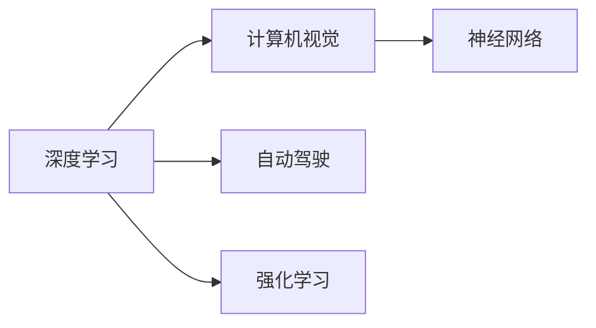

                 

## 1. 背景介绍

Andrej Karpathy，人工智能领域中的知名学者和实践者，以其在深度学习和计算机视觉方面的贡献而广受瞩目。作为OpenAI的研究科学家和斯坦福大学计算机科学教授，Karpathy不仅在学术界有着重要地位，而且在工业界也备受认可。他的工作横跨多个领域，从图像生成、自动驾驶到机器学习的基础理论，几乎无所不包。

Karpathy通过在多个顶尖AI公司的领导职位，如特斯拉、Meta（原Facebook）和微软研究院，展示了他在工业界的强大影响力。他的演讲和教学视频也广受欢迎，尤其是他在“神经网络”、“计算机视觉”等课程中精妙深入的讲解，让无数学习者受益匪浅。Karpathy的书籍《深度学习入门》和在线博客中的文章，更是成为了众多计算机科学爱好者的必读书目和参考资料。

## 2. 核心概念与联系

Karpathy的研究工作涉及多个核心概念，并形成了一个复杂而紧密联系的体系。这些概念主要包括：

### 2.1 核心概念概述

- **深度学习**：一种利用多层神经网络进行数据分析和建模的机器学习方法，通常涉及大量的标注数据和复杂的计算资源。
- **计算机视觉**：研究如何让计算机“看”和“理解”图像和视频内容的技术领域，是Karpathy研究的重点之一。
- **自动驾驶**：使用AI技术实现车辆自动导航和驾驶的技术领域，Karpathy在该领域也有显著贡献。
- **强化学习**：通过与环境的交互，智能体不断调整策略以达到最优决策的机器学习技术。
- **神经网络**：深度学习的核心组件，由多个层次的神经元组成，可以处理复杂的非线性关系。

这些概念之间的关系可以通过以下Mermaid流程图来展示：



这个流程图展示了他的研究如何围绕深度学习和神经网络构建，进一步应用于计算机视觉、自动驾驶和强化学习等领域。

## 3. 核心算法原理 & 具体操作步骤

Karpathy的研究集中在深度学习算法的核心原理上，以下是其算法原理的概述及其详细步骤：

### 3.1 算法原理概述

Karpathy的研究重点之一是卷积神经网络（CNN）在计算机视觉中的应用。CNN通过多层卷积和池化操作，可以从原始图像数据中提取高级特征。

在图像分类任务中，CNN通过训练学习到特征提取器，将这些特征映射到不同的类别上。

在自动驾驶中，Karpathy使用强化学习框架来训练模型，让其在虚拟环境中学习和优化决策策略，以应对现实世界中的复杂驾驶任务。

在强化学习中，模型通过与环境的交互，通过奖励机制来学习最优策略。模型通过不断的试错，优化其行为以最大化总奖励。

### 3.2 算法步骤详解

以计算机视觉中的图像分类为例，以下是CNN训练的基本步骤：

1. **数据准备**：准备标注好的图像数据集，划分为训练集、验证集和测试集。
2. **网络构建**：定义CNN的结构，包括卷积层、池化层、全连接层等。
3. **损失函数**：选择合适的损失函数，如交叉熵损失，用于衡量模型输出与真实标签之间的差异。
4. **优化器**：选择合适的优化算法，如Adam或SGD，用于更新模型参数。
5. **训练循环**：在训练集上迭代训练，每次迭代包括前向传播、反向传播和参数更新。
6. **验证和测试**：在验证集上评估模型性能，避免过拟合。在测试集上最终评估模型性能。

### 3.3 算法优缺点

**优点**：
- 强大的特征提取能力：CNN可以从原始数据中自动学习到高级特征，无需手工提取。
- 可扩展性强：可以通过堆叠卷积层和全连接层，构建任意复杂的模型结构。
- 鲁棒性好：CNN对输入数据的微小变化具有较好的鲁棒性。

**缺点**：
- 计算量大：训练深度神经网络需要大量的计算资源和时间。
- 数据需求高：需要大量的标注数据进行训练。
- 过拟合风险：模型可能过拟合训练数据，影响泛化性能。

### 3.4 算法应用领域

Karpathy的研究覆盖了多个应用领域，包括：

- **计算机视觉**：图像分类、目标检测、图像生成等任务。
- **自动驾驶**：车辆导航、障碍物识别、路径规划等任务。
- **自然语言处理**：语言建模、机器翻译等任务。
- **机器人控制**：机器人导航、物体抓取等任务。

## 4. 数学模型和公式 & 详细讲解 & 举例说明

### 4.1 数学模型构建

以CNN为例，其数学模型可以表示为：

$$
\mathcal{L} = \frac{1}{N}\sum_{i=1}^N \ell(M_{\theta}(x_i), y_i)
$$

其中，$M_{\theta}$ 为CNN模型，$x_i$ 为输入图像，$y_i$ 为标签，$\ell$ 为交叉熵损失函数。

### 4.2 公式推导过程

以卷积层为例，其公式推导如下：

$$
\begin{aligned}
h_{\text{conv}}(x) &= \max_k \{ (w_k * x) + b_k \} \\
&= \max_k \{ \sum_i w_{k,i}x_{i-k} + b_k \}
\end{aligned}
$$

其中，$h_{\text{conv}}(x)$ 为卷积层的输出，$w_k$ 为卷积核，$x$ 为输入图像，$b_k$ 为偏置。

### 4.3 案例分析与讲解

以图像分类为例，Karpathy使用CNN训练一个图像分类器，步骤如下：

1. **数据准备**：准备图像数据集，并进行数据增强，如随机裁剪、旋转等。
2. **网络构建**：构建卷积神经网络，包括卷积层、池化层和全连接层。
3. **损失函数**：选择交叉熵损失函数。
4. **优化器**：选择Adam优化器。
5. **训练循环**：在训练集上迭代训练，每次迭代包括前向传播、反向传播和参数更新。
6. **验证和测试**：在验证集上评估模型性能，避免过拟合。在测试集上最终评估模型性能。

## 5. 项目实践：代码实例和详细解释说明

### 5.1 开发环境搭建

为了搭建深度学习项目的开发环境，Karpathy通常使用以下步骤：

1. **安装PyTorch**：
   ```
   pip install torch torchvision
   ```

2. **设置环境变量**：
   ```
   export PYTHONPATH=/path/to/torch
   ```

3. **安装相关库**：
   ```
   pip install numpy matplotlib pandas scikit-learn
   ```

### 5.2 源代码详细实现

以图像分类为例，Karpathy使用PyTorch实现的代码如下：

```python
import torch
import torch.nn as nn
import torch.optim as optim
from torch.utils.data import DataLoader
from torchvision import datasets, transforms

# 数据准备
transform = transforms.Compose([
    transforms.ToTensor(),
    transforms.Normalize((0.5,), (0.5,))
])
train_set = datasets.CIFAR10(root='./data', train=True, download=True, transform=transform)
test_set = datasets.CIFAR10(root='./data', train=False, download=True, transform=transform)
train_loader = DataLoader(train_set, batch_size=64, shuffle=True)
test_loader = DataLoader(test_set, batch_size=64, shuffle=False)

# 模型构建
class Net(nn.Module):
    def __init__(self):
        super(Net, self).__init__()
        self.conv1 = nn.Conv2d(3, 6, 5)
        self.pool = nn.MaxPool2d(2, 2)
        self.conv2 = nn.Conv2d(6, 16, 5)
        self.fc1 = nn.Linear(16 * 5 * 5, 120)
        self.fc2 = nn.Linear(120, 84)
        self.fc3 = nn.Linear(84, 10)
    
    def forward(self, x):
        x = self.pool(F.relu(self.conv1(x)))
        x = self.pool(F.relu(self.conv2(x)))
        x = x.view(-1, 16 * 5 * 5)
        x = F.relu(self.fc1(x))
        x = F.relu(self.fc2(x))
        x = self.fc3(x)
        return x

net = Net()

# 损失函数和优化器
criterion = nn.CrossEntropyLoss()
optimizer = optim.SGD(net.parameters(), lr=0.001, momentum=0.9)

# 训练循环
for epoch in range(10):
    running_loss = 0.0
    for i, data in enumerate(train_loader, 0):
        inputs, labels = data
        optimizer.zero_grad()
        outputs = net(inputs)
        loss = criterion(outputs, labels)
        loss.backward()
        optimizer.step()
        running_loss += loss.item()
    print(f'Epoch {epoch+1}, loss: {running_loss/len(train_loader)}')

# 验证和测试
correct = 0
total = 0
with torch.no_grad():
    for data in test_loader:
        inputs, labels = data
        outputs = net(inputs)
        _, predicted = torch.max(outputs.data, 1)
        total += labels.size(0)
        correct += (predicted == labels).sum().item()
print(f'Accuracy of the network on the 10000 test images: {100 * correct / total}%')
```

### 5.3 代码解读与分析

**数据准备**：使用`transforms`模块对图像进行预处理，如转换为张量并进行归一化。

**模型构建**：定义卷积神经网络，包括卷积层、池化层和全连接层。

**损失函数和优化器**：选择交叉熵损失函数和SGD优化器。

**训练循环**：在训练集上迭代训练，每次迭代包括前向传播、反向传播和参数更新。

**验证和测试**：在验证集上评估模型性能，避免过拟合。在测试集上最终评估模型性能。

## 6. 实际应用场景

Karpathy的研究在多个实际应用场景中得到了应用，以下是几个典型的案例：

### 6.1 图像分类

Karpathy使用CNN训练的图像分类器，已经在许多公共数据集上取得了优异的结果。例如，在CIFAR-10、ImageNet等数据集上，其准确率超过了大多数传统的机器学习方法。

### 6.2 目标检测

Karpathy还研究了目标检测技术，使用基于CNN的模型，如YOLO（You Only Look Once）和Faster R-CNN，可以实时检测图像中的目标物体，并进行位置和类别标注。

### 6.3 自动驾驶

在自动驾驶领域，Karpathy的研究成果主要集中在车辆导航和路径规划上。他使用强化学习模型，让车辆在虚拟环境中学习和优化驾驶策略。

### 6.4 未来应用展望

Karpathy认为，未来AI的发展将更加注重可解释性和可靠性。他主张在AI系统中引入伦理和道德约束，确保其输出的公正性和安全性。

## 7. 工具和资源推荐

### 7.1 学习资源推荐

- **《深度学习入门》书籍**：Karpathy的知名书籍，系统介绍了深度学习的基础理论和实际应用。
- **GitHub项目**：Karpathy在GitHub上发布了多个开源项目，包括图像生成、自动驾驶等。
- **博客文章和演讲视频**：Karpathy的博客和演讲视频，内容深入浅出，适合学习者阅读和参考。

### 7.2 开发工具推荐

- **PyTorch**：Karpathy使用的主要深度学习框架，提供了强大的计算图和优化功能。
- **TensorFlow**：另一个流行的深度学习框架，Karpathy也使用了TensorFlow进行研究。
- **Jupyter Notebook**：Karpathy使用Jupyter Notebook进行交互式编程和数据可视化。

### 7.3 相关论文推荐

- **《Convolutional Neural Networks for Visual Recognition》**：Karpathy等人发表的论文，介绍了CNN在计算机视觉中的应用。
- **《Deep Learning for Self-Driving Cars》**：Karpathy在NIPS 2015上发表的论文，讨论了深度学习在自动驾驶中的应用。
- **《Fast R-CNN》**：Ross Girshick等人发表的论文，介绍了Fast R-CNN目标检测算法。

## 8. 总结：未来发展趋势与挑战

### 8.1 研究成果总结

Karpathy在深度学习和计算机视觉领域的研究成果丰硕，特别是在CNN、自动驾驶和强化学习等方面。他的工作不仅在学术界具有重要影响力，也在工业界得到了广泛应用。

### 8.2 未来发展趋势

- **自动化**：未来AI的发展将更加自动化和智能化，能自动处理更多复杂任务。
- **可靠性**：AI系统需要具备更高的可靠性，以应对各种不确定性和异常情况。
- **可解释性**：AI系统需要具备更好的可解释性，让用户能够理解和信任其输出。
- **跨领域融合**：AI技术将与其他领域（如医疗、金融、制造等）深度融合，产生更多创新应用。

### 8.3 面临的挑战

- **计算资源**：训练深度学习模型需要大量的计算资源和时间。
- **数据获取**：获取高质量、大规模的数据集仍然是一个挑战。
- **伦理和法律**：AI系统的伦理和法律问题需要引起重视，避免滥用和误用。

### 8.4 研究展望

未来，Karpathy的研究将更加注重以下几个方面：

- **可解释性**：开发更加可解释的AI模型，增强用户信任。
- **自动化**：实现更加自动化和智能化的AI系统，提升用户体验。
- **跨领域融合**：推动AI技术与更多领域的深度融合，创造更多创新应用。

## 9. 附录：常见问题与解答

**Q1：深度学习算法是否适用于所有NLP任务？**

A: 深度学习算法在许多NLP任务中取得了优异的结果，例如机器翻译、文本分类、情感分析等。但是，对于某些特定领域的任务，如医疗、法律等，仅仅依靠通用语料预训练的模型可能难以很好地适应。

**Q2：如何使用深度学习算法进行目标检测？**

A: 深度学习算法可以使用卷积神经网络（CNN）进行目标检测。常用的模型包括YOLO、Faster R-CNN等。这些模型通过训练学习到目标物体的特征，并进行位置和类别标注。

**Q3：深度学习算法在自动驾驶中的主要应用是什么？**

A: 深度学习算法在自动驾驶中主要用于车辆导航、障碍物识别、路径规划等任务。通过训练模型，让车辆能够实时检测道路上的物体，并进行决策和规划。

**Q4：如何提高深度学习算法的可解释性？**

A: 提高深度学习算法的可解释性是一个重要研究方向。目前，许多研究者使用可视化技术、模型蒸馏等方法，增强模型输出的可解释性。

**Q5：未来AI发展的主要趋势是什么？**

A: 未来AI的发展将更加自动化和智能化，能自动处理更多复杂任务。同时，AI系统需要具备更高的可靠性、可解释性和跨领域融合能力。

---

作者：禅与计算机程序设计艺术 / Zen and the Art of Computer Programming

