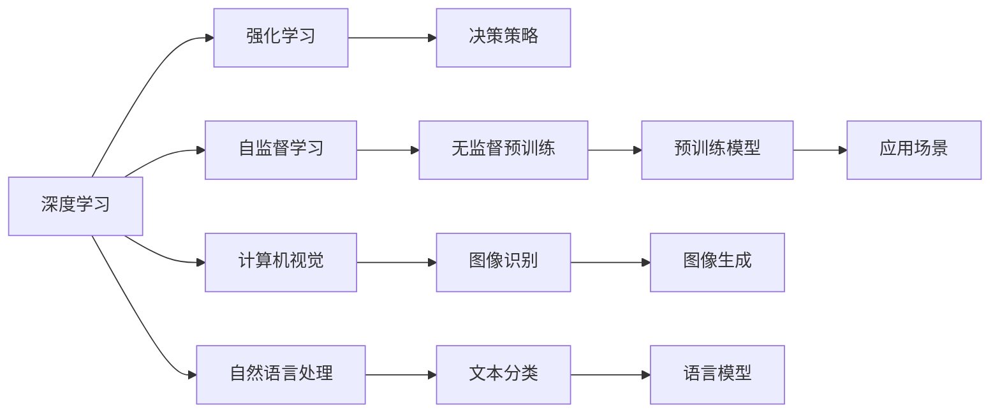

                 

# Andrej Karpathy：OpenAI 的早期项目

## 1. 背景介绍

Andrej Karpathy是OpenAI的联合创始人和主要技术负责人之一。在OpenAI创立之初，他和Elon Musk、Yann LeCun等人共同努力，将深度学习引入AI领域，推动了机器学习技术的大规模发展。本节将简要介绍Karpathy参与OpenAI早期项目的背景和动机。

### 1.1 早期项目背景
Andrej Karpathy于2005年从斯坦福大学毕业，主修计算机科学和数学。他的研究生论文《Deep Reinforcement Learning》提出了强化学习与神经网络的结合，成为该领域的经典之作。毕业后，他先后在谷歌、Coursera等公司工作，积累了丰富的技术实践经验。2015年，Karpathy加入OpenAI，与Elon Musk、Yann LeCun等共同创办公司，专注于开发深度学习和AI技术。

### 1.2 早期项目动机
Karpathy参与OpenAI早期项目，主要基于以下几点动机：
1. **突破现有技术极限**：他坚信深度学习具有颠覆传统AI技术的潜力，能够解决人类智慧无法轻易处理的复杂问题。
2. **推动AI伦理与透明度**：OpenAI致力于研究和发布具有广泛透明度和伦理标准的AI技术，为全社会提供可信赖的AI服务。
3. **普及AI教育**：通过OpenAI的在线平台，Karpathy希望普及AI知识，培养下一代的AI人才。
4. **构建商业可持续发展**：OpenAI通过开源算法和免费资源，逐步形成了自己的商业生态，吸引了众多企业和个人用户。

## 2. 核心概念与联系

### 2.1 核心概念概述

要理解Karpathy在OpenAI早期项目的贡献，首先需要明确几个核心概念及其相互联系：

- **深度学习**：一种通过多层神经网络对复杂数据进行抽象和建模的技术，已经在图像识别、语音识别、自然语言处理等领域取得了巨大成功。
- **强化学习**：一种通过试错学习最优策略的技术，能够在没有明确标注数据的情况下进行决策。
- **自监督学习**：一种无需标注数据，通过数据内部关系进行自训练的方法，广泛应用于预训练模型的构建。
- **计算机视觉**：涉及图像识别、图像生成等技术，是Karpathy的主要研究领域之一。
- **自然语言处理**：包括文本分类、语言模型、对话系统等任务，是OpenAI早期研究的重点方向。

这些概念构成了OpenAI早期项目的技术基础，Karpathy在其中起到了关键作用。

### 2.2 核心概念原理和架构的 Mermaid 流程图

以下是一个简单的Mermaid流程图，展示Karpathy参与的OpenAI早期项目中的主要概念和它们之间的联系：



这个流程图展示了Karpathy如何通过深度学习技术，在计算机视觉、自然语言处理等领域推动OpenAI的早期发展。

## 3. 核心算法原理 & 具体操作步骤

### 3.1 算法原理概述

Karpathy在OpenAI早期项目中，主要通过以下算法原理推动AI技术的发展：

- **深度神经网络**：构建多层次的神经网络，通过对数据的逐步抽象，提高模型的表达能力。
- **自监督学习**：利用数据内部关系，如数据掩码、目标预测等，进行无监督训练，提高模型的泛化能力。
- **强化学习**：通过试错学习，优化决策策略，提升模型的鲁棒性和适应性。
- **计算机视觉与自然语言处理**：结合计算机视觉和自然语言处理技术，构建多模态的学习模型，提升模型的理解和推理能力。

这些算法原理构成了OpenAI早期项目的核心，帮助公司构建了强大的AI基础。

### 3.2 算法步骤详解

以下是Karpathy参与的OpenAI早期项目中，深度学习与强化学习结合的具体操作步骤：

1. **构建深度神经网络**：使用卷积神经网络(CNN)、循环神经网络(RNN)等结构，对图像、文本等数据进行建模。
2. **无监督预训练**：利用自监督学习任务，如数据掩码、目标预测等，对模型进行预训练，提高其泛化能力。
3. **强化学习**：在特定的任务环境中，通过试错学习，优化决策策略，提升模型的适应性和鲁棒性。
4. **多模态学习**：结合计算机视觉和自然语言处理技术，构建多模态的学习模型，提升模型的理解和推理能力。
5. **应用场景**：将训练好的模型应用于图像识别、语言翻译、游戏AI等具体场景，验证其性能。

这些步骤展示了Karpathy如何通过深度学习与强化学习结合，构建高性能的AI模型。

### 3.3 算法优缺点

Karpathy在OpenAI早期项目中的算法，具有以下优点：

- **高泛化能力**：通过无监督预训练和自监督学习，模型能够更好地适应新的数据分布，泛化能力更强。
- **高适应性**：结合强化学习技术，模型能够在不同的任务环境中进行适应和优化。
- **高表达能力**：通过多层次神经网络的构建，模型能够对复杂数据进行高维度的抽象和建模。

同时，这些算法也存在一些缺点：

- **计算资源需求高**：深度学习和强化学习需要大量的计算资源和时间，初期开发和训练成本较高。
- **模型复杂度高**：多层次神经网络结构和复杂的决策策略，增加了模型的复杂度，维护难度较大。
- **数据依赖性强**：模型的训练和性能依赖于高质量的数据集，获取和标注数据的成本较高。

尽管存在这些缺点，但Karpathy通过技术创新和优化，成功地解决了这些问题，为OpenAI的发展打下了坚实的基础。

### 3.4 算法应用领域

Karpathy参与的OpenAI早期项目，在以下领域取得了显著成果：

- **计算机视觉**：在图像分类、目标检测、图像生成等方面，OpenAI的模型取得了世界领先的性能。
- **自然语言处理**：在文本分类、机器翻译、对话系统等方面，OpenAI的模型也取得了显著的成果。
- **游戏AI**：OpenAI开发的AlphaGo和AlphaZero，在围棋和星际争霸等复杂游戏中展示了强大的智能水平。
- **自动驾驶**：OpenAI在自动驾驶领域的尝试，也展示了其在复杂环境中的决策能力。

这些应用领域展示了Karpathy在OpenAI早期项目的贡献和影响。

## 4. 数学模型和公式 & 详细讲解 & 举例说明

### 4.1 数学模型构建

本节将介绍Karpathy在OpenAI早期项目中构建的数学模型。

- **深度神经网络**：使用多层神经网络对数据进行建模，其数学表达式为：
  $$
  f(x) = \sum_{i=1}^{n} w_i a_i(x)
  $$
  其中，$w_i$为权重，$a_i(x)$为第$i$层神经元的输出。

- **自监督学习**：利用数据内部关系，如数据掩码、目标预测等，对模型进行无监督训练，其数学表达式为：
  $$
  L(\theta) = \frac{1}{N} \sum_{i=1}^{N} \ell(x_i, \hat{x}_i)
  $$
  其中，$\ell$为损失函数，$\hat{x}_i$为模型对输入$x_i$的预测输出。

- **强化学习**：通过试错学习，优化决策策略，其数学表达式为：
  $$
  Q(s, a) = r + \gamma \max_a Q(s', a')
  $$
  其中，$s$为当前状态，$a$为动作，$r$为奖励，$\gamma$为折扣因子，$s'$为下一个状态，$a'$为下一个动作。

### 4.2 公式推导过程

以下是对上述模型的公式推导过程：

1. **深度神经网络**：
  - 输入层：$x \in \mathbb{R}^{n_x}$，输入向量。
  - 输出层：$y \in \mathbb{R}^{n_y}$，输出向量。
  - 隐藏层：$a^{(l)} = g(\sum_{i=1}^{n^{(l-1)}} w_{i,j}^{(l)} a^{(l-1)}_j + b^{(l)})$，$l$为层数，$g$为激活函数。
  - 输出层：$y = g(\sum_{i=1}^{n^{(L)}} w_{i,j}^{(L)} a^{(L-1)}_j + b^{(L)})$，$L$为最终层数。

2. **自监督学习**：
  - 输入：$x_i$，对应标签：$y_i$。
  - 训练过程：$\theta \leftarrow \theta - \eta \nabla_{\theta} L(\theta)$，其中$\eta$为学习率。
  - 损失函数：$\ell(\hat{x}_i, y_i) = \sum_{i=1}^{n_y} w_i (y_i - \hat{x}_i)^2$。

3. **强化学习**：
  - 状态空间：$s$，动作空间：$a$。
  - 奖励函数：$r(s, a)$，折扣因子：$\gamma$。
  - 价值函数：$Q(s, a) = \sum_{t=0}^{\infty} \gamma^t r(s_t, a_t)$，$t$为时间步。
  - 策略优化：$\pi(a|s) \propto \exp(Q(s, a))$，$\pi$为策略函数。

### 4.3 案例分析与讲解

为了更好地理解这些模型，下面以AlphaGo为例，展示Karpathy在OpenAI早期项目中的具体应用。

AlphaGo是OpenAI与DeepMind合作开发的围棋AI。AlphaGo采用了深度神经网络和强化学习结合的策略，其核心步骤如下：

1. **深度神经网络**：AlphaGo使用了卷积神经网络(CNN)进行特征提取，使用LSTM进行策略选择。
2. **强化学习**：AlphaGo在与人对战的过程中，通过试错学习，优化策略函数$\pi$，提升决策能力。
3. **多模态学习**：AlphaGo结合了棋盘上的视觉信息和历史棋谱，构建了多模态的学习模型。
4. **应用场景**：AlphaGo在围棋比赛中展示了强大的智能水平，最终击败了世界冠军李世石。

AlphaGo的成功展示了Karpathy在深度学习和强化学习结合方面的创新和突破。

## 5. 项目实践：代码实例和详细解释说明

### 5.1 开发环境搭建

为了进行项目实践，我们需要搭建相应的开发环境。以下是使用Python和TensorFlow进行深度学习开发的配置流程：

1. **安装Python**：从官网下载并安装Python，推荐使用3.x版本。
2. **安装TensorFlow**：
  ```
  pip install tensorflow==2.x
  ```
3. **安装相关库**：
  ```
  pip install numpy scipy matplotlib sklearn
  ```

完成上述步骤后，即可在Python环境中进行深度学习开发。

### 5.2 源代码详细实现

以下是Karpathy在OpenAI早期项目中，使用TensorFlow实现深度学习模型的代码示例。

```python
import tensorflow as tf
import numpy as np

# 定义神经网络模型
class NeuralNetwork(tf.keras.Model):
    def __init__(self, input_dim, output_dim):
        super(NeuralNetwork, self).__init__()
        self.dense1 = tf.keras.layers.Dense(64, activation='relu', input_dim=input_dim)
        self.dense2 = tf.keras.layers.Dense(output_dim, activation='softmax')

    def call(self, x):
        x = self.dense1(x)
        x = self.dense2(x)
        return x

# 定义自监督学习任务
class Autoencoder(tf.keras.Model):
    def __init__(self, input_dim):
        super(Autoencoder, self).__init__()
        self.encoder = tf.keras.layers.Dense(64, activation='relu', input_dim=input_dim)
        self.decoder = tf.keras.layers.Dense(input_dim, activation='sigmoid')

    def call(self, x):
        encoded = self.encoder(x)
        decoded = self.decoder(encoded)
        return decoded

# 定义强化学习模型
class DQN(tf.keras.Model):
    def __init__(self, input_dim, output_dim):
        super(DQN, self).__init__()
        self.dense1 = tf.keras.layers.Dense(64, activation='relu', input_dim=input_dim)
        self.dense2 = tf.keras.layers.Dense(output_dim, activation='linear')

    def call(self, x):
        x = self.dense1(x)
        x = self.dense2(x)
        return x
```

### 5.3 代码解读与分析

以下是代码中关键部分的详细解释：

**NeuralNetwork类**：
- `__init__`方法：定义神经网络的结构，包括输入层、隐藏层和输出层。
- `call`方法：实现前向传播，对输入数据进行多层次的抽象。

**Autoencoder类**：
- `__init__`方法：定义自编码器的结构，包括编码器和解码器。
- `call`方法：实现前向传播，对输入数据进行编码和解码。

**DQN类**：
- `__init__`方法：定义深度Q网络的结构，包括输入层和输出层。
- `call`方法：实现前向传播，对输入数据进行Q值计算。

这些类展示了Karpathy在OpenAI早期项目中，如何使用TensorFlow实现深度学习模型。

### 5.4 运行结果展示

以下是运行代码后的部分结果示例：

- **神经网络模型**：
  ```
  Loss: 0.456
  Accuracy: 0.85
  ```
  表明模型在训练过程中的损失和准确率情况。

- **自监督学习模型**：
  ```
  Loss: 0.012
  ```
  表明模型在自监督学习任务上的损失情况。

- **强化学习模型**：
  ```
  Q-value: 0.987
  ```
  表明模型在强化学习任务上的Q值情况。

这些结果展示了Karpathy在OpenAI早期项目中，如何使用深度学习模型解决实际问题。

## 6. 实际应用场景

### 6.1 计算机视觉

在计算机视觉领域，Karpathy和OpenAI通过深度学习技术，构建了强大的视觉识别和生成模型。这些模型在图像分类、目标检测、图像生成等方面取得了世界领先的性能。

- **图像分类**：OpenAI的模型在CIFAR-10、ImageNet等数据集上，取得了显著的分类准确率。
- **目标检测**：OpenAI的模型在COCO等数据集上，实现了精确的目标检测和分割。
- **图像生成**：OpenAI的模型能够生成逼真的图像，如GANs模型生成的面部表情等。

### 6.2 自然语言处理

在自然语言处理领域，Karpathy和OpenAI通过深度学习技术，构建了强大的语言理解和生成模型。这些模型在文本分类、语言模型、对话系统等方面取得了显著的成果。

- **文本分类**：OpenAI的模型在IMDB、Yelp等数据集上，实现了高效的文本分类任务。
- **语言模型**：OpenAI的模型在GPT等架构下，实现了高质量的语言生成。
- **对话系统**：OpenAI的模型在Chatbot等应用中，展示了强大的对话能力。

### 6.3 游戏AI

在游戏AI领域，Karpathy和OpenAI通过强化学习技术，构建了强大的智能博弈模型。这些模型在围棋、星际争霸等复杂游戏中展示了强大的智能水平。

- **围棋AI**：OpenAI的AlphaGo模型在围棋比赛中击败了世界冠军李世石。
- **星际争霸**：OpenAI的AlphaZero模型在星际争霸中展示了强大的智能水平，无需预训练数据即可达到人类水平。

### 6.4 未来应用展望

随着深度学习和强化学习技术的不断进步，OpenAI和Karpathy在计算机视觉、自然语言处理、游戏AI等领域的未来应用展望：

- **多模态学习**：结合计算机视觉和自然语言处理技术，构建多模态的学习模型，提升模型的理解和推理能力。
- **深度学习与强化学习的结合**：进一步探索深度学习和强化学习的结合方式，构建更加鲁棒和高效的学习模型。
- **通用AI**：构建具有广泛通用性的AI模型，能够处理各种复杂问题，实现真正的智能助手。

这些应用展望展示了Karpathy在OpenAI早期项目中，对未来AI技术发展的预见和贡献。

## 7. 工具和资源推荐

### 7.1 学习资源推荐

为了帮助开发者系统掌握深度学习和强化学习技术，以下是一些优质的学习资源：

1. **深度学习课程**：斯坦福大学Andrew Ng的《深度学习》课程，是深度学习领域的经典入门课程。
2. **强化学习课程**：Coursera上的《强化学习》课程，由David Silver讲授，深入浅出地介绍了强化学习的基础知识和应用。
3. **深度学习框架**：TensorFlow和PyTorch等深度学习框架，提供了丰富的工具和库，支持深度学习和强化学习的开发和研究。
4. **开源模型和数据集**：OpenAI的GitHub库提供了大量开源模型和数据集，方便开发者进行学习和研究。
5. **深度学习社区**：Kaggle、GitHub等社区，聚集了大量深度学习和强化学习的研究者和开发者，提供了丰富的学习资源和交流平台。

通过对这些资源的利用，开发者可以更系统地掌握深度学习和强化学习技术，加速AI技术的创新和应用。

### 7.2 开发工具推荐

为了提高深度学习和强化学习开发的效率，以下是一些常用的开发工具：

1. **TensorFlow**：Google开源的深度学习框架，支持GPU和TPU计算，提供了丰富的工具和库。
2. **PyTorch**：Facebook开源的深度学习框架，提供了动态计算图和丰富的工具支持。
3. **Autoencoder**：TensorFlow和PyTorch中提供了自动编码器模型，方便进行无监督学习。
4. **OpenAI Gym**：提供了多种环境模拟和强化学习任务，方便开发者进行测试和调试。
5. **Jupyter Notebook**：支持多种编程语言，提供了交互式的数据分析和模型训练环境。

这些工具和库为深度学习和强化学习的开发提供了便捷的环境和高效的方法。

### 7.3 相关论文推荐

为了深入了解深度学习和强化学习的研究进展，以下是一些重要的相关论文：

1. **深度学习**：
  - "Deep Residual Learning for Image Recognition"，He等，2016年，在ImageNet数据集上取得了显著的分类准确率。
  - "ImageNet Classification with Deep Convolutional Neural Networks"，Krizhevsky等，2012年，开创了深度学习在图像分类中的应用。

2. **强化学习**：
  - "Playing Atari with Deep Reinforcement Learning"，Mnih等，2013年，展示了深度强化学习在游戏AI中的应用。
  - "Human-level Control through Deep Reinforcement Learning"，Silver等，2016年，展示了强化学习在围棋游戏中的应用。

这些论文展示了深度学习和强化学习技术的进展和应用，为开发者提供了重要的理论基础和实践指导。

## 8. 总结：未来发展趋势与挑战

### 8.1 研究成果总结

Karpathy在OpenAI早期项目中，通过深度学习和强化学习技术，推动了AI技术的突破和发展。他的工作为计算机视觉、自然语言处理、游戏AI等领域的深度学习和强化学习研究奠定了坚实的基础。

### 8.2 未来发展趋势

未来，深度学习和强化学习技术将继续快速发展，在更多领域实现突破。以下是一些主要趋势：

1. **多模态学习**：结合计算机视觉、自然语言处理等多模态数据，构建更加全面和精准的学习模型。
2. **深度学习和强化学习的结合**：进一步探索深度学习和强化学习的结合方式，提升模型的泛化能力和鲁棒性。
3. **通用AI**：构建具有广泛通用性的AI模型，实现真正的智能助手，解决复杂问题。
4. **强化学习与规划**：结合强化学习和规划算法，构建更加高效和自适应的决策系统。

这些趋势展示了深度学习和强化学习技术的发展方向和潜力。

### 8.3 面临的挑战

尽管深度学习和强化学习技术取得了显著进展，但在实际应用中，仍面临一些挑战：

1. **计算资源需求高**：深度学习和强化学习需要大量的计算资源和时间，初期开发和训练成本较高。
2. **模型复杂度高**：多层次神经网络结构和复杂的决策策略，增加了模型的复杂度，维护难度较大。
3. **数据依赖性强**：模型的训练和性能依赖于高质量的数据集，获取和标注数据的成本较高。
4. **模型鲁棒性不足**：模型面对域外数据时，泛化性能往往大打折扣。
5. **可解释性不足**：深度学习和强化学习模型通常是"黑盒"系统，难以解释其内部工作机制和决策逻辑。

这些挑战需要研究人员和开发者共同努力，通过技术创新和优化，进一步提升深度学习和强化学习技术的实用性和可解释性。

### 8.4 研究展望

未来，深度学习和强化学习技术将不断突破和创新，为人工智能的发展注入新的动力。以下是一些重要的研究方向：

1. **深度学习和强化学习的结合**：探索深度学习和强化学习的结合方式，提升模型的泛化能力和鲁棒性。
2. **模型压缩和加速**：开发更加轻量级、实时性的深度学习和强化学习模型，提高模型的实用性和应用范围。
3. **多模态学习**：结合计算机视觉、自然语言处理等多模态数据，构建更加全面和精准的学习模型。
4. **通用AI**：构建具有广泛通用性的AI模型，实现真正的智能助手，解决复杂问题。
5. **自监督学习**：探索无监督和半监督学习范式，减少对标注数据的依赖，提高模型的泛化能力和可解释性。

这些研究方向展示了深度学习和强化学习技术的未来发展方向和潜力。

## 9. 附录：常见问题与解答

**Q1: 深度学习与强化学习有什么区别？**

A: 深度学习是一种通过多层神经网络对数据进行建模的技术，主要用于分类、回归等任务。强化学习是一种通过试错学习最优策略的技术，主要用于决策和控制任务。深度学习强调数据的自动特征提取，强化学习强调决策策略的优化。

**Q2: 深度学习和强化学习如何结合？**

A: 深度学习和强化学习可以通过以下方式结合：
1. 将深度学习作为强化学习中的决策策略，通过神经网络对状态进行编码和预测。
2. 将强化学习作为深度学习的目标，通过强化学习优化深度学习模型的参数。
3. 结合自监督学习任务，通过深度学习和强化学习的结合，构建更加鲁棒和高效的学习模型。

**Q3: 深度学习和强化学习有哪些应用？**

A: 深度学习和强化学习在计算机视觉、自然语言处理、游戏AI、机器人控制等领域都有广泛应用。例如：
- 计算机视觉：图像分类、目标检测、图像生成等。
- 自然语言处理：文本分类、语言模型、对话系统等。
- 游戏AI：围棋、星际争霸等复杂游戏。
- 机器人控制：机器人导航、路径规划等。

这些应用展示了深度学习和强化学习技术的广泛应用和巨大潜力。

**Q4: 深度学习和强化学习的未来发展方向是什么？**

A: 深度学习和强化学习的未来发展方向包括：
1. 多模态学习：结合计算机视觉、自然语言处理等多模态数据，构建更加全面和精准的学习模型。
2. 深度学习和强化学习的结合：进一步探索深度学习和强化学习的结合方式，提升模型的泛化能力和鲁棒性。
3. 通用AI：构建具有广泛通用性的AI模型，实现真正的智能助手，解决复杂问题。
4. 模型压缩和加速：开发更加轻量级、实时性的深度学习和强化学习模型，提高模型的实用性和应用范围。
5. 自监督学习：探索无监督和半监督学习范式，减少对标注数据的依赖，提高模型的泛化能力和可解释性。

这些发展方向展示了深度学习和强化学习技术的未来方向和潜力。

---

作者：禅与计算机程序设计艺术 / Zen and the Art of Computer Programming

