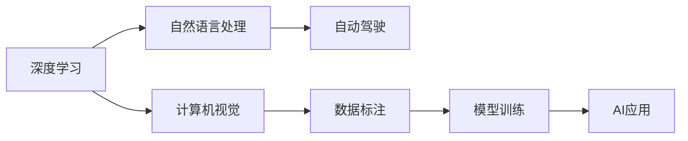
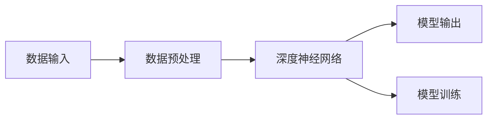

                 

# Andrej Karpathy：人工智能的未来发展前景

## 1. 背景介绍

### 1.1 问题由来
Andrej Karpathy，斯坦福大学教授、人工智能界知名专家，曾作为特斯拉AI部门的首席AI科学家，在自动驾驶、计算机视觉等领域贡献卓越。他的著作《Neural Networks and Deep Learning》、《Deep Learning for Computer Vision with PyTorch》等，深入浅出地介绍了深度学习的核心概念和实践技巧，影响广泛。

当前，人工智能正处于快速发展的黄金阶段。计算机视觉、自然语言处理、自动驾驶等诸多领域取得了显著进展，对我们的生活产生了深远影响。然而，人工智能的未来发展面临诸多挑战，如何更高效、更安全、更可解释地应用AI技术，成为学界和工业界关注的焦点。

本文将结合Andrej Karpathy的研究和观点，探讨人工智能的未来发展前景，并对AI技术在各行各业的应用趋势进行展望。

### 1.2 问题核心关键点
Andrej Karpathy在多个场合讨论了人工智能的未来发展，认为以下几点是AI技术当前和未来的核心关键点：
1. 数据质量和标注成本：高精度的AI模型依赖大量的高质量标注数据，这在很多领域是一个难以解决的问题。
2. 模型复杂度和可解释性：越复杂的模型往往越难解释，这影响了很多行业的应用部署。
3. 跨领域知识和理解：AI模型能否具备跨领域、跨模态的知识整合能力，是其能否成功应用的关键。
4. 人机协作与伦理道德：AI系统的可控性和道德性，是其能否真正融入人类社会的核心问题。

本文将重点围绕这些关键点，展开对Andrej Karpathy观点的深入探讨，并对未来AI技术的发展前景进行展望。

## 2. 核心概念与联系

### 2.1 核心概念概述

Andrej Karpathy的观点主要围绕以下几个核心概念展开：

- **深度学习**：一种基于神经网络的机器学习方法，通过多层神经元的学习，提取数据中的高级特征。
- **计算机视觉**：利用AI技术对图像、视频等视觉数据进行分析和理解。
- **自然语言处理**：使用AI技术处理和理解人类语言，包括文本生成、语义理解等。
- **自动驾驶**：结合计算机视觉和自然语言处理，使车辆实现自主驾驶。
- **数据标注**：标注大量数据，用于训练AI模型，是高质量AI模型的基础。

这些概念之间的逻辑关系可以通过以下Mermaid流程图来展示：



这个流程图展示了深度学习在多个AI应用领域的应用路径。数据标注作为模型训练的基础，计算机视觉和自然语言处理作为关键技术，最终通过自动驾驶等应用体现其价值。

### 2.2 核心概念原理和架构的 Mermaid 流程图
以下是Andrej Karpathy讨论的深度学习架构的Mermaid流程图：



在上述流程图中，数据输入经过预处理后，输入到深度神经网络中进行特征提取和推理，最终输出模型结果。在模型训练阶段，通过反向传播算法更新网络参数，以最小化预测与真实标签之间的误差。

## 3. 核心算法原理 & 具体操作步骤

### 3.1 算法原理概述

Andrej Karpathy在深度学习领域进行了大量的研究，以下是他对深度学习算法原理的概述：

深度学习算法的主要目标是通过多层神经网络的层次化结构，自动学习数据中的复杂模式和结构。典型的深度神经网络包括卷积神经网络(CNN)、循环神经网络(RNN)、长短时记忆网络(LSTM)等。

以CNN为例，其核心思想是通过多层卷积操作提取局部特征，再通过池化操作降低特征维度，最终进行全连接层的分类或回归。在训练过程中，通过反向传播算法更新网络参数，最小化损失函数，提升模型性能。

### 3.2 算法步骤详解

Andrej Karpathy详细讲解了深度学习模型的训练步骤，包括以下关键步骤：

1. **数据准备**：收集和标注训练数据，划分为训练集、验证集和测试集。
2. **模型定义**：选择合适的神经网络架构和超参数。
3. **模型训练**：通过反向传播算法，最小化损失函数，更新网络参数。
4. **模型评估**：在测试集上评估模型性能，选择最优模型。
5. **模型应用**：将模型应用于实际问题，进行推理或预测。

在模型训练过程中，Andrej Karpathy强调了以下几个关键点：

- **正则化**：通过L2正则、Dropout等技术，避免过拟合。
- **学习率调度**：使用学习率衰减、warmup等策略，加快模型收敛。
- **优化器选择**：选择合适的优化器，如Adam、SGD等。
- **数据增强**：通过回译、旋转、裁剪等方式，扩充训练集。

### 3.3 算法优缺点

Andrej Karpathy对深度学习算法的优缺点进行了详细分析：

- **优点**：
  - 可解释性：通过可视化工具，可以理解神经网络的特征提取过程。
  - 泛化能力强：在大规模数据集上训练的模型，往往具备良好的泛化性能。
  - 可迁移性：在特定领域进行微调，可以得到较优的性能提升。
- **缺点**：
  - 过拟合风险：模型复杂度高时，容易出现过拟合。
  - 训练成本高：需要大量标注数据和高性能计算资源。
  - 黑盒问题：神经网络的结构复杂，难以理解其内部工作机制。

### 3.4 算法应用领域

Andrej Karpathy讨论了深度学习算法在多个领域的应用，以下是他对主要应用领域的总结：

1. **计算机视觉**：图像分类、目标检测、图像生成、人脸识别等。
2. **自然语言处理**：机器翻译、文本生成、情感分析、问答系统等。
3. **自动驾驶**：车辆定位、行为预测、路径规划、感知系统等。
4. **医疗健康**：影像诊断、基因组学、个性化推荐等。
5. **金融科技**：风险评估、信用评分、客户服务等。

## 4. 数学模型和公式 & 详细讲解 & 举例说明

### 4.1 数学模型构建

Andrej Karpathy介绍了深度学习模型的数学模型构建过程：

一个典型的深度神经网络可以表示为：

$$
y = f(x; \theta)
$$

其中，$x$ 是输入数据，$y$ 是模型输出，$\theta$ 是网络参数。

在训练过程中，通过反向传播算法更新参数 $\theta$，最小化损失函数 $L$：

$$
\theta^* = \mathop{\arg\min}_{\theta} L(y, \hat{y})
$$

其中，$\hat{y}$ 是模型预测输出，$L$ 是损失函数。

### 4.2 公式推导过程

以图像分类任务为例，Andrej Karpathy推导了卷积神经网络的前向传播和反向传播过程。

假设输入图像 $x \in \mathbb{R}^{H \times W \times C}$，卷积核大小为 $k \times k$，步幅为 $s$，激活函数为 $ReLU$，则卷积层的输出 $h$ 可以表示为：

$$
h = \sigma(\sum_{i=1}^{K} \sum_{j=1}^{C} w_{i,j} * x[i \cdot s:i+s-1,j \cdot s:j+s-1] + b_i)
$$

其中，$K$ 是卷积核数量，$w_{i,j}$ 是卷积核参数，$b_i$ 是偏置参数。

在反向传播过程中，计算梯度 $\nabla_{\theta}L$，可以表示为：

$$
\nabla_{\theta}L = \sum_{i=1}^{N}\nabla_{\theta}l(x_i, y_i)
$$

其中，$N$ 是样本数量，$\nabla_{\theta}l$ 是损失函数对参数 $\theta$ 的梯度。

### 4.3 案例分析与讲解

以图像分类任务为例，Andrej Karpathy分析了模型的训练和优化过程。

假设有一个包含 $C$ 类别的分类任务，输入图像 $x$ 大小为 $H \times W$，卷积核大小为 $k \times k$，步幅为 $s$。通过多个卷积层和池化层，得到最终的全连接层输出 $z$。

在训练过程中，使用交叉熵损失函数：

$$
L = -\frac{1}{N} \sum_{i=1}^{N} \sum_{j=1}^{C} y_{i,j} \log(\hat{y}_{i,j})
$$

其中，$y_{i,j}$ 是真实标签，$\hat{y}_{i,j}$ 是模型预测概率。

通过反向传播算法，计算全连接层和卷积层的梯度，更新网络参数。最终，通过正则化技术，如L2正则、Dropout等，防止过拟合，提高模型泛化能力。

## 5. 项目实践：代码实例和详细解释说明

### 5.1 开发环境搭建

Andrej Karpathy推荐使用PyTorch作为深度学习开发框架，以下是搭建PyTorch开发环境的步骤：

1. 安装Anaconda：从官网下载并安装Anaconda，用于创建独立的Python环境。

2. 创建并激活虚拟环境：
```bash
conda create -n pytorch-env python=3.8 
conda activate pytorch-env
```

3. 安装PyTorch：根据CUDA版本，从官网获取对应的安装命令。例如：
```bash
conda install pytorch torchvision torchaudio cudatoolkit=11.1 -c pytorch -c conda-forge
```

4. 安装Tensorboard：
```bash
pip install tensorboard
```

5. 安装NVIDIA GPU驱动：确保NVIDIA GPU驱动程序与PyTorch版本兼容。

### 5.2 源代码详细实现

以下是一个简单的卷积神经网络在PyTorch中的实现，包括数据预处理、模型定义、训练和评估等关键步骤：

```python
import torch
import torch.nn as nn
import torch.optim as optim
import torchvision.transforms as transforms
import torchvision.datasets as datasets

# 数据预处理
transform = transforms.Compose([
    transforms.ToTensor(),
    transforms.Normalize((0.5, 0.5, 0.5), (0.5, 0.5, 0.5))
])

train_dataset = datasets.CIFAR10(root='./data', train=True, download=True, transform=transform)
test_dataset = datasets.CIFAR10(root='./data', train=False, download=True, transform=transform)

# 模型定义
class Net(nn.Module):
    def __init__(self):
        super(Net, self).__init__()
        self.conv1 = nn.Conv2d(3, 6, 5)
        self.pool = nn.MaxPool2d(2, 2)
        self.conv2 = nn.Conv2d(6, 16, 5)
        self.fc1 = nn.Linear(16 * 5 * 5, 120)
        self.fc2 = nn.Linear(120, 84)
        self.fc3 = nn.Linear(84, 10)

    def forward(self, x):
        x = self.pool(F.relu(self.conv1(x)))
        x = self.pool(F.relu(self.conv2(x)))
        x = x.view(-1, 16 * 5 * 5)
        x = F.relu(self.fc1(x))
        x = F.relu(self.fc2(x))
        x = self.fc3(x)
        return x

# 模型训练
net = Net()
criterion = nn.CrossEntropyLoss()
optimizer = optim.SGD(net.parameters(), lr=0.001, momentum=0.9)

for epoch in range(2):
    running_loss = 0.0
    for i, data in enumerate(train_loader, 0):
        inputs, labels = data
        optimizer.zero_grad()
        outputs = net(inputs)
        loss = criterion(outputs, labels)
        loss.backward()
        optimizer.step()
        
    print(f'Epoch {epoch+1}, loss: {running_loss/len(train_loader):.4f}')

# 模型评估
correct = 0
total = 0
with torch.no_grad():
    for data in test_loader:
        images, labels = data
        outputs = net(images)
        _, predicted = torch.max(outputs.data, 1)
        total += labels.size(0)
        correct += (predicted == labels).sum().item()

print(f'Accuracy of the network on the 10000 test images: {100 * correct / total:.2f}%')
```

### 5.3 代码解读与分析

Andrej Karpathy在讲解上述代码时，主要强调了以下几个关键点：

1. **数据预处理**：通过`transforms`模块，将图像数据转换为PyTorch张量，并进行标准化处理，以便于模型训练。
2. **模型定义**：通过`nn.Module`和`nn`模块，定义卷积神经网络的结构。
3. **模型训练**：使用SGD优化器，最小化交叉熵损失函数，更新模型参数。
4. **模型评估**：在测试集上评估模型性能，计算准确率。

## 6. 实际应用场景

### 6.1 计算机视觉

Andrej Karpathy认为，计算机视觉是深度学习最具前景的应用领域之一。以下是几个典型的计算机视觉应用场景：

1. **图像分类**：将图像分为多个类别，如猫、狗、车等。
2. **目标检测**：在图像中定位并标记出目标物体。
3. **图像生成**：使用生成对抗网络(GAN)生成高质量的图像。
4. **人脸识别**：在图像中识别出人脸，并进行验证。

Andrej Karpathy认为，未来的计算机视觉将更注重跨领域知识的整合和迁移，以应对更加复杂和多变的环境。例如，将医学影像与自然语言处理相结合，进行疾病诊断和辅助决策。

### 6.2 自然语言处理

Andrej Karpathy认为，自然语言处理是深度学习另一个重要的应用领域。以下是几个典型的自然语言处理应用场景：

1. **机器翻译**：将一种语言翻译成另一种语言。
2. **文本生成**：自动生成新闻报道、对话文本等。
3. **情感分析**：分析文本中的情感倾向。
4. **问答系统**：回答用户提出的自然语言问题。

Andrej Karpathy认为，自然语言处理的关键在于如何更好地理解和生成语言。未来，将有更多的跨模态学习方法，结合视觉、语音等多模态信息，提升语言模型的性能。

### 6.3 自动驾驶

Andrej Karpathy作为特斯拉的AI首席科学家，对自动驾驶的未来发展有着深刻的见解。他认为，自动驾驶将是深度学习最重要的应用之一。

以下是几个典型的自动驾驶应用场景：

1. **车辆定位**：使用传感器和摄像头定位车辆在地图上的位置。
2. **行为预测**：预测其他车辆的行驶轨迹。
3. **路径规划**：生成最优路径，避开障碍物。
4. **感知系统**：结合计算机视觉和自然语言处理，进行环境感知和决策。

Andrej Karpathy认为，自动驾驶的未来发展在于如何更好地整合多模态信息，提升系统的鲁棒性和安全性。例如，将图像和雷达数据相结合，提升感知系统的准确性和可靠性。

## 7. 工具和资源推荐

### 7.1 学习资源推荐

Andrej Karpathy推荐了多个学习资源，以下是一些关键的推荐：

1. **Neural Networks and Deep Learning**：Andrej Karpathy的书籍，深入浅出地介绍了深度学习的核心概念和实践技巧。
2. **Deep Learning for Computer Vision with PyTorch**：Andrej Karpathy的书籍，介绍了深度学习在计算机视觉中的应用。
3. **CS231n: Convolutional Neural Networks for Visual Recognition**：斯坦福大学的深度学习课程，涵盖计算机视觉的多个方面。
4. **Coursera上的深度学习课程**：多个大学提供的深度学习课程，适合初学者和进阶者。
5. **arXiv**：深度学习领域的预印论文平台，可以获取最新的研究成果。

### 7.2 开发工具推荐

Andrej Karpathy推荐了多个深度学习开发工具，以下是一些关键的推荐：

1. **PyTorch**：深度学习领域的主流框架，支持动态计算图和GPU加速。
2. **TensorFlow**：由Google主导的开源深度学习框架，生产部署方便。
3. **Keras**：基于TensorFlow和Theano的高级API，易于上手。
4. **Jupyter Notebook**：交互式开发环境，方便调试和演示。
5. **Google Colab**：免费的GPU/TPU计算资源，适合快速迭代研究。

### 7.3 相关论文推荐

Andrej Karpathy推荐了多个深度学习领域的经典论文，以下是一些关键的推荐：

1. **ImageNet Classification with Deep Convolutional Neural Networks**：AlexNet论文，引入了卷积神经网络，取得了ImageNet分类任务的优异成绩。
2. **Inception Networks**：Google提出的Inception网络，提升了卷积神经网络的性能。
3. **ResNet: Deep Residual Learning for Image Recognition**：ResNet网络，解决了深度神经网络中的梯度消失问题。
4. **Attention is All You Need**：Transformer网络，提出了自注意力机制，在自然语言处理任务上取得了优异成绩。
5. **BERT: Pre-training of Deep Bidirectional Transformers for Language Understanding**：BERT模型，引入了双向预训练，提升了语言模型的泛化能力。

## 8. 总结：未来发展趋势与挑战

### 8.1 研究成果总结

Andrej Karpathy认为，深度学习在多个领域取得了显著进展，以下是对主要成果的总结：

1. **计算机视觉**：卷积神经网络、ResNet、Inception等网络结构在图像分类、目标检测等任务上取得了优异成绩。
2. **自然语言处理**：Transformer、BERT、GPT等模型在文本分类、生成、翻译等任务上取得了优异成绩。
3. **自动驾驶**：结合计算机视觉和自然语言处理，自动驾驶系统在感知、决策等方面取得了显著进展。

### 8.2 未来发展趋势

Andrej Karpathy对未来AI技术的发展趋势进行了深入分析，以下是对主要趋势的总结：

1. **数据质量和标注成本**：随着数据收集和标注成本的下降，AI模型将能够处理更多的数据，提升性能。
2. **模型复杂度和可解释性**：未来将开发更加高效和可解释的模型，例如，知识图谱、因果推理等方法。
3. **跨领域知识和理解**：AI模型将具备跨领域、跨模态的知识整合能力，进一步提升性能。
4. **人机协作与伦理道德**：AI系统将更注重人机协作和伦理道德，确保其应用的安全性和可控性。

### 8.3 面临的挑战

Andrej Karpathy认为，AI技术在发展过程中面临诸多挑战，以下是对主要挑战的总结：

1. **数据质量和标注成本**：高质量标注数据的需求将长期存在，标注成本较高。
2. **模型复杂度和可解释性**：复杂模型难以解释，影响应用部署。
3. **跨领域知识和理解**：多模态知识的整合仍是一个难题。
4. **人机协作与伦理道德**：AI系统的伦理道德问题亟需解决。

### 8.4 研究展望

Andrej Karpathy对未来AI技术的研究方向进行了展望，以下是对主要方向的总结：

1. **数据增强和迁移学习**：开发更高效的数据增强和迁移学习算法，提升模型性能。
2. **模型压缩和优化**：开发模型压缩和优化技术，提高模型的可部署性和性能。
3. **跨模态学习和知识整合**：结合多模态数据，提升模型的综合能力。
4. **人机协作和伦理道德**：研究AI系统的可控性和道德性，确保其应用的安全性和可控性。

## 9. 附录：常见问题与解答

### Q1: 深度学习模型是否适用于所有领域？

A: 深度学习模型在许多领域展示了强大的潜力，例如计算机视觉、自然语言处理等。但在一些特殊领域，如医学、法律等，需要结合领域知识和规则，才能更好地应用深度学习。

### Q2: 深度学习模型如何进行迁移学习？

A: 迁移学习是指将在大规模数据上预训练的模型，应用于特定领域的微调。通过选择适当的预训练模型和微调策略，可以显著提升模型在特定任务上的性能。

### Q3: 深度学习模型的可解释性问题如何解决？

A: 深度学习模型的可解释性问题仍是一个难题。未来可能需要结合符号化方法和因果推理，提升模型的可解释性。

### Q4: 深度学习模型如何处理大规模数据？

A: 处理大规模数据需要高性能计算资源和优化算法。未来可能需要结合分布式计算和增量学习，提高模型的训练和推理效率。

### Q5: 深度学习模型在自动驾驶中的应用前景如何？

A: 自动驾驶是深度学习的重要应用之一。未来将结合多模态数据，提升感知系统的准确性和可靠性，推动自动驾驶技术的普及。

---

作者：禅与计算机程序设计艺术 / Zen and the Art of Computer Programming

