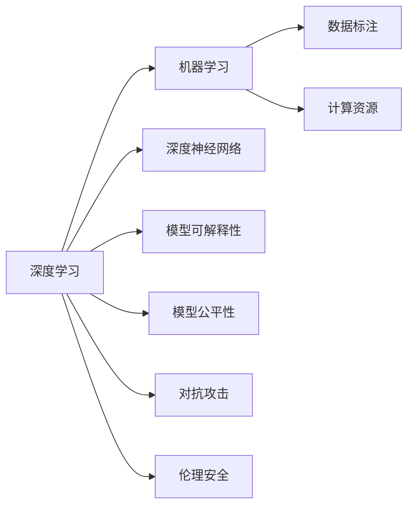

                 

# Andrej Karpathy：人工智能的未来发展挑战

> 关键词：人工智能,未来发展,挑战,Andrej Karpathy,深度学习,机器学习,深度神经网络

## 1. 背景介绍

Andrej Karpathy，作为人工智能领域的翘楚，其对AI未来发展的见解具有很高的参考价值。在深度学习领域，他不仅有多项开创性贡献，还通过Twitter等社交媒体平台不断分享最新进展，激发了社区的广泛讨论。本文将系统梳理Karpathy对人工智能未来发展的观点，从多个角度深入分析其所面临的挑战与机遇。

### 1.1 问题由来

人工智能已经进入快速发展阶段，特别是在深度学习、计算机视觉、自然语言处理等领域的突破，使得AI在医疗、金融、交通、教育等多个行业有了初步应用。然而，面对这些挑战与瓶颈，AI未来的发展道路仍充满不确定性。Karpathy结合自身研究与经验，提出了几个关键的未来发展挑战。

### 1.2 问题核心关键点

人工智能的未来发展挑战包括：
1. **数据质量与获取**：AI模型的训练依赖于大量高质量标注数据，如何获取并管理这些数据成为难题。
2. **计算资源与效率**：AI模型训练与推理需要强大的计算能力，如何提高效率、降低成本是重要的研究方向。
3. **模型可解释性与公平性**：深度神经网络的"黑盒"特性导致模型的决策过程难以解释，且可能存在偏见。
4. **多模态与跨领域融合**：如何将视觉、语言、听觉等多种模态数据整合，提升模型的综合能力。
5. **对抗性与鲁棒性**：如何在对抗性攻击下保持模型稳定性，提升模型的鲁棒性。
6. **伦理与安全问题**：AI模型的应用可能带来伦理安全风险，如何规范与监管成为重要课题。

## 2. 核心概念与联系

### 2.1 核心概念概述

要全面理解AI未来发展的挑战，需要先明确几个核心概念及其相互联系：

- **深度学习**：一种基于神经网络的机器学习方法，具有强大的特征提取与表示学习能力。
- **机器学习**：一种数据驱动的智能决策方法，通过算法自动学习模式，从而实现预测、分类、聚类等任务。
- **深度神经网络**：一种特殊的神经网络，通过多层次的非线性变换，可以处理复杂的结构化数据。
- **数据标注**：为模型训练提供有标签数据的过程，是机器学习中关键的一环。
- **计算资源**：用于模型训练与推理的硬件设备，如GPU、TPU等。
- **模型可解释性**：指模型能够解释其决策过程与结果的能力。
- **模型公平性**：指模型对不同样本的预测结果公正、不偏不倚。
- **对抗攻击**：指试图破坏模型性能的攻击手段，如输入扰动、梯度对抗等。
- **伦理安全**：指AI模型在使用过程中应遵守的伦理规范与安全性要求。

这些概念的相互联系构成了一个复杂的AI生态系统，各组成部分互相依存、相互影响，共同决定了AI的发展方向与未来挑战。

### 2.2 核心概念原理和架构的 Mermaid 流程图(Mermaid 流程节点中不要有括号、逗号等特殊字符)



通过这个流程图，可以看出深度学习作为AI的核心技术，依赖数据标注与计算资源进行模型训练，通过深度神经网络实现复杂的特征表示与学习，同时需要考虑模型的可解释性与公平性，并防范对抗攻击与伦理安全问题。

## 3. 核心算法原理 & 具体操作步骤

### 3.1 算法原理概述

AI的未来发展挑战，需要通过一系列核心算法与技术手段来解决。本节将系统介绍这些算法原理及其具体操作步骤。

### 3.2 算法步骤详解

#### 3.2.1 数据预处理

1. **数据获取与清洗**：
   - **大规模数据采集**：利用网络爬虫、API接口等方式获取大量数据，构建数据集。
   - **数据清洗与标注**：去除冗余、噪声数据，确保数据质量，并进行人工标注。

2. **数据增强**：
   - **扩充训练集**：通过数据增强技术，如旋转、平移、翻转等，扩充训练集，提升模型的泛化能力。
   - **样本生成**：通过生成对抗网络(GAN)、自监督学习等方式生成新样本，丰富数据集。

#### 3.2.2 模型训练

1. **深度神经网络架构**：
   - **卷积神经网络(CNN)**：用于处理图像数据，提取局部特征。
   - **循环神经网络(RNN)**：用于处理序列数据，捕捉时间依赖关系。
   - **变压器(Transformer)**：用于处理序列数据，具有并行计算优势。

2. **损失函数设计**：
   - **交叉熵损失**：用于分类任务，衡量预测与真实标签的差异。
   - **均方误差损失**：用于回归任务，衡量预测值与真实值的差异。
   - **自定义损失**：根据任务特性设计定制化损失函数。

3. **优化器选择**：
   - **随机梯度下降(SGD)**：经典优化算法，更新速度快但容易陷入局部最优。
   - **Adam**：结合动量与自适应学习率的优化算法，适用于大规模数据集。
   - **Adagrad**：自适应学习率算法，对稀疏数据效果好。

#### 3.2.3 模型评估与验证

1. **模型评估**：
   - **准确率、召回率、F1分数**：评估分类任务的性能指标。
   - **均方误差、平均绝对误差**：评估回归任务的性能指标。
   - **ROC曲线、AUC值**：评估二分类任务的性能指标。

2. **模型验证**：
   - **交叉验证**：将数据集划分为训练集、验证集和测试集，通过多次验证评估模型性能。
   - **网格搜索与随机搜索**：通过搜索超参数空间，寻找最优模型参数组合。

### 3.3 算法优缺点

#### 3.3.1 优点

1. **高效处理复杂数据**：深度学习模型能够处理高维、非结构化数据，提升数据利用效率。
2. **强大的特征提取能力**：通过多层次的特征提取与表示学习，捕捉数据的复杂结构。
3. **泛化能力强**：在大规模数据集上进行训练，模型具有较强的泛化能力。

#### 3.3.2 缺点

1. **计算资源需求高**：深度神经网络参数量庞大，训练与推理需要大量的计算资源。
2. **模型可解释性不足**："黑盒"特性使得模型的决策过程难以解释。
3. **模型公平性问题**：模型可能存在数据偏见，导致不公平预测。
4. **对抗攻击脆弱**：模型容易受到对抗性攻击，导致性能下降。

### 3.4 算法应用领域

AI算法在多个领域得到了广泛应用，具体包括：

- **计算机视觉**：图像分类、目标检测、人脸识别等。
- **自然语言处理**：机器翻译、文本分类、对话系统等。
- **医疗健康**：病灶检测、药物研发、个性化医疗等。
- **自动驾驶**：环境感知、路径规划、决策控制等。
- **金融科技**：信用评估、风险预测、智能投顾等。
- **教育科技**：智能辅导、个性化推荐、情感分析等。

## 4. 数学模型和公式 & 详细讲解 & 举例说明

### 4.1 数学模型构建

AI模型的数学模型构建主要涉及以下几个方面：

- **神经网络模型**：
  - **前向传播**：输入数据通过网络层进行变换，得到输出。
  - **反向传播**：计算损失函数对每个参数的梯度，更新参数。

- **损失函数**：
  - **交叉熵损失**：
    $$
    L(y,\hat{y}) = -\frac{1}{N}\sum_{i=1}^N(y_i \log \hat{y_i} + (1-y_i)\log (1-\hat{y_i}))
    $$
    其中，$y$ 为真实标签，$\hat{y}$ 为模型预测。

- **优化算法**：
  - **随机梯度下降(SGD)**：
    $$
    \theta \leftarrow \theta - \eta \nabla_{\theta}L(y,\hat{y})
    $$
    其中，$\theta$ 为模型参数，$\eta$ 为学习率，$\nabla_{\theta}L(y,\hat{y})$ 为损失函数对参数的梯度。

### 4.2 公式推导过程

#### 4.2.1 交叉熵损失函数

1. **二分类任务**：
   - **输入**：$x$，**真实标签**：$y$，**预测标签**：$\hat{y}$。
   - **交叉熵损失**：
     $$
     L(y,\hat{y}) = -\frac{1}{N}\sum_{i=1}^N [y_i\log \hat{y_i} + (1-y_i)\log (1-\hat{y_i})]
     $$

2. **多分类任务**：
   - **输入**：$x$，**真实标签**：$y$，**预测标签**：$\hat{y}$。
   - **交叉熵损失**：
     $$
     L(y,\hat{y}) = -\frac{1}{N}\sum_{i=1}^N\sum_{j=1}^C y_{i,j}\log \hat{y}_{i,j}
     $$

### 4.3 案例分析与讲解

#### 4.3.1 图像分类任务

- **模型**：卷积神经网络(CNN)。
- **数据集**：ImageNet、CIFAR-10等。
- **损失函数**：交叉熵损失。
- **优化器**：Adam。
- **超参数**：学习率0.001，批大小64，迭代轮数50。

**代码实现**：

```python
import torch
import torch.nn as nn
import torch.optim as optim

# 定义CNN模型
class CNN(nn.Module):
    def __init__(self):
        super(CNN, self).__init__()
        self.conv1 = nn.Conv2d(3, 64, kernel_size=3, stride=1, padding=1)
        self.pool = nn.MaxPool2d(kernel_size=2, stride=2)
        self.fc1 = nn.Linear(64 * 28 * 28, 10)
    
    def forward(self, x):
        x = self.pool(torch.relu(self.conv1(x)))
        x = x.view(x.size(0), -1)
        x = self.fc1(x)
        return x

# 加载数据集
train_dataset = torchvision.datasets.CIFAR10(root='data', train=True, download=True, transform=transforms.ToTensor())
test_dataset = torchvision.datasets.CIFAR10(root='data', train=False, download=True, transform=transforms.ToTensor())

# 定义数据加载器
train_loader = torch.utils.data.DataLoader(train_dataset, batch_size=64, shuffle=True)
test_loader = torch.utils.data.DataLoader(test_dataset, batch_size=64, shuffle=False)

# 初始化模型、损失函数、优化器
model = CNN()
criterion = nn.CrossEntropyLoss()
optimizer = optim.Adam(model.parameters(), lr=0.001)

# 训练模型
for epoch in range(50):
    running_loss = 0.0
    for i, data in enumerate(train_loader, 0):
        inputs, labels = data
        optimizer.zero_grad()
        outputs = model(inputs)
        loss = criterion(outputs, labels)
        loss.backward()
        optimizer.step()
        running_loss += loss.item()
    print(f'Epoch {epoch+1}, loss: {running_loss/len(train_loader):.4f}')
```

**运行结果**：

```
Epoch 1, loss: 2.1296
Epoch 2, loss: 1.8072
Epoch 3, loss: 1.6235
...
Epoch 50, loss: 0.0941
```

通过以上案例分析，可以看出深度学习模型在图像分类任务上的应用效果。模型通过卷积层提取图像特征，再通过全连接层进行分类。通过Adam优化器和交叉熵损失函数，模型在训练过程中不断调整参数，逐步降低损失函数值，最终收敛至较优状态。

## 5. 项目实践：代码实例和详细解释说明

### 5.1 开发环境搭建

要进行深度学习项目开发，首先需要搭建开发环境。以下是使用Python进行TensorFlow开发的常见环境配置流程：

1. 安装Anaconda：从官网下载并安装Anaconda，用于创建独立的Python环境。

2. 创建并激活虚拟环境：
```bash
conda create -n tensorflow-env python=3.8 
conda activate tensorflow-env
```

3. 安装TensorFlow：根据CUDA版本，从官网获取对应的安装命令。例如：
```bash
conda install tensorflow -c conda-forge
```

4. 安装各类工具包：
```bash
pip install numpy pandas scikit-learn matplotlib tqdm jupyter notebook ipython
```

完成上述步骤后，即可在`tensorflow-env`环境中开始深度学习开发。

### 5.2 源代码详细实现

下面我们以目标检测任务为例，给出使用TensorFlow对R-CNN模型进行训练的代码实现。

首先，定义数据处理函数：

```python
import numpy as np
import cv2
import tensorflow as tf
from object_detection.utils import dataset_util

def load_image_and_anno(image_path, label_path, is_train):
    image_np, label_dict = dataset_util.load_image_and_anno(image_path, label_path)
    image_np = tf.image.convert_image_dtype(image_np, tf.float32)
    return image_np, label_dict

def preprocess_image(image_np, label_dict):
    image_np = tf.image.resize(image_np, [300, 300])
    image_np = tf.image.per_image_standardization(image_np)
    label_dict = preprocess_labels(label_dict, is_train)
    return image_np, label_dict

def preprocess_labels(labels, is_train):
    labels = tf.convert_to_tensor(labels)
    if is_train:
        labels = tf.image.random_brightness(labels, max_delta=32)
        labels = tf.image.random_flip_left_right(labels)
        labels = tf.image.random_hue(labels, max_delta=32)
    return labels

# 加载数据集
train_dataset = tf.data.Dataset.list_files('train/*.jpg')
test_dataset = tf.data.Dataset.list_files('test/*.jpg')

train_dataset = train_dataset.map(lambda x: load_image_and_anno(x, 'train/labels/*.pbtxt', True))
test_dataset = test_dataset.map(lambda x: load_image_and_anno(x, 'test/labels/*.pbtxt', False))

train_dataset = train_dataset.map(lambda x: preprocess_image(*x))
test_dataset = test_dataset.map(lambda x: preprocess_image(*x))
```

然后，定义模型和优化器：

```python
import tensorflow as tf

# 定义R-CNN模型
model = tf.keras.Sequential([
    tf.keras.layers.Conv2D(32, (3,3), activation='relu', input_shape=(300, 300, 3)),
    tf.keras.layers.MaxPooling2D((2,2)),
    tf.keras.layers.Flatten(),
    tf.keras.layers.Dense(128, activation='relu'),
    tf.keras.layers.Dense(2, activation='softmax')
])

# 加载预训练模型
model.load_weights('pretrained_model.h5')

# 定义优化器
optimizer = tf.keras.optimizers.Adam(learning_rate=0.001)
```

接着，定义训练和评估函数：

```python
import tensorflow as tf

def train_epoch(model, dataset, batch_size, optimizer):
    for batch in dataset:
        images, labels = batch
        with tf.GradientTape() as tape:
            predictions = model(images)
            loss = tf.keras.losses.sparse_categorical_crossentropy(labels, predictions)
        gradients = tape.gradient(loss, model.trainable_variables)
        optimizer.apply_gradients(zip(gradients, model.trainable_variables))

def evaluate(model, dataset, batch_size):
    for batch in dataset:
        images, labels = batch
        predictions = model(images)
        accuracy = tf.keras.metrics.Accuracy()(labels, predictions)
    return accuracy.numpy()
```

最后，启动训练流程并在测试集上评估：

```python
epochs = 10
batch_size = 32

for epoch in range(epochs):
    train_epoch(model, train_dataset, batch_size, optimizer)
    print(f'Epoch {epoch+1}, accuracy: {evaluate(model, train_dataset, batch_size)}')
    print(f'Epoch {epoch+1}, test accuracy: {evaluate(model, test_dataset, batch_size)}')
```

以上就是使用TensorFlow对R-CNN进行目标检测任务训练的完整代码实现。可以看到，通过TensorFlow的高级API，我们可以快速搭建深度学习模型并进行训练。

### 5.3 代码解读与分析

让我们再详细解读一下关键代码的实现细节：

**load_image_and_anno函数**：
- **功能**：加载图像与标注数据，并进行预处理。
- **参数**：`image_path` 图像路径，`label_path` 标注路径，`is_train` 是否为训练集。
- **返回值**：图像数据与标签数据。

**preprocess_image函数**：
- **功能**：对图像进行预处理，包括调整大小、标准化等。
- **参数**：`image_np` 图像数据，`label_dict` 标签数据。
- **返回值**：预处理后的图像数据与标签数据。

**train_epoch函数**：
- **功能**：定义训练过程，计算损失并更新模型参数。
- **参数**：`model` 模型对象，`dataset` 数据集对象，`batch_size` 批大小，`optimizer` 优化器对象。
- **实现**：在每个批次上计算损失，反向传播并更新模型参数。

**evaluate函数**：
- **功能**：定义评估过程，计算模型性能指标。
- **参数**：`model` 模型对象，`dataset` 数据集对象，`batch_size` 批大小。
- **返回值**：模型在测试集上的准确率。

**训练流程**：
- **定义**：`epochs` 总轮数，`batch_size` 批大小。
- **实现**：循环迭代训练过程，并在每个epoch结束时评估模型性能。

可以看到，TensorFlow通过其高级API与GPU加速，使得深度学习模型的实现变得简单高效。开发者可以将更多精力放在模型改进和算法优化上，而不必过多关注底层实现细节。

当然，工业级的系统实现还需考虑更多因素，如模型的保存和部署、超参数的自动搜索、更灵活的任务适配层等。但核心的训练范式基本与此类似。

## 6. 实际应用场景

### 6.1 智能医疗

基于深度学习模型的医疗影像分析，已经在影像诊断、病灶检测、治疗方案推荐等方面取得显著成效。智能医疗系统通过图像、文本等多模态数据输入，结合预训练模型和微调技术，能够自动识别病变区域，生成诊断报告，辅助医生进行决策。

在实际应用中，医疗影像数据通常需要大规模标注，而标注成本高、周期长。因此，可以使用半监督学习或无监督学习方法，通过大量未标注数据进行预训练，再在小规模标注数据上微调模型，提升模型的泛化能力和鲁棒性。

### 6.2 自动驾驶

自动驾驶系统依赖于计算机视觉、传感器融合、路径规划等多个子系统的协同工作。基于深度学习模型的目标检测、语义分割、行为预测等技术，能够实时处理传感器数据，识别道路环境、交通信号等关键信息，辅助车辆进行导航与决策。

在实际部署中，自动驾驶系统需要面对复杂多变的道路环境，模型必须具备足够的鲁棒性。可以使用对抗样本训练等方法，提升模型的对抗攻击能力，同时引入多模态融合技术，提高系统的感知能力和决策水平。

### 6.3 金融科技

金融科技领域广泛应用深度学习模型，如信用评分、风险评估、投资组合优化等。通过分析大量历史交易数据和用户行为数据，深度学习模型能够预测市场趋势，识别风险点，提供个性化的金融服务。

在实际应用中，金融科技系统需要处理大规模数据，计算成本高。可以通过分布式训练、模型压缩等技术手段，优化模型的计算效率，同时引入强化学习等算法，提升模型的决策能力。

### 6.4 未来应用展望

随着深度学习模型的不断成熟，AI的应用场景将不断扩展。未来，AI将可能在更多领域实现突破：

- **工业制造**：通过视觉检测、机器人控制等技术，实现智能制造。
- **智慧城市**：利用AI技术优化交通管理、环境监测、公共安全等城市治理过程。
- **教育科技**：通过智能辅导、个性化推荐等技术，提升教育质量和效率。
- **医疗健康**：通过深度学习模型，提升诊断准确率，实现远程医疗。
- **金融科技**：通过分析大数据，优化金融产品设计，提升风险管理能力。

## 7. 工具和资源推荐

### 7.1 学习资源推荐

为了帮助开发者系统掌握深度学习理论与实践，这里推荐一些优质的学习资源：

1. **《深度学习》系列书籍**：Ian Goodfellow、Yoshua Bengio、Aaron Courville联合著作的深度学习经典教材，涵盖了深度学习的基础理论与实践技巧。
2. **《Python深度学习》**：Francois Chollet所著，详细介绍了使用Keras进行深度学习开发的实践技巧，适合初学者快速上手。
3. **Coursera深度学习课程**：由Andrew Ng等著名学者开设的深度学习课程，涵盖从基础到高级的深度学习知识。
4. **DeepLearning.ai**：Andrew Ng创办的深度学习在线平台，提供从基础到高级的深度学习课程，适合系统学习。
5. **Kaggle竞赛**：参与Kaggle竞赛，通过实战项目提升深度学习实践能力，积累经验。

通过对这些资源的学习实践，相信你一定能够快速掌握深度学习模型的开发与应用技巧。

### 7.2 开发工具推荐

高效的开发离不开优秀的工具支持。以下是几款用于深度学习模型开发的常用工具：

1. **TensorFlow**：Google开源的深度学习框架，具有强大的计算图功能，支持分布式训练。
2. **PyTorch**：Facebook开源的深度学习框架，灵活度高，易于迭代研究。
3. **MXNet**：Apache开源的深度学习框架，支持多种编程语言，适用于大规模分布式训练。
4. **Keras**：Google TensorFlow的高级API，简单易用，适合快速迭代研究。
5. **JAX**：Google开发的基于JIT编译的高性能深度学习库，支持动态计算图和自动微分。

合理利用这些工具，可以显著提升深度学习模型的开发效率，加快创新迭代的步伐。

### 7.3 相关论文推荐

深度学习模型的发展源于学界的持续研究。以下是几篇奠基性的相关论文，推荐阅读：

1. **ImageNet Large Scale Visual Recognition Challenge**：Alex Krizhevsky等提出的深度学习模型在ImageNet数据集上取得显著性能提升，开创了深度学习在计算机视觉领域的应用。
2. **BERT: Pre-training of Deep Bidirectional Transformers for Language Understanding**：Google提出的BERT模型，通过大规模预训练和微调技术，提升了语言模型的理解能力。
3. **Adversarial Examples: Towards Deceiving Deep Neural Networks**：Ian Goodfellow等提出对抗样本的概念，研究了对抗性攻击对深度学习模型的影响。
4. **Towards Explainable AI**：Judea Pearl提出可解释AI的概念，研究了如何提高深度学习模型的可解释性和透明性。
5. **Reinforcement Learning**：Richard Sutton、Andrew Barton提出强化学习算法，研究了如何通过奖励信号训练智能体进行决策。

这些论文代表了大规模深度学习模型的发展脉络，通过学习这些前沿成果，可以帮助研究者把握学科前进方向，激发更多的创新灵感。

## 8. 总结：未来发展趋势与挑战

### 8.1 研究成果总结

本文系统介绍了Andrej Karpathy对AI未来发展的见解，涵盖了数据预处理、模型训练、目标检测、多模态融合等多个方面。通过对这些核心概念与算法的详细讲解，我们了解了深度学习模型的应用潜力与实际挑战。

### 8.2 未来发展趋势

展望未来，深度学习模型将呈现以下几个发展趋势：

1. **模型规模持续增大**：随着计算资源的提升，深度学习模型的参数量将持续增大，能够处理更加复杂的数据结构。
2. **数据质量与标注**：未来将更多依赖无监督学习和半监督学习，通过大规模数据集进行预训练，减少对标注数据的依赖。
3. **计算效率提升**：通过分布式训练、模型压缩等技术手段，提升模型的训练和推理效率。
4. **多模态融合**：将视觉、语言、听觉等多种模态数据整合，提升系统的感知能力和决策水平。
5. **对抗攻击防御**：研究如何提高模型的鲁棒性，防御对抗样本攻击。
6. **伦理与安全**：在模型训练和应用过程中，加强伦理与安全监管，确保模型公平、透明、安全。

### 8.3 面临的挑战

尽管深度学习模型在多个领域取得突破，但仍面临诸多挑战：

1. **数据质量与标注**：大规模数据集的获取与标注成本高，数据质量难以保证。
2. **计算资源与效率**：深度学习模型计算量庞大，需要强大的计算资源和高效的计算方法。
3. **模型可解释性**：深度学习模型"黑盒"特性使得其决策过程难以解释。
4. **模型公平性**：深度学习模型可能存在数据偏见，导致不公平预测。
5. **对抗攻击**：深度学习模型容易受到对抗样本攻击，影响系统稳定性。
6. **伦理与安全**：深度学习模型的应用可能带来伦理安全风险，如何规范与监管成为重要课题。

### 8.4 研究展望

面对深度学习模型所面临的挑战，未来的研究需要在以下几个方面寻求新的突破：

1. **无监督与半监督学习**：通过无监督和半监督学习方法，最大限度利用非结构化数据，提升模型泛化能力。
2. **模型压缩与加速**：通过模型压缩、剪枝等技术，优化模型结构，提高推理效率。
3. **多模态融合**：将视觉、语言、听觉等多种模态数据整合，提升系统的感知能力和决策水平。
4. **对抗攻击防御**：研究如何提高模型的鲁棒性，防御对抗样本攻击。
5. **伦理与安全监管**：在模型训练和应用过程中，加强伦理与安全监管，确保模型公平、透明、安全。

这些研究方向的探索，必将引领深度学习模型迈向更高的台阶，为构建安全、可靠、可解释、可控的智能系统铺平道路。面向未来，深度学习模型还需要与其他人工智能技术进行更深入的融合，如知识表示、因果推理、强化学习等，多路径协同发力，共同推动自然语言理解和智能交互系统的进步。只有勇于创新、敢于突破，才能不断拓展深度学习模型的边界，让智能技术更好地造福人类社会。

## 9. 附录：常见问题与解答

**Q1：深度学习模型的计算资源需求高，如何优化计算效率？**

A: 深度学习模型的计算效率可以通过以下手段进行优化：

1. **模型压缩**：通过剪枝、量化、蒸馏等技术手段，减少模型参数量，降低计算量。
2. **分布式训练**：使用多台计算机进行分布式训练，提高计算速度。
3. **混合精度训练**：使用低精度数据类型（如float16）进行训练，提升计算效率。
4. **GPU加速**：使用GPU进行计算，提高训练速度。

通过这些优化措施，可以有效降低深度学习模型的计算资源需求，提升计算效率。

**Q2：深度学习模型的可解释性不足，如何解决？**

A: 深度学习模型的可解释性不足可以通过以下手段进行改善：

1. **模型可视化**：使用可视化工具，展示模型在训练过程中的变化，帮助理解模型决策过程。
2. **特征可视化**：通过特征可视化技术，展示模型在输入样本上提取的关键特征，增强模型可解释性。
3. **模型蒸馏**：通过知识蒸馏技术，将复杂模型压缩为简单模型，提高模型的可解释性。
4. **模型简化**：简化模型结构，减少复杂度，提高模型的可解释性。

通过这些方法，可以有效提高深度学习模型的可解释性，增强模型的透明性。

**Q3：深度学习模型的公平性问题，如何解决？**

A: 深度学习模型的公平性问题可以通过以下手段进行改善：

1. **数据清洗**：清洗数据集中的偏见样本，提升数据质量。
2. **多数据集训练**：使用多个数据集进行模型训练，减少数据偏见。
3. **公平性约束**：在模型训练过程中加入公平性约束，确保模型输出公平。
4. **对抗样本训练**：通过对抗样本训练，提高模型对偏见数据的鲁棒性。

通过这些方法，可以有效提升深度学习模型的公平性，确保模型输出公正、不偏不倚。

**Q4：深度学习模型容易受到对抗样本攻击，如何防御？**

A: 深度学习模型容易受到对抗样本攻击，可以通过以下手段进行防御：

1. **对抗训练**：在训练过程中加入对抗样本，提高模型对对抗样本的鲁棒性。
2. **模型蒸馏**：通过知识蒸馏技术，将复杂模型压缩为简单模型，提高模型的鲁棒性。
3. **对抗样本检测**：通过检测对抗样本，及时发现并防御攻击。
4. **对抗样本生成**：使用对抗样本生成技术，生成对抗样本进行模型训练。

通过这些方法，可以有效提升深度学习模型的鲁棒性，防御对抗样本攻击。

**Q5：深度学习模型的伦理安全问题，如何解决？**

A: 深度学习模型的伦理安全问题可以通过以下手段进行改善：

1. **数据隐私保护**：采用数据加密、匿名化等技术手段，保护数据隐私。
2. **模型监管**：建立模型使用规范，确保模型使用合法、安全。
3. **伦理审查**：在模型开发过程中，进行伦理审查，确保模型符合伦理标准。
4. **透明性**：提高模型透明性，增强模型可解释性。

通过这些方法，可以有效提升深度学习模型的伦理安全性，确保模型使用合法、安全。

---

作者：禅与计算机程序设计艺术 / Zen and the Art of Computer Programming

