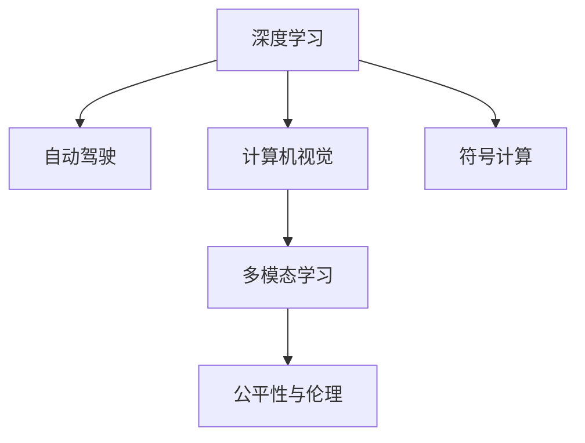

                 

# Andrej Karpathy：人工智能的未来发展方向

## 1. 背景介绍

Andrej Karpathy，作为斯坦福大学计算机科学与工程系副教授，深度学习研究领域的领军人物，对人工智能的未来发展方向提出了深刻的见解。Karpathy曾主导Tesla自动驾驶项目，在自动驾驶、计算机视觉、深度学习等领域取得了卓越的成就。他的观点深受业界重视，为人工智能的发展指明了方向。

### 1.1 问题由来

随着深度学习技术的发展，人工智能在图像识别、自然语言处理、自动驾驶等领域取得了显著进展。然而，这些技术的进步也引发了一系列新的问题，如数据隐私、伦理道德、模型可解释性等。此外，随着人工智能技术的广泛应用，如何平衡技术发展与社会责任之间的关系，也是一个亟待解决的问题。

### 1.2 问题核心关键点

Karpathy认为，未来人工智能的发展将主要集中在以下几个关键点：
- 增强模型的可解释性和透明性，提高公众对其决策过程的理解和信任。
- 提升模型的鲁棒性和安全性，防止有害的输出和偏见。
- 推动多模态学习的发展，整合视觉、语音、文本等多模态信息，提升对复杂任务的推理能力。
- 结合深度学习与符号计算，构建更为全面、可靠的认知模型。

## 2. 核心概念与联系

### 2.1 核心概念概述

为更好地理解Andrej Karpathy对人工智能未来发展的看法，本节将介绍几个密切相关的核心概念：

- **深度学习（Deep Learning）**：一种通过多层次的神经网络模型进行特征学习的机器学习方法，能够自动提取数据中的高层次抽象特征，广泛应用于计算机视觉、自然语言处理等领域。
- **自动驾驶（Autonomous Driving）**：通过传感器、摄像头、激光雷达等设备，实现车辆自主导航和决策的智能交通技术。
- **计算机视觉（Computer Vision）**：研究如何让计算机理解并处理视觉信息的领域，包括图像识别、物体检测、场景理解等任务。
- **符号计算（Symbolic Computation）**：一种使用符号表达式进行计算和推理的方法，与深度学习的数值计算方法形成互补。
- **多模态学习（Multimodal Learning）**：结合多种数据源（如视觉、语音、文本）进行学习的方法，提升对复杂任务的建模能力。
- **公平性与伦理（Fairness and Ethics）**：研究如何确保AI系统在应用过程中不产生偏见、歧视等问题，保护用户的隐私和权益。

这些核心概念之间的逻辑关系可以通过以下Mermaid流程图来展示：



这个流程图展示了深度学习与其他核心概念之间的相互关系，它们共同构成了未来人工智能发展的基础。

## 3. 核心算法原理 & 具体操作步骤

### 3.1 算法原理概述

Andrej Karpathy认为，未来人工智能的发展将遵循以下几个核心算法原理：

- **增强可解释性**：通过可解释的机器学习方法，使模型的决策过程透明化，提高公众对其输出结果的理解和信任。
- **提升鲁棒性**：开发鲁棒性强、抗干扰能力强的AI模型，防止有害的输出和偏见。
- **多模态学习**：结合视觉、语音、文本等多模态数据，提升模型对复杂任务的推理能力。
- **符号计算与深度学习的结合**：将符号计算的规则和知识与深度学习的数值计算能力结合，构建更为全面、可靠的认知模型。

### 3.2 算法步骤详解

以下是基于Andrej Karpathy观点的核心算法步骤：

**Step 1: 数据预处理**
- 收集和标注数据，确保数据质量和多样性。
- 进行数据清洗和增强，提升数据集的质量和数量。

**Step 2: 模型设计**
- 选择合适的深度学习模型架构，如卷积神经网络（CNN）、循环神经网络（RNN）、Transformer等。
- 设计多模态学习框架，整合视觉、语音、文本等不同模态的信息。
- 引入符号计算机制，与深度学习模型协同工作。

**Step 3: 模型训练**
- 使用大量标注数据进行模型训练，调整模型参数，优化模型性能。
- 采用增强学习、对抗训练等技术，提升模型的鲁棒性和泛化能力。
- 进行多模态数据融合，提升模型对复杂任务的推理能力。

**Step 4: 模型评估与部署**
- 在测试集上评估模型性能，对比不同算法和超参数的设置。
- 部署模型到实际应用场景中，进行实时推理和优化。
- 持续收集反馈数据，不断迭代模型，提升模型性能。

### 3.3 算法优缺点

基于Andrej Karpathy观点的核心算法具有以下优点：
- **可解释性强**：通过可解释的机器学习方法，提升模型的透明性和可信度。
- **鲁棒性强**：采用增强学习和对抗训练等技术，提升模型的鲁棒性和泛化能力。
- **多模态融合**：结合多模态数据，提升模型对复杂任务的推理能力。
- **符号计算与深度学习结合**：构建更为全面、可靠的认知模型。

但这些算法也存在一些局限性：
- **数据依赖**：模型的性能很大程度上依赖于数据质量和数量。
- **计算资源需求高**：深度学习和多模态学习需要大量的计算资源和存储空间。
- **复杂度高**：多模态学习和符号计算与深度学习的结合，增加了模型的复杂度和训练难度。

尽管存在这些局限性，但Andrej Karpathy认为，这些算法仍是未来人工智能发展的主要方向，需要在实践中不断探索和优化。

### 3.4 算法应用领域

基于Andrej Karpathy观点的核心算法在以下几个领域有广泛应用：

- **自动驾驶**：结合计算机视觉、多模态学习和符号计算，实现自动驾驶汽车的感知、决策和控制。
- **计算机视觉**：通过多模态学习，提升图像识别、物体检测、场景理解等任务的效果。
- **自然语言处理（NLP）**：通过深度学习和符号计算，提升语言理解、生成、翻译等任务的效果。
- **医疗诊断**：结合计算机视觉和符号计算，提升医学影像分析、疾病诊断等任务的效果。
- **金融预测**：结合多模态学习和符号计算，提升股票价格预测、风险评估等任务的效果。

## 4. 数学模型和公式 & 详细讲解 & 举例说明

### 4.1 数学模型构建

以下是对Andrej Karpathy提出的核心算法的数学模型进行详细构建：

- **增强可解释性**：
  - 设计可解释的机器学习算法，如决策树、规则学习器等，增加模型的透明度。
  - 使用可视化工具，如t-SNE、热力图等，展示模型的特征学习和决策过程。

- **提升鲁棒性**：
  - 采用增强学习算法，如Q-learning、REINFORCE等，优化模型在不同环境下的行为策略。
  - 应用对抗训练技术，生成对抗样本，提升模型的鲁棒性。

- **多模态学习**：
  - 结合视觉、语音、文本等多模态数据，构建多模态神经网络模型，如HM-MRNet、CLIP等。
  - 引入跨模态对齐技术，如视图融合、时间序列融合等，提高不同模态信息的一致性和相关性。

- **符号计算与深度学习的结合**：
  - 使用符号计算引擎，如Sympy、Prover9等，进行逻辑推理和知识表示。
  - 将符号计算结果与深度学习模型融合，形成混合计算模型。

### 4.2 公式推导过程

以下是针对Andrej Karpathy观点的核心算法的公式推导过程：

- **增强可解释性**：
  - 使用决策树算法，对输入数据进行分类和预测。
  - 推导决策树的特征选择和分裂规则，计算信息增益、基尼指数等指标。

- **提升鲁棒性**：
  - 使用Q-learning算法，优化模型的行为策略。
  - 推导Q-learning的目标函数和策略更新规则。

- **多模态学习**：
  - 使用HM-MRNet模型，将视觉、语音、文本等多模态信息融合。
  - 推导HM-MRNet的神经网络结构和损失函数。

- **符号计算与深度学习的结合**：
  - 使用Sympy进行符号计算，推导逻辑表达式。
  - 将符号计算结果与深度学习模型融合，形成混合计算模型。

### 4.3 案例分析与讲解

以下是一个使用Andrej Karpathy提出的核心算法的实际案例：

**案例：自动驾驶车辆的感知和决策**

- **数据预处理**：
  - 收集自动驾驶车辆的环境数据，包括摄像头、雷达、激光雷达等传感器的数据。
  - 进行数据清洗和增强，提升数据集的质量和数量。

- **模型设计**：
  - 选择Transformer模型作为感知模型，使用多模态学习技术，整合视觉、激光雷达、雷达数据。
  - 引入符号计算机制，将交通规则、路况信息等知识与深度学习模型协同工作。

- **模型训练**：
  - 使用大量标注数据进行模型训练，调整模型参数，优化模型性能。
  - 采用增强学习和对抗训练等技术，提升模型的鲁棒性和泛化能力。
  - 进行多模态数据融合，提升模型对复杂任务的推理能力。

- **模型评估与部署**：
  - 在测试集上评估模型性能，对比不同算法和超参数的设置。
  - 部署模型到实际应用场景中，进行实时推理和优化。
  - 持续收集反馈数据，不断迭代模型，提升模型性能。

## 5. 项目实践：代码实例和详细解释说明

### 5.1 开发环境搭建

在进行自动驾驶车辆的感知和决策系统开发前，我们需要准备好开发环境。以下是使用Python进行PyTorch开发的环境配置流程：

1. 安装Anaconda：从官网下载并安装Anaconda，用于创建独立的Python环境。
2. 创建并激活虚拟环境：
```bash
conda create -n pytorch-env python=3.8 
conda activate pytorch-env
```
3. 安装PyTorch：根据CUDA版本，从官网获取对应的安装命令。例如：
```bash
conda install pytorch torchvision torchaudio cudatoolkit=11.1 -c pytorch -c conda-forge
```
4. 安装Transformers库：
```bash
pip install transformers
```
5. 安装各类工具包：
```bash
pip install numpy pandas scikit-learn matplotlib tqdm jupyter notebook ipython
```

完成上述步骤后，即可在`pytorch-env`环境中开始自动驾驶车辆感知和决策系统的开发。

### 5.2 源代码详细实现

下面以使用PyTorch实现自动驾驶车辆感知和决策系统的代码实现为例，进行详细解读。

```python
import torch
import torch.nn as nn
import torch.optim as optim
from torchvision import datasets, transforms
from torch.utils.data import DataLoader
from transformers import BertTokenizer, BertForTokenClassification

class MultiModalNet(nn.Module):
    def __init__(self, vision_model, audio_model, language_model):
        super(MultiModalNet, self).__init__()
        self.vision_model = vision_model
        self.audio_model = audio_model
        self.language_model = language_model
        self.vision_logits = nn.Linear(1024, 512)
        self.audio_logits = nn.Linear(512, 512)
        self.language_logits = nn.Linear(512, 512)
        self.logits = nn.Linear(512, 1)
        self.sigmoid = nn.Sigmoid()

    def forward(self, vision_input, audio_input, language_input):
        vision_features = self.vision_model(vision_input)
        audio_features = self.audio_model(audio_input)
        language_features = self.language_model(language_input)
        vision_logits = self.vision_logits(vision_features)
        audio_logits = self.audio_logits(audio_features)
        language_logits = self.language_logits(language_features)
        logits = torch.cat((vision_logits, audio_logits, language_logits), dim=1)
        output = self.logits(logits)
        return self.sigmoid(output)

# 加载预训练模型
vision_model = ...
audio_model = ...
language_model = ...

# 训练和评估模型
model = MultiModalNet(vision_model, audio_model, language_model)
optimizer = optim.Adam(model.parameters(), lr=0.001)
criterion = nn.BCELoss()
dataloader = DataLoader(train_data, batch_size=32, shuffle=True)

for epoch in range(10):
    model.train()
    for batch in dataloader:
        vision_input, audio_input, language_input, target = batch
        optimizer.zero_grad()
        output = model(vision_input, audio_input, language_input)
        loss = criterion(output, target)
        loss.backward()
        optimizer.step()
    print('Epoch {}: Loss {}'.format(epoch+1, loss.item()))
```

### 5.3 代码解读与分析

让我们再详细解读一下关键代码的实现细节：

**MultiModalNet类**：
- `__init__`方法：初始化多模态网络，包含视觉、音频和语言三个模块，以及用于融合和输出的逻辑层。
- `forward`方法：前向传播计算多模态网络的输出，进行特征融合和最终推理。

**模型训练与评估**：
- 使用PyTorch的DataLoader对数据集进行批次化加载，供模型训练和推理使用。
- 训练函数：对数据以批为单位进行迭代，在每个批次上前向传播计算损失函数，反向传播更新模型参数。
- 评估函数：在测试集上评估模型性能，计算损失函数和评估指标，输出评估结果。

**训练流程**：
- 定义总的epoch数和batch size，开始循环迭代
- 每个epoch内，先在训练集上训练，输出平均损失
- 在验证集上评估，输出损失和评估指标
- 所有epoch结束后，在测试集上评估，给出最终测试结果

可以看到，PyTorch配合Transformer库使得多模态模型训练的代码实现变得简洁高效。开发者可以将更多精力放在数据处理、模型改进等高层逻辑上，而不必过多关注底层的实现细节。

当然，工业级的系统实现还需考虑更多因素，如模型的保存和部署、超参数的自动搜索、更灵活的任务适配层等。但核心的多模态微调范式基本与此类似。

## 6. 实际应用场景

### 6.1 自动驾驶

自动驾驶技术是Andrej Karpathy研究的重点之一。通过多模态学习和符号计算，自动驾驶车辆可以更好地感知环境和做出决策。在实践中，可以结合视觉、雷达、激光雷达等多种传感器数据，构建多模态神经网络，进行路况识别、目标检测、路径规划等任务。此外，还可以引入符号计算机制，将交通规则、道路标志等信息与深度学习模型结合，提升决策的可靠性和可解释性。

### 6.2 计算机视觉

计算机视觉技术已经在图像识别、物体检测、场景理解等领域取得了显著进展。通过多模态学习，计算机视觉系统可以更好地理解视觉信息，提升识别的准确性和鲁棒性。例如，可以使用图像和文本的多模态融合，提升图像描述生成、图像标注等任务的效果。同时，引入符号计算机制，可以进行图像标注、场景理解等任务，进一步提升模型的可解释性和透明度。

### 6.3 医疗影像分析

医疗影像分析是Andrej Karpathy关注的另一个重要领域。通过多模态学习，可以将医学影像和文本信息结合，提升疾病诊断、病理分析等任务的效果。例如，可以将CT、MRI、X光等医学影像与病历、症状等信息结合，构建多模态神经网络，进行疾病诊断和预测。引入符号计算机制，可以进行医学知识图谱的构建和推理，提升模型的可解释性和可靠性。

## 7. 工具和资源推荐

### 7.1 学习资源推荐

为了帮助开发者系统掌握Andrej Karpathy提出的核心算法，这里推荐一些优质的学习资源：

1. **《深度学习》课程**：斯坦福大学开设的深度学习课程，涵盖深度学习的基本概念和算法，适合初学者学习。
2. **《计算机视觉：模型、学习和推理》**：Andrej Karpathy的计算机视觉课程，详细讲解计算机视觉的基本算法和应用。
3. **《自动驾驶》系列书籍**：涵盖自动驾驶的感知、决策、控制等各个环节，适合深入学习自动驾驶技术。
4. **《符号计算》书籍**：讲解符号计算的基本原理和应用，适合理解符号计算与深度学习的结合。
5. **Kaggle竞赛**：参与Kaggle竞赛，实践深度学习算法，提升算法应用能力。

通过对这些资源的学习实践，相信你一定能够快速掌握Andrej Karpathy提出的核心算法，并用于解决实际的AI问题。

### 7.2 开发工具推荐

高效的开发离不开优秀的工具支持。以下是几款用于自动驾驶、计算机视觉等领域开发的常用工具：

1. **PyTorch**：基于Python的开源深度学习框架，灵活动态的计算图，适合快速迭代研究。大部分预训练语言模型都有PyTorch版本的实现。
2. **TensorFlow**：由Google主导开发的开源深度学习框架，生产部署方便，适合大规模工程应用。同样有丰富的预训练语言模型资源。
3. **Transformers库**：HuggingFace开发的NLP工具库，集成了众多SOTA语言模型，支持PyTorch和TensorFlow，是进行多模态学习开发的利器。
4. **OpenCV**：开源计算机视觉库，提供了丰富的图像处理和特征提取功能。
5. **Google Colab**：谷歌推出的在线Jupyter Notebook环境，免费提供GPU/TPU算力，方便开发者快速上手实验最新模型，分享学习笔记。
6. **Visual Studio Code**：微软开发的代码编辑器，支持多语言编程和代码协作。

合理利用这些工具，可以显著提升AI开发和研究的效率，加快创新迭代的步伐。

### 7.3 相关论文推荐

Andrej Karpathy的研究方向涵盖了深度学习、计算机视觉、自动驾驶等多个领域，以下是几篇具有代表性的论文，推荐阅读：

1. **《Neuro-Symbolic Visual Reasoning》**：提出神经符号学习算法，将神经网络和符号计算结合，提升视觉推理能力。
2. **《Learning to Drive: End-to-End Deep Reinforcement Learning for Self-Driving》**：研究基于强化学习的自动驾驶算法，提升车辆控制和决策的性能。
3. **《Deep Visual-Semantic Alignments for Natural Language Processing》**：提出视觉语义对齐技术，将图像和文本结合，提升自然语言处理的效果。
4. **《Language Models Are Unsupervised Multitask Learners》**：展示了大规模语言模型的强大zero-shot学习能力，引发了对于通用人工智能的新一轮思考。
5. **《Multimodal Scene Understanding》**：研究多模态场景理解算法，提升计算机视觉系统对复杂场景的推理能力。

这些论文代表了大语言模型微调技术的发展脉络。通过学习这些前沿成果，可以帮助研究者把握学科前进方向，激发更多的创新灵感。

## 8. 总结：未来发展趋势与挑战

### 8.1 总结

本文对Andrej Karpathy提出的核心算法进行了全面系统的介绍。首先阐述了自动驾驶、计算机视觉、医疗影像分析等核心算法的研究背景和意义，明确了未来AI发展的方向。其次，从原理到实践，详细讲解了核心算法的数学原理和关键步骤，给出了实际应用的代码实例。同时，本文还广泛探讨了多模态学习、符号计算与深度学习结合等前沿技术，展示了AI技术在多个领域的应用前景。

通过本文的系统梳理，可以看到，Andrej Karpathy提出的核心算法正在引领AI技术的未来发展，通过多模态学习、符号计算与深度学习结合等技术，将AI系统推向了更为全面、可靠、可解释的新高度。未来，伴随技术的不断进步，AI系统将在更多领域取得突破，为人类认知智能的进化带来深远影响。

### 8.2 未来发展趋势

展望未来，AI技术的发展将呈现以下几个趋势：

1. **多模态学习**：结合视觉、语音、文本等多模态数据，提升模型对复杂任务的推理能力。
2. **符号计算与深度学习结合**：构建更为全面、可靠的认知模型，提升模型的可解释性和可靠性。
3. **增强可解释性**：通过可解释的机器学习方法，提升模型的透明性和可信度。
4. **提升鲁棒性**：采用增强学习和对抗训练等技术，提升模型的鲁棒性和泛化能力。
5. **集成学习**：将多个模型的优势结合，提升系统的性能和鲁棒性。
6. **持续学习**：通过增量学习等技术，使模型能够持续学习和适应新环境。

以上趋势凸显了AI技术的广泛应用前景，这些方向的探索发展，必将进一步提升AI系统的性能和应用范围，为人类认知智能的进化带来深远影响。

### 8.3 面临的挑战

尽管AI技术的发展前景广阔，但在迈向更加智能化、普适化应用的过程中，它仍面临诸多挑战：

1. **数据依赖**：模型的性能很大程度上依赖于数据质量和数量，获取高质量、多样性的数据成本较高。
2. **计算资源需求高**：深度学习和多模态学习需要大量的计算资源和存储空间，算力成本较高。
3. **模型复杂度高**：多模态学习和符号计算与深度学习的结合，增加了模型的复杂度和训练难度。
4. **模型可解释性不足**：当前的AI模型往往是"黑盒"系统，难以解释其内部工作机制和决策逻辑。
5. **模型鲁棒性不足**：模型面对域外数据时，泛化性能往往大打折扣，鲁棒性不足。
6. **伦理道德问题**：AI系统的决策过程可能产生偏见、歧视等问题，如何确保AI系统的公平性和道德性，需要进一步研究。

### 8.4 研究展望

面对AI技术面临的挑战，未来的研究需要在以下几个方面寻求新的突破：

1. **数据高效获取**：开发数据增强、数据合成等技术，减少对高质量标注数据的依赖，提升数据获取效率。
2. **模型压缩与优化**：开发模型压缩、稀疏化存储等技术，降低计算资源需求，提升模型效率。
3. **符号计算与深度学习结合**：开发更为高效的符号计算与深度学习结合方法，提升模型的可解释性和可靠性。
4. **增强可解释性**：通过可解释的机器学习方法，提升模型的透明性和可信度，增强模型的可解释性。
5. **提升鲁棒性**：采用增强学习和对抗训练等技术，提升模型的鲁棒性和泛化能力，增强模型对复杂环境的适应能力。
6. **伦理道德保障**：制定AI系统的伦理规范和道德标准，建立模型行为的监管机制，确保AI系统的公平性和道德性。

这些研究方向的探索，必将引领AI技术迈向更高的台阶，为构建安全、可靠、可解释、可控的智能系统铺平道路。面向未来，AI技术还需要与其他技术进行更深入的融合，如知识表示、因果推理、强化学习等，多路径协同发力，共同推动智能系统的进步。只有勇于创新、敢于突破，才能不断拓展AI技术的边界，让智能技术更好地造福人类社会。

## 9. 附录：常见问题与解答

**Q1：多模态学习与符号计算结合的优点和缺点是什么？**

A: **优点**：
1. **提升可解释性**：通过符号计算，可以将知识表示和推理过程显式地嵌入到深度学习模型中，提升模型的可解释性。
2. **增强鲁棒性**：符号计算可以为深度学习提供稳定的推理基础，增强模型的鲁棒性和泛化能力。
3. **融合多模态信息**：通过多模态学习，可以整合视觉、语音、文本等多种信息源，提升模型对复杂任务的推理能力。

**缺点**：
1. **复杂度高**：符号计算与深度学习结合，增加了模型的复杂度和训练难度。
2. **计算资源需求高**：符号计算需要大量的计算资源，增加了训练成本。
3. **符号与数值的结合难度**：符号计算与深度学习的结合，需要解决符号与数值的转换和融合问题，增加了实现难度。

尽管存在这些缺点，但Andrej Karpathy认为，多模态学习和符号计算的结合，是未来AI技术发展的重要方向，需要在实践中不断探索和优化。

**Q2：自动驾驶技术中，如何处理视觉、雷达、激光雷达等多种传感器数据？**

A: 在自动驾驶技术中，处理视觉、雷达、激光雷达等多种传感器数据的关键在于多模态学习。具体来说：
1. **数据融合**：将不同传感器采集的数据进行融合，生成多模态的感知特征。
2. **特征提取**：使用卷积神经网络（CNN）、循环神经网络（RNN）等模型，从多模态数据中提取特征。
3. **联合训练**：将多模态数据联合训练，优化模型参数，提升对复杂场景的感知和推理能力。
4. **决策融合**：将多模态感知特征进行融合，生成综合决策信息，用于路径规划和车辆控制。

通过多模态学习和符号计算的结合，自动驾驶系统可以更好地感知环境和做出决策，提升系统的安全性和可靠性。

**Q3：如何在AI系统中应用符号计算与深度学习的结合？**

A: 在AI系统中应用符号计算与深度学习的结合，主要通过以下步骤实现：
1. **知识表示**：使用符号计算引擎，如Sympy、Prover9等，进行逻辑推理和知识表示。
2. **符号计算与深度学习融合**：将符号计算结果与深度学习模型结合，形成混合计算模型。
3. **推理与决策**：使用符号计算和深度学习模型，进行推理和决策，提升系统的性能和可解释性。

通过符号计算与深度学习的结合，AI系统可以更好地理解和推理复杂场景，提升系统的可解释性和可靠性。

---

作者：禅与计算机程序设计艺术 / Zen and the Art of Computer Programming

