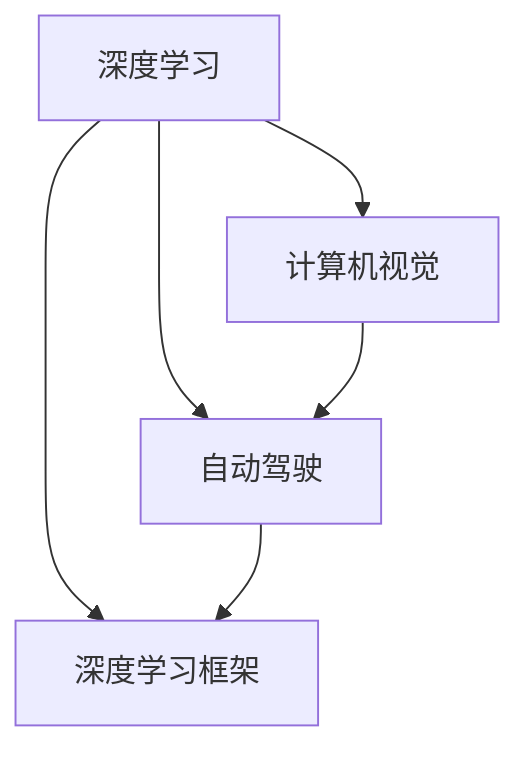

                 

# Andrej Karpathy：人工智能的未来发展机遇

> 关键词：人工智能,深度学习,神经网络,深度学习框架,计算机视觉,自动驾驶

## 1. 背景介绍

Andrej Karpathy，作为深度学习领域的翘楚，其对人工智能未来的洞察和预测，无疑对行业发展具有重要指导意义。作为知名的计算机视觉专家和自动驾驶工程师，Karpathy在深度学习、自动驾驶和人工智能领域都取得了诸多成就。他在斯坦福大学担任计算机科学教授，同时担任特斯拉公司的首席人工智能科学家，对机器学习和自动驾驶的理论与实践有着深刻见解。

### 1.1 背景概述

Karpathy的研究方向主要集中在以下几个领域：

1. **计算机视觉**：在图像分类、目标检测、语义分割等领域均有显著成果。
2. **自动驾驶**：其领导的自动驾驶团队在驾驶场景理解和决策制定方面取得了重要进展。
3. **深度学习框架**：积极推动深度学习框架PyTorch的发展，致力于使深度学习模型更加灵活、可扩展和易于使用。
4. **深度学习理论**：在深度学习理论领域，Karpathy也对泛化、优化、对抗性等问题有着深入研究。

## 2. 核心概念与联系

### 2.1 核心概念概述

为更好地理解Karpathy关于人工智能未来发展的观点，我们首先梳理核心概念和相关联的关键技术：

1. **深度学习**：通过构建多层次神经网络来模拟人脑的推理过程，是当前人工智能领域最重要的技术之一。
2. **计算机视觉**：利用计算机技术来模拟人类视觉系统，从而实现图像识别、场景理解等功能。
3. **自动驾驶**：结合深度学习和计算机视觉技术，实现车辆的自主驾驶。
4. **深度学习框架**：如PyTorch、TensorFlow等，提供了深度学习模型的构建和训练工具，极大地降低了深度学习的门槛。
5. **计算机科学和工程**：包括算法设计、系统架构、软件工程等方面的知识，为人工智能技术提供强有力的支持。

这些概念相互交织，共同构成了人工智能技术发展的基石。

### 2.2 核心概念之间的联系

Karpathy的研究跨越了计算机视觉、自动驾驶和深度学习框架等多个领域，其研究往往需要综合运用这些技术。例如，在自动驾驶中，Karpathy团队通过计算机视觉技术实现对驾驶环境的理解，使用深度学习模型进行决策制定。而在开发深度学习框架时，Karpathy则强调框架的可扩展性和易用性，以便更广泛地应用到各个领域中。

这些核心概念之间的联系可以用以下Mermaid流程图来展示：



## 3. 核心算法原理 & 具体操作步骤

### 3.1 算法原理概述

Karpathy的研究主要围绕深度学习和计算机视觉展开，其核心算法原理通常包括以下几个方面：

1. **卷积神经网络(CNN)**：在图像处理领域，CNN通过卷积和池化操作来提取特征，从而实现图像分类和目标检测。
2. **循环神经网络(RNN)**：在序列数据处理中，RNN能够通过时间步进的方式处理序列信息，如语音识别、自然语言处理等。
3. **生成对抗网络(GAN)**：通过生成器和判别器的对抗训练，GAN能够生成逼真的图像和视频，在图像生成和增强现实等领域有着广泛应用。
4. **自注意力机制**：Transformer架构的核心，通过多头自注意力机制，显著提升了模型对长距离依赖的捕捉能力。

这些算法原理通过深度学习框架得以实现和优化，如在PyTorch中实现卷积神经网络、循环神经网络和自注意力机制，通过TensorFlow实现GAN等。

### 3.2 算法步骤详解

以自动驾驶中的图像识别任务为例，我们详细讲解核心算法的操作步骤：

1. **数据准备**：收集并标注大量的驾驶场景图像，用于训练模型。
2. **模型构建**：使用卷积神经网络或Transformer架构，构建图像识别模型。
3. **训练模型**：在标注数据上使用梯度下降等优化算法，最小化损失函数，更新模型参数。
4. **模型验证**：在验证集上评估模型性能，调整超参数以提升模型准确率。
5. **模型应用**：将训练好的模型集成到自动驾驶系统中，实现驾驶场景理解。

### 3.3 算法优缺点

深度学习和计算机视觉算法具有以下优点：

1. **高精度**：在图像分类、目标检测等任务上，深度学习模型能够获得非常高的精度。
2. **可解释性**：深度学习模型通常具备较高的可解释性，可以通过可视化技术揭示特征图、梯度等关键信息。
3. **普适性**：算法适用于多种计算机视觉任务，如人脸识别、医学影像分析等。

然而，这些算法也存在以下缺点：

1. **数据依赖**：深度学习模型通常需要大量标注数据，标注成本较高。
2. **计算需求高**：深度学习模型的训练和推理需要强大的计算资源，对硬件要求较高。
3. **过拟合风险**：深度学习模型容易过拟合，特别是在数据量不足的情况下。

### 3.4 算法应用领域

Karpathy的研究成果广泛应用于以下几个领域：

1. **自动驾驶**：如特斯拉Autopilot系统中的视觉识别和决策制定，其团队在驾驶场景理解和路径规划方面取得了重要进展。
2. **计算机视觉**：在医疗影像分析、视频内容理解等方面，Karpathy的研究成果被广泛应用于学术和工业界。
3. **深度学习框架**：如PyTorch，Karpathy积极推动其发展和优化，使得深度学习模型更易于构建和训练。
4. **通用人工智能**：通过多领域知识的融合，Karpathy致力于构建更加通用、智能的AI系统。

## 4. 数学模型和公式 & 详细讲解

### 4.1 数学模型构建

以自动驾驶中的驾驶场景理解为例，我们介绍相关数学模型构建过程：

1. **输入表示**：将驾驶场景图像转换为特征向量，如使用CNN进行特征提取。
2. **场景理解**：使用深度学习模型（如RNN或Transformer）对输入特征进行处理，得到场景理解结果。
3. **路径规划**：根据场景理解结果，生成路径规划指令，指导车辆行驶。

### 4.2 公式推导过程

以CNN的卷积操作为例，推导其数学公式：

设输入图像的特征图大小为$H \times W \times C$，卷积核的大小为$k \times k$，步幅为$s$，填充为$p$。卷积操作的数学公式为：

$$
\begin{aligned}
y_{i,j,k}&=\sum_{c=0}^{C-1} w_{k,j-k} * x_{i,j,c}\\
&=\sum_{c=0}^{C-1} \sum_{h=0}^{k-1} \sum_{w=0}^{k-1} w_{h,w} x_{i+h,j+w,c}
\end{aligned}
$$

其中$w_{h,w}$为卷积核权重，$x_{i,j,c}$为输入特征图在位置$(i,j)$的像素值。

### 4.3 案例分析与讲解

以图像分类任务为例，使用CNN进行图像分类。假设训练集包含$N$张图像，每张图像$x_i$的大小为$H \times W \times C$，卷积核大小为$k \times k$，步幅为$s$，填充为$p$，卷积核权重$w_{h,w}$大小为$k \times k \times C \times C'$。模型在训练集上使用的损失函数为交叉熵损失，优化器为SGD。

假设输出为$y_i$，其中$y_i$为图像$i$的类别标签，$y_i \in [1,2,\ldots,C]$。模型的预测输出为$\hat{y_i}$，模型训练的数学公式为：

$$
L=\frac{1}{N}\sum_{i=1}^{N} -y_i \log \hat{y_i}
$$

其中$\log$为自然对数，$-1$为梯度负号。

使用SGD优化算法更新模型参数：

$$
\theta \leftarrow \theta - \eta \nabla_{\theta}L
$$

其中$\eta$为学习率，$\nabla_{\theta}L$为损失函数对模型参数$\theta$的梯度，$\theta$为模型参数。

## 5. 项目实践：代码实例和详细解释说明

### 5.1 开发环境搭建

在进行项目实践前，需要准备以下开发环境：

1. **安装Python**：使用Anaconda或Miniconda安装Python 3.7以上版本。
2. **安装深度学习框架**：如TensorFlow、PyTorch等。
3. **安装相关库**：如numpy、pandas、matplotlib、scikit-learn等。

### 5.2 源代码详细实现

以图像分类任务为例，使用PyTorch实现CNN模型。代码如下：

```python
import torch
import torch.nn as nn
import torch.optim as optim

class CNN(nn.Module):
    def __init__(self):
        super(CNN, self).__init__()
        self.conv1 = nn.Conv2d(in_channels=3, out_channels=64, kernel_size=3, stride=1, padding=1)
        self.pool = nn.MaxPool2d(kernel_size=2, stride=2)
        self.conv2 = nn.Conv2d(in_channels=64, out_channels=128, kernel_size=3, stride=1, padding=1)
        self.fc1 = nn.Linear(in_features=128*4*4, out_features=256)
        self.fc2 = nn.Linear(in_features=256, out_features=10)
        
    def forward(self, x):
        x = self.pool(F.relu(self.conv1(x)))
        x = self.pool(F.relu(self.conv2(x)))
        x = x.view(x.size(0), -1)
        x = F.relu(self.fc1(x))
        x = self.fc2(x)
        return x

# 创建CNN模型
model = CNN()

# 定义优化器和学习率
optimizer = optim.SGD(model.parameters(), lr=0.001)

# 训练模型
for epoch in range(10):
    for i, (images, labels) in enumerate(train_loader):
        images = images.to(device)
        labels = labels.to(device)
        optimizer.zero_grad()
        outputs = model(images)
        loss = nn.CrossEntropyLoss()(outputs, labels)
        loss.backward()
        optimizer.step()
```

### 5.3 代码解读与分析

上述代码实现了一个简单的CNN模型，包括以下几个关键部分：

1. **模型定义**：使用nn.Module定义CNN模型，包含卷积层、池化层和全连接层。
2. **优化器定义**：使用SGD优化器，设置学习率。
3. **模型训练**：通过循环迭代训练集数据，前向传播计算损失函数，反向传播更新模型参数。

## 6. 实际应用场景

### 6.1 自动驾驶

自动驾驶是Karpathy团队研究的重要方向，其中计算机视觉技术在驾驶场景理解和路径规划中发挥着关键作用。

**实际应用**：在特斯拉Autopilot系统中，使用计算机视觉技术实现对道路标志、交通信号、车辆和行人的识别，从而进行路径规划和决策制定。

**技术挑战**：
- 如何处理动态变化的多变场景。
- 如何提高模型的鲁棒性和泛化能力。
- 如何与激光雷达等传感器数据融合。

### 6.2 医疗影像分析

Karpathy在医疗影像分析方面也有重要研究，计算机视觉技术在医学图像分类、病变检测、病理图像分析等方面有广泛应用。

**实际应用**：使用CNN对医学影像进行分类，如X光片、CT扫描等，辅助医生进行诊断和治疗。

**技术挑战**：
- 如何处理小样本数据。
- 如何提升模型的解释性和可解释性。
- 如何与其他医疗数据融合。

### 6.3 通用人工智能

Karpathy的研究还涉及通用人工智能领域，探索构建能够处理多领域知识的智能系统。

**实际应用**：如在自然语言处理、计算机视觉和机器人学等多领域知识的应用，实现多领域知识的协同建模。

**技术挑战**：
- 如何构建知识表示框架。
- 如何实现跨领域知识的迁移学习。
- 如何提高系统的可解释性和鲁棒性。

## 7. 工具和资源推荐

### 7.1 学习资源推荐

为了帮助开发者深入了解Karpathy的研究方向和应用，以下是一些推荐的学习资源：

1. **PyTorch官方文档**：提供深度学习模型的构建和训练教程。
2. **Deep Learning Specialization课程**：由Coursera与斯坦福大学联合推出，涵盖深度学习的基础和应用。
3. **《Deep Learning》书籍**：由Ian Goodfellow等人合著，是深度学习领域的经典教材。
4. **Karpathy博客和论文**：Karpathy在博客上分享了大量的研究和实践心得，可以获取最新的研究成果和见解。
5. **ArXiv论文**：Karpathy的研究成果通常会在ArXiv上发布，可以获取最前沿的研究论文。

### 7.2 开发工具推荐

以下是一些常用的开发工具：

1. **PyTorch**：深度学习框架，提供了高效的自动微分和动态计算图功能。
2. **TensorFlow**：深度学习框架，适用于大规模分布式计算。
3. **TensorBoard**：可视化工具，用于监控模型训练和推理过程。
4. **Jupyter Notebook**：交互式编程环境，适合数据分析和模型训练。
5. **Google Colab**：Google提供的免费GPU计算资源，方便进行模型实验。

### 7.3 相关论文推荐

Karpathy的研究涉及多个领域，以下是一些推荐的相关论文：

1. **《Large-Scale Image Recognition with Deep Convolutional Neural Networks》**：介绍了在大规模图像识别任务中使用CNN的方法。
2. **《Autonomous Driving in the Age of Deep Learning》**：介绍了自动驾驶中计算机视觉技术的应用。
3. **《Deep Learning for Self-Driving Cars: Learning to Drive in Cartesian Space》**：介绍了在自动驾驶中使用深度学习进行路径规划的方法。
4. **《Deep Learning for Self-Driving Cars: Curriculum for Road Sign Recognition and Semantic Segmentation》**：介绍了在自动驾驶中使用深度学习进行驾驶场景理解和路径规划的方法。

## 8. 总结：未来发展趋势与挑战

### 8.1 总结

本文介绍了Andrej Karpathy关于人工智能未来发展的观点和研究成果，涵盖了深度学习、计算机视觉和自动驾驶等领域。Karpathy的研究方向体现了AI技术在各个领域的应用前景和未来发展趋势，为行业发展提供了重要参考。

### 8.2 未来发展趋势

未来，人工智能技术将继续朝着以下几个方向发展：

1. **更智能的自动化**：通过深度学习技术，实现更智能的自动化系统，如自动驾驶、自动化生产等。
2. **更广泛的应用场景**：AI技术将在更多领域得到应用，如医疗、金融、教育等。
3. **更普适的知识表示**：构建能够处理多领域知识的智能系统，实现跨领域的知识迁移。
4. **更高效的技术实现**：通过优化算法和硬件，提高AI系统的效率和可靠性。

### 8.3 面临的挑战

尽管AI技术取得了显著进展，但仍面临以下挑战：

1. **数据依赖**：深度学习模型通常需要大量标注数据，获取高质量标注数据的成本较高。
2. **计算资源**：深度学习模型的训练和推理需要强大的计算资源，对硬件要求较高。
3. **可解释性**：深度学习模型的决策过程缺乏可解释性，难以理解和调试。
4. **安全性**：AI系统可能会受到对抗样本攻击，存在安全风险。
5. **伦理问题**：AI系统的决策过程可能带来伦理问题，如偏见、歧视等。

### 8.4 研究展望

未来，AI研究需要在以下几个方面进行深入探索：

1. **无监督学习和自监督学习**：减少对标注数据的依赖，利用自监督学习、主动学习等方法提高AI系统的泛化能力。
2. **参数高效和计算高效的微调方法**：开发更高效的微调方法，提升模型在少样本情况下的表现。
3. **跨领域知识融合**：探索跨领域知识表示和迁移学习方法，提高AI系统的可扩展性和泛化能力。
4. **伦理和安全性**：建立AI系统的伦理和安全性机制，确保AI系统的决策过程符合人类价值观和伦理道德。

## 9. 附录：常见问题与解答

**Q1：深度学习算法有哪些优点和缺点？**

A: 深度学习算法具有以下优点：

1. **高精度**：在图像分类、目标检测等任务上，深度学习模型能够获得非常高的精度。
2. **可扩展性**：模型结构灵活，易于扩展到多领域应用。

缺点包括：

1. **数据依赖**：深度学习模型通常需要大量标注数据，标注成本较高。
2. **计算需求高**：深度学习模型的训练和推理需要强大的计算资源，对硬件要求较高。
3. **过拟合风险**：深度学习模型容易过拟合，特别是在数据量不足的情况下。

**Q2：如何提升深度学习模型的泛化能力？**

A: 提升深度学习模型的泛化能力，可以采用以下方法：

1. **数据增强**：通过回译、旋转、缩放等方式扩充训练集，提高模型对不同数据分布的适应性。
2. **正则化**：使用L2正则、Dropout等方法，防止模型过拟合。
3. **迁移学习**：利用预训练模型在相关任务上进行微调，提升模型泛化能力。
4. **对抗训练**：引入对抗样本，提高模型鲁棒性。

**Q3：深度学习模型在实际应用中面临哪些问题？**

A: 深度学习模型在实际应用中面临以下问题：

1. **数据获取**：获取高质量标注数据成本较高，数据获取难度较大。
2. **计算资源**：深度学习模型的训练和推理需要强大的计算资源，对硬件要求较高。
3. **模型可解释性**：深度学习模型的决策过程缺乏可解释性，难以理解和调试。
4. **安全性**：深度学习模型可能会受到对抗样本攻击，存在安全风险。

**Q4：如何开发高效可扩展的深度学习模型？**

A: 开发高效可扩展的深度学习模型，可以采用以下方法：

1. **模块化设计**：将模型设计成可模块化的组件，方便维护和扩展。
2. **分布式计算**：使用分布式计算框架，如TensorFlow、PyTorch等，提高计算效率。
3. **模型压缩和量化**：采用模型压缩和量化技术，减少模型大小和计算资源消耗。

---

作者：禅与计算机程序设计艺术 / Zen and the Art of Computer Programming

