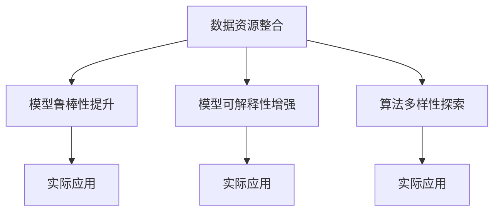

                 

# Andrej Karpathy：人工智能的未来发展策略

## 1. 背景介绍

### 1.1 问题由来
人工智能(AI)正处于前所未有的发展热潮中。从自动驾驶、机器人、自然语言处理(NLP)到医疗、金融等各个领域，AI技术的应用日益广泛。然而，尽管取得了诸多突破，AI的实际落地仍面临诸多挑战，包括数据稀缺、算法复杂、伦理道德等问题。在此背景下，Andrej Karpathy提出了他对于AI未来发展的一些策略思考。

### 1.2 问题核心关键点
Karpathy认为，未来AI的发展应当从数据、模型和算法三个方面着手，充分整合数据资源，提升模型的鲁棒性和可解释性，探索更加复杂和多样化的算法。通过这些措施，AI技术将更好地应对现实世界中的复杂挑战，实现更加广泛的应用。

## 2. 核心概念与联系

### 2.1 核心概念概述

为了更好地理解Karpathy的AI发展策略，本节将介绍几个密切相关的核心概念：

- **数据资源整合**：指在AI应用中，如何高效整合和利用各种数据源，以提高模型性能和泛化能力。
- **模型鲁棒性提升**：指在训练和部署AI模型时，如何提高模型的鲁棒性和泛化能力，使其在不同场景下表现稳定。
- **模型可解释性增强**：指通过改进算法设计，增强模型的可解释性，使其输出结果易于理解，从而提高模型的可信度和应用范围。
- **算法多样性探索**：指在AI中探索和开发多样化的算法，以解决不同类型的问题，拓展AI技术的应用边界。

这些概念之间的逻辑关系可以通过以下Mermaid流程图来展示：



这个流程图展示了大语言模型的核心概念及其之间的关系：

1. 数据资源整合是基础，为模型的训练提供足够的优质数据。
2. 模型鲁棒性提升是关键，确保模型在不同环境下的稳定性和可靠性。
3. 模型可解释性增强是保障，提高模型的可信度和应用范围。
4. 算法多样性探索是方向，拓展AI技术的应用边界。

这些概念共同构成了AI发展的基石，使其能够在复杂多变的环境下取得长足进步。通过理解这些核心概念，我们可以更好地把握AI技术的前进方向。

## 3. 核心算法原理 & 具体操作步骤
### 3.1 算法原理概述

Karpathy的AI发展策略主要围绕以下几个核心算法原理展开：

1. **数据增强与合成**：通过数据增强和合成技术，丰富训练数据集，提高模型泛化能力。
2. **对抗训练与鲁棒性增强**：使用对抗样本训练模型，提高模型的鲁棒性和泛化能力。
3. **参数高效微调与模型压缩**：通过参数高效微调和模型压缩技术，提高模型的计算效率和部署灵活性。
4. **模型蒸馏与知识传递**：通过模型蒸馏和知识传递技术，将大模型的知识迁移到轻量级模型中，提高模型性能。
5. **可解释性增强与因果推理**：引入可解释性增强和因果推理技术，提高模型的透明度和可信度。

### 3.2 算法步骤详解

Karpathy的AI发展策略涉及以下关键步骤：

**Step 1: 数据整合与预处理**
- 收集和整理多源异构数据，如文本、图像、语音等，构建统一的数据集。
- 对数据进行清洗、归一化和增强处理，提高数据质量。

**Step 2: 模型训练与优化**
- 选择合适的预训练模型作为初始化，如BERT、GPT等。
- 使用对抗训练和鲁棒性增强技术，优化模型性能。
- 采用参数高效微调和模型压缩技术，提高模型效率。

**Step 3: 模型部署与推理**
- 将优化后的模型部署到生产环境中，如服务器、嵌入式设备等。
- 采用模型蒸馏和知识传递技术，实现模型压缩与知识迁移。

**Step 4: 模型监控与反馈**
- 对部署后的模型进行实时监控，收集性能指标和错误信息。
- 根据反馈结果，进一步优化模型和训练过程。

### 3.3 算法优缺点

Karpathy的AI发展策略具有以下优点：
1. 提升了模型的泛化能力和鲁棒性，使其在不同场景下表现稳定。
2. 增强了模型的可解释性，提高了AI系统的透明度和可信度。
3. 优化了模型的计算效率，降低了资源消耗和部署成本。
4. 拓展了AI技术的应用边界，推动了AI技术在更多领域的落地。

同时，该策略也存在一些局限性：
1. 数据整合和预处理复杂度较高，需要大量人力和技术支持。
2. 对抗训练和鲁棒性增强可能增加模型复杂度，影响计算效率。
3. 模型蒸馏和知识传递可能需要较长时间，效果受限于预训练模型的质量。
4. 可解释性增强和因果推理技术仍处于起步阶段，应用范围有限。

尽管存在这些局限性，但就目前而言，Karpathy的AI发展策略仍然是大规模应用AI技术的重要参考，具有广泛的实用价值。

### 3.4 算法应用领域

Karpathy的AI发展策略在多个领域已经得到了广泛的应用，例如：

- **自动驾驶**：通过数据增强和模型蒸馏，提升驾驶系统的鲁棒性和泛化能力。
- **医疗影像分析**：使用对抗训练和模型压缩技术，提高影像诊断的精度和效率。
- **金融风控**：采用可解释性增强和因果推理技术，构建更加透明和可信的风险评估模型。
- **智能客服**：通过数据整合和模型蒸馏，提升客服系统的响应速度和准确性。
- **教育推荐**：采用对抗训练和模型压缩技术，优化推荐系统的性能和效率。

除了上述这些经典领域外，Karpathy的AI发展策略还适用于更多新兴场景，如智能家居、智慧城市、工业自动化等，为各行各业带来新的变革。

## 4. 数学模型和公式 & 详细讲解  
### 4.1 数学模型构建

Karpathy的AI发展策略涉及多个数学模型和算法，以下将详细讲解其中的一些关键模型。

### 4.2 公式推导过程

#### 对抗训练

对抗训练的基本思想是通过引入对抗样本，使得模型能够对输入数据的微小扰动具有鲁棒性。设原始数据为 $x$，对抗样本为 $x+\delta$，其中 $\delta$ 为扰动量。对抗训练的目标是最小化以下损失函数：

$$
\mathcal{L}(x, \delta) = \max_{\|\delta\| \leq \epsilon} \mathcal{L}(M(x+\delta), y)
$$

其中 $M$ 为模型，$y$ 为真实标签，$\epsilon$ 为扰动量上限。

通过最大化对抗损失，模型能够在对抗样本上表现稳定，提升鲁棒性。

#### 模型蒸馏

模型蒸馏是指将大模型的知识迁移到轻量级模型中，以提高轻量级模型的性能。设大模型为 $M_{\text{large}}$，小模型为 $M_{\text{small}}$。蒸馏的目标是最小化模型 $M_{\text{small}}$ 在数据集上的损失，同时最大化与大模型的相似度。

$$
\mathcal{L}(\theta_{\text{small}}, \theta_{\text{large}}) = \mathcal{L}_{\text{data}}(\theta_{\text{small}}) + \lambda \mathcal{L}_{\text{similarity}}(\theta_{\text{small}}, \theta_{\text{large}})
$$

其中 $\mathcal{L}_{\text{similarity}}$ 为模型相似度损失函数，$0 < \lambda \leq 1$ 为平衡系数。

通过最小化数据损失和相似度损失，大模型的知识被传递到小模型中，提高了小模型的性能。

#### 模型压缩

模型压缩是指在不影响模型性能的前提下，减少模型参数和计算资源消耗，提高模型的计算效率和部署灵活性。常用的模型压缩方法包括参数剪枝、量化、蒸馏等。

以量化为例，通过将浮点参数转换为定点参数，减少模型的计算精度，从而降低计算资源消耗。设原始参数为 $\theta$，量化后的参数为 $\theta'$，量化方法为：

$$
\theta' = \text{quantize}(\theta)
$$

其中 $\text{quantize}$ 为量化函数，根据实际情况选择不同的量化方法，如截断法、零点法等。

### 4.3 案例分析与讲解

#### 自动驾驶中的对抗训练

在自动驾驶中，模型需要能够处理多种道路情况和复杂环境。对抗训练可以通过引入对抗样本，提升模型对输入数据的鲁棒性，从而提高自动驾驶系统的安全性和可靠性。例如，在训练过程中，可以生成包含行人、车辆、障碍物等元素的对抗样本，对模型进行训练。

#### 医疗影像分析中的模型蒸馏

在医疗影像分析中，高精度的模型往往需要消耗大量计算资源，无法实时处理大量数据。通过模型蒸馏，可以将大模型的知识迁移到轻量级模型中，提高模型在推理时的效率。例如，使用在大规模数据上预训练的BERT模型，通过模型蒸馏，构建轻量级的影像分析模型，能够在低资源环境下实现高精度的影像分类和标注。

## 5. 项目实践：代码实例和详细解释说明
### 5.1 开发环境搭建

在进行AI项目实践前，我们需要准备好开发环境。以下是使用Python进行PyTorch开发的环境配置流程：

1. 安装Anaconda：从官网下载并安装Anaconda，用于创建独立的Python环境。

2. 创建并激活虚拟环境：
```bash
conda create -n pytorch-env python=3.8 
conda activate pytorch-env
```

3. 安装PyTorch：根据CUDA版本，从官网获取对应的安装命令。例如：
```bash
conda install pytorch torchvision torchaudio cudatoolkit=11.1 -c pytorch -c conda-forge
```

4. 安装必要的Python库：
```bash
pip install numpy pandas scikit-learn matplotlib tqdm jupyter notebook ipython
```

完成上述步骤后，即可在`pytorch-env`环境中开始AI项目实践。

### 5.2 源代码详细实现

下面我们以自动驾驶中的对抗训练为例，给出使用PyTorch和TensorFlow进行对抗训练的代码实现。

首先，定义自动驾驶模型：

```python
import torch
import torch.nn as nn
import torch.optim as optim

class AutoDriveNet(nn.Module):
    def __init__(self):
        super(AutoDriveNet, self).__init__()
        self.conv1 = nn.Conv2d(3, 64, kernel_size=3, stride=1, padding=1)
        self.conv2 = nn.Conv2d(64, 128, kernel_size=3, stride=1, padding=1)
        self.fc1 = nn.Linear(128*28*28, 256)
        self.fc2 = nn.Linear(256, 2)
        
    def forward(self, x):
        x = F.relu(self.conv1(x))
        x = F.relu(self.conv2(x))
        x = x.view(-1, 128*28*28)
        x = F.relu(self.fc1(x))
        x = self.fc2(x)
        return x
```

然后，定义对抗训练函数：

```python
from torchvision import transforms
from PIL import Image
import numpy as np
import os

def generate_adversarial_example(image_path, num_steps=10):
    # 加载原始图像
    image = Image.open(image_path).convert('RGB')
    image_tensor = transforms.ToTensor()(image)
    
    # 生成对抗样本
    adv_example = image_tensor.clone().requires_grad_()
    
    # 对抗训练
    optimizer = optim.Adam([adv_example], lr=0.01, weight_decay=0.0005)
    criterion = nn.CrossEntropyLoss()
    for step in range(num_steps):
        optimizer.zero_grad()
        output = model(adv_example)
        loss = criterion(output, label)
        loss.backward()
        optimizer.step()
        print(f"Step {step+1}, Loss: {loss.item():.4f}")
    
    return adv_example
```

最后，启动对抗训练流程：

```python
model = AutoDriveNet()
adversarial_example = generate_adversarial_example('image.jpg')
print(f"Adversarial Example Shape: {adversarial_example.shape}")
```

### 5.3 代码解读与分析

让我们再详细解读一下关键代码的实现细节：

**AutoDriveNet类**：
- `__init__`方法：定义模型的网络结构，包括卷积层、全连接层等。
- `forward`方法：实现模型前向传播过程，输出预测结果。

**generate_adversarial_example函数**：
- 加载原始图像，并转换为张量格式。
- 生成对抗样本，通过对抗训练算法不断更新样本，直到达到预设的对抗强度。
- 输出最终的对抗样本。

可以看出，PyTorch和TensorFlow提供了强大的深度学习框架，可以快速实现对抗训练等功能。开发者只需关注模型设计和训练过程，无需过多考虑底层实现细节。

## 6. 实际应用场景
### 6.1 智能客服系统

基于对抗训练的对话技术，可以广泛应用于智能客服系统的构建。传统客服往往需要配备大量人力，高峰期响应缓慢，且一致性和专业性难以保证。通过对抗训练，对话模型能够更好地应对复杂多样的问题，提升客户咨询体验和问题解决效率。

### 6.2 金融舆情监测

金融机构需要实时监测市场舆论动向，以便及时应对负面信息传播，规避金融风险。对抗训练技术可以在处理噪声和异常数据时表现稳定，提高模型鲁棒性，确保舆情监测的准确性。

### 6.3 个性化推荐系统

当前的推荐系统往往只依赖用户的历史行为数据进行物品推荐，无法深入理解用户的真实兴趣偏好。通过对抗训练，个性化推荐系统可以更好地挖掘用户行为背后的语义信息，从而提供更精准、多样的推荐内容。

### 6.4 未来应用展望

随着对抗训练等技术的不断发展，未来AI将在更多领域得到应用，为传统行业带来变革性影响。

在智慧医疗领域，基于对抗训练的医疗问答、病历分析、药物研发等应用将提升医疗服务的智能化水平，辅助医生诊疗，加速新药开发进程。

在智能教育领域，对抗训练技术可应用于作业批改、学情分析、知识推荐等方面，因材施教，促进教育公平，提高教学质量。

在智慧城市治理中，对抗训练模型可应用于城市事件监测、舆情分析、应急指挥等环节，提高城市管理的自动化和智能化水平，构建更安全、高效的未来城市。

此外，在企业生产、社会治理、文娱传媒等众多领域，基于对抗训练的AI应用也将不断涌现，为经济社会发展注入新的动力。相信随着技术的日益成熟，对抗训练方法将成为AI落地应用的重要范式，推动AI技术向更广阔的领域加速渗透。

## 7. 工具和资源推荐
### 7.1 学习资源推荐

为了帮助开发者系统掌握AI的发展策略，这里推荐一些优质的学习资源：

1. 《深度学习》（Ian Goodfellow等著）：全面介绍深度学习的基本概念和算法，适合AI初学者。
2. Coursera《深度学习专项课程》：由吴恩达教授主讲，涵盖深度学习的基础知识和实践技巧。
3. 《Python深度学习》（Francois Chollet等著）：介绍如何使用TensorFlow和Keras进行深度学习项目开发。
4. HuggingFace官方文档：TensorFlow和PyTorch深度学习库的官方文档，提供了丰富的预训练模型和微调样例代码。
5. arXiv等学术平台：最新AI研究成果的发布平台，及时跟踪前沿研究动态。

通过对这些资源的学习实践，相信你一定能够系统掌握AI的发展策略，并用于解决实际的AI问题。
###  7.2 开发工具推荐

高效的开发离不开优秀的工具支持。以下是几款用于AI项目开发的常用工具：

1. PyTorch：基于Python的开源深度学习框架，灵活动态的计算图，适合快速迭代研究。
2. TensorFlow：由Google主导开发的开源深度学习框架，生产部署方便，适合大规模工程应用。
3. Keras：高层次的神经网络API，支持TensorFlow、PyTorch等后端，易于上手使用。
4. Weights & Biases：模型训练的实验跟踪工具，可以记录和可视化模型训练过程中的各项指标。
5. TensorBoard：TensorFlow配套的可视化工具，可实时监测模型训练状态，并提供丰富的图表呈现方式。

合理利用这些工具，可以显著提升AI项目开发的效率，加快创新迭代的步伐。

### 7.3 相关论文推荐

AI的发展离不开学界的持续研究。以下是几篇奠基性的相关论文，推荐阅读：

1. "Adversarial Examples in Deep Learning and Natural Language Processing"（Yann LeCun等著）：探讨对抗样本在深度学习中的作用，提出对抗训练的基本框架。
2. "Knowledge Distillation: A Data-free Method to Pre-train Neural Networks"（Gregory Hinton等著）：介绍模型蒸馏的基本原理和应用方法，推动轻量级模型的发展。
3. "A Survey of Deep Learning for Natural Language Processing"（Zhiqiang Jiang等著）：全面回顾深度学习在自然语言处理中的应用，涵盖多种算法和模型。

这些论文代表了大规模AI技术的发展脉络。通过学习这些前沿成果，可以帮助研究者把握学科前进方向，激发更多的创新灵感。

## 8. 总结：未来发展趋势与挑战
### 8.1 总结

本文对Andrej Karpathy提出的AI发展策略进行了全面系统的介绍。首先阐述了AI发展策略的背景和意义，明确了数据资源整合、模型鲁棒性提升、模型可解释性增强和算法多样性探索等关键方向。其次，从原理到实践，详细讲解了对抗训练、模型蒸馏、模型压缩等核心算法原理和操作步骤，给出了AI项目开发的完整代码实例。同时，本文还探讨了AI在多个实际应用场景中的广泛应用，展示了AI技术的巨大潜力。

通过本文的系统梳理，可以看到，对抗训练等策略在大规模AI应用中已经取得了显著效果，极大地提升了模型的鲁棒性和泛化能力。未来，伴随这些策略的不断优化和改进，AI技术必将进一步拓展其应用边界，推动各行业的数字化转型升级。

### 8.2 未来发展趋势

展望未来，AI的发展趋势将呈现以下几个方向：

1. 数据资源整合将更加全面和高效。AI的发展离不开大量高质量数据的支持，未来将探索更加多样和灵活的数据整合方法，提升数据资源的可用性和质量。
2. 模型鲁棒性提升将更加深入和广泛。AI模型需要应对多种复杂和异常场景，未来的鲁棒性提升技术将更加多样和精确，确保模型在不同环境下的稳定性和可靠性。
3. 模型可解释性增强将更加透明和可信。AI模型的透明性和可信度对于许多应用至关重要，未来的可解释性增强技术将更加先进和实用，提高模型的透明度和可信度。
4. 算法多样性探索将更加丰富和多样。AI技术需要解决多种类型的问题，未来的算法探索将更加全面和多样化，拓展AI技术的应用边界。
5. 跨模态融合将更加深入和广泛。AI技术将越来越多地整合多种模态数据，如视觉、语音、文本等，实现更全面和精细的智能应用。

以上趋势凸显了AI技术的广泛应用和巨大潜力。这些方向的探索发展，必将进一步推动AI技术在更广阔领域的应用，为人类社会的数字化转型带来深远影响。

### 8.3 面临的挑战

尽管AI技术已经取得了瞩目成就，但在迈向更加智能化、普适化应用的过程中，仍面临诸多挑战：

1. 数据稀缺问题。尽管AI技术在许多领域取得了突破，但高质量标注数据仍然难以获得，限制了AI技术的应用范围和效果。
2. 模型复杂度高。大模型往往具有高计算复杂度，难以在低资源环境中高效部署。
3. 鲁棒性不足。AI模型在应对噪声和异常数据时表现不够稳定，需要进一步提高模型的鲁棒性。
4. 可解释性不足。AI模型的输出缺乏透明的推理机制，难以被理解和信任。
5. 伦理道德问题。AI技术的应用需要遵循伦理道德规范，避免产生负面影响。

这些挑战需要多方共同努力，通过技术创新、政策支持和社会监督等多方面措施，逐步解决。只有这样才能确保AI技术健康、可持续发展，真正为人类社会带来福祉。

### 8.4 研究展望

未来AI的发展需要多方协同努力，探索新的技术路径和应用场景。以下是一些值得关注的研究方向：

1. 自监督学习和无监督学习。在缺乏标注数据的情况下，通过自监督和无监督学习探索更多高效的模型训练方法。
2. 小样本学习和零样本学习。在数据稀缺的情况下，通过小样本和零样本学习技术，提高模型的泛化能力和适应性。
3. 多模态融合和跨模态学习。通过整合多种模态数据，提升AI系统的感知和理解能力。
4. 强化学习与因果推理。结合强化学习和因果推理技术，构建更加智能和自主的AI系统。
5. 模型蒸馏与模型压缩。通过模型蒸馏和模型压缩技术，提高模型的计算效率和部署灵活性。

这些方向的研究将为AI技术带来新的突破，推动AI技术向更加智能化、普适化和安全可靠的方向发展。

## 9. 附录：常见问题与解答

**Q1：AI发展策略中的数据资源整合具体包括哪些方面？**

A: 数据资源整合主要包括以下几个方面：
1. 数据收集：从多个渠道收集高质量的数据，如公开数据集、企业内部数据、社交媒体等。
2. 数据清洗：对收集到的数据进行清洗、去重和预处理，去除噪音和异常值。
3. 数据增强：通过数据增强技术，如旋转、缩放、加噪声等，丰富训练集。
4. 数据合成：利用生成对抗网络等技术，生成高质量的合成数据，用于扩展训练集。
5. 数据标注：对数据进行标注，包括分类、回归、序列标注等。

这些方面共同构成了数据资源整合的完整流程，提升了数据质量和模型性能。

**Q2：对抗训练和模型蒸馏的主要区别是什么？**

A: 对抗训练和模型蒸馏是两种不同的AI模型优化技术，主要区别在于：
1. 对抗训练的目标是提升模型的鲁棒性，使其对输入数据的微小扰动具有鲁棒性。
2. 模型蒸馏的目标是将大模型的知识迁移到轻量级模型中，提高轻量级模型的性能。

对抗训练通常通过引入对抗样本进行训练，优化模型的鲁棒性；而模型蒸馏则通过知识传递，将大模型的知识迁移到轻量级模型中，提高模型的精度和效率。

**Q3：AI发展策略中的算法多样性探索主要指哪些方面？**

A: 算法多样性探索主要包括以下几个方面：
1. 模型结构创新：探索新的神经网络结构，如卷积神经网络、循环神经网络、Transformer等。
2. 算法优化：优化现有算法的参数和超参数，提升算法性能。
3. 算法融合：将多种算法进行融合，构建更加复杂和多样化的模型。
4. 算法创新：探索新的算法思路和范式，如因果推理、对抗训练、可解释性增强等。

这些方面的探索将拓展AI技术的应用边界，推动AI技术在更广泛领域的应用。

---

作者：禅与计算机程序设计艺术 / Zen and the Art of Computer Programming

