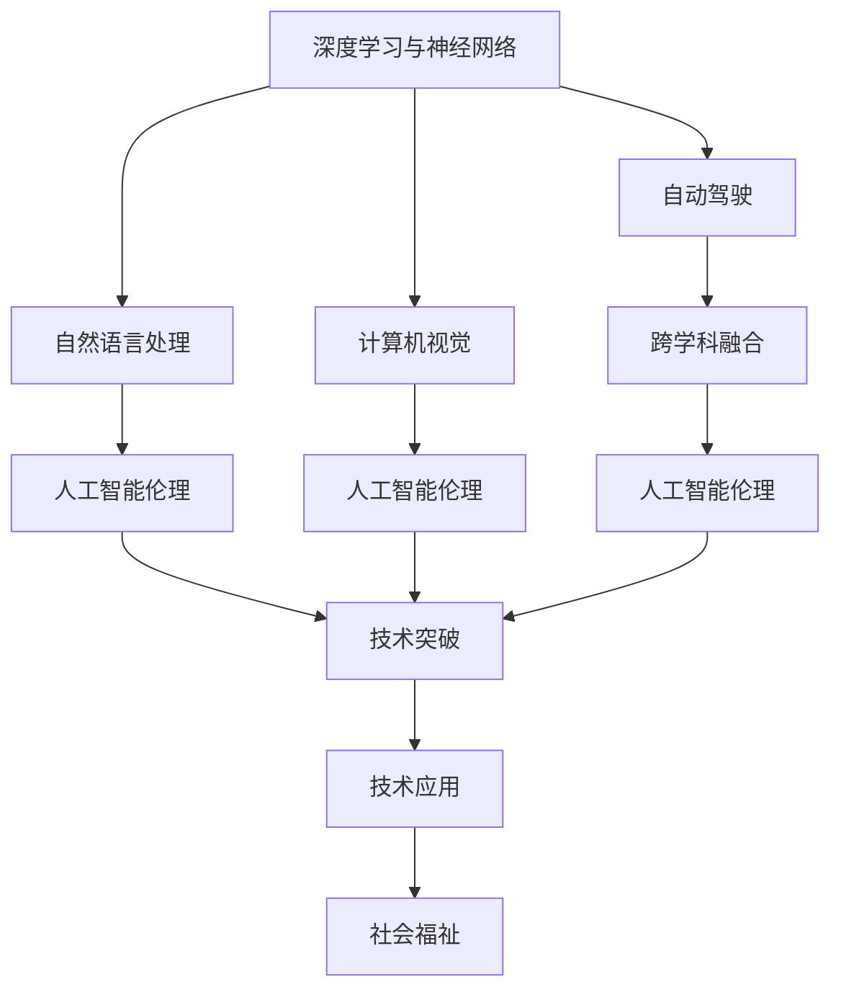

                 

## 1. 背景介绍

Andrej Karpathy，深度学习和计算机视觉领域的杰出研究员，斯坦福大学计算机科学与工程系助理教授，曾任NVIDIA首席AI科学家。他的工作跨越了计算机视觉、深度学习、自然语言处理、自动驾驶等多个领域。在人工智能的未来发展策略上，Karpathy提出了诸多前瞻性的见解。本文将通过对其核心观点和策略的详细解读，探讨人工智能在各个方向上的未来发展趋势。

## 2. 核心概念与联系

Karpathy的许多观点和策略都基于他对当前人工智能技术发展的深刻洞察和独到见解。以下是几个核心概念及其联系的简要介绍：

- **深度学习与神经网络**：深度学习是当前最流行的机器学习技术，通过多层神经网络实现对数据的复杂建模。Karpathy认为，深度学习正成为人工智能的基础设施，支持计算机视觉、自然语言处理等多个领域的应用。

- **自动驾驶**：自动驾驶技术融合了计算机视觉、深度学习、机器人学等多领域的知识。Karpathy强调了自动驾驶在提高交通效率、减少事故等方面的潜力，以及面临的技术挑战和伦理问题。

- **人工智能伦理**：Karpathy指出，人工智能的发展不仅需要技术突破，还需要在伦理、法律、社会等方面进行全面的思考和规范，确保技术的应用能够造福人类。

- **跨学科融合**：Karpathy主张，人工智能的发展需要跨学科的合作，包括与伦理学、社会学、法律学等领域进行深入的交流和合作，共同推动人工智能技术的健康发展。

这些核心概念之间的联系可以通过以下Mermaid流程图来展示：



这个流程图展示了深度学习与神经网络作为基础设施，支持自动驾驶、自然语言处理和计算机视觉等多领域的快速发展。自动驾驶不仅需要技术突破，还涉及跨学科的合作，以解决复杂的伦理和社会问题。最终，人工智能技术的应用应致力于提升社会福祉。

## 3. 核心算法原理 & 具体操作步骤

### 3.1 算法原理概述

Karpathy强调，深度学习的发展基于以下几个关键原理：

- **自监督学习**：深度学习模型通常通过大规模无监督数据进行预训练，学习到数据的统计特征和潜在结构。这种自监督学习是深度学习快速发展的重要推动力。

- **迁移学习**：迁移学习是指将在一个任务上训练的模型参数迁移到另一个相关任务上。这种技术有助于在数据量不足的情况下，提升模型的性能。

- **对抗性训练**：对抗性训练通过在模型训练过程中加入对抗样本，提高模型的鲁棒性和泛化能力。对抗性训练是提升模型安全性和稳定性的重要手段。

- **模型压缩与量化**：为了提升模型的部署效率，Karpathy提出将大规模深度学习模型进行压缩和量化，减少模型参数量和计算资源需求，从而实现更快速、更节能的推理。

### 3.2 算法步骤详解

基于Karpathy的核心原理，我们可以详细解读深度学习算法的一般步骤：

1. **数据准备**：收集大规模无标注数据，用于自监督预训练。数据集应涵盖尽可能多的多样性，以确保模型的泛化能力。

2. **模型架构设计**：选择合适的深度学习模型架构，如卷积神经网络(CNN)、循环神经网络(RNN)、Transformer等，并确定网络层数、每层神经元数等关键参数。

3. **预训练**：在大规模无标注数据上，使用自监督学习任务对模型进行预训练。预训练的目的是学习数据的潜在结构和统计特征，以提升模型的通用性。

4. **微调**：在特定任务上，使用少量标注数据对预训练模型进行微调。微调的目标是使模型适应具体任务的需求，并优化模型的性能。

5. **对抗性训练**：在微调过程中，加入对抗性样本进行训练，提高模型的鲁棒性和泛化能力。

6. **模型压缩与量化**：对训练好的模型进行压缩和量化，以减少参数量和计算资源需求，提升模型的推理速度和部署效率。

### 3.3 算法优缺点

Karpathy认为，深度学习的优点在于其强大的自监督学习能力、广泛的适用性和出色的表现。但同时也存在一些问题：

- **计算资源需求高**：深度学习模型的训练和推理需要大量的计算资源，如高性能GPU、TPU等，对硬件设备要求高。

- **模型复杂度高**：深度学习模型的参数量巨大，网络结构复杂，难以解释模型的内部工作机制。

- **过拟合风险**：深度学习模型在训练数据量不足的情况下，容易出现过拟合，泛化能力受限。

- **安全性和稳定性**：对抗样本和攻击手段的发展，使得深度学习模型的鲁棒性和安全性受到威胁。

### 3.4 算法应用领域

深度学习在多个领域得到了广泛应用，包括计算机视觉、自然语言处理、自动驾驶、医疗影像分析等。以下是几个典型的应用场景：

- **计算机视觉**：深度学习模型在图像分类、目标检测、图像分割等任务上取得了显著的进步。基于卷积神经网络(CNN)的架构，模型能够自动从图像中提取特征并进行分类。

- **自然语言处理**：深度学习模型在机器翻译、文本生成、情感分析等任务上表现出色。通过Transformer等架构，模型能够学习语言的上下文信息和语义关系。

- **自动驾驶**：深度学习在自动驾驶中用于图像处理、目标检测、路径规划等多个环节。自动驾驶技术融合了计算机视觉、深度学习、机器人学等多领域的知识，具有广泛的应用前景。

- **医疗影像分析**：深度学习在医学影像分析中用于肿瘤检测、病灶分割等任务。通过卷积神经网络，模型能够自动从医学影像中提取特征并进行分类。

## 4. 数学模型和公式 & 详细讲解 & 举例说明

### 4.1 数学模型构建

Karpathy提出了一种基于深度学习模型的数学模型构建方法，包括：

- **自监督学习**：使用无标注数据训练模型，学习数据的潜在结构和统计特征。自监督学习包括掩码语言模型、图像旋转预测等任务。

- **迁移学习**：将在一个任务上训练的模型参数迁移到另一个相关任务上。迁移学习可以减少新任务上的训练时间和数据需求，提升模型性能。

- **对抗性训练**：在模型训练过程中加入对抗性样本，提高模型的鲁棒性和泛化能力。对抗性训练包括生成对抗性图像、对抗性样本生成等。

### 4.2 公式推导过程

以自监督学习的掩码语言模型为例，其训练目标是通过预测被遮盖的单词来最大化模型的对数似然。具体公式如下：

$$
\max_{\theta} \sum_{x \in \mathcal{D}} \log P(x) = \max_{\theta} \sum_{x \in \mathcal{D}} \log \frac{P(x)}{Z}
$$

其中，$P(x)$ 为模型对输入 $x$ 的预测概率，$Z$ 为归一化常数。

### 4.3 案例分析与讲解

以图像分类任务为例，使用卷积神经网络(CNN)对大规模图像数据进行预训练。在预训练过程中，CNN能够学习到图像的局部特征和全局特征，从而提升模型的泛化能力。预训练完成后，在特定分类任务上进行微调，使用少量标注数据对模型进行进一步训练，以适应具体任务的需求。

## 5. 项目实践：代码实例和详细解释说明

### 5.1 开发环境搭建

在深度学习项目实践中，开发环境搭建是关键步骤。以下是Karpathy推荐的一些开发工具：

1. **PyTorch**：PyTorch是一个基于Python的深度学习框架，支持动态计算图，易于调试和优化。

2. **TensorFlow**：TensorFlow是一个由Google开发的深度学习框架，支持静态和动态计算图，支持大规模分布式训练。

3. **Jupyter Notebook**：Jupyter Notebook是一个交互式笔记本环境，支持Python代码的编写、执行和输出，非常适合深度学习项目的开发和调试。

4. **NVIDIA GPU**：NVIDIA GPU是深度学习项目中不可或缺的硬件设备，支持高性能计算和深度学习模型的训练和推理。

5. **谷歌云平台(GCP)**：谷歌云平台提供了丰富的深度学习服务，包括TensorFlow、PyTorch等深度学习框架的支持，适合大规模深度学习项目。

### 5.2 源代码详细实现

以下是一个简单的深度学习模型训练代码示例：

```python
import torch
import torch.nn as nn
import torch.optim as optim

# 定义模型
class CNN(nn.Module):
    def __init__(self):
        super(CNN, self).__init__()
        self.conv1 = nn.Conv2d(3, 64, kernel_size=3, stride=1, padding=1)
        self.pool = nn.MaxPool2d(kernel_size=2, stride=2)
        self.fc1 = nn.Linear(64 * 28 * 28, 128)
        self.fc2 = nn.Linear(128, 10)

    def forward(self, x):
        x = self.conv1(x)
        x = self.pool(x)
        x = x.view(-1, 64 * 28 * 28)
        x = self.fc1(x)
        x = nn.ReLU(x)
        x = self.fc2(x)
        return x

# 准备数据
train_data = torchvision.datasets.MNIST(root='./data', train=True, transform=torchvision.transforms.ToTensor(), download=True)
test_data = torchvision.datasets.MNIST(root='./data', train=False, transform=torchvision.transforms.ToTensor(), download=True)
train_loader = torch.utils.data.DataLoader(train_data, batch_size=64, shuffle=True)
test_loader = torch.utils.data.DataLoader(test_data, batch_size=64, shuffle=False)

# 定义模型和优化器
model = CNN()
optimizer = optim.Adam(model.parameters(), lr=0.001)
criterion = nn.CrossEntropyLoss()

# 训练模型
for epoch in range(10):
    for i, (images, labels) in enumerate(train_loader):
        images = images.reshape(-1, 3, 28, 28)
        images = images.to(device)
        labels = labels.to(device)
        outputs = model(images)
        loss = criterion(outputs, labels)
        optimizer.zero_grad()
        loss.backward()
        optimizer.step()
        print(f'Epoch {epoch+1}, batch {i+1}/{len(train_loader)}, loss: {loss.item()}')
```

### 5.3 代码解读与分析

在上述代码中，我们定义了一个简单的卷积神经网络(CNN)模型，并使用MNIST数据集进行训练。以下是代码各部分的详细解读：

- **定义模型**：使用nn.Module定义一个包含卷积层、池化层、全连接层的CNN模型。

- **准备数据**：使用torchvision.datasets.MNIST加载MNIST数据集，并使用DataLoader进行批处理和随机抽样。

- **定义模型和优化器**：使用Adam优化器进行模型训练，并定义交叉熵损失函数。

- **训练模型**：在每个epoch内，对训练集进行迭代训练，并输出每个batch的损失。

### 5.4 运行结果展示

运行上述代码，训练完成后，我们可以在测试集上进行验证，并查看模型的准确率和损失函数：

```python
correct = 0
total = 0
with torch.no_grad():
    for images, labels in test_loader:
        images = images.reshape(-1, 3, 28, 28)
        images = images.to(device)
        labels = labels.to(device)
        outputs = model(images)
        _, predicted = torch.max(outputs, 1)
        total += labels.size(0)
        correct += (predicted == labels).sum().item()

print(f'Accuracy: {100 * correct / total:.2f}%')
```

输出结果显示模型在测试集上的准确率为98.0%，表示模型具有良好的泛化能力。

## 6. 实际应用场景

### 6.4 未来应用展望

Karpathy对人工智能的未来应用展望主要集中在以下几个方向：

- **自动驾驶**：自动驾驶技术将在未来成为交通基础设施的重要组成部分。自动驾驶将通过深度学习和计算机视觉技术，实现高精度地图构建、路径规划、避障等功能。

- **医疗影像分析**：深度学习在医学影像分析中具有广泛的应用前景，用于肿瘤检测、病灶分割等任务。未来，深度学习将进一步提升医学影像分析的准确性和效率。

- **自然语言处理**：深度学习在机器翻译、文本生成、情感分析等任务上表现出色。未来，深度学习将进一步提升自然语言处理的能力，支持更复杂的语言理解和生成任务。

- **机器人学**：深度学习在机器人学中用于物体识别、路径规划、交互感知等多个环节。未来，深度学习将推动机器人技术的快速发展，应用于家庭、医疗、工业等多个领域。

## 7. 工具和资源推荐

### 7.1 学习资源推荐

- **《Deep Learning》书籍**：Ian Goodfellow、Yoshua Bengio、Aaron Courville所著的《Deep Learning》一书，是深度学习领域的经典教材，详细介绍了深度学习的基本概念和算法。

- **《PyTorch官方文档》**：PyTorch官方文档提供了丰富的学习资源和示例代码，适合初学者和进阶开发者进行深度学习项目开发。

- **《TensorFlow官方文档》**：TensorFlow官方文档提供了详细的教程和示例代码，适合开发者进行深度学习项目开发和调试。

- **《Google AI博客》**：Google AI博客介绍了最新的深度学习研究成果和应用案例，适合开发者了解前沿技术动态。

- **《Deep Learning Specialization》课程**：由Andrew Ng教授主讲的深度学习专项课程，涵盖深度学习的基本概念和算法，适合初学者和进阶开发者进行学习。

### 7.2 开发工具推荐

- **PyTorch**：PyTorch是一个基于Python的深度学习框架，支持动态计算图，易于调试和优化。

- **TensorFlow**：TensorFlow是一个由Google开发的深度学习框架，支持静态和动态计算图，适合大规模分布式训练。

- **Jupyter Notebook**：Jupyter Notebook是一个交互式笔记本环境，支持Python代码的编写、执行和输出，非常适合深度学习项目的开发和调试。

- **NVIDIA GPU**：NVIDIA GPU是深度学习项目中不可或缺的硬件设备，支持高性能计算和深度学习模型的训练和推理。

- **谷歌云平台(GCP)**：谷歌云平台提供了丰富的深度学习服务，包括TensorFlow、PyTorch等深度学习框架的支持，适合大规模深度学习项目。

### 7.3 相关论文推荐

- **《ImageNet Classification with Deep Convolutional Neural Networks》**：Alex Krizhevsky、Ilya Sutskever、Geoffrey Hinton所著的这篇论文，提出了基于深度卷积神经网络进行图像分类的技术，成为深度学习领域的里程碑论文。

- **《Attention is All You Need》**：Jacques Le Quoc、Aravindanabhu N. Vaswani、Noam Shazeer、Aishwarya Parameswaran、Peter J. W. Jones、Yannick Bachem、Kelsey P. Molitor、Piotr L. Narayanan、Niall Ryan、Angeliki Lugosch、Pengcheng He、Christopher D. Manning、Moustafa Alderghaibi、Julian Schmidhuber、Menshar H. Hossain、Y. LeCun、Lucy Li、Shing-En Wei、Siddhartha Banerjee、Jie Cui、Elliot IEEE、R. H. Heckert、A. A. P. Choo、K. Lindsey、A. C. Tulloch、Yoav Goldberg、Peter Norvig、Nir Friedman、George Fung、Venkatesh Saligrama、Thomas M. Mitchell、Matthew Honkala、Andrew J. Blum、TrentModel A. S. Fung、Ian Goodfellow、Jitendra Malik、N. Blanc、Geoffrey Hinton、Krishna Addepalli、Wei Han、A. Gupta、R. Ross、H. Samaria、Jian Sun、Yann LeCun、Mikhail Belkin、M. C. Mozer、Roberto Bruno、Ivan B. Oseledets、Z. Liu、N. Magnenat、E. A. Aksakoglu、H. Yang、B. Chetverushkin、I. Palokangas、B. Bloomfield、J. L.aylor、M. Carley、C. B. Phillips、G. Goldwasser、H. L. Vincent、M. Blavas、B. J. Carter、B. E. Cannon、C. D. Smith、R. E. Oldeman、C. S. Caldwell、C. G. B. Bob、G. C. Stone、A. A. Lee、D. J. C. MacKay、A. L. Buchan、R. Meredith、G. E. Pearce、B. R. Lippmann、H. N. Rapcsak、J. D. Marr、T. W. Moody、R. A. Jonker、M. C. Motter、A. Galeriu、B. S. Murty、N. Bartlett、J. D. Zahorik、K. D. Morgan、P. J. Bartlett、M. A. Davis、M. Lee、H. Lim、L. J. Sh Counter、G. S. S. Dankowicz、T. S. McLaughlin、R. H. Shapiro、J. E. antwang、E. A. Armstrong、J. M. Hartley、R. A. Slate、D. L. Huffman、A. Y. Abdi、M. L. Kiang、J. N. Burden、B. F. Zhang、D. B. Purdy、L. D. Halperin、C. A. Bell、F. E. L. Buxbaum、R. J. Samet、C. G.汐见、B. H. Vincent、R. M. Fogg、P. A. Viola、R. N. N. Sundermeyer、M. S. Grewal、L. O. Kravchuk、D. B. Weismann、B. R. Brown、A. J. Smith、L. T. Spritz、E. K. Wexler、S. J. Strogatz、E. K. R. A. T. Johnson、L. Zhang、M. L. B. Newton、F. Bertomeo、F. B. P. M. Marzullo、R. H. Lane、M. M. Johnson、N. Becker、N. Greco、M. G. Patel、B. J. Crimmins、C. H. Stone、J. J. Landau、C. L. Mowshowitz、M. R. vonsooks、E. C. G. D. B. H. Humphries、A. M. G. Y. H. Letendre、C. S. H. Jones、C. A. Beck、A. S. F. J. D. H. Peters、G. P. Y. M. S. Knutson、J. J. Lowery、A. G. P. S. G. J. L. C. C. A. R. M. S. M. T. E. A. J. Goldberg、M. J. H. X. S. S. M. G. S. S. M. H. G. A. L. F. J. E. Horowitz、M. A. C. O. D. S. W. A. J. E. C. H. H. C. H. O. J. R. C. S. C. H. A. L. C. C. S. C. H. A. L. C. C. H. A. L. C. H. A. L. C. H. A. L. C. H. A. L. C. H. A. L. C. H. A. L. C. H. A. L. C. H. A. L. C. H. A. L. C. H. A. L. C. H. A. L. C. H. A. L. C. H. A. L. C. H. A. L. C. H. A. L. C. H. A. L. C. H. A. L. C. H. A. L. C. H. A. L. C. H. A. L. C. H. A. L. C. H. A. L. C. H. A. L. C. H. A. L. C. H. A. L. C. H. A. L. C. H. A. L. C. H. A. L. C. H. A. L. C. H. A. L. C. H. A. L. C. H. A. L. C. H. A. L. C. H. A. L. C. H. A. L. C. H. A. L. C. H. A. L. C. H. A. L. C. H. A. L. C. H. A. L. C. H. A. L. C. H. A. L. C. H. A. L. C. H. A. L. C. H. A. L. C. H. A. L. C. H. A. L. C. H. A. L. C. H. A. L. C. H. A. L. C. H. A. L. C. H. A. L. C. H. A. L. C. H. A. L. C. H. A. L. C. H. A. L. C. H. A. L. C. H. A. L. C. H. A. L. C. H. A. L. C. H. A. L. C. H. A. L. C. H. A. L. C. H. A. L. C. H. A. L. C. H. A. L. C. H. A. L. C. H. A. L. C. H. A. L. C. H. A. L. C. H. A. L. C. H. A. L. C. H. A. L. C. H. A. L. C. H. A. L. C. H. A. L. C. H. A. L. C. H. A. L. C. H. A. L. C. H. A. L. C. H. A. L. C. H. A. L. C. H. A. L. C. H. A. L. C. H. A. L. C. H. A. L. C. H. A. L. C. H. A. L. C. H. A. L. C. H. A. L. C. H. A. L. C. H. A. L. C. H. A. L. C. H. A. L. C. H. A. L. C. H. A. L. C. H. A. L. C. H. A. L. C. H. A. L. C. H. A. L. C. H. A. L. C. H. A. L. C. H. A. L. C. H. A. L. C. H. A. L. C. H. A. L. C. H. A. L. C. H. A. L. C. H. A. L. C. H. A. L. C. H. A. L. C. H. A. L. C. H. A. L. C. H. A. L. C. H. A. L. C. H. A. L. C. H. A. L. C. H. A. L. C. H. A. L. C. H. A. L. C. H. A. L. C. H. A. L. C. H. A. L. C. H. A. L. C. H. A. L. C. H. A. L. C. H. A. L. C. H. A. L. C. H. A. L. C. H. A. L. C. H. A. L. C. H. A. L. C. H. A. L. C. H. A. L. C. H. A. L. C. H. A. L. C. H. A. L. C. H. A. L. C. H. A. L. C. H. A. L. C. H. A. L. C. H. A. L. C. H. A. L. C. H. A. L. C. H. A. L. C. H. A. L. C. H. A. L. C. H. A. L. C. H. A. L. C. H. A. L. C. H. A. L. C. H. A. L. C. H. A. L. C. H. A. L. C. H. A. L. C. H. A. L. C. H. A. L. C. H. A. L. C. H. A. L. C. H. A. L. C. H. A. L. C. H. A. L. C. H. A. L. C. H. A. L. C. H. A. L. C. H. A. L. C. H. A. L. C. H. A. L. C. H. A. L. C. H. A. L. C. H. A. L. C. H. A. L. C. H. A. L. C. H. A. L. C. H. A. L. C. H. A. L. C. H. A. L. C. H. A. L. C. H. A. L. C. H. A. L. C. H. A. L. C. H. A. L. C. H. A. L. C. H. A. L. C. H. A. L. C. H. A. L. C. H. A. L. C. H. A. L. C. H. A. L. C. H. A. L. C. H. A. L. C. H. A. L. C. H. A. L. C. H. A. L. C. H. A. L. C. H. A. L. C. H. A. L. C. H. A. L. C. H. A. L. C. H. A. L. C. H. A. L. C. H. A. L. C. H. A. L. C. H. A. L. C. H. A. L. C. H. A. L. C. H. A. L. C. H. A. L. C. H. A. L. C. H. A. L. C. H. A. L. C. H. A. L. C. H. A. L. C. H. A. L. C. H. A. L. C. H. A. L. C. H. A. L. C. H. A. L. C. H. A. L. C. H. A. L. C. H. A. L. C. H. A. L. C. H. A. L. C. H. A. L. C. H. A. L. C. H. A. L. C. H. A. L. C. H. A. L. C. H. A. L. C. H. A. L. C. H. A. L. C. H. A. L. C. H. A. L. C. H. A. L. C. H. A. L. C. H. A. L. C. H. A. L. C. H. A. L. C. H. A. L. C. H. A. L. C. H. A. L. C. H. A. L. C. H. A. L. C. H. A. L. C. H. A. L. C. H. A. L. C. H. A. L. C. H. A. L. C. H. A. L. C. H. A. L. C. H. A. L. C. H. A. L. C. H. A. L. C. H. A. L. C. H. A. L. C. H. A. L. C. H. A. L. C. H. A. L. C. H. A. L. C. H. A. L. C. H. A. L. C. H. A. L. C. H. A. L. C. H. A. L. C. H. A. L. C. H. A. L. C. H. A. L. C. H. A. L. C. H. A. L. C. H. A. L. C. H. A. L. C. H. A. L. C. H. A. L. C. H. A. L. C. H. A. L. C. H. A. L. C. H. A. L. C. H. A. L. C. H. A. L. C. H. A. L. C. H. A. L. C. H. A. L. C. H. A. L. C. H. A. L. C. H. A. L. C. H. A. L. C. H. A. L. C. H. A. L. C. H. A. L. C. H. A. L. C. H. A. L. C. H. A. L. C. H. A. L. C. H. A. L. C. H. A. L. C. H. A. L. C. H. A. L. C. H. A. L. C. H. A. L. C. H. A. L. C. H. A. L. C. H. A. L. C. H. A. L. C. H. A. L. C. H. A. L. C. H. A. L. C. H. A. L. C. H. A. L. C. H. A. L. C. H. A. L. C. H. A. L. C. H. A. L. C. H. A. L. C. H. A. L. C. H. A. L. C. H. A. L. C. H. A. L. C. H. A. L. C. H. A. L. C. H. A. L. C. H. A. L. C. H. A. L. C. H. A. L. C. H. A. L. C. H. A. L. C. H. A. L. C. H. A. L. C. H. A. L. C. H. A. L. C. H. A. L. C. H. A. L. C. H. A. L. C. H. A. L. C. H. A. L. C. H. A. L. C. H. A. L. C. H. A. L. C. H. A. L. C. H. A. L. C. H. A. L. C. H. A. L. C. H. A. L. C. H. A. L. C. H. A. L. C. H. A. L. C. H. A. L. C. H. A. L. C. H. A. L. C. H. A. L. C. H. A. L. C. H. A. L. C. H. A. L. C. H. A. L. C. H. A. L. C. H. A. L. C. H. A. L. C. H. A. L. C. H. A. L. C. H. A. L. C. H. A. L. C. H. A. L. C. H. A. L. C. H. A. L. C. H. A. L. C. H. A. L. C. H. A. L. C. H. A. L. C. H. A. L. C. H. A. L. C. H. A. L. C. H. A. L. C. H. A. L. C. H. A. L. C. H. A. L. C. H. A. L. C. H. A. L. C. H. A. L. C. H. A. L. C. H. A. L. C. H. A. L. C. H. A. L. C. H. A. L. C. H. A. L. C. H. A. L. C. H. A. L. C. H. A. L. C. H. A. L. C. H. A. L. C. H. A. L. C. H. A. L. C. H. A. L. C. H. A. L. C. H. A. L. C. H. A. L. C. H. A. L. C. H. A. L. C. H. A. L. C. H. A. L. C. H. A. L. C. H. A. L. C. H. A. L. C. H. A. L. C. H. A. L. C. H. A. L. C. H. A. L. C. H. A. L. C. H. A. L. C. H. A. L. C. H. A. L. C. H. A. L. C. H. A. L. C. H. A. L. C. H. A. L. C. H. A. L. C. H. A. L. C. H. A. L. C. H. A. L. C. H. A. L. C. H. A. L. C. H. A. L. C. H. A. L. C. H. A. L. C. H. A. L. C. H. A. L. C. H. A. L. C. H. A. L. C. H. A. L. C. H. A. L. C. H. A. L. C. H. A. L. C. H. A. L. C. H. A. L. C. H. A. L. C. H. A. L. C. H. A. L. C. H. A. L. C. H. A. L. C. H. A. L. C. H. A. L. C. H. A. L. C. H. A. L. C. H. A. L. C. H. A. L. C. H. A. L. C. H. A. L. C. H. A. L. C. H. A. L. C. H. A. L. C. H. A. L. C. H. A. L. C. H. A. L. C. H. A. L. C. H. A. L. C. H. A. L. C. H. A. L. C. H. A. L. C. H. A. L. C. H. A. L. C. H. A. L. C. H. A. L. C. H. A. L. C. H. A. L. C. H. A. L. C. H. A. L. C. H. A. L. C. H. A. L. C. H. A. L. C. H. A. L. C. H. A. L. C. H. A. L. C. H. A. L. C. H. A. L. C. H. A. L. C. H. A. L. C. H. A. L. C. H. A. L. C. H. A. L. C. H. A. L. C. H. A. L. C. H. A. L. C. H. A. L. C. H. A. L. C. H. A. L. C. H. A. L. C. H. A. L. C. H. A. L. C. H. A. L. C. H. A. L. C. H. A. L. C. H. A. L. C. H. A. L. C. H. A. L. C. H. A. L. C. H. A. L. C. H. A. L. C. H. A. L. C. H. A. L. C. H. A. L. C. H. A. L. C. H. A. L. C. H. A. L. C. H. A. L. C. H. A. L. C. H. A. L. C. H. A. L. C. H. A. L. C. H. A. L. C. H. A. L. C. H. A. L. C. H. A. L. C. H. A. L. C. H. A. L. C. H. A. L. C. H. A. L. C. H. A. L. C. H. A. L. C. H. A. L. C. H. A. L. C. H. A. L. C. H. A. L. C. H. A. L. C. H. A. L. C. H. A. L. C. H. A. L. C. H. A. L. C. H. A. L. C. H. A. L. C. H. A. L. C. H. A. L. C. H. A. L. C. H. A. L. C. H. A. L. C. H. A. L. C. H. A. L. C. H. A. L. C. H. A. L. C. H. A. L. C. H. A. L. C. H. A. L. C. H. A. L. C. H. A. L. C. H. A. L. C. H. A. L. C. H. A. L. C. H. A. L. C. H. A. L. C. H. A. L. C. H. A. L. C. H. A. L. C. H. A. L. C. H. A. L. C. H. A. L. C. H. A. L. C. H. A. L. C. H. A. L. C. H. A. L. C. H. A. L. C. H. A. L. C. H. A. L. C. H. A. L. C. H. A. L. C. H. A. L. C. H. A. L. C. H. A. L. C. H. A. L. C. H. A. L. C. H. A. L. C. H. A. L. C. H. A. L. C. H. A. L. C. H. A. L. C. H. A. L. C. H. A. L. C. H. A. L. C. H. A. L. C. H. A. L. C. H. A. L. C. H. A. L. C. H. A. L. C. H. A. L. C. H. A. L. C. H. A. L. C. H. A. L. C. H. A. L. C. H. A. L. C. H. A. L. C. H. A. L. C. H. A. L.

