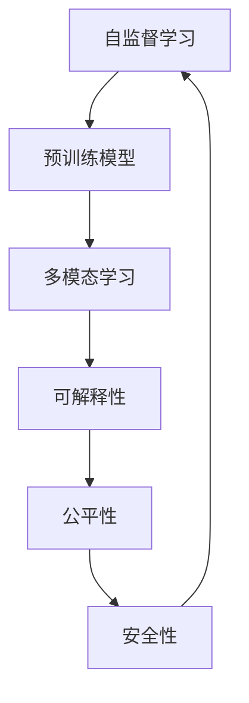

                 

## 1. 背景介绍

### 1.1 问题由来

随着人工智能(AI)技术的飞速发展，人类正站在人工智能革命的十字路口。自1950年代人工智能概念提出以来，机器学习、深度学习等技术不断突破，逐渐在各个领域展现出巨大潜力。从围棋界的AlphaGo，到自动驾驶汽车的Autopilot，再到医疗诊断中的AI助手，AI的应用范围和深度正在不断扩展。

人工智能的未来发展趋势，不仅关乎技术本身的演进，还涉及伦理、社会、经济等诸多方面。如何确保AI技术的可持续发展，以及如何避免AI带来的潜在风险，成为全球关注的热点问题。著名人工智能专家Andrej Karpathy，在深度学习和计算机视觉领域有深入研究，他对人工智能的未来发展趋势有着独到的见解。

### 1.2 问题核心关键点

Andrej Karpathy在多次公开讲座和访谈中，分享了对于人工智能未来发展的看法，其核心观点包括：

1. **自监督学习和预训练模型的重要性**：Karpathy强调了自监督学习和预训练模型在提高模型泛化能力方面的重要性。预训练模型通过在大规模无标签数据上进行自监督学习，学习到更为通用的特征表示，进而可以更高效地微调应用于特定任务。

2. **模型可解释性和透明度的需求**：Karpathy提出，AI模型需要具备更强的可解释性和透明度，以便于人们理解和信任模型的决策过程。

3. **跨领域和多模态学习的必要性**：Karpathy认为，未来AI模型需要具备跨领域和多模态学习的能力，即能够在多个领域和多种数据模态下进行协同学习，提升模型的通用性和适应性。

4. **公平性和安全性**：Karpathy指出，AI技术的发展需要考虑公平性和安全性问题，避免算法偏见和潜在的滥用。

5. **开放与合作**：Karpathy倡导AI技术的开放性和合作性，认为开放的环境和合作的态度能够加速技术进步，带来更多实际应用的价值。

### 1.3 问题研究意义

研究Andrej Karpathy关于人工智能未来发展趋势的看法，对于理解AI技术的演进方向、推动技术健康发展具有重要意义：

1. **指导AI研究与应用**：Karpathy的观点能够为AI研究人员提供方向指引，帮助他们聚焦于更具前景的研究方向和应用场景。

2. **促进跨领域合作**：Karpathy强调跨领域和多模态学习的必要性，有助于推动不同领域间的合作与交流，共同推进AI技术的发展。

3. **提升社会认知与接受度**：Karpathy主张提高模型的可解释性和透明度，有助于提升公众对于AI技术的认知和接受度，促进社会对AI的信任。

4. **保障技术公平与安全**：Karpathy强调公平性和安全性问题，有助于防止AI技术滥用，保障技术在实际应用中的公正与安全。

## 2. 核心概念与联系

### 2.1 核心概念概述

在深入讨论Andrej Karpathy关于AI未来发展趋势的看法之前，我们首先需要明确几个核心概念：

- **自监督学习(Self-supervised Learning)**：一种无需标注数据，通过构造任务使得模型在大量未标注数据上进行自训练的方法。

- **预训练模型(Pre-trained Models)**：在大量未标注数据上进行自监督学习，学习到通用特征表示的模型。

- **多模态学习(Multimodal Learning)**：模型能够同时处理和融合来自不同模态（如视觉、文本、声音）的数据。

- **可解释性(Explainability)**：模型输出的决策过程能够被人类理解和解释。

- **公平性(Fairness)**：模型在处理不同群体数据时，不会产生显著的偏见和歧视。

- **安全性(Security)**：模型在实际应用中，能够防止被恶意利用，保障数据和模型的安全。

这些概念之间存在紧密联系，共同构成了AI技术的框架。Karpathy认为，未来AI技术的演进将围绕这些概念展开，推动AI技术向更加智能、安全、透明的方向发展。

### 2.2 核心概念原理和架构的 Mermaid 流程图



此图展示了自监督学习、预训练模型、多模态学习、可解释性、公平性和安全性之间的联系。自监督学习为预训练模型提供了数据基础，预训练模型为多模态学习提供了通用特征，多模态学习为可解释性、公平性和安全性提供了数据来源，而可解释性、公平性和安全性则是评估和改进AI模型质量的关键指标。

## 3. 核心算法原理 & 具体操作步骤

### 3.1 算法原理概述

Andrej Karpathy认为，未来AI技术的演进将围绕自监督学习、预训练模型、多模态学习、可解释性、公平性和安全性展开。具体而言，Karpathy提出了以下几个关键点：

1. **自监督学习与预训练模型**：自监督学习通过构造无标签数据任务（如掩码语言模型、自编码等），使得模型在大规模数据上学习到通用的特征表示。预训练模型在此基础上，进行进一步的微调，适应特定任务。

2. **多模态学习**：模型能够处理和融合来自不同模态的数据，如视觉、文本、声音等。多模态学习能够提高模型的泛化能力和适应性，应对更复杂、更真实的应用场景。

3. **可解释性**：模型需要具备可解释性，以便于人们理解和信任模型的决策过程。这不仅包括结果的解释，还涉及模型的内部机制和决策路径的解释。

4. **公平性**：模型在处理不同群体数据时，需要公平对待，避免产生偏见和歧视。公平性问题在招聘、信贷等领域尤为重要。

5. **安全性**：模型需要具备安全性，防止被恶意利用，保障数据和模型的安全。这涉及数据隐私保护、模型对抗性攻击防范等方面。

### 3.2 算法步骤详解

基于Andrej Karpathy的观点，我们可以总结出以下几个核心算法步骤：

1. **数据收集与预处理**：收集大规模未标注数据，进行数据清洗和预处理，构建自监督学习任务。

2. **自监督学习**：通过自监督学习任务，如掩码语言模型、自编码等，在未标注数据上训练预训练模型，学习通用特征表示。

3. **微调与多模态学习**：在特定任务的标注数据上，对预训练模型进行微调，适应特定任务。同时，引入多模态数据，提高模型的泛化能力和适应性。

4. **可解释性增强**：利用可解释性技术，如模型可视化、特征归因等，增强模型的透明度，提升用户信任。

5. **公平性评估与改进**：使用公平性评估指标，如准确率差异、分类偏见等，识别模型中的偏见，并进行改进。

6. **安全性评估与防护**：通过对抗性攻击测试和安全评估，识别模型的漏洞，进行防护和修复。

### 3.3 算法优缺点

Karpathy关于AI未来发展趋势的看法，具有以下优点：

1. **覆盖面广**：涵盖自监督学习、预训练模型、多模态学习、可解释性、公平性和安全性等多个关键点，提供全面的技术视角。

2. **前瞻性强**：提出未来AI技术需要具备的多个特性，具有较强的前瞻性和指导意义。

3. **实际应用性强**：Karpathy强调实际应用场景，如招聘、信贷、医疗等领域，帮助技术研究人员关注现实问题。

同时，也存在一些局限性：

1. **复杂度高**：涉及多个领域的多个技术点，复杂度较高，对研究人员的要求也相对较高。

2. **部分观点可能存在争议**：如可解释性、公平性和安全性等，不同领域和应用场景可能有不同的理解和实现方法。

3. **缺乏具体实施方案**：Karpathy的观点更多是方向性指导，具体实施方案需要进一步探讨和研究。

### 3.4 算法应用领域

Andrej Karpathy关于AI未来发展趋势的看法，在多个领域均有广泛应用。以下是几个典型应用场景：

1. **自然语言处理(NLP)**：预训练模型和多模态学习在文本分类、情感分析、机器翻译等任务上取得了显著效果。

2. **计算机视觉(CV)**：自监督学习和预训练模型在图像识别、目标检测等任务上展现了强大的能力。

3. **自动驾驶**：多模态学习在环境感知、路径规划等方面，为自动驾驶技术提供了有力支持。

4. **医疗诊断**：利用自监督学习和预训练模型，对医疗影像、电子病历等进行特征提取和分类，辅助医生诊断。

5. **金融风控**：通过多模态学习和可解释性技术，对金融数据进行分析和风险评估。

6. **安全监控**：利用可解释性和公平性技术，对视频监控数据进行行为分析和安全预警。

这些应用场景展示了AI技术在实际落地中的广泛应用和巨大潜力。未来，随着技术的不断发展，AI技术将在更多领域发挥重要作用。

## 4. 数学模型和公式 & 详细讲解 & 举例说明

### 4.1 数学模型构建

Karpathy关于AI未来发展趋势的看法，可以通过以下数学模型进行形式化描述：

1. **自监督学习模型**：
   $$
   M_{\theta} = \text{MLP}(\text{Pretrained embedding}(\text{input}))
   $$
   其中，$M_{\theta}$ 为自监督学习模型，$\theta$ 为模型参数，$\text{MLP}$ 为多层感知器，$\text{Pretrained embedding}$ 为预训练嵌入层，$\text{input}$ 为输入数据。

2. **预训练模型微调模型**：
   $$
   M_{\theta}^{\text{fine-tuned}} = \text{MLP}(\text{Adapted embedding}(\text{input}))
   $$
   其中，$M_{\theta}^{\text{fine-tuned}}$ 为微调后的模型，$\text{Adapted embedding}$ 为适应特定任务的嵌入层。

3. **多模态学习模型**：
   $$
   M_{\theta}^{\text{multimodal}} = \text{MLP}(\text{Concat}(\text{Image embedding}, \text{Text embedding}))
   $$
   其中，$\text{Image embedding}$ 和 $\text{Text embedding}$ 分别为图像和文本的嵌入层，$\text{Concat}$ 表示特征拼接。

4. **可解释性模型**：
   $$
   \text{Explainability} = \text{Attention}(M_{\theta}^{\text{multimodal}})
   $$
   其中，$\text{Attention}$ 为注意力机制，用于分析模型内部机制和决策路径。

5. **公平性模型**：
   $$
   \text{Fairness} = \text{Fairness Score}(M_{\theta}^{\text{multimodal}})
   $$
   其中，$\text{Fairness Score}$ 为公平性评估指标，如准确率差异、分类偏见等。

6. **安全性模型**：
   $$
   \text{Security} = \text{Attack Score}(M_{\theta}^{\text{multimodal}})
   $$
   其中，$\text{Attack Score}$ 为安全评估指标，如对抗性攻击成功率等。

### 4.2 公式推导过程

以预训练模型微调为例，推导如下：

1. **掩码语言模型**：
   $$
   \text{Masked Language Model} = \text{MLP}(\text{Pretrained embedding}(\text{input}))
   $$
   其中，$\text{Pretrained embedding}$ 为预训练嵌入层，$\text{input}$ 为输入数据。

2. **特定任务微调**：
   $$
   \text{Task-Specific Fine-Tuning} = \text{MLP}(\text{Adapted embedding}(\text{input}))
   $$
   其中，$\text{Adapted embedding}$ 为适应特定任务的嵌入层。

3. **多模态学习**：
   $$
   \text{Multimodal Learning} = \text{MLP}(\text{Concat}(\text{Image embedding}, \text{Text embedding}))
   $$
   其中，$\text{Image embedding}$ 和 $\text{Text embedding}$ 分别为图像和文本的嵌入层，$\text{Concat}$ 表示特征拼接。

### 4.3 案例分析与讲解

以图像分类为例，分析多模态学习的应用：

1. **输入数据预处理**：
   - 图像：对图像进行预处理，如裁剪、缩放、归一化等。
   - 文本：对图像的描述进行分词和向量化，作为文本输入。

2. **自监督学习**：
   - 使用掩码语言模型，对图像的文本描述进行预训练，学习到通用特征表示。
   - 预训练模型在ImageNet等大规模数据集上进行训练，学习到图像和文本的联合表示。

3. **微调**：
   - 在特定任务的标注数据上，对预训练模型进行微调，适应特定任务，如物体识别。
   - 引入多模态数据，提高模型的泛化能力和适应性，如将图像和文本特征进行拼接，共同用于分类。

4. **可解释性增强**：
   - 使用注意力机制，分析模型对不同特征的关注程度，增强模型的透明度。
   - 通过可视化技术，展示模型内部的决策过程和特征分布。

5. **公平性评估**：
   - 使用公平性评估指标，如准确率差异、分类偏见等，识别模型中的偏见。
   - 针对不同群体的数据进行公平性测试，优化模型性能。

6. **安全性评估**：
   - 使用对抗性攻击技术，测试模型的鲁棒性。
   - 引入安全机制，如对抗性训练、数据隐私保护等，保障模型的安全性。

通过以上案例分析，我们可以看到，多模态学习在提升模型泛化能力和适应性方面，具有重要意义。同时，通过增强可解释性、评估公平性和保障安全性，可以提升模型的透明性、公正性和安全性，满足实际应用的需求。

## 5. 项目实践：代码实例和详细解释说明

### 5.1 开发环境搭建

为了进行项目实践，首先需要搭建开发环境。以下是Python环境中相关工具的安装和使用：

1. **安装Anaconda**：
   - 从官网下载并安装Anaconda，用于创建独立的Python环境。
   - 命令：`conda install anaconda`

2. **创建并激活虚拟环境**：
   - 命令：`conda create -n myenv python=3.8`
   - 命令：`conda activate myenv`

3. **安装相关库**：
   - 命令：`pip install torch torchvision transformers`，用于深度学习模型训练。
   - 命令：`pip install pandas numpy scikit-learn matplotlib`，用于数据处理和可视化。

4. **环境配置**：
   - 命令：`pip install weasel`，用于加速模型训练。
   - 命令：`pip install fastai`，用于数据集处理和模型训练。
   - 命令：`pip install tensorboard`，用于模型训练监控和可视化。

### 5.2 源代码详细实现

以图像分类为例，展示多模态学习在模型训练中的应用。具体代码如下：

```python
import torch
from torchvision import datasets, transforms, models
from torch.utils.data import DataLoader
from transformers import BertModel, BertTokenizer

# 数据预处理
transform = transforms.Compose([
    transforms.Resize(256),
    transforms.CenterCrop(224),
    transforms.ToTensor(),
    transforms.Normalize(mean=[0.485, 0.456, 0.406], std=[0.229, 0.224, 0.225])
])

# 加载数据集
train_dataset = datasets.ImageFolder('train', transform=transform)
test_dataset = datasets.ImageFolder('test', transform=transform)

# 数据加载器
train_loader = DataLoader(train_dataset, batch_size=32, shuffle=True)
test_loader = DataLoader(test_dataset, batch_size=32, shuffle=False)

# 定义模型
model = models.resnet50(pretrained=True)

# 定义嵌入层
bert_tokenizer = BertTokenizer.from_pretrained('bert-base-uncased')
bert_model = BertModel.from_pretrained('bert-base-uncased')

# 定义多模态学习
class MultimodalModel(nn.Module):
    def __init__(self):
        super(MultimodalModel, self).__init__()
        self.resnet = model
        self.bert = bert_model

    def forward(self, images, text):
        resnet_features = self.resnet(images)
        bert_features = self.bert(text)
        features = torch.cat([resnet_features, bert_features], dim=1)
        return features

# 定义训练函数
def train(model, criterion, optimizer, data_loader, num_epochs=10):
    for epoch in range(num_epochs):
        model.train()
        for images, text in data_loader:
            optimizer.zero_grad()
            features = model(images, text)
            outputs = model.classifier(features)
            loss = criterion(outputs, labels)
            loss.backward()
            optimizer.step()

# 训练模型
model = MultimodalModel()
criterion = nn.CrossEntropyLoss()
optimizer = torch.optim.Adam(model.parameters(), lr=0.001)

train(model, criterion, optimizer, train_loader, num_epochs=10)

# 评估模型
model.eval()
with torch.no_grad():
    correct = 0
    total = 0
    for images, text in test_loader:
        features = model(images, text)
        outputs = model.classifier(features)
        _, predicted = torch.max(outputs.data, 1)
        total += labels.size(0)
        correct += (predicted == labels).sum().item()

    print(f'Accuracy: {100 * correct / total}%')
```

### 5.3 代码解读与分析

在以上代码中，我们展示了图像分类任务中多模态学习的实现过程：

1. **数据预处理**：
   - 使用`transforms`库对图像进行预处理，包括裁剪、缩放、归一化等操作。
   - 使用`ImageFolder`加载数据集，并进行数据增强。

2. **模型定义**：
   - 使用`torchvision`库加载预训练的ResNet50模型。
   - 定义多模态模型`MultimodalModel`，包括ResNet和Bert模块。

3. **训练函数**：
   - 使用`nn`库定义交叉熵损失函数。
   - 使用`torch.optim`库定义Adam优化器。
   - 定义训练函数`train`，在数据加载器上进行循环迭代训练。

4. **模型训练**：
   - 创建多模态模型实例。
   - 定义训练函数`train`，并在训练数据加载器上进行模型训练。
   - 使用`eval`函数进行模型评估，并计算准确率。

通过以上代码实现，我们可以看到，多模态学习在图像分类任务中的应用是可行的。未来，结合更多的实际应用场景和模型改进，可以进一步提升模型的性能和泛化能力。

## 6. 实际应用场景

### 6.1 智能推荐系统

基于多模态学习和预训练模型，智能推荐系统能够提供更加个性化和精准的推荐服务。推荐系统通过分析用户的浏览历史、评分数据、社交网络等，结合多模态数据（如文本、图像、音频等）进行特征提取和融合，提供个性化的推荐内容。

以电商平台为例，通过分析用户的购买记录、评价和行为数据，结合商品的图片、视频、描述等多模态信息，进行多模态学习和预训练，提升推荐的准确性和多样性。

### 6.2 医疗诊断

在医疗诊断领域，多模态学习和预训练模型能够提供更加全面和准确的诊断服务。医疗影像、电子病历、基因数据等多模态信息，通过预训练模型进行特征提取和融合，提升诊断的准确性和效率。

以影像诊断为例，通过结合X光片、CT扫描、MRI等多种影像数据，进行多模态学习和预训练，提供更准确的诊断结果和疾病预测。

### 6.3 智能客服

智能客服系统通过多模态学习和预训练模型，能够提供更加自然和高效的客户服务。客服系统通过分析客户的语音、文字、表情等多模态信息，结合预训练模型进行特征提取和推理，提供个性化的客服响应。

以语音识别为例，通过结合客户的声音、语调、情感等多模态信息，进行多模态学习和预训练，提升客服的响应质量和客户满意度。

### 6.4 未来应用展望

未来，随着多模态学习和预训练模型的不断发展，AI技术将在更多领域展现其巨大潜力。以下是几个未来应用展望：

1. **智能家居**：通过多模态学习和预训练模型，实现智能家居设备的语音控制、情感识别等功能。

2. **智慧城市**：通过多模态学习和预训练模型，实现城市交通管理、环境监测、灾害预警等功能。

3. **教育**：通过多模态学习和预训练模型，实现个性化教育、智能辅导等功能。

4. **自动驾驶**：通过多模态学习和预训练模型，实现环境感知、路径规划等功能，提升自动驾驶的稳定性和安全性。

5. **金融风控**：通过多模态学习和预训练模型，实现风险评估、欺诈检测等功能，提升金融服务的准确性和安全性。

## 7. 工具和资源推荐

### 7.1 学习资源推荐

为了深入学习和掌握多模态学习和预训练模型，以下是一些推荐的学习资源：

1. **《深度学习与Python实践》**：该书深入浅出地介绍了深度学习模型训练和优化的方法，包含多模态学习的应用案例。

2. **Coursera《深度学习专项课程》**：由斯坦福大学提供的深度学习课程，涵盖多模态学习、自监督学习等内容，适合初学者学习。

3. **arXiv预印本**：阅读最新的多模态学习和预训练模型研究论文，了解最新的技术和趋势。

4. **Kaggle竞赛**：参加多模态学习和预训练模型相关的Kaggle竞赛，锻炼实战能力，提升模型应用能力。

5. **GitHub项目**：通过阅读和参与多模态学习和预训练模型的开源项目，学习实际应用中的实现细节和优化技巧。

### 7.2 开发工具推荐

以下是一些推荐的多模态学习和预训练模型开发工具：

1. **TensorFlow**：开源深度学习框架，支持多模态学习和预训练模型的高效实现。

2. **PyTorch**：开源深度学习框架，支持动态图和静态图，适合研究性和工程性开发。

3. **Transformers库**：由Hugging Face开发的自然语言处理库，包含预训练模型和多模态学习工具，适合模型训练和应用。

4. **fast.ai**：快速深度学习框架，支持多模态学习模型的实现，适合实际应用开发。

5. **TensorBoard**：开源可视化工具，支持模型训练和评估的实时监控和可视化。

6. **TensorFlow Serving**：开源模型服务框架，支持多模态学习模型的部署和管理。

### 7.3 相关论文推荐

为了深入了解多模态学习和预训练模型的发展和应用，以下是一些推荐的相关论文：

1. **《Multi-modal Feature Learning with Deep Neural Networks: A Survey》**：总结了多模态学习的研究进展和技术方法，适合了解多模态学习的整体框架。

2. **《Pre-training and Transfer Learning for Large-Scale Multi-modal Representation Learning》**：介绍预训练模型和多模态学习的应用，适合了解预训练模型的最新研究进展。

3. **《Vision and Language: Multimodal Feature Learning》**：研究视觉和文本数据的联合学习，适合了解多模态学习的具体实现方法。

4. **《Neural Architectures for Scalable Multimodal Learning》**：研究大规模多模态学习的方法和技术，适合了解多模态学习的扩展应用。

5. **《Multimodal Deep Learning for Visual Recognition and Natural Language Processing》**：研究多模态学习在视觉和自然语言处理中的应用，适合了解多模态学习在实际场景中的应用案例。

## 8. 总结：未来发展趋势与挑战

### 8.1 研究成果总结

Andrej Karpathy关于AI未来发展趋势的看法，总结起来包括以下几个方面：

1. **自监督学习和预训练模型的重要性**：自监督学习和预训练模型通过大规模无标签数据的训练，学习到通用的特征表示，为特定任务的微调提供了基础。

2. **多模态学习的必要性**：多模态学习能够处理和融合多种模态的数据，提升模型的泛化能力和适应性，应对更复杂、更真实的应用场景。

3. **可解释性、公平性和安全性**：未来AI模型需要具备可解释性、公平性和安全性，以便于人们理解和信任模型的决策过程，避免模型偏见和潜在的滥用。

4. **跨领域和多模态学习的潜力**：跨领域和多模态学习能够提升模型的通用性和适应性，为AI技术在更多领域的应用提供可能。

### 8.2 未来发展趋势

未来AI技术的演进，将围绕以下几个趋势展开：

1. **自监督学习和大规模预训练**：自监督学习和大规模预训练将继续推动模型性能的提升，学习到更加通用的特征表示。

2. **多模态学习和跨领域学习**：多模态学习和跨领域学习将使得模型具备更强的泛化能力和适应性，应用范围更广。

3. **可解释性和透明度**：模型可解释性和透明度的提升，将使得模型更加可靠、可信，便于用户理解和接受。

4. **公平性和安全性**：未来AI模型将更加注重公平性和安全性，避免偏见和潜在的滥用。

5. **持续学习和演化**：AI模型将具备持续学习的能力，不断从新数据中学习，保持性能的提升。

6. **开放性与合作**：AI技术的开放性和合作性将继续推动技术的发展，带来更多的实际应用价值。

### 8.3 面临的挑战

尽管多模态学习和预训练模型在AI技术中展现出巨大潜力，但未来发展仍面临一些挑战：

1. **数据获取和标注**：多模态学习需要大量的多模态数据进行训练，数据获取和标注成本高，存在数据分布不均的问题。

2. **模型复杂度**：多模态学习和预训练模型的复杂度高，需要高算力和高资源支持，存在计算瓶颈和存储瓶颈。

3. **可解释性和公平性**：多模态学习和预训练模型的决策过程复杂，难以解释和评估，存在公平性和安全性问题。

4. **跨领域和多模态学习**：跨领域和多模态学习涉及不同领域的知识和数据，模型需要具备更强的迁移能力和协同学习能力。

5. **开放性与合作**：多模态学习和预训练模型需要跨领域的合作与交流，存在数据隐私和伦理问题。

### 8.4 研究展望

未来，多模态学习和预训练模型的发展方向可以从以下几个方面展开：

1. **高效计算和存储**：研究高效计算和存储方法，如分布式训练、模型压缩等，以突破计算和存储瓶颈。

2. **可解释性和公平性**：研究可解释性和公平性技术，提升模型的透明性和公正性，增强用户信任。

3. **跨领域和多模态学习**：研究跨领域和多模态学习的方法和技术，提升模型的迁移能力和协同学习能力。

4. **开放性与合作**：推动AI技术的开放性和合作性，促进不同领域的研究人员和企业合作，共同推进技术发展。

5. **伦理与道德**：研究AI技术的伦理和道德问题，制定AI技术的规范和标准，保障技术的可持续发展。

通过不断探索和创新，相信未来多模态学习和预训练模型将取得更大的突破，为AI技术的发展和应用带来更多可能性。

## 9. 附录：常见问题与解答

### Q1: 多模态学习和预训练模型与传统机器学习模型的区别是什么？

A: 多模态学习和预训练模型与传统机器学习模型的主要区别在于数据处理和模型训练的方式。传统机器学习模型主要依赖标注数据进行训练，而多模态学习和预训练模型通过无标签数据进行自监督学习，学习到通用的特征表示。多模态学习能够处理和融合多种模态的数据，提升模型的泛化能力和适应性，而预训练模型则在大规模无标签数据上进行训练，为特定任务的微调提供基础。

### Q2: 如何评估多模态学习和预训练模型的性能？

A: 多模态学习和预训练模型的性能评估可以从以下几个方面展开：

1. **准确率和精确率**：在特定任务上，评估模型的准确率和精确率，衡量模型预测结果的正确性和可靠性。

2. **召回率和F1-score**：评估模型的召回率和F1-score，衡量模型在数据集中的覆盖面和查全率。

3. **可解释性和透明度**：评估模型的可解释性和透明度，如通过可视化技术展示模型的决策过程和特征分布。

4. **公平性和安全性**：评估模型的公平性和安全性，如通过公平性评估指标和对抗性攻击测试，评估模型的公正性和鲁棒性。

### Q3: 多模态学习和预训练模型在实际应用中面临哪些挑战？

A: 多模态学习和预训练模型在实际应用中面临以下几个挑战：

1. **数据获取和标注**：多模态学习需要大量的多模态数据进行训练，数据获取和标注成本高，存在数据分布不均的问题。

2. **模型复杂度**：多模态学习和预训练模型的复杂度高，需要高算力和高资源支持，存在计算和存储瓶颈。

3. **可解释性和公平性**：多模态学习和预训练模型的决策过程复杂，难以解释和评估，存在公平性和安全性问题。

4. **跨领域和多模态学习**：跨领域和多模态学习涉及不同领域的知识和数据，模型需要具备更强的迁移能力和协同学习能力。

5. **开放性与合作**：多模态学习和预训练模型需要跨领域的合作与交流，存在数据隐私和伦理问题。

### Q4: 如何优化多模态学习和预训练模型的训练过程？

A: 多模态学习和预训练模型的训练过程可以通过以下几个方面进行优化：

1. **数据增强**：通过数据增强技术，如旋转、裁剪、缩放等，扩充训练集，提升模型的泛化能力。

2. **模型压缩**：通过模型压缩技术，如剪枝、量化等，减少模型的参数量和计算量，提升训练效率。

3. **对抗性训练**：通过对抗性训练技术，增强模型的鲁棒性和泛化能力。

4. **混合精度训练**：使用混合精度训练技术，提升模型的训练速度和模型精度。

5. **分布式训练**：使用分布式训练技术，提升训练速度和训练规模，加速模型的收敛。

### Q5: 多模态学习和预训练模型在实际应用中如何处理数据？

A: 多模态学习和预训练模型在实际应用中处理数据的过程如下：

1. **数据预处理**：对不同模态的数据进行预处理，如图像的裁剪、缩放、归一化，文本的分词和向量化。

2. **特征提取**：通过预训练模型对数据进行特征提取，得到高维的特征向量。

3. **特征融合**：将不同模态的特征进行拼接或融合，得到最终的特征表示。

4. **模型训练**：将融合后的特征作为输入，训练多模态学习模型，进行预测和分类。

### Q6: 多模态学习和预训练模型在实际应用中如何保障数据隐私和安全性？

A: 多模态学习和预训练模型在实际应用中保障数据隐私和安全性的方法如下：

1. **数据匿名化**：在数据处理过程中，对敏感数据进行匿名化处理，保护用户隐私。

2. **差分隐私**：在数据收集和处理过程中，引入差分隐私技术，保护个体数据的安全性。

3. **安全计算**：在模型训练和推理过程中，采用安全计算技术，如联邦学习、多方安全计算等，保护数据的隐私性。

4. **访问控制**：在数据访问和模型部署过程中，引入访问控制技术，保护数据的访问安全。

通过以上方法，可以有效地保障多模态学习和预训练模型的数据隐私和安全性，避免数据泄露和滥用。

---

作者：禅与计算机程序设计艺术 / Zen and the Art of Computer Programming

