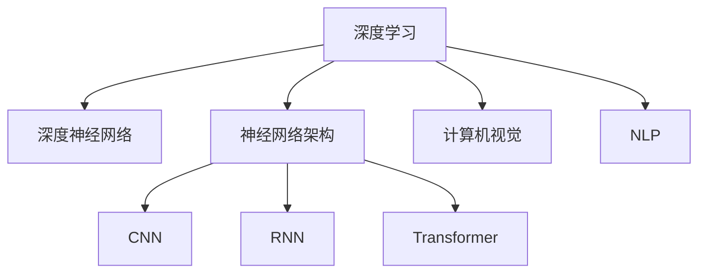

                 

# Andrej Karpathy：人工智能的未来发展趋势

> 关键词：人工智能发展趋势,深度学习,深度神经网络,机器学习,自然语言处理,计算机视觉

## 1. 背景介绍

### 1.1 问题由来

人工智能(AI)技术的飞速发展，特别是在深度学习和深度神经网络领域的突破，已经深刻改变了我们的生活方式和工作方式。从自动驾驶汽车到智能客服，从医疗影像分析到自然语言处理，AI正在以前所未有的速度和规模进入各行各业。而作为AI领域的先锋，Andrej Karpathy博士，以其在深度学习领域的卓越贡献和前瞻性见解，被广泛认为是AI未来的重要指引者。

本文将基于Andrej Karpathy的演讲和研究成果，探讨AI尤其是深度学习和深度神经网络领域的发展趋势，预测未来的关键技术方向和应用场景。

### 1.2 问题核心关键点

Andrej Karpathy的研究集中在深度学习和计算机视觉领域，他不仅推动了神经网络架构的创新，如ResNet、Transformer等，还对图像生成、视觉SLAM、无人驾驶等应用产生了深远影响。本文将从以下几个核心关键点展开讨论：

- 深度学习技术的发展历程和未来趋势
- 神经网络架构的演变与创新
- 计算机视觉技术的进步与挑战
- AI在各行业的实际应用与未来前景

## 2. 核心概念与联系

### 2.1 核心概念概述

为更好地理解Andrej Karpathy的演讲内容，本节将介绍几个关键核心概念：

- 深度学习：一种基于多层神经网络的机器学习技术，通过反向传播算法进行模型训练，广泛应用于图像识别、自然语言处理等领域。
- 深度神经网络(DNN)：深度学习中的核心组成部分，由多层非线性神经元组成，可以学习非常复杂的特征表示。
- 神经网络架构：深度神经网络的拓扑结构，包括卷积神经网络(CNN)、循环神经网络(RNN)、自注意力机制(Transformer)等。
- 计算机视觉：AI领域的一个分支，研究如何让计算机理解和处理视觉信息，如图像识别、目标检测、图像生成等。
- 自然语言处理(NLP)：另一个AI领域的分支，致力于使计算机能够理解、生成和处理人类语言。

这些核心概念之间的逻辑关系可以通过以下Mermaid流程图来展示：



这个流程图展示了几大核心概念之间的相互关系：

1. 深度学习是深度神经网络的实现框架。
2. 神经网络架构包括CNN、RNN、Transformer等多种形式，用于解决不同类型的学习问题。
3. 计算机视觉和自然语言处理分别涉及视觉信息和语言信息的理解和处理。

## 3. 核心算法原理 & 具体操作步骤

### 3.1 算法原理概述

Andrej Karpathy的深度学习研究涉及多个核心算法和原理，以下将详细介绍其中的几个关键点。

#### 3.1.1 反向传播算法(Backpropagation)

反向传播是深度学习中最基本的训练算法，其核心思想是利用梯度下降法优化神经网络中的参数。在训练过程中，通过计算损失函数对各个参数的梯度，反向传播回传给模型，从而更新模型参数，最小化损失函数。

#### 3.1.2 自注意力机制(Self-Attention)

自注意力机制是Transformer模型的核心组成部分，通过计算输入序列中各个元素之间的关联度，动态生成每个元素的关键表示。这种方法在自然语言处理和计算机视觉中都有广泛应用。

#### 3.1.3 残差连接(Residual Connections)

残差连接是深度神经网络中的一种常用结构，通过将输入直接连接到输出，解决了深度网络训练中的梯度消失问题。这种方式在ResNet等模型中被广泛应用，提高了网络的训练稳定性和性能。

### 3.2 算法步骤详解

基于Andrej Karpathy的研究，深度学习模型的训练过程通常包括以下几个关键步骤：

**Step 1: 准备数据集**
- 收集和预处理数据集，确保数据质量。
- 划分数据集为训练集、验证集和测试集，以保证模型的泛化能力。

**Step 2: 选择模型架构**
- 根据任务需求选择合适的神经网络架构，如CNN、RNN、Transformer等。
- 设计模型的输入和输出层，以及损失函数。

**Step 3: 模型初始化**
- 随机初始化模型的参数，通常使用Xavier初始化等方法。
- 准备训练过程中的超参数，如学习率、批大小、迭代轮数等。

**Step 4: 训练过程**
- 利用反向传播算法，在训练集上迭代更新模型参数。
- 使用验证集进行模型评估，防止过拟合。
- 逐步减小学习率，以提高模型收敛速度。

**Step 5: 模型评估**
- 在测试集上评估模型性能，计算准确率、召回率等指标。
- 分析模型在特定任务上的表现，优化模型结构。

### 3.3 算法优缺点

深度学习在图像识别、语音识别、自然语言处理等领域取得了巨大成功，但同时也面临一些挑战：

#### 3.3.1 优点

1. 强大的表达能力：深度学习模型能够学习非常复杂的特征表示，适合处理高维度的数据。
2. 自动化的特征提取：无需手动设计特征，模型能够自动学习数据的高级特征。
3. 广泛的应用场景：深度学习技术已经应用于自动驾驶、医疗影像分析、智能客服等多个领域。

#### 3.3.2 缺点

1. 数据依赖性强：深度学习模型需要大量的标注数据进行训练，数据获取成本高。
2. 计算资源消耗大：训练深度模型需要高性能的GPU或TPU设备，训练和推理成本高。
3. 可解释性不足：深度学习模型通常是“黑盒”，难以解释其内部工作机制。

### 3.4 算法应用领域

Andrej Karpathy的研究成果广泛应用于以下几个领域：

- 自动驾驶：利用计算机视觉技术，进行环境感知和路径规划。
- 自然语言处理：通过Transformer模型，进行文本生成、情感分析、机器翻译等任务。
- 图像生成：利用生成对抗网络(GAN)等技术，生成高质量的图像和视频。
- 医学影像分析：利用卷积神经网络，进行疾病的早期诊断和图像分类。

## 4. 数学模型和公式 & 详细讲解  
### 4.1 数学模型构建

Andrej Karpathy的研究中，涉及多个数学模型和公式，以下将详细介绍其中的几个关键点。

#### 4.1.1 损失函数

损失函数是深度学习模型训练中的核心组成部分，用于衡量模型预测结果与真实标签之间的差异。常用的损失函数包括均方误差、交叉熵、Hinge Loss等。

#### 4.1.2 梯度下降算法

梯度下降算法是深度学习中最基本的优化算法，通过计算损失函数对模型参数的梯度，更新模型参数，使得损失函数最小化。常用的梯度下降算法包括批量梯度下降、随机梯度下降、Adam等。

#### 4.1.3 自注意力机制

自注意力机制是Transformer模型的核心组成部分，通过计算输入序列中各个元素之间的关联度，动态生成每个元素的关键表示。自注意力机制的数学公式如下：

$$
a_{ij} = \frac{e^{W^T[Q_{i,j}][K]}}{\sum_{j=1}^n e^{W^T[Q_{i,j}[K]}} = \frac{e^{v_i^T[Q_{j,k}][K]}}{\sum_{j=1}^n e^{v_i^T[Q_{j,k}][K]}}
$$

其中，$v_i$和$v_j$是线性变换后的特征向量，$K$是可学习的注意力权重矩阵。

### 4.2 公式推导过程

以下将以自注意力机制为例，展示其公式推导过程。

#### 4.2.1 推导过程

假设输入序列为$x=[x_1,x_2,\ldots,x_n]$，自注意力机制的计算过程如下：

1. 计算查询向量$Q_i$和键向量$K_j$：
   $$
   Q_i = W_{q}x_i, K_j = W_{k}x_j
   $$

2. 计算注意力权重矩阵$A$：
   $$
   A_{ij} = \frac{e^{v_i^T[Q_{j,k}][K]}}{\sum_{j=1}^n e^{v_i^T[Q_{j,k}][K]}}
   $$

3. 计算值向量$V_i$：
   $$
   V_i = W_{v}x_i
   $$

4. 计算注意力机制输出$Z_i$：
   $$
   Z_i = \sum_{j=1}^n A_{ij}V_j
   $$

通过上述推导，可以看到自注意力机制通过计算输入序列中各个元素之间的关联度，动态生成每个元素的关键表示，使得模型能够更好地处理输入序列。

### 4.3 案例分析与讲解

以自然语言处理中的机器翻译为例，介绍Andrej Karpathy的研究成果。

#### 4.3.1 机器翻译任务

机器翻译是将一种语言翻译成另一种语言的任务，是自然语言处理中的经典问题。传统的机器翻译方法包括基于规则的翻译、统计机器翻译、基于神经网络的机器翻译等。

#### 4.3.2 Transformer模型

Transformer模型是一种基于自注意力机制的神经网络架构，由谷歌团队提出。Transformer模型通过自注意力机制，学习输入序列中每个位置与其他位置的关联度，从而动态生成每个位置的关键表示。这种设计大大提高了模型的效率和准确率，成为机器翻译领域的标准模型。

#### 4.3.3 训练过程

Transformer模型的训练过程包括以下几个步骤：
1. 数据预处理：将输入文本和目标文本转化为词向量序列，并进行分词和填充。
2. 模型初始化：随机初始化模型参数，设置超参数。
3. 前向传播：计算输入序列和目标序列的关键表示，并计算预测结果。
4. 损失计算：计算预测结果与真实标签之间的差异，更新模型参数。
5. 反向传播：根据损失函数的梯度，更新模型参数。

## 5. 项目实践：代码实例和详细解释说明
### 5.1 开发环境搭建

在进行项目实践前，我们需要准备好开发环境。以下是使用Python进行TensorFlow开发的环境配置流程：

1. 安装Anaconda：从官网下载并安装Anaconda，用于创建独立的Python环境。

2. 创建并激活虚拟环境：
```bash
conda create -n tf-env python=3.8 
conda activate tf-env
```

3. 安装TensorFlow：根据CUDA版本，从官网获取对应的安装命令。例如：
```bash
conda install tensorflow -c conda-forge
```

4. 安装TensorBoard：
```bash
pip install tensorboard
```

5. 安装各类工具包：
```bash
pip install numpy pandas scikit-learn matplotlib tqdm jupyter notebook ipython
```

完成上述步骤后，即可在`tf-env`环境中开始项目实践。

### 5.2 源代码详细实现

下面我们以图像分类为例，给出使用TensorFlow对卷积神经网络进行训练的Python代码实现。

首先，定义数据处理函数：

```python
import tensorflow as tf
from tensorflow.keras import datasets, layers, models

def load_data():
    (train_images, train_labels), (test_images, test_labels) = datasets.cifar10.load_data()
    train_images, test_images = train_images / 255.0, test_images / 255.0
    return train_images, train_labels, test_images, test_labels
```

然后，定义模型结构：

```python
def create_model(input_shape):
    model = models.Sequential([
        layers.Conv2D(32, (3, 3), activation='relu', input_shape=input_shape),
        layers.MaxPooling2D((2, 2)),
        layers.Conv2D(64, (3, 3), activation='relu'),
        layers.MaxPooling2D((2, 2)),
        layers.Conv2D(64, (3, 3), activation='relu'),
        layers.Flatten(),
        layers.Dense(64, activation='relu'),
        layers.Dense(10)
    ])
    return model
```

接着，定义模型训练函数：

```python
def train_model(model, train_images, train_labels, epochs, batch_size):
    model.compile(optimizer='adam',
                  loss=tf.keras.losses.SparseCategoricalCrossentropy(from_logits=True),
                  metrics=['accuracy'])
    model.fit(train_images, train_labels, epochs=epochs, batch_size=batch_size, 
              validation_data=(test_images, test_labels))
```

最后，启动训练流程：

```python
train_images, train_labels, test_images, test_labels = load_data()
model = create_model(train_images.shape[1:])
train_model(model, train_images, train_labels, epochs=10, batch_size=64)
```

以上就是使用TensorFlow对卷积神经网络进行图像分类任务训练的完整代码实现。可以看到，利用TensorFlow的Keras API，模型的创建和训练过程变得非常简单。

### 5.3 代码解读与分析

让我们再详细解读一下关键代码的实现细节：

**load_data函数**：
- 加载CIFAR-10数据集，并进行归一化处理。

**create_model函数**：
- 定义卷积神经网络模型结构，包含卷积层、池化层和全连接层。

**train_model函数**：
- 定义模型编译过程，设置优化器、损失函数和评估指标。
- 使用模型fit函数进行模型训练，指定训练轮数和批大小。

**训练流程**：
- 加载数据集。
- 创建卷积神经网络模型。
- 调用train_model函数进行模型训练。

可以看到，TensorFlow提供了简单易用的API，使得深度学习模型的开发变得非常简单。开发者可以更多关注模型结构和训练策略的设计，而不必过多关注底层实现细节。

## 6. 实际应用场景

### 6.1 自动驾驶

Andrej Karpathy在自动驾驶领域的研究主要集中在环境感知和路径规划方面。利用计算机视觉技术，Andrej Karpathy开发了多个自动驾驶系统，并在Stanford Autonomous Vehicle Research (SAVeR)团队中进行部署和测试。

#### 6.1.1 环境感知

环境感知是自动驾驶的关键步骤，包括对道路、车辆、行人等元素的检测和识别。Andrej Karpathy的研究中，通过卷积神经网络进行多尺度特征提取，结合深度学习中的目标检测算法，实现了高精度的环境感知。

#### 6.1.2 路径规划

路径规划是自动驾驶中的另一关键步骤，Andrej Karpathy通过强化学习等方法，实现了基于环境感知的智能路径规划。通过优化决策策略，使得车辆能够在复杂的城市道路中安全、高效地行驶。

### 6.2 自然语言处理

Andrej Karpathy在自然语言处理领域的研究主要集中在文本生成和机器翻译方面。通过Transformer模型，Andrej Karpathy开发了多个文本生成和机器翻译系统，并在Stanford NLP Group中进行测试和应用。

#### 6.2.1 文本生成

文本生成是自然语言处理中的经典问题，包括对话生成、文本摘要、情感分析等。Andrej Karpathy通过Transformer模型，结合自注意力机制和语言模型，实现了高效、高质量的文本生成。

#### 6.2.2 机器翻译

机器翻译是将一种语言翻译成另一种语言的任务，Andrej Karpathy通过Transformer模型，结合多尺度特征提取和自注意力机制，实现了高精度的机器翻译系统。

### 6.3 图像生成

Andrej Karpathy在图像生成领域的研究主要集中在生成对抗网络(GAN)和图像超分辨率方面。通过GAN技术，Andrej Karpathy开发了多个高质量的图像生成系统，并在Stanford Creative AI Lab中进行测试和应用。

#### 6.3.1 图像生成

图像生成是计算机视觉中的经典问题，包括人脸生成、图像修复、图像风格转换等。Andrej Karpathy通过生成对抗网络，结合多尺度特征提取和自注意力机制，实现了高精度的图像生成系统。

#### 6.3.2 图像超分辨率

图像超分辨率是计算机视觉中的重要问题，Andrej Karpathy通过深度学习模型，结合多尺度特征提取和自注意力机制，实现了高质量的图像超分辨率系统。

## 7. 工具和资源推荐

### 7.1 学习资源推荐

为了帮助开发者系统掌握深度学习技术，以下推荐一些优质的学习资源：

1. 《深度学习》（Ian Goodfellow等著）：深度学习领域的经典教材，涵盖深度学习的基本概念、算法和应用。

2. 《深度学习入门：基于Python的理论与实现》（斋藤康毅著）：深度学习领域的入门书籍，适合初学者阅读。

3. 《神经网络与深度学习》（Michael Nielsen著）：深度学习领域的经典教材，适合初学者和进阶读者阅读。

4. 《CS231n: Convolutional Neural Networks for Visual Recognition》（斯坦福大学课程）：斯坦福大学开设的计算机视觉课程，涵盖深度学习在计算机视觉中的应用。

5. 《Fast.ai》（Jeremy Howard等著）：深度学习领域的实战指南，适合实际项目开发。

6. 《Deep Learning Specialization》（Andrew Ng教授课程）：Coursera平台上的深度学习系列课程，涵盖深度学习的基本概念、算法和应用。

通过学习这些资源，相信你一定能够系统掌握深度学习技术，并用于解决实际的AI问题。

### 7.2 开发工具推荐

高效的开发离不开优秀的工具支持。以下是几款用于深度学习开发的常用工具：

1. TensorFlow：由Google主导开发的深度学习框架，生产部署方便，适合大规模工程应用。

2. PyTorch：由Facebook主导开发的深度学习框架，灵活动态的计算图，适合快速迭代研究。

3. Keras：高级深度学习API，基于TensorFlow和Theano等后端，适合快速原型设计和实验。

4. MXNet：由亚马逊开发的深度学习框架，支持分布式计算，适合大规模分布式训练。

5. Caffe：由伯克利视觉与学习中心开发的深度学习框架，适用于计算机视觉任务。

6. OpenCV：开源计算机视觉库，包含丰富的图像处理和计算机视觉算法。

合理利用这些工具，可以显著提升深度学习模型的开发效率，加快创新迭代的步伐。

### 7.3 相关论文推荐

Andrej Karpathy的研究成果主要集中在深度学习和计算机视觉领域，以下是几篇奠基性的相关论文，推荐阅读：

1. ImageNet Classification with Deep Convolutional Neural Networks（AlexNet论文）：提出深度卷积神经网络架构，刷新了ImageNet分类任务SOTA。

2. Very Deep Convolutional Networks for Large-Scale Image Recognition（VGG论文）：提出多层次卷积神经网络架构，提高了图像分类的准确率。

3. ResNet: Deep Residual Learning for Image Recognition（ResNet论文）：提出残差连接结构，解决了深度神经网络中的梯度消失问题。

4. Deep Residual Learning for Image Recognition（ResNet论文）：提出残差连接结构，解决了深度神经网络中的梯度消失问题。

5. Rethinking the Inception Architecture for Computer Vision（Inception论文）：提出Inception模块，提高了卷积神经网络的表达能力。

6. GoogleNet: Google's Image Recognition Model of 1.0% Error Rates（GoogleNet论文）：提出GoogleNet架构，提高了图像分类的准确率。

这些论文代表了大深度学习模型的发展脉络。通过学习这些前沿成果，可以帮助研究者把握学科前进方向，激发更多的创新灵感。

## 8. 总结：未来发展趋势与挑战

### 8.1 总结

本文对Andrej Karpathy的研究工作进行了全面系统的介绍。首先阐述了深度学习和深度神经网络的发展历程和未来趋势，明确了神经网络架构和计算机视觉技术的核心方向。其次，从原理到实践，详细讲解了深度学习模型的训练过程和关键算法，给出了深度学习模型在自动驾驶、自然语言处理和图像生成等领域的典型应用。最后，本文精选了深度学习技术的各类学习资源，力求为读者提供全方位的技术指引。

通过本文的系统梳理，可以看到，深度学习技术在图像识别、语音识别、自然语言处理等领域取得了巨大成功，为AI技术的发展奠定了坚实的基础。未来，伴随深度学习模型的不断演进和优化，AI技术将在更广阔的应用领域中发挥更大的作用。

### 8.2 未来发展趋势

展望未来，深度学习技术将继续在以下几个方向发展：

1. 模型规模持续增大：随着算力成本的下降和数据规模的扩张，深度学习模型的参数量还将持续增长。超大规模模型蕴含的丰富特征表示，有望支撑更加复杂多变的任务。

2. 计算效率不断提高：深度学习模型训练和推理的计算成本高，未来将通过更高效的硬件和算法，如分布式训练、模型压缩等，降低计算成本，提升计算效率。

3. 跨领域应用不断拓展：深度学习技术在自然语言处理、计算机视觉等领域已经取得了重要成果，未来将向更多领域拓展，如医疗、金融、教育等。

4. 人机协同成为可能：深度学习技术将更多地与人工干预、规则系统等结合，形成人机协同的智能系统，提升系统的鲁棒性和可解释性。

5. 自动化学习不断深入：深度学习技术将更多地利用自动化学习范式，如强化学习、迁移学习、少样本学习等，提升模型的适应性和泛化能力。

6. 可解释性和安全性不断提升：深度学习模型的可解释性和安全性问题一直备受关注，未来将通过更先进的解释工具和监控机制，提升系统的可信度和安全性。

以上趋势凸显了深度学习技术的广阔前景。这些方向的探索发展，必将进一步推动AI技术在各个领域的应用，为人类生产和生活带来更多的便利和创新。

### 8.3 面临的挑战

尽管深度学习技术已经取得了瞩目成就，但在迈向更加智能化、普适化应用的过程中，它仍面临着诸多挑战：

1. 数据依赖性强：深度学习模型需要大量的标注数据进行训练，数据获取成本高，且存在数据偏见等问题。如何进一步降低数据依赖性，提高模型的泛化能力，将是重要课题。

2. 计算资源消耗大：训练深度模型需要高性能的GPU或TPU设备，训练和推理成本高。如何优化计算效率，降低资源消耗，提升模型的实时性，将是重要研究方向。

3. 可解释性不足：深度学习模型通常是“黑盒”，难以解释其内部工作机制。对于医疗、金融等高风险应用，算法的可解释性和可审计性尤为重要。如何赋予深度学习模型更强的可解释性，将是亟待攻克的难题。

4. 安全性有待保障：深度学习模型难免会学习到有偏见、有害的信息，通过自动驾驶等系统传递到现实世界，可能产生误导性、歧视性的输出，给实际应用带来安全隐患。如何从数据和算法层面消除模型偏见，避免恶意用途，确保输出的安全性，也将是重要的研究课题。

5. 知识整合能力不足：现有的深度学习模型往往局限于任务内数据，难以灵活吸收和运用更广泛的先验知识。如何让深度学习模型更好地与外部知识库、规则库等专家知识结合，形成更加全面、准确的信息整合能力，还有很大的想象空间。

正视深度学习面临的这些挑战，积极应对并寻求突破，将是大深度学习技术走向成熟的必由之路。相信随着学界和产业界的共同努力，这些挑战终将一一被克服，深度学习技术必将在构建智能人机交互系统中扮演越来越重要的角色。

### 8.4 未来突破

面对深度学习技术所面临的种种挑战，未来的研究需要在以下几个方面寻求新的突破：

1. 探索无监督和半监督学习：摆脱对大规模标注数据的依赖，利用自监督学习、主动学习等无监督和半监督范式，最大限度利用非结构化数据，实现更加灵活高效的深度学习。

2. 研究参数高效和计算高效的深度学习范式：开发更加参数高效的深度学习方法，在固定大部分预训练参数的同时，只更新极少量的任务相关参数。同时优化深度学习模型的计算图，减少前向传播和反向传播的资源消耗，实现更加轻量级、实时性的部署。

3. 引入更多先验知识：将符号化的先验知识，如知识图谱、逻辑规则等，与深度学习模型进行巧妙融合，引导深度学习过程学习更准确、合理的特征表示。同时加强不同模态数据的整合，实现视觉、语音等多模态信息与文本信息的协同建模。

4. 结合因果分析和博弈论工具：将因果分析方法引入深度学习模型，识别出模型决策的关键特征，增强输出解释的因果性和逻辑性。借助博弈论工具刻画人机交互过程，主动探索并规避模型的脆弱点，提高系统稳定性。

5. 纳入伦理道德约束：在深度学习模型的训练目标中引入伦理导向的评估指标，过滤和惩罚有偏见、有害的输出倾向。同时加强人工干预和审核，建立模型行为的监管机制，确保输出符合人类价值观和伦理道德。

这些研究方向的探索，必将引领深度学习技术迈向更高的台阶，为构建安全、可靠、可解释、可控的智能系统铺平道路。面向未来，深度学习技术还需要与其他AI技术进行更深入的融合，如知识表示、因果推理、强化学习等，多路径协同发力，共同推动人工智能技术的发展。只有勇于创新、敢于突破，才能不断拓展深度学习技术的边界，让智能技术更好地造福人类社会。

## 9. 附录：常见问题与解答

**Q1：深度学习技术的发展历程是什么？**

A: 深度学习技术的发展历程大致可以分为以下几个阶段：

1. 1980年代：深度学习技术的早期探索，包括BP算法、多层感知机等。

2. 2000年代：深度学习技术的重新兴起，以Hinton等人提出深度信念网络为标志。

3. 2010年代：深度学习技术在图像识别、自然语言处理等领域取得突破，包括AlexNet、VGG、Inception等模型的提出。

4. 2020年代：深度学习技术进入高速发展阶段，Transformer、BERT、GPT等模型的提出，进一步推动了深度学习技术的发展。

**Q2：深度学习技术在哪些领域有重要应用？**

A: 深度学习技术在以下领域有重要应用：

1. 计算机视觉：如图像识别、目标检测、图像生成等。

2. 自然语言处理：如机器翻译、文本生成、情感分析等。

3. 语音识别：如语音识别、语音合成等。

4. 自动驾驶：如环境感知、路径规划等。

5. 医学影像分析：如疾病诊断、图像分类等。

6. 金融预测：如股票价格预测、信用评分等。

7. 推荐系统：如商品推荐、内容推荐等。

**Q3：如何降低深度学习模型的计算成本？**

A: 降低深度学习模型的计算成本，可以从以下几个方面入手：

1. 模型压缩：通过模型剪枝、量化等方法，减小模型尺寸，降低计算资源消耗。

2. 分布式训练：通过分布式计算，加速模型训练过程，提高计算效率。

3. 硬件优化：使用高性能的GPU/TPU等设备，提升计算速度和效率。

4. 算法优化：引入更高效的优化算法，如Adam、Adafactor等，提高模型训练的效率。

5. 数据增强：通过数据增强技术，扩充训练集，提高模型的泛化能力，减少过拟合。

6. 迁移学习：利用预训练模型的知识，进行迁移学习，减小训练成本。

**Q4：如何提升深度学习模型的可解释性？**

A: 提升深度学习模型的可解释性，可以从以下几个方面入手：

1. 可视化技术：通过可视化技术，展示模型内部的激活特征、梯度变化等，帮助理解模型的决策过程。

2. 模型解释器：开发模型解释器，如LIME、SHAP等，对模型的输出结果进行解释和分析。

3. 特征重要性分析：通过特征重要性分析，找出模型决策的关键特征，帮助理解模型的工作机制。

4. 可解释性训练：在模型训练过程中，引入可解释性约束，提高模型的可解释性。

5. 多模型集成：通过集成多个可解释性较好的模型，提升整体模型的可解释性。

**Q5：深度学习技术有哪些未来的发展方向？**

A: 深度学习技术的未来发展方向包括：

1. 模型规模持续增大：超大规模深度学习模型将带来更丰富的特征表示，进一步提升模型的性能。

2. 计算效率不断提高：通过分布式训练、模型压缩等方法，降低计算成本，提升计算效率。

3. 跨领域应用不断拓展：深度学习技术将在更多领域得到应用，如医疗、金融、教育等。

4. 人机协同成为可能：深度学习技术将更多地与人工干预、规则系统等结合，形成人机协同的智能系统。

5. 自动化学习不断深入：深度学习技术将更多地利用自动化学习范式，如强化学习、迁移学习、少样本学习等，提升模型的适应性和泛化能力。

6. 可解释性和安全性不断提升：深度学习模型的可解释性和安全性问题将得到更多关注，研究者将探索新的方法提升模型的可信度和安全性。

总之，深度学习技术将继续在各个领域发挥重要作用，为人类生产和生活带来更多的便利和创新。

---

作者：禅与计算机程序设计艺术 / Zen and the Art of Computer Programming

