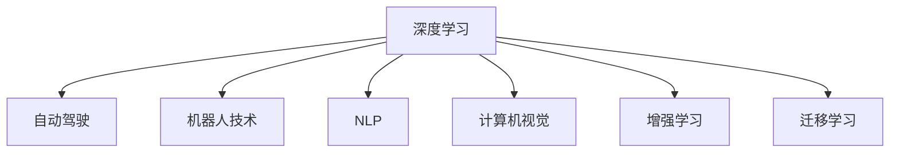

                 

# Andrej Karpathy：人工智能的未来发展趋势

## 1. 背景介绍

### 1.1 问题由来
随着人工智能(AI)技术的飞速发展，Andrej Karpathy — 作为深度学习领域的前沿专家和知名学者，一直在关注和探索AI的未来发展趋势。他认为，尽管AI已经取得了一系列重大突破，但其发展仍然面临诸多挑战和不确定性。因此，本文将基于Andrej Karpathy的最新观点，探讨人工智能未来的发展趋势，并讨论这些趋势将如何影响科技、社会和经济各个层面。

### 1.2 问题核心关键点
Andrej Karpathy在分析人工智能的未来时，主要关注以下几个关键点：
- **算法的复杂性和可解释性**：未来AI算法将更加复杂，如何解释这些算法将成为重要挑战。
- **数据隐私与伦理问题**：数据隐私问题将变得更加突出，AI系统必须符合伦理标准。
- **多模态AI的发展**：AI系统将更加注重多模态信息的融合，如视觉、听觉和文本数据。
- **AI与人类协作**：AI将更多地与人协作，而不是完全替代人类。
- **持续学习和适应性**：AI系统将具备更强的适应性和持续学习能力。

## 2. 核心概念与联系

### 2.1 核心概念概述

为更好地理解Andrej Karpathy对AI未来趋势的看法，本节将介绍几个核心概念及其相互联系：

- **深度学习**：一种基于神经网络的机器学习技术，通过多层非线性变换，实现对复杂数据的建模和预测。
- **自动驾驶**：利用AI技术实现无人驾驶汽车，是AI应用的一个重要方向。
- **机器人技术**：将AI应用于机器人领域，使机器人具备感知、决策和执行能力。
- **自然语言处理(NLP)**：利用AI技术处理和理解自然语言，包括文本生成、情感分析、机器翻译等任务。
- **计算机视觉**：利用AI技术使计算机能够“看”和理解图像和视频内容。
- **增强学习**：一种学习方式，通过与环境的交互，优化策略以实现特定目标。
- **迁移学习**：将一个领域学习到的知识，迁移到另一个领域，以加速新任务的学习。

这些核心概念之间的逻辑关系可以通过以下Mermaid流程图来展示：



这个流程图展示了深度学习与其他AI子领域之间的紧密联系。通过理解和掌握这些核心概念，我们可以更好地把握AI技术的发展脉络和未来趋势。

## 3. 核心算法原理 & 具体操作步骤
### 3.1 算法原理概述

Andrej Karpathy认为，未来AI算法将更加复杂，涉及更多的变量和参数。例如，在大规模图像识别任务中，深度卷积神经网络（CNN）已不再是最佳选择，而是需要更复杂的卷积操作和架构，如Transformer结构。同时，AI系统需要具备更好的泛化能力，以适应不同环境和数据集。

### 3.2 算法步骤详解

基于Andrej Karpathy的观点，未来AI算法的发展可能遵循以下步骤：

**Step 1: 数据收集与预处理**
- 收集大量高质量的数据，包括图像、文本、音频等多种模态。
- 对数据进行清洗、标注和预处理，确保数据的质量和一致性。

**Step 2: 模型设计**
- 选择合适的深度学习架构，如卷积神经网络(CNN)、循环神经网络(RNN)、Transformer等。
- 设计合适的损失函数和优化算法，如交叉熵损失、Adam优化器等。

**Step 3: 模型训练与验证**
- 使用分布式训练框架，对模型进行大规模训练。
- 周期性地在验证集上评估模型性能，调整超参数以避免过拟合。

**Step 4: 模型评估与优化**
- 在测试集上评估模型的泛化性能，确保其在实际应用中的有效性。
- 使用正则化技术、集成学习等方法，提升模型的鲁棒性和泛化能力。

**Step 5: 模型部署与应用**
- 将训练好的模型部署到实际应用场景中，如自动驾驶汽车、智能机器人、聊天机器人等。
- 定期收集反馈数据，进行模型微调和优化。

### 3.3 算法优缺点

未来AI算法的优点包括：
1. 更强的泛化能力：能够在不同的环境和数据集上表现良好。
2. 更高的复杂度：能够处理更复杂的数据和任务。
3. 更好的适应性：能够适应不同的场景和需求。

但同时，这些算法也存在一些缺点：
1. 算法复杂度增加：需要更多的计算资源和更高的技术门槛。
2. 模型可解释性降低：复杂算法难以理解其内部机制和决策过程。
3. 数据隐私和安全问题：大数据使用带来的隐私和安全问题。

### 3.4 算法应用领域

基于Andrej Karpathy的预测，AI算法将在多个领域得到广泛应用，包括但不限于：

- **自动驾驶**：通过深度学习和增强学习，使汽车能够自主导航和决策。
- **机器人技术**：利用深度学习优化机器人的感知、决策和执行能力。
- **医疗诊断**：通过图像识别和自然语言处理，辅助医生进行诊断和治疗。
- **金融科技**：利用AI进行风险评估、股票交易和客户服务。
- **教育**：通过个性化学习推荐和智能辅导，提升教育质量和效率。
- **游戏与娱乐**：创造更加智能和沉浸式的游戏和娱乐体验。

## 4. 数学模型和公式 & 详细讲解  
### 4.1 数学模型构建

Andrej Karpathy认为，未来AI算法的数学模型将更加复杂，涉及更多的变量和参数。以下是一个简单的深度学习模型，用于图像分类任务：

$$
y = f(x; \theta) = \sum_{i=1}^n w_i \sigma(b_i \cdot x + a_i)
$$

其中，$x$ 为输入特征，$\theta$ 为模型参数，$f(x)$ 为模型输出，$\sigma$ 为激活函数。

### 4.2 公式推导过程

以卷积神经网络(CNN)为例，推导其前向传播和反向传播的计算过程。

**前向传播**：

$$
z^{[l]} = W^{[l]}x^{[l-1]} + b^{[l]}
$$

$$
a^{[l]} = \sigma(z^{[l]})
$$

其中，$x^{[l]}$ 为第 $l$ 层的输入，$z^{[l]}$ 为第 $l$ 层的输出，$W^{[l]}$ 和 $b^{[l]}$ 为第 $l$ 层的权重和偏置。

**反向传播**：

$$
\Delta z^{[l]} = \frac{\partial C}{\partial z^{[l]}}
$$

$$
\Delta W^{[l]} = \frac{\partial C}{\partial W^{[l]}}
$$

$$
\Delta b^{[l]} = \frac{\partial C}{\partial b^{[l]}}
$$

其中，$C$ 为损失函数，$\Delta z^{[l]}$ 为第 $l$ 层的误差梯度，$\Delta W^{[l]}$ 和 $\Delta b^{[l]}$ 为第 $l$ 层的权重和偏置的梯度。

### 4.3 案例分析与讲解

以图像分类任务为例，展示如何使用深度学习模型进行训练和推理。

**训练**：
1. 收集并标注大量图像数据。
2. 定义合适的深度学习模型架构，如卷积神经网络。
3. 使用反向传播算法和优化器（如Adam）更新模型参数。
4. 周期性地在验证集上评估模型性能，避免过拟合。

**推理**：
1. 将新图像输入到训练好的模型中。
2. 模型通过前向传播计算输出，得到图像分类结果。
3. 解释模型的输出，提供解释和建议。

## 5. 项目实践：代码实例和详细解释说明
### 5.1 开发环境搭建

在进行AI算法开发前，我们需要准备好开发环境。以下是使用Python进行TensorFlow开发的环境配置流程：

1. 安装Anaconda：从官网下载并安装Anaconda，用于创建独立的Python环境。

2. 创建并激活虚拟环境：
```bash
conda create -n tf-env python=3.8 
conda activate tf-env
```

3. 安装TensorFlow：根据CUDA版本，从官网获取对应的安装命令。例如：
```bash
conda install tensorflow -c tf
```

4. 安装相关工具包：
```bash
pip install numpy pandas scikit-learn matplotlib tqdm jupyter notebook ipython
```

完成上述步骤后，即可在`tf-env`环境中开始AI算法开发。

### 5.2 源代码详细实现

我们以图像分类任务为例，给出使用TensorFlow进行深度学习模型开发的完整代码实现。

```python
import tensorflow as tf
from tensorflow.keras import layers

model = tf.keras.Sequential([
    layers.Conv2D(32, (3, 3), activation='relu', input_shape=(28, 28, 1)),
    layers.MaxPooling2D((2, 2)),
    layers.Conv2D(64, (3, 3), activation='relu'),
    layers.MaxPooling2D((2, 2)),
    layers.Conv2D(64, (3, 3), activation='relu'),
    layers.Flatten(),
    layers.Dense(64, activation='relu'),
    layers.Dense(10, activation='softmax')
])

model.compile(optimizer='adam',
              loss='sparse_categorical_crossentropy',
              metrics=['accuracy'])

model.fit(train_images, train_labels, epochs=10, validation_data=(test_images, test_labels))
```

在上述代码中，我们使用TensorFlow搭建了一个简单的卷积神经网络，用于图像分类任务。该模型包括三个卷积层和两个全连接层，最后通过softmax函数输出分类结果。

### 5.3 代码解读与分析

让我们再详细解读一下关键代码的实现细节：

**Sequential模型**：
- 使用`Sequential`模型创建序列模型，将各层按顺序拼接起来。

**卷积层和池化层**：
- 使用`Conv2D`和`MaxPooling2D`层实现卷积和池化操作。
- `Conv2D`层的参数包括卷积核大小、滤波器数量和激活函数。
- `MaxPooling2D`层的参数包括池化窗口大小和池化操作类型。

**全连接层**：
- 使用`Dense`层实现全连接操作。
- `Dense`层的参数包括神经元数量和激活函数。

**损失函数和优化器**：
- 使用`sparse_categorical_crossentropy`作为损失函数，`adam`作为优化器。

**训练和评估**：
- 使用`fit`方法训练模型，`epochs`参数设置训练轮数，`validation_data`参数设置验证数据。

## 6. 实际应用场景
### 6.1 自动驾驶

基于深度学习和增强学习的自动驾驶技术，在未来将得到广泛应用。Andrej Karpathy认为，未来的自动驾驶系统将更加智能和可靠，能够在复杂交通环境中安全运行。例如，特斯拉的Autopilot系统和Waymo的Waymo 2.0系统都采用了深度学习和增强学习的技术，实现了自主驾驶。

### 6.2 机器人技术

AI技术在机器人领域的应用前景广阔。未来，机器人将具备更高的感知、决策和执行能力，广泛应用于制造、医疗、家庭服务等各个领域。Andrej Karpathy预测，未来的机器人将能够通过多模态信息融合，实现更加智能和高效的操作。

### 6.3 医疗诊断

深度学习技术在医疗诊断中的应用也将不断深化。Andrej Karpathy认为，未来的AI系统将通过图像识别和自然语言处理技术，辅助医生进行更准确的诊断和治疗。例如，Google的DeepMind已经开发了用于乳腺癌检测的AI系统，能够显著提高诊断准确率。

### 6.4 金融科技

AI技术在金融领域的应用也在不断扩展。未来，AI系统将通过大数据分析、风险评估和交易预测等技术，帮助金融机构更好地管理风险和提升服务质量。例如，JP Morgan的COIN系统通过AI技术优化股票交易策略，实现了显著的收益提升。

### 6.5 教育

AI技术在教育领域的应用将更加广泛和深入。Andrej Karpathy认为，未来的AI系统将通过个性化学习推荐和智能辅导，提升教育质量和效率。例如，Coursera和Khan Academy等在线教育平台已经开始使用AI技术，根据学生的学习情况和兴趣推荐课程。

## 7. 工具和资源推荐
### 7.1 学习资源推荐

为了帮助开发者系统掌握AI技术的发展和应用，以下是几本推荐的书籍和课程：

1. **《Deep Learning》 by Ian Goodfellow**：全面介绍了深度学习的理论和实践，是深度学习领域的经典教材。
2. **《Hands-On Machine Learning with Scikit-Learn, Keras, and TensorFlow》 by Aurélien Géron**：介绍了机器学习的核心算法和TensorFlow的实践应用。
3. **《AI Superpowers》 by Kai-Fu Lee**：探讨了AI技术的未来发展趋势和全球格局，具有前瞻性视角。
4. **Coursera《深度学习专项课程》**：由斯坦福大学Andrew Ng教授主讲，涵盖深度学习的基础和进阶内容。
5. **edX《人工智能基础》**：由MIT教授Patrick Henry Winston主讲，介绍了AI技术的核心概念和应用。

### 7.2 开发工具推荐

高效的开发离不开优秀的工具支持。以下是几款用于AI算法开发的常用工具：

1. **TensorFlow**：由Google主导开发的深度学习框架，支持分布式计算，适合大规模工程应用。
2. **PyTorch**：由Facebook开发的开源深度学习框架，灵活高效，适合研究和原型开发。
3. **Jupyter Notebook**：基于Web的交互式编程环境，方便快速迭代实验。
4. **Weights & Biases**：模型训练的实验跟踪工具，可以记录和可视化模型训练过程中的各项指标。
5. **TensorBoard**：TensorFlow配套的可视化工具，可实时监测模型训练状态，提供丰富的图表呈现方式。

### 7.3 相关论文推荐

Andrej Karpathy在AI领域的许多研究成果都在相关论文中得到了体现，以下是几篇值得推荐的论文：

1. **《Visualizing and Understanding the Deep Feature Hierarchies》**：展示了深度学习特征的层次结构，有助于理解模型内部机制。
2. **《Caffe: Convolutional Architecture for Fast Modeling》**：介绍了卷积神经网络架构，为图像分类任务提供了有效的解决方案。
3. **《End-to-End Learning for Self-Driving Cars》**：探讨了自动驾驶系统的端到端训练方法，提高了模型性能和可靠性。

## 8. 总结：未来发展趋势与挑战
### 8.1 总结

本文对Andrej Karpathy关于人工智能未来发展趋势的看法进行了全面系统的介绍。Andrej Karpathy认为，尽管AI技术已经取得了一系列重大突破，但其发展仍然面临诸多挑战和不确定性。

通过本文的系统梳理，可以看到，AI算法在未来将变得更加复杂和智能，将在自动驾驶、机器人、医疗、金融和教育等多个领域得到广泛应用。然而，AI的发展也面临数据隐私、算法复杂性和可解释性等诸多挑战。只有积极应对并解决这些挑战，AI技术才能更好地服务于人类社会。

### 8.2 未来发展趋势

展望未来，AI技术将呈现以下几个发展趋势：

1. **更强的泛化能力**：未来的AI算法将具备更强的泛化能力，能够在不同的环境和数据集上表现良好。
2. **更高的复杂度**：深度学习和增强学习等复杂算法将得到广泛应用，实现更复杂的任务。
3. **多模态融合**：AI系统将更多地融合视觉、听觉和文本等多种模态信息，提升感知和理解能力。
4. **与人协作**：AI系统将更多地与人协作，而不是完全替代人类，实现人机共生。
5. **持续学习**：AI系统将具备更强的持续学习能力，适应不断变化的环境和需求。

### 8.3 面临的挑战

尽管AI技术发展迅猛，但在迈向更加智能化、普适化应用的过程中，仍面临诸多挑战：

1. **数据隐私和安全问题**：大规模数据使用带来的隐私和安全问题将更加突出。
2. **算法的可解释性**：复杂算法的内部机制难以解释，导致模型决策过程不透明。
3. **计算资源消耗**：高复杂度算法需要更多的计算资源，可能面临算力瓶颈。
4. **伦理和公平性问题**：AI系统可能存在偏见和歧视，引发伦理和公平性问题。
5. **技术门槛**：AI技术的高复杂度可能导致技术门槛提升，限制其普及应用。

### 8.4 研究展望

面对未来AI技术的发展，我们需要在以下几个方面进行深入研究：

1. **提高算法的可解释性**：开发更好的算法解释技术，提升AI系统的透明度和可信度。
2. **加强数据隐私保护**：研究数据隐私保护技术，确保数据使用的合法性和安全性。
3. **优化算法性能**：研究更高效的算法和模型结构，降低计算资源消耗。
4. **提升系统的鲁棒性**：开发鲁棒性更强的AI算法，提升系统的稳定性和适应性。
5. **研究多模态融合**：研究多模态信息的融合技术，提升AI系统的感知和理解能力。

通过持续的技术创新和应用探索，AI技术必将在未来成为推动社会进步和人类发展的关键力量。

## 9. 附录：常见问题与解答

**Q1: 什么是深度学习？**

A: 深度学习是一种基于神经网络的机器学习技术，通过多层非线性变换，实现对复杂数据的建模和预测。

**Q2: 未来AI算法将面临哪些挑战？**

A: 未来AI算法将面临数据隐私、算法复杂性、计算资源消耗和伦理公平性等诸多挑战。

**Q3: AI算法在自动驾驶中的应用前景如何？**

A: 基于深度学习和增强学习的自动驾驶技术将得到广泛应用，能够在复杂交通环境中安全运行。

**Q4: 如何提高AI算法的可解释性？**

A: 开发更好的算法解释技术，如可视化工具和模型压缩技术，提升AI系统的透明度和可信度。

**Q5: AI技术在医疗诊断中的应用前景如何？**

A: 深度学习技术在医疗诊断中的应用将不断深化，辅助医生进行更准确的诊断和治疗。

---

作者：禅与计算机程序设计艺术 / Zen and the Art of Computer Programming

