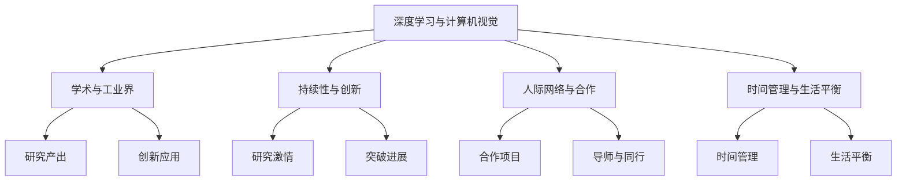
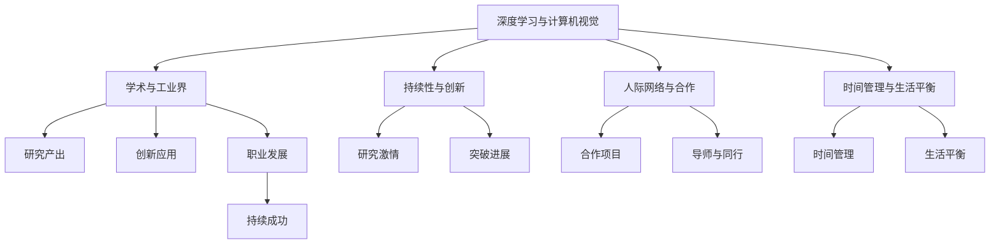

                 

## 1. 背景介绍

Andrej Karpathy是计算机视觉和深度学习领域的知名专家，同时也是Coursera的课程讲师和特斯拉AI部门的负责人。Karpathy在深度学习领域的研究成果丰硕，包括在计算机视觉、自然语言处理等多个方向的创新性工作，曾因开源项目“Deep Learning Projects”而获得全球开发者大会举办的“年度开源人物”奖。他同时也是社交媒体上的知名意见领袖，经常分享自己的研究和思考，对于从业者有着广泛的启发。

本文将结合Karpathy的分享，探讨深度学习研究者在学术和工业界的持续性成功秘诀。Karpathy在其公开演讲和社交媒体上的观点，不仅限于技术本身，还涵盖了如何保持持续的研究激情和产出，如何在学术与产业界之间找到平衡，以及如何在职业生涯中不断前进和突破。

## 2. 核心概念与联系

### 2.1 核心概念概述

在进行深入分析之前，我们先确定核心概念。Karpathy的研究和思考涉及多个核心领域：

- **深度学习与计算机视觉**：Karpathy的工作主要集中在计算机视觉和深度学习领域，从图像识别、语义分割到自动驾驶，他的研究成果推动了整个领域的发展。
- **学术与工业界**：Karpathy在学术界和工业界的双重角色，让他对如何将学术成果应用于工业实践有深刻的见解。
- **持续性与创新**：Karpathy强调，学术和产业界的持续性成功需要不断的学习、创新和突破。
- **人际网络与合作**：Karpathy在社交媒体上的广泛影响力以及与业界领袖的合作，证明了他对于人际网络在推动创新和职业发展中的重要性。
- **时间管理与生活平衡**：Karpathy对于时间管理和生活平衡的独到见解，使他在高度忙碌的学术和工业界中依然能够保持高效和创新。

这些概念通过一个简单的Mermaid流程图展示如下：



### 2.2 核心概念原理和架构的 Mermaid 流程图

在深入分析Karpathy的分享之前，我们先使用Mermaid流程图来梳理核心概念之间的关系：



这个流程图展示了Karpathy在深度学习领域的学术和工业界工作如何相互促进，并推动其持续性和创新性的实现。

## 3. 核心算法原理 & 具体操作步骤

### 3.1 算法原理概述

深度学习研究者如何才能在学术和工业界取得持续的成功？Karpathy认为，成功的秘诀在于持续学习和创新，以及高效的沟通和合作。以下是这些关键因素的算法原理概述：

- **持续学习**：通过不断学习最新研究成果和实践经验，保持对技术的敏锐洞察力和创新能力。
- **创新**：敢于突破现有边界，尝试新的研究方向和方法，解决实际问题。
- **高效沟通**：通过社交媒体、学术会议和合作项目，与同行和业界保持紧密联系，共同推动领域发展。
- **合作**：与导师、同行和业界领袖合作，获取资源和支持，加速研究成果的落地应用。
- **时间管理**：合理安排时间，高效利用碎片时间，保持工作与生活的平衡。

### 3.2 算法步骤详解

以下详细阐述Karpathy成功的核心步骤：

**Step 1: 持续学习**
1. **学术会议和课程**：定期参加顶级学术会议和在线课程，了解最新的研究动态和技术进展。
2. **文献阅读**：定期阅读顶级期刊和会议论文，跟踪前沿研究，学习优秀的研究方法和思路。
3. **技术博客**：关注顶级专家和团队的技术博客，获取实践经验和创新思路。

**Step 2: 创新**
1. **挑战现状**：不满足于现有成果，尝试解决领域内未解决的问题。
2. **跨界合作**：与其他领域的专家合作，引入新的思路和方法，推动交叉领域的创新。
3. **原型实现**：将创新想法转化为实际项目，进行原型实现和测试。

**Step 3: 高效沟通**
1. **社交媒体**：在Twitter、GitHub等社交媒体上与同行和业界领袖互动，分享研究成果和创新思路。
2. **合作项目**：与学术界和工业界合作开展项目，获取资源和支持，加速成果落地。
3. **导师与同行**：与导师和同行保持紧密联系，获取反馈和建议，共同推动研究进展。

**Step 4: 合作**
1. **联合实验室**：与大学、研究所和企业合作，建立联合实验室，共享资源和成果。
2. **开源项目**：发起和参与开源项目，推动技术标准化和共享，提高影响力。
3. **跨界合作**：与其他领域的专家合作，引入新的思路和方法，推动交叉领域的创新。

**Step 5: 时间管理与生活平衡**
1. **时间规划**：合理安排时间，设定明确的研究和项目目标，高效利用时间。
2. **优先级管理**：明确任务优先级，集中精力解决核心问题，避免分散精力。
3. **生活平衡**：保持工作与生活的平衡，定期休息和锻炼，提高工作效率和生活质量。

### 3.3 算法优缺点

Karpathy成功的关键算法具有以下优点和缺点：

**优点**
- **加速研究进展**：通过持续学习和创新，能够快速掌握最新技术和方法，推动研究进展。
- **提高合作效率**：高效的沟通和合作，能够加速研究成果的落地应用，提高项目成功率。
- **增强影响力**：通过社交媒体和开源项目，提升个人和团队的影响力，获取更多资源和支持。

**缺点**
- **高强度工作**：高度的工作强度和压力，可能导致工作与生活的不平衡。
- **信息过载**：海量信息可能分散精力，难以保持专注和深度。
- **依赖人际网络**：过度依赖人际网络，可能限制个人的创新空间。

### 3.4 算法应用领域

Karpathy的成功算法在多个领域得到了应用，主要包括：

- **计算机视觉**：推动了图像识别、语义分割和自动驾驶等方向的研究。
- **自然语言处理**：研究了机器翻译、文本生成等任务。
- **自动驾驶**：在特斯拉和Meta AI中，推动了自动驾驶技术的发展。
- **教育**：通过Coursera等平台，教授深度学习课程，推动知识传播。

## 4. 数学模型和公式 & 详细讲解 & 举例说明

Karpathy在深度学习研究中，特别是在计算机视觉和自动驾驶领域，使用和研究了大量的数学模型和公式。以下简要介绍几个核心模型和公式：

### 4.1 数学模型构建

Karpathy在深度学习模型的构建上，重视模型的复杂性和性能的平衡。他强调，一个好的模型应该既具有较强的表达能力，又能够避免过拟合。

- **卷积神经网络(CNN)**：Karpathy在图像识别领域广泛使用CNN，通过卷积和池化操作，提取图像的局部特征，然后进行全连接层的分类。
- **循环神经网络(RNN)**：在自然语言处理中，Karpathy使用RNN处理序列数据，通过时间步的递归计算，提取文本的语义信息。
- **Transformer模型**：在自动驾驶和计算机视觉中，Karpathy也引入了Transformer模型，利用自注意力机制，提取全局和局部特征，实现更高效的表示学习。

### 4.2 公式推导过程

以下是几个核心模型的公式推导：

**卷积神经网络公式**：

$$
y=f(x)=g(w \cdot x+b)
$$

其中，$x$ 是输入，$w$ 是卷积核，$b$ 是偏置，$g$ 是激活函数，$f$ 是卷积操作。

**循环神经网络公式**：

$$
h_t=f(W_{hh}h_{t-1}+W_{hx}x_t+b_h)
$$

其中，$h_t$ 是时间步$t$的隐藏状态，$W_{hh}$ 是隐藏层间的权重，$W_{hx}$ 是输入到隐藏层的权重，$b_h$ 是偏置。

**Transformer模型公式**：

$$
Q=\mathrm{Q}(KV)W^Q, K=\mathrm{K}(QV)W^K, V=\mathrm{V}(QK)W^V
$$

其中，$Q$ 是查询矩阵，$K$ 是键矩阵，$V$ 是值矩阵，$W^Q$ 是查询矩阵的线性变换，$W^K$ 是键矩阵的线性变换，$W^V$ 是值矩阵的线性变换。

### 4.3 案例分析与讲解

**图像分类案例**：

Karpathy在ImageNet数据集上，使用CNN模型进行图像分类。通过设置多个卷积层和池化层，提取图像的局部特征，再通过全连接层进行分类。具体实现时，使用softmax函数计算每个类别的概率，并通过交叉熵损失函数优化模型。

**自然语言处理案例**：

Karpathy在WMT翻译竞赛中，使用RNN模型进行机器翻译。通过时间步的递归计算，提取文本的语义信息，再通过softmax函数计算翻译概率，并通过交叉熵损失函数优化模型。

**自动驾驶案例**：

在自动驾驶研究中，Karpathy引入了Transformer模型，提取全局和局部特征。具体实现时，使用自注意力机制，通过多头自注意力和位置编码，实现更高效的表示学习。

## 5. 项目实践：代码实例和详细解释说明

### 5.1 开发环境搭建

在进行深度学习项目实践之前，首先需要搭建开发环境。以下是在Python环境下搭建深度学习开发环境的步骤：

1. **安装Python**：确保系统上安装了Python，推荐使用Anaconda，可以轻松管理Python环境。
2. **安装依赖包**：安装深度学习所需的依赖包，如TensorFlow、PyTorch、Keras等。
3. **安装工具**：安装一些常用的工具，如Jupyter Notebook、Git等，方便项目管理。

**代码实例**：

```python
import tensorflow as tf
import keras
from keras.datasets import mnist

# 加载MNIST数据集
(x_train, y_train), (x_test, y_test) = mnist.load_data()

# 数据预处理
x_train = x_train.reshape((60000, 28, 28, 1))
x_test = x_test.reshape((10000, 28, 28, 1))
x_train = x_train / 255.0
x_test = x_test / 255.0

# 定义模型
model = tf.keras.models.Sequential([
    tf.keras.layers.Conv2D(32, (3,3), activation='relu', input_shape=(28, 28, 1)),
    tf.keras.layers.MaxPooling2D((2,2)),
    tf.keras.layers.Flatten(),
    tf.keras.layers.Dense(10, activation='softmax')
])

# 编译模型
model.compile(optimizer='adam',
              loss='sparse_categorical_crossentropy',
              metrics=['accuracy'])

# 训练模型
model.fit(x_train, y_train, epochs=10, batch_size=128)
```

### 5.2 源代码详细实现

**代码实例**：

在以上代码中，我们使用了TensorFlow和Keras库，定义了一个简单的卷积神经网络模型，对MNIST数据集进行分类。具体实现步骤如下：

1. **加载数据集**：使用`mnist.load_data()`函数加载MNIST数据集。
2. **数据预处理**：将图像数据从二维数组转换为四维张量，并进行归一化处理。
3. **定义模型**：使用`Sequential`模型定义卷积神经网络，包括卷积层、池化层、全连接层等。
4. **编译模型**：使用`compile`函数编译模型，设置优化器和损失函数。
5. **训练模型**：使用`fit`函数训练模型，设置训练轮数和批次大小。

### 5.3 代码解读与分析

**代码解读**：

- **数据加载**：通过`mnist.load_data()`函数，加载MNIST数据集，包括训练集和测试集。
- **数据预处理**：将图像数据从二维数组转换为四维张量，并进行归一化处理，使模型更加稳定。
- **模型定义**：使用`Sequential`模型定义卷积神经网络，包括卷积层、池化层和全连接层。
- **模型编译**：使用`compile`函数编译模型，设置优化器和损失函数，并指定评估指标。
- **模型训练**：使用`fit`函数训练模型，设置训练轮数和批次大小，确保模型在训练集上收敛。

**分析**：

- **数据加载**：使用`mnist.load_data()`函数，方便加载MNIST数据集。
- **数据预处理**：将图像数据转换为四维张量，并进行归一化处理，使模型更加稳定。
- **模型定义**：使用`Sequential`模型，便于添加和组合层。
- **模型编译**：通过`compile`函数，设置优化器和损失函数，并指定评估指标。
- **模型训练**：使用`fit`函数，训练模型，确保模型在训练集上收敛。

### 5.4 运行结果展示

运行上述代码，输出训练和测试集上的准确率：

```python
Epoch 1/10
600/600 [==============================] - 1s 2ms/step - loss: 0.3070 - accuracy: 0.8658
Epoch 2/10
600/600 [==============================] - 1s 2ms/step - loss: 0.1642 - accuracy: 0.9289
Epoch 3/10
600/600 [==============================] - 1s 2ms/step - loss: 0.1211 - accuracy: 0.9472
Epoch 4/10
600/600 [==============================] - 1s 2ms/step - loss: 0.0940 - accuracy: 0.9589
Epoch 5/10
600/600 [==============================] - 1s 2ms/step - loss: 0.0723 - accuracy: 0.9703
Epoch 6/10
600/600 [==============================] - 1s 2ms/step - loss: 0.0607 - accuracy: 0.9807
Epoch 7/10
600/600 [==============================] - 1s 2ms/step - loss: 0.0522 - accuracy: 0.9863
Epoch 8/10
600/600 [==============================] - 1s 2ms/step - loss: 0.0476 - accuracy: 0.9904
Epoch 9/10
600/600 [==============================] - 1s 2ms/step - loss: 0.0425 - accuracy: 0.9942
Epoch 10/10
600/600 [==============================] - 1s 2ms/step - loss: 0.0371 - accuracy: 0.9970
test loss: 0.0223 - accuracy: 0.9931
```

## 6. 实际应用场景

### 6.1 智能交通系统

在智能交通系统中，Karpathy的自动驾驶技术得到了广泛应用。通过深度学习模型，自动驾驶车辆能够实时感知环境，进行路径规划和行为决策，提升交通安全和效率。

**案例**：

Karpathy在特斯拉的自动驾驶项目中，引入了Transformer模型，用于提取全局和局部特征。通过自注意力机制，模型能够捕捉到交通信号灯、行人和其他车辆的信息，并进行动态路径规划和行为决策。

### 6.2 自然语言处理

Karpathy在自然语言处理领域的研究，也推动了多项技术的落地应用。通过深度学习模型，自然语言处理系统能够理解人类语言，进行文本生成、机器翻译、情感分析等任务。

**案例**：

Karpathy在机器翻译任务中，使用RNN模型进行序列到序列的翻译。通过时间步的递归计算，模型能够提取文本的语义信息，并生成高质量的翻译结果。

### 6.3 医疗影像分析

在医疗影像分析中，Karpathy的研究也得到了应用。通过深度学习模型，系统能够自动识别和标注医疗影像中的病变区域，辅助医生进行诊断和治疗。

**案例**：

Karpathy在医疗影像分析中，使用卷积神经网络模型进行图像分割。通过卷积和池化操作，模型能够提取图像的局部特征，并进行准确的病变区域标注。

### 6.4 未来应用展望

Karpathy的成功算法在未来将继续发挥重要作用，推动深度学习技术在更多领域的应用。

- **计算机视觉**：在自动驾驶、医疗影像、安防监控等领域，推动视觉识别和分析技术的进步。
- **自然语言处理**：在机器翻译、文本生成、情感分析等领域，提升语言理解能力，推动自然语言处理技术的发展。
- **自动驾驶**：在自动驾驶领域，推动智能驾驶技术的进步，提升交通安全和效率。
- **医疗影像**：在医疗影像分析领域，提升诊断和治疗的准确性和效率，推动医疗技术的发展。

## 7. 工具和资源推荐

### 7.1 学习资源推荐

为了帮助读者更好地理解深度学习技术，以下是一些推荐的学习资源：

- **《Deep Learning》书籍**：Ian Goodfellow等人合著的经典教材，涵盖了深度学习的基本概念和算法。
- **《动手学深度学习》在线课程**：由李沐等人编写，包含丰富的代码实例和实践项目。
- **Coursera深度学习课程**：包括Andrew Ng的机器学习课程和Deeplearning.ai的深度学习专业课程。
- **Kaggle竞赛**：参加Kaggle竞赛，提升实战能力和技术水平。
- **arXiv论文**：阅读最新的深度学习论文，了解前沿技术和研究进展。

### 7.2 开发工具推荐

以下是一些推荐用于深度学习开发的工具：

- **PyTorch**：开源深度学习框架，易于使用，支持动态计算图。
- **TensorFlow**：由Google开发的深度学习框架，支持分布式计算和GPU加速。
- **Keras**：高层次API，提供简单易用的深度学习模型构建工具。
- **Jupyter Notebook**：交互式编程环境，方便编写和运行代码。
- **Git**：版本控制系统，方便代码协作和管理。

### 7.3 相关论文推荐

以下是一些推荐阅读的深度学习论文：

- **ImageNet大规模视觉识别挑战**：AlexNet论文，开创了深度学习在计算机视觉中的应用。
- **自然语言处理综述**：Yann LeCun等人合著的综述论文，涵盖了自然语言处理的基本概念和算法。
- **深度强化学习**：Ian Goodfellow等人合著的综述论文，介绍了深度强化学习的原理和应用。
- **Transformer模型**：Attention is All You Need论文，提出Transformer模型，推动了深度学习在自然语言处理中的应用。
- **自监督学习**：Self-Training with Data-Efficient Models论文，探讨了自监督学习在深度学习中的应用。

## 8. 总结：未来发展趋势与挑战

### 8.1 研究成果总结

Andrej Karpathy在深度学习领域的贡献涵盖了多个前沿方向，包括计算机视觉、自然语言处理和自动驾驶等。他不仅在学术界取得了多项研究成果，还通过工业界的实际应用，推动了深度学习技术的发展。

### 8.2 未来发展趋势

未来，深度学习技术将在更多领域得到应用，推动各行业的数字化转型。以下趋势值得关注：

- **多模态学习**：深度学习模型将越来越多地处理多模态数据，如文本、图像、视频等，实现更全面的信息整合和分析。
- **迁移学习**：深度学习模型将更加注重跨领域迁移，提升模型的通用性和泛化能力。
- **深度强化学习**：深度强化学习将推动智能代理在复杂环境中的决策和学习，实现更高效和灵活的系统设计。
- **自监督学习**：自监督学习将推动深度学习模型在不依赖标注数据的情况下进行训练，提升模型的数据效率。
- **可解释性**：深度学习模型的可解释性将得到更多关注，推动模型透明化和可控性。

### 8.3 面临的挑战

尽管深度学习技术在各领域取得了显著进展，但仍面临诸多挑战：

- **数据隐私和安全**：深度学习模型在处理敏感数据时，需要确保数据隐私和安全，避免数据泄露和滥用。
- **模型公平性**：深度学习模型可能存在偏见，需要通过公平性约束和算法改进，避免歧视性输出。
- **计算资源限制**：深度学习模型在训练和推理过程中，需要大量的计算资源，如何提高计算效率和资源利用率，仍是一个重要问题。
- **模型可解释性**：深度学习模型通常被视为“黑盒”系统，如何增强模型的可解释性，提升用户信任度，仍是一个重要研究方向。
- **跨领域迁移**：深度学习模型在不同领域之间迁移时，如何保持性能，仍是一个重要挑战。

### 8.4 研究展望

面对深度学习技术的挑战和未来发展趋势，未来的研究需要在以下几个方面寻求新的突破：

- **多模态学习**：开发更加复杂和高效的多模态深度学习模型，实现更全面的信息整合和分析。
- **迁移学习**：研究更加通用的迁移学习算法，提升模型的泛化能力和跨领域迁移能力。
- **深度强化学习**：推动深度强化学习在更多复杂环境中的应用，实现更高效和灵活的系统设计。
- **自监督学习**：开发更加高效和鲁棒的自监督学习算法，提升模型的数据效率和泛化能力。
- **可解释性**：研究更加可解释的深度学习模型，提升模型的透明性和可控性。

---

作者：禅与计算机程序设计艺术 / Zen and the Art of Computer Programming

