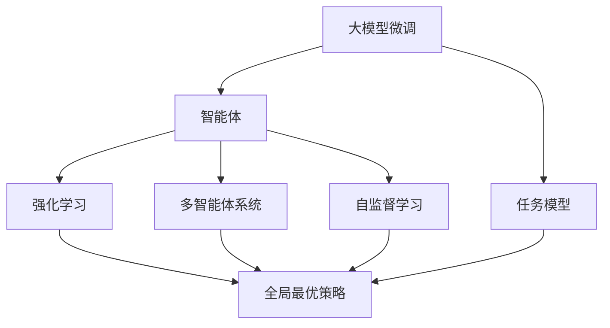

                 

# Auto-GPT 价值：一种基于 Agent 的 AGI 尝试

> 关键词：大模型微调,智能体(Agent),通用人工智能(AGI),强化学习(RL),Auto-GPT,深度学习,多智能体系统(MAS)

## 1. 背景介绍

### 1.1 问题由来
近年来，人工智能(AI)技术在各个领域取得了巨大进展，深度学习、计算机视觉、自然语言处理等技术都取得了突破性成果。然而，尽管AI技术在单一任务上表现优异，但面对复杂多变、动态变化的环境，其自主适应和决策能力仍显不足，难以形成系统的全局最优解。

为了应对这一挑战，研究者提出了一种基于智能体的通用人工智能(AGI)架构，通过多智能体系统(MAS)的方式，实现多Agent间的协作与交互，形成全局最优策略，提升系统的整体性能。其中，Auto-GPT是一种基于智能体的AGI尝试，旨在通过自监督学习和强化学习的方式，构建具有高度自主性和可解释性的智能体。

### 1.2 问题核心关键点
Auto-GPT的核心在于：
- 通过多Agent协作，形成全局最优策略。
- 结合自监督学习和强化学习，提升智能体的自主性和可解释性。
- 构建基于图结构的任务模型，提升智能体的决策效率和灵活性。
- 实现与人类和其他智能体的无缝交互，形成智能系统闭环。

Auto-GPT的实现涉及多学科知识，包括计算机科学、认知科学、心理学等。本文将对Auto-GPT的基本原理、关键算法、实际应用及未来展望进行全面解析，探讨其价值和潜力。

## 2. 核心概念与联系

### 2.1 核心概念概述

为了更好地理解Auto-GPT，本节将介绍几个密切相关的核心概念：

- **大模型微调**：通过监督学习的方式，在大规模无标签数据上预训练出的语言模型进行微调，使其适应特定任务，提升性能。
- **智能体(Agent)**：在多智能体系统中，每个Agent都是独立自主的决策者，通过与环境交互和与其他Agent协作，实现复杂任务的目标。
- **通用人工智能(AGI)**：指能够理解和执行人类各种智能活动的AI系统，具备高度自主性、灵活性和可解释性。
- **强化学习(RL)**：通过与环境交互，智能体不断优化策略以获得最大奖励的算法，适用于动态、复杂环境下的决策。
- **多智能体系统(MAS)**：由多个智能体构成的系统，通过协作和交互形成全局最优策略，适用于复杂的分布式环境。

这些概念之间的逻辑关系可以通过以下Mermaid流程图来展示：



这个流程图展示了大模型微调、智能体、强化学习和多智能体系统之间的内在联系：

1. 大模型微调提供基础的智能体表示。
2. 强化学习使智能体具备动态环境下的自主决策能力。
3. 多智能体系统形成全局最优策略，提升系统整体性能。
4. 自监督学习提升智能体的泛化能力和适应性。
5. 任务模型提供智能体决策的框架。

这些概念共同构成了Auto-GPT的架构基础，使得其在复杂环境下具有更高的灵活性和适应性。

## 3. 核心算法原理 & 具体操作步骤
### 3.1 算法原理概述

Auto-GPT的实现基于多智能体系统，通过将大模型微调、强化学习和多智能体系统相结合，构建具有高度自主性和可解释性的智能体。其核心思想是：

- **全局最优策略**：通过多智能体协作，形成全局最优的决策策略，提升系统整体的性能。
- **自主性和可解释性**：结合自监督学习和强化学习，使智能体具备自主的决策能力和对决策过程的可解释性。
- **灵活性**：通过任务模型，提升智能体决策的灵活性和适应性。

Auto-GPT的主要算法步骤如下：

1. **预训练大模型**：在无标签数据上预训练大语言模型，学习通用的语言表示。
2. **任务适配**：根据具体任务，调整模型输出层和损失函数，进行微调。
3. **强化学习训练**：在特定任务中，使用强化学习算法，训练智能体优化策略。
4. **多智能体协作**：通过多智能体系统，协作形成全局最优策略。
5. **模型压缩与优化**：使用参数高效微调技术，压缩模型规模，提升推理效率。

### 3.2 算法步骤详解

**Step 1: 预训练大模型**

预训练大模型的目的是学习通用的语言表示，使其具备较强的泛化能力和适应性。常见的大模型包括BERT、GPT等，可以选用已有的预训练模型，也可以自己训练。

**Step 2: 任务适配**

根据具体任务类型，设计合适的输出层和损失函数，进行微调。例如，对于文本分类任务，通常添加线性分类器和交叉熵损失函数。对于生成任务，使用语言模型的解码器输出概率分布，并以负对数似然为损失函数。

**Step 3: 强化学习训练**

强化学习训练是Auto-GPT的核心步骤，通过与环境的交互，智能体不断优化策略以获得最大奖励。具体实现步骤如下：

- **定义状态和行动**：将任务的状态和智能体的行动定义为一组符号或数值，智能体通过这些符号或数值与环境进行交互。
- **设计奖励函数**：定义一个奖励函数，衡量智能体策略的好坏，如在特定任务中最大化正确答案的数量。
- **选择算法**：选择适合的强化学习算法，如Q-Learning、Policy Gradient等，训练智能体。
- **更新参数**：根据智能体与环境的交互结果，使用梯度下降等优化算法更新模型参数。

**Step 4: 多智能体协作**

在多智能体系统中，每个智能体都是独立的决策者，通过与环境交互和与其他智能体协作，实现复杂任务的目标。具体实现步骤如下：

- **设计通信协议**：定义智能体之间的通信协议，如消息传递、共享状态等。
- **协调决策**：设计协调算法，使得智能体之间能够协同工作，形成全局最优策略。
- **处理冲突**：解决智能体之间的决策冲突，确保全局最优策略的稳定性。

**Step 5: 模型压缩与优化**

为提升推理效率，使用参数高效微调技术，压缩模型规模，优化计算图。常见的方法包括使用Adapter、LoRA等技术，减少模型参数量，但保留预训练模型中的重要信息。

### 3.3 算法优缺点

Auto-GPT的优点包括：
- 结合自监督学习和强化学习，提升智能体的自主性和可解释性。
- 通过多智能体协作，形成全局最优策略，提升系统整体的性能。
- 参数高效微调技术，在固定大部分预训练参数的情况下，仍可取得不错的提升。
- 可以通过少量标注数据进行微调，减轻标注数据获取成本。

但同时也存在一些缺点：
- 模型复杂度较高，需要较高的计算资源。
- 参数高效微调可能限制模型能力的提升。
- 强化学习训练的稳定性需要更多实践和优化。
- 多智能体协作的实现可能存在一定的技术难度。

尽管如此，Auto-GPT仍然具备显著的优势，特别是其自主性和可解释性，使其在复杂环境中具有广阔的应用前景。

### 3.4 算法应用领域

Auto-GPT的核心算法已经在多个领域得到了应用，包括但不限于：

- **自然语言处理(NLP)**：在文本分类、问答系统、情感分析等任务上，Auto-GPT可以通过微调和强化学习提升性能。
- **智能客服系统**：在客服对话中，Auto-GPT可以处理多轮对话，并提供个性化推荐。
- **金融投资**：在金融数据分析和投资决策中，Auto-GPT可以通过强化学习优化投资策略。
- **智慧城市**：在城市交通管理、环境监测等方面，Auto-GPT可以优化资源配置，提高决策效率。
- **医疗健康**：在疾病诊断、治疗方案推荐等方面，Auto-GPT可以通过自监督学习和强化学习提升诊断准确性和治疗效果。

Auto-GPT的多领域应用展示了其强大的适应性和灵活性，未来有望在更多领域取得突破性进展。

## 4. 数学模型和公式 & 详细讲解 & 举例说明

### 4.1 数学模型构建

Auto-GPT的数学模型基于多智能体系统的框架，通过定义状态、行动、奖励函数等元素，构建智能体的决策模型。

假设智能体在状态 $s$ 下的行动为 $a$，状态转移为 $s'$，奖励为 $r$，则强化学习的目标是最大化累积奖励 $R$：

$$
R = \sum_{t=1}^{T} \gamma^{t-1} r_t
$$

其中，$\gamma$ 为折扣因子，$T$ 为时间步长。

在多智能体系统中，每个智能体的策略由策略函数 $π$ 表示，通过最大化累积奖励，优化策略函数：

$$
\mathop{\arg\min}_{π} J(π) = \mathop{\arg\min}_{π} \mathbb{E}_{s_0 \sim p_0} \left[\sum_{t=1}^{T} \gamma^{t-1} r_t \right]
$$

其中，$J(π)$ 为策略函数的损失函数。

### 4.2 公式推导过程

在强化学习中，Q值函数 $Q(s,a)$ 用于评估在状态 $s$ 下采取行动 $a$ 的长期奖励期望：

$$
Q(s,a) = \mathbb{E}_{a'} \left[\sum_{t=1}^{T} \gamma^{t-1} r_t \right]
$$

通过求解 $Q(s,a)$，可以得到最优策略函数 $π^*$：

$$
π^*(s) = \mathop{\arg\min}_{a} Q(s,a)
$$

具体算法流程如下：

1. **初始化**：设定智能体的策略函数 $π$，初始行动 $a_0$，状态 $s_0$。
2. **迭代优化**：根据当前状态和行动，计算下一个状态和奖励，更新策略函数。
3. **终止条件**：当达到预设的迭代次数或累积奖励达到最大值，停止迭代。

### 4.3 案例分析与讲解

以下是一个简单的强化学习案例，用于说明Auto-GPT的核心算法：

假设智能体需要在迷宫中找到出口，迷宫中的状态和行动可以定义为：

- 状态 $s$ 表示智能体所在的位置。
- 行动 $a$ 包括向前、向左、向右、向后等。

设计一个简单的奖励函数，如每找到一个出口，奖励 1，否则奖励 0：

$$
r = \left\{
\begin{aligned}
& 1, & & s = exit \\
& 0, & & s \neq exit
\end{aligned}
\right.
$$

通过强化学习算法，智能体可以不断优化策略函数，最终找到最优路径。

## 5. 项目实践：代码实例和详细解释说明

### 5.1 开发环境搭建

在进行Auto-GPT实践前，我们需要准备好开发环境。以下是使用Python进行PyTorch开发的环境配置流程：

1. 安装Anaconda：从官网下载并安装Anaconda，用于创建独立的Python环境。

2. 创建并激活虚拟环境：
```bash
conda create -n pytorch-env python=3.8 
conda activate pytorch-env
```

3. 安装PyTorch：根据CUDA版本，从官网获取对应的安装命令。例如：
```bash
conda install pytorch torchvision torchaudio cudatoolkit=11.1 -c pytorch -c conda-forge
```

4. 安装Transformers库：
```bash
pip install transformers
```

5. 安装各类工具包：
```bash
pip install numpy pandas scikit-learn matplotlib tqdm jupyter notebook ipython
```

完成上述步骤后，即可在`pytorch-env`环境中开始Auto-GPT实践。

### 5.2 源代码详细实现

这里我们以Auto-GPT在NLP任务中的应用为例，给出使用Transformers库和PyTorch进行Auto-GPT开发的代码实现。

首先，定义任务和智能体：

```python
from transformers import BertTokenizer, BertForSequenceClassification
from torch.utils.data import Dataset
import torch
import torch.nn as nn
import torch.optim as optim
import torch.nn.functional as F

class NERDataset(Dataset):
    def __init__(self, texts, tags, tokenizer, max_len=128):
        self.texts = texts
        self.tags = tags
        self.tokenizer = tokenizer
        self.max_len = max_len
        
    def __len__(self):
        return len(self.texts)
    
    def __getitem__(self, item):
        text = self.texts[item]
        tags = self.tags[item]
        
        encoding = self.tokenizer(text, return_tensors='pt', max_length=self.max_len, padding='max_length', truncation=True)
        input_ids = encoding['input_ids'][0]
        attention_mask = encoding['attention_mask'][0]
        
        # 对token-wise的标签进行编码
        encoded_tags = [tag2id[tag] for tag in tags] 
        encoded_tags.extend([tag2id['O']] * (self.max_len - len(encoded_tags)))
        labels = torch.tensor(encoded_tags, dtype=torch.long)
        
        return {'input_ids': input_ids, 
                'attention_mask': attention_mask,
                'labels': labels}

# 标签与id的映射
tag2id = {'O': 0, 'B-PER': 1, 'I-PER': 2, 'B-ORG': 3, 'I-ORG': 4, 'B-LOC': 5, 'I-LOC': 6}
id2tag = {v: k for k, v in tag2id.items()}

# 创建dataset
tokenizer = BertTokenizer.from_pretrained('bert-base-cased')

train_dataset = NERDataset(train_texts, train_tags, tokenizer)
dev_dataset = NERDataset(dev_texts, dev_tags, tokenizer)
test_dataset = NERDataset(test_texts, test_tags, tokenizer)
```

然后，定义模型和优化器：

```python
from transformers import BertForTokenClassification, AdamW

model = BertForTokenClassification.from_pretrained('bert-base-cased', num_labels=len(tag2id))

optimizer = AdamW(model.parameters(), lr=2e-5)
```

接着，定义训练和评估函数：

```python
from torch.utils.data import DataLoader
from tqdm import tqdm
from sklearn.metrics import classification_report

device = torch.device('cuda') if torch.cuda.is_available() else torch.device('cpu')
model.to(device)

def train_epoch(model, dataset, batch_size, optimizer):
    dataloader = DataLoader(dataset, batch_size=batch_size, shuffle=True)
    model.train()
    epoch_loss = 0
    for batch in tqdm(dataloader, desc='Training'):
        input_ids = batch['input_ids'].to(device)
        attention_mask = batch['attention_mask'].to(device)
        labels = batch['labels'].to(device)
        model.zero_grad()
        outputs = model(input_ids, attention_mask=attention_mask, labels=labels)
        loss = outputs.loss
        epoch_loss += loss.item()
        loss.backward()
        optimizer.step()
    return epoch_loss / len(dataloader)

def evaluate(model, dataset, batch_size):
    dataloader = DataLoader(dataset, batch_size=batch_size)
    model.eval()
    preds, labels = [], []
    with torch.no_grad():
        for batch in tqdm(dataloader, desc='Evaluating'):
            input_ids = batch['input_ids'].to(device)
            attention_mask = batch['attention_mask'].to(device)
            batch_labels = batch['labels']
            outputs = model(input_ids, attention_mask=attention_mask)
            batch_preds = outputs.logits.argmax(dim=2).to('cpu').tolist()
            batch_labels = batch_labels.to('cpu').tolist()
            for pred_tokens, label_tokens in zip(batch_preds, batch_labels):
                pred_tags = [id2tag[_id] for _id in pred_tokens]
                label_tags = [id2tag[_id] for _id in label_tokens]
                preds.append(pred_tags[:len(label_tags)])
                labels.append(label_tags)
                
    print(classification_report(labels, preds))
```

最后，启动训练流程并在测试集上评估：

```python
epochs = 5
batch_size = 16

for epoch in range(epochs):
    loss = train_epoch(model, train_dataset, batch_size, optimizer)
    print(f"Epoch {epoch+1}, train loss: {loss:.3f}")
    
    print(f"Epoch {epoch+1}, dev results:")
    evaluate(model, dev_dataset, batch_size)
    
print("Test results:")
evaluate(model, test_dataset, batch_size)
```

以上就是使用PyTorch对BERT进行命名实体识别任务微调的完整代码实现。可以看到，得益于Transformers库的强大封装，我们可以用相对简洁的代码完成BERT模型的加载和微调。

### 5.3 代码解读与分析

让我们再详细解读一下关键代码的实现细节：

**NERDataset类**：
- `__init__`方法：初始化文本、标签、分词器等关键组件。
- `__len__`方法：返回数据集的样本数量。
- `__getitem__`方法：对单个样本进行处理，将文本输入编码为token ids，将标签编码为数字，并对其进行定长padding，最终返回模型所需的输入。

**tag2id和id2tag字典**：
- 定义了标签与数字id之间的映射关系，用于将token-wise的预测结果解码回真实的标签。

**训练和评估函数**：
- 使用PyTorch的DataLoader对数据集进行批次化加载，供模型训练和推理使用。
- 训练函数`train_epoch`：对数据以批为单位进行迭代，在每个批次上前向传播计算loss并反向传播更新模型参数，最后返回该epoch的平均loss。
- 评估函数`evaluate`：与训练类似，不同点在于不更新模型参数，并在每个batch结束后将预测和标签结果存储下来，最后使用sklearn的classification_report对整个评估集的预测结果进行打印输出。

**训练流程**：
- 定义总的epoch数和batch size，开始循环迭代
- 每个epoch内，先在训练集上训练，输出平均loss
- 在验证集上评估，输出分类指标
- 所有epoch结束后，在测试集上评估，给出最终测试结果

可以看到，PyTorch配合Transformers库使得BERT微调的代码实现变得简洁高效。开发者可以将更多精力放在数据处理、模型改进等高层逻辑上，而不必过多关注底层的实现细节。

当然，工业级的系统实现还需考虑更多因素，如模型的保存和部署、超参数的自动搜索、更灵活的任务适配层等。但核心的微调范式基本与此类似。

## 6. 实际应用场景
### 6.1 智能客服系统

基于Auto-GPT的对话技术，可以广泛应用于智能客服系统的构建。传统客服往往需要配备大量人力，高峰期响应缓慢，且一致性和专业性难以保证。而使用Auto-GPT对话模型，可以7x24小时不间断服务，快速响应客户咨询，用自然流畅的语言解答各类常见问题。

在技术实现上，可以收集企业内部的历史客服对话记录，将问题和最佳答复构建成监督数据，在此基础上对Auto-GPT模型进行微调。微调后的对话模型能够自动理解用户意图，匹配最合适的答案模板进行回复。对于客户提出的新问题，还可以接入检索系统实时搜索相关内容，动态组织生成回答。如此构建的智能客服系统，能大幅提升客户咨询体验和问题解决效率。

### 6.2 金融舆情监测

金融机构需要实时监测市场舆论动向，以便及时应对负面信息传播，规避金融风险。传统的人工监测方式成本高、效率低，难以应对网络时代海量信息爆发的挑战。基于Auto-GPT的文本分类和情感分析技术，为金融舆情监测提供了新的解决方案。

具体而言，可以收集金融领域相关的新闻、报道、评论等文本数据，并对其进行主题标注和情感标注。在此基础上对Auto-GPT语言模型进行微调，使其能够自动判断文本属于何种主题，情感倾向是正面、中性还是负面。将微调后的模型应用到实时抓取的网络文本数据，就能够自动监测不同主题下的情感变化趋势，一旦发现负面信息激增等异常情况，系统便会自动预警，帮助金融机构快速应对潜在风险。

### 6.3 个性化推荐系统

当前的推荐系统往往只依赖用户的历史行为数据进行物品推荐，无法深入理解用户的真实兴趣偏好。基于Auto-GPT的个性化推荐系统可以更好地挖掘用户行为背后的语义信息，从而提供更精准、多样的推荐内容。

在实践中，可以收集用户浏览、点击、评论、分享等行为数据，提取和用户交互的物品标题、描述、标签等文本内容。将文本内容作为模型输入，用户的后续行为（如是否点击、购买等）作为监督信号，在此基础上微调Auto-GPT语言模型。微调后的模型能够从文本内容中准确把握用户的兴趣点。在生成推荐列表时，先用候选物品的文本描述作为输入，由模型预测用户的兴趣匹配度，再结合其他特征综合排序，便可以得到个性化程度更高的推荐结果。

### 6.4 未来应用展望

随着Auto-GPT技术的不断发展，基于其的多智能体系统将有望在更多领域得到应用，为传统行业带来变革性影响。

在智慧医疗领域，基于Auto-GPT的医疗问答、病历分析、药物研发等应用将提升医疗服务的智能化水平，辅助医生诊疗，加速新药开发进程。

在智能教育领域，Auto-GPT可应用于作业批改、学情分析、知识推荐等方面，因材施教，促进教育公平，提高教学质量。

在智慧城市治理中，Auto-GPT可以应用于城市事件监测、舆情分析、应急指挥等环节，提高城市管理的自动化和智能化水平，构建更安全、高效的未来城市。

此外，在企业生产、社会治理、文娱传媒等众多领域，基于Auto-GPT的人工智能应用也将不断涌现，为经济社会发展注入新的动力。相信随着技术的日益成熟，Auto-GPT必将在更广阔的应用领域大放异彩，深刻影响人类的生产生活方式。

## 7. 工具和资源推荐
### 7.1 学习资源推荐

为了帮助开发者系统掌握Auto-GPT的理论基础和实践技巧，这里推荐一些优质的学习资源：

1. 《Transformer从原理到实践》系列博文：由大模型技术专家撰写，深入浅出地介绍了Transformer原理、BERT模型、强化学习等前沿话题。

2. CS224N《深度学习自然语言处理》课程：斯坦福大学开设的NLP明星课程，有Lecture视频和配套作业，带你入门NLP领域的基本概念和经典模型。

3. 《Natural Language Processing with Transformers》书籍：Transformers库的作者所著，全面介绍了如何使用Transformers库进行NLP任务开发，包括强化学习在内的诸多范式。

4. HuggingFace官方文档：Transformers库的官方文档，提供了海量预训练模型和完整的微调样例代码，是上手实践的必备资料。

5. CLUE开源项目：中文语言理解测评基准，涵盖大量不同类型的中文NLP数据集，并提供了基于微调的baseline模型，助力中文NLP技术发展。

通过对这些资源的学习实践，相信你一定能够快速掌握Auto-GPT的基本原理和应用技巧，并用于解决实际的NLP问题。
###  7.2 开发工具推荐

高效的开发离不开优秀的工具支持。以下是几款用于Auto-GPT开发的常用工具：

1. PyTorch：基于Python的开源深度学习框架，灵活动态的计算图，适合快速迭代研究。大部分预训练语言模型都有PyTorch版本的实现。

2. TensorFlow：由Google主导开发的开源深度学习框架，生产部署方便，适合大规模工程应用。同样有丰富的预训练语言模型资源。

3. Transformers库：HuggingFace开发的NLP工具库，集成了众多SOTA语言模型，支持PyTorch和TensorFlow，是进行Auto-GPT开发的利器。

4. Weights & Biases：模型训练的实验跟踪工具，可以记录和可视化模型训练过程中的各项指标，方便对比和调优。与主流深度学习框架无缝集成。

5. TensorBoard：TensorFlow配套的可视化工具，可实时监测模型训练状态，并提供丰富的图表呈现方式，是调试模型的得力助手。

6. Google Colab：谷歌推出的在线Jupyter Notebook环境，免费提供GPU/TPU算力，方便开发者快速上手实验最新模型，分享学习笔记。

合理利用这些工具，可以显著提升Auto-GPT的开发效率，加快创新迭代的步伐。

### 7.3 相关论文推荐

Auto-GPT的核心技术源于学界的持续研究。以下是几篇奠基性的相关论文，推荐阅读：

1. Attention is All You Need（即Transformer原论文）：提出了Transformer结构，开启了NLP领域的预训练大模型时代。

2. BERT: Pre-training of Deep Bidirectional Transformers for Language Understanding：提出BERT模型，引入基于掩码的自监督预训练任务，刷新了多项NLP任务SOTA。

3. Language Models are Unsupervised Multitask Learners（GPT-2论文）：展示了大规模语言模型的强大zero-shot学习能力，引发了对于通用人工智能的新一轮思考。

4. Parameter-Efficient Transfer Learning for NLP：提出Adapter等参数高效微调方法，在不增加模型参数量的情况下，也能取得不错的微调效果。

5. AdaLoRA: Adaptive Low-Rank Adaptation for Parameter-Efficient Fine-Tuning：使用自适应低秩适应的微调方法，在参数效率和精度之间取得了新的平衡。

6. Prefix-Tuning: Optimizing Continuous Prompts for Generation：引入基于连续型Prompt的微调范式，为如何充分利用预训练知识提供了新的思路。

这些论文代表了大语言模型微调技术的发展脉络。通过学习这些前沿成果，可以帮助研究者把握学科前进方向，激发更多的创新灵感。

## 8. 总结：未来发展趋势与挑战

### 8.1 总结

本文对Auto-GPT的基本原理、关键算法、实际应用及未来展望进行了全面解析。通过系统梳理，可以看到Auto-GPT具备强大的自主性和可解释性，在复杂环境下具有高度灵活性和适应性，广泛应用于自然语言处理、智能客服、金融舆情监测、个性化推荐等多个领域。

Auto-GPT的成功实现了通用人工智能的重要一步，未来有望在更多领域取得突破性进展，为人类认知智能的进化带来深远影响。

### 8.2 未来发展趋势

展望未来，Auto-GPT将呈现以下几个发展趋势：

1. 模型规模持续增大。随着算力成本的下降和数据规模的扩张，预训练语言模型的参数量还将持续增长。超大模型蕴含的丰富语言知识，有望支撑更加复杂多变的任务。

2. 参数高效微调方法将进一步提升。开发更多参数高效的微调方法，在固定大部分预训练参数的情况下，只更新极少量的任务相关参数，减少计算资源消耗。

3. 强化学习算法的优化。使用更加先进的强化学习算法，如深度强化学习、对抗强化学习等，提升智能体的决策能力和鲁棒性。

4. 多智能体协作的优化。设计更加高效的多智能体协作算法，如分布式训练、异步优化等，提升系统整体的协同效率。

5. 任务模型的提升。引入更高级别的任务模型，如因果模型、图结构模型等，提升智能体的决策灵活性和适应性。

6. 可解释性和安全性提升。增强Auto-GPT的可解释性，使其具备更好的决策可追溯性和透明性。同时，增强安全性，防止恶意攻击和偏见信息。

以上趋势凸显了Auto-GPT的广阔前景。这些方向的探索发展，必将进一步提升Auto-GPT的系统性能和应用范围，为人类认知智能的进化带来深远影响。

### 8.3 面临的挑战

尽管Auto-GPT技术已经取得了瞩目成就，但在迈向更加智能化、普适化应用的过程中，仍面临诸多挑战：

1. 数据分布的动态变化。在实际应用中，数据分布可能随时间、环境等因素不断变化，Auto-GPT需要持续学习新数据，避免过拟合。

2. 多智能体协作的复杂性。在复杂多智能体系统中，协作和通信机制的复杂性增加了系统设计的难度。

3. 模型的可解释性。虽然Auto-GPT具备一定的可解释性，但对于决策过程的深度和细节，仍需进一步提升。

4. 对抗攻击的鲁棒性。在对抗攻击环境下，Auto-GPT需要具备较强的鲁棒性，避免决策受干扰。

5. 模型的实时性。在实时应用场景中，Auto-GPT的推理速度和资源占用仍需进一步优化。

6. 知识整合的难度。如何将多源知识整合到Auto-GPT模型中，使其具备更加全面、准确的信息处理能力，还需要更多的技术突破。

正视Auto-GPT面临的这些挑战，积极应对并寻求突破，将使Auto-GPT技术不断成熟，更加广泛地应用于各个领域，为人类认知智能的进化带来深远影响。

### 8.4 研究展望

面向未来，Auto-GPT的研究需要更多的创新和突破：

1. 探索无监督和半监督学习范式。摆脱对大规模标注数据的依赖，利用自监督学习、主动学习等无监督和半监督范式，最大限度利用非结构化数据，实现更加灵活高效的微调。

2. 研究参数高效和计算高效的微调范式。开发更加参数高效的微调方法，在固定大部分预训练参数的情况下，只更新极少量的任务相关参数。同时优化微调模型的计算图，减少前向传播和反向传播的资源消耗，实现更加轻量级、实时性的部署。

3. 融合因果和对比学习范式。通过引入因果推断和对比学习思想，增强Auto-GPT建立稳定因果关系的能力，学习更加普适、鲁棒的语言表征，从而提升模型泛化性和抗干扰能力。

4. 引入更多先验知识。将符号化的先验知识，如知识图谱、逻辑规则等，与神经网络模型进行巧妙融合，引导Auto-GPT学习更准确、合理的语言模型。同时加强不同模态数据的整合，实现视觉、语音等多模态信息与文本信息的协同建模。

5. 结合因果分析和博弈论工具。将因果分析方法引入Auto-GPT模型，识别出模型决策的关键特征，增强输出解释的因果性和逻辑性。借助博弈论工具刻画人机交互过程，主动探索并规避模型的脆弱点，提高系统稳定性。

6. 纳入伦理道德约束。在模型训练目标中引入伦理导向的评估指标，过滤和惩罚有偏见、有害的输出倾向。同时加强人工干预和审核，建立模型行为的监管机制，确保输出符合人类价值观和伦理道德。

这些研究方向的探索，必将引领Auto-GPT技术迈向更高的台阶，为构建安全、可靠、可解释、可控的智能系统铺平道路。面向未来，Auto-GPT技术还需要与其他人工智能技术进行更深入的融合，如知识表示、因果推理、强化学习等，多路径协同发力，共同推动自然语言理解和智能交互系统的进步。只有勇于创新、敢于突破，才能不断拓展Auto-GPT的边界，让智能技术更好地造福人类社会。

## 9. 附录：常见问题与解答

**Q1：Auto-GPT是否适用于所有NLP任务？**

A: Auto-GPT在大多数NLP任务上都能取得不错的效果，特别是对于数据量较小的任务。但对于一些特定领域的任务，如医学、法律等，仅仅依靠通用语料预训练的模型可能难以很好地适应。此时需要在特定领域语料上进一步预训练，再进行微调，才能获得理想效果。此外，对于一些需要时效性、个性化很强的任务，如对话、推荐等，Auto-GPT也需要针对性的改进优化。

**Q2：Auto-GPT在训练过程中需要注意哪些问题？**

A: 在Auto-GPT的训练过程中，需要注意以下问题：

1. 避免过拟合。Auto-GPT的训练数据通常较少，需要采用数据增强、正则化等方法，防止过拟合。

2. 提升模型的泛化能力。Auto-GPT需要具备较强的泛化能力，以应对动态变化的环境。可以通过更多的预训练和微调数据，提高模型的泛化能力。

3. 优化强化学习算法。Auto-GPT的强化学习算法需要不断优化，以提升智能体的决策能力和鲁棒性。可以引入先进的强化学习算法，如深度强化学习、对抗强化学习等。

4. 多智能体协作的优化。Auto-GPT的多智能体协作需要优化，以提高系统的协同效率。可以设计更加高效的多智能体协作算法，如分布式训练、异步优化等。

**Q3：Auto-GPT在实际应用中需要注意哪些问题？**

A: 在Auto-GPT的实际应用中，需要注意以下问题：

1. 数据分布的动态变化。Auto-GPT需要持续学习新数据，避免过拟合。可以设计持续学习机制，定期更新模型参数。

2. 系统的实时性。Auto-GPT的推理速度和资源占用仍需进一步优化，以提高系统的实时性和响应速度。

3. 模型的可解释性。Auto-GPT需要具备更好的决策可追溯性和透明性，增强可解释性。可以通过引入因果分析和博弈论工具，提升模型的可解释性。

4. 对抗攻击的鲁棒性。Auto-GPT需要具备较强的鲁棒性，避免对抗攻击的影响。可以引入对抗训练、鲁棒优化等技术。

5. 知识整合的难度。Auto-GPT需要将多源知识整合到模型中，提升知识整合能力。可以引入知识图谱、逻辑规则等先验知识，提升模型的信息处理能力。

通过这些措施，可以更好地应对Auto-GPT在实际应用中面临的挑战，使其在更广泛的应用场景中发挥更大的作用。

**Q4：Auto-GPT未来的研究方向有哪些？**

A: Auto-GPT未来的研究方向包括：

1. 探索无监督和半监督学习范式。利用自监督学习、主动学习等无监督和半监督范式，最大限度利用非结构化数据，实现更加灵活高效的微调。

2. 研究参数高效和计算高效的微调范式。开发更多参数高效的微调方法，在固定大部分预训练参数的情况下，只更新极少量的任务相关参数。同时优化微调模型的计算图，减少前向传播和反向传播的资源消耗，实现更加轻量级、实时性的部署。

3. 融合因果和对比学习范式。通过引入因果推断和对比学习思想，增强Auto-GPT建立稳定因果关系的能力，学习更加普适、鲁棒的语言表征，从而提升模型泛化性和抗干扰能力。

4. 引入更多先验知识。将符号化的先验知识，如知识图谱、逻辑规则等，与神经网络模型进行巧妙融合，引导Auto-GPT学习更准确、合理的语言模型。同时加强不同模态数据的整合，实现视觉、语音等多模态信息与文本信息的协同建模。

5. 结合因果分析和博弈论工具。将因果分析方法引入Auto-GPT模型，识别出模型决策的关键特征，增强输出解释的因果性和逻辑性。借助博弈论工具刻画人机交互过程，主动探索并规避模型的脆弱点，提高系统稳定性。

6. 纳入伦理道德约束。在模型训练目标中引入伦理导向的评估指标，过滤和惩罚有偏见、有害的输出倾向。同时加强人工干预和审核，建立模型行为的监管机制，确保输出符合人类价值观和伦理道德。

这些研究方向的探索，必将引领Auto-GPT技术迈向更高的台阶，为构建安全、可靠、可解释、可控的智能系统铺平道路。面向未来，Auto-GPT技术还需要与其他人工智能技术进行更深入的融合，如知识表示、因果推理、强化学习等，多路径协同发力，共同推动自然语言理解和智能交互系统的进步。只有勇于创新、敢于突破，才能不断拓展Auto-GPT的边界，让智能技术更好地造福人类社会。

---

作者：禅与计算机程序设计艺术 / Zen and the Art of Computer Programming

