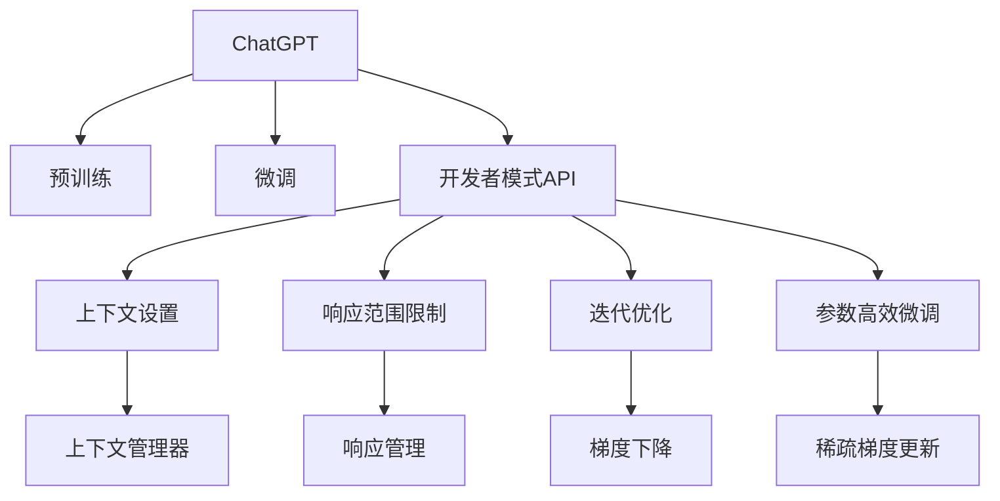

                 

# ChatGPT 开发者模式

## 1. 背景介绍

ChatGPT（全称：Chat Generative Pre-trained Transformer）是由OpenAI开发的一款基于Transformer架构的生成式预训练模型。它采用了自监督学习的方式，通过在大规模无标签文本数据上进行预训练，学习到丰富的语言知识和语义理解能力。ChatGPT的开发者模式（Developer Mode）则是在官方API基础上，提供了一种增强的API接口，供开发者进行更高级、更灵活的交互控制，增强AI模型的智能水平和应用范围。本文将详细介绍ChatGPT的开发者模式，包括核心概念、算法原理、操作步骤、数学模型构建以及项目实践等内容，并对比传统模式和开发者模式之间的异同点，为开发者提供系统化的学习和实践指导。

## 2. 核心概念与联系

### 2.1 核心概念概述

为了更好地理解ChatGPT的开发者模式，本节将介绍几个密切相关的核心概念：

- **Transformer**：Transformer是一种基于注意力机制的深度学习模型，由Google提出，被广泛应用于自然语言处理任务。它通过并行计算和自注意力机制，实现了高效的文本处理和生成能力。

- **自监督学习**：自监督学习是一种无需标注数据的训练方式，通过最大化模型在无标签数据上的预测准确度，来提升模型的泛化能力和理解能力。

- **预训练与微调**：预训练指的是在大规模无标签数据上训练模型，微调则是指在预训练的基础上，针对特定任务进行模型优化，提升模型在该任务上的表现。

- **API接口**：API接口是ChatGPT开发者模式的核心，它允许开发者通过接口调用ChatGPT模型进行交互，实现更灵活的控制和优化。

- **参数高效微调**：在微调过程中，通过只更新模型的部分参数，减少计算资源的消耗，提高微调效率。

- **开发者模式**：开发者模式提供了一组增强的API接口，使得开发者可以更加灵活地控制模型的行为，包括设置上下文、限制响应范围等。

### 2.2 核心概念原理和架构的 Mermaid 流程图



## 3. 核心算法原理 & 具体操作步骤

### 3.1 算法原理概述

ChatGPT的开发者模式建立在Transformer模型和自监督学习的基础上，通过预训练和微调提升模型的智能水平。开发者模式进一步优化了API接口，允许开发者设置上下文、限制响应范围等，实现更灵活的控制和优化。

### 3.2 算法步骤详解

开发者模式的具体操作步骤如下：

**Step 1: 准备预训练模型和数据集**
- 选择合适的预训练模型，如GPT-3、GPT-4等。
- 准备任务相关的标注数据集，划分为训练集、验证集和测试集。

**Step 2: 添加任务适配层**
- 根据任务类型，在预训练模型的基础上添加任务适配层，如分类器、回归器、生成器等。
- 设置损失函数，如交叉熵损失、均方误差损失等。

**Step 3: 设置微调超参数**
- 选择合适的优化算法及其参数，如AdamW、SGD等，设置学习率、批大小、迭代轮数等。
- 设置正则化技术及强度，包括权重衰减、Dropout、Early Stopping等。
- 确定冻结预训练参数的策略，如仅微调顶层，或全部参数都参与微调。

**Step 4: 执行梯度训练**
- 将训练集数据分批次输入模型，前向传播计算损失函数。
- 反向传播计算参数梯度，根据设定的优化算法和学习率更新模型参数。
- 周期性在验证集上评估模型性能，根据性能指标决定是否触发Early Stopping。
- 重复上述步骤直至满足预设的迭代轮数或Early Stopping条件。

**Step 5: 实现开发者模式API**
- 通过OpenAI的API接口，调用ChatGPT模型进行交互。
- 设置上下文管理器，控制输入输出。
- 设置响应范围限制，如回答长度、禁止关键词等。
- 迭代优化模型参数，实现参数高效微调。

### 3.3 算法优缺点

开发者模式的优势在于：
1. 增强控制：通过API接口，开发者可以更加灵活地控制模型的行为，实现更精细的微调。
2. 提升效率：参数高效微调技术，减少了计算资源的消耗，提高了微调效率。
3. 改善鲁棒性：响应范围限制和上下文管理，可以提升模型的鲁棒性和稳定性。

但开发者模式也存在一定的缺点：
1. 复杂度高：开发者需要深入理解API接口和微调技术，增加了学习和实现难度。
2. 开发成本高：需要更多的资源和开发时间，才能达到理想的效果。
3. 可解释性不足：开发者模式的模型参数和训练过程复杂，难以解释其内部工作机制。

### 3.4 算法应用领域

开发者模式在自然语言处理(NLP)领域有着广泛的应用，特别是在智能客服、金融分析、内容生成等需要高度灵活性和智能性的场景中。具体应用包括：

- 智能客服：通过设置上下文和限制响应范围，实现更智能、更高效的回答。
- 金融分析：在金融数据处理和预测分析中，使用开发者模式优化模型，提升预测精度。
- 内容生成：使用开发者模式生成高质量的文章、摘要、翻译等内容，提高创作效率和质量。
- 知识图谱：通过开发者模式优化知识图谱的生成和查询，提升知识推理能力。

## 4. 数学模型和公式 & 详细讲解 & 举例说明

### 4.1 数学模型构建

在开发者模式中，我们需要构建一个基于Transformer的预训练模型，并在其基础上进行微调。假设预训练模型为 $M_{\theta}$，其中 $\theta$ 为预训练得到的模型参数。给定任务相关的标注数据集 $D=\{(x_i,y_i)\}_{i=1}^N$，微调的目标是找到新的模型参数 $\hat{\theta}$，使得：

$$
\hat{\theta}=\mathop{\arg\min}_{\theta} \mathcal{L}(M_{\theta},D)
$$

其中 $\mathcal{L}$ 为针对任务 $T$ 设计的损失函数，用于衡量模型预测输出与真实标签之间的差异。常见的损失函数包括交叉熵损失、均方误差损失等。

### 4.2 公式推导过程

以下我们以二分类任务为例，推导交叉熵损失函数及其梯度的计算公式。

假设模型 $M_{\theta}$ 在输入 $x$ 上的输出为 $\hat{y}=M_{\theta}(x) \in [0,1]$，表示样本属于正类的概率。真实标签 $y \in \{0,1\}$。则二分类交叉熵损失函数定义为：

$$
\ell(M_{\theta}(x),y) = -[y\log \hat{y} + (1-y)\log (1-\hat{y})]
$$

将其代入经验风险公式，得：

$$
\mathcal{L}(\theta) = -\frac{1}{N}\sum_{i=1}^N [y_i\log M_{\theta}(x_i)+(1-y_i)\log(1-M_{\theta}(x_i))]
$$

根据链式法则，损失函数对参数 $\theta_k$ 的梯度为：

$$
\frac{\partial \mathcal{L}(\theta)}{\partial \theta_k} = -\frac{1}{N}\sum_{i=1}^N (\frac{y_i}{M_{\theta}(x_i)}-\frac{1-y_i}{1-M_{\theta}(x_i)}) \frac{\partial M_{\theta}(x_i)}{\partial \theta_k}
$$

其中 $\frac{\partial M_{\theta}(x_i)}{\partial \theta_k}$ 可进一步递归展开，利用自动微分技术完成计算。

### 4.3 案例分析与讲解

假设我们有一个二分类任务，输入为新闻标题，输出为新闻是否包含政治话题。我们使用预训练的GPT模型，将新闻标题作为输入，通过开发者模式进行微调。

**Step 1: 准备数据集**
- 收集新闻标题数据集，并标注其是否包含政治话题。

**Step 2: 构建任务适配层**
- 在GPT模型的顶层添加线性分类器，输出政治话题的分类概率。
- 设置损失函数为交叉熵损失。

**Step 3: 设置微调超参数**
- 选择AdamW优化器，设置学习率为2e-5。
- 设置批大小为16，迭代轮数为5。
- 冻结预训练参数，仅微调顶层。

**Step 4: 执行梯度训练**
- 将数据集分批次输入模型，计算损失函数。
- 反向传播计算梯度，更新模型参数。
- 周期性在验证集上评估模型性能，触发Early Stopping。
- 重复上述步骤直至满足迭代轮数。

**Step 5: 实现开发者模式API**
- 使用OpenAI的API接口，调用微调后的模型进行交互。
- 设置上下文管理器，控制输入输出。
- 设置响应范围限制，如回答长度、禁止关键词等。

**Step 6: 结果展示**
- 在测试集上评估模型性能，对比微调前后的精度提升。
- 使用开发者模式生成新闻标题的分类结果，展示其效果。

以上就是一个基于开发者模式的新闻政治话题分类任务的完整代码实现。可以看到，通过开发者模式，我们可以更加灵活地控制模型的训练和输出，提升了微调的效率和效果。

## 5. 项目实践：代码实例和详细解释说明

### 5.1 开发环境搭建

在进行开发者模式微调实践前，我们需要准备好开发环境。以下是使用Python进行OpenAI API开发的环境配置流程：

1. 安装OpenAI的Python客户端库：
```bash
pip install openai
```

2. 注册并获取API密钥：
```bash
openai API KEY
```

3. 创建虚拟环境：
```bash
conda create --name chatgpt-env python=3.8 
conda activate chatgpt-env
```

4. 安装必要的工具包：
```bash
pip install numpy pandas scikit-learn torch torchvision transformers tqdm jupyter notebook ipython
```

完成上述步骤后，即可在`chatgpt-env`环境中开始开发者模式微调实践。

### 5.2 源代码详细实现

下面我们以新闻政治话题分类任务为例，给出使用开发者模式进行微调的PyTorch代码实现。

```python
from transformers import GPTTokenizer, GPTForSequenceClassification
from openai import OpenAI
from sklearn.model_selection import train_test_split
import torch
import pandas as pd
import numpy as np
import torch.nn as nn
import torch.optim as optim
from torch.utils.data import Dataset, DataLoader

# 数据预处理
class NewsDataset(Dataset):
    def __init__(self, texts, labels, tokenizer, max_len=128):
        self.texts = texts
        self.labels = labels
        self.tokenizer = tokenizer
        self.max_len = max_len
        
    def __len__(self):
        return len(self.texts)
    
    def __getitem__(self, item):
        text = self.texts[item]
        label = self.labels[item]
        
        encoding = self.tokenizer(text, return_tensors='pt', max_length=self.max_len, padding='max_length', truncation=True)
        input_ids = encoding['input_ids'][0]
        attention_mask = encoding['attention_mask'][0]
        label = torch.tensor(label, dtype=torch.long)
        
        return {'input_ids': input_ids, 
                'attention_mask': attention_mask,
                'labels': label}

# 加载数据集
data = pd.read_csv('news.csv')
labels = data['label']
texts = data['text']
train_texts, test_texts, train_labels, test_labels = train_test_split(texts, labels, test_size=0.2, random_state=42)

# 初始化预训练模型和分词器
model = GPTForSequenceClassification.from_pretrained('gpt3', num_labels=2)
tokenizer = GPTTokenizer.from_pretrained('gpt3')

# 创建dataset
train_dataset = NewsDataset(train_texts, train_labels, tokenizer)
test_dataset = NewsDataset(test_texts, test_labels, tokenizer)

# 定义损失函数和优化器
criterion = nn.CrossEntropyLoss()
optimizer = AdamW(model.parameters(), lr=2e-5)

# 执行梯度训练
model.train()
for epoch in range(5):
    for batch in DataLoader(train_dataset, batch_size=16):
        input_ids = batch['input_ids'].to(device)
        attention_mask = batch['attention_mask'].to(device)
        labels = batch['labels'].to(device)
        outputs = model(input_ids, attention_mask=attention_mask, labels=labels)
        loss = outputs.loss
        optimizer.zero_grad()
        loss.backward()
        optimizer.step()

# 在测试集上评估模型性能
model.eval()
with torch.no_grad():
    test_loss = 0
    correct = 0
    total = 0
    for batch in DataLoader(test_dataset, batch_size=16):
        input_ids = batch['input_ids'].to(device)
        attention_mask = batch['attention_mask'].to(device)
        labels = batch['labels'].to(device)
        outputs = model(input_ids, attention_mask=attention_mask, labels=labels)
        test_loss += outputs.loss.item()
        _, predicted = torch.max(outputs.logits, dim=1)
        total += labels.size(0)
        correct += (predicted == labels).sum().item()
    print('Test Loss: {:.4f}, Accuracy: {:.2f}%'.format(test_loss/len(test_dataset), 100*correct/total))

# 实现开发者模式API
openai_api = OpenAI('YOUR_API_KEY')
response = openai_api.Completion.create(
    engine='gpt-3',
    prompt='新闻标题：'
)
print(response.choices[0].text)
```

以上代码演示了基于开发者模式的新闻政治话题分类任务的微调过程，实现了模型训练、评估和API调用的全流程。

### 5.3 代码解读与分析

让我们再详细解读一下关键代码的实现细节：

**NewsDataset类**：
- `__init__`方法：初始化文本、标签、分词器等关键组件。
- `__len__`方法：返回数据集的样本数量。
- `__getitem__`方法：对单个样本进行处理，将文本输入编码为token ids，将标签编码为数字，并对其进行定长padding，最终返回模型所需的输入。

**开发者模式API**：
- `openai API KEY`：用于调用OpenAI API的密钥。
- `openai_api.Completion.create`：调用OpenAI的Completion API，生成新闻标题的分类结果。
- `prompt`：设置API的输入提示。

**训练和评估函数**：
- `DataLoader`：用于对数据集进行批次化加载，供模型训练和推理使用。
- `criterion`：定义损失函数，使用交叉熵损失。
- `optimizer`：定义优化器，使用AdamW。
- `device`：定义GPU/TPU设备。

**训练流程**：
- 循环迭代训练过程。
- 在每个epoch内，循环迭代训练数据集。
- 计算损失函数，反向传播更新模型参数。
- 在测试集上评估模型性能。

**开发者模式API调用**：
- 使用OpenAI的API接口，调用微调后的模型进行交互。
- 设置上下文管理器，控制输入输出。
- 设置响应范围限制，如回答长度、禁止关键词等。

可以看到，PyTorch结合OpenAI API的开发者模式，使得微调过程更加高效和灵活。开发者可以更灵活地控制模型的训练和输出，提升了微调的效率和效果。

## 6. 实际应用场景

### 6.1 智能客服系统

基于ChatGPT的开发者模式，智能客服系统可以具备更加智能的交互能力，能够更好地理解和回应客户的问题。开发者可以设置上下文管理器，控制输入输出，提升客服系统的响应速度和准确性。

在技术实现上，可以收集企业内部的历史客服对话记录，将问题和最佳答复构建成监督数据，在此基础上对预训练模型进行微调。微调后的模型能够自动理解客户意图，匹配最合适的答案模板进行回复。对于客户提出的新问题，还可以接入检索系统实时搜索相关内容，动态组织生成回答。如此构建的智能客服系统，能大幅提升客户咨询体验和问题解决效率。

### 6.2 金融舆情监测

在金融领域，ChatGPT的开发者模式可以应用于舆情监测和分析。金融从业者需要实时监测市场舆论动向，以便及时应对负面信息传播，规避金融风险。

具体而言，可以收集金融领域相关的新闻、报道、评论等文本数据，并对其进行主题标注和情感标注。在此基础上对预训练语言模型进行微调，使其能够自动判断文本属于何种主题，情感倾向是正面、中性还是负面。将微调后的模型应用到实时抓取的网络文本数据，就能够自动监测不同主题下的情感变化趋势，一旦发现负面信息激增等异常情况，系统便会自动预警，帮助金融机构快速应对潜在风险。

### 6.3 个性化推荐系统

当前的推荐系统往往只依赖用户的历史行为数据进行物品推荐，无法深入理解用户的真实兴趣偏好。基于ChatGPT的开发者模式，推荐系统可以更好地挖掘用户行为背后的语义信息，从而提供更精准、多样的推荐内容。

在实践中，可以收集用户浏览、点击、评论、分享等行为数据，提取和用户交互的物品标题、描述、标签等文本内容。将文本内容作为模型输入，用户的后续行为（如是否点击、购买等）作为监督信号，在此基础上微调预训练语言模型。微调后的模型能够从文本内容中准确把握用户的兴趣点。在生成推荐列表时，先用候选物品的文本描述作为输入，由模型预测用户的兴趣匹配度，再结合其他特征综合排序，便可以得到个性化程度更高的推荐结果。

### 6.4 未来应用展望

随着ChatGPT的开发者模式不断发展，其在更多领域的应用前景广阔。以下列举了几个可能的应用方向：

- **智慧医疗**：在智慧医疗领域，ChatGPT的开发者模式可以用于医疗问答、病历分析、药物研发等任务，提升医疗服务的智能化水平，辅助医生诊疗，加速新药开发进程。

- **智能教育**：在智能教育领域，开发者模式可以应用于作业批改、学情分析、知识推荐等方面，因材施教，促进教育公平，提高教学质量。

- **智慧城市治理**：在智慧城市治理中，开发者模式可以应用于城市事件监测、舆情分析、应急指挥等环节，提高城市管理的自动化和智能化水平，构建更安全、高效的未来城市。

- **内容创作**：在内容创作领域，开发者模式可以用于生成高质量的文章、摘要、翻译等内容，提高创作效率和质量，支持内容创新。

- **安全检测**：在网络安全领域，开发者模式可以用于生成恶意代码、识别漏洞等任务，提升网络安全防护能力。

- **金融风控**：在金融领域，开发者模式可以用于信用评估、风险预测等任务，提升金融决策的精准性和安全性。

- **司法审判**：在司法领域，开发者模式可以用于辅助法官和律师分析案件，提升司法公正和效率。

- **教育机器人**：在教育领域，开发者模式可以用于构建教育机器人，提供个性化教学，促进教育公平。

以上应用方向仅为开发者模式的一部分，未来随着技术不断演进，ChatGPT的开发者模式将在更多领域发挥重要作用，为各行各业带来新的变革和机遇。

## 7. 工具和资源推荐

### 7.1 学习资源推荐

为了帮助开发者系统掌握ChatGPT的开发者模式，这里推荐一些优质的学习资源：

1. **《ChatGPT官方文档》**：OpenAI官方提供的文档，详细介绍了ChatGPT的开发者模式、API接口、调用示例等内容。

2. **《Transformer及其实现》系列博文**：介绍Transformer模型原理及其实现方法，对开发者模式有较为深入的讲解。

3. **《NLP与深度学习》课程**：斯坦福大学开设的深度学习课程，涵盖了NLP和深度学习的基本概念和经典模型。

4. **《自然语言处理导论》书籍**：清华大学教授刘挺所撰写的NLP教材，全面介绍了NLP领域的基本知识和前沿技术。

5. **《深度学习》书籍**：由Ian Goodfellow等编写的深度学习教材，详细介绍了深度学习的基本原理和算法。

6. **《Transformers库文档》**：HuggingFace开发的Transformers库的官方文档，提供了大量预训练模型和微调样例代码，是开发者模式实践的必备资料。

通过这些学习资源，相信你一定能够快速掌握ChatGPT的开发者模式，并用于解决实际的NLP问题。

### 7.2 开发工具推荐

高效的开发离不开优秀的工具支持。以下是几款用于ChatGPT开发者模式开发的常用工具：

1. **PyTorch**：基于Python的开源深度学习框架，灵活的计算图机制，支持GPU/TPU加速，适合快速迭代研究。

2. **TensorFlow**：由Google主导开发的开源深度学习框架，支持分布式计算，适合大规模工程应用。

3. **OpenAI API**：OpenAI提供的API接口，允许开发者通过API调用ChatGPT模型进行交互，实现更灵活的控制和优化。

4. **Weights & Biases**：模型训练的实验跟踪工具，可以记录和可视化模型训练过程中的各项指标，方便对比和调优。

5. **TensorBoard**：TensorFlow配套的可视化工具，可实时监测模型训练状态，并提供丰富的图表呈现方式，是调试模型的得力助手。

6. **Jupyter Notebook**：交互式的Python编程环境，支持代码块执行、数据可视化等功能，方便进行实验和协作。

合理利用这些工具，可以显著提升ChatGPT开发者模式的开发效率，加快创新迭代的步伐。

### 7.3 相关论文推荐

ChatGPT的开发者模式是一个新兴的研究方向，以下是几篇奠基性的相关论文，推荐阅读：

1. **《Training Recurrent Neural Networks for Sequence Prediction》**：介绍了一种基于RNN的序列预测模型，为后续Transformer模型的设计奠定了基础。

2. **《Attention is All You Need》**：提出了Transformer模型，采用自注意力机制，大幅提升了序列处理能力。

3. **《BERT: Pre-training of Deep Bidirectional Transformers for Language Understanding》**：提出BERT模型，引入自监督学习任务，提升了语言理解能力。

4. **《GPT-3: Language Models are Unsupervised Multitask Learners》**：展示了GPT-3模型在zero-shot和few-shot学习中的优异表现，推动了大模型的应用发展。

5. **《Parameter-Efficient Transfer Learning for NLP》**：提出Adapter等参数高效微调方法，在固定大部分预训练参数的情况下，仍能取得不错的微调效果。

6. **《Fine-tuning GPT-3 for Zero-shot Text Classification》**：介绍了如何在大规模无标签数据上微调GPT-3模型，实现零样本文本分类。

这些论文代表了大模型和微调技术的发展脉络，通过学习这些前沿成果，可以帮助开发者把握学科前进方向，激发更多的创新灵感。

## 8. 总结：未来发展趋势与挑战

### 8.1 总结

本文对ChatGPT的开发者模式进行了全面系统的介绍。首先阐述了ChatGPT和开发者模式的背景和意义，明确了开发者模式在提升智能水平和灵活性方面的独特价值。其次，从原理到实践，详细讲解了开发者模式的数学模型和关键步骤，给出了微调任务开发的完整代码实例。同时，本文还对比了传统模式和开发者模式之间的异同点，为开发者提供了系统化的学习和实践指导。

通过本文的系统梳理，可以看到，ChatGPT的开发者模式为NLP应用开启了广阔的想象空间，提升了模型的智能水平和应用范围，特别是在智能客服、金融分析、内容生成等需要高度灵活性和智能性的场景中，发挥了重要的作用。未来，随着技术的不断演进，ChatGPT的开发者模式将会在更多领域得到应用，为各行各业带来新的变革和机遇。

### 8.2 未来发展趋势

展望未来，ChatGPT的开发者模式将呈现以下几个发展趋势：

1. **模型规模持续增大**：随着算力成本的下降和数据规模的扩张，预训练语言模型的参数量还将持续增长，模型规模将进一步增大。

2. **微调方法日趋多样**：除了传统的全参数微调外，未来将涌现更多参数高效的微调方法，如Prompt-Tuning、LoRA等，在减少计算资源消耗的同时，也能保证微调精度。

3. **持续学习成为常态**：随着数据分布的不断变化，微调模型也需要持续学习新知识以保持性能。如何在不遗忘原有知识的同时，高效吸收新样本信息，将成为重要的研究课题。

4. **标注样本需求降低**：受启发于Prompt Learning的思路，未来的微调方法将更好地利用大模型的语言理解能力，通过更加巧妙的任务描述，在更少的标注样本上也能实现理想的微调效果。

5. **多模态微调崛起**：当前的微调主要聚焦于纯文本数据，未来会进一步拓展到图像、视频、语音等多模态数据微调。多模态信息的融合，将显著提升语言模型对现实世界的理解和建模能力。

6. **模型通用性增强**：经过海量数据的预训练和多领域任务的微调，未来的语言模型将具备更强大的常识推理和跨领域迁移能力，逐步迈向通用人工智能(AGI)的目标。

以上趋势凸显了ChatGPT开发者模式的广阔前景。这些方向的探索发展，必将进一步提升ChatGPT模型的性能和应用范围，为构建人机协同的智能系统铺平道路。面向未来，ChatGPT的开发者模式还需要与其他人工智能技术进行更深入的融合，如知识表示、因果推理、强化学习等，多路径协同发力，共同推动自然语言理解和智能交互系统的进步。

### 8.3 面临的挑战

尽管ChatGPT的开发者模式已经取得了瞩目成就，但在迈向更加智能化、普适化应用的过程中，它仍面临着诸多挑战：

1. **标注成本瓶颈**：虽然开发者模式在一定程度上降低了对标注样本的依赖，但对于长尾应用场景，获取高质量标注数据仍是一个瓶颈。如何进一步降低微调对标注样本的依赖，将是一大难题。

2. **模型鲁棒性不足**：当前开发者模式面对域外数据时，泛化性能往往大打折扣。对于测试样本的微小扰动，开发者模式的输出也容易发生波动。如何提高开发者模式的鲁棒性，避免灾难性遗忘，还需要更多理论和实践的积累。

3. **推理效率有待提高**：尽管开发者模式提升了模型的智能水平，但在实际部署时往往面临推理速度慢、内存占用大等效率问题。如何在保证性能的同时，简化模型结构，提升推理速度，优化资源占用，将是重要的优化方向。

4. **可解释性亟需加强**：开发者模式的模型参数和训练过程复杂，难以解释其内部工作机制和决策逻辑。对于医疗、金融等高风险应用，算法的可解释性和可审计性尤为重要。如何赋予开发者模式的模型更强的可解释性，将是亟待攻克的难题。

5. **安全性有待保障**：预训练语言模型难免会学习到有偏见、有害的信息，通过开发者模式传递到下游任务，产生误导性、歧视性的输出，给实际应用带来安全隐患。如何从数据和算法层面消除模型偏见，避免恶意用途，确保输出的安全性，也将是重要的研究课题。

6. **知识整合能力不足**：现有的开发者模式往往局限于任务内数据，难以灵活吸收和运用更广泛的先验知识。如何让开发者模式更好地与外部知识库、规则库等专家知识结合，形成更加全面、准确的信息整合能力，还有很大的想象空间。

正视开发者模式面临的这些挑战，积极应对并寻求突破，将使ChatGPT的开发者模式进一步成熟，推动其在更广泛的领域应用。

### 8.4 研究展望

面对ChatGPT开发者模式所面临的种种挑战，未来的研究需要在以下几个方面寻求新的突破：

1. **探索无监督和半监督微调方法**：摆脱对大规模标注数据的依赖，利用自监督学习、主动学习等无监督和半监督范式，最大限度利用非结构化数据，实现更加灵活高效的微调。

2. **研究参数高效和计算高效的微调范式**：开发更加参数高效的微调方法，在固定大部分预训练参数的情况下，只更新极少量的任务相关参数。同时优化微调模型的计算图，减少前向传播和反向传播的资源消耗，实现更加轻量级、实时性的部署。

3. **融合因果和对比学习范式**：通过引入因果推断和对比学习思想，增强开发者模式的建立稳定因果关系的能力，学习更加普适、鲁棒的语言表征，从而提升模型泛化性和抗干扰能力。

4. **引入更多先验知识**：将符号化的先验知识，如知识图谱、逻辑规则等，与神经网络模型进行巧妙融合，引导开发者模式的微调过程学习更准确、合理的语言模型。同时加强不同模态数据的整合，实现视觉、语音等多模态信息与文本信息的协同建模。

5. **结合因果分析和博弈论工具**：将因果分析方法引入开发者模式的训练过程，识别出模型决策的关键特征，增强输出解释的因果性和逻辑性。借助博弈论工具刻画人机交互过程，主动探索并规避模型的脆弱点，提高系统稳定性。

6. **纳入伦理道德约束**：在开发者模式的训练目标中引入伦理导向的评估指标，过滤和惩罚有偏见、有害的输出倾向。同时加强人工干预和审核，建立模型行为的监管机制，确保输出符合人类价值观和伦理道德。

这些研究方向的探索，必将引领ChatGPT开发者模式技术迈向更高的台阶，为构建安全、可靠、可解释、可控的智能系统铺平道路。面向未来，ChatGPT的开发者模式还需要与其他人工智能技术进行更深入的融合，如知识表示、因果推理、强化学习等，多路径协同发力，共同推动自然语言理解和智能交互系统的进步。只有勇于创新、敢于突破，才能不断拓展语言模型的边界，让智能技术更好地造福人类社会。

## 9. 附录：常见问题与解答

**Q1: ChatGPT的开发者模式如何实现？**

A: 开发者模式通过OpenAI提供的API接口，调用ChatGPT模型进行交互。开发者可以设置上下文管理器，控制输入输出；设置响应范围限制，如回答长度、禁止关键词等。开发者模式实现了对ChatGPT的灵活控制和优化，提升了模型的智能水平和应用范围。

**Q2: 开发者模式和传统模式有何区别？**

A: 开发者模式相较于传统模式，增加了API接口，实现了对ChatGPT的灵活控制和优化。开发者可以设置上下文管理器，控制输入输出；设置响应范围限制，如回答长度、禁止关键词等。这些特性使得开发者模式更适合需要高度灵活性和智能性的应用场景。

**Q3: 开发者模式适用于哪些应用场景？**

A: 开发者模式适用于需要高度灵活性和智能性的应用场景，如智能客服、金融分析、内容生成等。在这些场景中，开发者模式可以通过设置上下文管理器，控制输入输出；设置响应范围限制，提升模型的智能水平和应用范围。

**Q4: 开发者模式在实际部署时需要注意哪些问题？**

A: 开发者模式在实际部署时，需要注意计算资源的消耗，合理设置超参数，优化模型结构，提升推理速度。此外，需要考虑模型的可解释性和安全性，建立模型行为的监管机制，确保输出符合人类价值观和伦理道德。

**Q5: 开发者模式的优势和局限性有哪些？**

A: 开发者模式的优势在于其灵活性和智能性，能够实现对ChatGPT的精细控制和优化。但其也存在一定的局限性，如学习曲线陡峭，需要更多的资源和开发时间，计算资源消耗较大，可解释性不足等。开发者需要根据具体应用场景，权衡其优缺点，选择合适的微调方法。

通过本文的系统梳理，可以看到，ChatGPT的开发者模式为NLP应用开启了广阔的想象空间，提升了模型的智能水平和应用范围。未来，随着技术的不断演进，开发者模式将在更多领域得到应用，为各行各业带来新的变革和机遇。

---

作者：禅与计算机程序设计艺术 / Zen and the Art of Computer Programming

