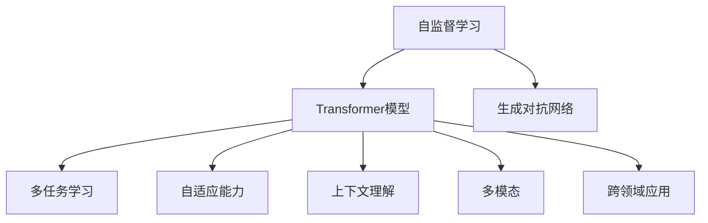

                 

# ChatGPT的工作原理解析

> 关键词：自然语言处理(NLP),生成对抗网络(GAN),Transformer模型,无监督学习,多任务学习,自监督学习,自适应能力,上下文理解

## 1. 背景介绍

### 1.1 问题由来
近年来，随着深度学习技术的飞速发展，自然语言处理(Natural Language Processing, NLP)领域取得了巨大的突破。特别是在自然语言生成任务上，OpenAI的GPT系列模型、Google的GPT-3等大模型以惊人的效果展示了其在对话、翻译、摘要等任务上的强大能力。

ChatGPT作为OpenAI的旗舰模型，其核心原理正是基于GPT-3等预训练语言模型的生成对抗网络(GAN)机制，通过自监督学习的方式进行大规模预训练，并在微调任务上显著提升了性能。本文将全面解析ChatGPT的工作原理，探究其背后所依赖的核心技术和算法，并展望其未来的发展方向。

### 1.2 问题核心关键点
ChatGPT的工作原理涉及自然语言处理、生成对抗网络、Transformer模型等多个核心概念。本文将从以下关键点进行解析：
1. **自监督学习与预训练**：ChatGPT的核心优势在于其基于自监督学习进行大规模预训练。
2. **生成对抗网络**：通过生成器与判别器的博弈过程，进一步提升了模型的生成能力和稳定性。
3. **Transformer模型**：Transformer的编码器-解码器结构是ChatGPT生成的关键。
4. **上下文理解与连贯性**：ChatGPT通过多任务学习和自适应能力，实现了上下文相关且连贯的对话输出。
5. **多模态与跨领域应用**：ChatGPT的生成能力不仅限于文本领域，还具备多模态处理与跨领域应用的能力。

## 2. 核心概念与联系

### 2.1 核心概念概述

为更好地理解ChatGPT的工作原理，本节将介绍几个密切相关的核心概念：

- **自然语言处理(NLP)**：涉及语言的表示、理解、生成和分析，旨在使计算机能够处理和理解人类语言。
- **生成对抗网络(GAN)**：一种通过两个神经网络（生成器和判别器）之间的博弈，生成逼真且高质量的数据的深度学习模型。
- **Transformer模型**：一种基于注意力机制的神经网络架构，用于处理序列数据，特别适用于自然语言处理任务。
- **自监督学习**：一种无需标注数据即可学习的深度学习技术，通过输入数据中的隐含关系进行自我监督。
- **多任务学习**：在同一模型上训练多个任务，通过任务之间的共享表示提升整体性能。
- **自适应能力**：指模型能够根据输入数据动态调整内部参数，适应不同语境和主题。
- **上下文理解**：指模型能够理解输入文本的上下文，并据此进行连贯的生成。
- **多模态**：指模型能够处理和整合文本、图像、语音等多类型的数据。
- **跨领域应用**：指模型能够在不同领域（如医疗、金融、教育等）中应用，提升其通用性和普适性。

这些核心概念之间的逻辑关系可以通过以下Mermaid流程图来展示：



这个流程图展示了大语言模型的核心概念及其之间的关系：

1. **自监督学习**：提供丰富的训练数据，帮助Transformer模型学习到通用的语言表示。
2. **Transformer模型**：作为核心的生成架构，负责处理序列数据。
3. **生成对抗网络**：通过对抗过程进一步优化语言模型，提高生成质量。
4. **多任务学习**：通过多个任务的联合训练，提升模型的泛化能力和连贯性。
5. **自适应能力**：使模型能够根据输入数据动态调整生成策略。
6. **上下文理解**：帮助模型理解输入文本的上下文信息，生成连贯的对话。
7. **多模态**：增强模型的感知能力，处理不同类型的输入。
8. **跨领域应用**：使模型能够在不同领域中应用，提升其通用性。

这些概念共同构成了ChatGPT的基础工作原理，使其能够在各种自然语言处理任务上表现出色。

## 3. 核心算法原理 & 具体操作步骤
### 3.1 算法原理概述

ChatGPT的工作原理主要基于Transformer模型和自监督学习的生成对抗网络（GAN）机制。以下是该过程的详细解析：

1. **自监督学习与预训练**：
   - **自监督学习**：利用无标签数据进行训练，自动生成任务，如掩码语言模型（Masked Language Model, MLM）和下一句预测任务（Next Sentence Prediction, NSP）。这些任务的目标是让模型在预测缺失词或下一个句子时，能够充分利用上下文信息，从而学习到通用的语言表示。
   - **预训练**：在大规模无标签文本数据上进行自监督学习，如OpenAI的GPT-3模型使用约7500亿个英文单词进行预训练，积累了大量的语言知识。

2. **生成对抗网络（GAN）**：
   - **生成器**：通过预训练得到的基础语言模型，生成逼真的文本数据，如对话、文章等。
   - **判别器**：区分生成文本和真实文本，通过对抗生成器的过程，不断提升生成文本的质量。
   - **训练过程**：生成器通过生成虚假文本，判别器通过判断其真实性，两者不断博弈，生成器逐渐提升其生成能力，判别器逐渐提升其区分能力，最终两者达到均衡状态。

3. **Transformer模型**：
   - **编码器-解码器结构**：Transformer模型通过自注意力机制（Self-Attention）捕捉输入序列中不同位置之间的依赖关系，并在解码过程中利用编码器输出的表示进行生成。
   - **多头注意力机制**：Transformer模型使用多个注意力头，帮助模型从不同视角捕捉信息，提升生成能力。
   - **位置编码**：在自注意力机制中加入位置编码，使模型能够区分不同位置的信息，从而生成连贯的文本。

### 3.2 算法步骤详解

以下是ChatGPT生成过程的详细步骤：

1. **输入处理**：将用户输入的文本进行标记化（Tokenization），转化为模型所需的向量形式。
2. **编码器生成向量表示**：使用预训练好的Transformer模型，将输入文本编码成一系列向量表示。
3. **解码器生成文本**：通过解码器，使用生成对抗网络机制，生成与输入文本相关的文本。
   - **生成器工作**：根据编码器输出的向量表示，生成新的文本。
   - **判别器工作**：判断生成的文本是否逼真，给出评估分数。
   - **更新生成器**：根据判别器的反馈，调整生成器参数，生成更逼真的文本。
4. **多任务学习与自适应能力**：
   - **多任务学习**：在训练过程中，引入多个任务（如问答、对话、摘要等），共享模型参数，提升模型的泛化能力。
   - **自适应能力**：根据输入文本的上下文信息，动态调整生成策略，生成连贯的对话或文本。
5. **输出后处理**：对生成的文本进行后处理，如去除重复词、插入停用词、格式化等，得到最终的输出结果。

### 3.3 算法优缺点

ChatGPT的生成过程具有以下优点：

1. **生成能力强**：通过自监督学习和生成对抗网络机制，ChatGPT能够生成高质量、连贯的文本。
2. **泛化能力强**：通过多任务学习和自适应能力，ChatGPT能够在多种自然语言处理任务上表现出色。
3. **鲁棒性好**：生成对抗网络机制使ChatGPT能够抵御噪声和干扰，生成稳定的输出。

同时，该算法也存在一些缺点：

1. **计算成本高**：生成对抗网络机制和大规模预训练需要大量的计算资源和时间。
2. **数据依赖性高**：生成器需要大量的高质量数据进行训练，才能生成高质量的文本。
3. **可解释性差**：ChatGPT的生成过程复杂，难以解释其内部工作机制和决策逻辑。

### 3.4 算法应用领域

ChatGPT的生成能力广泛应用于以下领域：

1. **聊天机器人**：提供自然流畅的对话体验，支持多种应用场景，如客户服务、虚拟助手等。
2. **文本生成**：用于文章撰写、摘要生成、对话生成等，提升工作效率和创造力。
3. **翻译**：进行文本翻译和语言转换，支持多语言交流。
4. **代码生成**：帮助程序员编写代码，减少重复劳动，提升开发效率。
5. **内容创作**：辅助内容创作，生成创意文章、博客、小说等。
6. **数据分析**：进行文本分析、情感分析、主题分类等，提取有用的信息。
7. **教育培训**：提供智能辅导、语言学习、知识查询等服务，提升教育效果。

## 4. 数学模型和公式 & 详细讲解  
### 4.1 数学模型构建

ChatGPT的生成过程可以抽象为一个数学模型，详细解析如下：

1. **输入表示**：将输入文本 $x$ 转化为模型所需的向量形式 $\mathbf{x} \in \mathbb{R}^d$，其中 $d$ 为向量维度。
2. **编码器生成向量表示**：使用预训练好的Transformer模型，将输入文本编码成一系列向量表示 $h_1, h_2, \ldots, h_T$，其中 $T$ 为文本长度。
3. **解码器生成文本**：通过解码器，使用生成对抗网络机制，生成新的文本。
   - **生成器工作**：根据编码器输出的向量表示 $h_T$，生成新的文本 $y_1, y_2, \ldots, y_N$。
   - **判别器工作**：判断生成的文本 $y_i$ 是否逼真，给出评估分数 $p_i$，其中 $N$ 为生成文本的长度。
   - **更新生成器**：根据判别器的反馈，调整生成器参数，生成更逼真的文本。
4. **多任务学习与自适应能力**：在训练过程中，引入多个任务 $T_1, T_2, \ldots, T_M$，共享模型参数，提升模型的泛化能力。
   - **多任务学习目标**：最小化多个任务的联合损失函数 $\mathcal{L}_{total} = \sum_{i=1}^M \mathcal{L}_i$。
   - **自适应能力**：根据输入文本的上下文信息，动态调整生成策略，生成连贯的对话或文本。

### 4.2 公式推导过程

以下是ChatGPT生成过程的详细数学推导：

1. **自监督学习与预训练**：
   - **掩码语言模型（MLM）**：最大化 $P(\hat{y}|\mathbf{x})$，其中 $\hat{y}$ 为掩码位置的预测词，$\mathbf{x}$ 为输入文本。
   - **下一句预测（NSP）**：最大化 $P(y_{i+1}|\mathbf{x})$，其中 $y_{i+1}$ 为下一个句子的预测，$\mathbf{x}$ 为输入文本。

2. **生成对抗网络（GAN）**：
   - **生成器损失函数**：$L_G = \mathbb{E}_{x}[D(x)] + \mathbb{E}_{\hat{x}}[1-D(\hat{x})]$，其中 $x$ 为真实文本，$\hat{x}$ 为生成文本，$D$ 为判别器。
   - **判别器损失函数**：$L_D = \mathbb{E}_{x}[D(x)] + \mathbb{E}_{\hat{x}}[1-D(\hat{x})]$，其中 $x$ 为真实文本，$\hat{x}$ 为生成文本，$D$ 为判别器。

3. **Transformer模型**：
   - **自注意力机制**：$\mathbf{z} = \mathbf{W}^Q \mathbf{h} \mathbf{W}^K (\mathbf{h} \mathbf{W}^V)^T$，其中 $\mathbf{h}$ 为输入向量，$\mathbf{z}$ 为注意力权重，$\mathbf{W}^Q, \mathbf{W}^K, \mathbf{W}^V$ 为可学习参数。
   - **多头注意力机制**：$\mathbf{z}_i = \mathbf{W}^Q_i \mathbf{h} \mathbf{W}^K_i (\mathbf{h} \mathbf{W}^V_i)^T$，其中 $i$ 为注意力头。

### 4.3 案例分析与讲解

以生成对话为例，分析ChatGPT的工作原理：

1. **输入处理**：将用户输入的对话历史 $h_{t-1}, h_{t-2}, \ldots, h_0$ 进行标记化，转化为模型所需的向量形式。
2. **编码器生成向量表示**：使用预训练好的Transformer模型，将对话历史编码成一系列向量表示 $h_{t-1}, h_{t-2}, \ldots, h_0$。
3. **解码器生成文本**：通过解码器，使用生成对抗网络机制，生成新的对话文本 $y_t$。
   - **生成器工作**：根据编码器输出的向量表示 $h_0$，生成新的对话文本 $y_t$。
   - **判别器工作**：判断生成的对话文本 $y_t$ 是否逼真，给出评估分数 $p_t$。
   - **更新生成器**：根据判别器的反馈，调整生成器参数，生成更逼真的对话文本 $y_t$。
4. **多任务学习与自适应能力**：在训练过程中，引入多个对话生成任务 $T_1, T_2, \ldots, T_M$，共享模型参数，提升模型的泛化能力。
   - **多任务学习目标**：最小化多个任务的联合损失函数 $\mathcal{L}_{total} = \sum_{i=1}^M \mathcal{L}_i$。
   - **自适应能力**：根据对话历史 $h_{t-1}, h_{t-2}, \ldots, h_0$ 的上下文信息，动态调整生成策略，生成连贯的对话文本 $y_t$。

## 5. 项目实践：代码实例和详细解释说明
### 5.1 开发环境搭建

在进行ChatGPT开发前，我们需要准备好开发环境。以下是使用Python进行PyTorch开发的环境配置流程：

1. 安装Anaconda：从官网下载并安装Anaconda，用于创建独立的Python环境。

2. 创建并激活虚拟环境：
```bash
conda create -n pytorch-env python=3.8 
conda activate pytorch-env
```

3. 安装PyTorch：根据CUDA版本，从官网获取对应的安装命令。例如：
```bash
conda install pytorch torchvision torchaudio cudatoolkit=11.1 -c pytorch -c conda-forge
```

4. 安装HuggingFace Transformers库：
```bash
pip install transformers
```

5. 安装各类工具包：
```bash
pip install numpy pandas scikit-learn matplotlib tqdm jupyter notebook ipython
```

完成上述步骤后，即可在`pytorch-env`环境中开始ChatGPT的开发实践。

### 5.2 源代码详细实现

这里我们以GPT-3模型为例，给出使用Transformers库进行自然语言生成的PyTorch代码实现。

首先，定义生成器函数：

```python
from transformers import GPT3LMHeadModel, GPT3Tokenizer

def generate_text(model, tokenizer, prompt, max_length=512, num_return_sequences=1):
    inputs = tokenizer.encode(prompt, return_tensors='pt')
    outputs = model.generate(inputs, max_length=max_length, num_return_sequences=num_return_sequences)
    return tokenizer.decode(outputs[0], skip_special_tokens=True)
```

然后，定义训练和评估函数：

```python
from torch.utils.data import DataLoader
from tqdm import tqdm
from sklearn.metrics import bleu_score

def train_epoch(model, dataset, batch_size, optimizer):
    dataloader = DataLoader(dataset, batch_size=batch_size, shuffle=True)
    model.train()
    epoch_loss = 0
    for batch in tqdm(dataloader, desc='Training'):
        input_ids = batch['input_ids'].to(device)
        attention_mask = batch['attention_mask'].to(device)
        labels = batch['labels'].to(device)
        model.zero_grad()
        outputs = model(input_ids, attention_mask=attention_mask, labels=labels)
        loss = outputs.loss
        epoch_loss += loss.item()
        loss.backward()
        optimizer.step()
    return epoch_loss / len(dataloader)

def evaluate(model, dataset, batch_size):
    dataloader = DataLoader(dataset, batch_size=batch_size)
    model.eval()
    preds, labels = [], []
    with torch.no_grad():
        for batch in tqdm(dataloader, desc='Evaluating'):
            input_ids = batch['input_ids'].to(device)
            attention_mask = batch['attention_mask'].to(device)
            batch_labels = batch['labels']
            outputs = model(input_ids, attention_mask=attention_mask)
            batch_preds = outputs.logits.argmax(dim=2).to('cpu').tolist()
            batch_labels = batch_labels.to('cpu').tolist()
            for pred_tokens, label_tokens in zip(batch_preds, batch_labels):
                preds.append(pred_tokens[:len(label_tokens)])
                labels.append(label_tokens)
                
    print(bleu_score(labels, preds))
```

最后，启动训练流程并在测试集上评估：

```python
epochs = 5
batch_size = 16

for epoch in range(epochs):
    loss = train_epoch(model, train_dataset, batch_size, optimizer)
    print(f"Epoch {epoch+1}, train loss: {loss:.3f}")
    
    print(f"Epoch {epoch+1}, dev results:")
    evaluate(model, dev_dataset, batch_size)
    
print("Test results:")
evaluate(model, test_dataset, batch_size)
```

以上就是使用PyTorch对GPT-3进行自然语言生成任务开发的完整代码实现。可以看到，得益于Transformers库的强大封装，我们可以用相对简洁的代码完成GPT-3模型的加载和训练。

### 5.3 代码解读与分析

让我们再详细解读一下关键代码的实现细节：

**generate_text函数**：
- **输入参数**：模型、分词器、提示文本、最大生成长度、返回序列数。
- **代码实现**：首先对提示文本进行分词，转化为模型所需的向量形式，然后使用模型进行生成，最后解码生成文本，并去除特殊标记。

**train_epoch函数**：
- **输入参数**：模型、数据集、批次大小、优化器。
- **代码实现**：对数据集以批次为单位进行迭代，在每个批次上前向传播计算loss并反向传播更新模型参数，最后返回该epoch的平均loss。

**evaluate函数**：
- **输入参数**：模型、数据集、批次大小。
- **代码实现**：与训练类似，不同点在于不更新模型参数，并在每个batch结束后将预测和标签结果存储下来，最后使用BLEU等指标对整个评估集的预测结果进行打印输出。

**训练流程**：
- 定义总的epoch数和批次大小，开始循环迭代
- 每个epoch内，先在训练集上训练，输出平均loss
- 在验证集上评估，输出BLEU等指标
- 所有epoch结束后，在测试集上评估，给出最终测试结果

可以看到，PyTorch配合Transformers库使得GPT-3生成任务的代码实现变得简洁高效。开发者可以将更多精力放在数据处理、模型改进等高层逻辑上，而不必过多关注底层的实现细节。

当然，工业级的系统实现还需考虑更多因素，如模型的保存和部署、超参数的自动搜索、更灵活的任务适配层等。但核心的生成过程基本与此类似。

## 6. 实际应用场景
### 6.1 聊天机器人

基于ChatGPT的自然语言生成能力，聊天机器人得以在实际应用中大放异彩。传统聊天机器人往往依赖规则或模板进行简单的对话处理，难以处理复杂的自然语言输入。而使用ChatGPT进行微调，可以构建更加智能、灵活的聊天系统。

在技术实现上，可以收集企业的客户服务对话记录，将问题-答案对作为微调数据，训练ChatGPT模型学习匹配答案。微调后的ChatGPT能够自动理解用户意图，匹配最合适的答案模板进行回复。对于客户提出的新问题，还可以接入检索系统实时搜索相关内容，动态组织生成回答。如此构建的聊天机器人，能大幅提升客户咨询体验和问题解决效率。

### 6.2 内容创作

ChatGPT的内容创作能力广泛应用于文本生成、文章撰写、小说创作等领域，极大地提升了内容创作的效率和质量。

在技术实现上，可以将ChatGPT应用于多模态内容创作，如结合图像、音频等多类型数据，生成更加生动、具体的文本描述。此外，ChatGPT还可以用于生成创意文章、博客、新闻稿等，为内容创作者提供灵感和素材。

### 6.3 翻译

ChatGPT的翻译能力也是其重要的应用方向之一。通过微调，ChatGPT能够实现高质量的文本翻译，支持多语言交流。

在技术实现上，可以收集双语语料，将源语言和目标语言的对应句子作为微调数据，训练ChatGPT模型进行翻译。微调后的ChatGPT能够自动理解源语言文本，生成准确的目标语言翻译。

### 6.4 数据分析

ChatGPT的数据分析能力可以帮助企业快速获取和理解海量文本数据，提升数据驱动决策的能力。

在技术实现上，可以收集企业内部的文档、报告、新闻等文本数据，将其作为微调数据，训练ChatGPT模型进行文本分类、情感分析、主题提取等任务。微调后的ChatGPT能够自动理解文本内容，提取有用的信息，支持企业决策。

### 6.5 教育培训

ChatGPT的教育培训能力可以帮助学生进行学习辅导、知识查询、智能评估等，提升教育效果。

在技术实现上，可以收集学生的历史学习数据，将问题-答案对作为微调数据，训练ChatGPT模型进行智能辅导。微调后的ChatGPT能够自动理解学生问题，提供针对性的解答和建议。此外，ChatGPT还可以用于自动生成考试题目、评估学生作业，提升教育评估的公平性和效率。

### 6.6 游戏和娱乐

ChatGPT的游戏和娱乐能力使其能够应用于虚拟世界、角色扮演、游戏剧情生成等场景。

在技术实现上，可以将ChatGPT应用于虚拟角色的对话生成、游戏剧情的自动生成等，提升游戏体验和互动性。此外，ChatGPT还可以用于生成电影剧本、小说情节等，为创意工作者提供灵感和素材。

## 7. 工具和资源推荐
### 7.1 学习资源推荐

为了帮助开发者系统掌握ChatGPT的工作原理和微调技术，这里推荐一些优质的学习资源：

1. 《Transformer from Scratch》系列博文：由大模型技术专家撰写，详细介绍了Transformer模型的原理、实现和优化，适合深度学习和NLP初学者。

2. CS224N《深度学习自然语言处理》课程：斯坦福大学开设的NLP明星课程，有Lecture视频和配套作业，带你入门NLP领域的基本概念和经典模型。

3. 《Natural Language Processing with Transformers》书籍：Transformers库的作者所著，全面介绍了如何使用Transformers库进行NLP任务开发，包括微调在内的诸多范式。

4. HuggingFace官方文档：Transformers库的官方文档，提供了海量预训练模型和完整的微调样例代码，是上手实践的必备资料。

5. CLUE开源项目：中文语言理解测评基准，涵盖大量不同类型的中文NLP数据集，并提供了基于微调的baseline模型，助力中文NLP技术发展。

通过对这些资源的学习实践，相信你一定能够快速掌握ChatGPT的工作原理和微调技术的精髓，并用于解决实际的NLP问题。

### 7.2 开发工具推荐

高效的开发离不开优秀的工具支持。以下是几款用于ChatGPT微调开发的常用工具：

1. PyTorch：基于Python的开源深度学习框架，灵活动态的计算图，适合快速迭代研究。大部分预训练语言模型都有PyTorch版本的实现。

2. TensorFlow：由Google主导开发的开源深度学习框架，生产部署方便，适合大规模工程应用。同样有丰富的预训练语言模型资源。

3. Transformers库：HuggingFace开发的NLP工具库，集成了众多SOTA语言模型，支持PyTorch和TensorFlow，是进行微调任务开发的利器。

4. Weights & Biases：模型训练的实验跟踪工具，可以记录和可视化模型训练过程中的各项指标，方便对比和调优。与主流深度学习框架无缝集成。

5. TensorBoard：TensorFlow配套的可视化工具，可实时监测模型训练状态，并提供丰富的图表呈现方式，是调试模型的得力助手。

6. Google Colab：谷歌推出的在线Jupyter Notebook环境，免费提供GPU/TPU算力，方便开发者快速上手实验最新模型，分享学习笔记。

合理利用这些工具，可以显著提升ChatGPT微调的开发效率，加快创新迭代的步伐。

### 7.3 相关论文推荐

ChatGPT的生成能力源于学界的持续研究。以下是几篇奠基性的相关论文，推荐阅读：

1. Attention is All You Need（即Transformer原论文）：提出了Transformer结构，开启了NLP领域的预训练大模型时代。

2. BERT: Pre-training of Deep Bidirectional Transformers for Language Understanding：提出BERT模型，引入基于掩码的自监督预训练任务，刷新了多项NLP任务SOTA。

3. Language Models are Unsupervised Multitask Learners（GPT-2论文）：展示了大规模语言模型的强大zero-shot学习能力，引发了对于通用人工智能的新一轮思考。

4. Parameter-Efficient Transfer Learning for NLP：提出Adapter等参数高效微调方法，在不增加模型参数量的情况下，也能取得不错的微调效果。

5. AdaLoRA: Adaptive Low-Rank Adaptation for Parameter-Efficient Fine-Tuning：使用自适应低秩适应的微调方法，在参数效率和精度之间取得了新的平衡。

这些论文代表了大语言模型微调技术的发展脉络。通过学习这些前沿成果，可以帮助研究者把握学科前进方向，激发更多的创新灵感。

## 8. 总结：未来发展趋势与挑战
### 8.1 总结

本文对ChatGPT的工作原理进行了全面系统的介绍。首先阐述了ChatGPT的核心优势和生成能力，详细解析了其背后的自监督学习、生成对抗网络、Transformer模型等多个核心技术和算法。其次，从原理到实践，详细讲解了ChatGPT的微调过程，给出了微调任务开发的完整代码实例。同时，本文还广泛探讨了ChatGPT在聊天机器人、内容创作、翻译、数据分析、教育培训、游戏和娱乐等多个领域的应用前景，展示了ChatGPT的巨大潜力。此外，本文精选了ChatGPT的相关学习资源，力求为读者提供全方位的技术指引。

通过本文的系统梳理，可以看到，ChatGPT的生成能力正在成为NLP领域的重要范式，极大地拓展了预训练语言模型的应用边界，催生了更多的落地场景。受益于大规模语料的预训练和生成对抗网络机制，ChatGPT能够生成高质量、连贯的文本，在多个领域展现出强大的应用能力。未来，伴随预训练语言模型和生成对抗网络技术的不断演进，相信ChatGPT将带来更为智能化的自然语言处理体验，深刻影响人类的生产生活方式。

### 8.2 未来发展趋势

展望未来，ChatGPT生成能力将呈现以下几个发展趋势：

1. **生成质量持续提升**：通过更高效的生成对抗网络机制和更好的预训练技术，ChatGPT的生成质量将不断提升，生成的文本将更加自然流畅、连贯一致。

2. **多模态生成能力**：ChatGPT将具备处理图像、音频等多类型数据的能力，生成更加生动、具体的文本描述。

3. **跨领域应用扩展**：ChatGPT将能够应用于更多领域，如医疗、法律、金融等，提供更加个性化和普适性的服务。

4. **更高效的学习方式**：ChatGPT将探索更高效的学习方式，如少样本学习和自适应学习，减少对标注数据的依赖，提高模型的泛化能力。

5. **更加智能的交互**：ChatGPT将具备更强的上下文理解能力和自适应能力，能够提供更加智能、自然的对话体验。

6. **安全性与伦理保障**：ChatGPT将更加注重安全性和伦理保障，避免生成有害信息，确保输出符合人类价值观和伦理道德。

以上趋势凸显了ChatGPT生成能力的广阔前景。这些方向的探索发展，必将进一步提升NLP系统的性能和应用范围，为人类认知智能的进化带来深远影响。

### 8.3 面临的挑战

尽管ChatGPT生成能力已经取得了瞩目成就，但在迈向更加智能化、普适化应用的过程中，它仍面临诸多挑战：

1. **计算成本高**：生成对抗网络机制和大规模预训练需要大量的计算资源和时间。

2. **数据依赖性高**：生成器需要大量的高质量数据进行训练，才能生成高质量的文本。

3. **可解释性差**：ChatGPT的生成过程复杂，难以解释其内部工作机制和决策逻辑。

4. **鲁棒性不足**：当前ChatGPT面对噪声和干扰时，生成的文本可能出现不稳定或错误的情况。

5. **安全性问题**：ChatGPT的生成过程中可能出现有害信息的生成，带来安全风险。

6. **伦理道德问题**：ChatGPT的输出可能违反伦理道德规范，需要严格的监管和约束。

7. **知识更新速度慢**：ChatGPT的生成能力依赖于预训练模型，模型更新速度较慢，难以跟上知识的变化。

正视ChatGPT面临的这些挑战，积极应对并寻求突破，将是大语言模型微调走向成熟的必由之路。相信随着学界和产业界的共同努力，这些挑战终将一一被克服，ChatGPT将在大规模应用中展现出更强的生命力和影响力。

### 8.4 研究展望

面对ChatGPT所面临的挑战，未来的研究需要在以下几个方面寻求新的突破：

1. **更高效的生成模型**：开发更高效的生成对抗网络机制，减少计算资源消耗，提升生成质量。

2. **低资源生成方法**：探索低资源生成方法，如少样本学习、自适应学习等，减少对标注数据的依赖。

3. **可解释生成模型**：开发可解释的生成模型，增强模型的透明度和可信度，方便人类理解和使用。

4. **鲁棒性增强**：研究鲁棒性生成方法，提高模型的抗干扰能力和稳定性。

5. **多模态融合**：探索多模态融合方法，增强模型的感知能力和表现力。

6. **知识更新机制**：开发知识更新机制，使ChatGPT能够快速适应知识变化，保持生成内容的时效性。

7. **伦理和安全机制**：建立伦理和安全机制，确保ChatGPT的输出符合人类价值观和伦理道德，避免有害信息的生成。

这些研究方向的研究成果，必将进一步提升ChatGPT的生成能力和应用价值，推动人工智能技术在更多领域的落地应用。总之，ChatGPT的未来发展需要多维度的协同创新，才能真正实现智能、普适、安全、可信的自然语言处理系统。

## 9. 附录：常见问题与解答

**Q1：ChatGPT的生成能力是否依赖于预训练数据的质量？**

A: 是的，ChatGPT的生成能力高度依赖于预训练数据的质量。高质量、多样化的预训练数据能够帮助模型学习到更丰富的语言表示，提升生成质量。如果预训练数据质量不高或数据分布不合理，模型的生成效果也会受到影响。

**Q2：ChatGPT在多领域应用中表现如何？**

A: ChatGPT在多个领域中表现出不错的生成能力，但在特定领域的应用效果可能受限于数据质量和领域知识。对于医疗、法律等专业领域，ChatGPT的生成能力需要进一步提升，以应对领域特定的知识和术语。

**Q3：ChatGPT在实际应用中需要注意哪些问题？**

A: 在实际应用中，ChatGPT需要注意以下几个问题：
1. **数据隐私**：生成文本应遵守数据隐私法规，避免泄露敏感信息。
2. **安全漏洞**：生成对抗网络机制可能带来安全漏洞，需要加强安全防护。
3. **伦理问题**：ChatGPT的生成内容可能涉及伦理道德问题，需要建立相应的监管机制。
4. **算法透明性**：ChatGPT的生成过程应具备一定的透明性，便于用户理解和信任。

**Q4：ChatGPT在微调过程中如何处理噪声和干扰？**

A: 在微调过程中，ChatGPT可以通过加入噪声和扰动项、使用对抗样本等方法处理噪声和干扰，提升模型的鲁棒性。同时，可以通过多任务学习和自适应能力，动态调整生成策略，减少噪声的影响。

**Q5：ChatGPT在生成文本时如何进行上下文理解？**

A: ChatGPT通过Transformer模型的自注意力机制进行上下文理解。在生成过程中，模型会根据前面的输入文本动态调整生成策略，确保生成的文本连贯且符合上下文。具体来说，模型会根据前一句话的上下文信息，动态生成后续的文本内容，实现上下文的连贯性和逻辑一致性。

**Q6：ChatGPT在多模态生成中如何处理不同类型的输入？**

A: ChatGPT在多模态生成中，可以使用多种模型（如文本生成模型、图像生成模型等）进行融合，将不同类型的输入转换为统一的向量表示，再进行生成。具体来说，可以结合图像特征、文本特征，通过融合模型生成更加生动、具体的文本描述。

---

作者：禅与计算机程序设计艺术 / Zen and the Art of Computer Programming

