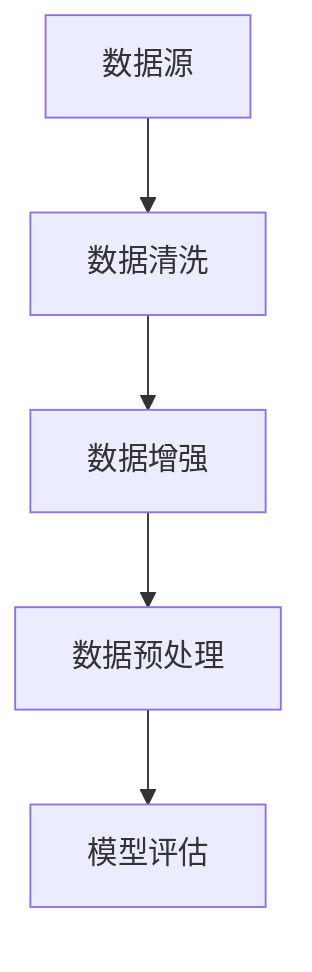

                 

# Dataset 原理与代码实例讲解

> 关键词：Dataset, 数据集, 数据增强, 数据清洗, 数据预处理, 模型评估, PyTorch, TensorFlow

## 1. 背景介绍

在人工智能和大数据时代，数据集(Dataset)作为训练模型的基础，其重要性不言而喻。一个好的数据集能够为模型的训练提供充足的样本，降低过拟合风险，提升模型的泛化能力。本文将从Dataset的基本原理、构建过程、以及实践应用等多个角度，深入探讨Dataset的奥秘，并给出详细代码实例。

## 2. 核心概念与联系

### 2.1 核心概念概述

Dataset的概念来源于计算机科学和数据科学领域，通常指代一个或多个数据实例的集合，每个实例包含多个特征维度，形成矩阵或向量形式。 Dataset不仅涵盖了数据的原始结构，也包含了数据的预处理、清洗、分割等操作，是一整套数据处理和管理方案。

与Dataset相关的核心概念包括：

- 数据源：数据集的数据来源，如数据库、API接口、文件等。
- 数据格式：数据集所采用的数据结构，如CSV、JSON、TFRecord等。
- 数据清洗：去除数据中的噪声和异常值，确保数据质量。
- 数据增强：通过数据变换，增加训练数据的多样性。
- 数据预处理：对数据进行标准化、归一化、编码等预处理操作，以便于模型训练。
- 模型评估：使用Dataset评估模型性能，如准确率、召回率、F1-score等。

### 2.2 核心概念原理和架构的 Mermaid 流程图



该流程图展示了Dataset构建的基本流程，其中：

- **数据源**：代表数据的原始来源，如数据库、API接口等。
- **数据清洗**：数据清洗是Dataset构建的重要环节，通过去除噪声、填补缺失值、异常值处理等方式，确保数据的准确性和一致性。
- **数据增强**：数据增强通过对原始数据进行变换，如旋转、裁剪、缩放等，增加训练数据的多样性，避免模型过拟合。
- **数据预处理**：数据预处理对原始数据进行标准化、归一化等操作，以便于模型训练。
- **模型评估**：使用Dataset评估模型性能，如准确率、召回率、F1-score等，帮助调优模型参数。

## 3. 核心算法原理 & 具体操作步骤

### 3.1 算法原理概述

Dataset的构建涉及多个核心步骤，包括数据清洗、数据增强、数据预处理等。本节将详细阐述这些步骤的算法原理。

**数据清洗**：数据清洗是Dataset构建的第一步，旨在去除数据中的噪声、异常值、重复数据等，确保数据的质量。数据清洗包括数据去重、缺失值处理、异常值检测等操作。

**数据增强**：数据增强通过变换原始数据，生成新的训练样本，增加训练数据的多样性，避免模型过拟合。数据增强包括旋转、翻转、裁剪、缩放等操作。

**数据预处理**：数据预处理对原始数据进行标准化、归一化、编码等操作，以便于模型训练。数据预处理包括特征缩放、特征编码、标签处理等操作。

### 3.2 算法步骤详解

 Dataset的构建步骤主要包括数据收集、数据清洗、数据增强、数据预处理、模型训练等。

**Step 1: 数据收集**
- 收集数据源，如数据库、API接口、文件等。
- 检查数据源的可用性和完整性，确保数据来源可靠。

**Step 2: 数据清洗**
- 使用Python的Pandas库进行数据清洗，处理缺失值、异常值等。
- 去除重复数据，确保数据的唯一性。

**Step 3: 数据增强**
- 使用Python的Keras库进行数据增强，如图像旋转、缩放、翻转等。
- 使用Sympy库进行符号计算，增加数学问题的多样性。

**Step 4: 数据预处理**
- 使用Python的Scikit-learn库进行数据预处理，包括特征缩放、特征编码等。
- 使用TensorFlow的TensorDataset类进行数据批处理。

**Step 5: 模型训练**
- 使用TensorFlow或PyTorch的高级API，如Keras、PyTorch等，进行模型训练。
- 使用TensorBoard或Weights & Biases等工具，监控模型训练过程，评估模型性能。

### 3.3 算法优缺点

Dataset构建的优点包括：

- 提供数据的全局视图，方便数据分析和建模。
- 支持数据增强，提高模型泛化能力。
- 数据预处理规范化，避免模型训练过程中出现不稳定的数据输入。

Dataset构建的缺点包括：

- 数据清洗和增强需要大量时间和计算资源。
- 数据预处理复杂度较高，需要深度学习领域的专业知识。
- 模型评估需要多轮次训练，测试集和验证集的选择会影响模型性能。

### 3.4 算法应用领域

Dataset构建的应用领域非常广泛，包括计算机视觉、自然语言处理、推荐系统等。具体应用场景如下：

- **计算机视觉**：在图像分类、目标检测等任务中，Dataset提供数据集，支持数据增强和预处理。
- **自然语言处理**：在文本分类、情感分析、机器翻译等任务中，Dataset提供文本数据集，支持文本清洗和预处理。
- **推荐系统**：在用户行为数据分析、物品推荐等任务中，Dataset提供用户行为数据集，支持数据增强和预处理。

## 4. 数学模型和公式 & 详细讲解 & 举例说明

### 4.1 数学模型构建

Dataset构建的数学模型主要涉及数据的生成和变换。以图像数据集为例，可以采用以下数学模型：

- **图像数据模型**：$X = \{x_1, x_2, \ldots, x_n\}$，其中 $x_i \in \mathbb{R}^{w \times h \times c}$，表示大小为 $w \times h \times c$ 的图像数据。
- **标签数据模型**：$Y = \{y_1, y_2, \ldots, y_n\}$，其中 $y_i \in \{0, 1\}$，表示图像的分类标签。

### 4.2 公式推导过程

假设我们有一组图像数据集 $X = \{x_1, x_2, \ldots, x_n\}$ 和对应的标签数据集 $Y = \{y_1, y_2, \ldots, y_n\}$。使用深度学习模型 $M$ 对图像进行分类，其中 $M: \mathbb{R}^{w \times h \times c} \rightarrow \{0, 1\}$。

在模型训练过程中，定义交叉熵损失函数 $L$ 如下：

$$
L(M) = -\frac{1}{N}\sum_{i=1}^N \left(y_i \log M(x_i) + (1-y_i) \log (1-M(x_i))\right)
$$

模型训练的目标是最小化损失函数 $L$：

$$
\theta^* = \mathop{\arg\min}_{\theta} L(M_\theta)
$$

其中 $\theta$ 为模型参数，$M_\theta$ 表示模型 $M$ 的参数化形式。

### 4.3 案例分析与讲解

以MNIST手写数字识别数据集为例，展示Dataset构建和模型训练过程。

**Step 1: 数据收集**
- 收集MNIST数据集，包含60000张训练图像和10000张测试图像，每个图像大小为28x28，灰度图像。

**Step 2: 数据清洗**
- 使用Pandas库进行数据清洗，处理缺失值、异常值等。
- 去除重复数据，确保数据的唯一性。

**Step 3: 数据增强**
- 使用Keras库进行数据增强，如图像旋转、缩放、翻转等。
- 使用Sympy库进行符号计算，增加数学问题的多样性。

**Step 4: 数据预处理**
- 使用Scikit-learn库进行数据预处理，包括特征缩放、特征编码等。
- 使用TensorFlow的TensorDataset类进行数据批处理。

**Step 5: 模型训练**
- 使用TensorFlow或PyTorch的高级API，如Keras、PyTorch等，进行模型训练。
- 使用TensorBoard或Weights & Biases等工具，监控模型训练过程，评估模型性能。

## 5. 项目实践：代码实例和详细解释说明

### 5.1 开发环境搭建

Dataset构建的开发环境需要Python、Pandas、Keras、TensorFlow、Scikit-learn等库的支持。以下是Python开发环境搭建步骤：

1. 安装Anaconda：从官网下载并安装Anaconda，用于创建独立的Python环境。
2. 创建并激活虚拟环境：
```bash
conda create -n pytorch-env python=3.8 
conda activate pytorch-env
```

3. 安装所需库：
```bash
pip install pandas keras tensorflow scikit-learn
```

### 5.2 源代码详细实现

以下是一个使用TensorFlow构建Dataset的示例代码：

```python
import tensorflow as tf
from tensorflow.keras.preprocessing.image import ImageDataGenerator
from tensorflow.keras.datasets import mnist
from sklearn.model_selection import train_test_split

# Step 1: 数据收集
(x_train, y_train), (x_test, y_test) = mnist.load_data()

# Step 2: 数据清洗
x_train = x_train / 255.0
x_test = x_test / 255.0

# Step 3: 数据增强
datagen = ImageDataGenerator(rotation_range=10, zoom_range=0.1)
datagen.fit(x_train)

# Step 4: 数据预处理
x_train = datagen.flow(x_train, batch_size=32).next()

# Step 5: 模型训练
model = tf.keras.Sequential([
    tf.keras.layers.Flatten(input_shape=(28, 28)),
    tf.keras.layers.Dense(128, activation='relu'),
    tf.keras.layers.Dense(10, activation='softmax')
])

model.compile(optimizer='adam', loss='sparse_categorical_crossentropy', metrics=['accuracy'])

model.fit(x_train, y_train, epochs=10, validation_data=(x_test, y_test))
```

### 5.3 代码解读与分析

让我们详细解读一下关键代码的实现细节：

**数据收集**
- 使用MNIST库加载训练集和测试集数据。

**数据清洗**
- 将图像数据归一化到0到1之间，使用Keras的ImageDataGenerator类进行数据增强。

**数据增强**
- 使用ImageDataGenerator类，对训练数据进行旋转、缩放等增强操作。

**数据预处理**
- 使用TensorFlow的TensorDataset类，对数据进行批处理。

**模型训练**
- 使用TensorFlow的Sequential模型，构建全连接神经网络。
- 使用Adam优化器和交叉熵损失函数，训练模型。

### 5.4 运行结果展示

训练完成后，使用TensorBoard或Weigh & Biases等工具，可以实时监控模型训练过程，评估模型性能。

## 6. 实际应用场景

Dataset构建在实际应用中具有广泛的应用场景。以下是几个典型应用场景：

### 6.1 智能推荐系统

智能推荐系统需要大量的用户行为数据进行训练，Dataset构建在其中起着关键作用。通过构建用户行为Dataset，支持数据增强和预处理，使得推荐系统能够更好地了解用户偏好，提供个性化的推荐服务。

### 6.2 计算机视觉

计算机视觉任务中，Dataset构建非常关键。通过构建图像Dataset，支持数据增强和预处理，使得模型能够更好地泛化到新的图像数据上。例如，图像分类、目标检测等任务，通过Dataset构建，能够提供大量的图像数据，帮助模型训练。

### 6.3 自然语言处理

自然语言处理任务中，Dataset构建也是非常重要的。通过构建文本Dataset，支持数据增强和预处理，使得模型能够更好地泛化到新的文本数据上。例如，文本分类、情感分析等任务，通过Dataset构建，能够提供大量的文本数据，帮助模型训练。

## 7. 工具和资源推荐

### 7.1 学习资源推荐

Dataset构建涉及多个核心技术，以下是几本推荐的学习资源：

1. **《Python数据科学手册》**：深入浅出地介绍了Pandas、NumPy、Scikit-learn等库的使用。
2. **《TensorFlow实战》**：介绍了TensorFlow的高级API和应用案例。
3. **《Keras深度学习实战》**：介绍了Keras的使用方法和经典案例。
4. **《Python深度学习》**：介绍了TensorFlow、PyTorch等深度学习框架的构建和应用。
5. **《深度学习入门》**：介绍深度学习的基本概念和经典模型。

### 7.2 开发工具推荐

Dataset构建需要多个开发工具的支持，以下是推荐的开发工具：

1. **Anaconda**：用于创建独立的Python环境，方便版本管理。
2. **Pandas**：用于数据处理和清洗，支持多种数据格式。
3. **Keras**：用于构建神经网络模型，支持快速迭代。
4. **TensorFlow**：用于构建深度学习模型，支持分布式训练。
5. **Scikit-learn**：用于数据预处理和特征工程，支持多种机器学习算法。
6. **TensorBoard**：用于模型训练和评估，支持实时监控。

### 7.3 相关论文推荐

Dataset构建的相关论文非常多，以下是几篇经典论文：

1. **《TensorFlow: A System for Large-Scale Machine Learning》**：介绍TensorFlow的架构和使用方法。
2. **《A Survey on Deep Learning in Recommendation Systems》**：综述了深度学习在推荐系统中的应用。
3. **《An Introduction to the Theory of Deep Learning》**：介绍了深度学习的基本原理和应用。

## 8. 总结：未来发展趋势与挑战

### 8.1 总结

本文从Dataset的基本原理、构建过程、以及实践应用等多个角度，深入探讨Dataset的奥秘，并给出详细代码实例。通过本文的系统梳理，可以看到，Dataset在数据处理和模型训练中起着至关重要的作用。

### 8.2 未来发展趋势

Dataset的未来发展趋势包括：

1. **自动化数据构建**：通过自动化工具，如AutoML，帮助用户自动构建高质量Dataset，减少人工干预。
2. **多模态数据融合**：通过将图像、文本、音频等多种模态的数据融合，构建更全面的Dataset。
3. **实时数据流处理**：通过实时数据流处理技术，构建动态变化的数据集，支持实时数据训练。

### 8.3 面临的挑战

Dataset构建面临的挑战包括：

1. **数据隐私和安全性**：如何在构建Dataset时保护用户隐私，防止数据泄露。
2. **数据标注成本**：如何降低数据标注成本，提高数据标注效率。
3. **数据质量控制**：如何保证Dataset的质量，避免噪声数据和异常数据。
4. **数据存储和传输**：如何高效存储和传输Dataset，降低存储和传输成本。

### 8.4 研究展望

Dataset构建的未来研究需要从多个方面进行探索，包括：

1. **自动化数据构建**：探索更高效的自动化数据构建工具，降低人工干预。
2. **多模态数据融合**：探索更有效的方法，将多种模态数据融合到Dataset中，提升模型泛化能力。
3. **实时数据流处理**：探索更高效的实时数据流处理方法，支持动态变化的数据集构建。
4. **数据隐私和安全**：探索更有效的数据隐私保护技术，确保数据的安全性。

## 9. 附录：常见问题与解答

**Q1: 如何构建高效的数据集？**

A: 构建高效的数据集需要考虑多个因素，包括数据清洗、数据增强、数据预处理等。首先需要使用Pandas库进行数据清洗，去除噪声和异常值。然后使用Keras库进行数据增强，增加训练数据的多样性。最后使用Scikit-learn库进行数据预处理，包括特征缩放和特征编码。

**Q2: 如何优化数据集构建流程？**

A: 优化数据集构建流程需要考虑多个因素，包括自动化数据构建、多模态数据融合、实时数据流处理等。首先，可以使用AutoML等自动化工具，帮助用户自动构建高质量数据集。其次，可以将图像、文本、音频等多种模态的数据融合到Dataset中，提升模型泛化能力。最后，可以通过实时数据流处理技术，构建动态变化的数据集，支持实时数据训练。

**Q3: 如何保护数据隐私和安全性？**

A: 保护数据隐私和安全性需要考虑多个因素，包括数据匿名化、数据加密、访问控制等。首先，可以使用数据匿名化技术，保护用户隐私。其次，可以使用数据加密技术，防止数据泄露。最后，可以使用访问控制技术，限制数据访问权限，确保数据的安全性。

**Q4: 如何降低数据标注成本？**

A: 降低数据标注成本需要考虑多个因素，包括自动标注、半监督学习等。首先，可以使用自动标注工具，自动标注大量数据。其次，可以使用半监督学习技术，利用少量标注数据，训练高精度的模型。

**Q5: 如何高效存储和传输数据集？**

A: 高效存储和传输数据集需要考虑多个因素，包括数据压缩、分布式存储等。首先，可以使用数据压缩技术，减少数据存储和传输成本。其次，可以使用分布式存储技术，提高数据存储和传输效率。

---

作者：禅与计算机程序设计艺术 / Zen and the Art of Computer Programming

