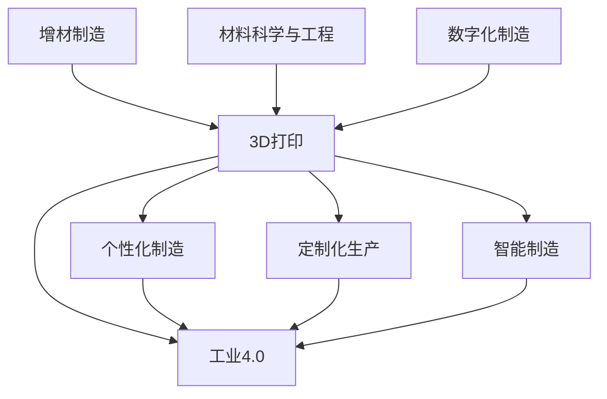

                 

# 3D打印创业：个性化制造的未来

## 1. 背景介绍

随着全球制造业向智能化、个性化、定制化的转型，3D打印（Additive Manufacturing）作为一种高度灵活和可定制的制造方式，逐渐成为未来制造领域的核心技术之一。3D打印以其高度的个性化定制能力，正在引领一场新的工业革命。近年来，全球3D打印市场的持续快速增长，显示出3D打印在未来制造领域内巨大的商业潜力和应用前景。

### 1.1 3D打印技术发展历程

3D打印技术最早起源于19世纪，当时以基于光固化和电子束熔化的工艺为基础。近年来，随着激光熔融、粉末冶金、光固化等技术的进步，3D打印技术逐渐从实验室走向产业化。其发展历程大致可以分为以下几个阶段：

1. **实验室阶段（19世纪-20世纪90年代）**：最早的3D打印技术主要以光固化技术为基础，能够打印出一些简单的小型零件。
2. **工业化阶段（2000年代初）**：随着3D打印技术的逐渐成熟，逐渐出现了一些3D打印设备和应用场景。
3. **商业化阶段（2010年代至今）**：3D打印技术迅速进入商业应用领域，出现了更多种类的3D打印设备和材料，广泛应用于航空航天、医疗、食品、珠宝等领域。

### 1.2 3D打印市场现状与趋势

根据Wohlers Report，2021年全球3D打印市场的规模为173.29亿美元，同比增长29.7%。随着3D打印技术的普及和应用领域的拓展，预计到2025年，全球3D打印市场规模将达到450亿美元，年复合增长率（CAGR）为27%。

未来3D打印市场主要受以下几个因素驱动：

1. **定制化需求的增长**：消费者对个性化定制的需求不断增加，推动了3D打印市场的发展。
2. **材料和技术的创新**：新材料、新设备的不断涌现，提高了3D打印的效率和质量。
3. **工业自动化与智能制造**：3D打印与物联网、人工智能等技术的融合，推动了智能制造的发展。
4. **数字化制造生态系统的构建**：数字化设计、云计算等技术的普及，为3D打印应用提供了广阔的空间。

## 2. 核心概念与联系

### 2.1 核心概念概述

为更好地理解3D打印创业的技术基础和市场潜力，本节将介绍几个关键概念：

- **3D打印（Additive Manufacturing, AM）**：一种通过逐层堆积材料来制造零件的数字化制造技术，能够实现复杂形状的零件制造。
- **个性化制造（Personalized Manufacturing）**：根据客户具体需求，量身定制产品，以提高生产效率和客户满意度。
- **定制化生产（Customized Production）**：根据客户具体订单需求，灵活调整生产工艺，实现零库存和柔性生产。
- **工业4.0（Industrial 4.0）**：通过数字化的技术手段，实现智能制造和定制化生产，提升制造业的自动化和智能化水平。
- **智能制造（Smart Manufacturing）**：融合物联网、人工智能等技术，实现生产过程的智能化管理。
- **增材制造（Additive Manufacturing）**：3D打印技术是增材制造的核心组成部分，通过逐层堆积材料实现零件制造。
- **材料科学与工程（Materials Science and Engineering）**：3D打印材料和工艺的研究，是3D打印技术发展的重要基础。
- **数字化制造（Digital Manufacturing）**：基于计算机和网络技术，实现制造过程的数字化、自动化。

这些核心概念之间通过3D打印技术的成熟和普及，实现了智能制造和个性化生产的有机结合。以下是这些核心概念之间的联系示意图：



### 2.2 核心概念原理和架构的 Mermaid 流程图

3D打印技术原理主要分为以下几个步骤：

1. **三维模型构建**：通过计算机辅助设计（CAD）软件，设计出零件的三维模型。
2. **切片处理**：将三维模型转换为二维的切片数据，每个切片代表打印的单个平面。
3. **材料准备**：根据切片数据，将材料（如金属粉末、聚合物等）按照需要逐层铺展。
4. **固化成型**：通过热源（如激光、紫外光）照射材料，使其固化并逐层堆积，最终形成完整的零件。


## 3. 核心算法原理 & 具体操作步骤
### 3.1 算法原理概述

3D打印创业的算法原理主要围绕以下几个方面：

- **增材制造的数字化模型构建**：通过计算机辅助设计（CAD）软件，将设计图纸转化为3D模型，并进行切片处理。
- **材料制备和固化成型**：根据切片数据，准备并固化逐层堆积的材料。
- **后处理与精修**：对打印完成的零件进行后处理，如打磨、抛光等，确保质量。
- **生产过程的自动化与智能化**：通过物联网、人工智能等技术，实现生产过程的智能化管理，提升效率和精度。

### 3.2 算法步骤详解

**Step 1：数据准备**
- 利用计算机辅助设计（CAD）软件，构建零件的三维模型。
- 根据打印机支持的切片工具，将三维模型转化为二维切片数据。

**Step 2：材料制备**
- 选择合适的打印材料，如金属粉末、聚合物、陶瓷等。
- 对材料进行预处理，如干燥、脱气等。

**Step 3：切片处理**
- 使用切片软件将二维切片数据转换为打印机可识别的格式。
- 设置打印机的参数，如层高、打印速度、填充率等。

**Step 4：打印成型**
- 将切片数据导入打印机，进行逐层打印。
- 在打印过程中，根据需要进行温度、速度等参数调整，确保打印质量。

**Step 5：后处理与精修**
- 打印完成后，对零件进行后处理，如去支撑、打磨、抛光等。
- 对零件进行质量检测，确保符合设计要求。

### 3.3 算法优缺点

3D打印创业的算法优点主要体现在以下几个方面：

- **高度个性化**：通过数字化的设计手段，实现高度个性化的产品制造。
- **生产灵活性**：适用于小批量、多品种的制造需求，实现灵活生产。
- **生产效率高**：自动化生产流程，减少人工干预，提高生产效率。

其缺点主要在于：

- **设备与材料成本高**：初期投资较大，主要集中在打印设备和材料上。
- **制造复杂度大**：需要具备较高的技术门槛，对打印材料和设备要求较高。
- **精度控制难**：由于逐层堆积的特性，打印精度受到材料的物理属性和打印参数的影响。

### 3.4 算法应用领域

3D打印技术在多个领域内得到广泛应用：

1. **医疗领域**：3D打印在医疗领域的应用包括打印手术模型、定制假肢、定制植入物等。
2. **航空航天**：用于制造航空航天零部件，如引擎零件、风扇叶片等。
3. **建筑领域**：用于制造建筑构件、室内装饰件等，提高建筑施工的灵活性和效率。
4. **教育与艺术**：用于教育模型制作、艺术创作等，促进教育与艺术的创新。
5. **食品行业**：用于打印巧克力、糖果等食品，实现食品的个性化定制。
6. **家电与家居**：用于打印家电配件、家居用品等，提高设计自由度和生产效率。
7. **汽车行业**：用于打印汽车零部件，如引擎罩、仪表盘等，推动汽车轻量化和个性化。

## 4. 数学模型和公式 & 详细讲解 & 举例说明

### 4.1 数学模型构建

3D打印技术的核心是增材制造，可以通过数学模型来描述打印过程中的各个参数与输出结果之间的关系。假设打印过程可以分解为n层，每层打印的厚度为h，打印材料的密度为d，打印速度为v，则打印完成后的零件体积V和质量m可以表示为：

$$
V = n \times h \times A \\
m = V \times d
$$

其中，A为打印区域的面积。

### 4.2 公式推导过程

根据上述模型，打印材料的质量m与打印区域的面积A和打印速度v有关。若打印速度增加，则材料的使用效率提高，但打印时间会减少。

假设打印区域面积为A，打印材料的体积密度为d，打印层的厚度为h，打印速度为v，则打印所需的材料体积V可以表示为：

$$
V = A \times h \\
m = V \times d
$$

打印速度v与打印效率和打印时间t的关系可以表示为：

$$
t = \frac{A \times h}{v}
$$

通过调整打印速度v，可以在不增加打印材料的前提下，实现打印效率的提高。

### 4.3 案例分析与讲解

以打印一个简单的零件为例，进行详细分析：

1. **零件设计**：通过CAD软件设计出零件的三维模型，并将其转化为切片数据。
2. **材料准备**：准备适合的材料，如ABS树脂，并进行预处理。
3. **切片处理**：使用切片软件将切片数据转化为打印机可识别的格式，并进行参数设置。
4. **打印成型**：将切片数据导入打印机，进行逐层打印。
5. **后处理与精修**：对打印完成的零件进行去支撑、打磨等后处理，并进行质量检测。

以打印零件为例，假设打印材料密度为1.2 g/cm³，打印层高为0.1 mm，打印区域面积为100 cm²，打印速度为0.1 mm/s。则打印完成后的零件体积和质量分别为：

$$
V = 100 \times 0.1 \times 10^{-4} \times 1000 \times 1.2 = 0.12 \text{cm}^3 \\
m = 0.12 \times 1.2 = 0.144 \text{g}
$$

通过调整打印速度，可以在不增加材料的前提下，提高打印效率。

## 5. 项目实践：代码实例和详细解释说明
### 5.1 开发环境搭建

在进行3D打印创业项目开发前，我们需要准备好开发环境。以下是使用Python进行3D打印项目开发的环境配置流程：

1. **安装Python**：从官网下载并安装Python 3.x版本。
2. **安装Py3D打印库**：使用pip命令安装Py3D打印库，例如：`pip install py3dprinting`。
3. **安装CAD软件接口**：安装CAD软件接口，如AutoCAD、SolidWorks等。
4. **安装3D打印机驱动程序**：根据打印机类型，安装相应的驱动程序。

完成上述步骤后，即可在Python环境中进行3D打印项目开发。

### 5.2 源代码详细实现

下面我们以打印一个简单的零件为例，使用Python和Py3D打印库进行代码实现。

```python
import py3dprinting as p3d
from py3dprinting.primitives import Cube

# 定义打印参数
print_speed = 0.1  # 打印速度，单位：mm/s
material_density = 1.2  # 材料密度，单位：g/cm³

# 创建打印区域
region = p3d.Region()
region.add(Cube(100, 100, 100))  # 添加打印区域

# 定义打印材料
material = p3d.Material(name="ABS", density=material_density)

# 进行打印
p3d.Print(region, print_speed, material)
```

这段代码通过Py3D打印库，实现了打印一个边长为100mm的立方体的过程。通过设置打印速度和材料密度，可以对打印过程进行精确控制。

### 5.3 代码解读与分析

**打印区域**：
- 使用`p3d.Region`类创建打印区域，可以通过`add`方法添加不同的几何图形。
- 本示例中添加了一个边长为100mm的立方体。

**打印材料**：
- 使用`p3d.Material`类定义打印材料，可以设置密度等参数。
- 在本示例中，我们定义了ABS材料，其密度为1.2 g/cm³。

**打印过程**：
- 使用`p3d.Print`方法进行打印，传入打印区域、打印速度和材料等参数。
- 打印完成后，系统会根据参数自动进行后处理和质量检测。

**代码执行结果**：
- 通过运行上述代码，系统会根据设置的参数进行打印，生成一个边长为100mm的立方体。
- 打印完成后，可以通过观察打印结果，验证打印的精度和质量是否满足要求。

## 6. 实际应用场景
### 6.1 医疗领域

3D打印技术在医疗领域的应用日益广泛，以下是几个典型应用场景：

1. **手术模型制作**：通过3D打印手术模型，帮助医生进行手术规划和模拟训练，提高手术成功率。
2. **个性化假肢制作**：根据患者的身体数据，3D打印个性化假肢，提升假肢的舒适度和功能。
3. **牙科模型制作**：用于制作牙齿矫正模型和修复模型，帮助医生进行精确治疗。
4. **肿瘤治疗计划**：打印肿瘤治疗计划模型，帮助医生制定精确的放射治疗方案。

### 6.2 航空航天领域

3D打印技术在航空航天领域的应用主要体现在以下几个方面：

1. **发动机零件制造**：打印发动机风扇叶片、燃烧室部件等，提高发动机制造的精度和效率。
2. **飞机零部件制造**：打印飞机结构件、内饰件等，推动航空制造的数字化转型。
3. **火箭制造**：打印火箭推进器、燃料舱等部件，提高火箭制造的灵活性和可靠性。

### 6.3 建筑领域

3D打印技术在建筑领域的应用主要体现在以下几个方面：

1. **建筑构件制造**：打印建筑支撑、门窗等构件，提高施工效率和设计自由度。
2. **室内装饰件制造**：打印室内装饰品、艺术品等，提升装饰效果。
3. **紧急住房建设**：通过3D打印快速搭建紧急住房，解决住房短缺问题。

### 6.4 未来应用展望

随着3D打印技术的不断发展和成熟，其应用领域将进一步拓展，未来展望如下：

1. **食品制造**：通过3D打印技术，实现个性化食品制造，如巧克力、糖果等。
2. **服装制造**：打印个性化服装，提升服装设计的自由度和制造效率。
3. **家具制造**：打印定制家具，满足消费者的个性化需求。
4. **个性化家居**：打印家居用品、装饰品等，提升家居设计的多样性。
5. **艺术创作**：打印三维艺术品，推动艺术的创新和发展。

## 7. 工具和资源推荐
### 7.1 学习资源推荐

为了帮助开发者系统掌握3D打印创业的理论基础和实践技巧，这里推荐一些优质的学习资源：

1. **3D打印技术入门教程**：一些线上平台，如Coursera、Udemy等，提供系统性的3D打印技术入门课程。
2. **3D打印设计与制作**：一些专业的3D打印软件，如Autodesk 123D、Fusion 360等，可以帮助设计师进行3D模型设计和打印。
3. **3D打印机选择指南**：一些在线资源，如3D打印机评测、购买指南等，帮助用户选择合适的3D打印机。
4. **3D打印材料与工艺**：一些专业书籍和论文，如《3D打印材料与工艺》等，深入介绍3D打印材料的选择和工艺优化。
5. **3D打印市场动态**：一些行业报告和分析文章，如Wohlers Report，帮助用户了解3D打印市场的最新动态和趋势。

### 7.2 开发工具推荐

3D打印创业需要多种工具的配合使用，以下是一些常用的开发工具：

1. **CAD软件**：如AutoCAD、SolidWorks等，用于3D模型设计。
2. **切片软件**：如Slic3r、Cura等，用于将3D模型转化为打印机可识别的切片数据。
3. **3D打印机驱动程序**：根据打印机类型，安装相应的驱动程序，如Repetier Firmware、Ultimaker Cura等。
4. **后处理软件**：如PrusaSaver、Ultimaker Workbench等，用于对打印完成的零件进行后处理和精修。

### 7.3 相关论文推荐

3D打印创业涉及多个学科领域，以下是几篇奠基性的相关论文，推荐阅读：

1. **《3D Printing and Additive Manufacturing: Technologies, Materials and Design》**：介绍3D打印技术、材料和设计等方面的基础知识。
2. **《A Survey of Material Selection for Additive Manufacturing》**：综述不同3D打印材料的选择与应用。
3. **《The Impact of 3D Printing on Manufacturing》**：探讨3D打印技术对制造业的影响和未来趋势。
4. **《Customization and Personalization in 3D Printing》**：分析3D打印技术在个性化制造中的应用。
5. **《Digital Manufacturing and Smart Manufacturing》**：介绍数字制造和智能制造的最新进展和趋势。

## 8. 总结：未来发展趋势与挑战
### 8.1 研究成果总结

3D打印创业技术已经在多个领域内得到广泛应用，并且在不断发展和创新。以下是一些重要的研究成果：

1. **打印材料创新**：新材料、新工艺的出现，推动了3D打印技术的进步，提高了打印质量和效率。
2. **制造过程优化**：通过数字化制造和智能化管理，实现了生产过程的自动化和精确化。
3. **个性化制造**：3D打印技术高度个性化、灵活性，满足了消费者对个性化产品的需求。
4. **跨领域融合**：3D打印技术与AI、物联网等技术深度融合，推动了智能制造的发展。

### 8.2 未来发展趋势

未来3D打印创业技术的发展趋势主要体现在以下几个方面：

1. **材料与工艺的创新**：新材料、新工艺的出现，将进一步提高3D打印的效率和质量。
2. **智能化与自动化**：通过人工智能、物联网等技术，实现生产过程的智能化和自动化。
3. **跨领域应用**：3D打印技术将在更多领域得到应用，如食品、服装、家居等。
4. **生态系统建设**：构建数字化制造生态系统，推动3D打印技术的普及和应用。
5. **可持续性与环保**：推动3D打印技术的可持续发展和环保应用，减少对环境的影响。

### 8.3 面临的挑战

尽管3D打印创业技术取得了显著进展，但仍面临诸多挑战：

1. **设备与材料成本**：初期投资较大，主要集中在打印设备和材料上。
2. **制造精度与质量**：逐层堆积的特性，使得打印精度受到材料和打印参数的影响。
3. **技术门槛**：需要具备较高的技术门槛，对打印材料和设备要求较高。
4. **市场接受度**：需要提升消费者和企业的市场接受度，推动3D打印技术的普及。
5. **标准与规范**：需要建立统一的技术标准和规范，保障3D打印技术的规范化和标准化。

### 8.4 研究展望

未来3D打印创业技术的研究方向主要包括以下几个方面：

1. **新材料研究**：开发新型打印材料，提高打印精度和质量。
2. **打印工艺优化**：优化打印工艺，提高打印效率和稳定性。
3. **智能化与自动化**：通过人工智能、物联网等技术，实现生产过程的智能化和自动化。
4. **跨领域应用**：推动3D打印技术在更多领域的应用，推动技术创新与产业升级。
5. **生态系统建设**：构建数字化制造生态系统，推动3D打印技术的普及和应用。

## 9. 附录：常见问题与解答

**Q1：3D打印创业的初期投资主要集中在哪些方面？**

A: 3D打印创业的初期投资主要集中在以下方面：

1. **设备投资**：购买3D打印机及相关辅助设备，如切片软件、后处理设备等。
2. **材料成本**：购买适合3D打印的材料，如ABS、PLA等。
3. **技术研发**：投入技术研发，开发新的打印工艺和材料。
4. **市场推广**：投入市场推广和销售渠道建设，提升用户接受度。
5. **人才引进**：引进技术人才，提高技术研发和生产能力。

**Q2：如何提高3D打印的制造精度和质量？**

A: 提高3D打印的制造精度和质量主要从以下几个方面进行：

1. **选择合适材料**：选择适合的打印材料，如ABS、尼龙等，并对其进行预处理。
2. **优化打印参数**：调整打印速度、层高、填充率等参数，确保打印质量。
3. **后处理**：对打印完成的零件进行去支撑、打磨、抛光等后处理，提高表面质量和尺寸精度。
4. **温度控制**：控制打印室的温度和湿度，减少打印过程中的变形和收缩。
5. **定期维护**：对3D打印机进行定期维护，确保打印系统的稳定性和精度。

**Q3：3D打印创业面临的主要技术挑战有哪些？**

A: 3D打印创业面临的主要技术挑战包括：

1. **设备成本高**：初期投资较大，主要集中在3D打印机及相关辅助设备上。
2. **制造精度控制难**：逐层堆积的特性，使得打印精度受到材料和打印参数的影响。
3. **技术门槛高**：需要具备较高的技术门槛，对打印材料和设备要求较高。
4. **市场接受度低**：需要提升消费者和企业的市场接受度，推动3D打印技术的普及。
5. **标准与规范不统一**：需要建立统一的技术标准和规范，保障3D打印技术的规范化和标准化。

**Q4：3D打印在医疗领域的应用主要体现在哪些方面？**

A: 3D打印在医疗领域的应用主要体现在以下几个方面：

1. **手术模型制作**：通过3D打印手术模型，帮助医生进行手术规划和模拟训练，提高手术成功率。
2. **个性化假肢制作**：根据患者的身体数据，3D打印个性化假肢，提升假肢的舒适度和功能。
3. **牙科模型制作**：用于制作牙齿矫正模型和修复模型，帮助医生进行精确治疗。
4. **肿瘤治疗计划**：打印肿瘤治疗计划模型，帮助医生制定精确的放射治疗方案。

**Q5：3D打印创业的主要盈利模式有哪些？**

A: 3D打印创业的主要盈利模式包括：

1. **产品销售**：销售3D打印设备、材料及相关配件，获取硬件和材料销售收入。
2. **定制化服务**：提供个性化设计和定制化生产服务，获取服务费用。
3. **技术咨询和培训**：提供技术咨询和培训服务，获取技术咨询和培训收入。
4. **生态系统建设**：构建数字化制造生态系统，获取生态系统服务收入。
5. **市场推广**：通过市场推广和品牌建设，获取品牌溢价和市场拓展收入。

---

作者：禅与计算机程序设计艺术 / Zen and the Art of Computer Programming

