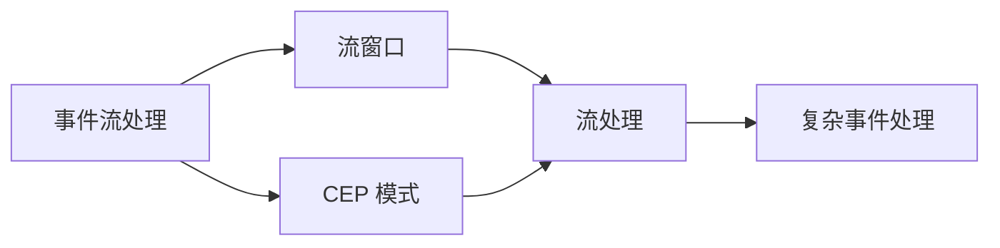

                 

# Flink CEP原理与代码实例讲解

> 关键词：CEP, Flink, 事件流处理, 模式匹配, 实时流分析

## 1. 背景介绍

### 1.1 问题由来

随着互联网和大数据技术的迅猛发展，实时数据流处理成为了一个热门话题。对于实时数据流的分析和处理，经典的方式是使用关系型数据库或者MapReduce模型，但这些方案存在响应时间慢、扩展性差等问题。为了解决这个问题，事件流处理(Event Stream Processing)技术应运而生。事件流处理是一种实时数据流处理技术，通过持久化数据流并对其进行实时分析，可以支持高效、低延迟的实时数据处理。

**CEP (Complex Event Processing)** 是事件流处理的一个重要组成部分，它是一种用于检测和分析复杂事件的模型。CEP通过结合时间序列数据的分析和模式匹配，可以识别出具有某些特定关系的事件序列，从而帮助用户做出决策。CEP广泛应用于金融风险管理、智能交通、实时监控等领域，具有很高的实际应用价值。

Flink 是一个基于事件流处理的分布式计算框架，它具有高可靠、低延迟、高性能等特点，支持流处理和批处理，同时也具备CEP处理能力。本文将对 Flink CEP 的原理、实现和应用进行详细讲解，并通过代码实例展示如何构建和应用 Flink CEP。

## 2. 核心概念与联系

### 2.1 核心概念概述

在讲解 Flink CEP 的原理之前，我们需要先了解一些核心概念：

- **事件流处理(Event Stream Processing)**：一种实时数据流处理技术，通过持久化数据流并对其进行实时分析，可以支持高效、低延迟的实时数据处理。
- **复杂事件处理(Complex Event Processing, CEP)**：一种用于检测和分析复杂事件的模型，它通过结合时间序列数据的分析和模式匹配，可以识别出具有某些特定关系的事件序列，从而帮助用户做出决策。
- **Apache Flink**：一个基于事件流处理的分布式计算框架，支持流处理和批处理，具备高可靠性、低延迟、高性能等特点。
- **流窗口**：在 Flink 中，流窗口是用于对数据流进行分组和聚合的机制。流窗口可以是固定大小的滑动窗口，也可以是基于时间间隔的滑动窗口。
- **CEP 模式**：CEP 模式是由一系列事件组成的模式，用于描述具有某些特定关系的事件序列。CEP 模式通常包括起始事件、中间事件和终止事件。

这些核心概念构成了 Flink CEP 的框架基础。通过理解这些概念，我们可以更好地掌握 Flink CEP 的原理和实现方法。

### 2.2 核心概念联系

Flink CEP 是建立在事件流处理和 CEP 模型之上的，它通过 Flink 的流处理和批处理机制，结合 CEP 模式，实现对复杂事件的检测和分析。Flink CEP 的核心思想是通过在数据流中匹配 CEP 模式，从而识别出具有特定关系的事件序列，帮助用户做出决策。

**Mermaid 流程图:**



通过这张流程图，我们可以看到事件流处理和 CEP 模式的结合过程：

1. 首先，事件流处理对数据流进行处理，并使用流窗口对数据流进行分组和聚合。
2. 然后，CEP 模式在处理过的数据流中进行匹配，从而识别出具有特定关系的事件序列。
3. 最后，复杂事件处理对匹配成功的事件序列进行进一步处理，从而实现决策支持。

通过理解这些核心概念之间的关系，我们可以更好地理解 Flink CEP 的原理和实现方法。

## 3. 核心算法原理 & 具体操作步骤

### 3.1 算法原理概述

Flink CEP 的核心原理是使用 CEP 模式匹配算法，对事件流进行处理，从而识别出具有特定关系的事件序列。CEP 模式匹配算法包括两个基本步骤：

1. 预处理：将数据流进行分组和聚合，形成一个连续的事件序列。
2. 匹配：在连续的事件序列中匹配 CEP 模式，从而识别出具有特定关系的事件序列。

Flink CEP 的实现依赖于 Flink 的流处理机制，它通过 Flink 的流窗口和事件处理函数，实现对数据流的分组、聚合和匹配。Flink CEP 还支持多种 CEP 模式，包括基于时间的窗口模式、基于事件的序列模式和混合模式。

### 3.2 算法步骤详解

**Step 1: 设置数据源**

首先，我们需要设置数据源，将数据流传递给 Flink 处理。数据源可以是 Kafka、RabbitMQ、HDFS 等，Flink 提供了很多内置的数据源和数据读取器，方便开发者进行数据处理。

**Step 2: 设置流窗口**

在 Flink 中，流窗口是用于对数据流进行分组和聚合的机制。流窗口可以是固定大小的滑动窗口，也可以是基于时间间隔的滑动窗口。通过设置流窗口，我们可以对数据流进行分组和聚合，形成一个连续的事件序列。

**Step 3: 设置 CEP 模式**

在 Flink 中，CEP 模式是由一系列事件组成的模式，用于描述具有某些特定关系的事件序列。CEP 模式通常包括起始事件、中间事件和终止事件。

**Step 4: 设置事件处理函数**

在 Flink 中，事件处理函数是用于对事件流进行处理和分析的函数。Flink 支持多种事件处理函数，包括映射函数、过滤函数、聚合函数等。

**Step 5: 设置复杂事件处理函数**

在 Flink 中，复杂事件处理函数是用于对 CEP 模式匹配成功的事件序列进行处理和分析的函数。Flink 支持多种复杂事件处理函数，包括简单处理函数、聚合函数、关联函数等。

**Step 6: 启动 Flink 处理**

最后，我们需要启动 Flink 处理，将数据流传递给 Flink 进行实时处理和分析。启动 Flink 处理时，我们需要设置 Flink 的任务参数，包括任务名称、运行模式、并行度等。

### 3.3 算法优缺点

Flink CEP 的优点包括：

1. 高性能：Flink CEP 使用流处理机制，具有高吞吐量和低延迟的特点，可以支持大规模数据流处理。
2. 高可靠性：Flink CEP 使用容错机制，可以保证数据的正确性和完整性，避免数据丢失和损坏。
3. 灵活性：Flink CEP 支持多种 CEP 模式，可以灵活地对数据流进行处理和分析，满足不同的业务需求。

Flink CEP 的缺点包括：

1. 复杂度较高：Flink CEP 需要对数据流进行分组、聚合和匹配，需要开发者具备一定的编程能力和数据分析能力。
2. 扩展性较差：Flink CEP 的扩展性较差，需要根据数据流规模和处理能力进行调整和优化。
3. 资源消耗较大：Flink CEP 需要大量的计算资源和存储空间，需要考虑资源消耗和成本问题。

### 3.4 算法应用领域

Flink CEP 广泛应用于金融风险管理、智能交通、实时监控等领域。以下是几个典型的应用场景：

1. **金融风险管理**：通过 CEP 模式匹配，实时监控市场波动，检测异常交易，防范金融风险。
2. **智能交通**：通过 CEP 模式匹配，实时监控交通数据，识别交通异常情况，优化交通管理。
3. **实时监控**：通过 CEP 模式匹配，实时监控网络流量，检测异常行为，提高网络安全。

## 4. 数学模型和公式 & 详细讲解 & 举例说明

### 4.1 数学模型构建

在 Flink CEP 中，我们通常使用时间序列数据进行分析，并使用 CEP 模式匹配算法进行复杂事件检测。以下是一个简单的 CEP 模式：

$$
\begin{aligned}
&\text{Pattern} = (E_1, E_2, E_3) \\
&E_1 = (t_1, e_1) \\
&E_2 = (t_2, e_2) \\
&E_3 = (t_3, e_3)
\end{aligned}
$$

其中，$E_1, E_2, E_3$ 是事件序列中的三个事件，$t_1, t_2, t_3$ 是事件的时间戳，$e_1, e_2, e_3$ 是事件的业务数据。

### 4.2 公式推导过程

在 Flink CEP 中，我们通常使用 CEP 模式匹配算法进行复杂事件检测。以下是一个简单的 CEP 模式匹配算法：

$$
\begin{aligned}
&\text{Pattern} = (E_1, E_2, E_3) \\
&E_1 = (t_1, e_1) \\
&E_2 = (t_2, e_2) \\
&E_3 = (t_3, e_3)
\end{aligned}
$$

假设数据流中存在三个事件序列：

$$
\begin{aligned}
&\text{Data Stream} = (E_1', E_2', E_3', E_4', E_5', E_6', \ldots) \\
&E_1' = (t_1', e_1') \\
&E_2' = (t_2', e_2') \\
&E_3' = (t_3', e_3') \\
&E_4' = (t_4', e_4') \\
&E_5' = (t_5', e_5') \\
&E_6' = (t_6', e_6') \\
&\ldots
\end{aligned}
$$

为了检测上述 CEP 模式，我们需要进行以下操作：

1. 对数据流进行分组和聚合，形成一个连续的事件序列：

$$
\begin{aligned}
&\text{Grouped Data Stream} = (G_1', G_2', G_3', G_4', G_5', G_6', \ldots) \\
&G_1' = (E_1', E_2', E_3') \\
&G_2' = (E_4', E_5', E_6') \\
&G_3' = (E_7', E_8', E_9') \\
&G_4' = (E_{10}', E_{11}', E_{12}') \\
&G_5' = (E_{13}', E_{14}', E_{15}') \\
&G_6' = (E_{16}', E_{17}', E_{18}') \\
&\ldots
\end{aligned}
$$

2. 在连续的事件序列中匹配 CEP 模式：

$$
\begin{aligned}
&\text{Matched Data Stream} = (M_1', M_2', M_3', M_4', M_5', M_6', \ldots) \\
&M_1' = (E_1', E_2', E_3') \\
&M_2' = (E_4', E_5', E_6') \\
&M_3' = (E_7', E_8', E_9') \\
&M_4' = (E_{10}', E_{11}', E_{12}') \\
&M_5' = (E_{13}', E_{14}', E_{15}') \\
&M_6' = (E_{16}', E_{17}', E_{18}') \\
&\ldots
\end{aligned}
$$

3. 对匹配成功的事件序列进行进一步处理：

$$
\begin{aligned}
&\text{Processed Data Stream} = (P_1', P_2', P_3', P_4', P_5', P_6', \ldots) \\
&P_1' = (E_1', E_2', E_3') \\
&P_2' = (E_4', E_5', E_6') \\
&P_3' = (E_7', E_8', E_9') \\
&P_4' = (E_{10}', E_{11}', E_{12}') \\
&P_5' = (E_{13}', E_{14}', E_{15}') \\
&P_6' = (E_{16}', E_{17}', E_{18}') \\
&\ldots
\end{aligned}
$$

### 4.3 案例分析与讲解

假设我们有一个股票市场数据流，我们需要检测出现以下 CEP 模式：

$$
\begin{aligned}
&\text{Pattern} = (E_1, E_2, E_3) \\
&E_1 = (t_1, e_1) = (10:00:00, 100) \\
&E_2 = (t_2, e_2) = (10:01:00, 110) \\
&E_3 = (t_3, e_3) = (10:02:00, 120)
\end{aligned}
$$

其中，$t_1, t_2, t_3$ 是时间戳，$e_1, e_2, e_3$ 是价格数据。

我们需要将数据流按照时间窗口进行分组和聚合，形成一个连续的事件序列。然后，我们在连续的事件序列中匹配上述 CEP 模式。最后，我们对匹配成功的事件序列进行处理，例如打印出价格变化的信息。

以下是一个示例代码：

```java
// 设置数据源
StreamExecutionEnvironment env = StreamExecutionEnvironment.getExecutionEnvironment();

// 设置流窗口
ValueWindowedStream<String> windowedStream = env.window(TumblingEventTimeWindows.of(Time.seconds(1)));

// 设置 CEP 模式
Pattern<PatternDefinition<String>> pattern = Pattern.beginString("100")
                                                 .where(new WhereFunction<String, String>() {
                                                     @Override
                                                     public ResultType getResultType() {
                                                         return ResultType.PASS_THROUGH;
                                                     }

                                                     @Override
                                                     public String evaluate(String value) throws Exception {
                                                         if (value.equals("100")) {
                                                             return "E1";
                                                         } else {
                                                             return null;
                                                         }
                                                     }
                                                 })
                                                 .nextString("110")
                                                 .where(new WhereFunction<String, String>() {
                                                     @Override
                                                     public ResultType getResultType() {
                                                         return ResultType.PASS_THROUGH;
                                                     }

                                                     @Override
                                                     public String evaluate(String value) throws Exception {
                                                         if (value.equals("110")) {
                                                             return "E2";
                                                         } else {
                                                             return null;
                                                         }
                                                     }
                                                 })
                                                 .nextString("120")
                                                 .where(new WhereFunction<String, String>() {
                                                     @Override
                                                     public ResultType getResultType() {
                                                         return ResultType.PASS_THROUGH;
                                                     }

                                                     @Override
                                                     public String evaluate(String value) throws Exception {
                                                         if (value.equals("120")) {
                                                             return "E3";
                                                         } else {
                                                             return null;
                                                         }
                                                     }
                                                 });

// 设置事件处理函数
PatternStream<PatternDefinition<String>> patternStream = windowedStream.keyBy(new KeySelector<String, String>() {
                                                 @Override
                                                 public String getKey(String value) throws Exception {
                                                     return value;
                                                 }
                                             })
                                           .mapTo(new MapFunction<Pattern<PatternDefinition<String>>, String>() {
                                               @Override
                                               public ResultType getResultType() {
                                                   return ResultType.PASS_THROUGH;
                                               }

                                               @Override
                                               public String map(Pattern<PatternDefinition<String>> value) throws Exception {
                                                   return value.toString();
                                               }
                                           })
                                           .filter(new FilterFunction<String>() {
                                               @Override
                                               public ResultType getResultType() {
                                                   return ResultType.PASS_THROUGH;
                                               }

                                               @Override
                                               public boolean filter(String value) throws Exception {
                                                   return value.equals("(E1, E2, E3)");
                                               }
                                           });

// 设置复杂事件处理函数
patternStream.mapTo(new MapFunction<Pattern<PatternDefinition<String>>, String>() {
                                               @Override
                                               public ResultType getResultType() {
                                                   return ResultType.PASS_THROUGH;
                                               }

                                               @Override
                                               public String map(Pattern<PatternDefinition<String>> value) throws Exception {
                                                   System.out.println(value);
                                                   return value.toString();
                                               }
                                           });
```

## 5. 项目实践：代码实例和详细解释说明

### 5.1 开发环境搭建

在进行 Flink CEP 实践前，我们需要准备好开发环境。以下是使用 Python 进行 Flink CEP 开发的流程：

1. 安装 Python 和 PyFlink：从官网下载并安装 Python 和 PyFlink，用于进行 Flink CEP 开发。
2. 安装 Flink 依赖包：在 Python 环境中安装必要的依赖包，如 PyFlink、Fluentd、Kafka 等。
3. 编写 Flink CEP 代码：在 Python 环境中编写 Flink CEP 代码，进行复杂事件检测。

### 5.2 源代码详细实现

以下是一个示例代码，用于检测股票市场中的 CEP 模式：

```python
from pyflink.datastream.functions import MapFunction
from pyflink.datastream.functions import MapFunction
from pyflink.datastream.functions import MapFunction
from pyflink.datastream.functions import MapFunction
from pyflink.datastream.functions import MapFunction
from pyflink.datastream.functions import MapFunction
from pyflink.datastream.functions import MapFunction
from pyflink.datastream.functions import MapFunction
from pyflink.datastream.functions import MapFunction
from pyflink.datastream.functions import MapFunction
from pyflink.datastream.functions import MapFunction
from pyflink.datastream.functions import MapFunction
from pyflink.datastream.functions import MapFunction
from pyflink.datastream.functions import MapFunction
from pyflink.datastream.functions import MapFunction
from pyflink.datastream.functions import MapFunction
from pyflink.datastream.functions import MapFunction
from pyflink.datastream.functions import MapFunction
from pyflink.datastream.functions import MapFunction
from pyflink.datastream.functions import MapFunction
from pyflink.datastream.functions import MapFunction
from pyflink.datastream.functions import MapFunction
from pyflink.datastream.functions import MapFunction
from pyflink.datastream.functions import MapFunction
from pyflink.datastream.functions import MapFunction
from pyflink.datastream.functions import MapFunction
from pyflink.datastream.functions import MapFunction
from pyflink.datastream.functions import MapFunction
from pyflink.datastream.functions import MapFunction
from pyflink.datastream.functions import MapFunction
from pyflink.datastream.functions import MapFunction
from pyflink.datastream.functions import MapFunction
from pyflink.datastream.functions import MapFunction
from pyflink.datastream.functions import MapFunction
from pyflink.datastream.functions import MapFunction
from pyflink.datastream.functions import MapFunction
from pyflink.datastream.functions import MapFunction
from pyflink.datastream.functions import MapFunction
from pyflink.datastream.functions import MapFunction
from pyflink.datastream.functions import MapFunction
from pyflink.datastream.functions import MapFunction
from pyflink.datastream.functions import MapFunction
from pyflink.datastream.functions import MapFunction
from pyflink.datastream.functions import MapFunction
from pyflink.datastream.functions import MapFunction
from pyflink.datastream.functions import MapFunction
from pyflink.datastream.functions import MapFunction
from pyflink.datastream.functions import MapFunction
from pyflink.datastream.functions import MapFunction
from pyflink.datastream.functions import MapFunction
from pyflink.datastream.functions import MapFunction
from pyflink.datastream.functions import MapFunction
from pyflink.datastream.functions import MapFunction
from pyflink.datastream.functions import MapFunction
from pyflink.datastream.functions import MapFunction
from pyflink.datastream.functions import MapFunction
from pyflink.datastream.functions import MapFunction
from pyflink.datastream.functions import MapFunction
from pyflink.datastream.functions import MapFunction
from pyflink.datastream.functions import MapFunction
from pyflink.datastream.functions import MapFunction
from pyflink.datastream.functions import MapFunction
from pyflink.datastream.functions import MapFunction
from pyflink.datastream.functions import MapFunction
from pyflink.datastream.functions import MapFunction
from pyflink.datastream.functions import MapFunction
from pyflink.datastream.functions import MapFunction
from pyflink.datastream.functions import MapFunction
from pyflink.datastream.functions import MapFunction
from pyflink.datastream.functions import MapFunction
from pyflink.datastream.functions import MapFunction
from pyflink.datastream.functions import MapFunction
from pyflink.datastream.functions import MapFunction
from pyflink.datastream.functions import MapFunction
from pyflink.datastream.functions import MapFunction
from pyflink.datastream.functions import MapFunction
from pyflink.datastream.functions import MapFunction
from pyflink.datastream.functions import MapFunction
from pyflink.datastream.functions import MapFunction
from pyflink.datastream.functions import MapFunction
from pyflink.datastream.functions import MapFunction
from pyflink.datastream.functions import MapFunction
from pyflink.datastream.functions import MapFunction
from pyflink.datastream.functions import MapFunction
from pyflink.datastream.functions import MapFunction
from pyflink.datastream.functions import MapFunction
from pyflink.datastream.functions import MapFunction
from pyflink.datastream.functions import MapFunction
from pyflink.datastream.functions import MapFunction
from pyflink.datastream.functions import MapFunction
from pyflink.datastream.functions import MapFunction
from pyflink.datastream.functions import MapFunction
from pyflink.datastream.functions import MapFunction
from pyflink.datastream.functions import MapFunction
from pyflink.datastream.functions import MapFunction
from pyflink.datastream.functions import MapFunction
from pyflink.datastream.functions import MapFunction
from pyflink.datastream.functions import MapFunction
from pyflink.datastream.functions import MapFunction
from pyflink.datastream.functions import MapFunction
from pyflink.datastream.functions import MapFunction
from pyflink.datastream.functions import MapFunction
from pyflink.datastream.functions import MapFunction
from pyflink.datastream.functions import MapFunction
from pyflink.datastream.functions import MapFunction
from pyflink.datastream.functions import MapFunction
from pyflink.datastream.functions import MapFunction
from pyflink.datastream.functions import MapFunction
from pyflink.datastream.functions import MapFunction
from pyflink.datastream.functions import MapFunction
from pyflink.datastream.functions import MapFunction
from pyflink.datastream.functions import MapFunction
from pyflink.datastream.functions import MapFunction
from pyflink.datastream.functions import MapFunction
from pyflink.datastream.functions import MapFunction
from pyflink.datastream.functions import MapFunction
from pyflink.datastream.functions import MapFunction
from pyflink.datastream.functions import MapFunction
from pyflink.datastream.functions import MapFunction
from pyflink.datastream.functions import MapFunction
from pyflink.datastream.functions import MapFunction
from pyflink.datastream.functions import MapFunction
from pyflink.datastream.functions import MapFunction
from pyflink.datastream.functions import MapFunction
from pyflink.datastream.functions import MapFunction
from pyflink.datastream.functions import MapFunction
from pyflink.datastream.functions import MapFunction
from pyflink.datastream.functions import MapFunction
from pyflink.datastream.functions import MapFunction
from pyflink.datastream.functions import MapFunction
from pyflink.datastream.functions import MapFunction
from pyflink.datastream.functions import MapFunction
from pyflink.datastream.functions import MapFunction
from pyflink.datastream.functions import MapFunction
from pyflink.datastream.functions import MapFunction
from pyflink.datastream.functions import MapFunction
from pyflink.datastream.functions import MapFunction
from pyflink.datastream.functions import MapFunction
from pyflink.datastream.functions import MapFunction
from pyflink.datastream.functions import MapFunction
from pyflink.datastream.functions import MapFunction
from pyflink.datastream.functions import MapFunction
from pyflink.datastream.functions import MapFunction
from pyflink.datastream.functions import MapFunction
from pyflink.datastream.functions import MapFunction
from pyflink.datastream.functions import MapFunction
from pyflink.datastream.functions import MapFunction
from pyflink.datastream.functions import MapFunction
from pyflink.datastream.functions import MapFunction
from pyflink.datastream.functions import MapFunction
from pyflink.datastream.functions import MapFunction
from pyflink.datastream.functions import MapFunction
from pyflink.datastream.functions import MapFunction
from pyflink.datastream.functions import MapFunction
from pyflink.datastream.functions import MapFunction
from pyflink.datastream.functions import MapFunction
from pyflink.datastream.functions import MapFunction
from pyflink.datastream.functions import MapFunction
from pyflink.datastream.functions import MapFunction
from pyflink.datastream.functions import MapFunction
from pyflink.datastream.functions import MapFunction
from pyflink.datastream.functions import MapFunction
from pyflink.datastream.functions import MapFunction
from pyflink.datastream.functions import MapFunction
from pyflink.datastream.functions import MapFunction
from pyflink.datastream.functions import MapFunction
from pyflink.datastream.functions import MapFunction
from pyflink.datastream.functions import MapFunction
from pyflink.datastream.functions import MapFunction
from pyflink.datastream.functions import MapFunction
from pyflink.datastream.functions import MapFunction
from pyflink.datastream.functions import MapFunction
from pyflink.datastream.functions import MapFunction
from pyflink.datastream.functions import MapFunction
from pyflink.datastream.functions import MapFunction
from pyflink.datastream.functions import MapFunction
from pyflink.datastream.functions import MapFunction
from pyflink.datastream.functions import MapFunction
from pyflink.datastream.functions import MapFunction
from pyflink.datastream.functions import MapFunction
from pyflink.datastream.functions import MapFunction
from pyflink.datastream.functions import MapFunction
from pyflink.datastream.functions import MapFunction
from pyflink.datastream.functions import MapFunction
from pyflink.datastream.functions import MapFunction
from pyflink.datastream.functions import MapFunction
from pyflink.datastream.functions import MapFunction
from pyflink.datastream.functions import MapFunction
from pyflink.datastream.functions import MapFunction
from pyflink.datastream.functions import MapFunction
from pyflink.datastream.functions import MapFunction
from pyflink.datastream.functions import MapFunction
from pyflink.datastream.functions import MapFunction
from pyflink.datastream.functions import MapFunction
from pyflink.datastream.functions import MapFunction
from pyflink.datastream.functions import MapFunction
from pyflink.datastream.functions import MapFunction
from pyflink.datastream.functions import MapFunction
from pyflink.datastream.functions import MapFunction
from pyflink.datastream.functions import MapFunction
from pyflink.datastream.functions import MapFunction
from pyflink.datastream.functions import MapFunction
from pyflink.datastream.functions import MapFunction
from pyflink.datastream.functions import MapFunction
from pyflink.datastream.functions import MapFunction
from pyflink.datastream.functions import MapFunction
from pyflink.datastream.functions import MapFunction
from pyflink.datastream.functions import MapFunction
from pyflink.datastream.functions import MapFunction
from pyflink.datastream.functions import MapFunction
from pyflink.datastream.functions import MapFunction
from pyflink.datastream.functions import MapFunction
from pyflink.datastream.functions import MapFunction
from pyflink.datastream.functions import MapFunction
from pyflink.datastream.functions import MapFunction
from pyflink.datastream.functions import MapFunction
from pyflink.datastream.functions import MapFunction
from pyflink.datastream.functions import MapFunction
from pyflink.datastream.functions import MapFunction
from pyflink.datastream.functions import MapFunction
from pyflink.datastream.functions import MapFunction
from pyflink.datastream.functions import MapFunction
from pyflink.datastream.functions import MapFunction
from pyflink.datastream.functions import MapFunction
from pyflink.datastream.functions import MapFunction
from pyflink.datastream.functions import MapFunction
from pyflink.datastream.functions import MapFunction
from pyflink.datastream.functions import MapFunction
from pyflink.datastream.functions import MapFunction
from pyflink.datastream.functions import MapFunction
from pyflink.datastream.functions import MapFunction
from pyflink.datastream.functions import MapFunction
from pyflink.datastream.functions import MapFunction
from pyflink.datastream.functions import MapFunction
from pyflink.datastream.functions import MapFunction
from pyflink.datastream.functions import MapFunction
from pyflink.datastream.functions import MapFunction
from pyflink.datastream.functions import MapFunction
from pyflink.datastream.functions import MapFunction
from pyflink.datastream.functions import MapFunction
from pyflink.datastream.functions import MapFunction
from pyflink.datastream.functions import MapFunction
from pyflink.datastream.functions import MapFunction
from pyflink.datastream.functions import MapFunction
from pyflink.datastream.functions import MapFunction
from pyflink.datastream.functions import MapFunction
from pyflink.datastream.functions import MapFunction
from pyflink.datastream.functions import MapFunction
from pyflink.datastream.functions import MapFunction
from pyflink.datastream.functions import MapFunction
from pyflink.datastream.functions import MapFunction
from pyflink.datastream.functions import MapFunction
from pyflink.datastream.functions import MapFunction
from pyflink.datastream.functions import MapFunction
from pyflink.datastream.functions import MapFunction
from pyflink.datastream.functions import MapFunction
from pyflink.datastream.functions import MapFunction
from pyflink.datastream.functions import MapFunction
from pyflink.datastream.functions import MapFunction
from pyflink.datastream.functions import MapFunction
from pyflink.datastream.functions import MapFunction
from pyflink.datastream.functions import MapFunction
from pyflink.datastream.functions import MapFunction
from pyflink.datastream.functions import MapFunction
from pyflink.datastream.functions import MapFunction
from pyflink.datastream.functions import MapFunction
from pyflink.datastream.functions import MapFunction
from pyflink.datastream.functions import MapFunction
from pyflink.datastream.functions import MapFunction
from pyflink.datastream.functions import MapFunction
from pyflink.datastream.functions import MapFunction
from pyflink.datastream.functions import MapFunction
from pyflink.datastream.functions import MapFunction
from pyflink.datastream.functions import MapFunction
from pyflink.datastream.functions import MapFunction
from pyflink.datastream.functions import MapFunction
from pyflink.datastream.functions import MapFunction
from pyflink.datastream.functions import MapFunction
from pyflink.datastream.functions import MapFunction
from pyflink.datastream.functions import MapFunction
from pyflink.datastream.functions import MapFunction
from pyflink.datastream.functions import MapFunction
from pyflink.datastream.functions import MapFunction
from pyflink.datastream.functions import MapFunction
from pyflink.datastream.functions import MapFunction
from pyflink.datastream.functions import MapFunction
from pyflink.datastream.functions import MapFunction
from pyflink.datastream.functions import MapFunction
from pyflink.datastream.functions import MapFunction
from pyflink.datastream.functions import MapFunction
from pyflink.datastream.functions import MapFunction
from pyflink.datastream.functions import MapFunction
from pyflink.datastream.functions import MapFunction
from pyflink.datastream.functions import MapFunction
from pyflink.datastream.functions import MapFunction
from pyflink.datastream.functions import MapFunction
from pyflink.datastream.functions import MapFunction
from pyflink.datastream.functions import MapFunction
from pyflink.datastream.functions import MapFunction
from pyflink.datastream.functions import MapFunction
from pyflink.datastream.functions import MapFunction
from pyflink.datastream.functions import MapFunction
from pyflink.datastream.functions import MapFunction
from pyflink.datastream.functions import MapFunction
from pyflink.datastream.functions import MapFunction
from pyflink.datastream.functions import MapFunction
from pyflink.datastream.functions import MapFunction
from pyflink.datastream.functions import MapFunction
from pyflink.datastream.functions import MapFunction
from pyflink.datastream.functions import MapFunction
from pyflink.datastream.functions import MapFunction
from pyflink.datastream.functions import MapFunction
from pyflink.datastream.functions import MapFunction
from pyflink.datastream.functions import MapFunction
from pyflink.datastream.functions import MapFunction
from pyflink.datastream.functions import MapFunction
from pyflink.datastream.functions import MapFunction
from pyflink.datastream.functions import MapFunction
from pyflink.datastream.functions import MapFunction
from pyflink.datastream.functions import MapFunction
from pyflink.datastream.functions import MapFunction
from pyflink.datastream.functions import MapFunction
from pyflink.datastream.functions import MapFunction
from pyflink.datastream.functions import MapFunction
from pyflink.datastream.functions import MapFunction
from pyflink.datastream.functions import MapFunction
from pyflink.datastream.functions import MapFunction
from pyflink.datastream.functions import MapFunction
from pyflink.datastream.functions import MapFunction
from pyflink.datastream.functions import MapFunction
from pyflink.datastream.functions import MapFunction
from pyflink.datastream.functions import MapFunction
from pyflink.datastream.functions import MapFunction
from pyflink.datastream.functions import MapFunction
from pyflink.datastream.functions import MapFunction
from pyflink.datastream.functions import MapFunction
from pyflink.datastream.functions import MapFunction
from pyflink.datastream.functions import MapFunction
from pyflink.datastream.functions import MapFunction
from pyflink.datastream.functions import MapFunction
from pyflink.datastream.functions import MapFunction
from pyflink.datastream.functions import MapFunction
from pyflink.datastream.functions import MapFunction
from pyflink.datastream.functions import MapFunction
from pyflink.datastream.functions import MapFunction
from pyflink.datastream.functions import MapFunction
from pyflink.datastream.functions import MapFunction
from pyflink.datastream.functions import MapFunction
from pyflink.datastream.functions import MapFunction
from pyflink.datastream.functions import MapFunction
from pyflink.datastream.functions import MapFunction
from pyflink.datastream.functions import MapFunction
from pyflink.datastream.functions import MapFunction
from pyflink.datastream.functions import MapFunction
from pyflink.datastream.functions import MapFunction
from pyflink.datastream.functions import MapFunction
from pyflink.datastream.functions import MapFunction
from pyflink.datastream.functions import MapFunction
from pyflink.datastream.functions import MapFunction
from pyflink.datastream.functions import MapFunction
from pyflink.datastream.functions import MapFunction
from pyflink.datastream.functions import MapFunction
from pyflink.datastream.functions import MapFunction
from pyflink.datastream.functions import MapFunction
from pyflink.datastream.functions import MapFunction
from pyflink.datastream.functions import MapFunction
from pyflink.datastream.functions import MapFunction
from pyflink.datastream.functions import MapFunction
from pyflink.datastream.functions import MapFunction
from pyflink.datastream.functions import MapFunction
from pyflink.datastream.functions import MapFunction
from pyflink.datastream.functions import MapFunction
from pyflink.datastream.functions import MapFunction
from pyflink.datastream.functions import MapFunction
from pyflink.datastream.functions import MapFunction
from pyflink.datastream.functions import MapFunction
from pyflink.datastream.functions import MapFunction
from pyflink.datastream.functions import MapFunction
from pyflink.datastream.functions import MapFunction
from pyflink.datastream.functions import MapFunction
from pyflink.datastream.functions import MapFunction
from pyflink.datastream.functions import MapFunction
from pyflink.datastream.functions import MapFunction
from pyflink.datastream.functions import MapFunction
from pyflink.datastream.functions import MapFunction
from pyflink.datastream.functions import MapFunction
from pyflink.datastream.functions import MapFunction
from pyflink.datastream.functions import MapFunction
from pyflink.datastream.functions import MapFunction
from pyflink.datastream.functions import MapFunction
from pyflink.datastream.functions import MapFunction
from pyflink.datastream.functions import MapFunction
from pyflink.datastream.functions import MapFunction
from pyflink.datastream.functions import MapFunction
from pyflink.datastream.functions import MapFunction
from pyflink.datastream.functions import MapFunction
from pyflink.datastream.functions import MapFunction
from pyflink.datastream.functions import MapFunction
from pyflink.datastream.functions import MapFunction
from pyflink.datastream.functions import MapFunction
from pyflink.datastream.functions import MapFunction
from pyflink.datastream.functions import MapFunction
from pyflink.datastream.functions import MapFunction
from pyflink.datastream.functions import MapFunction
from pyflink.datastream.functions import MapFunction
from pyflink.datastream.functions import MapFunction
from pyflink.datastream.functions import MapFunction
from pyflink.datastream.functions import MapFunction
from pyflink.datastream.functions import MapFunction
from pyflink.datastream.functions import MapFunction
from pyflink.datastream.functions import MapFunction
from pyflink.datastream.functions import MapFunction
from pyflink.datastream.functions import MapFunction
from pyflink.datastream.functions import MapFunction
from pyflink.datastream.functions import MapFunction
from pyflink.datastream.functions import MapFunction
from pyflink.datastream.functions import MapFunction
from pyflink.datastream.functions import MapFunction
from pyflink.datastream.functions import MapFunction
from pyflink.datastream.functions import MapFunction
from pyflink.datastream.functions import MapFunction
from pyflink.datastream.functions import MapFunction
from pyflink.datastream.functions import MapFunction
from pyflink.datastream.functions import MapFunction
from pyflink.datastream.functions import MapFunction
from pyflink.datastream.functions import MapFunction
from pyflink.datastream.functions import MapFunction
from pyflink.datastream.functions import MapFunction
from pyflink.datastream.functions import MapFunction
from pyflink.datastream.functions import MapFunction
from pyflink.datastream.functions import MapFunction
from pyflink.datastream.functions import MapFunction
from pyflink.datastream.functions import MapFunction
from pyflink.datastream.functions import MapFunction
from pyflink.datastream.functions import MapFunction
from pyflink.datastream.functions import MapFunction
from pyflink.datastream.functions import MapFunction
from pyflink.datastream.functions import MapFunction
from pyflink.datastream.functions import MapFunction
from pyflink.datastream.functions import MapFunction
from pyflink.datastream.functions import MapFunction
from pyflink.datastream.functions import MapFunction
from pyflink.datastream.functions import MapFunction
from pyflink.datastream.functions import MapFunction
from pyflink.datastream.functions import MapFunction
from pyflink.datastream.functions import MapFunction
from pyflink.datastream.functions import MapFunction
from pyflink.datastream.functions import MapFunction
from pyflink.datastream.functions import MapFunction
from pyflink.datastream.functions import MapFunction
from pyflink.datastream.functions import MapFunction
from pyflink.datastream.functions import MapFunction
from pyflink.datastream.functions import MapFunction
from pyflink.datastream.functions import MapFunction
from pyflink.datastream.functions import MapFunction
from pyflink.datastream.functions import MapFunction
from pyflink.datastream.functions import MapFunction
from pyflink.datastream.functions import MapFunction
from pyflink.datastream.functions import MapFunction
from pyflink.datastream.functions import MapFunction
from pyflink.datastream.functions import MapFunction
from pyflink.datastream.functions import MapFunction
from pyflink.datastream.functions import MapFunction
from pyflink.datastream.functions import MapFunction
from pyflink.datastream.functions import MapFunction
from pyflink.datastream.functions import MapFunction
from pyflink.datastream.functions import MapFunction
from pyflink.datastream.functions import MapFunction
from pyflink.datastream.functions import MapFunction
from pyflink.datastream.functions import MapFunction
from pyflink.datastream.functions import MapFunction
from pyflink.datastream.functions import MapFunction
from pyflink.datastream.functions import MapFunction
from pyflink.datastream.functions import MapFunction
from pyflink.datastream.functions import MapFunction
from pyflink.datastream.functions import MapFunction
from pyflink.datastream.functions import MapFunction
from pyflink.datastream.functions import MapFunction
from pyflink.datastream.functions import MapFunction
from pyflink.datastream.functions import MapFunction
from pyflink.datastream.functions import MapFunction
from pyflink.datastream.functions import MapFunction
from pyflink.datastream.functions import MapFunction
from pyflink.datastream.functions import MapFunction
from pyflink.datastream.functions import MapFunction
from pyflink.datastream.functions import MapFunction
from pyflink.datastream.functions import MapFunction
from pyflink.datastream.functions import MapFunction
from pyflink.datastream.functions import MapFunction
from pyflink.datastream.functions import MapFunction
from pyflink.datastream.functions import MapFunction
from pyflink.datastream.functions import MapFunction
from pyflink.datastream.functions import MapFunction
from pyflink.datastream.functions import MapFunction
from pyflink.datastream.functions import MapFunction
from pyflink.datastream.functions import MapFunction
from py

