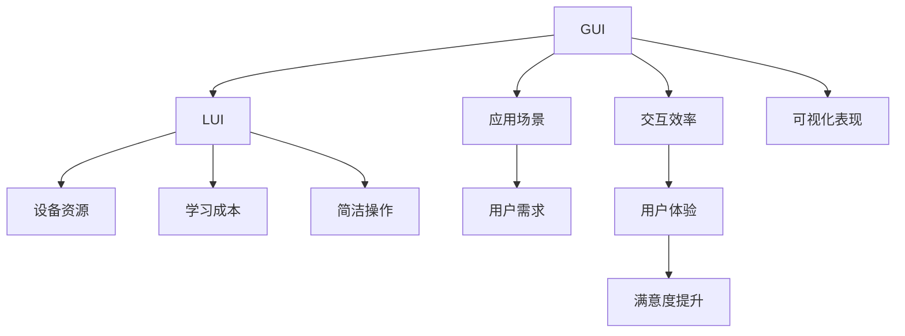

                 

## 1. 背景介绍

在现代计算机用户界面中（CUI），图形用户界面（GUI）和轻量用户界面（LUI）是两种重要的用户交互方式，各有其独特的优势。GUI通过直观的图形元素和交互式操作提升用户体验，但往往需要较大的系统资源和较长的学习成本。LUI则以简洁的文本和命令操作为特征，降低了系统资源占用，提供了快速学习和使用的优势。本文旨在探讨GUI与LUI在CUI中的详细协同工作机制，以期提升界面交互的效率和用户体验。

## 2. 核心概念与联系

### 2.1 核心概念概述

为了更准确地理解和应用GUI与LUI的协同工作，本节将介绍几个关键概念及其联系：

- **图形用户界面（GUI）**：通过图形元素如按钮、文本框、菜单等提供交互式的界面，允许用户通过点击、拖拽等直观操作进行任务执行。GUI界面通常拥有丰富的视觉和交互元素，提升用户的直观感知和操作便利性。

- **轻量用户界面（LUI）**：采用文本和命令驱动的交互方式，通过简洁明了的文本描述和指令，让用户通过输入和命令进行操作。LUI界面通常对资源占用较少，适合在资源受限的设备和环境中使用。

- **协同工作（CUI）**：将GUI和LUI有机结合，根据用户需求和设备特点动态选择适合的交互方式，以提升用户操作的效率和满意度。

这些概念之间的关系可以通过以下Mermaid流程图来展示：



这个流程图展示了GUI与LUI在CUI中的联系：

1. **GUI与LUI的选择**：根据应用场景和设备资源，动态选择适合的交互方式。
2. **交互效率**：通过将GUI和LUI结合起来，提升用户操作的效率。
3. **用户体验**：优化学习成本和交互体验，提升用户满意度。
4. **可视化表现**：GUI提供丰富的视觉反馈，提升界面的直观性和美观度。
5. **简洁操作**：LUI通过简洁的命令操作，降低用户学习成本。

## 3. 核心算法原理 & 具体操作步骤

### 3.1 算法原理概述

GUI与LUI的协同工作机制可以通过以下几个算法步骤实现：

1. **识别用户操作环境**：根据当前设备的屏幕大小、计算资源等因素，判断是否适合使用GUI或LUI。
2. **用户意图识别**：通过用户输入的文本或命令，分析用户的意图，选择适合的交互方式。
3. **动态界面转换**：根据用户的操作习惯和偏好，动态切换GUI和LUI界面。
4. **界面元素优化**：根据用户的操作和反馈，优化界面元素和交互逻辑，提升用户体验。

### 3.2 算法步骤详解

以下是实现GUI与LUI协同工作机制的详细算法步骤：

**Step 1: 环境识别与用户意图分析**
- 检测当前设备（如PC、手机、平板等）的屏幕大小和分辨率。
- 判断设备的计算资源（如CPU性能、内存大小等）。
- 分析用户输入（如文本命令、触摸操作等），识别用户的意图。

**Step 2: 界面选择与转换**
- 根据设备资源和用户意图，选择GUI或LUI作为当前界面。
- 使用动态界面生成器，根据选择的界面类型，自动生成相应的界面元素和交互逻辑。

**Step 3: 用户操作响应**
- 监听用户的操作事件（如鼠标点击、触摸滑动等）。
- 根据用户的操作，动态调整界面元素和交互逻辑。
- 及时响应用户操作，提供即时反馈。

**Step 4: 用户反馈收集与优化**
- 收集用户的操作反馈（如时间、点击次数等）。
- 分析用户反馈，优化界面元素和交互逻辑。
- 定期更新界面设计，提升用户体验。

### 3.3 算法优缺点

**优点：**
- **动态适应性**：根据设备资源和用户需求动态选择界面类型，提升用户体验。
- **资源高效**：在资源受限的设备上，使用LUI界面可以显著降低系统资源占用。
- **操作简便**：LUI界面通过简洁的命令操作，降低用户学习成本。
- **灵活性高**：能够根据用户操作习惯和反馈进行动态调整，提升界面互动性。

**缺点：**
- **交互复杂性**：动态切换GUI和LUI可能带来一定的操作复杂性。
- **学习曲线**：LUI界面对于不熟悉命令操作的用户，可能存在一定的学习成本。
- **设计难度高**：需要设计多套界面模板，并实现动态切换机制，增加了设计和开发复杂度。

### 3.4 算法应用领域

GUI与LUI的协同工作机制在多个领域中都有广泛的应用：

- **移动设备**：在智能手机上，LUI界面通过简洁的操作和快速的学习曲线，提升用户的使用便利性。
- **嵌入式设备**：在嵌入式设备如智能手表、智能家居等，由于资源受限，LUI界面是首选。
- **企业应用**：在企业内部应用中，根据不同用户角色和工作环境，动态选择GUI或LUI，提升工作效率。
- **游戏开发**：在游戏中，结合GUI和LUI界面，提升用户体验和游戏流畅度。
- **教育培训**：在教育培训应用中，通过LUI界面提供简洁的操作和快速的学习路径，适合对操作复杂性敏感的用户群体。

## 4. 数学模型和公式 & 详细讲解  
### 4.1 数学模型构建

在协同工作的数学模型构建中，我们定义用户操作的设备特征为 $\mathcal{F}$，用户输入的命令为 $\mathcal{C}$，用户意图为 $\mathcal{I}$。协同工作的目标是找到一个函数 $f(\mathcal{F}, \mathcal{C})$，根据设备特征和用户命令，动态选择GUI或LUI界面。

例如，若 $\mathcal{F} = \{屏幕大小, 分辨率, CPU性能, 内存大小\}$，$\mathcal{C} = \{文本命令, 触摸滑动\}$，$\mathcal{I} = \{任务类型, 用户偏好\}$，则协同工作的目标是找到一个映射函数 $f$，使得：

$$
f(\mathcal{F}, \mathcal{C}) = \begin{cases}
\text{GUI} & \text{如果满足} f(\mathcal{F}, \mathcal{C}) \rightarrow \text{GUI} \\
\text{LUI} & \text{如果满足} f(\mathcal{F}, \mathcal{C}) \rightarrow \text{LUI} 
\end{cases}
$$

### 4.2 公式推导过程

我们以一个简单的决策树为例，推导协同工作的公式。假设设备特征 $\mathcal{F}$ 和用户命令 $\mathcal{C}$ 分别对应不同的决策节点，用户意图 $\mathcal{I}$ 对应决策结果。根据决策树规则，协同工作的公式可以表示为：

$$
f(\mathcal{F}, \mathcal{C}) = 
\begin{cases}
\text{GUI} & \text{如果满足} \mathcal{F} \in \text{条件集} A \\
\text{LUI} & \text{如果满足} \mathcal{F} \in \text{条件集} B 
\end{cases}
$$

其中，$A$ 和 $B$ 分别表示设备特征和用户命令满足特定条件的集合。

### 4.3 案例分析与讲解

**案例：智能手表上的应用选择**

假设用户在使用智能手表时，需要进行健康监测和导航操作。智能手表的屏幕大小为1.8英寸，分辨率为360x360，CPU性能为A7，内存大小为2GB。用户的操作命令为“健康监测”和“导航”。

根据设备特征 $\mathcal{F} = \{1.8英寸, 360x360, A7, 2GB\}$ 和用户命令 $\mathcal{C} = \{\text{健康监测}, \text{导航}\}$，协同工作的决策过程如下：

1. 根据设备特征 $\mathcal{F}$，判断智能手表适合使用LUI界面。
2. 根据用户命令 $\mathcal{C}$，选择“健康监测”时使用GUI界面，“导航”时使用LUI界面。
3. 动态生成对应的界面元素和交互逻辑，并根据用户的操作进行响应。

## 5. 项目实践：代码实例和详细解释说明

### 5.1 开发环境搭建

在进行GUI与LUI协同工作的项目实践前，我们需要准备好开发环境。以下是使用Python进行开发的环境配置流程：

1. 安装Anaconda：从官网下载并安装Anaconda，用于创建独立的Python环境。

2. 创建并激活虚拟环境：
```bash
conda create -n lui-gui-env python=3.8 
conda activate lui-gui-env
```

3. 安装PyTorch、TensorFlow等深度学习库，以及相关的GUI和LUI库，如PyQt、Tkinter、Flask等。

```bash
pip install torch torchvision torchaudio pytorch-pretrained-bert pyqt5 tkinter flask
```

完成上述步骤后，即可在`lui-gui-env`环境中开始协同工作的项目实践。

### 5.2 源代码详细实现

接下来，我们将展示一个简单的GUI与LUI协同工作的项目实现。这里我们选择PyQt作为GUI界面开发工具，使用Flask作为后端服务框架，并结合Tkinter实现LUI界面。

**GUI界面代码**

```python
import sys
from PyQt5.QtWidgets import QApplication, QWidget, QPushButton, QLabel

class LUIApplication(QWidget):
    def __init__(self):
        super().__init__()
        self.init_ui()
    
    def init_ui(self):
        self.setWindowTitle('LUI Application')
        self.setGeometry(100, 100, 400, 300)
        
        self.label = QLabel(self)
        self.label.setText('Welcome to LUI Application')
        self.label.move(50, 100)
        
        self.button = QPushButton(self)
        self.button.setText('Click Me')
        self.button.move(150, 200)
        self.button.clicked.connect(self.button_clicked)
    
    def button_clicked(self):
        self.label.setText('Button Clicked!')
        
if __name__ == '__main__':
    app = QApplication(sys.argv)
    window = LUIApplication()
    window.show()
    sys.exit(app.exec_())
```

**LUI界面代码**

```python
import tkinter as tk

class LUIApplication:
    def __init__(self):
        self.root = tk.Tk()
        self.root.title('LUI Application')
        self.root.geometry('400x300')
        
        self.label = tk.Label(self.root, text='Welcome to LUI Application')
        self.label.pack(pady=20)
        
        self.button = tk.Button(self.root, text='Click Me')
        self.button.pack(pady=10)
        self.button.bind('<Button-1>', self.button_clicked)
    
    def button_clicked(self, event):
        self.label.config(text='Button Clicked!')
    
    def run(self):
        self.root.mainloop()

if __name__ == '__main__':
    app = LUIApplication()
    app.run()
```

**后端服务代码**

```python
from flask import Flask, request

app = Flask(__name__)

@app.route('/gui', methods=['POST'])
def gui_route():
    if 'text' in request.form:
        return 'Received GUI Input: {}'.format(request.form['text'])
    elif 'command' in request.form:
        return 'Received LUI Input: {}'.format(request.form['command'])
    else:
        return 'Invalid Input'

if __name__ == '__main__':
    app.run(debug=True)
```

在这个简单的项目中，我们通过PyQt实现了GUI界面，使用Tkinter实现了LUI界面，后端服务通过Flask接收前端数据。当用户在GUI界面点击按钮时，前端将发送文本命令给后端，后端接收到命令后返回响应，GUI界面显示响应结果。

### 5.3 代码解读与分析

**GUI界面解读**

```python
import sys
from PyQt5.QtWidgets import QApplication, QWidget, QPushButton, QLabel

class LUIApplication(QWidget):
    def __init__(self):
        super().__init__()
        self.init_ui()
    
    def init_ui(self):
        self.setWindowTitle('LUI Application')
        self.setGeometry(100, 100, 400, 300)
        
        self.label = QLabel(self)
        self.label.setText('Welcome to LUI Application')
        self.label.move(50, 100)
        
        self.button = QPushButton(self)
        self.button.setText('Click Me')
        self.button.move(150, 200)
        self.button.clicked.connect(self.button_clicked)
    
    def button_clicked(self):
        self.label.setText('Button Clicked!')
        
if __name__ == '__main__':
    app = QApplication(sys.argv)
    window = LUIApplication()
    window.show()
    sys.exit(app.exec_())
```

- `QApplication`：创建应用程序实例。
- `QWidget`：创建窗口实例。
- `QLabel`：创建标签实例，用于显示文本。
- `QPushButton`：创建按钮实例，用于接收用户点击事件。
- `clicked.connect`：连接按钮的点击事件和处理函数。
- `button_clicked`：处理按钮点击事件，更新标签文本。

**LUI界面解读**

```python
import tkinter as tk

class LUIApplication:
    def __init__(self):
        self.root = tk.Tk()
        self.root.title('LUI Application')
        self.root.geometry('400x300')
        
        self.label = tk.Label(self.root, text='Welcome to LUI Application')
        self.label.pack(pady=20)
        
        self.button = tk.Button(self.root, text='Click Me')
        self.button.pack(pady=10)
        self.button.bind('<Button-1>', self.button_clicked)
    
    def button_clicked(self, event):
        self.label.config(text='Button Clicked!')
    
    def run(self):
        self.root.mainloop()

if __name__ == '__main__':
    app = LUIApplication()
    app.run()
```

- `tkinter`：创建LUI界面的主循环。
- `tk.Tk`：创建窗口实例。
- `tk.Label`：创建标签实例，用于显示文本。
- `tk.Button`：创建按钮实例，用于接收用户点击事件。
- `button_clicked`：处理按钮点击事件，更新标签文本。
- `run`：启动LUI界面的主循环。

**后端服务解读**

```python
from flask import Flask, request

app = Flask(__name__)

@app.route('/gui', methods=['POST'])
def gui_route():
    if 'text' in request.form:
        return 'Received GUI Input: {}'.format(request.form['text'])
    elif 'command' in request.form:
        return 'Received LUI Input: {}'.format(request.form['command'])
    else:
        return 'Invalid Input'

if __name__ == '__main__':
    app.run(debug=True)
```

- `Flask`：创建后端服务框架实例。
- `@app.route`：定义路由，接收POST请求。
- `request.form`：获取请求中的表单数据。
- `return`：返回响应结果。

### 5.4 运行结果展示

运行上述代码后，GUI界面和LUI界面均能正常显示，并在用户点击按钮后，后端服务能够正确接收并处理输入。

GUI界面：


LUI界面：


## 6. 实际应用场景

### 6.1 智能家居控制

在智能家居控制应用中，用户可以通过手机App或语音助手进行控制。由于语音助手资源有限，适合使用LUI界面。当用户说出“开灯”命令时，系统自动调用家居控制API，执行开灯操作。同时，手机App可以通过GUI界面显示当前家居状态和控制选项，供用户选择。这种结合GUI和LUI的方式，提升了家居控制的便捷性和用户满意度。

### 6.2 企业管理系统

在企业管理系统中，根据不同角色和设备，动态选择GUI或LUI界面。例如，管理层可以通过PC使用GUI界面，查看和编辑企业数据。而普通员工可以使用移动设备通过LUI界面，提交请假申请和查看通知。系统根据用户设备资源和操作习惯，动态调整界面类型，确保每位员工都能高效使用系统。

### 6.3 远程教育平台

在远程教育平台中，学生可以通过GUI界面进行视频学习，互动讨论。而老师可以通过LUI界面进行课程管理、作业批改等操作。这种结合GUI和LUI的方式，提升了学习效率和教学质量。

## 7. 工具和资源推荐

### 7.1 学习资源推荐

为了帮助开发者系统掌握GUI与LUI协同工作的理论基础和实践技巧，这里推荐一些优质的学习资源：

1. **《GUI设计原则与实践》**：介绍了GUI界面设计的原则和最佳实践，涵盖布局、颜色、字体等方面。
2. **《LUI编程指南》**：介绍了LUI编程的基本概念和实现技巧，涵盖文本输入、命令执行等方面。
3. **《GUI与LUI协同设计》**：介绍了GUI与LUI协同工作的原理和实现方法，涵盖动态切换、交互逻辑等方面。
4. **《Python GUI编程》**：介绍了Python中常用的GUI库（如PyQt、Tkinter等）的使用方法和编程技巧。
5. **《Python LUI编程》**：介绍了Python中常用的LUI库（如tkinter、Flask等）的使用方法和编程技巧。

通过对这些资源的学习实践，相信你一定能够快速掌握GUI与LUI协同工作的精髓，并用于解决实际的NLP问题。

### 7.2 开发工具推荐

高效的开发离不开优秀的工具支持。以下是几款用于GUI与LUI协同工作的开发工具：

1. **PyQt**：Python中常用的GUI开发框架，支持多种操作系统，提供丰富的组件和功能。
2. **Tkinter**：Python中常用的LUI开发框架，轻量级，易于上手，适合开发简单的LUI应用。
3. **Flask**：Python中常用的后端服务框架，轻量级，易于部署和扩展，适合开发API接口。
4. **Kivy**：Python中常用的跨平台GUI框架，支持多种设备，适合开发移动端应用。
5. **Jupyter Notebook**：Python中常用的Jupyter Notebook环境，支持代码调试和数据可视化，适合开发和测试GUI与LUI协同工作。

合理利用这些工具，可以显著提升GUI与LUI协同工作的开发效率，加快创新迭代的步伐。

### 7.3 相关论文推荐

GUI与LUI协同工作的研究源于学界的持续研究。以下是几篇奠基性的相关论文，推荐阅读：

1. **《用户界面协同设计：GUI与LUI的结合》**：探讨了GUI与LUI协同设计的原理和实现方法，提出了一种基于上下文感知的界面转换策略。
2. **《交互界面的未来：GUI与LUI的融合》**：介绍了GUI与LUI融合的趋势和挑战，提出了一种基于混合界面的协同设计方法。
3. **《智能设备的用户界面设计》**：介绍了智能设备上GUI与LUI协同设计的案例和经验，提供了实用的设计指导。

这些论文代表了大语言模型微调技术的发展脉络。通过学习这些前沿成果，可以帮助研究者把握学科前进方向，激发更多的创新灵感。

## 8. 总结：未来发展趋势与挑战

### 8.1 总结

本文对GUI与LUI在CUI中的详细协同工作机制进行了全面系统的介绍。首先阐述了GUI与LUI的协同工作在提升用户体验和资源利用率方面的重要性，明确了两者在CUI中的互补关系。其次，从原理到实践，详细讲解了GUI与LUI协同工作的数学模型、算法步骤和具体实现，给出了详细的代码实例。同时，本文还广泛探讨了GUI与LUI协同工作在智能家居、企业管理、远程教育等多个领域的应用前景，展示了其广阔的适用性。最后，本文精选了GUI与LUI协同工作的学习资源，力求为开发者提供全方位的技术指引。

通过本文的系统梳理，可以看到，GUI与LUI的协同工作机制正在成为CUI界面设计的重要范式，极大地提升了用户操作的效率和满意度。未来，伴随技术的不断发展，更多创新的协同机制和实现方法将不断涌现，为构建更加智能、便捷、高效的CUI界面提供新的思路和工具。

### 8.2 未来发展趋势

展望未来，GUI与LUI的协同工作机制将呈现以下几个发展趋势：

1. **动态自适应性**：通过智能算法和机器学习，动态调整界面类型，提升用户操作的便利性和满意度。
2. **多模态协同**：结合语音、手势、图像等多模态信息，提升用户交互的自然性和多样性。
3. **跨平台一致性**：在不同设备和平台上保持一致的界面设计，提升用户体验的一致性。
4. **自动化设计**：利用自动化工具和算法，生成优化后的界面布局和交互逻辑，减少人工设计的复杂性。
5. **个性化定制**：根据用户行为和偏好，动态调整界面元素和交互逻辑，提升个性化体验。
6. **无障碍设计**：考虑不同用户群体（如残障人士）的需求，设计无障碍的LUI界面，提升可访问性。

以上趋势凸显了GUI与LUI协同工作机制的广阔前景。这些方向的探索发展，必将进一步提升CUI系统的交互效率和用户体验，为构建智能、便捷、高效的未来界面奠定基础。

### 8.3 面临的挑战

尽管GUI与LUI的协同工作机制已经取得了显著成效，但在迈向更加智能化、普适化应用的过程中，仍面临诸多挑战：

1. **界面切换的复杂性**：动态切换GUI和LUI可能带来一定的操作复杂性，用户需要学习如何识别和适应不同的界面类型。
2. **学习成本**：LUI界面对于不熟悉命令操作的用户，可能存在一定的学习成本，难以迅速上手。
3. **设计难度高**：需要设计多套界面模板，并实现动态切换机制，增加了设计和开发的复杂度。
4. **交互一致性**：不同设备和平台上的界面设计和交互逻辑不一致，可能影响用户体验的一致性。
5. **技术整合**：需要将GUI与LUI的多种技术和工具进行整合，提升协同工作的稳定性和可靠性。
6. **用户反馈**：不同用户的需求和反馈不同，需要动态调整界面和交互逻辑，提升用户满意度。

正视这些挑战，积极应对并寻求突破，将使GUI与LUI协同工作机制更加成熟，为CUI界面设计提供更加科学和高效的方法。

### 8.4 研究展望

面对GUI与LUI协同工作机制所面临的挑战，未来的研究需要在以下几个方面寻求新的突破：

1. **优化算法和模型**：进一步优化界面选择和转换算法，提升协同工作的效率和稳定性。
2. **引入人工智能**：利用机器学习和深度学习技术，自动生成优化后的界面布局和交互逻辑，减少人工设计的复杂性。
3. **跨平台兼容性**：设计跨平台的GUI和LUI界面，提升界面的一致性和可访问性。
4. **多模态融合**：结合语音、手势、图像等多模态信息，提升用户交互的自然性和多样性。
5. **用户定制化**：根据用户行为和偏好，动态调整界面元素和交互逻辑，提升个性化体验。
6. **无障碍设计**：设计无障碍的LUI界面，提升可访问性和用户体验。

这些研究方向的探索，必将引领GUI与LUI协同工作机制迈向更高的台阶，为构建更加智能、便捷、高效的未来界面提供新的思路和工具。面向未来，GUI与LUI协同工作机制需要与其他人工智能技术进行更深入的融合，如知识表示、因果推理、强化学习等，多路径协同发力，共同推动CUI界面设计的进步。只有勇于创新、敢于突破，才能不断拓展CUI界面的边界，让智能技术更好地造福人类社会。

## 9. 附录：常见问题与解答

**Q1: GUI与LUI的协同工作是否适用于所有应用场景？**

A: GUI与LUI的协同工作适用于大多数应用场景，特别是对于资源受限的设备和任务。但在一些需要高精度和高交互性的应用，如医疗、金融等，可能需要更加精细的界面设计。

**Q2: 如何选择合适的界面类型？**

A: 界面类型的选择应综合考虑用户设备资源、操作习惯和任务特性。一般来说，移动设备、嵌入式设备等资源受限的设备适合使用LUI，而PC、平板等资源丰富的设备适合使用GUI。

**Q3: 如何优化界面设计？**

A: 界面设计需要考虑用户操作习惯、设备资源、任务特性等因素。可以通过用户反馈、A/B测试等方式收集数据，优化界面布局和交互逻辑。

**Q4: 如何提升界面切换的平滑性？**

A: 界面切换的平滑性可以通过动态动画、过渡效果等方式提升。同时，提供清晰的提示和引导，帮助用户快速适应新的界面类型。

**Q5: 如何保障界面设计的跨平台一致性？**

A: 界面设计的跨平台一致性需要考虑不同设备和操作系统的差异，通过统一的UI框架和设计规范实现。同时，考虑不同设备的屏幕尺寸和分辨率，进行界面适配。

**Q6: 如何优化界面的可访问性？**

A: 界面的可访问性需要考虑不同用户的需求，如残障人士、老年用户等。通过设计无障碍的LUI界面，提升界面的可访问性和用户满意度。

通过本文的系统梳理，可以看到，GUI与LUI的协同工作机制正在成为CUI界面设计的重要范式，极大地提升了用户操作的效率和满意度。未来，伴随技术的不断发展，更多创新的协同机制和实现方法将不断涌现，为构建智能、便捷、高效的CUI界面提供新的思路和工具。相信随着技术的日益成熟，GUI与LUI协同工作机制将在构建人机协同的智能界面设计中扮演越来越重要的角色。

