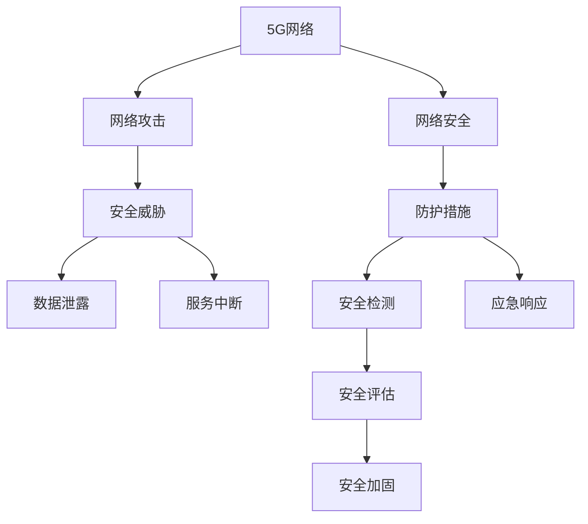
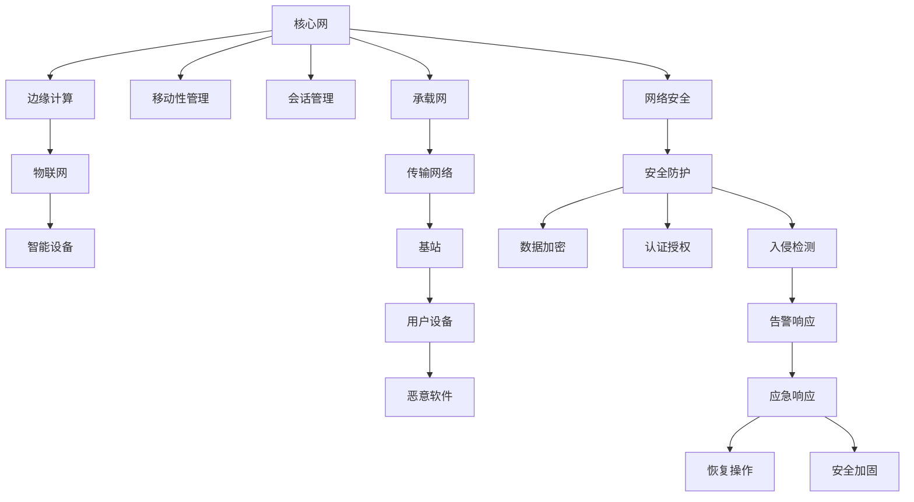

                 

## 1. 背景介绍

随着5G网络的广泛部署，其高速度、低延迟、广覆盖等特性带来了巨大的技术红利，但也给网络安全带来了诸多挑战。5G网络的安全威胁既有传统的网络攻击，如DDoS攻击、钓鱼、恶意软件等，也有新兴的物联网、边缘计算、车联网等场景带来的安全问题。本文将围绕5G网络安全的现状、挑战和解决方案进行系统性探讨，旨在为5G网络的安全应用提供理论和实践指导。

## 2. 核心概念与联系

### 2.1 核心概念概述

为了全面理解5G网络安全问题，本节将介绍几个关键概念：

- 5G网络：指第三代移动通信网络技术的升级版，具有高速度、低延迟、广覆盖等特征，能够支持大规模物联网设备、自动驾驶、远程医疗等场景。
- 网络安全：指通过技术手段保护网络通信、数据存储等不受未授权访问、破坏和窃取。
- 安全威胁：指潜在的网络攻击行为，如DDoS、恶意软件、钓鱼等，通过破坏网络安全性，造成数据泄露、服务中断等危害。
- 安全解决方案：指通过策略、技术手段，应对各类网络安全威胁，保护网络安全。

以下 Mermaid 流程图展示了5G网络安全的基本框架：



该流程图表明，5G网络面临的安全威胁通过安全防护、检测、应急响应和评估加固等环节，转化为对5G网络安全的保障措施。

### 2.2 核心概念原理和架构的 Mermaid 流程图



该流程图展示了5G网络架构中，网络安全的不同层次和关键组件。核心网负责用户管理，边缘计算提供本地计算，物联网设备是网络攻击的潜在目标，承载网和传输网络是数据传输的关键，基站和用户设备是攻击的目标节点，安全防护措施如数据加密、认证授权、入侵检测等，共同构建起5G网络的安全屏障。

## 3. 核心算法原理 & 具体操作步骤

### 3.1 算法原理概述

5G网络安全涉及多层次、多维度的安全防护和检测技术。本文将从密码学、入侵检测、恶意软件防护等方面，介绍核心算法原理。

#### 3.1.1 数据加密算法

数据加密是保护网络通信安全的核心技术，常用的算法包括AES、RSA、ECC等。这些算法通过将数据进行加密、解密操作，确保数据在传输过程中不被窃听、篡改。

#### 3.1.2 认证授权算法

认证授权算法用于验证用户的身份和权限，常用的算法包括OAuth、JWT等。这些算法通过在请求中携带认证令牌，确保只有授权用户才能访问系统资源。

#### 3.1.3 入侵检测算法

入侵检测算法用于识别和阻止未授权访问行为，常用的算法包括IDS、IPS等。这些算法通过监控网络流量，分析异常行为，及时阻止恶意攻击。

### 3.2 算法步骤详解

#### 3.2.1 数据加密算法

1. **密钥生成**：随机生成一个密钥用于加密和解密操作。
2. **加密操作**：将明文数据使用密钥进行加密，生成密文数据。
3. **解密操作**：将密文数据使用密钥进行解密，恢复明文数据。

#### 3.2.2 认证授权算法

1. **身份验证**：用户登录时，系统向客户端发送认证令牌，客户端携带令牌向服务器请求资源。
2. **权限验证**：服务器通过认证令牌验证用户身份和权限，允许或拒绝访问请求。
3. **令牌刷新**：令牌过期前，系统自动刷新令牌，保证认证的有效性。

#### 3.2.3 入侵检测算法

1. **流量监控**：实时监控网络流量，检测异常行为。
2. **行为分析**：分析流量中的异常行为，如端口扫描、暴力破解等。
3. **阻止攻击**：识别出攻击行为后，系统自动阻止恶意流量，并记录日志。

### 3.3 算法优缺点

#### 3.3.1 数据加密算法

**优点**：
- 保证数据的机密性和完整性。
- 支持多种加密方式和密钥长度，适用于不同安全需求。

**缺点**：
- 计算复杂度较高，影响加密和解密速度。
- 加密算法的选择和密钥管理复杂。

#### 3.3.2 认证授权算法

**优点**：
- 实现身份和权限验证，保障系统安全。
- 支持多种认证方式，适应不同应用场景。

**缺点**：
- 认证令牌可能被伪造，安全性有待提高。
- 需要持续刷新令牌，增加系统负担。

#### 3.3.3 入侵检测算法

**优点**：
- 实时监控网络流量，及时发现异常行为。
- 支持多种入侵检测技术，如基于签名、基于行为的检测。

**缺点**：
- 误报率高，可能将正常流量误判为攻击。
- 需要高性能设备支持，成本较高。

### 3.4 算法应用领域

#### 3.4.1 数据加密

数据加密广泛应用于银行、电商、医疗等行业，保护用户敏感信息不被泄露。

#### 3.4.2 认证授权

认证授权在Web应用、移动应用、云服务等场景中广泛应用，确保系统资源的安全访问。

#### 3.4.3 入侵检测

入侵检测在企业内部网络、数据中心、IoT设备等环境中，提供实时监控和应急响应。

## 4. 数学模型和公式 & 详细讲解 & 举例说明

### 4.1 数学模型构建

#### 4.1.1 数据加密模型

数据加密模型通常包含加密和解密两个阶段。设明文为 $P$，密文为 $C$，密钥为 $K$，则加密和解密公式分别为：

$$
C = E(K, P)
$$

$$
P' = D(K, C)
$$

其中，$E$ 表示加密算法，$D$ 表示解密算法。

#### 4.1.2 认证授权模型

认证授权模型通常包含身份验证和权限验证两个阶段。设用户身份为 $U$，权限为 $A$，认证令牌为 $T$，则身份验证和权限验证公式分别为：

$$
T = I(U)
$$

$$
U', A' = V(T)
$$

其中，$I$ 表示身份验证算法，$V$ 表示权限验证算法。

#### 4.1.3 入侵检测模型

入侵检测模型通常包含流量监控和行为分析两个阶段。设网络流量为 $F$，异常行为为 $A$，攻击行为为 $B$，则流量监控和行为分析公式分别为：

$$
A = O(F)
$$

$$
B = I(A)
$$

其中，$O$ 表示流量监控算法，$I$ 表示行为分析算法。

### 4.2 公式推导过程

#### 4.2.1 数据加密算法

以AES算法为例，推导数据加密和解密公式。

设明文为 $P$，密钥为 $K$，则AES加密公式为：

$$
C = E_{K}(P) = \mathcal{F}(F_{K}, P)
$$

其中，$\mathcal{F}$ 表示加密函数，$F_{K}$ 表示密钥扩展算法。

解密公式为：

$$
P' = D_{K}(C) = \mathcal{F}^{-1}(F_{K}, C)
$$

其中，$\mathcal{F}^{-1}$ 表示解密函数。

#### 4.2.2 认证授权算法

以OAuth 2.0为例，推导认证授权公式。

设用户身份为 $U$，认证令牌为 $T$，则OAuth 2.0身份验证和权限验证公式分别为：

$$
T = I_{OAuth}(U)
$$

$$
U', A' = V_{OAuth}(T)
$$

其中，$I_{OAuth}$ 表示OAuth身份验证算法，$V_{OAuth}$ 表示OAuth权限验证算法。

#### 4.2.3 入侵检测算法

以IDS为例，推导入侵检测公式。

设网络流量为 $F$，异常行为为 $A$，则IDS流量监控和行为分析公式分别为：

$$
A = O_{IDS}(F)
$$

$$
B = I_{IDS}(A)
$$

其中，$O_{IDS}$ 表示IDS流量监控算法，$I_{IDS}$ 表示IDS行为分析算法。

### 4.3 案例分析与讲解

#### 4.3.1 数据加密

案例：某银行进行数据加密保护客户信息。

- **场景**：某客户在银行APP上进行转账操作，需要加密传输客户账号、密码等信息。
- **解决方案**：使用AES算法进行加密，客户信息在传输过程中无法被窃听和篡改。
- **效果**：银行客户的敏感信息得到有效保护，防止信息泄露和盗用。

#### 4.3.2 认证授权

案例：某电商平台进行用户身份认证。

- **场景**：用户在电商平台进行购物时，需要进行身份验证和权限验证。
- **解决方案**：使用OAuth 2.0进行身份验证和权限验证，确保只有授权用户才能访问电商平台。
- **效果**：电商平台的安全性得到保障，用户的交易数据得到保护。

#### 4.3.3 入侵检测

案例：某企业网络进行入侵检测。

- **场景**：企业网络遭受DDoS攻击，网络流量异常。
- **解决方案**：使用IDS进行流量监控和行为分析，识别出DDoS攻击并阻止。
- **效果**：企业网络服务恢复正常，防止数据泄露和服务中断。

## 5. 项目实践：代码实例和详细解释说明

### 5.1 开发环境搭建

在进行5G网络安全实践前，我们需要准备好开发环境。以下是使用Python进行网络安全开发的环境配置流程：

1. 安装Anaconda：从官网下载并安装Anaconda，用于创建独立的Python环境。

2. 创建并激活虚拟环境：
```bash
conda create -n network-security python=3.8 
conda activate network-security
```

3. 安装相关依赖：
```bash
conda install requests scapy pycrypto pyopenssl
```

4. 安装OpenSSL库：
```bash
conda install openssl
```

完成上述步骤后，即可在`network-security`环境中开始网络安全实践。

### 5.2 源代码详细实现

下面以AES加密算法为例，给出使用Python进行数据加密的代码实现。

首先，定义AES加密算法：

```python
from Crypto.Cipher import AES
import os

def encrypt(text, key):
    block_size = AES.block_size
    padding = AES.block_size - len(text) % block_size
    text = text + padding * chr(padding)
    iv = os.urandom(block_size)
    cipher = AES.new(key.encode(), AES.MODE_CBC, iv)
    return cipher.encrypt(text.encode())

def decrypt(text, key):
    block_size = AES.block_size
    iv = text[:block_size]
    cipher = AES.new(key.encode(), AES.MODE_CBC, iv)
    text = cipher.decrypt(text[block_size:])
    padding = text[-1]
    return text[:-padding].decode()
```

然后，定义身份验证和权限验证函数：

```python
from Crypto.Hash import HMAC
import base64

def generate_token(username, password):
    hmac = HMAC.new(b'salt', msg=(username + password).encode(), digestmod=SHA256)
    return base64.b64encode(hmac.digest()).decode()

def verify_token(token, username, password):
    hmac = HMAC.new(b'salt', msg=(username + password).encode(), digestmod=SHA256)
    return base64.b64encode(hmac.digest()).decode() == token
```

最后，进行网络流量监控和行为分析：

```python
from scapy.all import sniff, Ether, ARP, TCP

def monitor_traffic(interface):
    sniff(iface=interface, prn=process_packet, filter="tcp")
    
def process_packet(packet):
    if isinstance(packet, Ether) and packet.dst == 'ff:ff:ff:ff:ff:ff':
        print(packet.summary())
        
def analyze_behavior(packet):
    if isinstance(packet, TCP):
        print(packet.sport, packet.dport)
```

### 5.3 代码解读与分析

让我们再详细解读一下关键代码的实现细节：

**AES加密算法**：
- 使用`Crypto.Cipher`模块定义AES加密算法。
- `encrypt`函数：将明文数据使用AES算法进行加密，生成密文数据。
- `decrypt`函数：将密文数据使用AES算法进行解密，恢复明文数据。

**OAuth身份验证和权限验证**：
- 使用`Crypto.Hash`模块定义HMAC算法，生成认证令牌。
- `generate_token`函数：根据用户名和密码生成认证令牌。
- `verify_token`函数：验证认证令牌是否合法。

**网络流量监控和行为分析**：
- 使用`scapy`库进行网络流量监控和行为分析。
- `monitor_traffic`函数：对指定接口的流量进行监控，调用`process_packet`函数处理每个数据包。
- `process_packet`函数：处理以太网数据包，检查是否为目标地址。
- `analyze_behavior`函数：分析TCP流量，输出源端口和目标端口。

这些代码展示了基本的网络安全技术实现。开发者可以结合实际需求，灵活运用这些技术，构建更复杂的网络安全系统。

## 6. 实际应用场景

### 6.1 智慧城市安全

智慧城市建设过程中，5G网络作为关键基础设施，其安全性尤为重要。通过部署网络安全技术，可以有效防范各类安全威胁，保障智慧城市的安全稳定运行。

在智慧城市中，5G网络可以支持智能交通、智能安防、智能电网等多个场景，其中物联网设备数量庞大，攻击面广泛。通过部署网络加密、认证授权、入侵检测等安全技术，可以有效防范DDoS攻击、恶意软件等威胁，保障城市的安全。

### 6.2 工业物联网安全

工业物联网（IIoT）的广泛应用，带来了新的安全挑战。通过5G网络的广覆盖和高速度，工业物联网设备可以进行实时监控和控制，但同时也容易成为攻击目标。

在工业物联网中，5G网络可以支持智能制造、智能监控、智能物流等多个场景，其中设备数量庞大，攻击面广泛。通过部署网络加密、认证授权、入侵检测等安全技术，可以有效防范DDoS攻击、恶意软件等威胁，保障工业物联网的安全。

### 6.3 车联网安全

车联网（V2X）是5G网络的重要应用场景之一，其安全性直接关系到行车安全。通过部署网络安全技术，可以有效防范各类安全威胁，保障车联网的安全。

在车联网中，5G网络可以支持智能交通、智能停车、智能导航等多个场景，其中车辆数据实时传输，攻击面广泛。通过部署网络加密、认证授权、入侵检测等安全技术，可以有效防范DDoS攻击、恶意软件等威胁，保障车联网的安全。

## 7. 工具和资源推荐

### 7.1 学习资源推荐

为了帮助开发者系统掌握5G网络安全理论基础和实践技巧，这里推荐一些优质的学习资源：

1. 《5G网络安全基础》系列博文：由网络安全专家撰写，深入浅出地介绍了5G网络安全的原理、技术和应用。

2. Coursera《网络安全基础》课程：由知名大学开设的入门课程，涵盖网络安全的基本概念和常见技术。

3. 《5G网络安全白皮书》：某知名网络安全厂商发布的权威报告，提供5G网络安全的最新研究成果和应用实践。

4. 《5G网络安全指南》：某知名安全厂商的实践指南，涵盖5G网络安全的部署和运维方法。

5. GitHub上的开源项目：如PyScapy、PyCrypto等，提供了丰富的网络安全工具和实现参考。

通过对这些资源的学习实践，相信你一定能够快速掌握5G网络安全技术的精髓，并用于解决实际的网络安全问题。

### 7.2 开发工具推荐

高效的开发离不开优秀的工具支持。以下是几款用于5G网络安全开发的常用工具：

1. PyScapy：基于Python的网络安全开发框架，支持数据包捕获、协议分析等。
2. PyCrypto：基于Python的加密库，支持多种加密算法和密钥管理。
3. OpenSSL：开放源码的加密库，支持多种加密算法和密钥管理。
4. Wireshark：网络协议分析工具，支持捕获和分析网络流量。
5. Wireshark-qt：基于Wireshark的网络协议分析工具，支持图形化界面和Python脚本。

合理利用这些工具，可以显著提升5G网络安全开发效率，加快创新迭代的步伐。

### 7.3 相关论文推荐

5G网络安全的研究源于学界的持续研究。以下是几篇奠基性的相关论文，推荐阅读：

1. "5G Security Challenges and Solutions"：介绍5G网络安全的挑战和应对方法，提供理论基础和技术指引。
2. "A Survey on 5G Security"：综述5G网络安全的最新研究成果，涵盖加密、认证、入侵检测等多个方面。
3. "5G Network Security Techniques"：介绍5G网络安全的各种技术手段，如数据加密、认证授权、入侵检测等。
4. "5G Security in IoT"：探讨5G网络在工业物联网中的应用和安全性，提供具体实现方法。
5. "5G Security in V2X"：探讨5G网络在车联网中的应用和安全性，提供具体实现方法。

这些论文代表了大网络安全技术的发展脉络。通过学习这些前沿成果，可以帮助研究者把握学科前进方向，激发更多的创新灵感。

## 8. 总结：未来发展趋势与挑战

### 8.1 研究成果总结

本文对5G网络安全的现状、挑战和解决方案进行了系统性探讨。首先阐述了5G网络安全的背景和重要性，明确了网络安全对5G网络应用的保障作用。其次，从数据加密、认证授权、入侵检测等方面，详细讲解了5G网络安全的核心算法和技术实现。最后，通过实践案例、应用场景和工具推荐，提供了5G网络安全的实践指导。

通过本文的系统梳理，可以看到，5G网络安全是一个多层次、多维度的复杂问题，涉及密码学、认证授权、入侵检测等多个技术领域。开发者需要全面掌握相关知识，结合实际应用场景，灵活运用这些技术，才能构建安全可靠的网络环境。

### 8.2 未来发展趋势

展望未来，5G网络安全将呈现以下几个发展趋势：

1. **网络加密技术发展**：随着硬件算力的提升，5G网络加密技术将不断发展，加密算法将更加高效、安全。
2. **认证授权技术优化**：基于区块链、零信任等技术，5G网络认证授权将更加灵活、可靠。
3. **入侵检测技术进步**：基于机器学习、行为分析等技术，5G网络入侵检测将更加智能、准确。
4. **多层次安全防护**：结合身份验证、权限控制、入侵检测等多层次安全防护措施，构建全面的安全体系。
5. **区块链技术应用**：结合区块链技术，实现去中心化的认证授权和数据存储，增强网络安全性。
6. **跨域安全合作**：建立跨域安全合作机制，协同应对5G网络安全威胁，提升整体安全性。

以上趋势凸显了5G网络安全的广阔前景。这些方向的探索发展，必将进一步提升5G网络的安全性，为5G网络的应用提供坚实的保障。

### 8.3 面临的挑战

尽管5G网络安全技术已经取得了显著进展，但在迈向更加智能化、普适化应用的过程中，仍面临诸多挑战：

1. **硬件资源限制**：5G网络设备复杂度提升，硬件资源成为安全技术应用的瓶颈。如何优化资源利用，提升硬件性能，是关键问题。
2. **攻击手段多样化**：新型攻击手段不断涌现，如零日漏洞、社交工程等，如何及时识别和防御这些新威胁，需要持续创新。
3. **多层次安全需求**：5G网络涉及多个层次的安全需求，如何实现统一的策略和架构，提升整体安全性，仍需探索。
4. **合规性要求高**：5G网络涉及多个行业标准和法规要求，如何满足不同领域的合规性需求，也是重要的研究方向。
5. **协同防御难度大**：5G网络设备众多，协同防御难度大，如何建立有效的跨域协同防御机制，是亟需解决的问题。

### 8.4 研究展望

面对5G网络安全所面临的挑战，未来的研究需要在以下几个方面寻求新的突破：

1. **网络加密技术优化**：开发更高效、安全的加密算法，优化密钥管理和分发机制，提升加密效率和安全性。
2. **认证授权技术创新**：结合区块链、零信任等技术，开发灵活、可靠的身份认证和授权方案，提高网络安全性。
3. **入侵检测技术提升**：结合机器学习和行为分析技术，提升入侵检测的智能性和准确性，减少误报和漏报。
4. **多层次安全架构构建**：结合身份验证、权限控制、入侵检测等多层次安全防护措施，构建全面的安全架构，提升整体安全性。
5. **区块链技术应用**：结合区块链技术，实现去中心化的认证授权和数据存储，增强网络安全性。
6. **跨域安全合作**：建立跨域安全合作机制，协同应对5G网络安全威胁，提升整体安全性。

这些研究方向的探索，必将推动5G网络安全技术的发展，为5G网络的应用提供坚实的保障。总之，5G网络安全技术需要在多个层面进行综合考虑，结合实际应用场景，不断创新和优化，方能构建安全可靠的网络环境。

