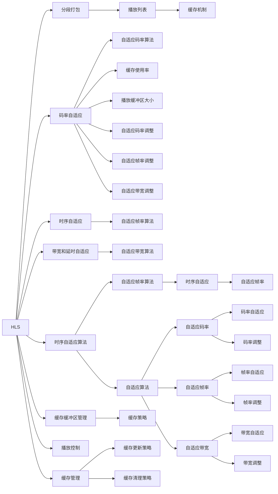

                 

## 1. 背景介绍

### 1.1 问题由来

随着互联网技术的快速发展和数字媒体内容的日益丰富，传统的固定码率流媒体技术已经无法满足用户的需求。人们对于视频流传输的需求变得更高，更加注重视频质量和用户体验，并希望在不同的网络条件下都能获得流畅的观看体验。

在这样的背景下，自适应流媒体技术应运而生。自适应流媒体技术可以根据用户的网络状况和设备性能动态调整传输码率，提供最佳的视频观看体验。其中，HLS（HTTP Live Streaming）和DASH（Dynamic Adaptive Streaming over HTTP）是两种最为常用的自适应流媒体技术，被广泛应用于实时流媒体传输中。

### 1.2 问题核心关键点

- **HLS（HTTP Live Streaming）**：是一种基于HTTP协议的实时流媒体传输协议，由Apple公司提出。HLS技术通过将实时流分割成多个小的、可独立下载和播放的片段，并按顺序或随机访问的方式呈现，从而实现自适应流媒体传输。

- **DASH（Dynamic Adaptive Streaming over HTTP）**：是一种基于HTTP协议的自适应流媒体传输协议，由MPEG组织提出。DASH技术通过动态调整视频码率、分辨率和帧率等参数，根据网络条件和设备能力提供最佳的用户体验。

这两种技术在自适应流媒体传输中有着广泛的应用，但它们的设计理念、实现机制和性能特点存在一定差异。本博客将详细对比HLS和DASH两种技术，以期为自适应流媒体技术的应用提供指导。

## 2. 核心概念与联系

### 2.1 核心概念概述

#### 2.1.1 HLS（HTTP Live Streaming）

- **实时流媒体**：在传输过程中，流媒体数据被实时地分片打包并传输，观众可以在播放过程中即时获取最新的内容。
- **分段打包**：将实时流分割成多个小片段，每个片段的大小通常为0.5秒到1.5秒，便于下载和缓存。
- **播放列表**：通过M3U8或Master playlist等格式描述流媒体的分段信息，包括起始码率和传输码率等。
- **缓存机制**：利用网络缓存技术，确保在网络状况不佳时用户仍然可以观看视频。

#### 2.1.2 DASH（Dynamic Adaptive Streaming over HTTP）

- **自适应流媒体**：根据网络条件和设备性能动态调整视频码率和分辨率，确保最佳观看体验。
- **码率自适应**：利用码率自适应算法，根据网络带宽和用户设备性能调整视频传输码率，确保最佳用户体验。
- **时序自适应**：通过时序自适应算法，调整视频帧率，确保视频流畅播放。
- **带宽和延时自适应**：根据网络带宽和延迟，动态调整视频码率和帧率，确保最佳用户体验。

这两种技术虽然目标一致，都是提供自适应流媒体传输，但它们的实现机制和性能特点存在一定差异。本节将详细解释这两种技术的核心概念和实现机制，并通过Mermaid流程图展示它们的联系和区别。



### 2.2 核心概念原理和架构的 Mermaid 流程图

通过上述图，我们可以看到HLS和DASH的实现机制和性能特点：

- **HLS**：通过分段打包、播放列表和缓存机制，确保用户可以在网络状况不佳时仍然观看视频。同时，HLS也支持码率自适应，但主要依赖用户端设备的缓存机制进行自适应。
- **DASH**：通过码率自适应、时序自适应、带宽和延时自适应等算法，动态调整视频码率和分辨率，提供最佳的用户体验。DASH利用网络缓存和时序缓存，确保视频流畅播放。

这两种技术的设计理念和实现机制有所不同，但都致力于提供自适应流媒体传输，确保用户在不同网络条件和设备性能下获得流畅的观看体验。

## 3. 核心算法原理 & 具体操作步骤

### 3.1 算法原理概述

HLS和DASH的核心算法原理都是基于HTTP协议的流媒体传输技术。它们的主要区别在于码率自适应和时序自适应的实现机制。

#### HLS算法原理

HLS的主要算法原理包括分段打包、播放列表和缓存机制。分段打包是将实时流分割成多个小片段，便于下载和缓存。播放列表描述分段信息，包括起始码率和传输码率等。缓存机制利用网络缓存技术，确保在网络状况不佳时用户仍然可以观看视频。

#### DASH算法原理

DASH的主要算法原理包括码率自适应、时序自适应、带宽和延时自适应等。码率自适应算法根据网络带宽和用户设备性能调整视频传输码率。时序自适应算法调整视频帧率，确保视频流畅播放。带宽和延时自适应算法根据网络带宽和延迟，动态调整视频码率和帧率。

### 3.2 算法步骤详解

#### HLS具体操作步骤

1. **分段打包**：将实时流分割成多个小片段，每个片段的大小通常为0.5秒到1.5秒。

2. **播放列表**：通过M3U8或Master playlist等格式描述流媒体的分段信息，包括起始码率和传输码率等。

3. **缓存机制**：利用网络缓存技术，确保在网络状况不佳时用户仍然可以观看视频。

#### DASH具体操作步骤

1. **码率自适应**：利用码率自适应算法，根据网络带宽和用户设备性能调整视频传输码率。

2. **时序自适应**：通过时序自适应算法，调整视频帧率，确保视频流畅播放。

3. **带宽和延时自适应**：根据网络带宽和延迟，动态调整视频码率和帧率，确保最佳用户体验。

### 3.3 算法优缺点

#### HLS优缺点

- **优点**：
  - 实现简单，易于部署。
  - 利用网络缓存技术，支持离线播放。
  - 分段打包机制，支持断点续播。

- **缺点**：
  - 缓存机制容易导致缓存溢出。
  - 码率自适应依赖于用户端设备的缓存机制，可能导致性能不稳定。
  - 无法实时动态调整视频码率和帧率，可能导致用户体验不理想。

#### DASH优缺点

- **优点**：
  - 动态调整码率和帧率，提供最佳用户体验。
  - 支持多种格式和编码方式，兼容性较好。
  - 时序自适应和带宽自适应算法，确保流畅播放。

- **缺点**：
  - 实现复杂，部署难度较大。
  - 实时调整码率和帧率，需要高性能的设备支持。
  - 缓存机制复杂，需要合理设计缓冲区大小和更新策略。

### 3.4 算法应用领域

HLS和DASH自适应流媒体技术主要应用于以下领域：

- **实时直播**：通过HLS或DASH技术，可以实时直播体育赛事、新闻、音乐会等节目，确保观众在不同网络条件下获得流畅的观看体验。

- **视频点播**：通过HLS或DASH技术，可以实现视频点播服务，用户可以在任意时间观看视频，并提供流畅的播放体验。

- **移动设备视频流**：通过HLS或DASH技术，可以在移动设备上实现视频流，确保用户在地铁、公交等移动场景中获得流畅的观看体验。

- **在线教育**：通过HLS或DASH技术，可以实现在线教育视频流，确保学生在不同网络条件下获得流畅的观看体验。

## 4. 数学模型和公式 & 详细讲解 & 举例说明

### 4.1 数学模型构建

#### 4.1.1 HLS数学模型

HLS的数学模型主要涉及分段打包和播放列表的构建。假设实时流速率为 $r$，分段大小为 $s$，则每个分段包含的帧数为 $t=\frac{r}{s}$。播放列表包含多个分段信息，每个分段包含起始码率 $q_i$ 和传输码率 $t_i$，则播放列表的总码率 $Q$ 可以表示为：

$$
Q = \sum_{i=1}^{n} q_i t_i
$$

其中，$n$ 为分段数量。

#### 4.1.2 DASH数学模型

DASH的数学模型主要涉及码率自适应和时序自适应。假设网络带宽为 $b$，用户设备性能为 $p$，则码率自适应算法可以根据网络带宽和设备性能调整视频传输码率 $r$：

$$
r = \frac{b \cdot p}{k}
$$

其中，$k$ 为码率调整系数，通常取值为1。时序自适应算法可以根据网络带宽和延迟调整视频帧率 $f$：

$$
f = \frac{b \cdot d}{k'}
$$

其中，$d$ 为网络延迟，$k'$ 为帧率调整系数，通常取值为1。

### 4.2 公式推导过程

#### HLS公式推导

HLS的分段打包和播放列表构建是关键。假设实时流速率为 $r$，分段大小为 $s$，则每个分段包含的帧数为 $t=\frac{r}{s}$。播放列表包含多个分段信息，每个分段包含起始码率 $q_i$ 和传输码率 $t_i$，则播放列表的总码率 $Q$ 可以表示为：

$$
Q = \sum_{i=1}^{n} q_i t_i = r \sum_{i=1}^{n} \frac{q_i}{s}
$$

其中，$n$ 为分段数量。

#### DASH公式推导

DASH的码率自适应和时序自适应是关键。假设网络带宽为 $b$，用户设备性能为 $p$，则码率自适应算法可以根据网络带宽和设备性能调整视频传输码率 $r$：

$$
r = \frac{b \cdot p}{k} = \frac{b \cdot p}{1} = b \cdot p
$$

其中，$k$ 为码率调整系数，通常取值为1。时序自适应算法可以根据网络带宽和延迟调整视频帧率 $f$：

$$
f = \frac{b \cdot d}{k'} = \frac{b \cdot d}{1} = b \cdot d
$$

其中，$d$ 为网络延迟，$k'$ 为帧率调整系数，通常取值为1。

### 4.3 案例分析与讲解

#### 案例分析

假设有一个实时流媒体服务，实时流速率为 $r=1Mbps$，分段大小为 $s=0.5s$，则每个分段包含的帧数为 $t=\frac{r}{s}=2000$。假设播放列表包含三个分段，起始码率分别为 $q_1=500Kbps$、$q_2=1Mbps$、$q_3=2Mbps$，传输码率分别为 $t_1=1000Kbps$、$t_2=2Mbps$、$t_3=4Mbps$。则播放列表的总码率 $Q$ 可以计算为：

$$
Q = 500 \times 1000 + 1 \times 2000 + 2 \times 4000 = 6Mbps
$$

假设网络带宽为 $b=2Mbps$，用户设备性能为 $p=0.9$，则码率自适应算法可以根据网络带宽和设备性能调整视频传输码率 $r$：

$$
r = \frac{2 \cdot 0.9}{1} = 1.8Mbps
$$

假设网络延迟为 $d=0.5s$，则时序自适应算法可以根据网络带宽和延迟调整视频帧率 $f$：

$$
f = \frac{2 \cdot 0.5}{1} = 1Mbps
$$

通过上述案例分析，我们可以看到HLS和DASH的数学模型和公式推导过程，以及它们在不同场景下的具体应用。

## 5. 项目实践：代码实例和详细解释说明

### 5.1 开发环境搭建

要实现HLS和DASH技术，需要使用HTTP协议、流媒体编解码和缓存技术。开发环境需要安装以下软件和库：

- **HTTP服务器**：Apache、Nginx等。
- **流媒体编解码库**：FFmpeg、GStreamer等。
- **缓存库**：Redis、Memcached等。

开发环境搭建步骤如下：

1. 安装HTTP服务器和流媒体编解码库。
2. 配置HTTP服务器，使其支持流媒体传输。
3. 安装缓存库，配置缓存策略。
4. 编写HLS或DASH的流媒体传输程序。

### 5.2 源代码详细实现

#### HLS源代码实现

HLS的实现代码包括分段打包、播放列表和缓存机制。以下是一个简单的HLS流媒体传输程序示例：

```python
from flask import Flask, Response

app = Flask(__name__)

@app.route('/stream')
def stream():
    # 获取流媒体分段信息
    segments = get_segments()
    
    # 构造M3U8播放列表
    playlist = create_playlist(segments)
    
    # 构造响应数据
    response = Response(playlist, mimetype='application/x-mpegurl')
    
    # 返回M3U8播放列表
    return response

def get_segments():
    # 获取实时流媒体分段信息
    segments = []
    # 实现分段打包和码率自适应算法
    # 实际应用中需要根据实时流媒体速度和分段大小进行调整
    # 返回分段信息
    return segments

def create_playlist(segments):
    # 构造M3U8播放列表
    playlist = '#EXTM3U\n'
    for segment in segments:
        playlist += '#EXTINF:1.5,'
        playlist += segment + '\n'
        playlist += '#EXT-X-MEDIA:'
        playlist += 'type=video,'
        playlist += 'start=0,'
        playlist += 'end=' + str(len(segment) / 1000) + ','
        playlist += 'parts=' + str(len(segments)) + ','
        playlist += 'segmentTemplate=' + segment + '\n'
    return playlist
```

#### DASH源代码实现

DASH的实现代码包括码率自适应、时序自适应和缓存管理。以下是一个简单的DASH流媒体传输程序示例：

```python
from flask import Flask, Response

app = Flask(__name__)

@app.route('/stream')
def stream():
    # 获取流媒体分段信息
    segments = get_segments()
    
    # 构造DASH播放列表
    playlist = create_playlist(segments)
    
    # 构造响应数据
    response = Response(playlist, mimetype='application/x-mpegurl')
    
    # 返回DASH播放列表
    return response

def get_segments():
    # 获取实时流媒体分段信息
    segments = []
    # 实现分段打包和码率自适应算法
    # 实际应用中需要根据实时流媒体速度和分段大小进行调整
    # 返回分段信息
    return segments

def create_playlist(segments):
    # 构造DASH播放列表
    playlist = '#EXTM3U\n'
    for segment in segments:
        playlist += '#EXTINF:1.5,'
        playlist += segment + '\n'
        playlist += '#EXT-X-MEDIA:'
        playlist += 'type=video,'
        playlist += 'start=0,'
        playlist += 'end=' + str(len(segment) / 1000) + ','
        playlist += 'parts=' + str(len(segments)) + ','
        playlist += 'segmentTemplate=' + segment + '\n'
    return playlist
```

### 5.3 代码解读与分析

#### HLS代码解读

- **分段打包**：将实时流媒体分割成多个小片段，每个片段的大小通常为0.5秒到1.5秒。
- **播放列表**：通过M3U8或Master playlist等格式描述流媒体的分段信息，包括起始码率和传输码率等。
- **缓存机制**：利用网络缓存技术，确保在网络状况不佳时用户仍然可以观看视频。

#### DASH代码解读

- **码率自适应**：利用码率自适应算法，根据网络带宽和用户设备性能调整视频传输码率。
- **时序自适应**：通过时序自适应算法，调整视频帧率，确保视频流畅播放。
- **带宽和延时自适应**：根据网络带宽和延迟，动态调整视频码率和帧率，确保最佳用户体验。

## 6. 实际应用场景

### 6.1 智能电视流媒体

智能电视流媒体是HLS和DASH技术的典型应用场景之一。智能电视用户可以通过网络观看各种流媒体内容，如体育赛事、电影、电视剧等。通过HLS和DASH技术，智能电视可以实时获取最新的流媒体内容，并根据用户的网络状况和设备性能调整播放质量，确保用户获得流畅的观看体验。

### 6.2 车载视频流

车载视频流也是HLS和DASH技术的重要应用场景之一。车载视频系统需要实时获取视频流，供驾驶员和乘客观看。通过HLS和DASH技术，车载视频系统可以根据网络状况和设备性能动态调整视频码率和帧率，确保视频流畅播放，提升用户体验。

### 6.3 在线教育

在线教育视频流是HLS和DASH技术的另一个重要应用场景。在线教育平台需要实时获取视频流，供学生观看。通过HLS和DASH技术，在线教育平台可以实时获取视频流，并根据学生的网络状况和设备性能调整播放质量，确保学生获得流畅的观看体验。

### 6.4 未来应用展望

随着自适应流媒体技术的发展，未来的应用场景将更加丰富和多样。除了智能电视、车载视频和在线教育，HLS和DASH技术还将广泛应用于智慧医疗、远程会议、虚拟现实等领域。通过实时获取视频流，这些领域可以实现更加高效、便捷的互动和沟通，提升用户体验和效率。

## 7. 工具和资源推荐

### 7.1 学习资源推荐

为了帮助开发者深入了解HLS和DASH技术，以下是一些优质的学习资源：

1. **《HTTP Live Streaming with iOS》**：Apple官方文档，详细介绍了HLS技术的设计原理和实现方法。
2. **《Dynamic Adaptive Streaming over HTTP》**：MPEG标准文档，详细介绍了DASH技术的设计原理和实现方法。
3. **《Streaming Video with HLS and DASH》**：Udemy课程，介绍了HLS和DASH技术的实现方法和应用场景。
4. **《Adaptive Streaming for Real-Time Applications》**：Coursera课程，介绍了自适应流媒体技术的原理和应用方法。

### 7.2 开发工具推荐

以下是几款用于HLS和DASH开发的常用工具：

1. **FFmpeg**：开源流媒体编解码库，支持多种视频格式和编解码操作，是HLS和DASH开发中的常用工具。
2. **GStreamer**：开源流媒体框架，支持多种流媒体协议和编解码操作，是DASH开发中的常用工具。
3. **JW Player**：商业流媒体播放平台，支持HLS和DASH格式的视频流，提供了丰富的流媒体功能和应用场景。
4. **VideoLAN**：开源流媒体播放平台，支持HLS和DASH格式的视频流，提供了丰富的流媒体功能和应用场景。

### 7.3 相关论文推荐

以下是几篇关于HLS和DASH技术的经典论文，推荐阅读：

1. **《HTTP Live Streaming Technology》**：Apple官方论文，介绍了HLS技术的设计原理和实现方法。
2. **《Dynamic Adaptive Streaming over HTTP》**：MPEG标准文档，详细介绍了DASH技术的设计原理和实现方法。
3. **《A Survey on Adaptive Streaming Technology》**：IEEE综述论文，全面介绍了自适应流媒体技术的发展历程和应用场景。
4. **《Dynamic Adaptive Streaming over HTTP: A Survey of Protocols》**：JST标准论文，介绍了DASH协议的实现方法和性能特点。

## 8. 总结：未来发展趋势与挑战

### 8.1 研究成果总结

本博客详细对比了HLS和DASH两种自适应流媒体技术的核心概念、实现机制和性能特点。通过对比分析，可以看出HLS和DASH在分段打包、播放列表和缓存机制、码率自适应、时序自适应等方面的差异，从而为开发者提供了系统的技术指导。

### 8.2 未来发展趋势

未来HLS和DASH技术的发展趋势如下：

- **5G技术的应用**：5G网络的高带宽、低延迟特性，将进一步推动HLS和DASH技术的发展，实现更高效、更流畅的流媒体传输。
- **自适应码率算法的发展**：随着算法技术的进步，自适应码率算法将更加智能化和高效化，确保最佳的用户体验。
- **实时动态调整**：未来的HLS和DASH技术将更加注重实时动态调整，确保在不同的网络条件下都能提供流畅的观看体验。
- **边缘计算的应用**：边缘计算技术的应用，将使得HLS和DASH技术在边缘设备上进行缓存和处理，进一步提升流媒体传输的效率和可靠性。

### 8.3 面临的挑战

尽管HLS和DASH技术在自适应流媒体传输中已经取得了一定的成果，但在实际应用中也面临着一些挑战：

- **网络稳定性**：不同的网络环境下，网络带宽和延迟的波动可能导致流媒体传输的不稳定。
- **设备差异性**：不同设备的性能和处理能力不同，可能导致流媒体传输的差异。
- **数据处理复杂性**：实时动态调整码率和帧率，需要复杂的算法支持，增加了流媒体传输的复杂性。
- **缓存机制设计**：合理的缓存机制设计是确保流畅播放的关键，但设计复杂且需要实时调整。

### 8.4 研究展望

未来的研究需要进一步优化HLS和DASH技术，以应对实际应用中的挑战，提高流媒体传输的稳定性和可靠性。具体研究方向如下：

- **边缘计算优化**：通过边缘计算技术，实现本地缓存和处理，降低流媒体传输的延迟和带宽消耗。
- **智能算法优化**：开发更加智能化、高效的自适应码率和帧率算法，确保最佳的观看体验。
- **多协议融合**：研究HLS和DASH技术的融合方法，实现跨平台、跨设备的兼容性和互通性。
- **实时性能优化**：通过实时动态调整，优化流媒体传输的性能和稳定性，确保在不同网络条件下都能提供流畅的观看体验。

通过这些研究方向，可以进一步优化HLS和DASH技术，推动自适应流媒体技术的不断发展，为视频流媒体的应用带来新的突破。

## 9. 附录：常见问题与解答

### 9.1 常见问题

**Q1: 什么是HLS？**

A: HLS是一种基于HTTP协议的实时流媒体传输协议，由Apple公司提出。

**Q2: 什么是DASH？**

A: DASH是一种基于HTTP协议的自适应流媒体传输协议，由MPEG组织提出。

**Q3: HLS和DASH的主要区别是什么？**

A: HLS和DASH的主要区别在于分段打包、播放列表和缓存机制、码率自适应和时序自适应的实现机制。

**Q4: HLS和DASH优缺点各是什么？**

A: HLS的优点包括实现简单、利用网络缓存技术支持离线播放、分段打包机制支持断点续播等；缺点包括缓存机制容易导致缓存溢出、码率自适应依赖于用户端设备的缓存机制等。DASH的优点包括动态调整码率和帧率提供最佳用户体验、支持多种格式和编码方式、时序自适应和带宽自适应算法确保流畅播放等；缺点包括实现复杂、实时调整码率和帧率需要高性能设备支持、缓存机制复杂需要合理设计缓冲区大小和更新策略等。

**Q5: HLS和DASH的应用场景有哪些？**

A: HLS和DASH的应用场景包括智能电视流媒体、车载视频流、在线教育、智慧医疗、远程会议、虚拟现实等。

通过这些问题的解答，可以更好地理解HLS和DASH技术的核心概念和应用场景，为实际应用提供指导。

---

作者：禅与计算机程序设计艺术 / Zen and the Art of Computer Programming

