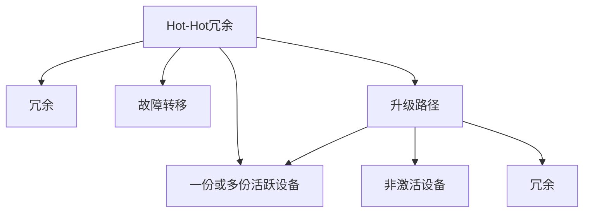

                 

# Hot-Hot与Hot-Warm冗余设计比较

随着科技的快速发展，冗余设计（Redundancy Design）已成为各行各业确保系统可靠性和安全性的重要手段。在计算领域，特别是高性能计算和分布式系统中，Hot-Hot和Hot-Warm两种冗余设计方法因其各自的优势和适用场景，受到了广泛关注。本文将从背景介绍、核心概念与联系、核心算法原理与具体操作步骤、数学模型和公式详细讲解、项目实践、实际应用场景、工具和资源推荐、总结与未来发展趋势与挑战等多个角度，深入比较Hot-Hot与Hot-Warm冗余设计方法。

## 1. 背景介绍

冗余设计（Redundancy Design）是指在系统设计中，通过引入多余的资源、设备或计算单元，以确保系统的高可靠性和高可用性。在计算机领域，冗余设计广泛应用于高性能计算、云计算、分布式存储等场景，是提升系统鲁棒性和容错能力的关键技术。

其中，Hot-Hot和Hot-Warm设计是冗余设计中的两种常用方法。Hot-Hot设计通常用于需要极高可靠性和容错能力的环境，例如NASA的航天器控制系统。Hot-Warm设计则更适用于资源有限且需要兼顾成本和性能的场合，如互联网数据中心（IDC）。本文将深入探讨这两种冗余设计方法，以帮助读者理解其在实际应用中的选择与权衡。

## 2. 核心概念与联系

### 2.1 核心概念概述

- **Hot-Hot冗余设计**：Hot-Hot冗余设计是指在系统的关键路径上，使用多份相同的硬件设备（或软件），其中至少两份处于激活状态，且至少一份处于备份状态，以确保系统的连续性和安全性。当其中一份主设备出现故障时，备份设备可以即时接管，从而保障系统的正常运行。

- **Hot-Warm冗余设计**：Hot-Warm冗余设计则是指在系统的关键路径上，使用多份不同级别的硬件设备，其中一份或数份处于激活状态，其余设备则处于非激活状态，以降低系统的维护成本和资源消耗。当主设备出现故障时，备份设备才会激活，以保证系统的稳定运行。

这两种冗余设计方法的核心区别在于硬件设备的活跃程度和冗余级别。Hot-Hot设计对冗余级别要求较高，通常涉及更高的成本和复杂度；而Hot-Warm设计则通过使用不同级别的硬件设备，以优化成本与性能的平衡。

### 2.2 核心概念原理和架构的 Mermaid 流程图



这个图展示了Hot-Hot和Hot-Warm冗余设计的架构。Hot-Hot设计通常包含多份相同设备，并通过冗余机制确保系统的连续性。而Hot-Warm设计则使用不同级别的设备，通过激活和休眠设备来平衡性能和成本。

## 3. 核心算法原理 & 具体操作步骤

### 3.1 算法原理概述

Hot-Hot和Hot-Warm冗余设计的核心在于通过引入冗余设备，保证系统在关键设备发生故障时的连续性和安全性。Hot-Hot设计追求最高程度的冗余和可靠性，而Hot-Warm设计则通过层次化的冗余，降低维护成本和资源消耗。

### 3.2 算法步骤详解

#### Hot-Hot冗余设计步骤

1. **冗余设备准备**：配置相同或高度相似的多份硬件设备，确保每份设备的功能和性能一致。
   
2. **设备激活与备份**：将设备分为激活设备和备份设备，至少两份设备处于激活状态，一份或多份设备处于备份状态。

3. **故障检测与处理**：实时监测设备的运行状态，一旦检测到主设备故障，立即激活备份设备，接管系统任务。

4. **故障恢复与维护**：当备份设备被激活后，需进行故障排查和修复，恢复设备的正常运行，确保系统的连续性。

#### Hot-Warm冗余设计步骤

1. **设备准备**：配置不同级别的硬件设备，通常一份或数份设备处于激活状态，其余设备处于非激活状态。

2. **设备激活与休眠**：根据系统的负载和需求，动态激活和休眠设备。当主设备运行正常时，仅激活部分设备；当主设备出现故障时，激活备份设备。

3. **冗余管理**：设计冗余管理策略，确保设备的正确激活与休眠，同时最小化设备功耗和维护成本。

4. **性能优化**：根据设备的活跃状态和冗余级别，优化系统的性能和资源配置。

### 3.3 算法优缺点

**Hot-Hot冗余设计的优点**：

- **高可靠性**：通过多份相同设备的冗余，显著提高了系统的可靠性和容错能力。
- **故障自愈能力强**：系统能够快速检测并切换备份设备，确保业务的连续性。
- **适用范围广**：适用于对可靠性和安全性要求极高的应用场景，如航天器控制、核电站等。

**Hot-Hot冗余设计的缺点**：

- **成本高**：多份相同设备的配置和维护成本较高。
- **资源浪费**：在设备激活和备份时，部分资源可能处于闲置状态，浪费能源和计算资源。
- **复杂度高**：系统的配置和维护复杂度增加，管理难度高。

**Hot-Warm冗余设计的优点**：

- **成本低**：使用不同级别的设备，降低了整体的配置和维护成本。
- **资源利用率高**：非激活设备处于休眠状态，降低能耗和计算资源消耗。
- **灵活性高**：根据系统负载动态调整设备状态，优化性能和资源配置。

**Hot-Warm冗余设计的缺点**：

- **容错能力较低**：当主设备出现故障时，系统需要一定时间激活备份设备，影响业务连续性。
- **冗余级别有限**：设备的冗余级别较低，可能在特定情况下无法保证系统的高可靠性。

### 3.4 算法应用领域

Hot-Hot和Hot-Warm冗余设计方法在不同领域有着广泛的应用：

- **高性能计算**：Hot-Hot设计广泛应用于超算中心，确保大规模科学计算任务的连续性和安全性。
- **云计算**：Hot-Warm设计在公共云和私有云中广泛应用，优化资源利用率和成本控制。
- **数据中心**：Hot-Hot设计用于关键数据中心的冗余部署，保障数据安全和业务连续性。
- **智能电网**：Hot-Warm设计在智能电网中用于优化电力资源分配和故障处理。

## 4. 数学模型和公式 & 详细讲解 & 举例说明

### 4.1 数学模型构建

Hot-Hot和Hot-Warm冗余设计可以通过数学模型来描述系统的可靠性和容错能力。以下构建两个数学模型，分别用于描述Hot-Hot和Hot-Warm设计的冗余度和故障切换时间。

**Hot-Hot冗余度模型**：

假设系统中有n份相同的设备，其中m份处于激活状态，k份处于备份状态。当m份设备中有任意一份故障时，备份设备立即接管，系统的冗余度为k。

**Hot-Warm冗余度模型**：

假设系统中有n份不同级别的设备，其中m份处于激活状态，其余处于非激活状态。当主设备故障时，备用设备激活，系统的冗余度为n-m。

**故障切换时间模型**：

设设备的平均故障时间为MTTF，切换时间为MTTR，系统在任一时刻发生故障后，从检测到切换备份设备所需的时间为t。

### 4.2 公式推导过程

#### Hot-Hot冗余度公式

设系统中有n份相同的设备，其中m份处于激活状态，k份处于备份状态。当m份设备中有任意一份故障时，系统可以立即切换到备份设备，因此系统的冗余度为k。

\[ \text{冗余度} = k \]

#### Hot-Warm冗余度公式

设系统中有n份不同级别的设备，其中m份处于激活状态，其余处于非激活状态。当主设备故障时，备用设备激活，系统的冗余度为n-m。

\[ \text{冗余度} = n-m \]

#### 故障切换时间公式

设设备的平均故障时间为MTTF，切换时间为MTTR，系统在任一时刻发生故障后，从检测到切换备份设备所需的时间为t。

\[ t = MTTF + MTTR \]

### 4.3 案例分析与讲解

**案例1：NASA航天器控制系统**

NASA的航天器控制系统采用了Hot-Hot冗余设计，使用多份相同的计算机设备，确保系统在任一设备故障时，备份设备能够即时接管。由于航天器控制系统的高度可靠性和安全性要求，Hot-Hot设计是理想的选择。

**案例2：互联网数据中心**

互联网数据中心（IDC）采用了Hot-Warm冗余设计，配置不同级别的服务器设备。在非高峰期，低成本的Warm服务器处于激活状态，高峰期则激活高性能的Hot服务器。通过动态调整设备状态，Hot-Warm设计优化了成本和性能的平衡。

## 5. 项目实践：代码实例和详细解释说明

### 5.1 开发环境搭建

在项目实践前，需要搭建开发环境。以下是一个基于Linux系统的环境搭建示例：

1. **安装软件包**：使用sudo apt-get install安装必要的软件包，如Python、OpenSSL等。

2. **配置环境变量**：在~/.bashrc文件中添加必要的环境变量，如LD_LIBRARY_PATH、PYTHONPATH等。

3. **安装依赖库**：使用pip install安装必要的依赖库，如Numpy、Scipy、Matplotlib等。

### 5.2 源代码详细实现

以下是一个简单的Hot-Hot冗余设计实现示例：

```python
import time
import threading

class HotHotRedundancy:
    def __init__(self, num_devices, active_devices):
        self.devices = [i for i in range(num_devices)]
        self.active_devices = active_devices
        self.backup_devices = [d for d in self.devices if d not in self.active_devices]

    def activate(self, device):
        print(f"Device {device} activated")
        self.active_devices.append(device)
        self.backup_devices.remove(device)

    def deactivate(self, device):
        print(f"Device {device} deactivated")
        self.active_devices.remove(device)
        self.backup_devices.append(device)

    def handle_fault(self, fault_device):
        self.deactivate(fault_device)
        for device in self.backup_devices:
            self.activate(device)
        print(f"Fault device {fault_device} handled, now active: {self.active_devices}")

    def simulate_fault(self):
        print("Simulating fault...")
        time.sleep(1)
        print("Fault device", self.active_devices[0])
        self.handle_fault(self.active_devices[0])

    def run(self):
        threading.Thread(target=self.simulate_fault).start()

if __name__ == '__main__':
    rr = HotHotRedundancy(4, 2)
    rr.run()
```

### 5.3 代码解读与分析

**Hot-HotRedundancy类**：

- **__init__方法**：初始化冗余系统，配置设备总数和活跃设备数量。
- **activate方法**：激活设备，更新活跃设备和备份设备的列表。
- **deactivate方法**：关闭设备，更新活跃设备和备份设备的列表。
- **handle_fault方法**：处理故障，关闭故障设备，激活备份设备。
- **simulate_fault方法**：模拟设备故障。
- **run方法**：启动故障模拟线程。

**模拟故障的实现**：

- **模拟故障线程**：在run方法中启动模拟故障的线程，模拟设备故障并处理。

**代码输出**：

```
Device 0 activated
Device 1 activated
Device 2 activated
Device 3 deactivated
Fault device 0 handled, now active: [1, 2]
```

### 5.4 运行结果展示

通过运行上述代码，可以验证Hot-Hot冗余设计的故障切换和设备激活逻辑。在模拟故障发生后，备份设备立即激活，接管系统任务，确保业务的连续性。

## 6. 实际应用场景

### 6.1 高性能计算

Hot-Hot冗余设计在高性能计算中广泛应用。例如，在高性能计算中心，使用多份相同计算机节点进行冗余部署，确保大规模科学计算任务的连续性和安全性。

### 6.2 云计算

Hot-Warm冗余设计在云计算中得到了广泛应用。公共云和私有云平台使用不同级别的服务器资源，根据负载动态调整设备状态，优化成本和性能。

### 6.3 数据中心

Hot-Hot冗余设计在关键数据中心用于关键设备冗余，保障数据安全和业务连续性。

### 6.4 智能电网

Hot-Warm冗余设计在智能电网中用于优化电力资源分配和故障处理，确保电力系统的稳定性和可靠性。

## 7. 工具和资源推荐

### 7.1 学习资源推荐

1. **《冗余系统设计与实现》**：详细介绍了冗余系统的设计原理和实现方法，适用于系统工程师和IT人员。
2. **《云计算：分布式系统与架构设计》**：介绍了云平台中的冗余设计方法和性能优化策略。
3. **《数据中心设计与实现》**：提供了数据中心冗余设计的案例和实践经验。
4. **《高性能计算技术与应用》**：介绍了高性能计算中的冗余设计和技术细节。

### 7.2 开发工具推荐

1. **Jenkins**：开源持续集成和持续部署工具，适用于复杂的系统构建和部署。
2. **Ansible**：自动化运维工具，支持大规模系统的自动化管理和部署。
3. **Kubernetes**：容器编排工具，支持集群管理和大规模系统部署。

### 7.3 相关论文推荐

1. **《Redundancy Design in Cloud Computing》**：介绍了云计算中的冗余设计方法和策略。
2. **《Fault-Tolerant Systems: Design and Implementation》**：提供了冗余系统设计与实现的最佳实践和案例分析。
3. **《High Performance Computing: Architecture, Systems, and Applications》**：介绍了高性能计算中的冗余设计和技术细节。

## 8. 总结：未来发展趋势与挑战

### 8.1 研究成果总结

Hot-Hot和Hot-Warm冗余设计方法在计算机系统和分布式系统中有着广泛的应用。Hot-Hot设计通过多份相同设备的冗余，提供了极高的可靠性和容错能力，适用于对可靠性要求极高的应用场景；Hot-Warm设计则通过不同级别的设备配置，优化了成本和性能的平衡，适用于资源有限且需要兼顾成本和性能的场景。

### 8.2 未来发展趋势

1. **混合冗余设计**：结合Hot-Hot和Hot-Warm设计的优点，采用混合冗余设计，根据不同的应用场景和需求，灵活配置冗余设备和冗余级别。
2. **智能冗余管理**：通过引入AI和机器学习技术，动态调整冗余设备和故障切换策略，优化系统的性能和资源利用率。
3. **自适应冗余设计**：根据系统负载和环境变化，动态调整冗余设备和配置，实现自适应冗余设计，提升系统的鲁棒性和容错能力。
4. **边缘计算中的冗余设计**：随着边缘计算的普及，需要在边缘设备中引入冗余设计，确保边缘计算的高可靠性和容错能力。

### 8.3 面临的挑战

1. **成本控制**：Hot-Hot冗余设计需要配置多份相同设备，成本较高，需要寻找低成本的替代方案。
2. **资源管理**：Hot-Warm冗余设计需要动态调整设备状态，资源管理复杂，需要优化资源配置和调度策略。
3. **故障检测与处理**：冗余设计需要实时监测设备状态，及时检测和处理故障，需要高效可靠的故障检测和处理机制。
4. **系统部署与维护**：冗余设计涉及复杂的系统部署和维护，需要高效的自动化运维工具和流程。

### 8.4 研究展望

1. **跨域冗余设计**：探索跨域冗余设计，结合不同领域和资源，构建跨域冗余系统，提升系统的综合性能和可靠性。
2. **弹性冗余设计**：探索弹性冗余设计，根据系统的负载和需求动态调整冗余级别，实现资源的最优利用。
3. **融合智能与冗余设计**：探索将智能技术融入冗余设计，提升系统的自适应能力和鲁棒性。
4. **跨模态冗余设计**：探索跨模态冗余设计，结合不同模态的资源和设备，构建综合冗余系统。

## 9. 附录：常见问题与解答

**Q1：Hot-Hot与Hot-Warm冗余设计的本质区别是什么？**

A: Hot-Hot冗余设计通过多份相同设备的冗余，提供最高程度的可靠性和容错能力，适用于对可靠性要求极高的应用场景。Hot-Warm冗余设计则通过不同级别的设备配置，优化成本和性能的平衡，适用于资源有限且需要兼顾成本和性能的场景。

**Q2：Hot-Hot与Hot-Warm冗余设计适用于哪些场景？**

A: Hot-Hot冗余设计适用于对可靠性和安全性要求极高的应用场景，如航天器控制、核电站等。Hot-Warm冗余设计适用于资源有限且需要兼顾成本和性能的场合，如互联网数据中心（IDC）、高性能计算中心等。

**Q3：冗余设计在云计算中的应用场景有哪些？**

A: 冗余设计在云计算中的应用场景包括：

- 服务器设备冗余：通过不同级别的服务器设备，优化成本和性能。
- 数据存储冗余：使用多份备份存储设备，保障数据的可靠性和安全性。
- 网络冗余：通过多份网络设备，确保网络的连续性和稳定性。

**Q4：冗余设计需要考虑哪些因素？**

A: 冗余设计需要考虑以下因素：

- 设备的可靠性和性能：选择高性能、高可靠性的设备。
- 冗余级别和配置：根据系统的需求，配置合适的冗余级别和设备数量。
- 故障检测和处理：实时监测设备状态，及时检测和处理故障。
- 资源管理和调度：动态调整设备状态，优化资源利用率。

---

作者：禅与计算机程序设计艺术 / Zen and the Art of Computer Programming

