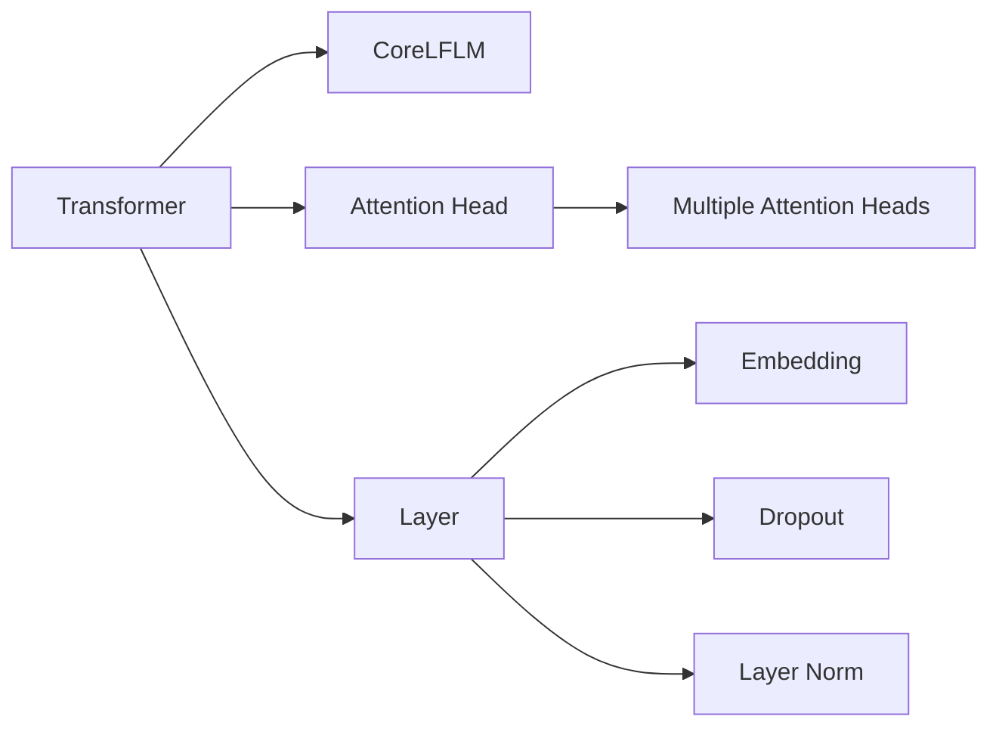

                 

# Hugging Face Transformers 库

> 关键词：Transformer, 自然语言处理(NLP), 预训练语言模型, 微调, 深度学习框架, 社区支持, 代码生成, 代码生成

## 1. 背景介绍

### 1.1 问题由来
随着深度学习技术的发展，自然语言处理（NLP）领域涌现出大量的预训练语言模型。其中，Google的BERT、OpenAI的GPT系列等模型在多项NLP任务上取得了突破性进展。这些预训练模型通常需要海量无标签数据进行预训练，学习语言的基础表示，并通过微调来适应特定任务。

然而，构建和维护大规模预训练模型的过程中，涉及到大量工程和计算资源，且这些模型需要针对不同任务进行微调，使得开发成本高昂且灵活性不足。为了解决这些问题，Hugging Face推出了一个开源的深度学习框架：Transformers。

### 1.2 问题核心关键点
Transformers是一个用于构建、训练和部署预训练语言模型的开源深度学习框架，旨在降低NLP研究的进入门槛，提升模型的灵活性和泛化能力。其核心特点包括：

- 丰富的预训练模型库：包含BERT、GPT、XLNet等主流模型，预训练权重在Github上免费公开下载。
- 易于使用的API接口：Python接口简洁，支持动态图和静态图，方便开发者进行模型构建和调试。
- 高度模块化设计：底层模型和上下文无关文法(CoreLFLM)分离，便于模型集成和灵活配置。
- 完善的社区生态：丰富的文档和教程，活跃的开发者社区，支持多种机器学习库集成。

Transformers库的这些特点使得开发者可以更快速地构建和优化预训练语言模型，推动了NLP技术在各个领域的应用。

## 2. 核心概念与联系

### 2.1 核心概念概述

为更好地理解Transformers库的核心概念和架构，本节将介绍几个关键组件及其相互关系：

- **Transformer**：Transformer模型是一种基于自注意力机制的深度学习模型，主要用于处理序列数据。其核心思想是通过自注意力机制对序列中的每个元素与其他元素的关系进行建模，从而学习到更丰富的语义表示。

- **CoreLFLM**：CoreLFLM是Transformer模型的上下文无关文法，用于描述模型组件及其相互作用。Transformer库的模型组件如BERT、GPT等，均基于CoreLFLM设计，遵循相同的接口规范。

- **Attention Head**：Attention Head是Transformer模型的核心组件之一，用于计算注意力权重。通过多头注意力机制，模型可以并行计算多个注意力向量，提高模型的表达能力和泛化能力。

- **Layer**：Layer是Transformer模型中的基本计算单元，包含多个Attention Head和全连接层。多个Layer堆叠形成Transformer模型，能够处理不同长度的输入序列。

- **Embedding**：Embedding层将输入序列转换为高维向量表示，使得模型能够捕捉序列中的局部特征。

- **Dropout**：Dropout是一种正则化技术，通过在训练过程中随机丢弃部分神经元，防止模型过拟合。

- **Layer Norm**：Layer Norm是一种归一化技术，通过将Layer中的输入向量归一化，加速模型收敛，提高模型稳定性。

### 2.2 核心概念原理和架构的 Mermaid 流程图



## 3. 核心算法原理 & 具体操作步骤

### 3.1 算法原理概述

Transformers库的核心算法原理基于Transformer模型，其主要用于处理序列数据，如文本、音频、图像等。Transformer模型通过自注意力机制对序列中的每个元素与其他元素的关系进行建模，从而学习到更丰富的语义表示。

具体来说，Transformer模型由多个Layer组成，每个Layer包含多个Attention Head，Attention Head用于计算注意力权重，将输入序列转换为更高级别的表示。Transformer模型还采用残差连接和Layer Norm等技术，加速模型收敛，提高模型稳定性。

### 3.2 算法步骤详解

以下是使用Transformers库进行Transformer模型微调的一般步骤：

1. **环境准备**：安装Transformers库和相关依赖。

```bash
pip install transformers
```

2. **数据预处理**：将原始数据转换为模型所需的格式，并进行归一化、截断、padding等预处理。

```python
from transformers import BertTokenizer
tokenizer = BertTokenizer.from_pretrained('bert-base-uncased')

def tokenize(text):
    tokens = tokenizer.tokenize(text)
    return tokenizer.convert_tokens_to_ids(tokens)
```

3. **模型加载与微调**：

```python
from transformers import BertForSequenceClassification
model = BertForSequenceClassification.from_pretrained('bert-base-uncased', num_labels=num_labels)
```

4. **训练**：定义损失函数和优化器，并进行训练。

```python
from transformers import AdamW
from torch.nn import CrossEntropyLoss

loss_fn = CrossEntropyLoss()
optimizer = AdamW(model.parameters(), lr=learning_rate)

for epoch in range(num_epochs):
    for batch in train_loader:
        inputs, labels = batch
        outputs = model(inputs)
        loss = loss_fn(outputs, labels)
        optimizer.zero_grad()
        loss.backward()
        optimizer.step()
```

5. **评估与部署**：在验证集上评估模型性能，并将模型部署到实际应用中。

```python
evaluation_model(model, val_loader)
model.save_pretrained('output_directory')
```

### 3.3 算法优缺点

Transformer模型的优点包括：

- 可以并行计算多个注意力向量，提高模型的表达能力和泛化能力。
- 残差连接和Layer Norm技术加速模型收敛，提高模型稳定性。
- 支持动态图和静态图，方便模型调试和优化。
- 丰富的预训练模型库，便于快速构建高性能模型。

但Transformer模型也存在以下缺点：

- 计算复杂度高，需要大量的计算资源。
- 模型训练时间长，对于大规模数据集可能耗时较长。
- 对于长序列数据，模型容易忽略局部信息。

### 3.4 算法应用领域

Transformer模型在多个领域得到了广泛应用，包括：

- **文本分类**：用于情感分析、主题分类等任务，通过微调适应具体任务。
- **机器翻译**：用于将源语言文本翻译成目标语言。
- **问答系统**：用于回答自然语言问题，通过微调学习匹配答案。
- **文本摘要**：用于将长文本压缩成简短摘要，通过微调学习抓取要点。
- **对话系统**：用于与人自然对话，通过微调学习回复生成。

Transformers库在以上应用场景中提供了丰富的预训练模型和微调工具，极大地降低了开发门槛，提升了模型性能。

## 4. 数学模型和公式 & 详细讲解 & 举例说明

### 4.1 数学模型构建

Transformer模型的数学模型由多个部分组成，主要包括自注意力机制、多头注意力机制、残差连接和Layer Norm等。以下以BERT模型为例，详细介绍其数学模型构建过程。

### 4.2 公式推导过程

Transformer模型的核心公式包括自注意力公式、多头注意力公式、残差连接和Layer Norm公式。以下以自注意力机制为例，推导其数学公式：

设输入序列为 $X = [x_1, x_2, ..., x_n]$，输出序列为 $Y = [y_1, y_2, ..., y_n]$，则自注意力机制的公式为：

$$
y_i = \sum_{j=1}^n \alpha_{ij} x_j
$$

其中 $\alpha_{ij}$ 为注意力权重，计算公式为：

$$
\alpha_{ij} = \frac{e^{z_{ij}}}{\sum_{k=1}^n e^{z_{ik}}}
$$

$z_{ij}$ 为注意力权重计算的分数项，计算公式为：

$$
z_{ij} = \text{head}_i Q_j K_j
$$

其中 $Q_j$ 和 $K_j$ 分别为查询和键的向量，计算公式为：

$$
Q_j = W_Q x_j
$$

$$
K_j = W_K x_j
$$

$W_Q$ 和 $W_K$ 分别为查询和键的权重矩阵，需要预先学习。

### 4.3 案例分析与讲解

以BERT模型为例，其自注意力机制的计算过程可以表示为：

1. 将输入序列 $X$ 转换为查询向量 $Q$ 和键向量 $K$，通过线性变换得到。

$$
Q = X W_Q
$$

$$
K = X W_K
$$

2. 计算注意力权重 $\alpha$，通过softmax函数计算。

$$
\alpha = \text{softmax}(Q K^T)
$$

3. 计算注意力向量 $Y$，通过乘法计算。

$$
Y = \alpha X
$$

4. 通过多个自注意力层堆叠，得到最终输出。

## 5. 项目实践：代码实例和详细解释说明

### 5.1 开发环境搭建

为了使用Transformers库进行模型构建和微调，需要先搭建好Python开发环境。以下是一个简单的搭建流程：

1. 安装Anaconda：从官网下载并安装Anaconda，用于创建独立的Python环境。

2. 创建并激活虚拟环境：

```bash
conda create -n transformers-env python=3.8
conda activate transformers-env
```

3. 安装相关依赖：

```bash
pip install transformers torch torchvision transformers-nlp
```

4. 安装其他库：

```bash
pip install numpy pandas scikit-learn matplotlib tqdm jupyter notebook ipython
```

5. 配置GPU：

```bash
CUDA_VISIBLE_DEVICES=0 python setup.py develop
```

### 5.2 源代码详细实现

以下是一个简单的BERT模型微调的代码实现：

```python
from transformers import BertTokenizer, BertForSequenceClassification, AdamW, CrossEntropyLoss
from torch.utils.data import DataLoader
import torch

# 初始化模型和优化器
model = BertForSequenceClassification.from_pretrained('bert-base-uncased', num_labels=num_labels)
optimizer = AdamW(model.parameters(), lr=learning_rate)

# 加载数据集
train_dataset = ...
val_dataset = ...

# 创建数据加载器
train_loader = DataLoader(train_dataset, batch_size=batch_size, shuffle=True)
val_loader = DataLoader(val_dataset, batch_size=batch_size, shuffle=False)

# 定义损失函数
loss_fn = CrossEntropyLoss()

# 训练模型
for epoch in range(num_epochs):
    for batch in train_loader:
        inputs, labels = batch
        outputs = model(inputs)
        loss = loss_fn(outputs, labels)
        optimizer.zero_grad()
        loss.backward()
        optimizer.step()

    # 在验证集上评估模型
    evaluation_model(model, val_loader)
```

### 5.3 代码解读与分析

**tokenizer**：

```python
from transformers import BertTokenizer
tokenizer = BertTokenizer.from_pretrained('bert-base-uncased')
```

- **BertTokenizer**：用于将输入文本转换为模型所需的格式，支持多种语言和文本预处理。
- **from_pretrained**：从Hugging Face预训练模型库中加载预训练的tokenizer。

**模型加载与微调**：

```python
from transformers import BertForSequenceClassification
model = BertForSequenceClassification.from_pretrained('bert-base-uncased', num_labels=num_labels)
```

- **BertForSequenceClassification**：用于构建文本分类任务模型。
- **from_pretrained**：加载预训练的BERT模型。
- **num_labels**：指定模型的输出类别数。

**训练**：

```python
loss_fn = CrossEntropyLoss()
optimizer = AdamW(model.parameters(), lr=learning_rate)
```

- **CrossEntropyLoss**：用于计算模型输出和标签之间的交叉熵损失。
- **AdamW**：优化器，用于更新模型参数。
- **learning_rate**：学习率。

**评估与部署**：

```python
evaluation_model(model, val_loader)
model.save_pretrained('output_directory')
```

- **evaluation_model**：在验证集上评估模型性能。
- **save_pretrained**：将模型保存到指定目录。

## 6. 实际应用场景

### 6.1 智能客服系统

智能客服系统是Transformers库在NLP领域的重要应用之一。通过微调，可以在大规模预训练模型基础上，快速构建智能客服系统，提升客户咨询体验和问题解决效率。

具体而言，可以收集企业内部的历史客服对话记录，将问题和最佳答复构建成监督数据，在此基础上对预训练对话模型进行微调。微调后的对话模型能够自动理解用户意图，匹配最合适的答案模板进行回复。对于客户提出的新问题，还可以接入检索系统实时搜索相关内容，动态组织生成回答。如此构建的智能客服系统，能大幅提升客户咨询体验和问题解决效率。

### 6.2 金融舆情监测

金融舆情监测是Transformers库在金融领域的重要应用之一。通过微调，可以在大规模预训练模型基础上，快速构建金融舆情监测系统，实时监测市场舆论动向，规避金融风险。

具体而言，可以收集金融领域相关的新闻、报道、评论等文本数据，并对其进行主题标注和情感标注。在此基础上对预训练语言模型进行微调，使其能够自动判断文本属于何种主题，情感倾向是正面、中性还是负面。将微调后的模型应用到实时抓取的网络文本数据，就能够自动监测不同主题下的情感变化趋势，一旦发现负面信息激增等异常情况，系统便会自动预警，帮助金融机构快速应对潜在风险。

### 6.3 个性化推荐系统

个性化推荐系统是Transformers库在电商领域的重要应用之一。通过微调，可以在大规模预训练模型基础上，快速构建个性化推荐系统，提升推荐精度和用户体验。

具体而言，可以收集用户浏览、点击、评论、分享等行为数据，提取和用户交互的物品标题、描述、标签等文本内容。将文本内容作为模型输入，用户的后续行为（如是否点击、购买等）作为监督信号，在此基础上微调预训练语言模型。微调后的模型能够从文本内容中准确把握用户的兴趣点。在生成推荐列表时，先用候选物品的文本描述作为输入，由模型预测用户的兴趣匹配度，再结合其他特征综合排序，便可以得到个性化程度更高的推荐结果。

### 6.4 未来应用展望

随着Transformers库和微调方法的不断发展，基于微调范式将在更多领域得到应用，为传统行业带来变革性影响。

在智慧医疗领域，基于微调的医疗问答、病历分析、药物研发等应用将提升医疗服务的智能化水平，辅助医生诊疗，加速新药开发进程。

在智能教育领域，微调技术可应用于作业批改、学情分析、知识推荐等方面，因材施教，促进教育公平，提高教学质量。

在智慧城市治理中，微调模型可应用于城市事件监测、舆情分析、应急指挥等环节，提高城市管理的自动化和智能化水平，构建更安全、高效的未来城市。

此外，在企业生产、社会治理、文娱传媒等众多领域，基于Transformers库的微调技术也将不断涌现，为经济社会发展注入新的动力。

## 7. 工具和资源推荐

### 7.1 学习资源推荐

为了帮助开发者系统掌握Transformers库的理论基础和实践技巧，这里推荐一些优质的学习资源：

1. 《Transformers from Scratch》系列博文：由Hugging Face工程师撰写，详细介绍了Transformer模型的原理和应用。

2. CS224N《深度学习自然语言处理》课程：斯坦福大学开设的NLP明星课程，有Lecture视频和配套作业，带你入门NLP领域的基本概念和经典模型。

3. 《Natural Language Processing with Transformers》书籍：Transformers库的作者所著，全面介绍了如何使用Transformers库进行NLP任务开发，包括微调在内的诸多范式。

4. Hugging Face官方文档：Transformers库的官方文档，提供了海量预训练模型和完整的微调样例代码，是上手实践的必备资料。

5. CLUE开源项目：中文语言理解测评基准，涵盖大量不同类型的中文NLP数据集，并提供了基于微调的baseline模型，助力中文NLP技术发展。

通过对这些资源的学习实践，相信你一定能够快速掌握Transformers库的精髓，并用于解决实际的NLP问题。

### 7.2 开发工具推荐

高效的开发离不开优秀的工具支持。以下是几款用于Transformers库开发的常用工具：

1. PyTorch：基于Python的开源深度学习框架，灵活动态的计算图，适合快速迭代研究。大部分预训练语言模型都有PyTorch版本的实现。

2. TensorFlow：由Google主导开发的开源深度学习框架，生产部署方便，适合大规模工程应用。同样有丰富的预训练语言模型资源。

3. Hugging Face官方库：提供了丰富的预训练模型和微调工具，适合快速构建高性能模型。

4. Weights & Biases：模型训练的实验跟踪工具，可以记录和可视化模型训练过程中的各项指标，方便对比和调优。与主流深度学习框架无缝集成。

5. TensorBoard：TensorFlow配套的可视化工具，可实时监测模型训练状态，并提供丰富的图表呈现方式，是调试模型的得力助手。

6. Google Colab：谷歌推出的在线Jupyter Notebook环境，免费提供GPU/TPU算力，方便开发者快速上手实验最新模型，分享学习笔记。

合理利用这些工具，可以显著提升Transformers库的开发效率，加快创新迭代的步伐。

### 7.3 相关论文推荐

Transformers库和微调技术的发展源于学界的持续研究。以下是几篇奠基性的相关论文，推荐阅读：

1. Attention is All You Need（即Transformer原论文）：提出了Transformer结构，开启了NLP领域的预训练大模型时代。

2. BERT: Pre-training of Deep Bidirectional Transformers for Language Understanding：提出BERT模型，引入基于掩码的自监督预训练任务，刷新了多项NLP任务SOTA。

3. Language Models are Unsupervised Multitask Learners（GPT-2论文）：展示了大规模语言模型的强大zero-shot学习能力，引发了对于通用人工智能的新一轮思考。

4. Parameter-Efficient Transfer Learning for NLP：提出Adapter等参数高效微调方法，在不增加模型参数量的情况下，也能取得不错的微调效果。

5. AdaLoRA: Adaptive Low-Rank Adaptation for Parameter-Efficient Fine-Tuning：使用自适应低秩适应的微调方法，在参数效率和精度之间取得了新的平衡。

6. Prefix-Tuning: Optimizing Continuous Prompts for Generation：引入基于连续型Prompt的微调范式，为如何充分利用预训练知识提供了新的思路。

这些论文代表了大语言模型微调技术的发展脉络。通过学习这些前沿成果，可以帮助研究者把握学科前进方向，激发更多的创新灵感。

## 8. 总结：未来发展趋势与挑战

### 8.1 总结

本文对Transformers库进行了全面系统的介绍。首先阐述了Transformers库的背景和核心概念，明确了微调在构建高性能模型方面的独特价值。其次，从原理到实践，详细讲解了微调的数学原理和关键步骤，给出了微调任务开发的完整代码实例。同时，本文还广泛探讨了微调方法在多个领域的应用前景，展示了微调范式的巨大潜力。

通过本文的系统梳理，可以看到，Transformers库为NLP领域的研究和应用提供了强大的工具和平台，极大地降低了开发门槛，提升了模型性能。未来，随着Transformers库和微调方法的不断演进，基于微调范式将在更多领域得到应用，为传统行业带来变革性影响。

### 8.2 未来发展趋势

展望未来，Transformers库和微调技术将呈现以下几个发展趋势：

1. 模型规模持续增大。随着算力成本的下降和数据规模的扩张，预训练语言模型的参数量还将持续增长。超大规模语言模型蕴含的丰富语言知识，有望支撑更加复杂多变的下游任务微调。

2. 微调方法日趋多样。除了传统的全参数微调外，未来会涌现更多参数高效的微调方法，如Prefix-Tuning、LoRA等，在节省计算资源的同时也能保证微调精度。

3. 持续学习成为常态。随着数据分布的不断变化，微调模型也需要持续学习新知识以保持性能。如何在不遗忘原有知识的同时，高效吸收新样本信息，将成为重要的研究课题。

4. 标注样本需求降低。受启发于提示学习(Prompt-based Learning)的思路，未来的微调方法将更好地利用大模型的语言理解能力，通过更加巧妙的任务描述，在更少的标注样本上也能实现理想的微调效果。

5. 多模态微调崛起。当前的微调主要聚焦于纯文本数据，未来会进一步拓展到图像、视频、语音等多模态数据微调。多模态信息的融合，将显著提升语言模型对现实世界的理解和建模能力。

6. 模型通用性增强。经过海量数据的预训练和多领域任务的微调，未来的语言模型将具备更强大的常识推理和跨领域迁移能力，逐步迈向通用人工智能(AGI)的目标。

以上趋势凸显了Transformers库和微调技术的广阔前景。这些方向的探索发展，必将进一步提升NLP系统的性能和应用范围，为人类认知智能的进化带来深远影响。

### 8.3 面临的挑战

尽管Transformers库和微调技术已经取得了瞩目成就，但在迈向更加智能化、普适化应用的过程中，它仍面临着诸多挑战：

1. 标注成本瓶颈。虽然微调大大降低了标注数据的需求，但对于长尾应用场景，难以获得充足的高质量标注数据，成为制约微调性能的瓶颈。如何进一步降低微调对标注样本的依赖，将是一大难题。

2. 模型鲁棒性不足。当前微调模型面对域外数据时，泛化性能往往大打折扣。对于测试样本的微小扰动，微调模型的预测也容易发生波动。如何提高微调模型的鲁棒性，避免灾难性遗忘，还需要更多理论和实践的积累。

3. 推理效率有待提高。大规模语言模型虽然精度高，但在实际部署时往往面临推理速度慢、内存占用大等效率问题。如何在保证性能的同时，简化模型结构，提升推理速度，优化资源占用，将是重要的优化方向。

4. 可解释性亟需加强。当前微调模型更像是"黑盒"系统，难以解释其内部工作机制和决策逻辑。对于医疗、金融等高风险应用，算法的可解释性和可审计性尤为重要。如何赋予微调模型更强的可解释性，将是亟待攻克的难题。

5. 安全性有待保障。预训练语言模型难免会学习到有偏见、有害的信息，通过微调传递到下游任务，产生误导性、歧视性的输出，给实际应用带来安全隐患。如何从数据和算法层面消除模型偏见，避免恶意用途，确保输出的安全性，也将是重要的研究课题。

6. 知识整合能力不足。现有的微调模型往往局限于任务内数据，难以灵活吸收和运用更广泛的先验知识。如何让微调过程更好地与外部知识库、规则库等专家知识结合，形成更加全面、准确的信息整合能力，还有很大的想象空间。

正视Transformers库和微调面临的这些挑战，积极应对并寻求突破，将是Transformers库和微调技术走向成熟的必由之路。相信随着学界和产业界的共同努力，这些挑战终将一一被克服，Transformers库和微调技术必将在构建人机协同的智能时代中扮演越来越重要的角色。

### 8.4 未来突破

面对Transformers库和微调所面临的种种挑战，未来的研究需要在以下几个方面寻求新的突破：

1. 探索无监督和半监督微调方法。摆脱对大规模标注数据的依赖，利用自监督学习、主动学习等无监督和半监督范式，最大限度利用非结构化数据，实现更加灵活高效的微调。

2. 研究参数高效和计算高效的微调范式。开发更加参数高效的微调方法，在固定大部分预训练参数的同时，只更新极少量的任务相关参数。同时优化微调模型的计算图，减少前向传播和反向传播的资源消耗，实现更加轻量级、实时性的部署。

3. 融合因果和对比学习范式。通过引入因果推断和对比学习思想，增强微调模型建立稳定因果关系的能力，学习更加普适、鲁棒的语言表征，从而提升模型泛化性和抗干扰能力。

4. 引入更多先验知识。将符号化的先验知识，如知识图谱、逻辑规则等，与神经网络模型进行巧妙融合，引导微调过程学习更准确、合理的语言模型。同时加强不同模态数据的整合，实现视觉、语音等多模态信息与文本信息的协同建模。

5. 结合因果分析和博弈论工具。将因果分析方法引入微调模型，识别出模型决策的关键特征，增强输出解释的因果性和逻辑性。借助博弈论工具刻画人机交互过程，主动探索并规避模型的脆弱点，提高系统稳定性。

6. 纳入伦理道德约束。在模型训练目标中引入伦理导向的评估指标，过滤和惩罚有偏见、有害的输出倾向。同时加强人工干预和审核，建立模型行为的监管机制，确保输出符合人类价值观和伦理道德。

这些研究方向的探索，必将引领Transformers库和微调技术迈向更高的台阶，为构建安全、可靠、可解释、可控的智能系统铺平道路。面向未来，Transformers库和微调技术还需要与其他人工智能技术进行更深入的融合，如知识表示、因果推理、强化学习等，多路径协同发力，共同推动自然语言理解和智能交互系统的进步。只有勇于创新、敢于突破，才能不断拓展语言模型的边界，让智能技术更好地造福人类社会。

## 9. 附录：常见问题与解答

**Q1：Transformers库是否适用于所有NLP任务？**

A: Transformers库在大多数NLP任务上都能取得不错的效果，特别是对于数据量较小的任务。但对于一些特定领域的任务，如医学、法律等，仅仅依靠通用语料预训练的模型可能难以很好地适应。此时需要在特定领域语料上进一步预训练，再进行微调，才能获得理想效果。此外，对于一些需要时效性、个性化很强的任务，如对话、推荐等，微调方法也需要针对性的改进优化。

**Q2：Transformers库在微调过程中如何选择合适的学习率？**

A: Transformers库的微调过程中，学习率的初始值通常为0.0001。在微调过程中，学习率通常需要逐步降低，以避免过拟合。可以通过设置学习率调度器（如Cosine Anneling）来控制学习率的变化。同时，不同的优化器（如AdamW、Adafactor等）可能需要设置不同的学习率阈值。

**Q3：Transformers库在微调过程中如何缓解过拟合问题？**

A: Transformers库在微调过程中，可以通过以下几种方式缓解过拟合问题：

1. 数据增强：通过回译、近义替换等方式扩充训练集。

2. 正则化：使用L2正则、Dropout、Early Stopping等避免过拟合。

3. 对抗训练：引入对抗样本，提高模型鲁棒性。

4. 参数高效微调：只调整少量参数（如Adapter、Prefix等），减小过拟合风险。

5. 多模型集成：训练多个微调模型，取平均输出，抑制过拟合。

这些策略往往需要根据具体任务和数据特点进行灵活组合。只有在数据、模型、训练、推理等各环节进行全面优化，才能最大限度地发挥Transformers库的威力。

**Q4：Transformers库在实际部署时需要注意哪些问题？**

A: Transformers库在实际部署时，需要注意以下问题：

1. 模型裁剪：去除不必要的层和参数，减小模型尺寸，加快推理速度。

2. 量化加速：将浮点模型转为定点模型，压缩存储空间，提高计算效率。

3. 服务化封装：将模型封装为标准化服务接口，便于集成调用。

4. 弹性伸缩：根据请求流量动态调整资源配置，平衡服务质量和成本。

5. 监控告警：实时采集系统指标，设置异常告警阈值，确保服务稳定性。

6. 安全防护：采用访问鉴权、数据脱敏等措施，保障数据和模型安全。

Transformers库为NLP应用提供了强大的工具和平台，但将其部署到实际应用中，还需要考虑性能、安全和可靠性等因素。合理利用这些工具，可以显著提升Transformers库的开发效率，加快创新迭代的步伐。

---

作者：禅与计算机程序设计艺术 / Zen and the Art of Computer Programming

