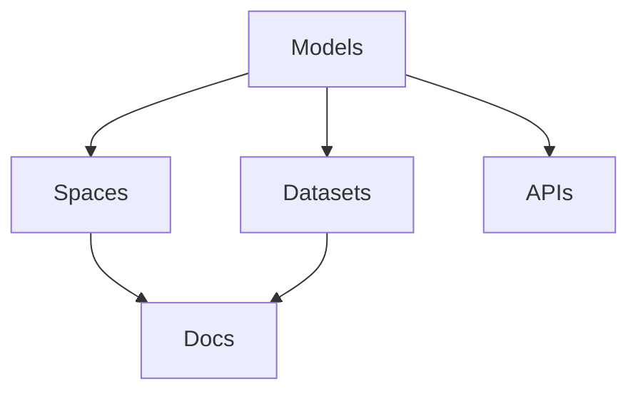

                 

# Hugging Face 开源社区：Models、Datasets、Spaces、Docs

> 关键词：Hugging Face, Models, Datasets, Spaces, Docs

## 1. 背景介绍

### 1.1 问题由来
近年来，深度学习技术的快速发展，尤其是在自然语言处理(Natural Language Processing, NLP)领域，推动了大模型和大规模预训练语言模型(Pre-trained Language Models, PLMs)的应用。然而，尽管大模型的训练和预训练带来了显著的性能提升，但模型训练和部署的复杂性也日益增加，使得许多研究和应用者难以快速获取和使用。

面对这一问题，Hugging Face开源社区应运而生，致力于提供一站式的模型、数据集、文档和工具，降低深度学习研究的门槛，促进NLP技术的快速发展和应用。Hugging Face社区由Google的CMU校友组织，以支持社区开发者为目标，通过提供高质量的模型、开源数据集和工具，使其成为NLP研究者和工程师的重要资源。

### 1.2 问题核心关键点
Hugging Face社区的核心目标是提供易于使用、性能优越且功能丰富的NLP模型和工具。通过提供预训练的模型、现成的代码和数据集，社区帮助用户快速部署和应用NLP模型，同时保证模型的学术水平和高质量。社区的成功依赖于以下几个关键点：

1. **模型多样性**：提供多种预训练语言模型，适用于不同的NLP任务，包括BERT、RoBERTa、GPT等。
2. **模型微调**：提供简单高效的微调方法，帮助用户快速适应特定任务。
3. **文档和资源**：提供详尽的文档和示例代码，方便用户快速上手。
4. **社区支持**：鼓励用户分享代码和研究成果，构建一个开放和活跃的社区。
5. **技术更新**：定期更新模型和工具，跟进最新的研究进展。

这些关键点使得Hugging Face成为NLP领域的重要平台，吸引了大量的用户和开发者，推动了NLP技术的普及和应用。

## 2. 核心概念与联系

### 2.1 核心概念概述

要深入理解Hugging Face社区的运作模式，首先需要了解几个核心概念：

- **Models**：Hugging Face提供的预训练语言模型，如BERT、GPT等，是社区的核心资源。
- **Datasets**：社区提供大量标注数据集，用于模型的训练和微调。
- **Spaces**：社区提供的代码库和文档，帮助用户快速构建应用。
- **Docs**：社区提供详尽的文档和教程，帮助用户理解和使用模型。

这些概念之间通过以下Mermaid流程图进行展示：



这个流程图展示了Hugging Face社区的主要组成部分及其相互关系：

1. **Models**作为社区的核心资源，提供预训练的语言模型。
2. **Datasets**为模型训练和微调提供了必要的数据基础。
3. **Spaces**是社区提供的代码库和文档，帮助用户快速构建应用。
4. **Docs**提供了详尽的文档和教程，帮助用户理解和使用模型。
5. **APIs**则提供了模型和工具的接口，方便用户进行调用和集成。

这些组成部分共同构成了一个完整的NLP生态系统，使用户能够快速高效地构建和部署NLP应用。

## 3. 核心算法原理 & 具体操作步骤
### 3.1 算法原理概述

Hugging Face社区提供的模型和工具主要基于Transformer架构和自监督学习。自监督学习是指在无标签数据上训练模型，通过挖掘数据中的隐含信息，学习到通用语言表示。Transformer架构则是一种用于处理序列数据的神经网络模型，其自注意力机制使其能够高效处理长序列数据，成为目前最先进的NLP模型架构之一。

Hugging Face社区提供的模型如BERT、RoBERTa等，都是在大量无标签文本数据上进行预训练的。在预训练过程中，模型通过掩码语言模型、下一句预测等任务学习到语言的统计规律和上下文关系。然后，在特定任务上进行微调，使其能够适应新的任务需求。

### 3.2 算法步骤详解

基于Hugging Face社区提供的模型和工具进行微调的步骤如下：

**Step 1: 选择预训练模型**
- 根据任务需求选择适当的预训练模型，如BERT、RoBERTa、GPT等。
- 从Hugging Face官网下载相应的模型文件，包含模型权重和配置文件。

**Step 2: 准备数据集**
- 收集并预处理数据集，确保数据集的质量和多样性。
- 使用Hugging Face提供的处理工具（如GLUE、CoLA等）处理数据，提取特征。

**Step 3: 定义任务适配层**
- 根据任务类型设计适配层，如分类、回归、生成等。
- 将适配层与预训练模型进行组合，形成完整的模型结构。

**Step 4: 设置微调超参数**
- 选择合适的优化器（如AdamW、SGD等）及其参数，如学习率、批大小、迭代轮数等。
- 设置正则化技术及强度，包括权重衰减、Dropout等。

**Step 5: 执行梯度训练**
- 将训练集数据分批次输入模型，前向传播计算损失函数。
- 反向传播计算参数梯度，根据设定的优化算法和学习率更新模型参数。
- 周期性在验证集上评估模型性能，根据性能指标决定是否触发Early Stopping。
- 重复上述步骤直至满足预设的迭代轮数或Early Stopping条件。

**Step 6: 测试和部署**
- 在测试集上评估微调后模型的性能，对比微调前后的精度提升。
- 使用微调后的模型对新样本进行推理预测，集成到实际的应用系统中。
- 持续收集新的数据，定期重新微调模型，以适应数据分布的变化。

### 3.3 算法优缺点

基于Hugging Face社区提供的模型和工具进行微调具有以下优点：

1. **简单易用**：模型和工具已经高度封装，用户只需关注任务适配和微调超参数的调优。
2. **性能优越**：预训练模型的通用性使得其在特定任务上能够取得优异的表现。
3. **社区支持**：社区提供丰富的文档和示例代码，帮助用户快速上手。
4. **资源丰富**：社区提供了多种预训练模型和大量标注数据集，用户无需从头开始构建数据集。

同时，这些方法也存在一些局限性：

1. **依赖社区**：所有依赖于社区提供的模型和工具，社区的活跃程度会影响用户体验。
2. **资源消耗大**：大模型的训练和推理对硬件资源的需求较高，用户需要配置高性能的计算设备。
3. **模型泛化能力**：预训练模型的泛化能力可能受到数据集的限制，需要在特定领域进行进一步微调。

尽管存在这些局限性，但Hugging Face社区提供的预训练模型和工具无疑大大降低了NLP应用的门槛，促进了NLP技术的普及和应用。

### 3.4 算法应用领域

基于Hugging Face社区提供的模型和工具，已经在NLP领域的多个应用场景中得到了广泛的应用，例如：

- 文本分类：如情感分析、主题分类、意图识别等。通过微调使模型学习文本-标签映射。
- 命名实体识别：识别文本中的人名、地名、机构名等特定实体。通过微调使模型掌握实体边界和类型。
- 关系抽取：从文本中抽取实体之间的语义关系。通过微调使模型学习实体-关系三元组。
- 问答系统：对自然语言问题给出答案。将问题-答案对作为微调数据，训练模型学习匹配答案。
- 机器翻译：将源语言文本翻译成目标语言。通过微调使模型学习语言-语言映射。
- 文本摘要：将长文本压缩成简短摘要。将文章-摘要对作为微调数据，使模型学习抓取要点。
- 对话系统：使机器能够与人自然对话。将多轮对话历史作为上下文，微调模型进行回复生成。

除了这些经典任务外，Hugging Face社区的模型和工具还在更多场景中得到了创新性地应用，如可控文本生成、常识推理、代码生成、数据增强等，为NLP技术带来了全新的突破。

## 4. 数学模型和公式 & 详细讲解 & 举例说明

### 4.1 数学模型构建

Hugging Face提供的预训练模型如BERT、RoBERTa等，均基于Transformer架构进行训练。以BERT模型为例，其预训练过程主要包括以下步骤：

1. 数据预处理：将文本数据转换为模型能够处理的向量形式，通常使用WordPiece分词。
2. 掩码语言模型：在输入文本中随机掩蔽部分单词，预测被掩蔽单词。
3. 下一句预测：对于两个句子，预测它们是否连续，用于学习句子间关系。

### 4.2 公式推导过程

以BERT模型的掩码语言模型任务为例，其输入为$x=(x_1, x_2, ..., x_n)$，其中$x_i$为输入文本中的一个单词。模型的目标是预测被掩蔽的单词$x_m$，即计算$P(x_m|\{x_1, x_2, ..., x_{m-1}, x_{m+1}, ..., x_n\})$。

假设BERT模型有$h$个隐藏层，$x$的编码向量为$H(x)$，则掩码语言模型的目标函数为：

$$
\mathcal{L} = -\sum_{m=1}^n \log P(x_m|\{x_1, x_2, ..., x_{m-1}, x_{m+1}, ..., x_n\})
$$

其中$P$表示概率分布函数。在训练过程中，模型通过最大化该目标函数来学习掩码语言模型。

### 4.3 案例分析与讲解

以情感分类任务为例，假设已经选择了BERT模型进行微调。首先，准备情感分类数据集，并将其分为训练集、验证集和测试集。然后，定义任务适配层，将模型的输出与标签进行比较，计算损失函数。最后，在训练集上执行梯度训练，直到模型收敛。在测试集上评估模型的性能，对比微调前后的精度提升。

以下是一个使用Hugging Face提供的`transformers`库进行情感分类的代码示例：

```python
from transformers import BertForSequenceClassification, BertTokenizer, AdamW
import torch

# 定义模型和tokenizer
model = BertForSequenceClassification.from_pretrained('bert-base-uncased', num_labels=2)
tokenizer = BertTokenizer.from_pretrained('bert-base-uncased')

# 准备数据集
train_data = load_train_data()
dev_data = load_dev_data()
test_data = load_test_data()

# 定义任务适配层
def compute_loss(model, inputs, labels):
    logits = model(**inputs).logits
    loss_fct = nn.CrossEntropyLoss()
    loss = loss_fct(logits.view(-1, logits.size(-1)), labels.view(-1))
    return loss

# 设置优化器和超参数
optimizer = AdamW(model.parameters(), lr=1e-5)
total_steps = len(train_data)
epochs = 5

# 训练模型
for epoch in range(epochs):
    for step, batch in enumerate(train_data):
        inputs = tokenizer(batch['input'], return_tensors='pt')
        labels = torch.tensor(batch['label'], dtype=torch.long)
        loss = compute_loss(model, inputs, labels)
        optimizer.zero_grad()
        loss.backward()
        optimizer.step()
        if step % 100 == 0:
            print(f"Epoch {epoch+1}, Step {step}, Loss: {loss.item()}")

# 评估模型
dev_loss = compute_loss(model, dev_data, dev_data['label'])
test_loss = compute_loss(model, test_data, test_data['label'])
print(f"Dev Loss: {dev_loss.item()}, Test Loss: {test_loss.item()}")
```

## 5. 项目实践：代码实例和详细解释说明
### 5.1 开发环境搭建

在使用Hugging Face提供的模型和工具进行NLP任务开发时，需要以下开发环境：

1. 安装Python：Python 3.6及以上版本，建议安装Anaconda或Miniconda以方便环境管理。
2. 安装PyTorch：从官网下载并安装完成后，即可进行模型训练和推理。
3. 安装`transformers`库：Hugging Face提供的NLP工具库，方便加载和微调预训练模型。
4. 安装`datasets`库：提供多种数据集处理工具，帮助用户处理和加载数据集。
5. 安装`scikit-learn`和`numpy`：用于数据预处理和模型评估。

### 5.2 源代码详细实现

以下是一个使用Hugging Face提供的BERT模型进行命名实体识别（NER）任务的代码示例：

```python
from transformers import BertForTokenClassification, BertTokenizer, AdamW
import torch
from datasets import load_dataset

# 定义模型和tokenizer
model = BertForTokenClassification.from_pretrained('bert-base-cased')
tokenizer = BertTokenizer.from_pretrained('bert-base-cased')

# 准备数据集
dataset = load_dataset('ner', split='train')
train_data = dataset['train']
dev_data = dataset['validation']
test_data = dataset['test']

# 定义任务适配层
def compute_loss(model, inputs, labels):
    logits = model(**inputs).logits
    loss_fct = nn.CrossEntropyLoss()
    loss = loss_fct(logits.view(-1, logits.size(-1)), labels.view(-1))
    return loss

# 设置优化器和超参数
optimizer = AdamW(model.parameters(), lr=1e-5)
total_steps = len(train_data)
epochs = 5

# 训练模型
for epoch in range(epochs):
    for step, batch in enumerate(train_data):
        inputs = tokenizer(batch['input'], return_tensors='pt')
        labels = torch.tensor(batch['label'], dtype=torch.long)
        loss = compute_loss(model, inputs, labels)
        optimizer.zero_grad()
        loss.backward()
        optimizer.step()
        if step % 100 == 0:
            print(f"Epoch {epoch+1}, Step {step}, Loss: {loss.item()}")

# 评估模型
dev_loss = compute_loss(model, dev_data, dev_data['label'])
test_loss = compute_loss(model, test_data, test_data['label'])
print(f"Dev Loss: {dev_loss.item()}, Test Loss: {test_loss.item()}")
```

### 5.3 代码解读与分析

在上述代码中，首先定义了预训练的BERT模型和分词器，然后加载了命名实体识别数据集。接下来，定义了任务适配层，用于计算损失函数。然后，设置了优化器和超参数，并进行模型训练。最后，在验证集和测试集上评估了模型的性能。

代码的关键点包括：

1. 使用`transformers`库加载预训练模型，方便快速构建和微调。
2. 使用`datasets`库加载数据集，提供了高效的数据处理功能。
3. 定义了任务适配层，用于计算损失函数，支持不同类型的任务。
4. 使用`AdamW`优化器进行模型训练，支持自适应学习率调整。

这些关键点使得NLP任务开发变得更加简单和高效。

### 5.4 运行结果展示

在上述代码示例中，可以通过以下方式展示训练过程中的损失值和模型性能：

```python
for epoch in range(epochs):
    for step, batch in enumerate(train_data):
        inputs = tokenizer(batch['input'], return_tensors='pt')
        labels = torch.tensor(batch['label'], dtype=torch.long)
        loss = compute_loss(model, inputs, labels)
        optimizer.zero_grad()
        loss.backward()
        optimizer.step()
        if step % 100 == 0:
            print(f"Epoch {epoch+1}, Step {step}, Loss: {loss.item()}")
```

在训练结束后，可以通过以下方式展示模型在验证集和测试集上的性能：

```python
dev_loss = compute_loss(model, dev_data, dev_data['label'])
test_loss = compute_loss(model, test_data, test_data['label'])
print(f"Dev Loss: {dev_loss.item()}, Test Loss: {test_loss.item()}")
```

## 6. 实际应用场景
### 6.1 智能客服系统

Hugging Face提供的预训练模型和大规模数据集，可以帮助构建高效的智能客服系统。智能客服系统能够自动化处理用户咨询，提升服务效率，降低人力成本。在智能客服系统中，可以使用BERT等预训练模型进行问答生成，快速响应用户问题。

### 6.2 金融舆情监测

金融舆情监测是评估市场情绪和风险的重要手段。Hugging Face提供的情感分析模型可以帮助监测市场舆情变化，及时发现潜在风险。通过微调情感分析模型，可以提升对金融新闻、社交媒体等信息的分析能力。

### 6.3 个性化推荐系统

个性化推荐系统能够根据用户的历史行为和偏好，推荐用户可能感兴趣的内容。Hugging Face提供的预训练模型和数据集，可以帮助构建高效的推荐系统，提升用户体验。

### 6.4 未来应用展望

未来，Hugging Face社区将继续扩展模型和工具的覆盖范围，提供更多样化的预训练模型和数据集，推动NLP技术的普及和应用。同时，社区也将加强对模型的优化和性能提升，提供更高效的微调方法和工具，降低用户使用门槛。此外，社区还将引入更多前沿技术和应用场景，推动NLP技术的发展和应用。

## 7. 工具和资源推荐
### 7.1 学习资源推荐

以下是一些推荐的NLP学习资源，帮助用户系统掌握NLP技术：

1. 《Natural Language Processing with Transformers》：Transformers库的作者所著，全面介绍了Transformer原理和微调方法。
2. 《Transformers: A Survey of State-of-the-Art Architectures and Applications》：综述性文章，总结了Transformer在NLP中的应用。
3. 《Sequence to Sequence Learning with Neural Networks》：深度学习领域的经典论文，介绍了序列到序列学习的原理和应用。
4. 《Attention is All You Need》：Transformer原论文，介绍了自注意力机制的原理和应用。
5. 《Bert: Pre-training of Deep Bidirectional Transformers for Language Understanding》：BERT模型原论文，介绍了BERT的预训练方法和微调技术。

### 7.2 开发工具推荐

以下是一些推荐的NLP开发工具，帮助用户快速构建和部署NLP应用：

1. PyTorch：深度学习框架，支持动态计算图和自动微分，方便模型训练和推理。
2. TensorFlow：深度学习框架，支持静态计算图和分布式训练，适合大规模工程应用。
3. transformers：NLP工具库，提供了多种预训练模型和微调方法。
4. datasets：数据集处理工具，支持多种数据集格式和预处理功能。
5. scikit-learn：机器学习库，支持多种分类、回归等任务。

### 7.3 相关论文推荐

以下是一些推荐的相关论文，帮助用户深入理解NLP技术的原理和应用：

1. Attention is All You Need（即Transformer原论文）：介绍了Transformer架构的原理和应用。
2. BERT: Pre-training of Deep Bidirectional Transformers for Language Understanding：介绍了BERT模型的预训练方法和微调技术。
3. Language Models are Unsupervised Multitask Learners：介绍了无监督学习的预训练方法和效果。
4. Transformers: State-of-the-Art Architectures and Applications：综述性文章，总结了Transformer在NLP中的应用。
5. Premier Layer-Based Transformer Architectures for Neural Machine Translation：介绍了Transformer架构在机器翻译中的应用。

## 8. 总结：未来发展趋势与挑战
### 8.1 总结

Hugging Face开源社区通过提供预训练模型、数据集、文档和工具，显著降低了NLP研究的门槛，推动了NLP技术的普及和应用。社区的成功在于其提供的模型多样性、微调方法的易用性以及丰富的文档和工具支持。

### 8.2 未来发展趋势

未来，Hugging Face社区将继续扩展模型和工具的覆盖范围，提供更多样化的预训练模型和数据集，推动NLP技术的普及和应用。同时，社区也将加强对模型的优化和性能提升，提供更高效的微调方法和工具，降低用户使用门槛。此外，社区还将引入更多前沿技术和应用场景，推动NLP技术的发展和应用。

### 8.3 面临的挑战

尽管Hugging Face社区已经取得了显著的成绩，但在迈向更加智能化、普适化应用的过程中，仍面临一些挑战：

1. **数据隐私和安全**：在处理用户数据时，需要确保数据隐私和安全，避免数据泄露和滥用。
2. **模型鲁棒性**：模型的鲁棒性可能受到数据集的影响，需要在特定领域进行进一步微调。
3. **模型可解释性**：大模型的决策过程缺乏可解释性，难以对其推理逻辑进行分析和调试。
4. **技术演进**：随着技术的不断进步，社区需要不断更新模型和工具，保持技术的领先地位。
5. **社区管理**：随着社区的不断发展，如何管理社区成员和贡献者，确保社区的活跃度和健康发展，是一个重要的挑战。

### 8.4 研究展望

未来的研究方向包括：

1. **数据隐私和安全**：引入差分隐私和联邦学习等技术，保护用户数据隐私。
2. **模型鲁棒性**：开发更加鲁棒的微调方法和工具，提升模型的泛化能力。
3. **模型可解释性**：研究模型可解释性技术，增强模型的透明性和可信度。
4. **技术演进**：关注前沿技术的研究进展，及时更新模型和工具。
5. **社区管理**：建立社区规范和治理机制，确保社区的健康发展。

这些研究方向将推动Hugging Face社区不断进步，为用户提供更加高效、可靠、安全的NLP技术和服务。

## 9. 附录：常见问题与解答

**Q1：Hugging Face社区提供的模型和工具是否免费？**

A: Hugging Face社区提供了大量的预训练模型和工具，大多数模型和工具是免费的，可以在官网直接下载和使用。部分高级工具和资源可能需要订阅Hugging Face的会员服务，提供更多的社区支持和资源。

**Q2：如何在Hugging Face社区中提交新的模型和工具？**

A: 提交新的模型和工具需要遵循Hugging Face社区的提交指南。具体步骤包括：
1. 在GitHub上创建仓库，遵循社区的命名规范。
2. 在社区网站上填写提交表单，提供模型和工具的基本信息。
3. 社区审核通过后，模型和工具将上传到社区服务器，并对外开放使用。

**Q3：Hugging Face社区提供的模型和工具是否支持多种编程语言？**

A: Hugging Face社区提供的模型和工具主要支持Python语言，但也提供了一些Java和JavaScript语言的封装。开发者可以使用Python调用模型，也可以在其他语言中使用社区提供的API接口。

**Q4：如何评估模型的性能？**

A: 可以使用社区提供的评估工具，如GLUE、CoLA等，在各种任务上评估模型的性能。也可以在本地搭建测试集，使用常见的评估指标（如精确率、召回率、F1值等）进行评估。

**Q5：如何使用Hugging Face提供的模型和工具进行微调？**

A: 使用Hugging Face提供的预训练模型和工具进行微调非常简单。只需要加载预训练模型和数据集，定义任务适配层，设置优化器超参数，执行梯度训练即可。具体的代码实现可以参考社区提供的样例代码。

通过以上介绍，希望您能对Hugging Face社区有一个全面的了解，并能够利用社区提供的资源和工具，高效地构建和部署NLP应用。未来的NLP技术将在Hugging Face社区的支持下，不断发展和创新，为社会各行各业带来更多的价值和应用。

---

作者：禅与计算机程序设计艺术 / Zen and the Art of Computer Programming

