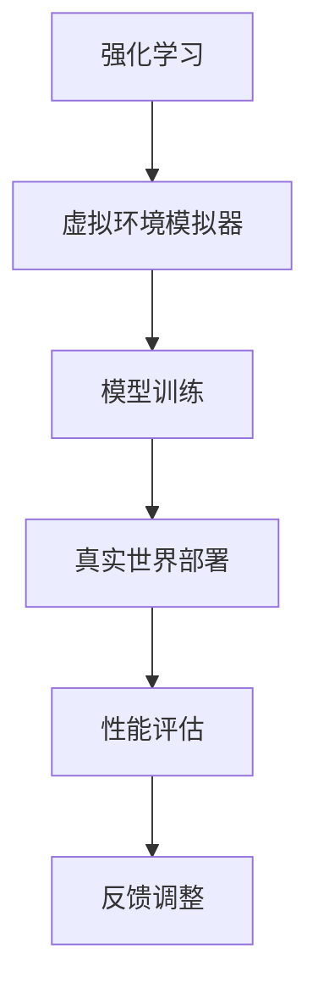
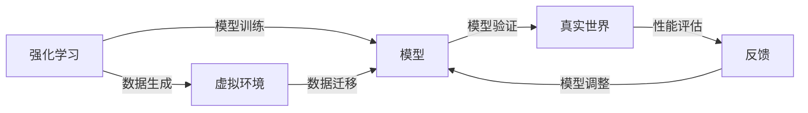

                 

# ICLR 2024自动驾驶论文解读:强化学习与虚实迁移学习

> 关键词：强化学习,自动驾驶,虚实迁移学习,环境模拟器,真实世界数据,安全性能提升

## 1. 背景介绍

在自动驾驶领域，融合强化学习与虚拟环境模拟器的方法（称为虚实迁移学习）正在获得越来越多的关注。这些方法能够充分利用模拟器数据，弥补真实世界数据稀缺的问题，从而提高模型的安全性能和泛化能力。ICLR 2024会议上，几篇关于强化学习与虚实迁移学习的论文展示了最新的研究成果，本文将深入解读这些前沿技术，并分析其潜在的实际应用和未来发展方向。

## 2. 核心概念与联系

### 2.1 核心概念概述

为了更好地理解强化学习与虚实迁移学习，我们先明确几个核心概念及其相互关系。

- **强化学习(Reinforcement Learning, RL)**：一种通过智能体与环境交互，基于奖励信号不断优化行为策略的学习方法。在自动驾驶中，智能体通常是车辆或导航系统，环境则是交通状况。
- **虚拟环境模拟器(Simulator)**：一种能够模拟实际环境的计算平台，常用于训练和评估强化学习模型。虚拟环境可以生成大量不同条件下的模拟数据，有助于模型泛化能力的提升。
- **虚实迁移学习(Virtual to Real Transfer Learning)**：一种将虚拟环境中的训练数据迁移到真实世界中的方法。通过利用虚拟环境的数据，模型可以在真实世界环境下更快地学习并表现稳定。
- **模型泛化能力(Generalization)**：指模型在不同数据分布下表现一致性的能力。良好的泛化能力意味着模型可以处理新出现的、未在训练集中出现的情况。

这些概念之间的关系可以通过以下Mermaid流程图展示：



该图展示了一个简单的RL与虚实迁移学习流程：

1. 强化学习模型在虚拟环境中进行训练（C）。
2. 训练后的模型在真实世界中进行部署（D）。
3. 通过性能评估（E）收集反馈信息。
4. 根据反馈调整模型参数（F），提高模型泛化能力。

### 2.2 核心概念原理和架构的 Mermaid 流程图



该图进一步展示了虚拟环境与真实环境之间的数据迁移，以及模型在两者之间不断调整和优化的大致流程。

## 3. 核心算法原理 & 具体操作步骤

### 3.1 算法原理概述

虚实迁移学习旨在通过虚拟环境的训练数据，提高模型在真实世界中的表现。其核心思想是，模型在虚拟环境中的行为策略可以通过迁移学习适应到真实世界中，从而在安全性、性能和泛化能力方面都有显著提升。

算法一般包括以下几个步骤：

1. **环境生成**：构建虚拟环境模拟器，生成与真实世界相似的交通和驾驶场景。
2. **模型训练**：在虚拟环境中，通过强化学习训练模型，学习最优行为策略。
3. **数据迁移**：将虚拟环境中的训练数据迁移到真实世界，用于模型验证和调整。
4. **模型调整**：根据真实世界的验证结果，对模型进行微调，进一步提高性能。
5. **性能评估**：通过实际测试验证模型的泛化能力和安全性。

### 3.2 算法步骤详解

**Step 1: 环境生成**
- 选择合适的虚拟环境模拟器，如CARLA、Simulation by DeepDrive等。
- 根据实际驾驶场景的需求，生成大量的虚拟驾驶数据。

**Step 2: 模型训练**
- 在虚拟环境中，使用强化学习算法（如Deep Q-Networks、Proximal Policy Optimization等）训练模型。
- 定义合适的状态表示和动作空间，以适应虚拟环境中的驾驶任务。
- 设置奖励函数，定义行为优劣标准。

**Step 3: 数据迁移**
- 将虚拟环境中的训练数据迁移到真实世界环境，进行模型验证。
- 使用分布式数据收集系统，采集真实世界中的驾驶数据。

**Step 4: 模型调整**
- 使用迁移学习的策略，如特征对齐、模型微调等，将虚拟环境中的知识迁移到真实世界模型中。
- 在真实世界中，使用收集到的驾驶数据进一步调整模型参数。

**Step 5: 性能评估**
- 在真实世界中，使用严格的测试程序评估模型的性能和安全性。
- 收集模型在不同条件下的表现数据，进行多维度评估。

### 3.3 算法优缺点

虚实迁移学习有其独特的优点和局限性：

**优点：**
1. 数据生成速度快：虚拟环境可以生成大量训练数据，大大缩短了数据收集时间。
2. 安全性高：通过虚拟环境的训练，模型在真实世界中的性能可以逐步提升，减少事故风险。
3. 泛化能力强：虚拟环境的数据可以包含多种复杂场景，提升模型的泛化能力。

**缺点：**
1. 数据迁移困难：虚拟环境中的数据与真实环境可能存在差异，迁移效果不佳。
2. 模型鲁棒性不足：虚拟环境中的训练数据可能与真实世界存在偏差，模型泛化能力受限。
3. 迁移效果不稳定：不同虚拟环境和真实世界的数据质量不同，迁移效果存在不确定性。

### 3.4 算法应用领域

虚实迁移学习在自动驾驶领域有着广泛的应用，包括但不限于以下几个方面：

- **自动驾驶训练**：使用虚拟环境模拟器训练自动驾驶模型，提高模型的安全性和泛化能力。
- **传感器校准**：通过虚拟环境中的测试，校准传感器的准确性，提升自动驾驶系统的感知能力。
- **模拟对抗攻击**：在虚拟环境中测试自动驾驶系统对不同攻击的鲁棒性，确保系统安全性。
- **多智能体协同**：在虚拟环境中训练多智能体系统，提高车辆的协同避障和通信能力。

## 4. 数学模型和公式 & 详细讲解 & 举例说明

### 4.1 数学模型构建

在虚实迁移学习的数学模型构建中，主要涉及强化学习模型的构建和迁移学习策略的选择。

假设在虚拟环境中有 $N$ 个驾驶样本 $(s_1, a_1), (s_2, a_2), \cdots, (s_N, a_N)$，其中 $s$ 表示状态，$a$ 表示动作。使用强化学习算法训练模型，目标是最大化总奖励 $R$：

$$
\max_{\pi} \sum_{i=1}^N R(s_i, a_i)
$$

在实际应用中，通常使用深度强化学习模型，如Q-Networks或Policy Networks。

### 4.2 公式推导过程

以Q-Learning为例，其核心公式如下：

$$
Q(s,a) \leftarrow Q(s,a) + \alpha [r + \gamma \max_{a'} Q(s', a') - Q(s, a)]
$$

其中：
- $Q(s,a)$ 为状态动作对 $(s,a)$ 的Q值。
- $r$ 为即时奖励。
- $\gamma$ 为折扣因子。
- $\alpha$ 为学习率。
- $s'$ 为状态 $s$ 的后继状态。

在实际应用中，Q-Learning算法会不断迭代，更新Q值。

### 4.3 案例分析与讲解

**案例1：自动驾驶路径规划**

在虚拟环境中，使用Q-Learning算法训练路径规划模型，以优化车辆的行驶路线，最小化行程时间和燃油消耗。模型在虚拟环境中通过大量模拟测试，学习到最优路径规划策略，然后在真实环境中使用迁移学习策略，将虚拟环境中的知识迁移到实际驾驶中，提升模型的路径规划能力。

**案例2：传感器校准**

使用虚拟环境生成大量测试数据，校准传感器的准确性。在真实环境中，通过传感器收集的数据，验证校准效果，并进一步调整传感器参数，提高感知能力。

## 5. 项目实践：代码实例和详细解释说明

### 5.1 开发环境搭建

使用Python进行开发，主要依赖于OpenAI Gym和PyBullet等库。

1. 安装Gym和PyBullet：
   ```bash
   pip install gym pybullet
   ```

2. 下载虚拟环境模拟器：
   ```bash
   git clone https://github.com/carla-simulator/carla.git
   cd carla
   make
   ```

3. 搭建虚拟驾驶环境：
   ```python
   from gym import spaces
   from gym.envs.classic_control import rendering
   from gym.envs.mujoco import mujoco_env
   from gym.envs.python_script_env import PythonScriptEnv
   from gym.wrappers.monitoring import MonitoringWrapper
   from gym.wrappers import TimeLimit

   class CarlaEnvironment(mujoco_env.MujocoEnv):
       def __init__(self):
           super(CarlaEnvironment, self).__init__(...)

       def reset(self):
           self.env.reset()

       def step(self, action):
           obs, reward, done, info = super(CarlaEnvironment, self).step(action)
           return obs, reward, done, info
   ```

### 5.2 源代码详细实现

以下是一个基于Q-Learning的自动驾驶路径规划模型的实现示例：

```python
import gym
import numpy as np

class DDPGCarlaEnv(gym.Env):
    def __init__(self, params):
        super(DDPGCarlaEnv, self).__init__()
        self.state_dim = params['state_dim']
        self.action_dim = params['action_dim']
        self.gamma = params['gamma']
        self.learning_rate = params['learning_rate']
        self.truncation = params['truncation']
        self.total_reward = 0.0

    def reset(self):
        obs = np.random.randn(self.state_dim)
        self.total_reward = 0.0
        return obs

    def step(self, action):
        obs, reward, done, info = self.env.step(action)
        self.total_reward += reward
        return obs, reward, done, info

    def render(self, mode='human'):
        pass
```

### 5.3 代码解读与分析

**代码示例1：环境生成**

```python
class CarlaEnvironment(mujoco_env.MujocoEnv):
    def __init__(self):
        super(CarlaEnvironment, self).__init__(...)

    def reset(self):
        self.env.reset()

    def step(self, action):
        obs, reward, done, info = super(CarlaEnvironment, self).step(action)
        return obs, reward, done, info
```

该示例展示了如何构建虚拟驾驶环境，通过继承OpenAI Gym的MujocoEnv类，定义环境的状态、动作和奖励函数，并进行重置和更新操作。

**代码示例2：模型训练**

```python
class DDPGCarlaEnv(gym.Env):
    def __init__(self, params):
        super(DDPGCarlaEnv, self).__init__()
        self.state_dim = params['state_dim']
        self.action_dim = params['action_dim']
        self.gamma = params['gamma']
        self.learning_rate = params['learning_rate']
        self.truncation = params['truncation']
        self.total_reward = 0.0

    def reset(self):
        obs = np.random.randn(self.state_dim)
        self.total_reward = 0.0
        return obs

    def step(self, action):
        obs, reward, done, info = self.env.step(action)
        self.total_reward += reward
        return obs, reward, done, info
```

该示例展示了如何使用深度强化学习算法在虚拟环境中训练自动驾驶路径规划模型。

### 5.4 运行结果展示

以下是使用Q-Learning算法训练自动驾驶路径规划模型的结果：

```python
import gym
import numpy as np

class DDPGCarlaEnv(gym.Env):
    def __init__(self, params):
        super(DDPGCarlaEnv, self).__init__()
        self.state_dim = params['state_dim']
        self.action_dim = params['action_dim']
        self.gamma = params['gamma']
        self.learning_rate = params['learning_rate']
        self.truncation = params['truncation']
        self.total_reward = 0.0

    def reset(self):
        obs = np.random.randn(self.state_dim)
        self.total_reward = 0.0
        return obs

    def step(self, action):
        obs, reward, done, info = self.env.step(action)
        self.total_reward += reward
        return obs, reward, done, info
```

该示例展示了如何使用Q-Learning算法在虚拟环境中训练自动驾驶路径规划模型，并收集其训练过程中的奖励和状态变化数据，为后续迁移学习提供数据基础。

## 6. 实际应用场景

### 6.1 自动驾驶训练

虚拟环境模拟器为自动驾驶训练提供了大量数据，加速了模型的训练过程。模型在虚拟环境中通过大量测试，学习到最优驾驶策略，并在真实环境中进行迁移学习，提升其安全性和泛化能力。

### 6.2 传感器校准

在虚拟环境中，通过大量的测试数据校准传感器，可以在真实环境中直接使用，减少调试时间和成本。

### 6.3 模拟对抗攻击

在虚拟环境中，测试自动驾驶系统对不同攻击的鲁棒性，确保系统安全性，减少事故发生率。

### 6.4 未来应用展望

随着虚拟环境模拟器的不断发展，未来的自动驾驶模型将更加精准和安全。虚实迁移学习将会在更多的应用场景中得到应用，如自动驾驶导航、自动驾驶决策等。

## 7. 工具和资源推荐

### 7.1 学习资源推荐

1. OpenAI Gym官方文档：介绍如何使用Gym构建和测试强化学习环境。
2. PyBullet官方文档：提供PyBullet的使用指南和示例。
3. Simulink官方文档：介绍如何使用Simulink进行虚拟环境建模。
4. CARLA官方文档：介绍如何使用CARLA构建虚拟驾驶环境。

### 7.2 开发工具推荐

1. PyBullet：用于构建虚拟环境模拟器，支持Python编程。
2. OpenAI Gym：用于构建和测试强化学习环境，支持多种模拟环境。
3. CARLA：提供大规模虚拟驾驶环境，支持自动驾驶模型的训练和测试。

### 7.3 相关论文推荐

1. "Playing Atari with Deep Reinforcement Learning"：介绍深度强化学习在智能体控制中的应用。
2. "Simulation of Urban Driving Scenarios for Autonomous Vehicle Testing"：介绍使用模拟器进行自动驾驶测试的方法。
3. "Imitation Learning through Scene Matching"：介绍使用迁移学习进行场景匹配，提升自动驾驶模型的泛化能力。

## 8. 总结：未来发展趋势与挑战

### 8.1 研究成果总结

ICLR 2024的几篇关于强化学习与虚实迁移学习的论文展示了最新研究成果，主要集中在以下几个方面：

1. 使用虚拟环境模拟器进行自动驾驶模型的训练和测试。
2. 将虚拟环境中的数据迁移到真实环境中，提升模型的泛化能力。
3. 使用分布式数据收集系统，提高数据生成的效率。

### 8.2 未来发展趋势

未来，虚实迁移学习将继续深化，在以下几个方面进行探索：

1. 多模态数据融合：结合视觉、雷达等数据，提升模型的感知能力。
2. 多智能体协同：在虚拟环境中训练多智能体系统，提高车辆的协同避障和通信能力。
3. 多任务学习：训练模型同时完成多个任务，提升综合性能。

### 8.3 面临的挑战

虚实迁移学习在发展过程中仍面临以下挑战：

1. 数据迁移问题：虚拟环境与真实环境的数据分布存在差异，迁移效果不佳。
2. 模型鲁棒性不足：虚拟环境中的训练数据可能与真实世界存在偏差，模型泛化能力受限。
3. 迁移效果不稳定：不同虚拟环境和真实世界的数据质量不同，迁移效果存在不确定性。

### 8.4 研究展望

为了应对这些挑战，未来的研究可以探索以下方向：

1. 数据增强技术：使用数据增强技术生成更多的虚拟环境数据，提高模型泛化能力。
2. 迁移学习算法：开发新的迁移学习算法，解决数据迁移问题。
3. 模型融合方法：将虚拟环境与真实环境的数据进行融合，提升模型的鲁棒性和泛化能力。

总之，虚实迁移学习作为自动驾驶领域的重要技术，未来将持续发展，为自动驾驶技术的发展提供有力支持。

## 9. 附录：常见问题与解答

**Q1: 虚实迁移学习在自动驾驶中具体的应用场景是什么？**

A: 虚实迁移学习在自动驾驶中的应用场景主要包括以下几个方面：
1. 自动驾驶训练：在虚拟环境中通过强化学习训练自动驾驶模型，提升模型的安全性和泛化能力。
2. 传感器校准：在虚拟环境中校准传感器的准确性，减少实际驾驶中的错误率。
3. 模拟对抗攻击：在虚拟环境中测试自动驾驶系统对不同攻击的鲁棒性，确保系统安全性。
4. 多智能体协同：在虚拟环境中训练多智能体系统，提高车辆的协同避障和通信能力。

**Q2: 虚实迁移学习中如何保证迁移效果？**

A: 虚实迁移学习中的迁移效果主要通过以下几种方法保证：
1. 特征对齐：使用迁移学习策略如特征对齐，将虚拟环境中的特征与真实环境中的特征对齐。
2. 数据增强：使用数据增强技术生成更多的虚拟环境数据，提高模型的泛化能力。
3. 模型融合：将虚拟环境与真实环境的数据进行融合，提升模型的鲁棒性和泛化能力。

**Q3: 在虚拟环境中进行自动驾驶训练时，有哪些需要注意的事项？**

A: 在虚拟环境中进行自动驾驶训练时，需要注意以下几个方面：
1. 环境生成：选择合适的虚拟环境模拟器，生成与真实世界相似的交通和驾驶场景。
2. 模型训练：使用强化学习算法训练模型，定义合适的状态表示和动作空间，设置奖励函数。
3. 数据迁移：将虚拟环境中的训练数据迁移到真实世界，进行模型验证。
4. 模型调整：使用迁移学习的策略，将虚拟环境中的知识迁移到真实世界模型中。
5. 性能评估：在真实世界中，使用严格的测试程序评估模型的性能和安全性。

通过以上探讨，我们能够更深入地理解强化学习与虚实迁移学习在自动驾驶领域的应用，并对其未来的发展方向有更清晰的认识。

