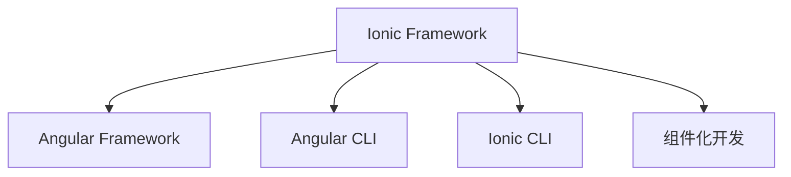

                 

# Ionic 框架优势：基于 Angular 的移动应用开发

> 关键词：Ionic, Angular, 移动应用, 跨平台, 组件化, 前端开发, 无代码开发, 前端工具链, 插件系统

## 1. 背景介绍

在移动互联网时代，跨平台的移动应用开发成为了开发者们的热门选择。为了简化开发流程，提升开发效率，同时保持跨平台的一致性，各大前端框架和框架组合应运而生。Angular作为一款强大的前端框架，其与Ionic的结合，成为了构建跨平台移动应用的理想选择。本文将从背景、核心概念与联系、算法原理与操作步骤、数学模型与详细讲解、项目实践、实际应用场景、工具和资源推荐、总结与未来展望等多个维度，全面解析基于Angular的Ionic框架的开发优势。

## 2. 核心概念与联系

### 2.1 核心概念概述

Ionic是一款基于Angular的跨平台移动应用开发框架，其通过组件化开发、动态路由、无代码生成等特性，极大简化了移动应用的开发流程。而Angular作为一款广泛使用的JavaScript前端框架，具有强大的组件化、模块化、依赖注入等特性，可以大幅提升开发效率，提高代码的可维护性和可复用性。Ionic与Angular的结合，不仅充分发挥了Angular的强大功能和Angular语言的性能优势，还提升了开发效率和用户体验，同时也降低了跨平台开发的技术门槛。

为了更好地理解Ionic框架的优势，本节将介绍几个密切相关的核心概念：

- Ionic框架：一款基于Angular的跨平台移动应用开发框架，提供了一整套的前端工具链和组件库，可以快速构建高质量的移动应用。
- Angular框架：一款强大的JavaScript前端框架，具有组件化、模块化、依赖注入等特性，可以极大提升前端开发的效率和可维护性。
- Angular CLI：Angular的命令行工具，用于项目初始化、代码生成、构建部署等全流程自动化。
- Ionic CLI：Ionic的命令行工具，用于创建、生成和管理Ionic应用项目。
- 组件化开发：Ionic框架通过组件化开发，将应用拆分成独立的小组件，每个组件可独立开发、测试和维护。

这些核心概念之间的逻辑关系可以通过以下Mermaid流程图来展示：



这个流程图展示了我們所讨论的核心概念之间的相互关系：

1. Ionic框架基于Angular框架，并提供了额外的组件库和工具链，简化开发流程。
2. Ionic CLI和Angular CLI是构建和管理Ionic应用的重要工具。
3. 组件化开发是Ionic框架的核心特性，通过组件化，应用可以被拆分成可复用、可维护的小组件。

## 3. 核心算法原理 & 具体操作步骤

### 3.1 算法原理概述

基于Angular的Ionic框架的开发优势，主要体现在以下几个方面：

1. 组件化开发：将应用拆分成独立的小组件，每个组件可独立开发、测试和维护。
2. 动态路由：通过动态路由，实现应用的多种导航场景。
3. 无代码生成：通过模板生成工具，自动生成前端代码，减少手动编码。
4. 前端工具链：提供了一整套的前端工具链，简化开发流程。
5. 插件系统：通过插件系统，可以轻松扩展应用的功能。

### 3.2 算法步骤详解

基于Angular的Ionic框架开发移动应用的步骤如下：

1. 准备开发环境：安装Ionic CLI和Angular CLI，并创建新的Ionic项目。
2. 设计组件：将应用划分成独立的小组件，每个组件负责一个特定的功能或页面。
3. 实现组件：编写组件的HTML、CSS和JavaScript代码，并使用Ionic CLI生成相关的组件文件。
4. 配置路由：定义应用的页面路由，并使用Angular CLI生成路由文件。
5. 样式定制：使用CSS定制应用的样式，并使用Ionic主题库进行快速配置。
6. 测试组件：使用Ionic CLI提供的测试工具，测试组件的功能和性能。
7. 打包发布：使用Ionic CLI生成构建文件，并发布到App Store或Google Play等平台。

### 3.3 算法优缺点

基于Angular的Ionic框架在开发移动应用时，有以下优点：

1. 提高开发效率：通过组件化开发、动态路由、无代码生成等特性，极大简化了开发流程。
2. 提升可维护性：组件化开发使得代码可维护性更高，每个组件独立开发、测试和维护。
3. 跨平台一致性：通过Angular和Ionic的结合，可以在多个平台之间实现一致的用户体验。
4. 社区生态丰富：Ionic框架拥有丰富的组件库和插件系统，可以快速扩展应用功能。

同时，该框架也存在一些缺点：

1. 学习成本高：Angular和Ionic框架的学习曲线较陡峭，初学者可能需要一些时间适应。
2. 性能问题：由于Angular的模板渲染机制，性能表现不如原生应用。
3. 依赖关系复杂：Angular和Ionic框架的依赖关系较复杂，管理起来有一定难度。

### 3.4 算法应用领域

基于Angular的Ionic框架在移动应用开发中的应用领域非常广泛，以下是一些常见的应用场景：

1. 企业级移动应用：如内部管理系统、客户管理系统等，可以使用Ionic框架快速开发。
2. 电商应用：如电商APP、商城应用等，可以使用Ionic框架实现跨平台购物体验。
3. 社交应用：如即时通讯、社交网络等，可以使用Ionic框架快速搭建。
4. 医疗应用：如医院预约、电子病历管理等，可以使用Ionic框架提升用户体验。
5. 教育应用：如在线学习、在线教育等，可以使用Ionic框架提供跨平台学习体验。

## 4. 数学模型和公式 & 详细讲解

### 4.1 数学模型构建

基于Angular的Ionic框架的数学模型主要涉及以下几个方面：

- 组件设计：定义组件的输入、输出和行为，并编写相关代码。
- 路由配置：定义应用的页面路由和导航逻辑，并生成路由文件。
- 样式定义：使用CSS定义应用的页面样式，并使用Ionic主题库进行快速配置。
- 性能优化：通过Ionic提供的性能优化工具，提升应用的性能表现。

### 4.2 公式推导过程

以下我们将以路由配置为例，介绍其数学模型和公式推导过程。

假设我们有一个简单的Ionic应用，其包含两个页面：主页（home）和详情页（detail）。其路由配置的数学模型如下：

1. 定义路由：
```javascript
{
  path: 'home',
  component: HomeComponent
},
{
  path: 'detail/:id',
  component: DetailComponent
}
```

2. 生成路由文件：
```javascript
ng generate router -d src/app -p pages
```

在路由配置中，`path`属性表示URL路径，`component`属性表示对应的组件，`:id`表示动态参数，表示可以根据URL参数动态加载详情页。

### 4.3 案例分析与讲解

下面我们将以一个具体的案例来说明如何使用Ionic框架进行移动应用开发。

假设我们要开发一个电商应用的登录功能，其大致流程如下：

1. 创建登录组件：使用Ionic CLI生成登录组件，并编写相关代码。
2. 配置路由：定义登录页面的路由，并生成路由文件。
3. 实现登录逻辑：编写登录逻辑的JavaScript代码，并使用Angular CLI生成相关文件。
4. 样式定制：使用CSS定制登录页面的样式，并使用Ionic主题库进行快速配置。
5. 测试登录功能：使用Ionic CLI提供的测试工具，测试登录功能是否正常。

## 5. 项目实践：代码实例和详细解释说明

### 5.1 开发环境搭建

在进行Ionic框架开发前，我们需要准备好开发环境。以下是使用Python进行Ionic开发的环境配置流程：

1. 安装Node.js和npm：从官网下载并安装Node.js和npm。
2. 安装Ionic CLI和Angular CLI：通过npm安装Ionic CLI和Angular CLI。
3. 创建新的Ionic项目：使用Ionic CLI创建新的项目，并进行初始化配置。
4. 安装依赖包：通过npm安装应用所需的依赖包。

### 5.2 源代码详细实现

以下是使用Ionic框架开发一个电商应用登录功能的代码实现。

```javascript
// login.ts
import { Component } from '@angular/core';

@Component({
  selector: 'app-login',
  template: `
    <form (ngSubmit)="login()">
      <label>用户名:</label>
      <input type="text" [(ngModel)]="username" name="username" required>
      <br>
      <label>密码:</label>
      <input type="password" [(ngModel)]="password" name="password" required>
      <br>
      <button type="submit">登录</button>
    </form>
  `,
  styles: [`
    input {
      margin-bottom: 10px;
    }
  `]
})
export class LoginComponent {
  username: string;
  password: string;

  login() {
    // 在此处编写登录逻辑
  }
}
```

### 5.3 代码解读与分析

让我们再详细解读一下关键代码的实现细节：

**login.ts类**：
- 定义了登录组件，使用Angular的Component装饰器进行组件化开发。
- 使用Angular的模板语法，编写登录界面的HTML代码。
- 定义了输入表单，并使用`[(ngModel)]`指令将表单元素绑定到组件的属性。
- 编写了`login`方法，用于处理表单提交事件。

**login.ts类模板**：
- 使用Angular的模板语法，定义了登录界面的HTML结构。
- 使用表单控件的`[(ngModel)]`指令，将表单元素的值绑定到组件的属性。
- 编写了提交按钮，并绑定到`login`方法。

**login.ts类样式**：
- 定义了表单元素的样式，使用Angular的样式语言进行快速配置。

**login.ts类**：
- 编写了登录逻辑的JavaScript代码。
- 在此处，可以编写登录验证逻辑，包括用户名和密码的验证、向服务器发送请求等。

**login.ts类模板**：
- 使用Angular的模板语法，定义了登录界面的HTML结构。
- 使用表单控件的`[(ngModel)]`指令，将表单元素的值绑定到组件的属性。
- 编写了提交按钮，并绑定到`login`方法。

## 6. 实际应用场景

### 6.1 企业级移动应用

基于Angular的Ionic框架可以快速构建企业级移动应用，如内部管理系统、客户管理系统等。在企业级应用中，Ionic框架的组件化开发、动态路由和无代码生成等特性，可以大幅提升开发效率和代码可维护性。同时，Ionic框架的插件系统和跨平台一致性，也使得应用具有更高的可扩展性和用户体验。

### 6.2 电商应用

Ionic框架在电商应用开发中具有广泛的应用前景。电商应用的登录、注册、购物车等功能都可以使用Ionic框架快速实现。Ionic框架的组件化开发、动态路由和无代码生成等特性，可以大幅提升开发效率，同时也保证了跨平台的一致性。

### 6.3 社交应用

社交应用如即时通讯、社交网络等，也可以使用Ionic框架快速搭建。Ionic框架的组件化开发、动态路由和无代码生成等特性，可以大大简化社交应用的开发流程，同时也保证了跨平台的一致性。

### 6.4 医疗应用

医疗应用如医院预约、电子病历管理等，也可以使用Ionic框架进行开发。Ionic框架的组件化开发、动态路由和无代码生成等特性，可以提升医疗应用的开发效率和可维护性，同时也保证了跨平台的一致性。

## 7. 工具和资源推荐

### 7.1 学习资源推荐

为了帮助开发者系统掌握基于Angular的Ionic框架的开发技巧，这里推荐一些优质的学习资源：

1. Ionic官方文档：提供了详细的Ionic框架文档和开发指南，是学习和实践Ionic框架的最佳资源。
2. Angular官方文档：提供了Angular框架的详细文档和开发指南，是学习和实践Angular框架的最佳资源。
3. Angular和Ionic开发实战教程：通过实际操作，帮助开发者掌握Angular和Ionic框架的开发技巧。
4. Ionic开发视频教程：通过视频教程，帮助开发者快速上手Ionic框架的开发。
5. Ionic社区：提供了丰富的Ionic框架资源和社区支持，可以快速解决开发中的问题。

通过对这些资源的学习实践，相信你一定能够快速掌握基于Angular的Ionic框架的开发技巧，并用于解决实际的开发问题。

### 7.2 开发工具推荐

Ionic框架开发离不开优秀的开发工具支持。以下是几款用于Ionic开发常用的工具：

1. Visual Studio Code：一款强大的开发工具，支持多种语言和框架的开发，是Ionic框架开发的理想选择。
2. IntelliJ IDEA：一款强大的开发工具，支持多种语言和框架的开发，具有强大的代码高亮和智能提示功能。
3. Eclipse：一款广泛使用的开发工具，支持多种语言和框架的开发，具有强大的代码调试功能。
4. WebStorm：一款强大的开发工具，支持多种语言和框架的开发，具有强大的代码高亮和智能提示功能。

合理利用这些工具，可以显著提升Ionic框架的开发效率，加快创新迭代的步伐。

### 7.3 相关论文推荐

Ionic框架和Angular框架的研究源于学界的持续研究。以下是几篇奠基性的相关论文，推荐阅读：

1. "Component-Based Applications for the Web"：一篇关于组件化开发的经典论文，探讨了组件化开发的优势和实现方法。
2. "AngularJS: The Next Generation of Web Applications"：一篇关于Angular框架的经典论文，介绍了Angular框架的核心特性和技术。
3. "The Power of Angular 2"：一篇关于Angular 2框架的经典论文，探讨了Angular 2框架的创新点和优势。
4. "Ionic Framework: A Cross-Platform Mobile App Development Framework"：一篇关于Ionic框架的经典论文，介绍了Ionic框架的核心特性和技术。

这些论文代表了大语言模型微调技术的发展脉络。通过学习这些前沿成果，可以帮助研究者把握学科前进方向，激发更多的创新灵感。

## 8. 总结：未来发展趋势与挑战

### 8.1 总结

本文对基于Angular的Ionic框架的开发优势进行了全面系统的介绍。首先阐述了Ionic框架和Angular框架的研究背景和意义，明确了组件化开发、动态路由、无代码生成等特性对移动应用开发的影响。其次，从原理到实践，详细讲解了Ionic框架的开发流程和关键步骤，给出了Ionic框架开发的完整代码实例。同时，本文还广泛探讨了Ionic框架在企业级应用、电商应用、社交应用、医疗应用等多个行业领域的应用前景，展示了Ionic框架的强大生命力。此外，本文精选了Ionic框架的学习资源，力求为读者提供全方位的技术指引。

通过本文的系统梳理，可以看到，基于Angular的Ionic框架在移动应用开发中具有巨大的优势，其组件化开发、动态路由和无代码生成等特性，可以极大地简化开发流程，提升开发效率和代码可维护性，同时保持跨平台的一致性。相信随着Ionic框架的不断发展，其在移动应用开发领域必将继续发挥重要作用。

### 8.2 未来发展趋势

展望未来，Ionic框架的发展趋势主要包括以下几个方向：

1. 组件库的扩展：随着Ionic框架的不断发展，其组件库将不断扩展，涵盖更多的移动应用开发需求。
2. 动态路由的优化：动态路由是Ionic框架的核心特性之一，未来将继续优化和扩展，提升应用的导航性能。
3. 跨平台一致性：Ionic框架将继续优化跨平台的一致性，提升应用的性能和用户体验。
4. 无代码生成技术的提升：Ionic框架的无代码生成技术将继续优化和扩展，提升开发效率。
5. 插件系统的丰富：Ionic框架的插件系统将继续扩展，提供更多的开发工具和第三方插件，提升应用的可扩展性。

以上趋势凸显了Ionic框架的巨大前景。这些方向的探索发展，必将进一步提升Ionic框架在移动应用开发中的地位，为开发者提供更高效、更强大的开发工具。

### 8.3 面临的挑战

尽管Ionic框架已经取得了瞩目成就，但在迈向更加智能化、普适化应用的过程中，它仍面临着诸多挑战：

1. 性能瓶颈：尽管Ionic框架已经进行了性能优化，但在一些高性能场景下，仍然存在性能瓶颈，需要进一步优化。
2. 组件化开发规范：组件化开发规范需要进一步统一和标准化，以便开发者快速上手和维护。
3. 跨平台一致性：Ionic框架在跨平台一致性上仍有提升空间，需要在性能和用户体验上进一步优化。
4. 文档和社区支持：Ionic框架的文档和社区支持需要进一步完善，以便开发者快速解决问题。
5. 开发者的技术水平：Ionic框架的学习曲线较陡峭，需要更多具有技术积累的开发者。

### 8.4 研究展望

面对Ionic框架所面临的挑战，未来的研究需要在以下几个方面寻求新的突破：

1. 优化性能：提升Ionic框架在复杂场景下的性能表现，减少渲染时间和内存占用。
2. 统一组件化规范：制定统一和标准化的组件化开发规范，提升组件的复用性和可维护性。
3. 提升跨平台一致性：优化跨平台的一致性，提升应用的性能和用户体验。
4. 完善文档和社区支持：完善Ionic框架的文档和社区支持，提升开发者的学习体验和开发效率。
5. 培养更多的技术人才：培养更多的Ionic框架开发者，提升社区的技术水平和活跃度。

这些研究方向的探索，必将引领Ionic框架走向更高的台阶，为移动应用开发提供更高效、更强大的工具。面向未来，Ionic框架还需要与其他技术进行更深入的融合，如无代码开发、低代码开发等，多路径协同发力，共同推动移动应用开发技术的进步。只有勇于创新、敢于突破，才能不断拓展Ionic框架的边界，让移动应用开发更加高效和便捷。

## 9. 附录：常见问题与解答

**Q1：Ionic框架和Angular框架有什么区别？**

A: Ionic框架是基于Angular框架的移动应用开发框架，提供了丰富的组件库和开发工具，可以极大简化移动应用的开发流程。而Angular框架是一款强大的JavaScript前端框架，具有组件化、模块化、依赖注入等特性，可以极大提升前端开发的效率和可维护性。Ionic框架和Angular框架结合使用，可以发挥各自的优势，提升开发效率和应用性能。

**Q2：Ionic框架如何优化性能？**

A: Ionic框架在性能优化方面有以下几种方法：
1. 使用懒加载：将应用组件按需加载，减少初始渲染时间。
2. 使用虚拟滚动：使用虚拟滚动优化长列表的性能。
3. 使用分页加载：使用分页加载优化数据加载性能。
4. 使用缓存技术：使用缓存技术优化数据和组件的加载。
5. 使用服务端渲染：使用服务端渲染技术提升应用的加载速度。

**Q3：如何构建高质量的Ionic应用？**

A: 构建高质量的Ionic应用需要关注以下几个方面：
1. 组件化开发：将应用拆分成独立的小组件，每个组件可独立开发、测试和维护。
2. 动态路由：通过动态路由，实现应用的多种导航场景。
3. 样式定制：使用CSS定制应用的样式，并使用Ionic主题库进行快速配置。
4. 性能优化：通过Ionic提供的性能优化工具，提升应用的性能表现。
5. 测试覆盖：使用Ionic提供的测试工具，测试组件的功能和性能。
6. 代码复用：使用组件和插件，提升代码的复用性和可维护性。

**Q4：Ionic框架的插件系统如何扩展应用功能？**

A: Ionic框架的插件系统可以通过以下几种方式扩展应用功能：
1. 安装第三方插件：使用npm安装第三方插件，并通过Ionic CLI引入到应用中。
2. 定制插件：开发者可以自定义插件，并将其发布到Ionic插件库中，供其他开发者使用。
3. 使用Ionic CLI生成插件：使用Ionic CLI生成插件，并自定义插件的代码。

通过这些方式，Ionic框架可以轻松扩展应用的功能，提升应用的灵活性和可扩展性。

---

作者：禅与计算机程序设计艺术 / Zen and the Art of Computer Programming

