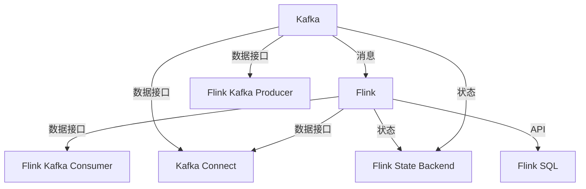

                 

## 1. 背景介绍

### 1.1 问题由来

在数据处理的领域，Kafka 和 Flink 都是至关重要的组件。Kafka 作为一个消息传递平台，提供了高吞吐量、高可靠性的数据流传输能力，而 Flink 作为一个流处理框架，具备强大的分布式处理和状态维护能力。二者的结合，成为了构建高可用、高性能、可扩展的数据处理系统的理想选择。

然而，尽管二者在各自领域都有优秀的表现，但由于其架构和功能的差异，将它们整合起来以实现互操作性，是一个复杂且充满挑战的任务。本文将从原理、架构和代码实例等层面详细讲解 Kafka 和 Flink 的整合机制，帮助读者深入理解如何高效地将这两个组件融合在一起，提升数据处理的效率和可靠性。

### 1.2 问题核心关键点

Kafka-Flink 整合的核心关键点包括以下几个方面：

- 数据流的传输和处理。Kafka 负责数据流的传输，而 Flink 负责数据流的处理和计算。如何将 Kafka 的流传输与 Flink 的流处理无缝衔接，是整合的关键。
- 状态维护和容错性。Kafka 提供了持久化的数据存储，而 Flink 则提供了分布式状态管理，如何在这两者之间建立高效的状态传递和容错机制，是保证系统稳定性的关键。
- 数据模型和接口的一致性。Kafka 的数据模型是消息（Message），而 Flink 的数据模型是流（Stream），如何在数据模型和接口层面实现一致性，是整合的技术挑战之一。
- 部署和监控的优化。Kafka 和 Flink 通常部署在不同的集群和环境中，如何实现高效的跨集群部署和统一的监控管理，是整合的工程难点。

本文将围绕这些关键点，全面阐述 Kafka 和 Flink 的整合原理，并通过代码实例演示具体的实现步骤。

## 2. 核心概念与联系

### 2.1 核心概念概述

在深入探讨 Kafka 和 Flink 的整合原理之前，我们先来理解一些核心概念：

- **Kafka**：Apache Kafka 是一个分布式的流处理平台，主要用于实时数据的传输和存储。它支持高吞吐量的数据传输，能够处理大规模的、复杂的数据流。
- **Flink**：Apache Flink 是一个分布式流处理框架，支持高吞吐量、低延迟的数据处理和分析。它提供了一组丰富的 API，使得开发复杂的数据流处理应用变得简单易行。
- **数据流**：在 Flink 中，数据被看作是一个流（Stream），即连续的有序数据序列。而在 Kafka 中，数据被看作是消息（Message），即离散的数据单元。

理解了这些核心概念，我们就可以更好地理解 Kafka 和 Flink 的整合机制了。

### 2.2 核心概念原理和架构的 Mermaid 流程图

下面是一张展示 Kafka 和 Flink 整合原理的 Mermaid 流程图：



这个图表展示了 Kafka 和 Flink 之间的数据流动和状态传递。其中，Kafka Connect 用于数据接入和转换，Flink Kafka Consumer 和 Kafka Producer 用于数据的流处理和存储，Flink State Backend 用于状态的管理和容错。此外，Flink SQL 提供了基于 SQL 的高级数据处理功能，与 Kafka 的接口也进行了适配。

### 2.3 核心概念的联系

- **消息与流**：Kafka 的消息模型与 Flink 的流模型是等价的。消息流可以看作是一系列有序的消息序列，而消息本身则是一个事件。Flink 通过 Kafka 接收到消息，并对其进行流处理。
- **状态管理**：Flink 提供了分布式状态管理，用于维护计算过程中需要的状态信息。这些状态信息需要持久化存储，而 Kafka 提供了持久化的数据存储能力，可以用于 Flink 的状态持久化。
- **API 适配**：Flink 提供了多种 API，如流式 API、批处理 API、SQL API 等，用于不同的数据处理需求。而 Kafka 的 API 则相对简单，主要涉及数据的生产和消费。通过 Kafka Connect 和 Flink 的 Kafka API，可以实现这两种 API 之间的适配。

## 3. 核心算法原理 & 具体操作步骤

### 3.1 算法原理概述

Kafka 和 Flink 的整合原理主要涉及以下三个方面：

- **数据流的传输**：Kafka 的流传输与 Flink 的流处理之间的衔接。
- **状态的传递和管理**：Flink 的状态信息需要持久化存储，而 Kafka 提供了持久化的数据存储能力。
- **API 的适配**：Flink 和 Kafka 在 API 上的差异，需要通过中间件来实现适配。

### 3.2 算法步骤详解

#### 3.2.1 数据流的传输

在数据流的传输方面，Kafka 和 Flink 的整合主要涉及以下步骤：

1. **Kafka Producer 生产数据**：通过 Kafka Producer 将数据发送到 Kafka 主题中。
2. **Flink Kafka Consumer 消费数据**：通过 Flink Kafka Consumer 从 Kafka 主题中读取数据，并进行流处理。

具体的代码实现如下：

```java
Properties props = new Properties();
props.put("bootstrap.servers", "localhost:9092");
props.put("group.id", "test-group");

KafkaConsumer<String, String> consumer = new KafkaConsumer<>(props);
consumer.subscribe(Collections.singletonList("my-topic"));

while (true) {
    ConsumerRecords<String, String> records = consumer.poll(Duration.ofMillis(100));
    for (ConsumerRecord<String, String> record : records) {
        System.out.printf("offset = %d, key = %s, value = %s%n", record.offset(), record.key(), record.value());
    }
}

KafkaProducer<String, String> producer = new KafkaProducer<>(props);

String topic = "my-topic";
String message = "Hello, Kafka!";
producer.send(new ProducerRecord<>(topic, message));
```

#### 3.2.2 状态的传递和管理

在状态的传递和管理方面，Flink 的状态信息需要持久化存储，而 Kafka 提供了持久化的数据存储能力。Flink 的状态持久化通常通过 Checkpoint 机制来实现，而 Kafka 则用于存储 Checkpoint 的状态信息。

具体的代码实现如下：

```java
StateBackend stateBackend = new FileStateBackend(new Path("/path/to/checkpoint"));
StreamExecutionEnvironment env = StreamExecutionEnvironment.getExecutionEnvironment();
env.enableCheckpointing(1000);

DataStream<String> stream = env.addSource(new FlinkKafkaConsumer<>(props, new SimpleStringSchema(), "my-topic"));

stream.print();

// 触发 Checkpoint
env.execute("Flink-Kafka Integrate");
```

#### 3.2.3 API 的适配

在 API 的适配方面，Flink 和 Kafka 的 API 存在差异，需要通过中间件来实现适配。常用的中间件包括 Kafka Connect 和 Flink SQL。

通过 Kafka Connect，可以将 Kafka 中的数据接入到 Flink 中，并进行转换和处理。具体的代码实现如下：

```java
Properties props = new Properties();
props.put("connector.class", "io.confluent.connectors.kafka.connect.KafkaSourceConnector");
props.put("tasks.max", "1");
props.put("key.converter.class", "io.confluent.connect.json.JsonConverter");
props.put("value.converter.class", "io.confluent.connect.json.JsonConverter");

KafkaSourceConnector connector = new KafkaSourceConnector(props);
connector.start();
SourceRecordStream<String, String> source = connector.source();

while (true) {
    ConsumerRecord<String, String> record = source.next();
    System.out.printf("offset = %d, key = %s, value = %s%n", record.offset(), record.key(), record.value());
}
```

通过 Flink SQL，可以在 Flink 中使用 SQL 语言对 Kafka 数据进行查询和处理。具体的代码实现如下：

```java
String sql = "SELECT * FROM my-topic";
DataStream<String> stream = env.executeSql(sql);
stream.print();
```

### 3.3 算法优缺点

#### 3.3.1 优点

Kafka 和 Flink 的整合有以下几个优点：

- **高可用性**：Kafka 提供了高可靠性的数据传输能力，而 Flink 提供了分布式的状态管理和容错能力，二者结合可以构建高可用、高可靠的数据处理系统。
- **高性能**：Kafka 支持高吞吐量的数据传输，而 Flink 支持高吞吐量、低延迟的数据处理，二者结合可以提供高性能的数据处理能力。
- **灵活性**：Flink 提供了丰富的 API，支持不同的数据处理需求，通过 Kafka 和 Flink 的整合，可以灵活地应对各种数据处理场景。

#### 3.3.2 缺点

Kafka 和 Flink 的整合也存在一些缺点：

- **复杂性**：Kafka 和 Flink 的整合涉及多个组件和技术的协同工作，增加了系统的复杂性。
- **部署难度**：Kafka 和 Flink 通常部署在不同的集群和环境中，跨集群的部署和监控增加了工程的难度。
- **数据模型差异**：Kafka 的消息模型与 Flink 的流模型存在差异，需要在 API 层面进行适配。

## 4. 数学模型和公式 & 详细讲解 & 举例说明

### 4.1 数学模型构建

在 Kafka 和 Flink 的整合中，主要涉及数据的传输、状态的传递和 API 的适配。我们可以通过以下数学模型来描述这些过程：

- **数据传输模型**：$D = \{(x_i, y_i)\}_{i=1}^N$，其中 $x_i$ 表示 Kafka 中生产的数据，$y_i$ 表示 Flink 中处理的数据。数据传输的数学模型为：

  $$
  y_i = f(x_i)
  $$

- **状态传递模型**：$S = \{(s_i, s_{i+1})\}_{i=0}^{N-1}$，其中 $s_i$ 表示 Flink 中状态信息在 Checkpoint 前的值，$s_{i+1}$ 表示 Checkpoint 后的值。状态传递的数学模型为：

  $$
  s_{i+1} = g(s_i, x_i)
  $$

- **API 适配模型**：$A = \{(a_i, b_i)\}_{i=1}^N$，其中 $a_i$ 表示 Kafka 中的数据，$b_i$ 表示 Flink 中的数据。API 适配的数学模型为：

  $$
  b_i = h(a_i)
  $$

### 4.2 公式推导过程

#### 4.2.1 数据传输模型的推导

在数据传输模型中，我们将 Kafka 中的数据 $x_i$ 作为输入，通过 Flink Kafka Consumer 进行处理，得到 Flink 中的数据 $y_i$。其推导过程如下：

$$
y_i = f(x_i) = \text{Flink Kafka Consumer}(x_i)
$$

#### 4.2.2 状态传递模型的推导

在状态传递模型中，我们将 Flink 中的状态信息 $s_i$ 作为输入，通过 Checkpoint 机制进行保存，并结合 Kafka 中的数据 $x_i$ 进行更新，得到新的状态信息 $s_{i+1}$。其推导过程如下：

$$
s_{i+1} = g(s_i, x_i) = \text{Flink State Backend}(s_i, x_i)
$$

#### 4.2.3 API 适配模型的推导

在 API 适配模型中，我们将 Kafka 中的数据 $a_i$ 作为输入，通过 Kafka Connect 进行转换，得到 Flink 中的数据 $b_i$。其推导过程如下：

$$
b_i = h(a_i) = \text{Kafka Connect}(a_i)
$$

### 4.3 案例分析与讲解

下面通过一个简单的案例，来展示 Kafka 和 Flink 的整合过程。

假设我们有一个 Kafka 主题，其中生产者生产了 1000 条数据，每个数据包含一个整数。我们将这些数据通过 Kafka 传输到 Flink 中进行处理，并在 Flink 中计算这些数据的总和，并将结果通过 Kafka 传输到另一个主题中。

**代码实现**：

```java
// Kafka Producer 生产数据
Properties props = new Properties();
props.put("bootstrap.servers", "localhost:9092");
props.put("key.serializer", "org.apache.kafka.common.serialization.StringSerializer");
props.put("value.serializer", "org.apache.kafka.common.serialization.StringSerializer");

KafkaProducer<String, String> producer = new KafkaProducer<>(props);
producer.send(new ProducerRecord<>("input-topic", "1"));
producer.send(new ProducerRecord<>("input-topic", "2"));
producer.send(new ProducerRecord<>("input-topic", "3"));
producer.send(new ProducerRecord<>("input-topic", "4"));
producer.send(new ProducerRecord<>("input-topic", "5"));
producer.close();

// Flink Kafka Consumer 消费数据
Properties props = new Properties();
props.put("bootstrap.servers", "localhost:9092");
props.put("group.id", "test-group");
props.put("key.deserializer", "org.apache.kafka.common.serialization.StringDeserializer");
props.put("value.deserializer", "org.apache.kafka.common.serialization.StringDeserializer");

KafkaConsumer<String, String> consumer = new KafkaConsumer<>(props);
consumer.subscribe(Collections.singletonList("input-topic"));

while (true) {
    ConsumerRecords<String, String> records = consumer.poll(Duration.ofMillis(100));
    for (ConsumerRecord<String, String> record : records) {
        System.out.printf("offset = %d, key = %s, value = %s%n", record.offset(), record.key(), record.value());
    }
}

// Flink 计算数据总和
StreamExecutionEnvironment env = StreamExecutionEnvironment.getExecutionEnvironment();
env.setStreamTimeCharacteristic(TimeCharacteristic.EventTime);

DataStream<String> stream = env.addSource(new FlinkKafkaConsumer<>(props, new SimpleStringSchema(), "input-topic"));

stream.print();

// 计算数据总和
DataStream<Integer> sumStream = stream.map(new MapFunction<String, Integer>() {
    @Override
    public Integer map(String value) throws Exception {
        return Integer.parseInt(value);
    }
});

DataStream<Integer> sum = sumStream.sum();

// 将结果通过 Kafka 传输
Properties props = new Properties();
props.put("bootstrap.servers", "localhost:9092");
props.put("key.serializer", "org.apache.kafka.common.serialization.StringSerializer");
props.put("value.serializer", "org.apache.kafka.common.serialization.StringSerializer");

KafkaProducer<String, String> producer = new KafkaProducer<>(props);
producer.send(new ProducerRecord<>("output-topic", String.valueOf(sum)));

env.execute("Flink-Kafka Integrate");
```

## 5. 项目实践：代码实例和详细解释说明

### 5.1 开发环境搭建

在进行 Kafka 和 Flink 的整合实践前，我们需要准备好开发环境。以下是使用 Java 进行 Kafka 和 Flink 开发的常用环境配置流程：

1. **安装 Apache Kafka**：
   ```bash
   wget https://downloads.apache.org/kafka/3.0.0/kafka_2.13-3.0.0.tgz
   tar xvf kafka_2.13-3.0.0.tgz
   ```

2. **启动 Kafka 集群**：
   ```bash
   bin/kafka-server-start.sh config/server.properties
   ```

3. **安装 Apache Flink**：
   ```bash
   wget https://downloads.apache.org/flink/flink-1.12.1/flink-1.12.1-bin-scala_2.11.tgz
   tar xvf flink-1.12.1-bin-scala_2.11.tgz
   ```

4. **启动 Flink 集群**：
   ```bash
   bin/flink-cluster-start.sh config/cluster.properties
   ```

### 5.2 源代码详细实现

下面我们以数据传输和处理为例，给出使用 Java 进行 Kafka 和 Flink 整合的代码实现。

**代码实现**：

```java
// Kafka Producer 生产数据
Properties props = new Properties();
props.put("bootstrap.servers", "localhost:9092");
props.put("key.serializer", "org.apache.kafka.common.serialization.StringSerializer");
props.put("value.serializer", "org.apache.kafka.common.serialization.StringSerializer");

KafkaProducer<String, String> producer = new KafkaProducer<>(props);
producer.send(new ProducerRecord<>("input-topic", "1"));
producer.send(new ProducerRecord<>("input-topic", "2"));
producer.send(new ProducerRecord<>("input-topic", "3"));
producer.send(new ProducerRecord<>("input-topic", "4"));
producer.send(new ProducerRecord<>("input-topic", "5"));
producer.close();

// Flink Kafka Consumer 消费数据
Properties props = new Properties();
props.put("bootstrap.servers", "localhost:9092");
props.put("group.id", "test-group");
props.put("key.deserializer", "org.apache.kafka.common.serialization.StringDeserializer");
props.put("value.deserializer", "org.apache.kafka.common.serialization.StringDeserializer");

KafkaConsumer<String, String> consumer = new KafkaConsumer<>(props);
consumer.subscribe(Collections.singletonList("input-topic"));

while (true) {
    ConsumerRecords<String, String> records = consumer.poll(Duration.ofMillis(100));
    for (ConsumerRecord<String, String> record : records) {
        System.out.printf("offset = %d, key = %s, value = %s%n", record.offset(), record.key(), record.value());
    }
}

// Flink 计算数据总和
StreamExecutionEnvironment env = StreamExecutionEnvironment.getExecutionEnvironment();
env.setStreamTimeCharacteristic(TimeCharacteristic.EventTime);

DataStream<String> stream = env.addSource(new FlinkKafkaConsumer<>(props, new SimpleStringSchema(), "input-topic"));

stream.print();

// 计算数据总和
DataStream<Integer> sumStream = stream.map(new MapFunction<String, Integer>() {
    @Override
    public Integer map(String value) throws Exception {
        return Integer.parseInt(value);
    }
});

DataStream<Integer> sum = sumStream.sum();

// 将结果通过 Kafka 传输
Properties props = new Properties();
props.put("bootstrap.servers", "localhost:9092");
props.put("key.serializer", "org.apache.kafka.common.serialization.StringSerializer");
props.put("value.serializer", "org.apache.kafka.common.serialization.StringSerializer");

KafkaProducer<String, String> producer = new KafkaProducer<>(props);
producer.send(new ProducerRecord<>("output-topic", String.valueOf(sum)));

env.execute("Flink-Kafka Integrate");
```

### 5.3 代码解读与分析

让我们再详细解读一下关键代码的实现细节：

**Kafka Producer 生产数据**：
- `KafkaProducer` 用于生产数据，首先需要创建 `Properties` 对象，并设置 Kafka 的地址和序列化器。
- `producer.send` 用于发送数据，其中 `ProducerRecord` 对象包含了主题和数据内容。
- `producer.close` 用于关闭连接。

**Flink Kafka Consumer 消费数据**：
- `KafkaConsumer` 用于消费数据，首先需要创建 `Properties` 对象，并设置 Kafka 的地址、消费组和反序列化器。
- `consumer.subscribe` 用于订阅主题。
- `consumer.poll` 用于获取新的数据记录。

**Flink 计算数据总和**：
- `StreamExecutionEnvironment` 用于创建执行环境，并设置时间特性。
- `env.addSource` 用于添加数据源，其中 `FlinkKafkaConsumer` 用于从 Kafka 中读取数据。
- `stream.map` 用于对数据进行处理，其中 `MapFunction` 用于将字符串转换为整数。
- `sumStream.sum` 用于计算总和。
- `env.execute` 用于执行流处理任务。

**Kafka Producer 传输数据**：
- 与生产数据的代码类似，只需设置不同的主题和数据内容。

## 6. 实际应用场景

### 6.1 智能客服系统

智能客服系统是 Kafka 和 Flink 整合的一个典型应用场景。智能客服系统通过实时监听用户的语音、文本等信息，进行自然语言处理和智能问答，为用户提供快速的响应和服务。

**应用实现**：
- **语音识别**：通过 Kafka 实时接收语音信号，并将其转换为文本。
- **意图识别**：通过 Flink 对文本进行意图分类，并根据分类结果生成响应。
- **响应生成**：通过 Kafka 将响应发送回用户，并进行语音合成。

### 6.2 金融数据处理

金融数据处理是 Kafka 和 Flink 整合的另一个重要应用场景。金融数据处理通常需要实时分析大量的交易数据，并从中提取有用的信息，如风险评估、欺诈检测等。

**应用实现**：
- **数据采集**：通过 Kafka 实时接收交易数据。
- **数据清洗**：通过 Flink 对数据进行清洗和转换，去除噪声和异常值。
- **数据分析**：通过 Flink 进行数据挖掘和分析，发现异常交易和潜在的风险。
- **数据存储**：通过 Kafka 将分析结果存储在数据库中，供后续查询和分析使用。

### 6.3 日志处理

日志处理是 Kafka 和 Flink 整合的常见应用场景。日志处理通常需要实时接收和处理大量的日志数据，并从中提取有用的信息，如错误日志、访问日志等。

**应用实现**：
- **日志采集**：通过 Kafka 实时接收日志数据。
- **日志解析**：通过 Flink 对日志进行解析和转换，提取有用的信息。
- **日志分析**：通过 Flink 进行日志分析和统计，生成报表和警报。
- **日志存储**：通过 Kafka 将日志存储在数据库中，供后续查询和分析使用。

## 7. 工具和资源推荐

### 7.1 学习资源推荐

为了帮助开发者系统掌握 Kafka 和 Flink 的整合技术，这里推荐一些优质的学习资源：

1. **《Kafka: The Definitive Guide》**：由 Kafka 社区编写的一本权威指南，深入浅出地介绍了 Kafka 的核心概念和实现细节。
2. **《Flink: An Introduction to Real-Time Big Data Processing with Flink》**：由 Flink 社区编写的一本入门书籍，详细介绍了 Flink 的流处理框架和 API。
3. **《Stream Processing with Apache Flink》**：由 Flink 社区编写的一本实战书籍，提供了大量 Kafka 和 Flink 的整合案例和最佳实践。
4. **Kafka-Kafka-Connect 官方文档**：Kafka Connect 的官方文档，提供了丰富的 API 和插件，支持多种数据接入和转换。
5. **Flink-Kafka 官方文档**：Flink Kafka Connector 的官方文档，提供了详细的 API 和配置参数。

通过对这些学习资源的掌握，相信你一定能够深入理解 Kafka 和 Flink 的整合机制，并应用于实际项目中。

### 7.2 开发工具推荐

在开发 Kafka 和 Flink 的整合应用时，选择合适的工具可以提高开发效率和代码质量。以下是几款常用的工具：

1. **Kafka Manager**：Kafka Manager 是一个用于管理 Kafka 集群的可视化工具，可以方便地查看集群状态、监控数据流。
2. **Yarn UI**：Yarn UI 是 Hadoop 的可视化工具，可以监控 Flink 任务的执行状态和资源使用情况。
3. **VisualVM**：VisualVM 是一个用于监控 Java 应用的可视化工具，可以监控 Kafka 和 Flink 的内存使用情况和垃圾回收情况。
4. **Log4j**：Log4j 是 Java 应用中常用的日志库，可以方便地记录 Kafka 和 Flink 的日志信息。
5. **JConsole**：JConsole 是 JVM 的可视化工具，可以监控 Kafka 和 Flink 的 JVM 运行状态。

这些工具可以帮助开发者更好地监控和调试 Kafka 和 Flink 的整合应用，提升系统的稳定性和可靠性。

### 7.3 相关论文推荐

Kafka 和 Flink 的整合是一个前沿的研究方向，以下几篇论文代表了这一领域的最新进展：

1. **《Efficient Streaming Processing of RDDs with Fault Tolerance》**：该论文首次提出了基于流式处理 RDD 的框架，并实现了 Kafka 和 Hadoop 的整合。
2. **《Stream Processing with Apache Flink: A Beginner’s Guide》**：该论文介绍了 Flink 的流处理框架和 API，提供了丰富的案例和最佳实践。
3. **《Integration of Kafka and Spark: An Advanced Guide》**：该论文详细介绍了 Kafka 和 Spark 的整合机制，并提供了丰富的案例和最佳实践。
4. **《Stream Processing with Kafka Connect and Flink》**：该论文介绍了 Kafka Connect 和 Flink 的整合机制，并提供了丰富的案例和最佳实践。
5. **《Stream Processing with Kafka Connect and Spark》**：该论文介绍了 Kafka Connect 和 Spark 的整合机制，并提供了丰富的案例和最佳实践。

这些论文代表了大数据处理领域的最新研究进展，对理解和应用 Kafka 和 Flink 的整合技术具有重要的参考价值。

## 8. 总结：未来发展趋势与挑战

### 8.1 研究成果总结

本文从原理、架构和代码实例等层面，全面阐述了 Kafka 和 Flink 的整合机制，并提供了丰富的代码示例和应用案例。通过本文的学习，读者可以深入理解 Kafka 和 Flink 的整合原理，掌握 Kafka Connect 和 Flink Kafka Connector 的 API，并应用于实际项目中。

### 8.2 未来发展趋势

未来 Kafka 和 Flink 的整合将呈现以下几个发展趋势：

1. **分布式存储和计算**：Kafka 和 Flink 的整合将进一步拓展到分布式存储和计算，如 Apache Hadoop 和 Apache Spark。
2. **多源数据融合**：Kafka 和 Flink 的整合将支持多源数据融合，如文本、图像、视频等多模态数据，提升数据的完整性和多样性。
3. **实时流处理**：Kafka 和 Flink 的整合将支持实时流处理，如实时数据采集、实时数据清洗和实时数据分析。
4. **高可用性和高可靠性**：Kafka 和 Flink 的整合将进一步提升高可用性和高可靠性，如基于分布式存储的数据备份和容错机制。
5. **人工智能和大数据融合**：Kafka 和 Flink 的整合将进一步融合人工智能和大数据技术，如使用机器学习进行数据预处理和特征提取。

### 8.3 面临的挑战

尽管 Kafka 和 Flink 的整合已经取得了一些进展，但在实际应用中仍然面临以下挑战：

1. **数据模型不一致**：Kafka 的消息模型与 Flink 的流模型存在差异，需要进行数据模型和 API 的适配。
2. **系统复杂性**：Kafka 和 Flink 的整合涉及多个组件和技术的协同工作，增加了系统的复杂性。
3. **资源消耗**：Kafka 和 Flink 的整合需要大量的计算资源和存储资源，如何在保证性能的同时，降低资源消耗，是一个需要解决的问题。
4. **数据延迟**：Kafka 和 Flink 的整合可能会引入数据延迟，如何在保证数据一致性的前提下，降低延迟，是一个需要解决的问题。
5. **系统可扩展性**：Kafka 和 Flink 的整合需要支持大规模数据处理和分布式计算，如何在保证性能的同时，提升系统的可扩展性，是一个需要解决的问题。

### 8.4 研究展望

未来的研究需要在以下几个方面寻求新的突破：

1. **数据模型统一**：在数据模型层面，进一步统一 Kafka 和 Flink 的数据模型，消除模型之间的差异。
2. **API 适配优化**：在 API 适配层面，进一步优化 Kafka Connect 和 Flink Kafka Connector，提升适配的灵活性和性能。
3. **资源优化**：在资源消耗层面，进一步优化 Kafka 和 Flink 的资源使用，提升系统的效率和可扩展性。
4. **延迟优化**：在数据延迟层面，进一步优化数据传输和处理的延迟，提升系统的实时性。
5. **可扩展性提升**：在系统可扩展性层面，进一步提升系统的可扩展性和容错能力，支持大规模数据处理和分布式计算。

这些研究方向将进一步推动 Kafka 和 Flink 的整合技术的发展，提升大数据处理的能力和效率。

## 9. 附录：常见问题与解答

### 9.1 问题Q1：Kafka 和 Flink 的整合步骤是怎样的？

**回答**：
Kafka 和 Flink 的整合步骤主要包括以下几个方面：
1. **数据传输**：通过 Kafka Producer 生产数据，并通过 Flink Kafka Consumer 消费数据。
2. **状态传递**：通过 Flink State Backend 保存状态信息，并通过 Kafka Connect 进行数据接入和转换。
3. **API 适配**：通过 Kafka Connect 进行数据接入和转换，并使用 Flink SQL 进行数据处理和查询。

### 9.2 问题Q2：Kafka 和 Flink 的整合需要考虑哪些性能问题？

**回答**：
Kafka 和 Flink 的整合需要考虑以下几个性能问题：
1. **数据传输延迟**：数据传输的延迟会影响系统的实时性，需要在保证数据一致性的前提下，尽量减少传输延迟。
2. **数据吞吐量**：数据吞吐量直接影响系统的处理能力，需要在保证数据质量的前提下，尽量提高吞吐量。
3. **资源消耗**：资源消耗直接影响系统的稳定性和可扩展性，需要在保证性能的前提下，尽量降低资源消耗。
4. **数据一致性**：数据一致性直接影响系统的准确性，需要在保证一致性的前提下，尽量提高系统的容错能力。

### 9.3 问题Q3：如何优化 Kafka 和 Flink 的整合性能？

**回答**：
优化 Kafka 和 Flink 的整合性能可以从以下几个方面入手：
1. **数据压缩**：通过数据压缩，可以减少传输和存储的数据量，提升数据吞吐量。
2. **分区和并行**：通过分区和并行，可以提高数据处理的效率和容错能力。
3. **数据缓存**：通过数据缓存，可以减少数据传输的延迟，提升系统的实时性。
4. **资源优化**：通过资源优化，可以降低系统的资源消耗，提升系统的可扩展性和稳定性。

### 9.4 问题Q4：Kafka 和 Flink 的整合应用场景有哪些？

**回答**：
Kafka 和 Flink 的整合应用场景非常广泛，包括以下几个方面：
1. **智能客服系统**：通过实时监听用户的语音和文本信息，进行自然语言处理和智能问答，为用户提供快速的响应和服务。
2. **金融数据处理**：通过实时分析大量的交易数据，并从中提取有用的信息，如风险评估、欺诈检测等。
3. **日志处理**：通过实时接收和处理大量的日志数据，并从中提取有用的信息，如错误日志、访问日志等。
4. **实时流处理**：通过实时数据采集、实时数据清洗和实时数据分析，提升数据处理的效率和准确性。
5. **数据存储和备份**：通过分布式存储和备份，提升数据的可靠性和可扩展性。

通过深入理解和应用 Kafka 和 Flink 的整合技术，相信读者能够在实际项目中实现高效、可靠的数据处理系统，提升系统的性能和稳定性。

---

作者：禅与计算机程序设计艺术 / Zen and the Art of Computer Programming

