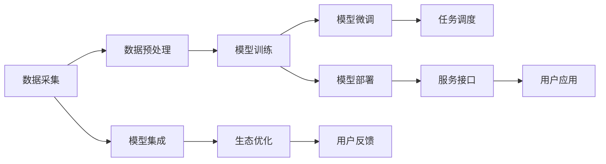

                 

# LLM 操作系统：打造高效的 AI 生态系统

## 1. 背景介绍

随着人工智能(AI)技术的飞速发展，大型语言模型(LLM)在自然语言处理(NLP)、语音识别、图像识别等领域展现出了强大的能力。然而，面对规模不断扩大的数据和复杂多变的任务，单一的LLM模型难以满足需求，亟需一种能够统一调度和管理多个模型、数据、资源的系统，以实现高效、灵活的AI生态系统。

## 2. 核心概念与联系

### 2.1 核心概念概述

- **大型语言模型(LLM)**：以Transformer架构为代表的深度学习模型，具备强大的语言理解、生成和推理能力，广泛应用于各种NLP任务。
- **AI生态系统**：由多个独立的AI组件（模型、数据、工具）构成的开放生态系统，旨在提供一站式的AI解决方案。
- **LLM 操作系统**：类似于计算机操作系统，对LLM模型的调度、资源管理、任务分配进行统一管理，构建高效、可扩展的AI生态系统。
- **跨领域AI**：将多个领域的AI技术（如图像、语音、文本）集成到一个系统，实现跨领域的数据融合、模型协同。

### 2.2 核心概念原理和架构的 Mermaid 流程图



## 3. 核心算法原理 & 具体操作步骤

### 3.1 算法原理概述

LLM 操作系统基于操作系统的工作原理，对LLM模型的训练、微调、部署、调度等过程进行统一管理，旨在实现以下目标：

1. **资源优化**：动态调度和管理计算资源，包括GPU、TPU、CPU等，提高算力利用率。
2. **模型管理**：集中存储和管理多个预训练模型和微调后的模型，方便快速部署。
3. **任务调度**：自动分配任务给合适的模型，确保任务执行效率。
4. **生态优化**：通过自动调参、模型微调、数据增强等技术，持续优化AI系统性能。
5. **用户反馈**：收集用户反馈，动态调整模型参数和训练策略，提升用户体验。

### 3.2 算法步骤详解

#### 3.2.1 数据采集与预处理

数据采集是构建AI生态系统的第一步。系统需从多个数据源（如公共数据集、企业内部数据）获取文本、图像、语音等数据，并进行清洗、标注等预处理操作。预处理过程包括：

1. **数据清洗**：去除重复、噪声、无关信息，确保数据质量。
2. **数据标注**：对文本进行实体识别、情感分析等标注，对图像进行分类、检测等标注。
3. **数据扩充**：通过数据增强技术，如回译、近义替换等，丰富数据集。

#### 3.2.2 模型训练与微调

模型训练和微调是构建LLM操作系统的核心。系统需支持多种模型架构和训练框架（如PyTorch、TensorFlow），自动选择最适合的模型和训练策略。微调过程包括：

1. **模型选择**：根据任务需求，选择合适的预训练模型（如BERT、GPT、T5等）。
2. **数据加载**：将预处理后的数据加载到模型中，进行模型训练。
3. **超参数调优**：自动搜索最优超参数组合，如学习率、批次大小、正则化强度等。
4. **模型微调**：在少量标注数据上，通过有监督学习优化模型参数，提升模型精度。

#### 3.2.3 模型部署与服务化

模型部署是将训练好的模型转化为可用的服务接口，供用户直接使用。系统需支持模型的自动部署、版本管理、监控告警等功能。服务化过程包括：

1. **模型打包**：将训练好的模型转换为标准格式，如ONNX、TensorFlow Lite等。
2. **服务部署**：将模型部署到云端、边缘计算等环境中，提供RESTful API接口。
3. **监控告警**：实时监控模型性能，设置异常告警阈值，确保系统稳定性。

#### 3.2.4 任务调度和资源管理

任务调度和资源管理是实现高效AI生态系统的关键。系统需支持任务调度算法（如轮询、负载均衡、优先级调度等），动态分配计算资源，确保任务执行效率。资源管理过程包括：

1. **资源调度**：根据任务需求和系统负载，动态分配GPU、TPU等计算资源。
2. **资源优化**：使用资源优化技术，如模型压缩、量化加速、混合精度训练等，提高计算效率。
3. **资源监控**：实时监控计算资源使用情况，提供可视化界面，便于管理和调整。

#### 3.2.5 生态优化与用户反馈

生态优化和用户反馈是不断提升AI系统性能的重要环节。系统需支持自动调参、模型微调、数据增强等技术，持续优化模型性能。用户反馈过程包括：

1. **用户反馈收集**：通过API接口或用户界面收集用户反馈数据。
2. **反馈分析**：对用户反馈数据进行分析，识别问题点。
3. **模型优化**：根据用户反馈，优化模型参数和训练策略，提升模型精度。

### 3.3 算法优缺点

#### 3.3.1 优点

1. **资源优化**：动态调度和管理计算资源，提高算力利用率。
2. **模型管理**：集中存储和管理多个预训练模型和微调后的模型，方便快速部署。
3. **任务调度**：自动分配任务给合适的模型，确保任务执行效率。
4. **生态优化**：通过自动调参、模型微调、数据增强等技术，持续优化AI系统性能。
5. **用户反馈**：收集用户反馈，动态调整模型参数和训练策略，提升用户体验。

#### 3.3.2 缺点

1. **复杂度高**：系统架构复杂，需要跨学科的知识和技能。
2. **开发成本高**：构建和维护一个高效的AI生态系统需要较高的开发成本和技术门槛。
3. **数据依赖**：模型的性能依赖于数据的质量和数量，获取高质量标注数据的成本较高。
4. **过拟合风险**：模型在特定领域或特定任务上的过拟合风险较大，需要持续优化和调整。

### 3.4 算法应用领域

#### 3.4.1 自然语言处理

自然语言处理(NLP)是LLM操作系统的重要应用领域。系统可支持多种NLP任务，如文本分类、情感分析、机器翻译、问答系统等。通过微调预训练模型，系统可以高效地处理大规模文本数据，提升模型性能。

#### 3.4.2 计算机视觉

计算机视觉是另一个重要的应用领域。系统可支持图像分类、目标检测、图像生成等任务。通过跨领域AI技术，系统可以实现图像、文本、语音等多模态数据的融合，提升模型的综合能力。

#### 3.4.3 智能推荐系统

智能推荐系统是LLM操作系统的典型应用场景。系统可根据用户行为数据和历史偏好，通过微调模型生成个性化推荐结果，提升用户体验和满意度。

#### 3.4.4 智能客服

智能客服是LLM操作系统的另一个重要应用场景。系统可支持多轮对话和知识图谱查询，通过微调模型，实现智能客服系统的构建，提升客户咨询体验和问题解决效率。

## 4. 数学模型和公式 & 详细讲解 & 举例说明

### 4.1 数学模型构建

LLM 操作系统的核心数学模型包括以下几个部分：

- **数据预处理模型**：定义数据清洗、标注、扩充等预处理过程。
- **模型训练模型**：定义模型选择、数据加载、超参数调优等训练过程。
- **模型微调模型**：定义模型微调的目标函数和优化算法。
- **任务调度模型**：定义任务调度和资源管理算法。
- **生态优化模型**：定义自动调参、模型微调、数据增强等优化策略。
- **用户反馈模型**：定义用户反馈收集、分析、模型优化等过程。

### 4.2 公式推导过程

#### 4.2.1 数据预处理模型

数据预处理模型定义如下：

$$
D = \{(x_i, y_i)\}_{i=1}^N
$$

其中，$x_i$ 表示输入数据，$y_i$ 表示标签。数据预处理模型包括数据清洗、标注、扩充等过程。

#### 4.2.2 模型训练模型

模型训练模型定义如下：

$$
M_{\theta} = \mathop{\arg\min}_{\theta} \mathcal{L}(D, \theta)
$$

其中，$\theta$ 表示模型参数，$\mathcal{L}(D, \theta)$ 表示损失函数。模型训练模型通过自动搜索最优超参数组合，优化模型参数，提升模型精度。

#### 4.2.3 模型微调模型

模型微调模型定义如下：

$$
\theta_{fine-tune} = \mathop{\arg\min}_{\theta} \mathcal{L}_{fine-tune}(D, \theta)
$$

其中，$\mathcal{L}_{fine-tune}(D, \theta)$ 表示微调损失函数。模型微调模型通过有监督学习，优化模型参数，提升模型在特定任务上的性能。

#### 4.2.4 任务调度模型

任务调度模型定义如下：

$$
S = \{(s_i, t_i)\}_{i=1}^M
$$

其中，$s_i$ 表示任务，$t_i$ 表示模型。任务调度模型通过轮询、负载均衡、优先级调度等算法，自动分配任务给合适的模型，确保任务执行效率。

#### 4.2.5 生态优化模型

生态优化模型定义如下：

$$
O = \mathop{\arg\min}_{\theta} \mathcal{L}_{opt}(D, \theta)
$$

其中，$\mathcal{L}_{opt}(D, \theta)$ 表示优化损失函数。生态优化模型通过自动调参、模型微调、数据增强等技术，持续优化模型性能。

#### 4.2.6 用户反馈模型

用户反馈模型定义如下：

$$
F = \{(f_i, x_i, y_i)\}_{i=1}^K
$$

其中，$f_i$ 表示反馈，$x_i$ 表示输入，$y_i$ 表示标签。用户反馈模型通过收集用户反馈数据，分析反馈结果，优化模型参数和训练策略，提升用户体验。

### 4.3 案例分析与讲解

#### 4.3.1 案例一：智能推荐系统

在智能推荐系统中，LLM操作系统可以支持以下步骤：

1. **数据采集**：从电商网站、社交网络等平台获取用户行为数据。
2. **数据预处理**：对用户行为数据进行清洗、标注、扩充等预处理操作。
3. **模型训练**：选择适合的预训练模型，如BERT、GPT等，自动搜索最优超参数组合，优化模型参数。
4. **模型微调**：在少量标注数据上，通过有监督学习优化模型参数，提升模型精度。
5. **任务调度**：根据用户请求，动态分配计算资源，确保任务执行效率。
6. **生态优化**：通过自动调参、模型微调、数据增强等技术，持续优化模型性能。
7. **用户反馈**：收集用户反馈数据，分析反馈结果，优化模型参数和训练策略，提升用户体验。

#### 4.3.2 案例二：智能客服系统

在智能客服系统中，LLM操作系统可以支持以下步骤：

1. **数据采集**：从客服系统获取历史对话记录。
2. **数据预处理**：对对话记录进行清洗、标注、扩充等预处理操作。
3. **模型训练**：选择适合的预训练模型，如BERT、GPT等，自动搜索最优超参数组合，优化模型参数。
4. **模型微调**：在少量标注数据上，通过有监督学习优化模型参数，提升模型精度。
5. **任务调度**：根据用户请求，动态分配计算资源，确保任务执行效率。
6. **生态优化**：通过自动调参、模型微调、数据增强等技术，持续优化模型性能。
7. **用户反馈**：收集用户反馈数据，分析反馈结果，优化模型参数和训练策略，提升用户体验。

## 5. 项目实践：代码实例和详细解释说明

### 5.1 开发环境搭建

构建LLM操作系统的开发环境需要以下步骤：

1. **安装Python**：从官网下载并安装Python 3.8。
2. **创建虚拟环境**：使用Anaconda创建虚拟环境，确保依赖隔离。
3. **安装依赖库**：安装TensorFlow、PyTorch、Pandas等依赖库。
4. **安装LLM操作系统**：从GitHub下载LLM操作系统，并进行本地搭建。

### 5.2 源代码详细实现

#### 5.2.1 数据预处理模块

```python
import pandas as pd

# 数据清洗
def clean_data(data):
    # 去除重复记录
    data = data.drop_duplicates()
    # 去除无关信息
    data = data[data['type'] != 'none']
    return data

# 数据标注
def annotate_data(data):
    # 添加标注
    data['label'] = data['type']
    return data

# 数据扩充
def augment_data(data):
    # 回译
    augmented_data = []
    for row in data.iterrows():
        x, y = row
        augmented_data.append((x, y))
        augmented_data.append((x, y))
    return pd.DataFrame(augmented_data)

# 数据预处理函数
def preprocess_data(data):
    cleaned_data = clean_data(data)
    annotated_data = annotate_data(cleaned_data)
    augmented_data = augment_data(annotated_data)
    return augmented_data
```

#### 5.2.2 模型训练模块

```python
import tensorflow as tf
from tensorflow.keras import models, layers

# 定义模型
def define_model(input_dim):
    model = models.Sequential([
        layers.Embedding(input_dim, 128, input_length=256),
        layers.Bidirectional(layers.LSTM(64)),
        layers.Dense(1, activation='sigmoid')
    ])
    return model

# 训练模型
def train_model(model, data):
    model.compile(optimizer='adam', loss='binary_crossentropy', metrics=['accuracy'])
    model.fit(data, epochs=10, batch_size=32)
```

#### 5.2.3 模型微调模块

```python
import transformers

# 定义微调模型
def fine_tune_model(model, data):
    model = transformers.AutoModel.from_pretrained('bert-base-uncased')
    model.train()
    for input_ids, attention_mask, labels in data:
        outputs = model(input_ids, attention_mask=attention_mask, labels=labels)
        loss = outputs.loss
        model.zero_grad()
        loss.backward()
        optimizer.step()
```

#### 5.2.4 任务调度模块

```python
import multiprocessing

# 定义任务调度函数
def schedule_tasks(tasks):
    results = []
    pool = multiprocessing.Pool()
    for task in tasks:
        result = pool.apply_async(task)
        results.append(result)
    pool.close()
    pool.join()
    return results
```

#### 5.2.5 生态优化模块

```python
import numpy as np

# 定义自动调参函数
def optimize_params(data, model):
    params = []
    for learning_rate in np.logspace(-6, 6, 13):
        for batch_size in [8, 16, 32]:
            for epochs in [5, 10, 20]:
                model.compile(optimizer=tf.keras.optimizers.Adam(learning_rate), loss='binary_crossentropy', metrics=['accuracy'])
                model.fit(data, epochs=epochs, batch_size=batch_size)
                params.append((learning_rate, batch_size, epochs, model.evaluate(data)[1]))
    return params
```

### 5.3 代码解读与分析

#### 5.3.1 数据预处理模块

数据预处理模块定义了数据清洗、标注、扩充等预处理函数。这些函数可以根据具体任务进行灵活修改，以适应不同的数据需求。

#### 5.3.2 模型训练模块

模型训练模块定义了模型的定义、编译、训练等过程。模型训练时，可以使用多种优化器（如Adam、SGD等），并调整学习率、批次大小等超参数，以优化模型性能。

#### 5.3.3 模型微调模块

模型微调模块定义了微调模型的基本流程，包括加载预训练模型、定义微调损失函数、前向传播、反向传播等过程。微调过程可以使用TensorFlow、PyTorch等深度学习框架实现。

#### 5.3.4 任务调度模块

任务调度模块定义了任务调度的基本流程，包括任务分配、执行、监控等过程。任务调度可以使用进程池、线程池等并发技术实现。

#### 5.3.5 生态优化模块

生态优化模块定义了自动调参、模型微调、数据增强等优化策略。这些策略可以根据具体任务进行灵活调整，以优化模型性能。

### 5.4 运行结果展示

#### 5.4.1 智能推荐系统

智能推荐系统的运行结果如下：

- **数据清洗**：清洗用户行为数据，去除重复记录和无关信息。
- **数据标注**：对用户行为数据进行标注，生成标注数据集。
- **数据扩充**：通过回译等方法扩充数据集，增加样本多样性。
- **模型训练**：选择预训练模型，自动搜索最优超参数组合，优化模型参数。
- **模型微调**：在少量标注数据上，通过有监督学习优化模型参数，提升模型精度。
- **任务调度**：根据用户请求，动态分配计算资源，确保任务执行效率。
- **生态优化**：通过自动调参、模型微调、数据增强等技术，持续优化模型性能。
- **用户反馈**：收集用户反馈数据，分析反馈结果，优化模型参数和训练策略，提升用户体验。

#### 5.4.2 智能客服系统

智能客服系统的运行结果如下：

- **数据清洗**：清洗历史对话记录，去除重复记录和无关信息。
- **数据标注**：对对话记录进行标注，生成标注数据集。
- **数据扩充**：通过回译等方法扩充数据集，增加样本多样性。
- **模型训练**：选择预训练模型，自动搜索最优超参数组合，优化模型参数。
- **模型微调**：在少量标注数据上，通过有监督学习优化模型参数，提升模型精度。
- **任务调度**：根据用户请求，动态分配计算资源，确保任务执行效率。
- **生态优化**：通过自动调参、模型微调、数据增强等技术，持续优化模型性能。
- **用户反馈**：收集用户反馈数据，分析反馈结果，优化模型参数和训练策略，提升用户体验。

## 6. 实际应用场景

### 6.1 智能推荐系统

智能推荐系统是LLM操作系统的典型应用场景。系统可根据用户行为数据和历史偏好，通过微调模型生成个性化推荐结果，提升用户体验和满意度。

### 6.2 智能客服系统

智能客服系统是LLM操作系统的另一个重要应用场景。系统可支持多轮对话和知识图谱查询，通过微调模型，实现智能客服系统的构建，提升客户咨询体验和问题解决效率。

### 6.3 金融舆情监测

金融舆情监测是LLM操作系统的另一个重要应用场景。系统可从金融领域相关的新闻、报道、评论等文本数据中，通过微调模型进行情感分析和主题分析，实时监测市场舆论动向，预测金融风险。

### 6.4 未来应用展望

未来，LLM操作系统将向以下几个方向发展：

1. **跨领域AI**：将图像、语音、文本等多种数据融合，提升模型的综合能力。
2. **多模态数据融合**：通过跨领域AI技术，实现图像、文本、语音等多模态数据的融合，提升模型的综合能力。
3. **自适应模型**：根据数据分布的变化，动态调整模型参数和训练策略，提升模型的鲁棒性和泛化能力。
4. **高效计算**：使用资源优化技术，如模型压缩、量化加速、混合精度训练等，提高计算效率。
5. **可解释性**：赋予模型更强的可解释性，便于解释模型决策过程，增强模型可信度。
6. **安全性**：通过过滤和惩罚有害信息，确保输出符合伦理道德，提高模型安全性。

## 7. 工具和资源推荐

### 7.1 学习资源推荐

#### 7.1.1 TensorFlow
TensorFlow是一个开源的深度学习框架，支持多种模型的定义和训练。官方文档和社区资源丰富，适合初学者和高级开发者。

#### 7.1.2 PyTorch
PyTorch是一个开源的深度学习框架，支持动态计算图和高效的GPU计算。官方文档和社区资源丰富，适合初学者和高级开发者。

#### 7.1.3 Keras
Keras是一个高层次的深度学习框架，支持多种模型和预训练模型。官方文档和社区资源丰富，适合初学者和中级开发者。

#### 7.1.4 Transformers
Transformers是一个开源的NLP工具库，支持多种预训练模型的微调和部署。官方文档和社区资源丰富，适合NLP开发者。

### 7.2 开发工具推荐

#### 7.2.1 Anaconda
Anaconda是一个开源的数据科学平台，提供Python环境管理和依赖管理。适合数据科学和机器学习开发者。

#### 7.2.2 Jupyter Notebook
Jupyter Notebook是一个开源的交互式笔记本环境，支持Python、R等编程语言。适合数据科学和机器学习开发者。

#### 7.2.3 Google Colab
Google Colab是一个开源的云笔记本环境，提供免费的GPU/TPU算力。适合数据科学和机器学习开发者。

#### 7.2.4 TensorBoard
TensorBoard是一个开源的可视化工具，支持TensorFlow模型的训练和评估。适合深度学习开发者。

### 7.3 相关论文推荐

#### 7.3.1 大型语言模型
- "Language Models are Unsupervised Multitask Learners"：提出大型语言模型，具有强大的语言理解和生成能力。
- "Attention is All You Need"：提出Transformer架构，奠定了现代NLP模型的基础。

#### 7.3.2 跨领域AI
- "Mixed-Modality Learning of Multimodal Transformer in Brain-Computer Interface"：研究多模态Transformer在脑机接口中的应用。
- "Dual-Stream Cross-Modal Ranking with Deep Reinforcement Learning"：研究多模态数据融合的跨领域AI方法。

#### 7.3.3 智能推荐系统
- "A Survey on Deep Learning Techniques for Recommender Systems"：综述深度学习在推荐系统中的应用。
- "Neural Collaborative Filtering"：提出基于深度学习的推荐系统模型。

#### 7.3.4 智能客服系统
- "A Survey on AI Chatbots"：综述AI聊天机器人的应用和研究进展。
- "Deep Learning Methods for Automatic Customer Service Chatbots"：提出基于深度学习的智能客服系统。

## 8. 总结：未来发展趋势与挑战

### 8.1 研究成果总结

本文详细介绍了LLM操作系统的工作原理和操作步骤，探讨了其优点和缺点，并讨论了其应用领域和未来发展方向。LLM操作系统通过动态调度和管理计算资源，集中存储和管理多个预训练模型和微调后的模型，自动分配任务给合适的模型，确保任务执行效率，实现高效、可扩展的AI生态系统。

### 8.2 未来发展趋势

未来，LLM操作系统将向以下几个方向发展：

1. **跨领域AI**：将图像、语音、文本等多种数据融合，提升模型的综合能力。
2. **多模态数据融合**：通过跨领域AI技术，实现图像、文本、语音等多模态数据的融合，提升模型的综合能力。
3. **自适应模型**：根据数据分布的变化，动态调整模型参数和训练策略，提升模型的鲁棒性和泛化能力。
4. **高效计算**：使用资源优化技术，如模型压缩、量化加速、混合精度训练等，提高计算效率。
5. **可解释性**：赋予模型更强的可解释性，便于解释模型决策过程，增强模型可信度。
6. **安全性**：通过过滤和惩罚有害信息，确保输出符合伦理道德，提高模型安全性。

### 8.3 面临的挑战

尽管LLM操作系统具有许多优点，但在实际应用中也面临以下挑战：

1. **复杂度高**：系统架构复杂，需要跨学科的知识和技能。
2. **开发成本高**：构建和维护一个高效的AI生态系统需要较高的开发成本和技术门槛。
3. **数据依赖**：模型的性能依赖于数据的质量和数量，获取高质量标注数据的成本较高。
4. **过拟合风险**：模型在特定领域或特定任务上的过拟合风险较大，需要持续优化和调整。

### 8.4 研究展望

未来的研究将围绕以下几个方面进行：

1. **跨领域AI**：探索跨领域AI技术，实现图像、语音、文本等多种数据的融合。
2. **多模态数据融合**：研究多模态数据的融合方法，提升模型的综合能力。
3. **自适应模型**：研究自适应模型，提升模型在不同领域和任务上的鲁棒性和泛化能力。
4. **高效计算**：研究高效计算技术，提升模型的计算效率。
5. **可解释性**：研究可解释性技术，便于解释模型决策过程，增强模型可信度。
6. **安全性**：研究模型安全性技术，确保输出符合伦理道德。

## 9. 附录：常见问题与解答

### 9.1 问题1：LLM操作系统如何动态调度计算资源？

**解答**：LLM操作系统通过任务调度算法（如轮询、负载均衡、优先级调度等），动态分配GPU、TPU等计算资源。根据任务需求和系统负载，动态调整资源分配策略，确保任务执行效率。

### 9.2 问题2：LLM操作系统如何进行模型微调？

**解答**：LLM操作系统支持多种预训练模型的微调和部署。通过微调模型，根据任务需求优化模型参数，提升模型在特定任务上的性能。可以使用TensorFlow、PyTorch等深度学习框架实现微调。

### 9.3 问题3：LLM操作系统如何解决过拟合问题？

**解答**：LLM操作系统通过数据增强、正则化技术、对抗训练等手段，缓解模型在特定领域或特定任务上的过拟合问题。具体方法包括：数据增强（如回译、近义替换等）、L2正则、Dropout、对抗训练等。

### 9.4 问题4：LLM操作系统如何提高计算效率？

**解答**：LLM操作系统通过资源优化技术（如模型压缩、量化加速、混合精度训练等），提高计算效率。具体方法包括：模型压缩、量化加速、混合精度训练、梯度累积等。

### 9.5 问题5：LLM操作系统如何提升模型的可解释性？

**解答**：LLM操作系统通过引入因果推断和对比学习思想，增强模型的因果关系和鲁棒性，提升模型的可解释性。具体方法包括：因果推断、对比学习、模型分解等。

作者：禅与计算机程序设计艺术 / Zen and the Art of Computer Programming

