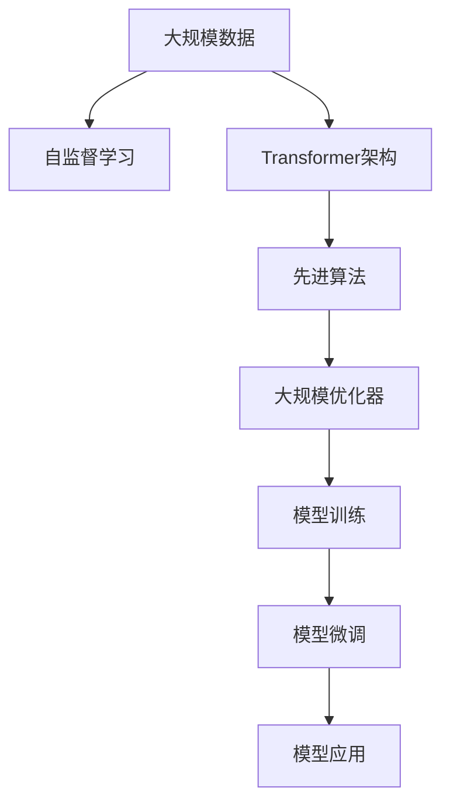

                 

# LLM 的训练：大规模数据和先进算法

> 关键词：大规模数据,先进算法,Transformer,深度学习,自然语言处理(NLP),预训练,自监督学习

## 1. 背景介绍

### 1.1 问题由来
近年来，大规模语言模型（LLM）在自然语言处理（NLP）领域取得了显著进展。这些模型通过在大规模文本数据上进行预训练，学习到丰富的语言知识和语义表示，从而在各种下游任务上取得了优异的表现。然而，训练和优化这些模型所需的大量数据和计算资源，限制了它们的应用范围。如何在有限的资源下，有效地训练和优化大规模语言模型，成为当前学术界和工业界共同关注的焦点。

### 1.2 问题核心关键点
本文将介绍如何在大规模数据和先进算法的支持下，训练和优化大规模语言模型。主要关注以下几个核心问题：
1. 如何利用大规模数据进行预训练和微调？
2. 如何在有限的计算资源下，优化模型参数？
3. 如何结合先进算法，提升模型性能？

## 2. 核心概念与联系

### 2.1 核心概念概述

为更好地理解本文内容，我们需要介绍几个关键概念：

- **大规模数据（Large-scale Data）**：指用于预训练大规模语言模型的海量文本数据。这些数据通常来自于大规模的网络爬取、公开数据集，以及专业领域的文本资源。
- **先进算法（Advanced Algorithm）**：指用于训练和优化大规模语言模型的先进技术，包括但不限于Transformer架构、自监督学习、大规模优化器等。
- **Transformer架构**：一种基于自注意力机制的深度学习模型，用于处理序列数据。Transformer通过多头自注意力和前馈神经网络进行信息传递和计算，成为现代深度学习模型的重要组成部分。
- **自监督学习（Self-Supervised Learning）**：一种无需标注数据的训练方法，通过设计预训练任务，利用数据本身蕴含的信息进行模型训练。
- **大规模优化器（Large-scale Optimizer）**：针对大规模模型参数，优化训练过程，提高模型收敛速度和稳定性。

这些概念之间相互联系，共同构成了大规模语言模型训练和优化的框架。大规模数据提供了丰富的学习素材，先进算法则通过高效、稳定的训练过程，将数据转化为模型知识。

### 2.2 核心概念原理和架构的 Mermaid 流程图



这个流程图展示了数据、算法和模型之间的关系：

1. 大规模数据经过自监督学习，生成预训练任务。
2. 预训练任务由Transformer架构进行信息传递和计算。
3. 先进算法优化模型训练过程，提高训练效率。
4. 大规模优化器提高模型参数更新的稳定性。
5. 模型训练和微调后，应用于实际任务。

## 3. 核心算法原理 & 具体操作步骤

### 3.1 算法原理概述

大规模语言模型的训练和优化，主要依赖于大规模数据和先进算法。通过在大规模数据上进行自监督预训练，模型能够学习到丰富的语言知识。随后，通过微调过程，将这些知识应用于具体的下游任务。

自监督学习的核心思想是利用无标注数据进行模型训练，通过预定义的任务设计，使得模型能够从数据中学习到有用的表示。常用的自监督学习任务包括语言模型预测、掩码语言模型预测、Next Sentence Prediction等。这些任务的目标是让模型预测数据中缺失的部分或后续的部分，从而推断出模型对语言的理解能力。

### 3.2 算法步骤详解

以下是大规模语言模型训练和优化的详细步骤：

**Step 1: 数据预处理**

1. **数据收集**：收集大规模文本数据，通常包括新闻、维基百科、社交媒体等多种来源的数据。数据量通常在数百GB至数千GB级别。
2. **数据清洗**：去除数据中的噪声、重复、错误等无用信息，确保数据质量。
3. **数据划分**：将数据划分为训练集、验证集和测试集。通常采用随机抽样或分层抽样方法。

**Step 2: 模型初始化**

1. **模型选择**：选择合适的预训练模型架构，如Transformer模型。
2. **模型初始化**：随机初始化模型参数，通常使用Glorot或He初始化方法。

**Step 3: 自监督预训练**

1. **任务设计**：设计自监督预训练任务，如掩码语言模型（Masked Language Model, MLM）、下一句预测（Next Sentence Prediction, NSP）等。
2. **模型训练**：在训练集上，使用先进算法如AdamW进行模型训练，学习预训练任务。
3. **验证调整**：在验证集上评估模型性能，根据需要调整训练超参数。

**Step 4: 模型微调**

1. **任务适配层**：根据下游任务，设计合适的输出层和损失函数。
2. **微调训练**：在微调集上，使用小学习率进行模型微调，更新模型参数。
3. **验证和测试**：在验证集和测试集上评估模型性能，确定最终模型。

**Step 5: 模型部署**

1. **模型保存**：将训练好的模型保存，以便后续使用。
2. **模型部署**：将模型集成到实际应用系统中，进行推理和预测。

### 3.3 算法优缺点

大规模语言模型的训练和优化方法具有以下优点：

1. **模型性能优异**：通过在大规模数据上进行预训练，模型能够学习到丰富的语言知识和语义表示，提升下游任务的表现。
2. **算法灵活性高**：自监督学习任务设计灵活，可以针对不同应用场景进行优化，提升模型适应性。
3. **计算资源可扩展**：现代计算资源丰富，可以通过分布式训练等方式，提高训练效率。

但同时，也存在以下缺点：

1. **数据依赖性强**：需要大量的数据进行预训练和微调，数据获取和处理成本高。
2. **计算资源需求大**：大规模模型参数量大，计算资源需求高。
3. **模型复杂度高**：先进算法和架构复杂，训练和微调难度大。

## 4. 数学模型和公式 & 详细讲解 & 举例说明

### 4.1 数学模型构建

在自监督预训练阶段，我们通常使用掩码语言模型（MLM）作为预训练任务。MLM的目标是让模型能够预测被掩码的单词。对于文本中的每个单词，以一定概率进行掩码，然后让模型预测掩码单词。

设文本序列为 $x = \{x_1, x_2, \ldots, x_n\}$，掩码概率为 $p$，掩码位置为 $m_i$，则MLM的目标函数为：

$$
\mathcal{L}_{MLM} = -\frac{1}{N} \sum_{i=1}^N \sum_{j=1}^n \log p_{\theta}(x_{m_i} | x_{<m_i}, x_{>m_i})
$$

其中，$p_{\theta}(x_{m_i} | x_{<m_i}, x_{>m_i})$ 表示在给定上下文的情况下，模型预测被掩码单词的概率。

在微调阶段，我们通常使用分类任务进行微调。假设下游任务为分类任务，输入为 $x$，输出为 $y$，模型输出为 $p(y | x)$，则交叉熵损失函数为：

$$
\mathcal{L}_{CLS} = -\frac{1}{N} \sum_{i=1}^N \sum_{j=1}^n \log p(y_j | x_j)
$$

### 4.2 公式推导过程

以下对MLM和交叉熵损失函数进行详细推导。

**掩码语言模型（MLM）**

MLM的目标函数可以通过最大化上下文与预测单词的条件概率来推导。设单词 $x_i$ 的掩码概率为 $p$，则有：

$$
\mathcal{L}_{MLM} = -\frac{1}{N} \sum_{i=1}^N \sum_{j=1}^n \log \frac{\exp(p_{\theta}(x_{m_i} | x_{<m_i}, x_{>m_i}))}{\sum_k \exp(p_{\theta}(x_k | x_{<m_i}, x_{>m_i}))}
$$

利用softmax函数的性质，可以进一步简化为：

$$
\mathcal{L}_{MLM} = -\frac{1}{N} \sum_{i=1}^N \sum_{j=1}^n \log p_{\theta}(x_{m_i} | x_{<m_i}, x_{>m_i})
$$

**交叉熵损失函数**

交叉熵损失函数是分类任务中最常用的损失函数，其推导过程如下：

设分类任务有 $C$ 个类别，模型输出为 $p(y | x)$，则交叉熵损失函数为：

$$
\mathcal{L}_{CLS} = -\frac{1}{N} \sum_{i=1}^N \sum_{j=1}^n \log p(y_j | x_j) = -\frac{1}{N} \sum_{i=1}^N \sum_{j=1}^n [y_j \log p_{\theta}(y_j | x_j) + (1 - y_j) \log (1 - p_{\theta}(y_j | x_j))]
$$

### 4.3 案例分析与讲解

以BERT模型为例，展示其在掩码语言模型（MLM）和分类任务上的应用。

**BERT模型**

BERT模型是一种基于Transformer架构的预训练语言模型。其核心思想是在大规模无标签数据上，通过自监督预训练学习语言表示，然后在下游任务上使用微调进行适配。

BERT模型的预训练任务包括掩码语言模型（MLM）和下一句预测（NSP）。MLM的目标是让模型预测被掩码的单词，而NSP的目标是让模型预测两个句子是否是连续的。

在微调阶段，我们通常使用分类任务进行微调。以情感分析任务为例，输入为一段文本，输出为情感标签（如正面、负面、中性）。模型输出为每个类别的概率分布，损失函数为交叉熵损失函数。

### 5. 项目实践：代码实例和详细解释说明

### 5.1 开发环境搭建

在进行大规模语言模型训练和优化时，我们需要准备以下开发环境：

1. **安装Anaconda**：从官网下载并安装Anaconda，用于创建独立的Python环境。
2. **创建并激活虚拟环境**：
```bash
conda create -n pytorch-env python=3.8 
conda activate pytorch-env
```
3. **安装PyTorch**：根据CUDA版本，从官网获取对应的安装命令。例如：
```bash
conda install pytorch torchvision torchaudio cudatoolkit=11.1 -c pytorch -c conda-forge
```
4. **安装Transformer库**：
```bash
pip install transformers
```
5. **安装各类工具包**：
```bash
pip install numpy pandas scikit-learn matplotlib tqdm jupyter notebook ipython
```

完成上述步骤后，即可在`pytorch-env`环境中开始项目实践。

### 5.2 源代码详细实现

以下以BERT模型为例，展示其在大规模语言模型训练和优化中的代码实现。

**预训练阶段**

```python
from transformers import BertForMaskedLM, AdamW

# 加载预训练模型
model = BertForMaskedLM.from_pretrained('bert-base-cased')

# 定义训练器
optimizer = AdamW(model.parameters(), lr=2e-5)

# 定义训练数据
# 这里假设已经收集到了大规模文本数据，进行了数据预处理和划分

# 训练循环
for epoch in range(epochs):
    for batch in train_loader:
        inputs = batch['input_ids']
        labels = batch['masked_lm_labels']
        
        # 前向传播
        outputs = model(inputs, labels=labels)
        loss = outputs.loss
        
        # 反向传播和参数更新
        optimizer.zero_grad()
        loss.backward()
        optimizer.step()
        
    # 验证集评估
    if epoch % 10 == 0:
        print(f"Epoch {epoch}, validation loss: {val_loss:.4f}")
```

**微调阶段**

```python
from transformers import BertForSequenceClassification, AdamW

# 加载微调模型
model = BertForSequenceClassification.from_pretrained('bert-base-cased', num_labels=num_labels)

# 定义训练器
optimizer = AdamW(model.parameters(), lr=1e-5)

# 定义训练数据
# 这里假设已经收集到了下游任务的标注数据，进行了数据预处理和划分

# 训练循环
for epoch in range(epochs):
    for batch in train_loader:
        inputs = batch['input_ids']
        labels = batch['labels']
        
        # 前向传播
        outputs = model(inputs, labels=labels)
        loss = outputs.loss
        
        # 反向传播和参数更新
        optimizer.zero_grad()
        loss.backward()
        optimizer.step()
        
    # 验证集评估
    if epoch % 10 == 0:
        print(f"Epoch {epoch}, validation accuracy: {val_accuracy:.4f}")
```

### 5.3 代码解读与分析

**预训练阶段**

在预训练阶段，我们使用掩码语言模型（MLM）作为预训练任务，利用大规模无标签数据进行模型训练。具体实现中，我们通过定义预训练模型、训练器和训练数据，循环执行前向传播、损失计算、反向传播和参数更新等步骤，进行模型训练。

**微调阶段**

在微调阶段，我们根据下游任务，设计合适的输出层和损失函数。具体实现中，我们通过定义微调模型、训练器和微调数据，循环执行前向传播、损失计算、反向传播和参数更新等步骤，进行模型微调。

### 5.4 运行结果展示

在预训练和微调完成后，我们可以通过评估数据集来验证模型的性能。具体实现中，我们可以通过计算准确率、精确率、召回率等指标，评估模型的分类性能。

## 6. 实际应用场景

### 6.1 智能客服系统

智能客服系统是一种典型的下游任务，通过大规模语言模型进行微调，可以实现自动响应客户咨询，提升客服效率和质量。

在智能客服系统中，我们可以收集历史客服对话记录，将问题和最佳答复构建成监督数据，进行微调。微调后的模型能够自动理解客户意图，匹配最合适的答复模板，提升客户满意度。

### 6.2 金融舆情监测

金融舆情监测是另一个典型的下游任务，通过大规模语言模型进行微调，可以实现实时监测市场舆情，及时应对潜在风险。

在金融舆情监测中，我们可以收集金融领域相关的新闻、报道、评论等文本数据，进行预训练和微调。微调后的模型能够自动判断文本属于何种主题，情感倾向是正面、中性还是负面。将微调后的模型应用到实时抓取的网络文本数据，能够及时发现舆情变化，帮助金融机构快速应对潜在风险。

### 6.3 个性化推荐系统

个性化推荐系统是另一种常见的下游任务，通过大规模语言模型进行微调，可以实现个性化推荐，提升用户体验。

在个性化推荐系统中，我们可以收集用户浏览、点击、评论、分享等行为数据，提取和用户交互的物品标题、描述、标签等文本内容。将文本内容作为模型输入，用户的后续行为（如是否点击、购买等）作为监督信号，进行微调。微调后的模型能够从文本内容中准确把握用户的兴趣点，生成个性化推荐列表，提升用户满意度。

### 6.4 未来应用展望

随着大规模语言模型和微调方法的不断发展，未来的应用场景将更加广泛。以下列举几个未来可能的应用场景：

1. **医疗诊断系统**：通过大规模语言模型进行微调，实现自动病历分析、病理诊断等功能，提升医疗服务的智能化水平。
2. **智能教育平台**：通过大规模语言模型进行微调，实现自动作业批改、学情分析、知识推荐等功能，因材施教，促进教育公平。
3. **智能交通系统**：通过大规模语言模型进行微调，实现自动驾驶语音交互、智能路况监测等功能，提高交通管理的自动化和智能化水平。
4. **智慧能源系统**：通过大规模语言模型进行微调，实现智能电网分析、能源需求预测等功能，优化能源配置，提高能源利用效率。
5. **社交媒体分析**：通过大规模语言模型进行微调，实现舆情监测、用户情感分析等功能，提升社交媒体平台的用户体验。

## 7. 工具和资源推荐

### 7.1 学习资源推荐

为帮助开发者系统掌握大规模语言模型训练和优化的理论基础和实践技巧，以下是一些优质的学习资源：

1. **《深度学习与自然语言处理》**：一本介绍深度学习和自然语言处理基本概念和技术的经典书籍，适合初学者入门。
2. **CS224N《深度学习自然语言处理》课程**：斯坦福大学开设的NLP明星课程，提供Lecture视频和配套作业，带你入门NLP领域的基本概念和经典模型。
3. **《自然语言处理入门》**：由大模型技术专家撰写，深入浅出地介绍了自然语言处理的基本概念和前沿技术。
4. **Transformers官方文档**：提供丰富的预训练语言模型和微调样例代码，是上手实践的必备资料。
5. **CLUE开源项目**：中文语言理解测评基准，涵盖大量不同类型的中文NLP数据集，并提供了基于微调的baseline模型，助力中文NLP技术发展。

通过对这些资源的学习实践，相信你一定能够快速掌握大规模语言模型训练和优化的精髓，并用于解决实际的NLP问题。

### 7.2 开发工具推荐

高效的开发离不开优秀的工具支持。以下是几款用于大规模语言模型训练和优化的常用工具：

1. **PyTorch**：基于Python的开源深度学习框架，灵活动态的计算图，适合快速迭代研究。
2. **TensorFlow**：由Google主导开发的开源深度学习框架，生产部署方便，适合大规模工程应用。
3. **Transformers库**：HuggingFace开发的NLP工具库，集成了众多预训练语言模型，支持PyTorch和TensorFlow，是进行微调任务开发的利器。
4. **Weights & Biases**：模型训练的实验跟踪工具，可以记录和可视化模型训练过程中的各项指标，方便对比和调优。
5. **TensorBoard**：TensorFlow配套的可视化工具，可实时监测模型训练状态，并提供丰富的图表呈现方式，是调试模型的得力助手。
6. **Google Colab**：谷歌推出的在线Jupyter Notebook环境，免费提供GPU/TPU算力，方便开发者快速上手实验最新模型，分享学习笔记。

合理利用这些工具，可以显著提升大规模语言模型训练和优化的开发效率，加快创新迭代的步伐。

### 7.3 相关论文推荐

以下是几篇奠基性的相关论文，推荐阅读：

1. **Attention is All You Need**：提出了Transformer结构，开启了NLP领域的预训练大模型时代。
2. **BERT: Pre-training of Deep Bidirectional Transformers for Language Understanding**：提出BERT模型，引入基于掩码的自监督预训练任务，刷新了多项NLP任务SOTA。
3. **Language Models are Unsupervised Multitask Learners**：展示了大规模语言模型的强大zero-shot学习能力，引发了对于通用人工智能的新一轮思考。
4. **Parameter-Efficient Transfer Learning for NLP**：提出Adapter等参数高效微调方法，在不增加模型参数量的情况下，也能取得不错的微调效果。
5. **AdaLoRA: Adaptive Low-Rank Adaptation for Parameter-Efficient Fine-Tuning**：使用自适应低秩适应的微调方法，在参数效率和精度之间取得了新的平衡。

这些论文代表了大规模语言模型训练和优化的发展脉络。通过学习这些前沿成果，可以帮助研究者把握学科前进方向，激发更多的创新灵感。

## 8. 总结：未来发展趋势与挑战

### 8.1 研究成果总结

本文对大规模语言模型的训练和优化进行了全面系统的介绍。主要关注以下几个方面：

1. **大规模数据和先进算法**：介绍了如何利用大规模数据和先进算法进行预训练和微调，提升模型性能。
2. **Transformer架构**：详细讲解了Transformer架构的原理和应用，展示了其在自然语言处理中的重要作用。
3. **自监督学习任务**：设计了掩码语言模型（MLM）等自监督学习任务，解释了其训练过程和效果。
4. **优化器和大规模训练**：介绍了AdamW等大规模优化器的应用，展示了其在训练过程中的优势。
5. **微调方法和任务适配**：介绍了分类任务等微调方法，展示了其训练过程和效果。

### 8.2 未来发展趋势

展望未来，大规模语言模型训练和优化将呈现以下几个发展趋势：

1. **模型规模持续增大**：随着算力成本的下降和数据规模的扩张，预训练语言模型的参数量还将持续增长。超大规模语言模型蕴含的丰富语言知识，有望支撑更加复杂多变的下游任务微调。
2. **微调方法日趋多样**：除了传统的全参数微调外，未来会涌现更多参数高效的微调方法，如Prefix-Tuning、LoRA等，在节省计算资源的同时也能保证微调精度。
3. **持续学习成为常态**：随着数据分布的不断变化，微调模型也需要持续学习新知识以保持性能。如何在不遗忘原有知识的同时，高效吸收新样本信息，将成为重要的研究课题。
4. **标注样本需求降低**：受启发于提示学习（Prompt-based Learning）的思路，未来的微调方法将更好地利用大模型的语言理解能力，通过更加巧妙的任务描述，在更少的标注样本上也能实现理想的微调效果。
5. **多模态微调崛起**：当前的微调主要聚焦于纯文本数据，未来会进一步拓展到图像、视频、语音等多模态数据微调。多模态信息的融合，将显著提升语言模型对现实世界的理解和建模能力。
6. **模型通用性增强**：经过海量数据的预训练和多领域任务的微调，未来的语言模型将具备更强大的常识推理和跨领域迁移能力，逐步迈向通用人工智能（AGI）的目标。

以上趋势凸显了大规模语言模型训练和优化的广阔前景。这些方向的探索发展，必将进一步提升NLP系统的性能和应用范围，为人类认知智能的进化带来深远影响。

### 8.3 面临的挑战

尽管大规模语言模型训练和优化已经取得了显著进展，但在迈向更加智能化、普适化应用的过程中，仍面临诸多挑战：

1. **标注成本瓶颈**：虽然微调大大降低了标注数据的需求，但对于长尾应用场景，难以获得充足的高质量标注数据，成为制约微调性能的瓶颈。如何进一步降低微调对标注样本的依赖，将是一大难题。
2. **模型鲁棒性不足**：当前微调模型面对域外数据时，泛化性能往往大打折扣。对于测试样本的微小扰动，微调模型的预测也容易发生波动。如何提高微调模型的鲁棒性，避免灾难性遗忘，还需要更多理论和实践的积累。
3. **推理效率有待提高**：大规模语言模型虽然精度高，但在实际部署时往往面临推理速度慢、内存占用大等效率问题。如何在保证性能的同时，简化模型结构，提升推理速度，优化资源占用，将是重要的优化方向。
4. **可解释性亟需加强**：当前微调模型更像是"黑盒"系统，难以解释其内部工作机制和决策逻辑。对于医疗、金融等高风险应用，算法的可解释性和可审计性尤为重要。如何赋予微调模型更强的可解释性，将是亟待攻克的难题。
5. **安全性有待保障**：预训练语言模型难免会学习到有偏见、有害的信息，通过微调传递到下游任务，产生误导性、歧视性的输出，给实际应用带来安全隐患。如何从数据和算法层面消除模型偏见，避免恶意用途，确保输出的安全性，也将是重要的研究课题。
6. **知识整合能力不足**：现有的微调模型往往局限于任务内数据，难以灵活吸收和运用更广泛的先验知识。如何让微调过程更好地与外部知识库、规则库等专家知识结合，形成更加全面、准确的信息整合能力，还有很大的想象空间。

正视微调面临的这些挑战，积极应对并寻求突破，将是大规模语言模型训练和优化走向成熟的必由之路。相信随着学界和产业界的共同努力，这些挑战终将一一被克服，大规模语言模型训练和优化必将在构建人机协同的智能时代中扮演越来越重要的角色。

### 8.4 研究展望

面对大规模语言模型训练和优化所面临的挑战，未来的研究需要在以下几个方面寻求新的突破：

1. **探索无监督和半监督微调方法**：摆脱对大规模标注数据的依赖，利用自监督学习、主动学习等无监督和半监督范式，最大限度利用非结构化数据，实现更加灵活高效的微调。
2. **研究参数高效和计算高效的微调范式**：开发更加参数高效的微调方法，在固定大部分预训练参数的同时，只更新极少量的任务相关参数。同时优化微调模型的计算图，减少前向传播和反向传播的资源消耗，实现更加轻量级、实时性的部署。
3. **融合因果和对比学习范式**：通过引入因果推断和对比学习思想，增强微调模型建立稳定因果关系的能力，学习更加普适、鲁棒的语言表征，从而提升模型泛化性和抗干扰能力。
4. **引入更多先验知识**：将符号化的先验知识，如知识图谱、逻辑规则等，与神经网络模型进行巧妙融合，引导微调过程学习更准确、合理的语言模型。同时加强不同模态数据的整合，实现视觉、语音等多模态信息与文本信息的协同建模。
5. **结合因果分析和博弈论工具**：将因果分析方法引入微调模型，识别出模型决策的关键特征，增强输出解释的因果性和逻辑性。借助博弈论工具刻画人机交互过程，主动探索并规避模型的脆弱点，提高系统稳定性。
6. **纳入伦理道德约束**：在模型训练目标中引入伦理导向的评估指标，过滤和惩罚有偏见、有害的输出倾向。同时加强人工干预和审核，建立模型行为的监管机制，确保输出符合人类价值观和伦理道德。

这些研究方向的探索，必将引领大规模语言模型训练和优化技术迈向更高的台阶，为构建安全、可靠、可解释、可控的智能系统铺平道路。面向未来，大规模语言模型训练和优化技术还需要与其他人工智能技术进行更深入的融合，如知识表示、因果推理、强化学习等，多路径协同发力，共同推动自然语言理解和智能交互系统的进步。只有勇于创新、敢于突破，才能不断拓展语言模型的边界，让智能技术更好地造福人类社会。

## 9. 附录：常见问题与解答

**Q1：大规模数据对训练和优化模型有何影响？**

A: 大规模数据对训练和优化模型有以下影响：

1. **提升模型性能**：大规模数据提供了丰富的学习素材，使得模型能够学习到更多的语言知识和语义表示，从而提升模型性能。
2. **降低过拟合风险**：大量数据能够有效降低模型的过拟合风险，使得模型在实际应用中表现更加稳定。
3. **增强泛化能力**：大规模数据能够提升模型的泛化能力，使得模型能够更好地适应新的数据分布。

**Q2：如何选择合适的自监督学习任务？**

A: 选择合适的自监督学习任务是预训练阶段的重要步骤。一般来说，我们需要选择能够最大化信息量的任务，以提升模型的表示能力。常用的自监督学习任务包括：

1. **掩码语言模型（MLM）**：通过预测被掩码的单词，学习语言的概率分布。
2. **下一句预测（NSP）**：通过判断两个句子是否是连续的，学习语义相关性。
3. **单词频率预测**：通过预测单词的出现频率，学习单词的分布特性。
4. **句子长度预测**：通过预测句子的长度，学习句子的结构信息。
5. **句子情感分类**：通过预测句子的情感极性，学习句子的情感表达能力。

**Q3：如何选择合适的大规模优化器？**

A: 选择合适的优化器是训练阶段的重要步骤。一般来说，我们需要选择能够快速收敛、稳定更新的优化器。常用的大规模优化器包括：

1. **AdamW**：是一种自适应学习率优化器，能够自适应调整每个参数的学习率，适用于大规模模型。
2. **SGD**：是一种基于梯度下降的优化器，适用于各种模型和任务。
3. **Adafactor**：是一种自适应学习率优化器，能够自适应调整每个参数的学习率，适用于大规模模型。
4. **LAMB**：是一种自适应学习率优化器，适用于大规模模型和高精度计算场景。

**Q4：如何缓解微调过程中的过拟合问题？**

A: 过拟合是微调过程中常见的问题。缓解过拟合的方法包括：

1. **数据增强**：通过回译、近义替换等方式扩充训练集。
2. **正则化技术**：使用L2正则、Dropout、Early Stopping等防止模型过度适应小规模训练集。
3. **对抗训练**：引入对抗样本，提高模型鲁棒性。
4. **参数高效微调**：只调整少量参数（如Adapter、Prefix等），减小过拟合风险。
5. **多模型集成**：训练多个微调模型，取平均输出，抑制过拟合。

**Q5：如何在有限资源下训练大规模语言模型？**

A: 在有限资源下训练大规模语言模型，可以采取以下措施：

1. **分布式训练**：利用多台机器进行并行训练，提高训练效率。
2. **混合精度训练**：使用混合精度（如FP16）进行训练，减少内存占用。
3. **梯度累积**：通过梯度累积（如accumulate_grads）减少每次更新步数，加速收敛。
4. **模型裁剪和压缩**：通过模型裁剪和参数压缩技术，减小模型尺寸，提高训练和推理效率。

通过上述措施，可以在有限的资源下，有效地训练和优化大规模语言模型，提升模型性能。

**Q6：如何提高微调模型的鲁棒性？**

A: 提高微调模型的鲁棒性，可以采取以下措施：

1. **数据增强**：通过回译、近义替换等方式扩充训练集。
2. **正则化技术**：使用L2正则、Dropout、Early Stopping等防止模型过度适应小规模训练集。
3. **对抗训练**：引入对抗样本，提高模型鲁棒性。
4. **参数高效微调**：只调整少量参数（如Adapter、Prefix等），减小过拟合风险。
5. **多模型集成**：训练多个微调模型，取平均输出，抑制过拟合。

通过上述措施，可以在有限的资源下，有效地训练和优化大规模语言模型，提升模型性能。

**Q7：如何提高微调模型的推理效率？**

A: 提高微调模型的推理效率，可以采取以下措施：

1. **模型裁剪和压缩**：通过模型裁剪和参数压缩技术，减小模型尺寸，提高推理效率。
2. **混合精度训练**：使用混合精度（如FP16）进行训练，减少内存占用。
3. **模型量化**：通过量化技术（如整数量化）减小模型参数的位数，提高推理速度。
4. **优化器选择**：选择高效优化器（如AdamW）进行训练，提高收敛速度。

通过上述措施，可以在有限的资源下，有效地训练和优化大规模语言模型，提升模型性能。

**Q8：如何提高微调模型的可解释性？**

A: 提高微调模型的可解释性，可以采取以下措施：

1. **特征重要性分析**：通过特征重要性分析（如SHAP、LIME），解释模型的决策过程。
2. **因果分析**：引入因果分析方法，识别出模型决策的关键特征，增强输出解释的因果性和逻辑性。
3. **知识图谱融合**：将符号化的先验知识，如知识图谱、逻辑规则等，与神经网络模型进行巧妙融合，提高模型可解释性。
4. **模型可视化**：通过模型可视化工具（如TensorBoard），展示模型内部状态和推理过程。

通过上述措施，可以提高微调模型的可解释性，帮助用户理解和调试模型。

---

作者：禅与计算机程序设计艺术 / Zen and the Art of Computer Programming

