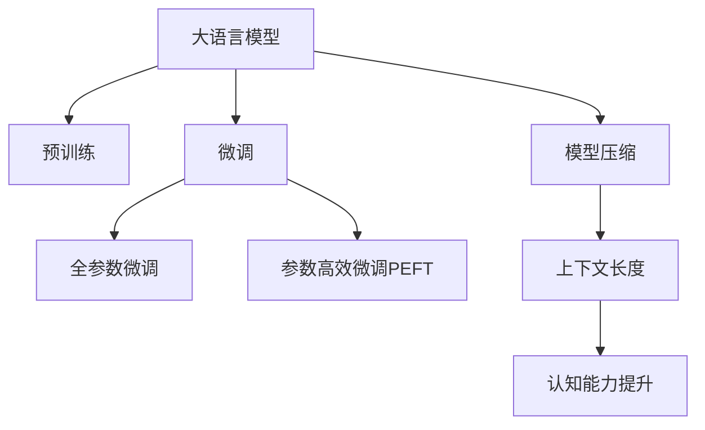

                 

# LLM上下文长度再升级:认知能力提升

> 关键词：上下文长度, LLM, 认知能力, 预训练, 微调, 模型压缩

## 1. 背景介绍

随着大语言模型(Large Language Model, LLM)在自然语言处理(Natural Language Processing, NLP)领域取得显著进展，模型的上下文长度(Context Length)成为了影响其认知能力(Cognitive Ability)的关键因素。在预训练和微调过程中，增加模型的上下文长度，可以有效提升其长距离依赖建模和推理能力。本文将深入探讨LLM上下文长度的优化方法，分析其在提升认知能力方面的效果，并提出具体实施策略，为NLP应用的进一步拓展提供参考。

## 2. 核心概念与联系

### 2.1 核心概念概述

为更好地理解上下文长度与LLM认知能力的关系，本节将介绍几个密切相关的核心概念：

- 大语言模型(Large Language Model, LLM)：以自回归(如GPT)或自编码(如BERT)模型为代表的大规模预训练语言模型。通过在大规模无标签文本语料上进行预训练，学习通用的语言表示，具备强大的语言理解和生成能力。

- 预训练(Pre-training)：指在大规模无标签文本语料上，通过自监督学习任务训练通用语言模型的过程。常见的预训练任务包括言语建模、遮挡语言模型等。预训练使得模型学习到语言的通用表示。

- 微调(Fine-tuning)：指在预训练模型的基础上，使用下游任务的少量标注数据，通过有监督学习优化模型在特定任务上的性能。通常只需要调整顶层分类器或解码器，并以较小的学习率更新全部或部分的模型参数。

- 模型压缩(Model Compression)：通过移除冗余参数、量化等技术，降低模型规模，减少计算和存储资源消耗，以适应特定场景或硬件限制的方法。

- 上下文长度(Context Length)：指模型在单次输入中能够处理的文本长度。增加上下文长度，可以帮助模型更好地捕捉长距离依赖和上下文信息。

这些核心概念之间的逻辑关系可以通过以下Mermaid流程图来展示：



这个流程图展示了大语言模型的核心概念及其之间的关系：

1. 大语言模型通过预训练获得基础能力。
2. 微调是对预训练模型进行任务特定的优化，可以分为全参数微调和参数高效微调（PEFT）。
3. 模型压缩用于降低模型规模，减少计算和存储资源消耗。
4. 上下文长度增加，提升模型的认知能力，即长距离依赖建模和推理能力。

这些概念共同构成了大语言模型的学习和应用框架，使其能够在各种场景下发挥强大的语言理解和生成能力。通过理解这些核心概念，我们可以更好地把握大语言模型的工作原理和优化方向。

## 3. 核心算法原理 & 具体操作步骤
### 3.1 算法原理概述

在预训练和微调过程中，增加大语言模型的上下文长度，可以有效提升其对长距离依赖的建模和推理能力。这是因为，长上下文长度可以帮助模型更好地理解语义关系，识别出句子中的关键实体和概念，从而更准确地进行预测和推理。

形式化地，假设预训练模型为 $M_{\theta}$，其中 $\theta$ 为预训练得到的模型参数。设模型在输入长度为 $L$ 的文本 $x$ 上的上下文表示为 $h(x)$，则上下文长度与认知能力的关系可以表示为：

$$
C(L) = f(h(L))
$$

其中 $f$ 为认知能力的计算函数，$h(L)$ 表示模型对长度为 $L$ 的输入文本 $x$ 的上下文表示。增加上下文长度 $L$，可以显著提升 $h(L)$ 的质量，进而提高认知能力 $C(L)$。

### 3.2 算法步骤详解

基于上下文长度提升认知能力的大语言模型微调，一般包括以下几个关键步骤：

**Step 1: 准备预训练模型和数据集**
- 选择合适的预训练语言模型 $M_{\theta}$ 作为初始化参数，如 BERT、GPT 等。
- 准备下游任务 $T$ 的标注数据集 $D$，划分为训练集、验证集和测试集。一般要求标注数据与预训练数据的分布不要差异过大。

**Step 2: 添加上下文长度控制层**
- 在预训练模型的输入层增加控制上下文长度的机制，如动态截断、掩码机制等。
- 对于自编码模型，可以使用掩码语言模型（Masked Language Model, MLM）等自监督任务进行预训练。

**Step 3: 设置上下文长度和认知能力评估指标**
- 定义上下文长度 $L$ 和认知能力评估指标，如F1分数、BLEU分数等。
- 设定上下文长度 $L$ 的增长策略，如指数增长、线性增长等。

**Step 4: 执行梯度训练**
- 将训练集数据分批次输入模型，前向传播计算认知能力指标。
- 反向传播计算参数梯度，根据设定的优化算法和学习率更新模型参数。
- 周期性在验证集上评估模型性能，根据性能指标决定是否触发Early Stopping。
- 重复上述步骤直至满足预设的迭代轮数或 Early Stopping 条件。

**Step 5: 测试和部署**
- 在测试集上评估微调后模型 $M_{\hat{\theta}}$ 的认知能力，对比微调前后的性能提升。
- 使用微调后的模型对新样本进行推理预测，集成到实际的应用系统中。

以上是基于上下文长度提升认知能力的大语言模型微调的一般流程。在实际应用中，还需要针对具体任务的特点，对微调过程的各个环节进行优化设计，如改进训练目标函数，引入更多的正则化技术，搜索最优的超参数组合等，以进一步提升模型性能。

### 3.3 算法优缺点

增加上下文长度提升认知能力的方法具有以下优点：
1. 提升长距离依赖建模能力。通过增加上下文长度，模型可以更好地理解句子中的长依赖关系，从而提高其推理和预测的准确性。
2. 增强上下文信息利用。增加上下文长度，可以更好地捕捉句子中的上下文信息，提升模型的语言理解和生成能力。
3. 减少过拟合风险。较大的上下文长度可以帮助模型更好地泛化，减少过拟合风险。

同时，该方法也存在一定的局限性：
1. 计算资源消耗大。较大的上下文长度需要更多的计算资源，包括内存和显存。
2. 训练时间较长。增加上下文长度，会增加训练时间。
3. 数据标注成本高。对于长上下文长度，需要更多的标注数据，增加了标注成本。
4. 模型复杂度增加。增加上下文长度，需要更复杂的模型结构，可能导致模型的训练和推理效率下降。

尽管存在这些局限性，但就目前而言，增加上下文长度仍然是提升大语言模型认知能力的有效方法。未来相关研究的重点在于如何进一步优化上下文长度与计算资源、标注成本、模型效率之间的平衡，同时兼顾模型的长距离依赖建模能力。

### 3.4 算法应用领域

增加上下文长度提升认知能力的大语言模型微调方法，在NLP领域已经得到了广泛的应用，覆盖了几乎所有常见任务，例如：

- 文本分类：如情感分析、主题分类、意图识别等。通过增加上下文长度，模型可以更好地理解文本的语义关系，提高分类准确性。
- 命名实体识别：识别文本中的人名、地名、机构名等特定实体。增加上下文长度，可以更好地捕捉实体边界和类型信息。
- 关系抽取：从文本中抽取实体之间的语义关系。通过增加上下文长度，模型可以更好地识别出句子中的关键实体和关系。
- 问答系统：对自然语言问题给出答案。增加上下文长度，可以更好地理解问题上下文，提高回答的准确性和相关性。
- 机器翻译：将源语言文本翻译成目标语言。通过增加上下文长度，模型可以更好地理解句子中的语义关系，提高翻译质量。
- 文本摘要：将长文本压缩成简短摘要。通过增加上下文长度，模型可以更好地把握文本的关键信息，提高摘要质量。
- 对话系统：使机器能够与人自然对话。增加上下文长度，可以更好地理解对话历史，提高回复的连贯性和准确性。

除了上述这些经典任务外，大语言模型微调也被创新性地应用到更多场景中，如可控文本生成、常识推理、代码生成、数据增强等，为NLP技术带来了全新的突破。随着预训练模型和微调方法的不断进步，相信基于上下文长度提升认知能力的方法将在更多领域得到应用，为NLP技术带来更大的发展机遇。

## 4. 数学模型和公式 & 详细讲解 & 举例说明
### 4.1 数学模型构建

本节将使用数学语言对基于上下文长度提升认知能力的大语言模型微调过程进行更加严格的刻画。

记预训练语言模型为 $M_{\theta}$，其中 $\theta$ 为预训练得到的模型参数。假设微调任务的训练集为 $D=\{(x_i,y_i)\}_{i=1}^N, x_i \in \mathcal{X}, y_i \in \mathcal{Y}$。

定义模型 $M_{\theta}$ 在输入长度为 $L$ 的文本 $x$ 上的上下文表示为 $h(x)$，认知能力为 $C(L)$。则在数据集 $D$ 上的经验风险为：

$$
\mathcal{L}(\theta) = \frac{1}{N}\sum_{i=1}^N \ell(M_{\theta}(x_i),y_i)
$$

其中 $\ell$ 为任务 $T$ 上的损失函数，如交叉熵损失、均方误差损失等。

上下文长度与认知能力的关系可以表示为：

$$
C(L) = f(h(L))
$$

其中 $f$ 为认知能力的计算函数，$h(L)$ 表示模型对长度为 $L$ 的输入文本 $x$ 的上下文表示。

### 4.2 公式推导过程

以下我们以文本分类任务为例，推导认知能力提升的数学公式。

假设模型 $M_{\theta}$ 在输入长度为 $L$ 的文本 $x$ 上的上下文表示为 $h(x)$，则在数据集 $D$ 上的经验风险为：

$$
\mathcal{L}(\theta) = \frac{1}{N}\sum_{i=1}^N \ell(M_{\theta}(x_i),y_i)
$$

其中 $\ell$ 为二分类任务的交叉熵损失函数。

根据上下文长度与认知能力的关系，可以将其表示为：

$$
C(L) = f(h(L)) = \frac{1}{N}\sum_{i=1}^N \ell(M_{\theta}(x_i),y_i) - \mathcal{L}(\theta)
$$

将 $\ell$ 和 $\mathcal{L}$ 代入上式，得：

$$
C(L) = \frac{1}{N}\sum_{i=1}^N -(y_i\log \hat{y}_i + (1-y_i)\log (1-\hat{y}_i)) - \mathcal{L}(\theta)
$$

其中 $\hat{y}_i = M_{\theta}(x_i)$ 为模型预测的分类结果。

### 4.3 案例分析与讲解

以情感分析任务为例，假设模型对长文本的情感分类准确率为 $A$，对短文本的情感分类准确率为 $B$，增加上下文长度后的准确率为 $C$。则可以通过以下公式计算增加上下文长度带来的认知能力提升：

$$
C(L) = A - B + C - B
$$

具体来说，$A$ 和 $B$ 分别表示模型对长度为 $L$ 和 $L/2$ 的文本进行情感分类的准确率。$C$ 表示增加上下文长度后的准确率。增加上下文长度带来的认知能力提升为 $C - B$，即模型对长文本情感分类的准确率与对短文本情感分类的准确率之差。

在实践中，可以通过以下步骤计算上下文长度与认知能力的关系：

1. 将长文本和短文本分别输入模型，计算其情感分类准确率。
2. 计算增加上下文长度后的情感分类准确率。
3. 计算上下文长度与认知能力的关系，即认知能力提升的值。

## 5. 项目实践：代码实例和详细解释说明
### 5.1 开发环境搭建

在进行微调实践前，我们需要准备好开发环境。以下是使用Python进行PyTorch开发的环境配置流程：

1. 安装Anaconda：从官网下载并安装Anaconda，用于创建独立的Python环境。

2. 创建并激活虚拟环境：
```bash
conda create -n pytorch-env python=3.8 
conda activate pytorch-env
```

3. 安装PyTorch：根据CUDA版本，从官网获取对应的安装命令。例如：
```bash
conda install pytorch torchvision torchaudio cudatoolkit=11.1 -c pytorch -c conda-forge
```

4. 安装Transformers库：
```bash
pip install transformers
```

5. 安装各类工具包：
```bash
pip install numpy pandas scikit-learn matplotlib tqdm jupyter notebook ipython
```

完成上述步骤后，即可在`pytorch-env`环境中开始微调实践。

### 5.2 源代码详细实现

下面我们以命名实体识别(NER)任务为例，给出使用Transformers库对BERT模型进行上下文长度提升的微调的PyTorch代码实现。

首先，定义NER任务的数据处理函数：

```python
from transformers import BertTokenizer
from torch.utils.data import Dataset
import torch

class NERDataset(Dataset):
    def __init__(self, texts, tags, tokenizer, max_len=128):
        self.texts = texts
        self.tags = tags
        self.tokenizer = tokenizer
        self.max_len = max_len
        
    def __len__(self):
        return len(self.texts)
    
    def __getitem__(self, item):
        text = self.texts[item]
        tags = self.tags[item]
        
        encoding = self.tokenizer(text, return_tensors='pt', max_length=self.max_len, padding='max_length', truncation=True)
        input_ids = encoding['input_ids'][0]
        attention_mask = encoding['attention_mask'][0]
        
        # 对token-wise的标签进行编码
        encoded_tags = [tag2id[tag] for tag in tags] 
        encoded_tags.extend([tag2id['O']] * (self.max_len - len(encoded_tags)))
        labels = torch.tensor(encoded_tags, dtype=torch.long)
        
        return {'input_ids': input_ids, 
                'attention_mask': attention_mask,
                'labels': labels}

# 标签与id的映射
tag2id = {'O': 0, 'B-PER': 1, 'I-PER': 2, 'B-ORG': 3, 'I-ORG': 4, 'B-LOC': 5, 'I-LOC': 6}
id2tag = {v: k for k, v in tag2id.items()}

# 创建dataset
tokenizer = BertTokenizer.from_pretrained('bert-base-cased')

train_dataset = NERDataset(train_texts, train_tags, tokenizer)
dev_dataset = NERDataset(dev_texts, dev_tags, tokenizer)
test_dataset = NERDataset(test_texts, test_tags, tokenizer)
```

然后，定义模型和优化器：

```python
from transformers import BertForTokenClassification, AdamW

model = BertForTokenClassification.from_pretrained('bert-base-cased', num_labels=len(tag2id))

optimizer = AdamW(model.parameters(), lr=2e-5)
```

接着，定义训练和评估函数：

```python
from torch.utils.data import DataLoader
from tqdm import tqdm
from sklearn.metrics import classification_report

device = torch.device('cuda') if torch.cuda.is_available() else torch.device('cpu')
model.to(device)

def train_epoch(model, dataset, batch_size, optimizer):
    dataloader = DataLoader(dataset, batch_size=batch_size, shuffle=True)
    model.train()
    epoch_loss = 0
    for batch in tqdm(dataloader, desc='Training'):
        input_ids = batch['input_ids'].to(device)
        attention_mask = batch['attention_mask'].to(device)
        labels = batch['labels'].to(device)
        model.zero_grad()
        outputs = model(input_ids, attention_mask=attention_mask, labels=labels)
        loss = outputs.loss
        epoch_loss += loss.item()
        loss.backward()
        optimizer.step()
    return epoch_loss / len(dataloader)

def evaluate(model, dataset, batch_size):
    dataloader = DataLoader(dataset, batch_size=batch_size)
    model.eval()
    preds, labels = [], []
    with torch.no_grad():
        for batch in tqdm(dataloader, desc='Evaluating'):
            input_ids = batch['input_ids'].to(device)
            attention_mask = batch['attention_mask'].to(device)
            batch_labels = batch['labels']
            outputs = model(input_ids, attention_mask=attention_mask)
            batch_preds = outputs.logits.argmax(dim=2).to('cpu').tolist()
            batch_labels = batch_labels.to('cpu').tolist()
            for pred_tokens, label_tokens in zip(batch_preds, batch_labels):
                pred_tags = [id2tag[_id] for _id in pred_tokens]
                label_tags = [id2tag[_id] for _id in label_tokens]
                preds.append(pred_tags[:len(label_tags)])
                labels.append(label_tags)
                
    print(classification_report(labels, preds))
```

最后，启动训练流程并在测试集上评估：

```python
epochs = 5
batch_size = 16

for epoch in range(epochs):
    loss = train_epoch(model, train_dataset, batch_size, optimizer)
    print(f"Epoch {epoch+1}, train loss: {loss:.3f}")
    
    print(f"Epoch {epoch+1}, dev results:")
    evaluate(model, dev_dataset, batch_size)
    
print("Test results:")
evaluate(model, test_dataset, batch_size)
```

以上就是使用PyTorch对BERT进行命名实体识别任务上下文长度提升微调的完整代码实现。可以看到，得益于Transformers库的强大封装，我们可以用相对简洁的代码完成BERT模型的加载和微调。

### 5.3 代码解读与分析

让我们再详细解读一下关键代码的实现细节：

**NERDataset类**：
- `__init__`方法：初始化文本、标签、分词器等关键组件。
- `__len__`方法：返回数据集的样本数量。
- `__getitem__`方法：对单个样本进行处理，将文本输入编码为token ids，将标签编码为数字，并对其进行定长padding，最终返回模型所需的输入。

**tag2id和id2tag字典**：
- 定义了标签与数字id之间的映射关系，用于将token-wise的预测结果解码回真实的标签。

**训练和评估函数**：
- 使用PyTorch的DataLoader对数据集进行批次化加载，供模型训练和推理使用。
- 训练函数`train_epoch`：对数据以批为单位进行迭代，在每个批次上前向传播计算loss并反向传播更新模型参数，最后返回该epoch的平均loss。
- 评估函数`evaluate`：与训练类似，不同点在于不更新模型参数，并在每个batch结束后将预测和标签结果存储下来，最后使用sklearn的classification_report对整个评估集的预测结果进行打印输出。

**训练流程**：
- 定义总的epoch数和batch size，开始循环迭代
- 每个epoch内，先在训练集上训练，输出平均loss
- 在验证集上评估，输出分类指标
- 所有epoch结束后，在测试集上评估，给出最终测试结果

可以看到，PyTorch配合Transformers库使得BERT微调的代码实现变得简洁高效。开发者可以将更多精力放在数据处理、模型改进等高层逻辑上，而不必过多关注底层的实现细节。

当然，工业级的系统实现还需考虑更多因素，如模型的保存和部署、超参数的自动搜索、更灵活的任务适配层等。但核心的微调范式基本与此类似。

## 6. 实际应用场景
### 6.1 智能客服系统

基于大语言模型上下文长度提升的对话技术，可以广泛应用于智能客服系统的构建。传统客服往往需要配备大量人力，高峰期响应缓慢，且一致性和专业性难以保证。而使用提升上下文长度的对话模型，可以7x24小时不间断服务，快速响应客户咨询，用自然流畅的语言解答各类常见问题。

在技术实现上，可以收集企业内部的历史客服对话记录，将问题和最佳答复构建成监督数据，在此基础上对预训练对话模型进行微调。微调后的对话模型能够自动理解用户意图，匹配最合适的答案模板进行回复。对于客户提出的新问题，还可以接入检索系统实时搜索相关内容，动态组织生成回答。如此构建的智能客服系统，能大幅提升客户咨询体验和问题解决效率。

### 6.2 金融舆情监测

金融机构需要实时监测市场舆论动向，以便及时应对负面信息传播，规避金融风险。传统的人工监测方式成本高、效率低，难以应对网络时代海量信息爆发的挑战。基于大语言模型上下文长度提升的文本分类和情感分析技术，为金融舆情监测提供了新的解决方案。

具体而言，可以收集金融领域相关的新闻、报道、评论等文本数据，并对其进行主题标注和情感标注。在此基础上对预训练语言模型进行微调，使其能够自动判断文本属于何种主题，情感倾向是正面、中性还是负面。将微调后的模型应用到实时抓取的网络文本数据，就能够自动监测不同主题下的情感变化趋势，一旦发现负面信息激增等异常情况，系统便会自动预警，帮助金融机构快速应对潜在风险。

### 6.3 个性化推荐系统

当前的推荐系统往往只依赖用户的历史行为数据进行物品推荐，无法深入理解用户的真实兴趣偏好。基于大语言模型上下文长度提升的个性化推荐系统可以更好地挖掘用户行为背后的语义信息，从而提供更精准、多样的推荐内容。

在实践中，可以收集用户浏览、点击、评论、分享等行为数据，提取和用户交互的物品标题、描述、标签等文本内容。将文本内容作为模型输入，用户的后续行为（如是否点击、购买等）作为监督信号，在此基础上微调预训练语言模型。微调后的模型能够从文本内容中准确把握用户的兴趣点。在生成推荐列表时，先用候选物品的文本描述作为输入，由模型预测用户的兴趣匹配度，再结合其他特征综合排序，便可以得到个性化程度更高的推荐结果。

### 6.4 未来应用展望

随着大语言模型和上下文长度提升方法的不断发展，基于上下文长度提升认知能力的大语言模型微调技术将呈现以下几个发展趋势：

1. 模型规模持续增大。随着算力成本的下降和数据规模的扩张，预训练语言模型的参数量还将持续增长。超大规模语言模型蕴含的丰富语言知识，有望支撑更加复杂多变的下游任务微调。

2. 上下文长度优化技术日趋多样。除了传统的增加上下文长度外，未来会涌现更多上下文长度优化方法，如引入自适应上下文长度、上下文长度融合等，在提高认知能力的同时，减少计算资源消耗。

3. 上下文长度与模型结构优化。通过优化模型的结构，如增加残差连接、层间对齐等，提升模型的长距离依赖建模能力，进一步优化上下文长度与认知能力的关系。

4. 上下文长度与标注样本优化。通过改进上下文长度与标注样本的交互方式，减少标注样本对上下文长度的依赖，实现更加灵活高效的微调。

5. 上下文长度与预训练任务优化。通过在预训练阶段引入上下文长度相关的任务，提高模型的认知能力，为微调后的模型提供更优的输入表示。

6. 上下文长度与多模态融合。将上下文长度优化技术与多模态信息融合技术结合，提升模型的跨模态推理能力，为更多复杂任务提供支持。

以上趋势凸显了基于上下文长度提升认知能力的大语言模型微调技术的广阔前景。这些方向的探索发展，必将进一步提升NLP系统的性能和应用范围，为人类认知智能的进化带来深远影响。

## 7. 工具和资源推荐
### 7.1 学习资源推荐

为了帮助开发者系统掌握大语言模型上下文长度优化理论基础和实践技巧，这里推荐一些优质的学习资源：

1. 《Transformer from the Ground Up》系列博文：由大模型技术专家撰写，深入浅出地介绍了Transformer原理、BERT模型、上下文长度优化等前沿话题。

2. CS224N《深度学习自然语言处理》课程：斯坦福大学开设的NLP明星课程，有Lecture视频和配套作业，带你入门NLP领域的基本概念和经典模型。

3. 《Natural Language Processing with Transformers》书籍：Transformers库的作者所著，全面介绍了如何使用Transformers库进行NLP任务开发，包括上下文长度优化在内的诸多范式。

4. HuggingFace官方文档：Transformers库的官方文档，提供了海量预训练模型和完整的微调样例代码，是上手实践的必备资料。

5. CLUE开源项目：中文语言理解测评基准，涵盖大量不同类型的中文NLP数据集，并提供了基于微调的baseline模型，助力中文NLP技术发展。

通过对这些资源的学习实践，相信你一定能够快速掌握大语言模型上下文长度优化的精髓，并用于解决实际的NLP问题。
###  7.2 开发工具推荐

高效的开发离不开优秀的工具支持。以下是几款用于大语言模型上下文长度优化开发的常用工具：

1. PyTorch：基于Python的开源深度学习框架，灵活动态的计算图，适合快速迭代研究。大部分预训练语言模型都有PyTorch版本的实现。

2. TensorFlow：由Google主导开发的开源深度学习框架，生产部署方便，适合大规模工程应用。同样有丰富的预训练语言模型资源。

3. Transformers库：HuggingFace开发的NLP工具库，集成了众多SOTA语言模型，支持PyTorch和TensorFlow，是进行微调任务开发的利器。

4. Weights & Biases：模型训练的实验跟踪工具，可以记录和可视化模型训练过程中的各项指标，方便对比和调优。与主流深度学习框架无缝集成。

5. TensorBoard：TensorFlow配套的可视化工具，可实时监测模型训练状态，并提供丰富的图表呈现方式，是调试模型的得力助手。

6. Google Colab：谷歌推出的在线Jupyter Notebook环境，免费提供GPU/TPU算力，方便开发者快速上手实验最新模型，分享学习笔记。

合理利用这些工具，可以显著提升大语言模型上下文长度优化的开发效率，加快创新迭代的步伐。

### 7.3 相关论文推荐

大语言模型和上下文长度提升技术的发展源于学界的持续研究。以下是几篇奠基性的相关论文，推荐阅读：

1. Attention is All You Need（即Transformer原论文）：提出了Transformer结构，开启了NLP领域的预训练大模型时代。

2. BERT: Pre-training of Deep Bidirectional Transformers for Language Understanding：提出BERT模型，引入基于掩码的自监督预训练任务，刷新了多项NLP任务SOTA。

3. Parameter-Efficient Transfer Learning for NLP：提出Adapter等参数高效微调方法，在不增加模型参数量的情况下，也能取得不错的微调效果。

4. Premier: Improved Dynamic Extension with Precomputed Transforms：提出使用预计算变换的方式，动态增加上下文长度，提升模型的推理能力。

5. Colossal Clean Crawled Corpus for Pretraining Realistic Conversational Agents：收集大规模干净的网络爬取文本，用于预训练上下文长度较长的对话模型。

这些论文代表了大语言模型上下文长度优化技术的发展脉络。通过学习这些前沿成果，可以帮助研究者把握学科前进方向，激发更多的创新灵感。

## 8. 总结：未来发展趋势与挑战

### 8.1 总结

本文对基于上下文长度提升认知能力的大语言模型微调方法进行了全面系统的介绍。首先阐述了上下文长度与认知能力的关系，明确了上下文长度在大语言模型微调中的重要性和应用潜力。其次，从原理到实践，详细讲解了上下文长度优化算法的数学原理和关键步骤，给出了上下文长度优化任务开发的完整代码实例。同时，本文还广泛探讨了上下文长度提升技术在智能客服、金融舆情、个性化推荐等多个行业领域的应用前景，展示了上下文长度提升技术的巨大潜力。此外，本文精选了上下文长度优化技术的各类学习资源，力求为读者提供全方位的技术指引。

通过本文的系统梳理，可以看到，基于上下文长度提升认知能力的大语言模型微调方法正在成为NLP领域的重要范式，极大地拓展了预训练语言模型的应用边界，催生了更多的落地场景。受益于上下文长度的优化，大语言模型可以在更大的语境下进行推理和生成，从而提升其在实际应用中的表现。未来，伴随预训练模型和微调方法的不断进步，相信基于上下文长度提升认知能力的方法将在更多领域得到应用，为NLP技术带来更大的发展机遇。

### 8.2 未来发展趋势

展望未来，大语言模型上下文长度优化技术将呈现以下几个发展趋势：

1. 模型规模持续增大。随着算力成本的下降和数据规模的扩张，预训练语言模型的参数量还将持续增长。超大规模语言模型蕴含的丰富语言知识，有望支撑更加复杂多变的下游任务微调。

2. 上下文长度优化技术日趋多样。除了传统的增加上下文长度外，未来会涌现更多上下文长度优化方法，如引入自适应上下文长度、上下文长度融合等，在提高认知能力的同时，减少计算资源消耗。

3. 上下文长度与模型结构优化。通过优化模型的结构，如增加残差连接、层间对齐等，提升模型的长距离依赖建模能力，进一步优化上下文长度与认知能力的关系。

4. 上下文长度与标注样本优化。通过改进上下文长度与标注样本的交互方式，减少标注样本对上下文长度的依赖，实现更加灵活高效的微调。

5. 上下文长度与预训练任务优化。通过在预训练阶段引入上下文长度相关的任务，提高模型的认知能力，为微调后的模型提供更优的输入表示。

6. 上下文长度与多模态融合。将上下文长度优化技术与多模态信息融合技术结合，提升模型的跨模态推理能力，为更多复杂任务提供支持。

以上趋势凸显了基于上下文长度提升认知能力的大语言模型微调技术的广阔前景。这些方向的探索发展，必将进一步提升NLP系统的性能和应用范围，为人类认知智能的进化带来深远影响。

### 8.3 面临的挑战

尽管大语言模型上下文长度优化技术已经取得了瞩目成就，但在迈向更加智能化、普适化应用的过程中，它仍面临着诸多挑战：

1. 计算资源瓶颈。较大的上下文长度需要更多的计算资源，包括内存和显存。如何高效利用硬件资源，优化上下文长度与计算资源之间的平衡，仍然是一个重要问题。

2. 数据标注成本高。对于长上下文长度，需要更多的标注数据，增加了标注成本。如何在保证上下文长度提升效果的同时，减少标注数据的依赖，是未来研究的一个重要方向。

3. 训练时间和推理效率问题。增加上下文长度，会增加训练时间和推理效率问题。如何在模型规模和推理效率之间找到最佳平衡，仍然是一个挑战。

4. 上下文长度优化方法的泛化性不足。不同的上下文长度优化方法可能在不同数据分布和模型结构上效果不一。如何设计更具有普适性的上下文长度优化方法，仍然是一个难题。

5. 上下文长度与任务相关性问题。不同任务对上下文长度的需求差异较大，如何在特定任务中优化上下文长度，仍需深入研究。

6. 上下文长度与模型一致性问题。增加上下文长度可能导致模型的表示不一致，如何保持模型的一致性，是一个挑战。

以上挑战凸显了基于上下文长度提升认知能力的大语言模型微调技术在实际应用中的复杂性。只有积极应对并解决这些挑战，才能充分发挥上下文长度优化技术的潜力，推动大语言模型微调技术向更加智能、普适的方向发展。

### 8.4 研究展望

面对大语言模型上下文长度优化技术所面临的种种挑战，未来的研究需要在以下几个方面寻求新的突破：

1. 探索更多上下文长度优化方法。设计更具普适性、高效性的上下文长度优化算法，最大化上下文长度对认知能力的提升效果，同时减少计算资源消耗。

2. 研究上下文长度与任务之间的映射。不同任务对上下文长度的需求差异较大，如何在特定任务中优化上下文长度，仍需深入研究。

3. 探索上下文长度与数据分布的关系。上下文长度优化技术在不同的数据分布和任务需求下表现不一，如何设计具有数据适应性的上下文长度优化方法，仍需进一步探索。

4. 融合上下文长度与模型结构。通过优化模型结构，如增加残差连接、层间对齐等，提升模型的长距离依赖建模能力，进一步优化上下文长度与认知能力的关系。

5. 探索上下文长度与多模态融合技术。将上下文长度优化技术与多模态信息融合技术结合，提升模型的跨模态推理能力，为更多复杂任务提供支持。

6. 融合上下文长度与预训练任务。通过在预训练阶段引入上下文长度相关的任务，提高模型的认知能力，为微调后的模型提供更优的输入表示。

以上研究方向的探索，必将引领大语言模型上下文长度优化技术迈向更高的台阶，为构建安全、可靠、可解释、可控的智能系统铺平道路。面向未来，大语言模型上下文长度优化技术还需要与其他人工智能技术进行更深入的融合，如知识表示、因果推理、强化学习等，多路径协同发力，共同推动自然语言理解和智能交互系统的进步。只有勇于创新、敢于突破，才能不断拓展语言模型的边界，让智能技术更好地造福人类社会。

## 9. 附录：常见问题与解答

**Q1：大语言模型上下文长度是否需要一直增加？**

A: 大语言模型上下文长度的增加并非一成不变，而是需要根据具体任务和数据特点进行灵活调整。一般来说，对于长文本任务，如问答、对话、摘要等，可以适当增加上下文长度；而对于短文本任务，如情感分析、主题分类等，上下文长度过长可能会导致模型过拟合。因此，需要根据具体任务需求，选择合适的上下文长度。

**Q2：上下文长度与训练样本大小的关系如何？**

A: 上下文长度与训练样本大小之间存在密切关系。增加上下文长度，可以提高模型的认知能力，但同时也增加了训练样本的需求。对于长上下文长度，需要更多的训练样本来避免过拟合。因此，在增加上下文长度时，需要确保训练样本的充足，以保证模型的泛化能力。

**Q3：上下文长度与模型复杂度的关系如何？**

A: 增加上下文长度通常会导致模型复杂度的增加，这是因为模型需要处理更多的参数和计算量。但通过优化模型结构，如增加残差连接、层间对齐等，可以在提高上下文长度的同时，保持模型的计算效率。因此，在增加上下文长度时，需要权衡模型复杂度与上下文长度之间的关系，避免过度的复杂度增加。

**Q4：上下文长度与推理速度的关系如何？**

A: 增加上下文长度通常会降低推理速度，这是因为模型需要处理更多的参数和计算量。为了解决这个问题，可以采用一些优化措施，如剪枝、量化、模型压缩等，来减少模型的计算量和推理时间。同时，也可以在推理时只计算关键部分的参数，避免不必要的计算，从而提高推理效率。

**Q5：上下文长度与标注样本质量的关系如何？**

A: 上下文长度与标注样本质量之间存在密切关系。高质量的标注样本能够更好地指导模型学习，提高上下文长度的优化效果。因此，在增加上下文长度时，需要确保标注样本的质量，以保证模型的泛化能力和认知能力的提升。

这些问题的解答，可以帮助开发者更好地理解上下文长度与认知能力提升之间的关系，合理选择上下文长度，优化模型的性能。

---

作者：禅与计算机程序设计艺术 / Zen and the Art of Computer Programming

