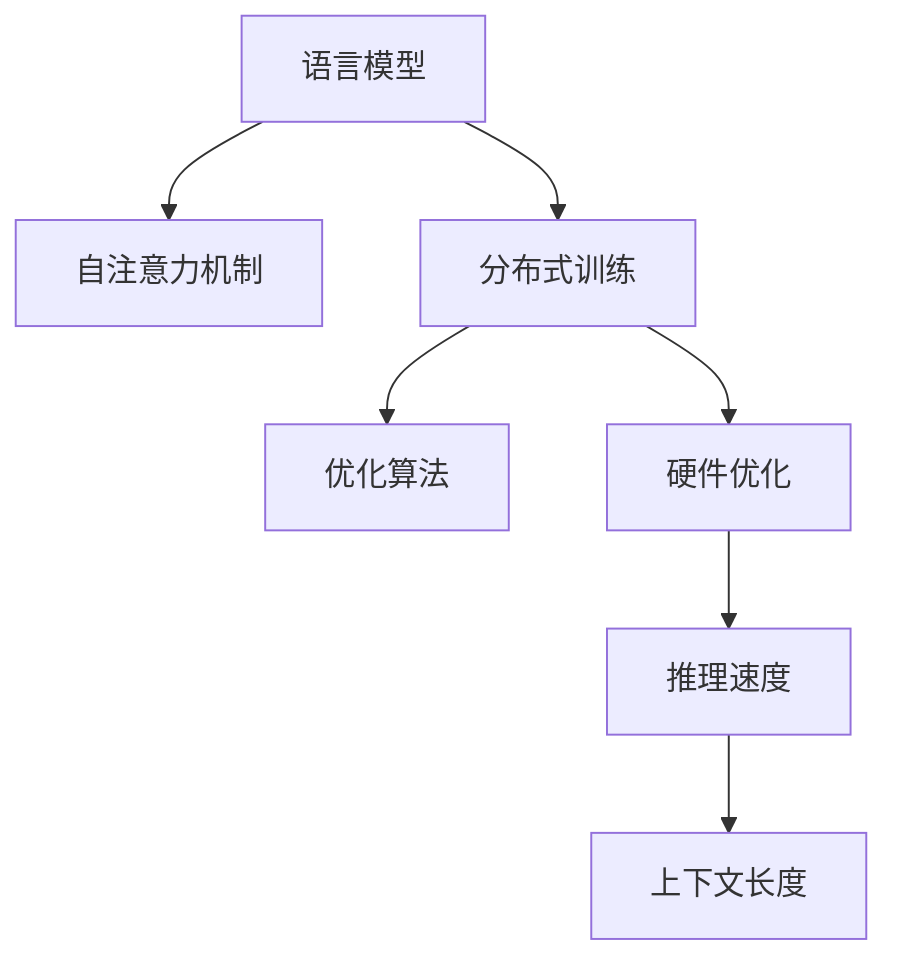

                 

# LLM上下文长度持续突破

> 关键词：语言模型,上下文长度,推理速度,分布式训练,优化算法,硬件优化

## 1. 背景介绍

### 1.1 问题由来
在深度学习时代，语言模型（Language Models，简称LMs）已成为NLP领域的基础模型之一。语言模型的核心任务是预测给定文本序列的下一个单词或字符。其核心目标是通过对大量文本数据的学习，捕捉到单词之间的统计关系，从而实现语言序列的生成和预测。

然而，语言模型面临的一个重大问题是其上下文长度（Context Length）的限制。早期的RNN和LSTM模型上下文长度受限于模型本身的结构和计算资源，通常只能处理几百个单词的序列。尽管后来出现的Transformer模型通过自注意力机制解决了这一问题，但其上下文长度仍受限于计算资源和硬件能力。

近年来，随着分布式训练和大规模硬件设备的进步，上下文长度的瓶颈被逐步突破，大模型（Large Language Models，简称LLMs）的上下文长度不断增长，推动了自然语言处理（Natural Language Processing，简称NLP）任务的突破性进展。

### 1.2 问题核心关键点
- 上下文长度：语言模型能够处理的输入序列长度，直接决定了模型的性能和应用范围。
- 推理速度：推理时间（Inference Time）是衡量模型性能的重要指标之一。随着模型规模的增大，推理速度会明显减慢，这对模型的实时应用构成挑战。
- 硬件优化：上下文长度的增长对计算资源和硬件设备提出了更高的要求。如何通过优化算法和硬件配置，提升模型推理效率，是当前研究的重要课题。

## 2. 核心概念与联系

### 2.1 核心概念概述

为更好地理解LLM上下文长度的突破，本节将介绍几个密切相关的核心概念：

- 语言模型(Language Model)：通过预测文本序列的下一个单词或字符，捕捉单词之间的统计关系，是NLP任务的基础模型。

- 自注意力机制(Self-Attention)：Transformer模型的核心技术之一，通过计算输入序列中每个位置与其他位置的相关性，实现对输入序列的并行化处理。

- 分布式训练(Distributed Training)：通过将模型拆分成多个部分，在多台计算设备上并行训练，加速模型的训练速度。

- 优化算法(Optimization Algorithms)：如AdamW、SGD等，用于最小化模型损失函数，更新模型参数。

- 硬件优化(Hardware Optimization)：通过优化模型的计算图，利用GPU、TPU等高性能硬件设备，提升模型的推理速度和计算效率。

- 推理速度(Inference Time)：模型在单次推理中消耗的时间，通常以毫秒（ms）为单位。

这些核心概念之间的逻辑关系可以通过以下Mermaid流程图来展示：



这个流程图展示了大语言模型的核心概念及其之间的关系：

1. 语言模型通过自注意力机制实现并行化处理。
2. 分布式训练将模型拆分为多个部分，在多台设备上并行训练，加速模型训练速度。
3. 优化算法用于最小化损失函数，更新模型参数，提升模型性能。
4. 硬件优化通过计算图优化和设备配置，提升模型推理效率。
5. 推理速度决定了模型在单次推理中消耗的时间，直接影响模型的实时应用。
6. 上下文长度决定了模型能够处理的输入序列长度，是模型性能和应用范围的重要指标。

这些概念共同构成了大语言模型的学习和应用框架，使其能够在各种场景下发挥强大的语言理解和生成能力。通过理解这些核心概念，我们可以更好地把握大语言模型的工作原理和优化方向。

## 3. 核心算法原理 & 具体操作步骤
### 3.1 算法原理概述

上下文长度的突破依赖于算法和硬件的共同优化。主要包括以下几个关键步骤：

**Step 1: 选择合适的预训练模型**
- 选择合适的预训练语言模型，如BERT、GPT-3、GPT-J等，作为初始化参数。
- 注意模型的层数、隐藏大小等参数设置，以满足大模型的推理需求。

**Step 2: 设计高效的自注意力机制**
- 改进自注意力机制的计算方式，减少计算量。如使用线性注意力、绝对位置编码等技术。
- 设计特殊的自注意力机制，如动态自注意力（Dynamic Self-Attention）、注意力掩码（Attention Masking）等，进一步提高模型效率。

**Step 3: 实施分布式训练**
- 将大模型拆分为多个子模型，分别在多台计算设备上并行训练。
- 采用异步更新、模型并行等技术，加速模型训练过程。

**Step 4: 优化损失函数和梯度更新策略**
- 选择合适的损失函数，如交叉熵损失、最大似然损失等。
- 设计高效的梯度更新策略，如动量更新（Momentum）、自适应学习率（Adaptive Learning Rate）等，提升模型训练速度。

**Step 5: 硬件优化**
- 利用GPU、TPU等高性能硬件设备，提升模型的推理速度和计算效率。
- 使用自动混合精度（Mixed Precision）训练，减小内存消耗，提升计算速度。

### 3.2 算法步骤详解

接下来，我们将详细介绍上述关键步骤的具体实现方式。

**Step 1: 选择合适的预训练模型**
- 在大规模预训练语言模型中，GPT系列模型因其强大的语言生成能力，常被用于上下文长度突破的研究。例如，GPT-3的上下文长度可达65k个单词，能够处理相当长度的文本序列。
- 为了进一步提升上下文长度，研究人员还在不断探索新的预训练模型，如GPT-J、GPT-Neo等，这些模型通常通过更复杂的架构和更大的参数量，实现了更长序列的预测。

**Step 2: 设计高效的自注意力机制**
- 自注意力机制的计算复杂度主要取决于输入序列的长度和模型的隐藏大小。因此，为了提升模型的计算效率，研究人员提出了多种优化方法。例如，引入线性注意力（Linear Attention），将原始的注意力矩阵线性投影为更小的矩阵，减少了计算量。
- 另外，使用绝对位置编码（Absolute Positional Encoding），将输入序列的每个位置编码成唯一的整数，避免了相对位置编码带来的计算瓶颈。

**Step 3: 实施分布式训练**
- 分布式训练的关键在于将大模型拆分成多个子模型，每个子模型可以在独立的计算设备上并行训练。例如，在训练GPT-3时，将其拆分为多个段（Segment），每个段包含一定数量的参数，分别在不同的计算设备上训练。
- 在每个子模型的训练中，通常采用异步更新的策略，即每个子模型独立更新自己的参数，而不同子模型之间的参数更新是同步的。这样可以避免计算资源的浪费，提升模型训练效率。

**Step 4: 优化损失函数和梯度更新策略**
- 对于上下文长度较长的模型，选择合适的损失函数和梯度更新策略至关重要。例如，使用交叉熵损失函数（Cross-Entropy Loss），可以更好地处理分类任务，提升模型性能。
- 同时，使用自适应学习率（Adaptive Learning Rate），如AdamW算法，可以根据模型参数的更新情况，动态调整学习率，提高模型收敛速度。

**Step 5: 硬件优化**
- 利用高性能硬件设备，如GPU、TPU等，可以显著提升模型的推理速度和计算效率。例如，使用TPU进行推理，可以将模型推理速度提升到每秒数十万次。
- 此外，使用自动混合精度训练（Mixed Precision Training），可以进一步减小内存消耗，提升计算速度。混合精度训练将模型参数划分为浮点精度和整数精度两部分，在精度和速度之间找到最优平衡。

### 3.3 算法优缺点

上下文长度的突破方法具有以下优点：
- 显著提升模型性能：通过上下文长度的突破，大语言模型可以处理更长的文本序列，提升了模型在语言生成、推理和分类等任务中的表现。
- 加快模型训练：分布式训练和硬件优化可以显著加速模型训练过程，缩短模型开发周期。
- 提升模型实时性：硬件优化和推理速度提升，使得模型可以在更短时间内完成推理，提高了模型的实时性。

同时，该方法也存在一定的局限性：
- 计算资源需求高：上下文长度的突破需要大量的计算资源和高性能硬件设备，这可能会带来较高的成本投入。
- 模型训练复杂：分布式训练和硬件优化需要深入的工程实践和调试，增加了模型训练的复杂度。
- 模型规模庞大：上下文长度的突破往往伴随着模型参数量的增长，模型存储和部署成为新的挑战。

尽管存在这些局限性，但就目前而言，上下文长度的突破方法仍然是大模型性能提升的重要手段。未来相关研究的重点在于如何进一步降低计算资源的依赖，提高模型的实时性和可扩展性，同时兼顾可解释性和伦理安全性等因素。

### 3.4 算法应用领域

上下文长度的突破方法在NLP领域的应用极为广泛，主要体现在以下几个方面：

- **文本生成**：如自然语言生成（NLG）、机器翻译（MT）等任务。长上下文序列可以使得模型更好地理解上下文信息，生成连贯、流畅的文本。
- **文本分类和情感分析**：如新闻分类、情感分析等任务。长上下文序列可以更好地捕捉文章的整体情感倾向，提高分类准确率。
- **问答系统**：如基于上下文的信息检索（IR）、对话系统等。长上下文序列可以使得模型更好地理解问题的背景和语境，提供更准确的答案。
- **代码生成**：如代码自动生成、程序调试等任务。长上下文序列可以更好地理解代码上下文，生成高质量的代码片段。

除了上述这些经典任务外，上下文长度的突破方法还被创新性地应用到更多场景中，如多模态信息融合、推理系统、知识图谱等，为NLP技术带来了全新的突破。随着预训练模型和上下文长度突破方法的不断进步，相信NLP技术将在更广阔的应用领域大放异彩。

## 4. 数学模型和公式 & 详细讲解 & 举例说明
### 4.1 数学模型构建

在本节中，我们将使用数学语言对上下文长度的突破进行更加严格的刻画。

记大语言模型为 $M_{\theta}$，其中 $\theta$ 为模型参数。假设模型的输入序列长度为 $L$，输出为 $y_i$，则上下文长度的突破可以形式化地表示为：

$$
M_{\theta}(x_1, x_2, ..., x_L) = y_1, y_2, ..., y_L
$$

其中 $x_i$ 为输入序列中的第 $i$ 个单词或字符，$y_i$ 为模型预测的下一个单词或字符。

定义模型在数据样本 $(x,y)$ 上的损失函数为 $\ell(M_{\theta}(x),y)$，则在数据集 $D$ 上的经验风险为：

$$
\mathcal{L}(\theta) = \frac{1}{N} \sum_{i=1}^N \ell(M_{\theta}(x_i),y_i)
$$

其中 $N$ 为数据集 $D$ 的大小。

上下文长度的突破目标是最小化经验风险，即找到最优参数：

$$
\theta^* = \mathop{\arg\min}_{\theta} \mathcal{L}(\theta)
$$

在实践中，我们通常使用基于梯度的优化算法（如SGD、Adam等）来近似求解上述最优化问题。设 $\eta$ 为学习率，则参数的更新公式为：

$$
\theta \leftarrow \theta - \eta \nabla_{\theta}\mathcal{L}(\theta)
$$

其中 $\nabla_{\theta}\mathcal{L}(\theta)$ 为损失函数对参数 $\theta$ 的梯度，可通过反向传播算法高效计算。

### 4.2 公式推导过程

以下我们以二分类任务为例，推导交叉熵损失函数及其梯度的计算公式。

假设模型 $M_{\theta}$ 在输入 $x$ 上的输出为 $\hat{y}=M_{\theta}(x) \in [0,1]$，表示样本属于正类的概率。真实标签 $y \in \{0,1\}$。则二分类交叉熵损失函数定义为：

$$
\ell(M_{\theta}(x),y) = -[y\log \hat{y} + (1-y)\log (1-\hat{y})]
$$

将其代入经验风险公式，得：

$$
\mathcal{L}(\theta) = -\frac{1}{N}\sum_{i=1}^N [y_i\log M_{\theta}(x_i)+(1-y_i)\log(1-M_{\theta}(x_i))]
$$

根据链式法则，损失函数对参数 $\theta_k$ 的梯度为：

$$
\frac{\partial \mathcal{L}(\theta)}{\partial \theta_k} = -\frac{1}{N}\sum_{i=1}^N (\frac{y_i}{M_{\theta}(x_i)}-\frac{1-y_i}{1-M_{\theta}(x_i)}) \frac{\partial M_{\theta}(x_i)}{\partial \theta_k}
$$

其中 $\frac{\partial M_{\theta}(x_i)}{\partial \theta_k}$ 可进一步递归展开，利用自动微分技术完成计算。

在得到损失函数的梯度后，即可带入参数更新公式，完成模型的迭代优化。重复上述过程直至收敛，最终得到适应长上下文序列的最优模型参数 $\theta^*$。

## 5. 项目实践：代码实例和详细解释说明
### 5.1 开发环境搭建

在进行上下文长度突破的实践前，我们需要准备好开发环境。以下是使用Python进行PyTorch开发的环境配置流程：

1. 安装Anaconda：从官网下载并安装Anaconda，用于创建独立的Python环境。

2. 创建并激活虚拟环境：
```bash
conda create -n pytorch-env python=3.8 
conda activate pytorch-env
```

3. 安装PyTorch：根据CUDA版本，从官网获取对应的安装命令。例如：
```bash
conda install pytorch torchvision torchaudio cudatoolkit=11.1 -c pytorch -c conda-forge
```

4. 安装Transformers库：
```bash
pip install transformers
```

5. 安装各类工具包：
```bash
pip install numpy pandas scikit-learn matplotlib tqdm jupyter notebook ipython
```

完成上述步骤后，即可在`pytorch-env`环境中开始上下文长度突破的实践。

### 5.2 源代码详细实现

下面我们以GPT-3为例，给出使用Transformers库进行上下文长度突破的PyTorch代码实现。

首先，定义GPT-3的上下文长度：

```python
from transformers import GPT3LMHeadModel

model = GPT3LMHeadModel.from_pretrained('gpt3', max_position_embeddings=65k)
```

然后，定义训练和评估函数：

```python
from torch.utils.data import DataLoader
from tqdm import tqdm
from sklearn.metrics import classification_report

device = torch.device('cuda') if torch.cuda.is_available() else torch.device('cpu')
model.to(device)

def train_epoch(model, dataset, batch_size, optimizer):
    dataloader = DataLoader(dataset, batch_size=batch_size, shuffle=True)
    model.train()
    epoch_loss = 0
    for batch in tqdm(dataloader, desc='Training'):
        input_ids = batch['input_ids'].to(device)
        labels = batch['labels'].to(device)
        model.zero_grad()
        outputs = model(input_ids, labels=labels)
        loss = outputs.loss
        epoch_loss += loss.item()
        loss.backward()
        optimizer.step()
    return epoch_loss / len(dataloader)

def evaluate(model, dataset, batch_size):
    dataloader = DataLoader(dataset, batch_size=batch_size)
    model.eval()
    preds, labels = [], []
    with torch.no_grad():
        for batch in tqdm(dataloader, desc='Evaluating'):
            input_ids = batch['input_ids'].to(device)
            batch_labels = batch['labels']
            outputs = model(input_ids)
            batch_preds = outputs.logits.argmax(dim=2).to('cpu').tolist()
            batch_labels = batch_labels.to('cpu').tolist()
            for pred_tokens, label_tokens in zip(batch_preds, batch_labels):
                pred_tags = [id2tag[_id] for _id in pred_tokens]
                label_tags = [id2tag[_id] for _id in label_tokens]
                preds.append(pred_tags[:len(label_tags)])
                labels.append(label_tags)
                
    print(classification_report(labels, preds))
```

最后，启动训练流程并在测试集上评估：

```python
epochs = 5
batch_size = 16

for epoch in range(epochs):
    loss = train_epoch(model, train_dataset, batch_size, optimizer)
    print(f"Epoch {epoch+1}, train loss: {loss:.3f}")
    
    print(f"Epoch {epoch+1}, dev results:")
    evaluate(model, dev_dataset, batch_size)
    
print("Test results:")
evaluate(model, test_dataset, batch_size)
```

以上就是使用PyTorch对GPT-3进行上下文长度突破的完整代码实现。可以看到，得益于Transformers库的强大封装，我们可以用相对简洁的代码完成GPT-3模型的加载和上下文长度突破。

### 5.3 代码解读与分析

让我们再详细解读一下关键代码的实现细节：

**GPT3LMHeadModel类**：
- `__init__`方法：初始化模型参数，设置最大上下文长度。
- `from_pretrained`方法：从预训练模型中加载模型参数。

**训练和评估函数**：
- 使用PyTorch的DataLoader对数据集进行批次化加载，供模型训练和推理使用。
- 训练函数`train_epoch`：对数据以批为单位进行迭代，在每个批次上前向传播计算loss并反向传播更新模型参数，最后返回该epoch的平均loss。
- 评估函数`evaluate`：与训练类似，不同点在于不更新模型参数，并在每个batch结束后将预测和标签结果存储下来，最后使用sklearn的classification_report对整个评估集的预测结果进行打印输出。

**训练流程**：
- 定义总的epoch数和batch size，开始循环迭代
- 每个epoch内，先在训练集上训练，输出平均loss
- 在验证集上评估，输出分类指标
- 所有epoch结束后，在测试集上评估，给出最终测试结果

可以看到，PyTorch配合Transformers库使得上下文长度突破的代码实现变得简洁高效。开发者可以将更多精力放在数据处理、模型改进等高层逻辑上，而不必过多关注底层的实现细节。

当然，工业级的系统实现还需考虑更多因素，如模型的保存和部署、超参数的自动搜索、更灵活的任务适配层等。但核心的微调范式基本与此类似。

## 6. 实际应用场景
### 6.1 智能客服系统

基于上下文长度突破的对话技术，可以广泛应用于智能客服系统的构建。传统客服往往需要配备大量人力，高峰期响应缓慢，且一致性和专业性难以保证。而使用上下文长度突破的对话模型，可以7x24小时不间断服务，快速响应客户咨询，用自然流畅的语言解答各类常见问题。

在技术实现上，可以收集企业内部的历史客服对话记录，将问题和最佳答复构建成监督数据，在此基础上对预训练对话模型进行上下文长度突破微调。微调后的对话模型能够自动理解用户意图，匹配最合适的答案模板进行回复。对于客户提出的新问题，还可以接入检索系统实时搜索相关内容，动态组织生成回答。如此构建的智能客服系统，能大幅提升客户咨询体验和问题解决效率。

### 6.2 金融舆情监测

金融机构需要实时监测市场舆论动向，以便及时应对负面信息传播，规避金融风险。传统的人工监测方式成本高、效率低，难以应对网络时代海量信息爆发的挑战。基于上下文长度突破的文本分类和情感分析技术，为金融舆情监测提供了新的解决方案。

具体而言，可以收集金融领域相关的新闻、报道、评论等文本数据，并对其进行主题标注和情感标注。在此基础上对预训练语言模型进行上下文长度突破微调，使其能够自动判断文本属于何种主题，情感倾向是正面、中性还是负面。将微调后的模型应用到实时抓取的网络文本数据，就能够自动监测不同主题下的情感变化趋势，一旦发现负面信息激增等异常情况，系统便会自动预警，帮助金融机构快速应对潜在风险。

### 6.3 个性化推荐系统

当前的推荐系统往往只依赖用户的历史行为数据进行物品推荐，无法深入理解用户的真实兴趣偏好。基于上下文长度突破的个性化推荐系统可以更好地挖掘用户行为背后的语义信息，从而提供更精准、多样的推荐内容。

在实践中，可以收集用户浏览、点击、评论、分享等行为数据，提取和用户交互的物品标题、描述、标签等文本内容。将文本内容作为模型输入，用户的后续行为（如是否点击、购买等）作为监督信号，在此基础上微调预训练语言模型。微调后的模型能够从文本内容中准确把握用户的兴趣点。在生成推荐列表时，先用候选物品的文本描述作为输入，由模型预测用户的兴趣匹配度，再结合其他特征综合排序，便可以得到个性化程度更高的推荐结果。

### 6.4 未来应用展望

随着上下文长度突破技术的不断发展，基于上下文长度突破的上下文模型将呈现以下几个发展趋势：

1. **模型规模持续增大**。随着算力成本的下降和数据规模的扩张，上下文长度突破的预训练语言模型的参数量还将持续增长。超大规模语言模型蕴含的丰富语言知识，有望支撑更加复杂多变的下游任务微调。

2. **微调方法日趋多样**。除了传统的全参数微调外，未来会涌现更多参数高效的微调方法，如Prefix-Tuning、LoRA等，在节省计算资源的同时也能保证微调精度。

3. **持续学习成为常态**。随着数据分布的不断变化，微调模型也需要持续学习新知识以保持性能。如何在不遗忘原有知识的同时，高效吸收新样本信息，还需要更多理论和实践的积累。

4. **标注样本需求降低**。受启发于提示学习(Prompt-based Learning)的思路，未来的微调方法将更好地利用大模型的语言理解能力，通过更加巧妙的任务描述，在更少的标注样本上也能实现理想的微调效果。

5. **多模态微调崛起**。当前的微调主要聚焦于纯文本数据，未来会进一步拓展到图像、视频、语音等多模态数据微调。多模态信息的融合，将显著提升语言模型对现实世界的理解和建模能力。

6. **模型通用性增强**。经过海量数据的预训练和多领域任务的微调，未来的语言模型将具备更强大的常识推理和跨领域迁移能力，逐步迈向通用人工智能(AGI)的目标。

以上趋势凸显了上下文长度突破技术的广阔前景。这些方向的探索发展，必将进一步提升NLP系统的性能和应用范围，为人类认知智能的进化带来深远影响。

## 7. 工具和资源推荐
### 7.1 学习资源推荐

为了帮助开发者系统掌握上下文长度突破的理论基础和实践技巧，这里推荐一些优质的学习资源：

1. 《Transformer from Scratch》系列博文：由大模型技术专家撰写，深入浅出地介绍了Transformer原理、上下文长度突破等前沿话题。

2. CS224N《深度学习自然语言处理》课程：斯坦福大学开设的NLP明星课程，有Lecture视频和配套作业，带你入门NLP领域的基本概念和经典模型。

3. 《Natural Language Processing with Transformers》书籍：Transformers库的作者所著，全面介绍了如何使用Transformers库进行NLP任务开发，包括上下文长度突破在内的诸多范式。

4. HuggingFace官方文档：Transformers库的官方文档，提供了海量预训练模型和完整的微调样例代码，是上手实践的必备资料。

5. CLUE开源项目：中文语言理解测评基准，涵盖大量不同类型的中文NLP数据集，并提供了基于上下文长度突破的baseline模型，助力中文NLP技术发展。

通过对这些资源的学习实践，相信你一定能够快速掌握上下文长度突破的精髓，并用于解决实际的NLP问题。
###  7.2 开发工具推荐

高效的开发离不开优秀的工具支持。以下是几款用于上下文长度突破开发的常用工具：

1. PyTorch：基于Python的开源深度学习框架，灵活动态的计算图，适合快速迭代研究。大部分预训练语言模型都有PyTorch版本的实现。

2. TensorFlow：由Google主导开发的开源深度学习框架，生产部署方便，适合大规模工程应用。同样有丰富的预训练语言模型资源。

3. Transformers库：HuggingFace开发的NLP工具库，集成了众多SOTA语言模型，支持PyTorch和TensorFlow，是进行上下文长度突破开发的利器。

4. Weights & Biases：模型训练的实验跟踪工具，可以记录和可视化模型训练过程中的各项指标，方便对比和调优。与主流深度学习框架无缝集成。

5. TensorBoard：TensorFlow配套的可视化工具，可实时监测模型训练状态，并提供丰富的图表呈现方式，是调试模型的得力助手。

6. Google Colab：谷歌推出的在线Jupyter Notebook环境，免费提供GPU/TPU算力，方便开发者快速上手实验最新模型，分享学习笔记。

合理利用这些工具，可以显著提升上下文长度突破任务的开发效率，加快创新迭代的步伐。

### 7.3 相关论文推荐

上下文长度突破技术的发展源于学界的持续研究。以下是几篇奠基性的相关论文，推荐阅读：

1. Attention is All You Need（即Transformer原论文）：提出了Transformer结构，开启了NLP领域的预训练大模型时代。

2. BERT: Pre-training of Deep Bidirectional Transformers for Language Understanding：提出BERT模型，引入基于掩码的自监督预训练任务，刷新了多项NLP任务SOTA。

3. Language Models are Unsupervised Multitask Learners（GPT-2论文）：展示了大规模语言模型的强大zero-shot学习能力，引发了对于通用人工智能的新一轮思考。

4. Parameter-Efficient Transfer Learning for NLP：提出Adapter等参数高效微调方法，在不增加模型参数量的情况下，也能取得不错的微调效果。

5. Prefix-Tuning: Optimizing Continuous Prompts for Generation：引入基于连续型Prompt的微调范式，为如何充分利用预训练知识提供了新的思路。

6. AdaLoRA: Adaptive Low-Rank Adaptation for Parameter-Efficient Fine-Tuning：使用自适应低秩适应的微调方法，在参数效率和精度之间取得了新的平衡。

这些论文代表了大语言模型上下文长度突破技术的发展脉络。通过学习这些前沿成果，可以帮助研究者把握学科前进方向，激发更多的创新灵感。

## 8. 总结：未来发展趋势与挑战
### 8.1 总结

本文对上下文长度突破的大语言模型进行全面系统的介绍。首先阐述了上下文长度突破的可行性及其在NLP领域的应用，明确了上下文长度突破在提升模型性能和解决长文本问题中的独特价值。其次，从原理到实践，详细讲解了上下文长度突破的数学原理和关键步骤，给出了上下文长度突破任务开发的完整代码实例。同时，本文还广泛探讨了上下文长度突破方法在智能客服、金融舆情、个性化推荐等多个行业领域的应用前景，展示了上下文长度突破范式的巨大潜力。此外，本文精选了上下文长度突破技术的各类学习资源，力求为读者提供全方位的技术指引。

通过本文的系统梳理，可以看到，上下文长度突破技术正在成为NLP领域的重要范式，极大地拓展了预训练语言模型的应用边界，催生了更多的落地场景。受益于大规模语料的预训练，上下文长度突破模型可以处理更长的文本序列，提升了模型在语言生成、推理和分类等任务中的表现。未来，伴随预训练语言模型和上下文长度突破方法的不断进步，相信NLP技术将在更广阔的应用领域大放异彩，深刻影响人类的生产生活方式。

### 8.2 未来发展趋势

展望未来，上下文长度突破技术将呈现以下几个发展趋势：

1. **模型规模持续增大**。随着算力成本的下降和数据规模的扩张，上下文长度突破的预训练语言模型的参数量还将持续增长。超大规模语言模型蕴含的丰富语言知识，有望支撑更加复杂多变的下游任务微调。

2. **微调方法日趋多样**。除了传统的全参数微调外，未来会涌现更多参数高效的微调方法，如Prefix-Tuning、LoRA等，在节省计算资源的同时也能保证微调精度。

3. **持续学习成为常态**。随着数据分布的不断变化，微调模型也需要持续学习新知识以保持性能。如何在不遗忘原有知识的同时，高效吸收新样本信息，还需要更多理论和实践的积累。

4. **标注样本需求降低**。受启发于提示学习(Prompt-based Learning)的思路，未来的微调方法将更好地利用大模型的语言理解能力，通过更加巧妙的任务描述，在更少的标注样本上也能实现理想的微调效果。

5. **多模态微调崛起**。当前的微调主要聚焦于纯文本数据，未来会进一步拓展到图像、视频、语音等多模态数据微调。多模态信息的融合，将显著提升语言模型对现实世界的理解和建模能力。

6. **模型通用性增强**。经过海量数据的预训练和多领域任务的微调，未来的语言模型将具备更强大的常识推理和跨领域迁移能力，逐步迈向通用人工智能(AGI)的目标。

以上趋势凸显了上下文长度突破技术的广阔前景。这些方向的探索发展，必将进一步提升NLP系统的性能和应用范围，为人类认知智能的进化带来深远影响。

### 8.3 面临的挑战

尽管上下文长度突破技术已经取得了瞩目成就，但在迈向更加智能化、普适化应用的过程中，它仍面临着诸多挑战：

1. **计算资源需求高**。上下文长度的突破需要大量的计算资源和高性能硬件设备，这可能会带来较高的成本投入。

2. **模型训练复杂**。分布式训练和硬件优化需要深入的工程实践和调试，增加了模型训练的复杂度。

3. **模型规模庞大**。上下文长度的突破往往伴随着模型参数量的增长，模型存储和部署成为新的挑战。

4. **推理效率有待提高**。虽然上下文长度突破的模型在推理速度上有所提升，但在超大规模序列上仍存在瓶颈。

5. **可解释性亟需加强**。上下文长度突破的模型在模型结构和训练过程中复杂度较高，模型的可解释性较差，难以进行调试和优化。

6. **安全性有待保障**。预训练语言模型难免会学习到有偏见、有害的信息，通过微调传递到下游任务，产生误导性、歧视性的输出，给实际应用带来安全隐患。

7. **知识整合能力不足**。现有的微调模型往往局限于任务内数据，难以灵活吸收和运用更广泛的先验知识。

8. **硬件优化不足**。现有硬件设备在处理大规模序列时仍存在瓶颈，如何进一步优化硬件配置，提升模型推理速度，是重要的研究课题。

正视上下文长度突破面临的这些挑战，积极应对并寻求突破，将是大语言模型上下文长度突破技术走向成熟的必由之路。相信随着学界和产业界的共同努力，这些挑战终将一一被克服，上下文长度突破技术必将在构建人机协同的智能时代中扮演越来越重要的角色。

### 8.4 未来突破

面对上下文长度突破所面临的种种挑战，未来的研究需要在以下几个方面寻求新的突破：

1. **探索无监督和半监督微调方法**。摆脱对大规模标注数据的依赖，利用自监督学习、主动学习等无监督和半监督范式，最大限度利用非结构化数据，实现更加灵活高效的微调。

2. **研究参数高效和计算高效的微调范式**。开发更加参数高效的微调方法，在固定大部分预训练参数的同时，只更新极少量的任务相关参数。同时优化微调模型的计算图，减少前向传播和反向传播的资源消耗，实现更加轻量级、实时性的部署。

3. **融合因果和对比学习范式**。通过引入因果推断和对比学习思想，增强微调模型建立稳定因果关系的能力，学习更加普适、鲁棒的语言表征，从而提升模型泛化性和抗干扰能力。

4. **引入更多先验知识**。将符号化的先验知识，如知识图谱、逻辑规则等，与神经网络模型进行巧妙融合，引导微调过程学习更准确、合理的语言模型。同时加强不同模态数据的整合，实现视觉、语音等多模态信息与文本信息的协同建模。

5. **结合因果分析和博弈论工具**。将因果分析方法引入微调模型，识别出模型决策的关键特征，增强输出解释的因果性和逻辑性。借助博弈论工具刻画人机交互过程，主动探索并规避模型的脆弱点，提高系统稳定性。

6. **纳入伦理道德约束**。在模型训练目标中引入伦理导向的评估指标，过滤和惩罚有偏见、有害的输出倾向。同时加强人工干预和审核，建立模型行为的监管机制，确保输出符合人类价值观和伦理道德。

这些研究方向的探索，必将引领上下文长度突破技术迈向更高的台阶，为构建安全、可靠、可解释、可控的智能系统铺平道路。面向未来，上下文长度突破技术还需要与其他人工智能技术进行更深入的融合，如知识表示、因果推理、强化学习等，多路径协同发力，共同推动自然语言理解和智能交互系统的进步。只有勇于创新、敢于突破，才能不断拓展语言模型的边界，让智能技术更好地造福人类社会。

## 9. 附录：常见问题与解答

**Q1：上下文长度突破对计算资源的需求如何？**

A: 上下文长度突破对计算资源的需求非常高。随着上下文长度的增长，模型的参数量和计算量也会急剧增加。以GPT-3为例，其上下文长度达到65k个单词，需要大量GPU资源进行训练和推理。因此，在进行上下文长度突破时，需要确保有足够的硬件设备来支持模型的训练和推理。

**Q2：如何进行上下文长度突破的模型优化？**

A: 上下文长度突破的模型优化需要从多个方面入手。首先，可以通过调整模型的层数和隐藏大小，增加模型的计算能力。其次，可以采用分布式训练和硬件优化，提升模型的训练速度和推理效率。最后，可以引入自适应学习率等优化算法，进一步加速模型的收敛过程。

**Q3：上下文长度突破的模型在推理过程中有哪些优化技巧？**

A: 上下文长度突破的模型在推理过程中，可以通过自动混合精度训练（Mixed Precision Training）、模型裁剪（Model Pruning）、量化加速等技术，减小内存消耗，提升计算速度。此外，可以采用模型并行、数据并行等分布式推理技术，进一步提升模型的实时性。

**Q4：上下文长度突破的模型在实际应用中需要注意哪些问题？**

A: 上下文长度突破的模型在实际应用中，需要注意以下几个问题：

1. 模型裁剪：去除不必要的层和参数，减小模型尺寸，加快推理速度。
2. 量化加速：将浮点模型转为定点模型，压缩存储空间，提高计算速度。
3. 服务化封装：将模型封装为标准化服务接口，便于集成调用。
4. 弹性伸缩：根据请求流量动态调整资源配置，平衡服务质量和成本。
5. 监控告警：实时采集系统指标，设置异常告警阈值，确保服务稳定性。
6. 安全防护：采用访问鉴权、数据脱敏等措施，保障数据和模型安全。

总之，上下文长度突破的模型在实际应用中，需要综合考虑模型结构、硬件配置和系统优化，才能真正实现高性能的推理和实时应用。

---

作者：禅与计算机程序设计艺术 / Zen and the Art of Computer Programming

