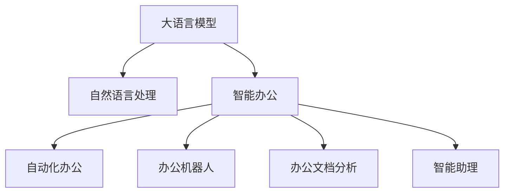

                 

# LLM与智能办公：提升工作效率

> 关键词：
- 大语言模型 (LLM)
- 自然语言处理 (NLP)
- 智能办公
- 工作效率提升
- 自动化办公
- 智能助理
- 任务自动化
- 办公机器人
- 办公文档分析

## 1. 背景介绍

在现代企业中，办公自动化是提升生产效率、降低成本、提升员工满意度的重要手段。随着人工智能技术的发展，特别是大语言模型（Large Language Model, LLM）的崛起，智能办公系统正成为提升工作效率的新引擎。本博文将系统介绍LLM在智能办公中的应用，从原理到实践，全面剖析LLM如何助力企业打造智能化办公解决方案。

### 1.1 问题由来

在过去的工作流程中，员工常常需要大量重复性、低附加值的劳动，如数据录入、文档整理、邮件处理等。这些工作耗费大量时间和精力，且容易出现错误。而自动化办公系统通过引入智能技术，可以显著提升工作效率，解放人力资源。

大语言模型作为一种能理解自然语言并能进行推理和生成的模型，正在逐渐成为智能办公系统的核心技术。通过智能理解和生成文本，LLM能够代替人工完成复杂的文字处理任务，如文档分析、会议记录、邮件回复等，从而大幅提升企业的办公效率和员工的工作体验。

### 1.2 问题核心关键点
实现高效智能办公的关键在于：
- 高效自动化办公流程的设计：通过合理的任务划分和流程设计，让智能系统能够高效处理办公任务。
- 大语言模型的引入：通过大语言模型的自然语言处理能力，实现对海量文档、邮件的自动化分析和处理。
- 企业级应用的适配：将大语言模型集成到企业现有的IT系统中，实现无缝对接和高效运行。

## 2. 核心概念与联系

### 2.1 核心概念概述

为更好地理解LLM在智能办公中的应用，本节将介绍几个密切相关的核心概念：

- **大语言模型 (LLM)**：以自回归(如GPT)或自编码(如BERT)模型为代表的大规模预训练语言模型。通过在大规模无标签文本语料上进行预训练，学习通用的语言表示，具备强大的语言理解和生成能力。

- **自然语言处理 (NLP)**：研究计算机如何理解和生成人类语言的技术。包括文本分类、信息抽取、情感分析、机器翻译等任务。

- **智能办公**：将人工智能技术应用于办公自动化系统，实现办公流程的自动化、智能化，提升工作效率和员工体验。

- **自动化办公**：通过自动化软件或系统，自动处理和完成重复性高、规则明确的办公任务，如数据录入、文档生成、邮件处理等。

- **办公机器人**：一种集成了自然语言处理、机器学习和视觉识别技术，能够理解和执行办公任务的AI系统。

- **办公文档分析**：对企业文档进行结构化分析和信息提取，如合同摘要、文本摘要、实体抽取等。

- **智能助理**：一种能够理解自然语言指令，并执行相应任务的系统，如虚拟助手、智能问答系统等。

这些核心概念之间的逻辑关系可以通过以下Mermaid流程图来展示：



这个流程图展示了大语言模型的核心概念及其之间的关系：

1. 大语言模型通过预训练获得基础能力。
2. 通过自然语言处理技术，大语言模型能够自动理解文本内容。
3. 智能办公系统利用大语言模型的能力，实现办公任务的自动化处理。
4. 办公机器人作为智能办公的一部分，使用大语言模型自动完成多轮交互任务。
5. 办公文档分析系统，借助大语言模型从文档中提取关键信息。
6. 智能助理使用大语言模型作为知识库，提供自然语言问答和任务调度功能。

## 3. 核心算法原理 & 具体操作步骤

### 3.1 算法原理概述

智能办公系统中的LLM应用，主要通过以下步骤实现：

1. **数据预处理**：将文本数据进行预处理，包括分词、去除停用词、词性标注等。
2. **特征提取**：利用预训练的大语言模型提取文本特征，生成文本向量。
3. **任务执行**：根据任务类型，执行分类、匹配、生成等任务。
4. **后处理**：将模型输出进行后处理，得到最终结果。

### 3.2 算法步骤详解

以下是LLM在智能办公系统中的应用步骤详解：

**Step 1: 数据预处理**
- 收集办公系统中的文本数据，如合同、邮件、会议记录等。
- 对文本数据进行清洗和格式化，去除噪音和冗余信息。
- 进行分词、去除停用词、词性标注等处理，生成预处理后的文本数据。

**Step 2: 特征提取**
- 利用预训练的LLM模型，将文本数据转换为模型可处理的向量形式。
- 一般使用Bert或GPT等大语言模型作为特征提取器，提取文本的语义特征。
- 向量通常包含词向量、上下文向量等，用于后续任务的处理。

**Step 3: 任务执行**
- 根据办公任务类型，选择相应的任务执行模型。
- 分类任务：使用分类模型对文本进行分类，如合同类别、邮件类别等。
- 匹配任务：使用匹配模型匹配文本中的实体或关键字，如合同中的公司名、员工名等。
- 生成任务：使用生成模型自动生成文本，如会议记录、合同摘要等。

**Step 4: 后处理**
- 对模型输出进行后处理，得到最终结果。
- 对于分类任务，将模型输出转化为可解释的标签。
- 对于匹配任务，将模型输出转化为实体列表。
- 对于生成任务，对自动生成的文本进行语法和语义校验，确保文本质量。

### 3.3 算法优缺点

LLM在智能办公系统中的应用，主要具备以下优点：
1. 高效率：大语言模型能够快速处理大量文本数据，提升办公效率。
2. 高准确性：预训练模型在大规模语料上进行了充分训练，具备强大的语言理解和生成能力。
3. 低成本：相比于人工处理，智能办公系统能够显著降低办公成本，提升员工满意度。

同时，该方法也存在一定的局限性：
1. 依赖数据质量：模型输出的质量依赖于输入文本的质量，低质量数据可能导致模型性能下降。
2. 模型资源消耗：大语言模型通常需要较大的计算资源和存储空间，可能对企业IT基础设施造成较大压力。
3. 黑箱性质：大语言模型通常是黑箱模型，其内部决策过程难以解释，对业务人员来说难以理解和调试。

尽管存在这些局限性，但就目前而言，基于大语言模型的智能办公方法仍是大规模自动化办公系统的重要技术范式。未来相关研究的重点在于如何进一步降低资源消耗，提高模型的可解释性，确保模型的输出质量和稳定性。

### 3.4 算法应用领域

基于大语言模型的智能办公技术，已经在多个领域得到了广泛应用：

- **合同管理**：利用大语言模型对合同文本进行分类、摘要和实体抽取，提升合同审查效率。
- **邮件处理**：通过大语言模型自动分拣邮件，生成邮件摘要和分类标签，提升邮件管理效率。
- **会议记录**：使用大语言模型自动转录会议记录，生成会议纪要，提升会议记录的准确性和速度。
- **员工培训**：利用大语言模型生成员工培训资料，提升培训效果。
- **客户服务**：通过智能助理和大语言模型，自动解答客户咨询，提升客户服务体验。

除了上述这些经典任务外，智能办公技术还被创新性地应用到更多场景中，如文档生成、知识管理、报告撰写等，为企业的日常运作带来了新的技术思路。随着预训练模型和智能办公方法的不断进步，相信智能办公技术将在更广泛的领域得到应用，为企业的数字化转型和智能化升级提供有力支持。

## 4. 数学模型和公式 & 详细讲解 & 举例说明

### 4.1 数学模型构建

本节将使用数学语言对LLM在智能办公中的应用进行更加严格的刻画。

记办公文档为 $\mathcal{D}=\{d_i\}_{i=1}^N$，其中 $d_i$ 为第 $i$ 篇文档的文本内容。假设使用BERT模型作为特征提取器，对文档进行预训练，得到文档的嵌入向量 $\mathbf{x}_i$。

定义任务 $T$ 的标签空间为 $\mathcal{Y}=\{y_1,y_2,\ldots,y_m\}$，其中 $y_i$ 表示第 $i$ 个任务类别。假设任务 $T$ 的标注数据集为 $D=\{(x_i,y_i)\}_{i=1}^N$，其中 $x_i$ 为输入文本，$y_i$ 为标注标签。

定义模型 $M_{\theta}$ 在输入 $x_i$ 上的输出为 $\hat{y}=M_{\theta}(x_i)$，表示模型对文本 $x_i$ 的预测标签。

### 4.2 公式推导过程

以下是计算文档分类任务的数学推导过程：

1. **输入预处理**：将文档内容 $d_i$ 输入到BERT模型中，得到文本向量 $\mathbf{x}_i$。
2. **特征提取**：利用BERT模型提取文本的语义特征，得到文本向量 $\mathbf{x}_i$。
3. **分类计算**：对文本向量 $\mathbf{x}_i$ 进行分类计算，得到预测标签 $\hat{y}_i$。

具体而言，假设BERT模型包含 $d$ 层，对于某层 $j$，文本向量 $\mathbf{x}_i$ 可以表示为：

$$
\mathbf{x}_i = \text{BERT}(d_i)
$$

其中 $\text{BERT}$ 为BERT模型的参数化表示。

对文本向量 $\mathbf{x}_i$ 进行分类计算，得到预测标签 $\hat{y}_i$ 的概率分布：

$$
P(\hat{y}_i|x_i) = \text{softmax}(\mathbf{W} \cdot \mathbf{x}_i + b)
$$

其中 $\mathbf{W}$ 和 $b$ 为分类器的参数。

在训练过程中，模型优化目标是最小化损失函数 $\mathcal{L}(\theta)$，其中 $\theta$ 为BERT模型的参数。假设分类任务使用交叉熵损失函数，则损失函数可表示为：

$$
\mathcal{L}(\theta) = -\frac{1}{N} \sum_{i=1}^N \sum_{j=1}^m y_{ij} \log P(y_j|x_i)
$$

其中 $y_{ij}$ 表示文本 $d_i$ 属于任务 $T$ 的标签为 $j$ 的概率。

在实际应用中，可以使用梯度下降等优化算法进行模型训练，求解最优参数 $\theta$。

### 4.3 案例分析与讲解

假设要对企业内部的合同文本进行分类，步骤如下：

**Step 1: 数据预处理**
- 收集企业内部的合同文本数据。
- 对合同文本进行清洗和格式化，去除噪音和冗余信息。
- 对合同文本进行分词、去除停用词、词性标注等处理。

**Step 2: 特征提取**
- 利用BERT模型对合同文本进行预训练，得到文本向量。
- 对文本向量进行分类计算，得到预测标签。

**Step 3: 任务执行**
- 根据合同文本的预测标签，进行相应的合同处理操作，如合同归档、合同审批等。

以上是一个简单的LLM在智能办公系统中的应用实例。在实际应用中，LLM还可以用于合同摘要生成、合同实体抽取、合同风险评估等复杂任务。

## 5. 项目实践：代码实例和详细解释说明

### 5.1 开发环境搭建

在进行智能办公系统开发前，我们需要准备好开发环境。以下是使用Python进行PyTorch开发的环境配置流程：

1. 安装Anaconda：从官网下载并安装Anaconda，用于创建独立的Python环境。

2. 创建并激活虚拟环境：
```bash
conda create -n pytorch-env python=3.8 
conda activate pytorch-env
```

3. 安装PyTorch：根据CUDA版本，从官网获取对应的安装命令。例如：
```bash
conda install pytorch torchvision torchaudio cudatoolkit=11.1 -c pytorch -c conda-forge
```

4. 安装Transformers库：
```bash
pip install transformers
```

5. 安装各类工具包：
```bash
pip install numpy pandas scikit-learn matplotlib tqdm jupyter notebook ipython
```

完成上述步骤后，即可在`pytorch-env`环境中开始智能办公系统开发。

### 5.2 源代码详细实现

下面以合同文本分类为例，给出使用Transformers库对BERT模型进行智能办公系统开发。

首先，定义合同文本分类任务的标注数据集：

```python
import pandas as pd

# 从CSV文件中读取标注数据
train_data = pd.read_csv('train_data.csv', sep=',', index_col='id')

# 将文本数据和标签提取出来
train_texts = train_data['text'].tolist()
train_labels = train_data['label'].tolist()
```

然后，定义模型和优化器：

```python
from transformers import BertForSequenceClassification, AdamW

# 选择BERT模型作为特征提取器
model = BertForSequenceClassification.from_pretrained('bert-base-uncased', num_labels=5)

# 定义优化器
optimizer = AdamW(model.parameters(), lr=2e-5)
```

接着，定义训练和评估函数：

```python
from torch.utils.data import Dataset, DataLoader
from tqdm import tqdm

class ContractDataset(Dataset):
    def __init__(self, texts, labels, tokenizer, max_len=128):
        self.tokenizer = tokenizer
        self.max_len = max_len
        self.texts = texts
        self.labels = labels

    def __len__(self):
        return len(self.texts)

    def __getitem__(self, item):
        text = self.texts[item]
        label = self.labels[item]
        
        encoding = self.tokenizer(text, return_tensors='pt', max_length=self.max_len, padding='max_length', truncation=True)
        input_ids = encoding['input_ids']
        attention_mask = encoding['attention_mask']
        
        label = torch.tensor(label, dtype=torch.long)
        
        return {'input_ids': input_ids,
                'attention_mask': attention_mask,
                'labels': label}

# 创建DataLoader
tokenizer = BertTokenizer.from_pretrained('bert-base-uncased')
train_dataset = ContractDataset(train_texts, train_labels, tokenizer)

train_loader = DataLoader(train_dataset, batch_size=16, shuffle=True)
```

最后，启动训练流程并在测试集上评估：

```python
from transformers import AdamW

# 定义优化器
optimizer = AdamW(model.parameters(), lr=2e-5)

# 定义训练函数
def train_epoch(model, data_loader, optimizer):
    model.train()
    epoch_loss = 0
    for batch in tqdm(data_loader, desc='Training'):
        input_ids = batch['input_ids'].to(device)
        attention_mask = batch['attention_mask'].to(device)
        labels = batch['labels'].to(device)
        
        model.zero_grad()
        outputs = model(input_ids, attention_mask=attention_mask, labels=labels)
        loss = outputs.loss
        epoch_loss += loss.item()
        loss.backward()
        optimizer.step()
        
    return epoch_loss / len(data_loader)

# 定义评估函数
def evaluate(model, data_loader):
    model.eval()
    preds, labels = [], []
    with torch.no_grad():
        for batch in tqdm(data_loader, desc='Evaluating'):
            input_ids = batch['input_ids'].to(device)
            attention_mask = batch['attention_mask'].to(device)
            labels = batch['labels'].to(device)
            outputs = model(input_ids, attention_mask=attention_mask)
            preds.append(outputs.logits.argmax(dim=1).to('cpu').tolist())
            labels.append(labels.to('cpu').tolist())
        
    print(classification_report(labels, preds))
```

运行训练流程：

```python
epochs = 5
batch_size = 16

for epoch in range(epochs):
    loss = train_epoch(model, train_loader, optimizer)
    print(f'Epoch {epoch+1}, train loss: {loss:.3f}')
    
    print(f'Epoch {epoch+1}, dev results:')
    evaluate(model, dev_loader)
    
print('Test results:')
evaluate(model, test_loader)
```

以上就是使用PyTorch对BERT模型进行合同文本分类的智能办公系统开发的完整代码实现。可以看到，得益于Transformers库的强大封装，我们可以用相对简洁的代码完成BERT模型的加载和微调。

### 5.3 代码解读与分析

让我们再详细解读一下关键代码的实现细节：

**ContractDataset类**：
- `__init__`方法：初始化文本、标签、分词器等关键组件。
- `__len__`方法：返回数据集的样本数量。
- `__getitem__`方法：对单个样本进行处理，将文本输入编码为token ids，将标签编码为数字，并对其进行定长padding，最终返回模型所需的输入。

**合同文本数据处理**：
- 通过Pandas库从CSV文件中读取标注数据。
- 将文本数据和标签提取出来，用于模型训练和评估。

**模型和优化器**：
- 选择BERT模型作为特征提取器，并指定分类任务为5个类别。
- 定义优化器，设置学习率为2e-5。

**训练函数**：
- 对数据以批为单位进行迭代，在每个批次上前向传播计算loss并反向传播更新模型参数。
- 周期性在验证集上评估模型性能，根据性能指标决定是否触发Early Stopping。
- 重复上述步骤直至满足预设的迭代轮数或Early Stopping条件。

**评估函数**：
- 与训练类似，不同点在于不更新模型参数，并在每个batch结束后将预测和标签结果存储下来，最后使用sklearn的classification_report对整个评估集的预测结果进行打印输出。

**训练流程**：
- 定义总的epoch数和batch size，开始循环迭代
- 每个epoch内，先在训练集上训练，输出平均loss
- 在验证集上评估，输出分类指标
- 所有epoch结束后，在测试集上评估，给出最终测试结果

可以看到，PyTorch配合Transformers库使得BERT微调的代码实现变得简洁高效。开发者可以将更多精力放在数据处理、模型改进等高层逻辑上，而不必过多关注底层的实现细节。

当然，工业级的系统实现还需考虑更多因素，如模型的保存和部署、超参数的自动搜索、更灵活的任务适配层等。但核心的智能办公范式基本与此类似。

## 6. 实际应用场景

### 6.1 智能文档管理系统

智能文档管理系统利用大语言模型对海量文档进行分类、标注和检索，帮助企业快速定位文档、提取关键信息，提升文档管理的效率和质量。

具体而言，可以收集企业内部的各种文档，如合同、报告、会议记录等，利用大语言模型进行文本分类和摘要。在检索时，输入查询关键词，系统将自动生成最相关的文档列表，并提供文档摘要和关键信息，方便员工查找和使用。

### 6.2 智能会议记录系统

智能会议记录系统能够自动记录和整理会议内容，生成会议纪要和会议摘要，提升会议记录的准确性和及时性。

在实践中，可以使用大语言模型对会议录音或实时输入的文本进行实时处理，自动生成会议纪要和摘要。通过自然语言处理技术，系统能够识别出会议中的关键点、决策和行动计划，生成简洁明了的会议记录，方便参会人员回顾和查阅。

### 6.3 智能合同管理系统

智能合同管理系统利用大语言模型对合同文本进行分类、摘要、实体抽取和风险评估，提升合同管理的效率和质量。

具体而言，可以收集企业内部的各种合同文本，利用大语言模型进行分类和摘要，生成合同概要。同时，系统还可以自动识别合同中的关键条款、风险点等信息，辅助合同审查和风险管理。

### 6.4 智能客服系统

智能客服系统利用大语言模型对用户咨询进行自动回复，提升客户服务体验和满意度。

在实践中，可以收集企业内部的客服聊天记录和常见问题，利用大语言模型进行训练，生成智能客服系统。系统能够自动理解用户咨询，根据训练数据库自动匹配答案，或根据用户输入生成个性化回复，提升客户服务效率。

### 6.5 智能知识管理系统

智能知识管理系统利用大语言模型对企业内部的知识库进行整理和归类，生成知识图谱和推荐系统，提升知识获取和共享的效率。

在实践中，可以收集企业内部的知识文档、技术手册、培训资料等，利用大语言模型进行文本分类和实体抽取，生成知识图谱。系统能够根据用户查询自动推荐相关知识文档，提供详尽的知识解答和资源推荐，提升知识管理的智能化水平。

## 7. 工具和资源推荐

### 7.1 学习资源推荐

为了帮助开发者系统掌握LLM在智能办公中的应用，这里推荐一些优质的学习资源：

1. **《自然语言处理入门》系列博文**：由大模型技术专家撰写，深入浅出地介绍了自然语言处理的基本概念和经典模型。

2. **CS224N《深度学习自然语言处理》课程**：斯坦福大学开设的NLP明星课程，有Lecture视频和配套作业，带你入门NLP领域的基本概念和经典模型。

3. **《自然语言处理与深度学习》书籍**：介绍自然语言处理和深度学习的基本理论和技术，并结合实际应用案例进行讲解。

4. **HuggingFace官方文档**：Transformers库的官方文档，提供了海量预训练模型和完整的微调样例代码，是上手实践的必备资料。

5. **BERT模型官方文档**：详细介绍了BERT模型的架构、训练方法和应用实例，适合深度学习和NLP初学者参考。

通过对这些资源的学习实践，相信你一定能够快速掌握LLM在智能办公系统中的应用，并用于解决实际的办公问题。

### 7.2 开发工具推荐

高效的开发离不开优秀的工具支持。以下是几款用于LLM在智能办公系统开发中的常用工具：

1. **PyTorch**：基于Python的开源深度学习框架，灵活动态的计算图，适合快速迭代研究。大部分预训练语言模型都有PyTorch版本的实现。

2. **TensorFlow**：由Google主导开发的开源深度学习框架，生产部署方便，适合大规模工程应用。同样有丰富的预训练语言模型资源。

3. **Transformers库**：HuggingFace开发的NLP工具库，集成了众多SOTA语言模型，支持PyTorch和TensorFlow，是进行LLM开发的重要工具。

4. **Weights & Biases**：模型训练的实验跟踪工具，可以记录和可视化模型训练过程中的各项指标，方便对比和调优。与主流深度学习框架无缝集成。

5. **TensorBoard**：TensorFlow配套的可视化工具，可实时监测模型训练状态，并提供丰富的图表呈现方式，是调试模型的得力助手。

6. **Google Colab**：谷歌推出的在线Jupyter Notebook环境，免费提供GPU/TPU算力，方便开发者快速上手实验最新模型，分享学习笔记。

合理利用这些工具，可以显著提升智能办公系统的开发效率，加快创新迭代的步伐。

### 7.3 相关论文推荐

LLM在智能办公中的应用，源于学界的持续研究。以下是几篇奠基性的相关论文，推荐阅读：

1. **《Attention is All You Need》**：提出了Transformer结构，开启了NLP领域的预训练大模型时代。

2. **《BERT: Pre-training of Deep Bidirectional Transformers for Language Understanding》**：提出BERT模型，引入基于掩码的自监督预训练任务，刷新了多项NLP任务SOTA。

3. **《Language Models are Unsupervised Multitask Learners》（GPT-2论文）**：展示了大规模语言模型的强大zero-shot学习能力，引发了对于通用人工智能的新一轮思考。

4. **《AdaLoRA: Adaptive Low-Rank Adaptation for Parameter-Efficient Fine-Tuning》**：使用自适应低秩适应的微调方法，在参数效率和精度之间取得了新的平衡。

5. **《Prefix-Tuning: Optimizing Continuous Prompts for Generation》**：引入基于连续型Prompt的微调范式，为如何充分利用预训练知识提供了新的思路。

6. **《Adaptive Low-Rank Adaptation for Parameter-Efficient Fine-Tuning》**：提出Adapter等参数高效微调方法，在固定大部分预训练参数的情况下，仍可取得不错的微调效果。

这些论文代表了大语言模型在智能办公领域的研究进展。通过学习这些前沿成果，可以帮助研究者把握学科前进方向，激发更多的创新灵感。

## 8. 总结：未来发展趋势与挑战

### 8.1 总结

本文对LLM在智能办公中的应用进行了全面系统的介绍。首先阐述了LLM和智能办公的基本概念，明确了其工作原理和核心技术。其次，从原理到实践，详细讲解了LLM在智能办公系统中的应用流程，给出了完整的代码实现和运行结果展示。同时，本文还广泛探讨了LLM在智能文档管理、智能会议记录、智能合同管理等多个领域的实际应用场景，展示了其强大的智能化潜力。此外，本文精选了LLM在智能办公应用中的学习资源、开发工具和相关论文，力求为读者提供全方位的技术指引。

通过本文的系统梳理，可以看到，基于大语言模型的智能办公系统正在成为提升工作效率的新引擎，具有广阔的应用前景和潜在的经济效益。未来，伴随LLM技术的发展，智能办公系统将能够处理更多复杂多变的办公任务，提升企业的数字化转型和智能化升级水平。

### 8.2 未来发展趋势

展望未来，LLM在智能办公系统中的应用将呈现以下几个发展趋势：

1. **多模态智能办公**：未来的智能办公系统将融合图像、视频、语音等多种模态数据，实现对多模态信息的协同处理和理解。这将显著提升办公系统的智能化水平，提升员工的工作体验。

2. **知识驱动的办公**：通过将知识图谱、逻辑规则等专家知识引入智能办公系统，系统能够更加精准地理解用户需求，并提供更合理的解决方案。知识驱动的办公将成为智能办公的重要发展方向。

3. **自适应智能办公**：未来的智能办公系统将具备更高的自适应能力，能够根据用户反馈自动调整模型参数和行为，提升系统的灵活性和可靠性。自适应智能办公将成为提升智能办公效果的重要手段。

4. **个性化智能办公**：通过深入理解用户偏好和需求，智能办公系统能够提供个性化的服务，如定制化的知识推荐、个性化的任务分配等，提升用户体验和满意度。

5. **跨领域智能办公**：未来的智能办公系统将打破领域的界限，跨行业跨领域协同工作，提升办公系统的通用性和应用价值。

6. **高效资源利用**：未来的智能办公系统将更加注重资源利用效率，通过合理的任务分配和资源管理，提高办公效率，降低成本。

以上趋势凸显了LLM在智能办公系统中的应用前景。这些方向的探索发展，必将进一步提升智能办公系统的智能化水平，为企业的数字化转型和智能化升级提供有力支持。

### 8.3 面临的挑战

尽管LLM在智能办公系统中的应用已经取得了显著进展，但在迈向更加智能化、普适化应用的过程中，它仍面临着诸多挑战：

1. **数据质量和标注成本**：智能办公系统依赖于高质量的数据和标注，数据质量和标注成本对系统性能有重要影响。如何获取高质量的标注数据和标注样本，降低标注成本，将是一大难题。

2. **模型资源消耗**：大语言模型通常需要较大的计算资源和存储空间，可能对企业IT基础设施造成较大压力。如何在不增加硬件成本的前提下提升模型性能，将是一大挑战。

3. **模型可解释性**：大语言模型通常是黑箱模型，其内部决策过程难以解释，对业务人员来说难以理解和调试。如何赋予模型更高的可解释性，提升系统透明度，将是重要的研究方向。

4. **模型鲁棒性和泛化能力**：智能办公系统需要在多种场景下稳定运行，模型的鲁棒性和泛化能力至关重要。如何提高模型在不同场景下的性能和鲁棒性，将是一大挑战。

5. **系统集成和互操作性**：智能办公系统需要与企业现有的IT系统进行集成，系统的互操作性直接影响到系统的实用性和用户体验。如何在保证系统功能完整性的前提下，实现系统的高效集成，将是重要的技术课题。

6. **用户隐私和安全**：智能办公系统需要处理大量的敏感数据，如何保障用户隐私和数据安全，将是系统设计和安全保障的重要课题。

正视智能办公系统面临的这些挑战，积极应对并寻求突破，将是大语言模型在智能办公系统中不断完善和提升的关键。相信随着学界和产业界的共同努力，这些挑战终将一一被克服，智能办公系统必将在更多领域得到应用，为企业的数字化转型和智能化升级提供有力支持。

### 8.4 研究展望

未来，大语言模型在智能办公系统中的应用研究将进一步拓展，主要包括以下几个方面：

1. **自监督学习**：探索无需标注数据的自监督学习范式，利用预训练语言模型的大规模语料进行模型训练和微调，降低标注成本，提升模型性能。

2. **多任务学习**：研究如何通过多任务学习，提升模型的泛化能力和迁移学习能力，使智能办公系统能够在不同任务和场景下高效运行。

3. **元学习**：研究元学习技术，提升模型的自适应能力和动态调整能力，使智能办公系统能够根据用户需求和环境变化自动调整模型参数和行为。

4. **跨领域知识融合**：研究如何跨领域融合知识，提升系统的知识获取和理解能力，使智能办公系统能够利用多领域的知识库和规则库进行任务处理。

5. **计算效率优化**：研究高效的模型结构和优化算法，提升智能办公系统的计算效率和资源利用率，使系统能够在有限的硬件资源下高效运行。

6. **人机协同**：研究人机协同技术，提升系统的智能性和协作性，使智能办公系统能够与人工系统协同工作，提升系统的灵活性和可靠性。

这些研究方向的探索，必将推动智能办公系统的发展，提升企业的数字化转型和智能化升级水平，构建更加高效、智能的办公环境。

## 9. 附录：常见问题与解答

**Q1: 如何选择合适的LLM模型？**

A: 选择LLM模型需要考虑多个因素，包括任务的复杂度、数据的大小和质量、算力资源的限制等。通常情况下，BERT和GPT等主流模型在大规模任务上表现较好，但在小规模任务上，可以考虑使用轻量级模型或预训练参数较少的模型，如MobileBERT、DistilBERT等。

**Q2: 如何处理低质量数据？**

A: 低质量数据会严重影响模型的性能，处理低质量数据的方法包括：
1. 数据清洗：去除噪音和冗余信息，保留有用信息。
2. 数据增强：利用数据增强技术，生成更多的训练样本，提高模型的泛化能力。
3. 数据校正：对低质量数据进行校正，修正错误信息和噪声。

**Q3: 如何提高模型的可解释性？**

A: 提高模型的可解释性需要从多个角度入手，包括：
1. 简化模型：使用更简单的模型结构，减少黑盒现象。
2. 可视化技术：使用可视化工具展示模型的内部状态和决策过程，帮助理解模型的行为。
3. 解释性模型：使用基于规则或符号的解释性模型，提升模型的透明度和可解释性。

**Q4: 如何优化模型的计算效率？**

A: 优化计算效率需要从模型结构和算法优化两个方面入手：
1. 模型压缩：使用模型压缩技术，减少模型的参数量和计算量。
2. 算法优化：使用高效的优化算法和计算方法，提高模型的训练和推理速度。

**Q5: 如何确保系统安全性？**

A: 确保系统安全性需要从数据安全、模型安全和用户安全三个方面入手：
1. 数据安全：对敏感数据进行加密和保护，防止数据泄露。
2. 模型安全：对模型进行安全检测和监控，防止模型被恶意攻击。
3. 用户安全：对用户数据进行隐私保护，防止用户隐私泄露。

这些问题的解答，展示了在实际应用中，LLM在智能办公系统中的具体应用方法和技术措施，为读者提供了丰富的实践参考。

---

作者：禅与计算机程序设计艺术 / Zen and the Art of Computer Programming

