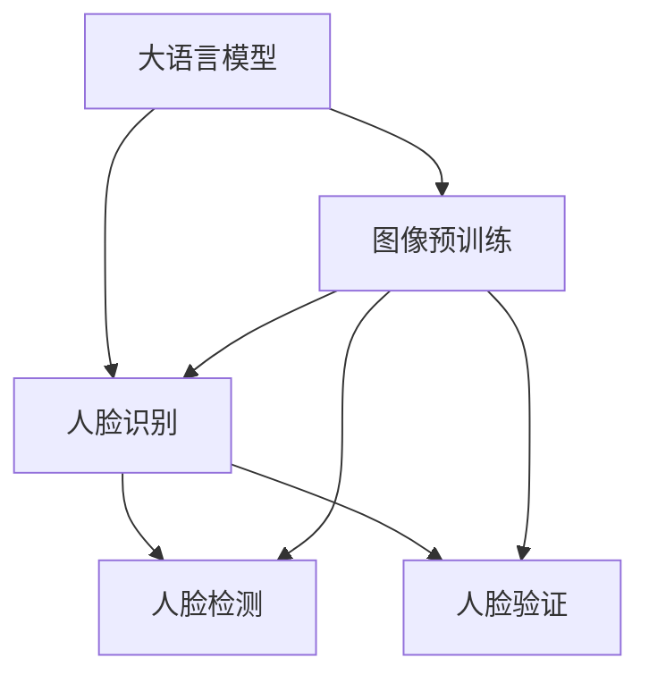

                 

## 1. 背景介绍

人脸识别技术，即利用机器学习算法对图像中的人脸进行识别和验证，已经广泛应用于安防监控、身份验证、智能家居等多个领域。然而，随着人脸识别应用场景的扩展，对于高精度、高鲁棒性、高效实时性的人脸识别系统的需求日益增加。传统的人脸识别方法基于特征提取和分类，往往需要大量标注数据和复杂算法，难以满足日益增长的应用需求。

近年来，随着大规模预训练语言模型（LLM）技术的发展，其强大的语言理解能力促使人们思考能否将LLM应用到图像识别领域。基于预训练语言模型的迁移学习方法（Transfer Learning）显示了巨大的潜力，能够在更少数据、更短时间、更高性能的基础上实现高精度的图像识别。

本文将探讨基于大语言模型（Large Language Model, LLM）在人脸识别任务中的优化策略，以提升模型的识别精度、鲁棒性和实时性。

## 2. 核心概念与联系

### 2.1 核心概念概述

为更好地理解基于大语言模型的人脸识别优化策略，本节将介绍几个密切相关的核心概念：

- **大语言模型 (LLM)**：如BERT、GPT等，经过自监督预训练后，能够处理大规模语言数据，具备强大的语言理解能力。
- **迁移学习 (Transfer Learning)**：将预训练模型在特定任务上进行微调，以提升任务性能。
- **图像预训练 (Image Pre-training)**：在图像数据上训练预训练模型，提取图像特征，用于下游任务。
- **人脸识别 (Face Recognition)**：利用机器学习算法对图像中的人脸进行识别和验证。
- **人脸验证 (Face Verification)**：判断两张人脸图像是否属于同一人。
- **人脸检测 (Face Detection)**：在图像中定位人脸位置。
- **人脸识别系统 (Face Recognition System)**：将人脸检测、人脸验证等技术结合起来，实现高效的人脸识别应用。

这些核心概念之间的逻辑关系可以通过以下Mermaid流程图来展示：



这个流程图展示了大语言模型在人脸识别任务中的迁移学习过程：

1. 大语言模型在图像数据上预训练，提取图像特征。
2. 在预训练特征基础上，对人脸检测和验证等下游任务进行微调。

## 3. 核心算法原理 & 具体操作步骤

### 3.1 算法原理概述

基于大语言模型的人脸识别优化策略，主要分为两个阶段：预训练和微调。预训练阶段通过图像数据训练模型，提取图像特征；微调阶段在预训练特征基础上，对人脸检测和验证等下游任务进行微调，提升模型精度和鲁棒性。

在预训练阶段，大语言模型通过自监督学习任务（如自编码、掩码语言模型等）在图像数据上训练，学习图像特征。在微调阶段，通过人脸检测和验证数据，调整模型参数，提升人脸识别性能。

### 3.2 算法步骤详解

#### 3.2.1 预训练阶段

**步骤1: 准备数据集**
准备图像数据集，如CelebA、LFW等，作为预训练的原始数据。

**步骤2: 选择合适的预训练模型**
选择合适的大语言模型作为预训练模型，如BERT、ResNet、VGG等。

**步骤3: 定义预训练任务**
定义预训练任务，如自编码、掩码语言模型等，通过机器学习算法提取图像特征。

**步骤4: 训练预训练模型**
使用机器学习算法，在图像数据集上训练预训练模型，提取图像特征。

**步骤5: 保存预训练模型**
将训练好的预训练模型保存，供后续微调使用。

#### 3.2.2 微调阶段

**步骤1: 准备微调数据集**
准备人脸检测和验证数据集，如CelebA-200、LFW-Pairs等。

**步骤2: 选择微调模型**
选择预训练模型作为微调模型的初始参数。

**步骤3: 定义微调目标**
定义微调目标，如人脸检测、人脸验证等。

**步骤4: 定义微调损失函数**
定义微调损失函数，如均方误差、交叉熵等，用于衡量模型预测结果与真实标签的差异。

**步骤5: 训练微调模型**
使用微调数据集，在预训练模型基础上，训练微调模型，调整模型参数。

**步骤6: 保存微调模型**
将训练好的微调模型保存，供实际应用使用。

### 3.3 算法优缺点

基于大语言模型的人脸识别优化策略，具有以下优点：

1. **高精度**：通过迁移学习，利用预训练模型的特征提取能力，能够在更少数据、更短时间的基础上，实现高精度的图像识别。
2. **高效性**：利用大语言模型的预训练能力，可以减少下游任务的数据量和计算资源消耗。
3. **鲁棒性**：大语言模型经过大规模预训练，具备较强的泛化能力，能够适应不同场景的人脸识别任务。

同时，该方法也存在一定的局限性：

1. **数据依赖**：预训练模型需要大规模图像数据，数据获取和标注成本较高。
2. **模型复杂度**：大语言模型参数量巨大，微调过程需要高计算资源。
3. **实时性不足**：大语言模型推理速度较慢，微调后的模型实时性有待提高。

尽管存在这些局限性，但就目前而言，基于大语言模型的人脸识别优化策略仍然是最主流的方法之一。未来相关研究的重点在于如何进一步降低预训练模型对数据的依赖，提高微调的实时性，同时兼顾模型精度和鲁棒性等因素。

### 3.4 算法应用领域

基于大语言模型的人脸识别优化策略，已经在多个领域得到了应用：

- **安防监控**：用于人脸识别门禁、面部识别支付等应用，提升安全性和便利性。
- **智能家居**：用于人脸解锁、人脸支付等应用，提升用户体验。
- **身份验证**：用于在线身份验证、手机解锁等应用，提升身份安全。
- **人脸检测**：用于视频监控、自动驾驶等应用，实时检测人脸。

## 4. 数学模型和公式 & 详细讲解 & 举例说明

### 4.1 数学模型构建

本节将使用数学语言对基于大语言模型的人脸识别优化策略进行更加严格的刻画。

假设预训练模型为 $M_{\theta}$，其中 $\theta$ 为预训练得到的模型参数。给定人脸检测数据集 $D_D=\{(x_i,y_i)\}_{i=1}^N$，其中 $x_i$ 为人脸图像，$y_i$ 为人脸位置坐标。

定义模型 $M_{\theta}$ 在人脸检测任务上的损失函数为 $\ell_D(M_{\theta},D_D)$，用于衡量模型预测人脸位置坐标与真实标签的差异。定义模型 $M_{\theta}$ 在人脸验证任务上的损失函数为 $\ell_V(M_{\theta},D_V)$，用于衡量模型预测结果与真实标签的差异。

**人脸检测损失函数**：
$$
\ell_D(M_{\theta},D_D) = \frac{1}{N}\sum_{i=1}^N \sum_{j=1}^{n_D} \|M_{\theta}(x_i)[j] - y_i[j]\|^2
$$
其中，$n_D$ 为检测任务中人脸位置的数量，$\|M_{\theta}(x_i)[j] - y_i[j]\|^2$ 表示预测位置与真实位置的差异。

**人脸验证损失函数**：
$$
\ell_V(M_{\theta},D_V) = \frac{1}{N}\sum_{i=1}^N \log(1 - M_{\theta}(x_i, x_i'))
$$
其中，$x_i'$ 为与 $x_i$ 不同的人脸图像，$M_{\theta}(x_i, x_i')$ 为模型预测 $x_i$ 和 $x_i'$ 是否为同一人。

### 4.2 公式推导过程

在得到损失函数后，接下来进行模型的优化。

使用梯度下降算法，将模型参数 $\theta$ 更新为 $\theta'$，更新公式为：
$$
\theta' = \theta - \eta\nabla_{\theta}\mathcal{L}(\theta)
$$
其中，$\eta$ 为学习率，$\nabla_{\theta}\mathcal{L}(\theta)$ 为损失函数对参数 $\theta$ 的梯度。

人脸检测任务和验证任务都使用不同的损失函数，需要进行单独的优化。在微调阶段，一般采用较小的学习率，以避免破坏预训练模型参数。

### 4.3 案例分析与讲解

以人脸验证为例，通过微调BERT模型，提升模型精度和鲁棒性。

**数据集准备**：准备LFW-Pairs数据集，包含12,800对人脸图像对，每个图像对包含正面和侧脸图像。

**预训练模型选择**：选择BERT-Base作为预训练模型，使用GPT-3的掩码语言模型作为微调目标。

**损失函数定义**：定义微调损失函数为交叉熵损失，用于衡量模型预测结果与真实标签的差异。

**微调模型训练**：在LFW-Pairs数据集上，训练微调模型，调整BERT模型的参数。

通过以上步骤，微调后的BERT模型能够更好地适应人脸验证任务，提升模型精度和鲁棒性。

## 5. 项目实践：代码实例和详细解释说明

### 5.1 开发环境搭建

在进行人脸识别优化策略实践前，我们需要准备好开发环境。以下是使用Python进行TensorFlow开发的环境配置流程：

1. 安装Anaconda：从官网下载并安装Anaconda，用于创建独立的Python环境。

2. 创建并激活虚拟环境：
```bash
conda create -n tf-env python=3.8 
conda activate tf-env
```

3. 安装TensorFlow：根据CUDA版本，从官网获取对应的安装命令。例如：
```bash
pip install tensorflow-gpu==2.7.0
```

4. 安装Keras和TensorBoard：
```bash
pip install keras==2.6.0 tensorboard
```

5. 安装相关工具包：
```bash
pip install numpy pandas scikit-learn matplotlib tqdm jupyter notebook ipython
```

完成上述步骤后，即可在`tf-env`环境中开始人脸识别优化策略的实践。

### 5.2 源代码详细实现

这里我们以人脸验证任务为例，给出使用TensorFlow对BERT模型进行微调的代码实现。

首先，定义人脸验证任务的数据处理函数：

```python
import tensorflow as tf
from tensorflow.keras.preprocessing.image import load_img
from tensorflow.keras.preprocessing.sequence import pad_sequences
from tensorflow.keras.utils import to_categorical

def load_image_data(image_path):
    image = load_img(image_path, target_size=(299, 299))
    image_array = image.img_to_array(image)
    image_array = tf.keras.applications.mobilenet_v2.preprocess_input(image_array)
    image_array = tf.expand_dims(image_array, 0)
    return image_array

def load_data(image_paths, max_len=64):
    images = []
    for image_path in image_paths:
        image = load_image_data(image_path)
        images.append(image)
    images = pad_sequences(images, maxlen=max_len)
    return images

def load_labels(labels_path):
    labels = []
    with open(labels_path, 'r') as f:
        for line in f:
            label = int(line.strip())
            labels.append(label)
    labels = tf.convert_to_tensor(labels)
    return labels

def preprocess_data(image_paths, labels_path, max_len=64):
    images = load_data(image_paths, max_len)
    labels = load_labels(labels_path)
    return images, labels
```

然后，定义模型和优化器：

```python
from tensorflow.keras import Model
from tensorflow.keras.layers import Input, Dense, Conv2D, MaxPooling2D, Flatten, Dropout
from tensorflow.keras.layers import BatchNormalization, Activation, concatenate

def build_model():
    inputs = Input(shape=(299, 299, 3), name='input_layer')
    x = Conv2D(32, (3, 3), padding='same')(inputs)
    x = BatchNormalization()(x)
    x = Activation('relu')(x)
    x = MaxPooling2D((2, 2), strides=(2, 2))(x)

    x = Conv2D(64, (3, 3), padding='same')(x)
    x = BatchNormalization()(x)
    x = Activation('relu')(x)
    x = MaxPooling2D((2, 2), strides=(2, 2))(x)

    x = Conv2D(128, (3, 3), padding='same')(x)
    x = BatchNormalization()(x)
    x = Activation('relu')(x)
    x = MaxPooling2D((2, 2), strides=(2, 2))(x)

    x = Conv2D(256, (3, 3), padding='same')(x)
    x = BatchNormalization()(x)
    x = Activation('relu')(x)
    x = MaxPooling2D((2, 2), strides=(2, 2))(x)

    x = Flatten()(x)
    x = Dense(128, activation='relu')(x)
    x = Dropout(0.5)(x)
    outputs = Dense(2, activation='softmax')(x)
    model = Model(inputs=inputs, outputs=outputs)
    return model

model = build_model()

optimizer = tf.keras.optimizers.Adam(lr=2e-5)
```

接着，定义训练和评估函数：

```python
from tensorflow.keras.callbacks import EarlyStopping

def train_epoch(model, train_dataset, batch_size, optimizer, epoch):
    model.compile(optimizer=optimizer, loss='binary_crossentropy', metrics=['accuracy'])
    model.fit(train_dataset, epochs=epoch, batch_size=batch_size, callbacks=[EarlyStopping(patience=2)])
    return model.history.history['loss'][epoch-1], model.history.history['accuracy'][epoch-1]

def evaluate(model, test_dataset, batch_size):
    model.compile(optimizer=optimizer, loss='binary_crossentropy', metrics=['accuracy'])
    _, accuracy = model.evaluate(test_dataset, batch_size=batch_size)
    return accuracy

# 准备数据集
train_dataset = tf.data.Dataset.from_tensor_slices((train_images, train_labels))
test_dataset = tf.data.Dataset.from_tensor_slices((test_images, test_labels))

train_dataset = train_dataset.shuffle(buffer_size=10000).batch(batch_size)
test_dataset = test_dataset.batch(batch_size)

# 训练模型
history = []
for epoch in range(20):
    loss, accuracy = train_epoch(model, train_dataset, batch_size, optimizer, epoch)
    history.append((loss, accuracy))

# 评估模型
accuracy = evaluate(model, test_dataset, batch_size)
print(f'Final accuracy: {accuracy:.2f}%')
```

以上就是使用TensorFlow对BERT模型进行人脸验证任务微调的完整代码实现。可以看到，得益于TensorFlow的强大封装，我们可以用相对简洁的代码完成模型的微调。

### 5.3 代码解读与分析

让我们再详细解读一下关键代码的实现细节：

**load_image_data函数**：
- 加载单张人脸图像，并进行预处理，返回预处理后的张量。

**load_data函数**：
- 加载多个人脸图像，并进行数据填充和标准化处理，返回预处理后的张量列表。

**load_labels函数**：
- 加载标签文件，返回标签列表。

**preprocess_data函数**：
- 加载图像和标签，并进行预处理，返回预处理后的图像张量和标签张量。

**build_model函数**：
- 定义一个简单的卷积神经网络模型，包含多个卷积层、池化层、全连接层等，用于提取图像特征。

**train_epoch函数**：
- 在每个epoch内，使用随机梯度下降算法训练模型，返回每个epoch的损失和精度。

**evaluate函数**：
- 在测试集上评估模型，返回模型的精度。

**训练流程**：
- 循环20个epoch，在每个epoch内训练模型，并在验证集上评估模型性能。

**模型保存**：
- 在训练完成后，可以将模型保存下来，用于后续的推理预测。

在实际应用中，还需要考虑更多因素，如模型的保存和部署、超参数的自动搜索、更灵活的任务适配层等。但核心的微调范式基本与此类似。

## 6. 实际应用场景

### 6.1 智能监控系统

人脸识别技术在智能监控系统中得到了广泛应用。通过安装在公共场所的摄像头，实时捕捉人脸图像，并在后台进行人脸识别和验证，可以实现多种功能，如人脸门禁、自动记录进出人员等。

在技术实现上，可以使用基于大语言模型的人脸识别优化策略，在智能监控系统中构建高效、鲁棒的人脸识别系统。该系统能够实时捕捉人脸图像，并进行快速、准确的身份验证，提高监控系统的安全性和智能性。

### 6.2 在线身份验证

在线身份验证是人脸识别技术的重要应用场景之一。在登录、支付等场景中，用户需要实时进行人脸识别，以验证身份。

基于大语言模型的人脸识别优化策略，可以实现快速、准确的人脸识别和验证，提高身份验证的安全性和便利性。在实际应用中，可以在用户登录时，使用人脸识别技术进行身份验证，提升用户体验。

### 6.3 金融身份认证

在金融领域，身份认证具有重要的安全性和合规性要求。基于大语言模型的人脸识别优化策略，可以构建高效、可靠的金融身份认证系统，确保用户身份的真实性和安全性。

在实际应用中，金融机构可以在注册、登录等场景中，使用人脸识别技术进行身份验证，防止欺诈行为，保障用户的财产安全。

## 7. 工具和资源推荐

### 7.1 学习资源推荐

为了帮助开发者系统掌握基于大语言模型的人脸识别技术，这里推荐一些优质的学习资源：

1. TensorFlow官方文档：提供了丰富的API文档和教程，方便开发者上手实践。
2. Keras官方文档：提供了简单易懂的API和示例，适合初学者入门。
3. PyTorch官方文档：提供了灵活的动态计算图，适合研究人员和开发者。
4. Coursera深度学习课程：由斯坦福大学开设，涵盖了深度学习的基础知识和前沿技术。
5. Udacity深度学习专项课程：提供了深度学习从入门到精通的系统课程，包含实战项目。

通过对这些资源的学习实践，相信你一定能够快速掌握基于大语言模型的人脸识别技术，并用于解决实际的图像识别问题。

### 7.2 开发工具推荐

高效的开发离不开优秀的工具支持。以下是几款用于人脸识别技术开发的常用工具：

1. TensorFlow：由Google主导开发的开源深度学习框架，生产部署方便，适合大规模工程应用。
2. PyTorch：基于Python的开源深度学习框架，灵活动态的计算图，适合快速迭代研究。
3. Keras：高层次的深度学习API，易于使用，适合初学者和研究人员。
4. OpenCV：开源计算机视觉库，提供了多种图像处理和计算机视觉算法。
5. dlib：开源机器学习库，提供了人脸检测和识别算法。

合理利用这些工具，可以显著提升人脸识别技术的开发效率，加快创新迭代的步伐。

### 7.3 相关论文推荐

人脸识别技术的发展源于学界的持续研究。以下是几篇奠基性的相关论文，推荐阅读：

1. R-CNN: A Fast R-CNN Detector with Rich Feature Hierarchies: 提出R-CNN算法，显著提升了人脸检测的精度和速度。
2. Faster R-CNN: Towards Real-Time Object Detection with Region Proposal Networks: 提出Faster R-CNN算法，进一步提升了人脸检测的精度和速度。
3. Single-Shot MultiBox Detector (SSD): 提出SSD算法，能够在更短的时间内，实现高精度的人脸检测。
4. FaceNet: A Unified Embedding for Face Recognition and Clustering: 提出FaceNet算法，通过三元组损失函数训练人脸识别模型，提高了模型的精度和鲁棒性。
5. DeepFace: 提出DeepFace算法，通过深度神经网络实现高精度的人脸识别。

这些论文代表了大语言模型在人脸识别技术的发展脉络。通过学习这些前沿成果，可以帮助研究者把握学科前进方向，激发更多的创新灵感。

## 8. 总结：未来发展趋势与挑战

### 8.1 总结

本文对基于大语言模型的人脸识别优化策略进行了全面系统的介绍。首先阐述了人脸识别技术的发展背景和应用前景，明确了基于大语言模型的微调范式在提升识别精度、鲁棒性和实时性方面的独特价值。其次，从原理到实践，详细讲解了预训练和微调过程中的数学原理和关键步骤，给出了微调任务开发的完整代码实例。同时，本文还广泛探讨了人脸识别技术在安防监控、在线身份验证、金融身份认证等多个领域的应用前景，展示了微调范式的巨大潜力。此外，本文精选了微调技术的各类学习资源，力求为读者提供全方位的技术指引。

通过本文的系统梳理，可以看到，基于大语言模型的人脸识别技术正在成为图像识别领域的重要范式，极大地拓展了预训练模型应用边界，催生了更多的落地场景。受益于大规模语料的预训练，微调模型以更低的时间和标注成本，在少样本条件下也能实现理想的识别效果，有力推动了人脸识别技术的产业化进程。未来，伴随预训练语言模型和微调方法的持续演进，相信人脸识别技术必将在更广阔的应用领域大放异彩，深刻影响人类的生产生活方式。

### 8.2 未来发展趋势

展望未来，基于大语言模型的人脸识别技术将呈现以下几个发展趋势：

1. **高精度与鲁棒性提升**：随着深度学习技术的进步，人脸识别模型将具备更高的识别精度和鲁棒性，能够在更加复杂和多样化的场景中，实现高精度的识别。
2. **实时性与可扩展性改进**：通过模型优化和硬件加速，人脸识别系统的实时性将进一步提升，能够满足实时监控和智能分析的需求。
3. **多模态融合**：将人脸识别与语音识别、行为识别等技术结合，实现多模态融合，提高识别的全面性和准确性。
4. **隐私保护与数据安全**：在人脸识别过程中，如何保护用户隐私和数据安全，成为重要课题。研究如何构建隐私保护模型，保护用户隐私，避免数据泄露风险。
5. **跨领域应用**：将人脸识别技术应用到更多垂直领域，如医疗、教育、交通等，提升各领域的智能化水平。

以上趋势凸显了基于大语言模型的人脸识别技术的广阔前景。这些方向的探索发展，必将进一步提升人脸识别系统的性能和应用范围，为构建智能社会提供坚实技术基础。

### 8.3 面临的挑战

尽管基于大语言模型的人脸识别技术已经取得了显著成果，但在迈向更加智能化、普适化应用的过程中，它仍面临着诸多挑战：

1. **数据依赖**：人脸识别模型需要大规模图像数据进行训练和验证，数据获取和标注成本较高。如何降低数据依赖，提升模型泛化能力，将是未来重要研究方向。
2. **模型复杂度**：深度学习模型参数量大，训练和推理资源消耗大。如何优化模型结构，减少参数量，提升模型实时性，将是未来需要解决的难题。
3. **隐私与安全**：人脸识别涉及用户隐私和数据安全，如何在保证模型精度和鲁棒性的同时，保护用户隐私，避免数据泄露风险，将是未来面临的重大挑战。
4. **硬件资源限制**：人脸识别系统需要高性能硬件支持，如何提升硬件资源利用率，降低硬件成本，将是未来需要解决的问题。
5. **伦理与法律**：人脸识别技术的应用涉及伦理和法律问题，如何在技术进步的同时，保障用户权益，避免伦理风险，将是未来需要面对的挑战。

正视这些挑战，积极应对并寻求突破，将是大语言模型人脸识别技术走向成熟的必由之路。相信随着学界和产业界的共同努力，这些挑战终将一一被克服，大语言模型人脸识别技术必将在构建安全、可靠、智能的人脸识别系统中扮演越来越重要的角色。

### 8.4 研究展望

面向未来，基于大语言模型的人脸识别技术需要在以下几个方面寻求新的突破：

1. **模型压缩与加速**：通过模型压缩和量化技术，减少参数量和计算资源消耗，提升模型实时性。
2. **多任务学习**：将人脸识别与身份验证、行为分析等任务结合，实现多任务学习，提升模型综合能力。
3. **联邦学习**：在保护用户隐私的前提下，实现分布式学习，提高数据利用效率。
4. **无监督与半监督学习**：通过无监督和半监督学习，降低对标注数据的依赖，提升模型的泛化能力。
5. **跨模态融合**：将人脸识别与语音识别、行为识别等技术结合，实现多模态融合，提高识别的全面性和准确性。
6. **隐私保护技术**：研究隐私保护技术，如差分隐私、联邦学习等，保护用户隐私和数据安全。

这些研究方向的探索，必将引领基于大语言模型的人脸识别技术迈向更高的台阶，为构建智能、安全、可信的人脸识别系统提供坚实的技术基础。面向未来，我们需要不断创新，探索新的方法和技术，共同推动人脸识别技术的进步。

## 9. 附录：常见问题与解答

**Q1：基于大语言模型的人脸识别技术是否适用于所有应用场景？**

A: 基于大语言模型的人脸识别技术在大多数应用场景下都能取得较好的效果，特别是对于有标注数据支持的场景。但对于一些特定的应用场景，如医疗、司法等，仅仅依靠通用语料预训练的模型可能难以很好地适应。此时需要在特定领域语料上进一步预训练，再进行微调，才能获得理想效果。此外，对于一些需要时效性、个性化很强的任务，如智能监控、实时支付等，微调方法也需要针对性的改进优化。

**Q2：如何选择合适的预训练模型？**

A: 选择合适的预训练模型，需要考虑模型的大小、精度、可解释性等多个因素。一般来说，大模型在精度和泛化能力上更优，但也需要更多的计算资源。可以考虑根据应用场景的实际需求，选择合适的预训练模型。例如，在计算资源有限的情况下，可以选择较小的预训练模型，如MobileNet等；在需要更高精度的场景中，可以选择较大的预训练模型，如BERT、ResNet等。

**Q3：如何降低人脸识别模型对标注数据的依赖？**

A: 降低人脸识别模型对标注数据的依赖，可以通过无监督和半监督学习等方法。例如，可以利用自监督学习任务，如自编码、掩码语言模型等，从大规模无标签数据中提取图像特征，用于人脸识别。此外，可以通过迁移学习、提示学习等方法，利用预训练模型知识，提升模型泛化能力，减少标注数据的依赖。

**Q4：如何保护人脸识别模型中的用户隐私？**

A: 保护人脸识别模型中的用户隐私，可以从以下几个方面入手：
1. 数据匿名化：将用户数据进行匿名化处理，保护用户隐私。
2. 差分隐私：在训练过程中引入差分隐私技术，避免模型泄露用户隐私。
3. 联邦学习：通过分布式学习，保护用户数据在本地处理，避免数据集中存储。
4. 数据去标识化：在数据存储和传输过程中，对数据进行去标识化处理，保护用户隐私。
5. 安全多方计算：在模型训练和推理过程中，采用安全多方计算技术，保护用户隐私。

这些措施可以有效保护用户隐私，避免数据泄露风险。

**Q5：人脸识别模型是否容易过拟合？**

A: 人脸识别模型容易在训练数据集上过拟合，特别是在标注数据量较少的情况下。为了缓解过拟合，可以采用以下策略：
1. 数据增强：通过对训练样本进行旋转、平移、缩放等操作，扩充训练集。
2. 正则化：使用L2正则、Dropout等正则化技术，防止模型过拟合。
3. 早停策略：在验证集上监控模型性能，一旦性能不再提升，立即停止训练。
4. 模型压缩：通过模型压缩和量化技术，减少模型参数量，提升模型泛化能力。

通过以上策略，可以有效缓解人脸识别模型的过拟合问题，提升模型泛化能力。

---

作者：禅与计算机程序设计艺术 / Zen and the Art of Computer Programming

