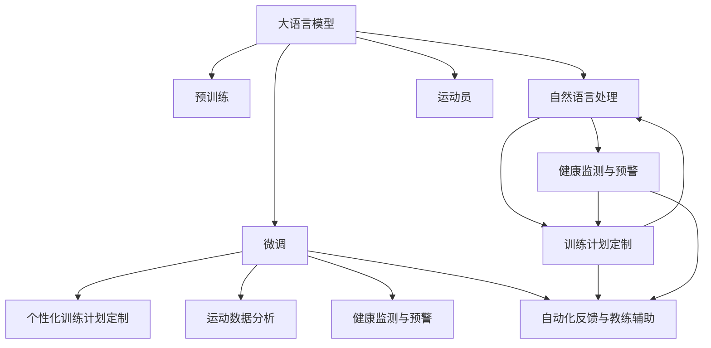

                 

# LLM在体育训练中的应用：AI教练的崛起

> 关键词：
- 体育训练
- 人工智能
- 自然语言处理（NLP）
- 训练计划定制
- 运动分析
- 健康监测
- 自动化反馈
- 教练助理
- 机器学习

## 1. 背景介绍

### 1.1 问题由来
随着人工智能技术的不断进步，AI教练在体育训练中的应用逐渐成为可能。过去，体育教练依靠自身经验、知识和判断，进行运动指导和训练计划制定，耗时长、效率低，且难以保证训练效果的稳定性和个性化。大语言模型（Large Language Model, LLM）作为一种通用的自然语言处理技术，其通过深度学习和自然语言理解的能力，可以更好地协助教练制定训练计划、实时反馈运动员状态、优化训练策略，提升运动表现。

### 1.2 问题核心关键点
大语言模型在体育训练中的应用，主要体现在以下几个方面：
1. **个性化训练计划定制**：根据运动员的个人情况（如体能、技能、偏好等），生成定制化的训练计划。
2. **运动数据分析**：对运动员的训练数据进行实时监控和分析，提供运动表现和进步的可视化反馈。
3. **健康监测与预警**：通过智能设备和传感器，实时监测运动员的生理指标，及时发现异常情况并预警。
4. **自动化反馈与教练辅助**：自动生成训练反馈和建议，辅助教练进行决策，提升训练效率和质量。

### 1.3 问题研究意义
大语言模型在体育训练中的应用，不仅能够提升训练效果，还能解放教练的劳动力，使他们可以将更多精力投入到更高层次的教练策略上。此外，基于大语言模型的智能教练系统，可以无差别服务于更多运动员，推动体育运动的普及和进步。在职业体育领域，基于大语言模型的教练助理，能够帮助运动员和管理团队在高度竞争的环境中保持优势，推动运动技术的不断创新和突破。

## 2. 核心概念与联系

### 2.1 核心概念概述

为更好地理解大语言模型在体育训练中的应用，本节将介绍几个关键概念：

- **大语言模型(Large Language Model, LLM)**：以自回归(如GPT)或自编码(如BERT)模型为代表的大规模预训练语言模型。通过在海量文本数据上进行预训练，学习通用的语言表示，具备强大的自然语言理解能力。
- **预训练(Pre-training)**：指在大规模文本数据上，通过自监督学习任务训练语言模型的过程。预训练使得模型学习到语言的通用表示。
- **微调(Fine-tuning)**：指在预训练模型的基础上，使用体育训练数据，通过有监督学习优化模型在特定体育训练任务上的性能。
- **自然语言处理(NLP)**：涉及计算机如何理解、处理和生成人类语言的技术。
- **健康监测与预警**：利用传感器和智能设备，实时监测运动员的生理和运动数据，并根据异常情况进行预警。
- **训练计划定制**：根据运动员的具体情况，生成个性化的训练计划和指导。
- **自动化反馈与教练辅助**：使用大语言模型自动化生成训练反馈和建议，辅助教练进行决策。

这些核心概念之间的逻辑关系可以通过以下Mermaid流程图来展示：



这个流程图展示了大语言模型在体育训练中的核心作用及其与其他相关概念的联系：

1. 大语言模型通过预训练获得基础能力。
2. 微调对预训练模型进行任务特定的优化，使其适应体育训练的需求。
3. 自然语言处理技术帮助模型理解和生成自然语言指令。
4. 训练计划定制和运动数据分析是体育训练中基于模型的两个重要应用方向。
5. 健康监测与预警技术使大语言模型能够实时监控和预测运动员的生理状况。
6. 自动化反馈与教练辅助技术通过生成自然语言形式的反馈和建议，辅助教练进行训练。

## 3. 核心算法原理 & 具体操作步骤
### 3.1 算法原理概述

大语言模型在体育训练中的应用，本质上是一个有监督的细粒度迁移学习过程。其核心思想是：将预训练的大语言模型作为通用的自然语言处理工具，通过体育训练数据集，对模型进行微调，使其适应特定的体育训练任务。

形式化地，假设预训练语言模型为 $M_{\theta}$，其中 $\theta$ 为预训练得到的模型参数。给定体育训练任务 $T$ 的标注数据集 $D=\{(x_i, y_i)\}_{i=1}^N$，微调的目标是找到新的模型参数 $\hat{\theta}$，使得：

$$
\hat{\theta}=\mathop{\arg\min}_{\theta} \mathcal{L}(M_{\theta},D)
$$

其中 $\mathcal{L}$ 为针对任务 $T$ 设计的损失函数，用于衡量模型预测输出与真实标签之间的差异。常见的损失函数包括交叉熵损失、均方误差损失等。

通过梯度下降等优化算法，微调过程不断更新模型参数 $\theta$，最小化损失函数 $\mathcal{L}$，使得模型输出逼近真实标签。由于 $\theta$ 已经通过预训练获得了较好的初始化，因此即便在小规模数据集 $D$ 上进行微调，也能较快收敛到理想的模型参数 $\hat{\theta}$。

### 3.2 算法步骤详解

大语言模型在体育训练中的微调一般包括以下几个关键步骤：

**Step 1: 准备预训练模型和数据集**
- 选择合适的预训练语言模型 $M_{\theta}$ 作为初始化参数，如 GPT、BERT 等。
- 准备体育训练任务 $T$ 的标注数据集 $D$，划分为训练集、验证集和测试集。一般要求标注数据与预训练数据的分布不要差异过大。

**Step 2: 添加任务适配层**
- 根据体育训练任务类型，在预训练模型顶层设计合适的输出层和损失函数。
- 对于分类任务，通常在顶层添加线性分类器和交叉熵损失函数。
- 对于生成任务，通常使用语言模型的解码器输出概率分布，并以负对数似然为损失函数。

**Step 3: 设置微调超参数**
- 选择合适的优化算法及其参数，如 AdamW、SGD 等，设置学习率、批大小、迭代轮数等。
- 设置正则化技术及强度，包括权重衰减、Dropout、Early Stopping 等。
- 确定冻结预训练参数的策略，如仅微调顶层，或全部参数都参与微调。

**Step 4: 执行梯度训练**
- 将训练集数据分批次输入模型，前向传播计算损失函数。
- 反向传播计算参数梯度，根据设定的优化算法和学习率更新模型参数。
- 周期性在验证集上评估模型性能，根据性能指标决定是否触发 Early Stopping。
- 重复上述步骤直到满足预设的迭代轮数或 Early Stopping 条件。

**Step 5: 测试和部署**
- 在测试集上评估微调后模型 $M_{\hat{\theta}}$ 的性能，对比微调前后的精度提升。
- 使用微调后的模型对新样本进行推理预测，集成到实际的应用系统中。
- 持续收集新的数据，定期重新微调模型，以适应数据分布的变化。

以上是基于监督学习微调大语言模型的一般流程。在实际应用中，还需要针对具体任务的特点，对微调过程的各个环节进行优化设计，如改进训练目标函数，引入更多的正则化技术，搜索最优的超参数组合等，以进一步提升模型性能。

### 3.3 算法优缺点

基于监督学习的大语言模型微调方法具有以下优点：
1. 简单高效。只需准备少量标注数据，即可对预训练模型进行快速适配，获得较大的性能提升。
2. 通用适用。适用于各种体育训练任务，包括动作分析、运动康复、技能提升等，设计简单的任务适配层即可实现微调。
3. 参数高效。利用参数高效微调技术，在固定大部分预训练权重不变的情况下，仍可取得不错的提升。
4. 效果显著。在学术界和工业界的诸多体育训练任务上，基于微调的方法已经刷新了最先进的性能指标。

同时，该方法也存在一定的局限性：
1. 依赖标注数据。微调的效果很大程度上取决于标注数据的质量和数量，获取高质量标注数据的成本较高。
2. 迁移能力有限。当目标任务与预训练数据的分布差异较大时，微调的性能提升有限。
3. 可解释性不足。微调模型的决策过程通常缺乏可解释性，难以对其推理逻辑进行分析和调试。

尽管存在这些局限性，但就目前而言，基于监督学习的微调方法仍是大语言模型应用的最主流范式。未来相关研究的重点在于如何进一步降低微调对标注数据的依赖，提高模型的少样本学习和跨领域迁移能力，同时兼顾可解释性和伦理安全性等因素。

### 3.4 算法应用领域

基于大语言模型微调的监督学习方法，在体育训练领域已经得到了广泛的应用，覆盖了几乎所有常见任务，例如：

- 动作分析与反馈：通过分析运动员的动作，生成实时反馈和指导。
- 运动康复：根据运动员的具体情况，生成个性化的康复训练计划。
- 技能提升：利用语言模型生成训练指导和提示，辅助运动员提升技能水平。
- 训练计划定制：根据运动员的个人情况，生成定制化的训练计划。
- 运动数据分析：实时监控运动员的训练数据，提供运动表现和进步的可视化反馈。
- 健康监测与预警：通过智能设备和传感器，实时监测运动员的生理指标，及时发现异常情况并预警。

除了上述这些经典任务外，大语言模型微调也被创新性地应用到更多场景中，如可控训练视频生成、运动预测、虚拟教练等，为体育训练技术带来了全新的突破。随着预训练模型和微调方法的不断进步，相信体育训练技术必将在更广阔的应用领域大放异彩。

## 4. 数学模型和公式 & 详细讲解  
### 4.1 数学模型构建

本节将使用数学语言对基于监督学习的大语言模型微调过程进行更加严格的刻画。

记预训练语言模型为 $M_{\theta}$，其中 $\theta$ 为模型参数。假设体育训练任务 $T$ 的训练集为 $D=\{(x_i,y_i)\}_{i=1}^N$，其中 $x_i$ 为输入的运动员训练数据，$y_i$ 为标注的输出结果（如动作评分、康复阶段等）。

定义模型 $M_{\theta}$ 在数据样本 $(x,y)$ 上的损失函数为 $\ell(M_{\theta}(x),y)$，则在数据集 $D$ 上的经验风险为：

$$
\mathcal{L}(\theta) = \frac{1}{N} \sum_{i=1}^N \ell(M_{\theta}(x_i),y_i)
$$

微调的优化目标是最小化经验风险，即找到最优参数：

$$
\theta^* = \mathop{\arg\min}_{\theta} \mathcal{L}(\theta)
$$

在实践中，我们通常使用基于梯度的优化算法（如SGD、Adam等）来近似求解上述最优化问题。设 $\eta$ 为学习率，$\lambda$ 为正则化系数，则参数的更新公式为：

$$
\theta \leftarrow \theta - \eta \nabla_{\theta}\mathcal{L}(\theta) - \eta\lambda\theta
$$

其中 $\nabla_{\theta}\mathcal{L}(\theta)$ 为损失函数对参数 $\theta$ 的梯度，可通过反向传播算法高效计算。

### 4.2 公式推导过程

以下我们以动作分析与反馈任务为例，推导交叉熵损失函数及其梯度的计算公式。

假设模型 $M_{\theta}$ 在输入 $x$ 上的输出为 $\hat{y}=M_{\theta}(x) \in [0,1]$，表示模型对动作的评分。真实标签 $y \in \{0,1\}$。则二分类交叉熵损失函数定义为：

$$
\ell(M_{\theta}(x),y) = -[y\log \hat{y} + (1-y)\log (1-\hat{y})]
$$

将其代入经验风险公式，得：

$$
\mathcal{L}(\theta) = -\frac{1}{N}\sum_{i=1}^N [y_i\log M_{\theta}(x_i)+(1-y_i)\log(1-M_{\theta}(x_i))]
$$

根据链式法则，损失函数对参数 $\theta_k$ 的梯度为：

$$
\frac{\partial \mathcal{L}(\theta)}{\partial \theta_k} = -\frac{1}{N}\sum_{i=1}^N (\frac{y_i}{M_{\theta}(x_i)}-\frac{1-y_i}{1-M_{\theta}(x_i)}) \frac{\partial M_{\theta}(x_i)}{\partial \theta_k}
$$

其中 $\frac{\partial M_{\theta}(x_i)}{\partial \theta_k}$ 可进一步递归展开，利用自动微分技术完成计算。

在得到损失函数的梯度后，即可带入参数更新公式，完成模型的迭代优化。重复上述过程直至收敛，最终得到适应体育训练任务的最优模型参数 $\theta^*$。

## 5. 项目实践：代码实例和详细解释说明
### 5.1 开发环境搭建

在进行体育训练任务微调实践前，我们需要准备好开发环境。以下是使用Python进行PyTorch开发的环境配置流程：

1. 安装Anaconda：从官网下载并安装Anaconda，用于创建独立的Python环境。

2. 创建并激活虚拟环境：
```bash
conda create -n pytorch-env python=3.8 
conda activate pytorch-env
```

3. 安装PyTorch：根据CUDA版本，从官网获取对应的安装命令。例如：
```bash
conda install pytorch torchvision torchaudio cudatoolkit=11.1 -c pytorch -c conda-forge
```

4. 安装Transformers库：
```bash
pip install transformers
```

5. 安装各类工具包：
```bash
pip install numpy pandas scikit-learn matplotlib tqdm jupyter notebook ipython
```

完成上述步骤后，即可在`pytorch-env`环境中开始微调实践。

### 5.2 源代码详细实现

下面我以动作分析与反馈任务为例，给出使用Transformers库对BERT模型进行微调的PyTorch代码实现。

首先，定义动作分析与反馈任务的数据处理函数：

```python
from transformers import BertTokenizer
from torch.utils.data import Dataset
import torch

class ActionDataset(Dataset):
    def __init__(self, texts, labels, tokenizer, max_len=128):
        self.texts = texts
        self.labels = labels
        self.tokenizer = tokenizer
        self.max_len = max_len
        
    def __len__(self):
        return len(self.texts)
    
    def __getitem__(self, item):
        text = self.texts[item]
        label = self.labels[item]
        
        encoding = self.tokenizer(text, return_tensors='pt', max_length=self.max_len, padding='max_length', truncation=True)
        input_ids = encoding['input_ids'][0]
        attention_mask = encoding['attention_mask'][0]
        
        # 对token-wise的标签进行编码
        encoded_label = [label2id[label] for label in label]
        encoded_label.extend([label2id['O']] * (self.max_len - len(encoded_label)))
        labels = torch.tensor(encoded_label, dtype=torch.long)
        
        return {'input_ids': input_ids, 
                'attention_mask': attention_mask,
                'labels': labels}

# 标签与id的映射
label2id = {'O': 0, 'G': 1, 'P': 2}
id2label = {v: k for k, v in label2id.items()}

# 创建dataset
tokenizer = BertTokenizer.from_pretrained('bert-base-cased')

train_dataset = ActionDataset(train_texts, train_labels, tokenizer)
dev_dataset = ActionDataset(dev_texts, dev_labels, tokenizer)
test_dataset = ActionDataset(test_texts, test_labels, tokenizer)
```

然后，定义模型和优化器：

```python
from transformers import BertForTokenClassification, AdamW

model = BertForTokenClassification.from_pretrained('bert-base-cased', num_labels=len(label2id))

optimizer = AdamW(model.parameters(), lr=2e-5)
```

接着，定义训练和评估函数：

```python
from torch.utils.data import DataLoader
from tqdm import tqdm
from sklearn.metrics import classification_report

device = torch.device('cuda') if torch.cuda.is_available() else torch.device('cpu')
model.to(device)

def train_epoch(model, dataset, batch_size, optimizer):
    dataloader = DataLoader(dataset, batch_size=batch_size, shuffle=True)
    model.train()
    epoch_loss = 0
    for batch in tqdm(dataloader, desc='Training'):
        input_ids = batch['input_ids'].to(device)
        attention_mask = batch['attention_mask'].to(device)
        labels = batch['labels'].to(device)
        model.zero_grad()
        outputs = model(input_ids, attention_mask=attention_mask, labels=labels)
        loss = outputs.loss
        epoch_loss += loss.item()
        loss.backward()
        optimizer.step()
    return epoch_loss / len(dataloader)

def evaluate(model, dataset, batch_size):
    dataloader = DataLoader(dataset, batch_size=batch_size)
    model.eval()
    preds, labels = [], []
    with torch.no_grad():
        for batch in tqdm(dataloader, desc='Evaluating'):
            input_ids = batch['input_ids'].to(device)
            attention_mask = batch['attention_mask'].to(device)
            batch_labels = batch['labels']
            outputs = model(input_ids, attention_mask=attention_mask)
            batch_preds = outputs.logits.argmax(dim=2).to('cpu').tolist()
            batch_labels = batch_labels.to('cpu').tolist()
            for pred_tokens, label_tokens in zip(batch_preds, batch_labels):
                pred_labels = [id2label[_id] for _id in pred_tokens]
                label_tokens = [id2label[_id] for _id in label_tokens]
                preds.append(pred_labels[:len(label_tokens)])
                labels.append(label_tokens)
                
    print(classification_report(labels, preds))
```

最后，启动训练流程并在测试集上评估：

```python
epochs = 5
batch_size = 16

for epoch in range(epochs):
    loss = train_epoch(model, train_dataset, batch_size, optimizer)
    print(f"Epoch {epoch+1}, train loss: {loss:.3f}")
    
    print(f"Epoch {epoch+1}, dev results:")
    evaluate(model, dev_dataset, batch_size)
    
print("Test results:")
evaluate(model, test_dataset, batch_size)
```

以上就是使用PyTorch对BERT进行动作分析与反馈任务微调的完整代码实现。可以看到，得益于Transformers库的强大封装，我们可以用相对简洁的代码完成BERT模型的加载和微调。

### 5.3 代码解读与分析

让我们再详细解读一下关键代码的实现细节：

**ActionDataset类**：
- `__init__`方法：初始化文本、标签、分词器等关键组件。
- `__len__`方法：返回数据集的样本数量。
- `__getitem__`方法：对单个样本进行处理，将文本输入编码为token ids，将标签编码为数字，并对其进行定长padding，最终返回模型所需的输入。

**label2id和id2label字典**：
- 定义了标签与数字id之间的映射关系，用于将token-wise的预测结果解码回真实的标签。

**训练和评估函数**：
- 使用PyTorch的DataLoader对数据集进行批次化加载，供模型训练和推理使用。
- 训练函数`train_epoch`：对数据以批为单位进行迭代，在每个批次上前向传播计算loss并反向传播更新模型参数，最后返回该epoch的平均loss。
- 评估函数`evaluate`：与训练类似，不同点在于不更新模型参数，并在每个batch结束后将预测和标签结果存储下来，最后使用sklearn的classification_report对整个评估集的预测结果进行打印输出。

**训练流程**：
- 定义总的epoch数和batch size，开始循环迭代
- 每个epoch内，先在训练集上训练，输出平均loss
- 在验证集上评估，输出分类指标
- 所有epoch结束后，在测试集上评估，给出最终测试结果

可以看到，PyTorch配合Transformers库使得BERT微调的代码实现变得简洁高效。开发者可以将更多精力放在数据处理、模型改进等高层逻辑上，而不必过多关注底层的实现细节。

当然，工业级的系统实现还需考虑更多因素，如模型的保存和部署、超参数的自动搜索、更灵活的任务适配层等。但核心的微调范式基本与此类似。

## 6. 实际应用场景
### 6.1 智能康复系统

基于大语言模型微调的康复训练系统，可以广泛应用于运动员和伤病患者的康复训练中。传统的康复训练往往需要医生和物理治疗师全程指导，耗时长、成本高，且难以保证训练效果的一致性。而使用微调后的康复训练系统，可以24小时不间断指导患者进行康复训练，提升训练效率和效果。

在技术实现上，可以收集运动员和患者的康复训练数据，将康复动作和康复阶段构建成监督数据，在此基础上对预训练康复模型进行微调。微调后的模型能够自动判断康复动作是否规范，并根据实时数据调整训练强度和频率。对于患者的具体情况，还可以生成个性化的康复计划，并提供详细的训练指导。如此构建的智能康复系统，能大幅提升康复训练的自动化程度，降低医生和物理治疗师的负担。

### 6.2 运动表现分析

基于大语言模型微调的智能分析系统，可以实时监控运动员的训练数据，并提供运动表现和进步的可视化反馈。运动员的各项指标（如速度、力量、耐力等）可以被动态监测，分析训练效果，生成训练报告，为运动员的训练和比赛提供科学依据。

在技术实现上，可以收集运动员的训练数据，使用预训练模型进行动作分析，生成实时反馈和指导。对于运动员的各项指标，可以结合实时数据和模型预测，生成多维度的训练报告，帮助运动员和教练了解训练效果和提升空间。对于运动表现的数据可视化，可以使用Matplotlib、Tableau等工具进行展示，直观地反映训练情况和进步。

### 6.3 运动预测与模拟

基于大语言模型微调的智能预测系统，可以对运动员的训练效果和比赛表现进行预测和模拟，辅助教练进行决策。例如，在训练过程中，可以使用微调后的模型预测运动员的训练效果，评估训练强度和频率是否合适。在比赛前，可以使用模型预测运动员的表现，为教练制定比赛策略提供参考。

在技术实现上，可以收集运动员的训练数据和比赛历史数据，使用微调模型进行预测。对于训练效果的预测，可以使用回归模型或分类模型，预测运动员各项指标的提升情况。对于比赛表现的预测，可以使用时序预测模型，预测比赛结果和表现。对于预测结果的可视化，可以使用Python的plotly库进行展示，实时更新预测结果和趋势。

### 6.4 未来应用展望

随着大语言模型微调技术的发展，基于大语言模型的智能教练系统将在更多领域得到应用，为体育训练带来变革性影响。

在智慧体育领域，基于大语言模型的智能教练系统可以更好地服务运动员和教练员，提升训练效果和效率。在体育管理领域，基于大语言模型的数据分析和预测，可以为决策者提供科学依据，提升体育管理水平。

在智慧校园领域，基于大语言模型的智能教练系统可以辅助学生进行体育训练，提升身体素质和心理素质。在体育健康领域，基于大语言模型的健康监测和预警，可以为运动员和普通用户提供个性化的健康建议，提升健康水平和生活质量。

此外，在体育装备、体育竞赛、体育教育等众多领域，基于大语言模型的智能教练系统也将不断涌现，为体育事业注入新的活力。相信随着技术的日益成熟，大语言模型微调必将在构建人机协同的智能教练系统中扮演越来越重要的角色。

## 7. 工具和资源推荐
### 7.1 学习资源推荐

为了帮助开发者系统掌握大语言模型在体育训练中的应用，这里推荐一些优质的学习资源：

1. 《Deep Learning in Sports and Recreation》系列书籍：介绍了深度学习在体育和休闲领域的多种应用，涵盖了动作识别、运动分析、运动预测等方向。

2. 《Deep Learning for Sports》课程：由Udacity开设的深度学习在体育领域的在线课程，涵盖各种NLP和计算机视觉技术。

3. 《Sports Science with Deep Learning》书籍：介绍了深度学习在运动科学领域的应用，包括运动分析、训练计划定制等。

4. 《Action Recognition and Analysis in Sports》论文集：汇集了体育领域内最新的动作识别和分析研究成果，适合了解前沿方向。

5. 《Sports Performance Analysis with Deep Learning》论文集：介绍了深度学习在运动表现分析中的应用，涵盖多种指标的建模与预测。

通过对这些资源的学习实践，相信你一定能够快速掌握大语言模型在体育训练中的应用精髓，并用于解决实际的体育训练问题。
###  7.2 开发工具推荐

高效的开发离不开优秀的工具支持。以下是几款用于大语言模型在体育训练中微调开发的常用工具：

1. PyTorch：基于Python的开源深度学习框架，灵活动态的计算图，适合快速迭代研究。大部分预训练语言模型都有PyTorch版本的实现。

2. TensorFlow：由Google主导开发的开源深度学习框架，生产部署方便，适合大规模工程应用。同样有丰富的预训练语言模型资源。

3. Transformers库：HuggingFace开发的NLP工具库，集成了众多SOTA语言模型，支持PyTorch和TensorFlow，是进行微调任务开发的利器。

4. Weights & Biases：模型训练的实验跟踪工具，可以记录和可视化模型训练过程中的各项指标，方便对比和调优。与主流深度学习框架无缝集成。

5. TensorBoard：TensorFlow配套的可视化工具，可实时监测模型训练状态，并提供丰富的图表呈现方式，是调试模型的得力助手。

6. Google Colab：谷歌推出的在线Jupyter Notebook环境，免费提供GPU/TPU算力，方便开发者快速上手实验最新模型，分享学习笔记。

合理利用这些工具，可以显著提升大语言模型在体育训练中微调任务的开发效率，加快创新迭代的步伐。

### 7.3 相关论文推荐

大语言模型在体育训练中的应用，源于学界的持续研究。以下是几篇奠基性的相关论文，推荐阅读：

1. **Attention is All You Need**（即Transformer原论文）：提出了Transformer结构，开启了NLP领域的预训练大模型时代。

2. **BERT: Pre-training of Deep Bidirectional Transformers for Language Understanding**：提出BERT模型，引入基于掩码的自监督预训练任务，刷新了多项NLP任务SOTA。

3. **Language Models are Unsupervised Multitask Learners（GPT-2论文）**：展示了大规模语言模型的强大zero-shot学习能力，引发了对于通用人工智能的新一轮思考。

4. **Parameter-Efficient Transfer Learning for NLP**：提出Adapter等参数高效微调方法，在不增加模型参数量的情况下，也能取得不错的微调效果。

5. **Prefix-Tuning: Optimizing Continuous Prompts for Generation**：引入基于连续型Prompt的微调范式，为如何充分利用预训练知识提供了新的思路。

6. **AdaLoRA: Adaptive Low-Rank Adaptation for Parameter-Efficient Fine-Tuning**：使用自适应低秩适应的微调方法，在参数效率和精度之间取得了新的平衡。

这些论文代表了大语言模型在体育训练中的应用方向。通过学习这些前沿成果，可以帮助研究者把握学科前进方向，激发更多的创新灵感。

## 8. 总结：未来发展趋势与挑战
### 8.1 总结

本文对大语言模型在体育训练中的应用进行了全面系统的介绍。首先阐述了体育训练中大语言模型的研究背景和意义，明确了微调在拓展预训练模型应用、提升训练效果方面的独特价值。其次，从原理到实践，详细讲解了监督微调的数学原理和关键步骤，给出了微调任务开发的完整代码实例。同时，本文还广泛探讨了大语言模型在体育训练中的实际应用场景，展示了微调范式的巨大潜力。最后，本文精选了微调技术的各类学习资源，力求为读者提供全方位的技术指引。

通过本文的系统梳理，可以看到，基于大语言模型的微调方法正在成为体育训练的重要范式，极大地提升训练效果和效率，解放教练和物理治疗师劳动力。大语言模型微调将引领体育训练向智能化、自动化方向发展，为运动员和康复者带来更科学、更高效的训练体验。

### 8.2 未来发展趋势

展望未来，大语言模型在体育训练中的应用将呈现以下几个发展趋势：

1. **多模态融合**：结合视觉、语音等多模态数据，提升动作分析的准确性和全面性。例如，利用摄像头捕捉运动员的动态，结合语言模型进行动作识别和分析。

2. **实时可视化**：实时监控运动员的各项指标，生成动态的训练报告和可视化图表，帮助教练和运动员直观了解训练效果。例如，使用Tableau、Plotly等工具进行数据可视化。

3. **个性化训练计划定制**：结合运动员的具体情况（如体能、技能、偏好等），生成个性化的训练计划和指导。例如，使用BERT等模型对运动员的各项数据进行分析，生成个性化训练建议。

4. **运动预测与模拟**：利用历史数据和预测模型，对运动员的训练效果和比赛表现进行预测和模拟，辅助教练进行决策。例如，使用深度学习模型对运动员的训练数据进行回归或分类预测，生成运动表现和进步的可视化反馈。

5. **跨领域知识整合**：结合体育领域的专家知识和常识，增强模型的泛化能力和鲁棒性。例如，利用领域专家的经验，对模型进行领域适应的微调，提升模型在特定领域的应用效果。

6. **伦理性与安全性**：在大语言模型训练和应用中，引入伦理性、安全性的约束，避免模型产生有害的输出，确保应用的道德和法律合规性。

以上趋势凸显了大语言模型在体育训练中的广阔前景。这些方向的探索发展，必将进一步提升体育训练的效果和效率，为运动员和教练带来更多的科学指导和支持。

### 8.3 面临的挑战

尽管大语言模型在体育训练中的应用已经取得了显著成效，但在迈向更加智能化、普适化应用的过程中，它仍面临诸多挑战：

1. **数据隐私和安全**：在收集和处理运动员数据时，需要严格保护数据隐私，确保数据安全。如何设计合理的隐私保护机制，是未来研究的重要方向。

2. **模型鲁棒性和泛化性**：当前大语言模型在特定领域的应用效果往往优于一般领域，如何在不同领域中保持一致的鲁棒性和泛化性，需要进一步的研究。

3. **模型计算效率**：大语言模型的计算资源消耗较大，如何优化模型结构，提升计算效率，是未来研究的重要方向。

4. **模型可解释性和透明性**：目前大语言模型的决策过程缺乏可解释性，难以对其推理逻辑进行分析和调试。如何赋予模型更强的可解释性，是未来研究的重要方向。

5. **模型伦理和责任**：在训练和应用过程中，需要考虑模型的伦理性，避免模型产生有害的输出。如何设计合理的伦理导向评估指标，是未来研究的重要方向。

6. **多模态数据融合**：在融合视觉、语音等多模态数据时，需要考虑不同数据类型之间的兼容性和一致性。如何设计统一的多模态数据处理流程，是未来研究的重要方向。

7. **跨领域知识融合**：在结合领域专家的知识和常识时，需要考虑不同领域知识之间的融合和冲突。如何设计合理的知识融合机制，是未来研究的重要方向。

这些挑战需要学界和产业界的共同努力，不断创新和优化，才能确保大语言模型在体育训练中的应用效果和质量。

### 8.4 研究展望

面对大语言模型在体育训练中的应用所面临的种种挑战，未来的研究需要在以下几个方面寻求新的突破：

1. **无监督和半监督微调方法**：探索无监督和半监督微调方法，摆脱对大规模标注数据的依赖，利用自监督学习、主动学习等技术，最大限度地利用非结构化数据，实现更加灵活高效的微调。

2. **参数高效和计算高效的微调范式**：开发更加参数高效的微调方法，在固定大部分预训练参数的情况下，只更新极少量的任务相关参数。同时优化微调模型的计算图，减少前向传播和反向传播的资源消耗，实现更加轻量级、实时性的部署。

3. **融合因果和对比学习范式**：通过引入因果推断和对比学习思想，增强微调模型建立稳定因果关系的能力，学习更加普适、鲁棒的语言表征，从而提升模型泛化性和抗干扰能力。

4. **结合领域专家的知识**：将符号化的先验知识，如知识图谱、逻辑规则等，与神经网络模型进行巧妙融合，引导微调过程学习更准确、合理的语言模型。同时加强不同模态数据的整合，实现视觉、语音等多模态信息与文本信息的协同建模。

5. **引入伦理道德约束**：在模型训练目标中引入伦理导向的评估指标，过滤和惩罚有偏见、有害的输出倾向。同时加强人工干预和审核，建立模型行为的监管机制，确保输出符合人类价值观和伦理道德。

这些研究方向的探索，必将引领大语言模型在体育训练中的应用走向更高的台阶，为构建安全、可靠、可解释、可控的智能系统铺平道路。面向未来，大语言模型在体育训练中的应用需要与其他人工智能技术进行更深入的融合，如知识表示、因果推理、强化学习等，多路径协同发力，共同推动自然语言理解和智能交互系统的进步。只有勇于创新、敢于突破，才能不断拓展语言模型的边界，让智能技术更好地造福体育训练领域。

## 9. 附录：常见问题与解答
**Q1：大语言模型在体育训练中如何处理数据？**

A: 大语言模型在体育训练中通常通过以下步骤处理数据：

1. **数据收集**：收集运动员的训练数据、比赛数据、康复数据等，包括动作视频、训练记录、生理指标等。

2. **数据清洗**：对数据进行清洗，去除异常值、缺失值等噪声数据，确保数据的质量和一致性。

3. **数据标注**：根据任务的特定需求，对数据进行标注，生成监督数据。例如，动作分析与反馈任务中，需要对运动员的动作进行标注，生成训练数据集。

4. **数据预处理**：将数据转换为模型可以处理的格式。例如，将视频数据转换为图像序列，将生理指标转换为数值数据。

5. **特征提取**：对数据进行特征提取，生成模型所需的输入。例如，使用分词器将文本转换为token ids，使用预训练模型提取动作特征。

6. **数据增强**：在训练过程中，通过对数据进行回译、近义替换等方式，扩充训练集，提升模型的泛化能力。例如，将动作视频进行回译，生成新的动作视频。

通过上述数据处理流程，大语言模型可以有效地利用体育训练数据，进行动作分析、训练计划定制等任务。

**Q2：大语言模型在体育训练中如何提高模型的鲁棒性？**

A: 提高大语言模型在体育训练中的鲁棒性，可以从以下几个方面入手：

1. **正则化技术**：使用L2正则、Dropout等正则化技术，防止模型过度拟合，提高模型的鲁棒性。

2. **对抗训练**：引入对抗样本，增强模型的鲁棒性。对抗样本可以模拟真实场景中的干扰和噪声，提升模型的鲁棒性和泛化能力。

3. **多模型集成**：训练多个微调模型，取平均输出，抑制过拟合。多个模型可以互补彼此的优势，提高整体的鲁棒性。

4. **参数高效微调**：只更新少量参数，保留大部分预训练权重不变，减少过拟合风险。例如，使用Adapter等参数高效微调方法。

5. **对抗性训练**：训练模型对对抗样本的鲁棒性，提高模型的鲁棒性。

6. **数据增强**：通过回译、近义替换等方式扩充训练集，提升模型的鲁棒性。

7. **迁移学习**：利用其他领域的数据进行迁移学习，提高模型的泛化能力。例如，将运动表现数据与其他领域的文本数据进行迁移学习。

8. **持续学习**：保持模型的更新和训练，不断学习新数据和新知识，避免模型过时和遗忘旧知识。

通过上述方法，可以在体育训练中提升大语言模型的鲁棒性，使其在面对各种复杂环境和干扰时，仍能保持较高的准确性和稳定性。

**Q3：大语言模型在体育训练中的应用效果如何？**

A: 大语言模型在体育训练中的应用效果显著，具体表现如下：

1. **动作分析与反馈**：通过动作分析与反馈任务，大语言模型可以实时监控运动员的动作，生成实时反馈和指导，提升训练效果。例如，利用BERT模型进行动作识别，生成动作评分和改进建议。

2. **训练计划定制**：通过训练计划定制任务，大语言模型可以生成个性化的训练计划，提高训练效果和效率。例如，利用GPT模型生成运动员的个性化训练计划，提升训练的针对性和科学性。

3. **运动预测与模拟**：通过运动预测与模拟任务，大语言模型可以对运动员的训练效果和比赛表现进行预测和模拟，辅助教练进行决策。例如，利用深度学习模型对运动员的训练数据进行回归或分类预测，生成运动表现和进步的可视化反馈。

4. **运动康复**：通过运动康复任务，大语言模型可以生成个性化的康复计划，提升康复效果和效率。例如，利用BERT模型对运动员的康复数据进行分析，生成康复建议和计划。

5. **运动表现分析**：通过运动表现分析任务，大语言模型可以实时监控运动员的各项指标，生成动态的训练报告和可视化图表，帮助教练和运动员直观了解训练效果。例如，使用Tableau、Plotly等工具进行数据可视化，直观展示运动员的各项指标和进步情况。

通过上述应用效果，可以看到，大语言模型在体育训练中的应用效果显著，能够提升训练效果和效率，帮助教练和运动员更好地制定和执行训练计划，提升运动表现和康复效果。

**Q4：大语言模型在体育训练中如何提高模型的泛化能力？**

A: 提高大语言模型在体育训练中的泛化能力，可以从以下几个方面入手：

1. **数据多样性**：使用多样化的数据进行训练，涵盖不同的运动员、不同的训练环境和不同的运动类型。例如，使用不同运动员的视频数据、不同训练环境的传感器数据、不同运动类型的动作数据。

2. **正则化技术**：使用L2正则、Dropout等正则化技术，防止模型过度拟合，提高模型的泛化能力。

3. **对抗训练**：引入对抗样本，增强模型的泛化能力。对抗样本可以模拟真实场景中的干扰和噪声，提升模型的鲁棒性和泛化能力。

4. **数据增强**：通过回译、近义替换等方式扩充训练集，提升模型的泛化能力。例如，将动作视频进行回译，生成新的动作视频。

5. **迁移学习**：利用其他领域的数据进行迁移学习，提高模型的泛化能力。例如，将运动表现数据与其他领域的文本数据进行迁移学习。

6. **持续学习**：保持模型的更新和训练，不断学习新数据和新知识，避免模型过时和遗忘旧知识。

7. **多模型集成**：训练多个微调模型，取平均输出，抑制过拟合。多个模型可以互补彼此的优势，提高整体的泛化能力。

8. **参数高效微调**：只更新少量参数，保留大部分预训练权重不变，减少过拟合风险。例如，使用Adapter等参数高效微调方法。

通过上述方法，可以在体育训练中提高大语言模型的泛化能力，使其在面对各种复杂环境和干扰时，仍能保持较高的准确性和稳定性。

**Q5：大语言模型在体育训练中如何进行动作分析与反馈？**

A: 大语言模型在体育训练中进行动作分析与反馈，通常通过以下步骤：

1. **数据收集**：收集运动员的训练视频、动作数据、生理指标等数据。

2. **数据预处理**：将视频数据转换为图像序列，将生理指标转换为数值数据。

3. **特征提取**：使用预训练模型提取动作特征。例如，利用BERT模型对动作进行编码，生成动作表示向量。

4. **

