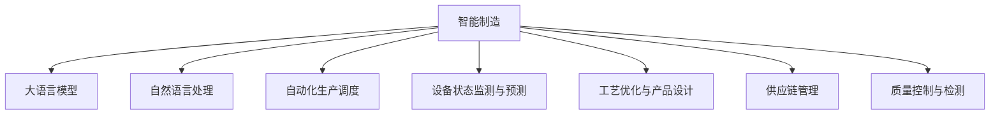

                 

## 1. 背景介绍

### 1.1 问题由来

随着全球制造业的数字化转型和智能化的升级，智能制造（Intelligent Manufacturing）已经成为推动工业4.0发展的重要方向。智能制造通过广泛应用信息通信技术（ICT），实现生产过程的智能化、网络化、协同化，以提升产品质量、降低成本、缩短交货周期。然而，传统制造系统的设计、生产、运维等环节仍存在诸多挑战，如复杂多变的生产工艺、庞大复杂的数据系统、高度协调的作业流程等。

大语言模型（Large Language Models, LLM），作为近年来人工智能领域的重大突破，具备强大的语言理解和生成能力，正在逐渐成为智能制造的重要技术支撑。通过深度学习算法和海量数据预训练，LLM能够从文本中自动提取和分析信息，智能生成决策方案，极大地提升了生产系统中的信息处理效率和决策精度。

### 1.2 问题核心关键点

智能制造的复杂性对技术应用提出了更高要求。LLM在智能制造中的应用核心关键点主要包括：

- **自动化生产调度**：根据实时生产数据和历史经验，自动生成生产计划和调度方案，优化资源配置。
- **设备状态监测与预测**：通过分析设备运行数据，预测设备故障，提前进行维护和修理。
- **工艺优化与产品设计**：基于历史数据和专家经验，智能优化生产工艺流程，设计更高效的产品。
- **供应链管理**：实时跟踪供应链状态，优化物料管理和订单调度，提高物流效率。
- **质量控制与检测**：通过智能分析生产数据，实时监控产品质量，确保产品质量稳定。

LLM通过自然语言处理（NLP）技术，实现对海量制造数据的智能分析和理解，从而为生产过程的各个环节提供高效、准确的信息支持。

### 1.3 问题研究意义

研究LLM在智能制造中的应用，对推动工业4.0和智能制造技术的深入发展具有重要意义：

1. **提升生产效率**：通过智能化的决策支持系统，LLM能够优化生产流程，减少人工干预，提高生产效率。
2. **降低生产成本**：通过预测性维护和精确的质量控制，LLM能够减少设备停机时间和材料浪费，降低生产成本。
3. **改善供应链管理**：智能化的供应链管理能够实时响应市场需求，优化库存管理和物流配送，提升供应链的灵活性和响应速度。
4. **增强质量控制**：智能化的质量检测能够及时发现生产中的问题，避免次品流出，提升产品质量和品牌声誉。
5. **促进创新设计**：LLM能够从历史数据和市场反馈中提取有价值的信息，辅助工程师进行产品设计和工艺优化。

## 2. 核心概念与联系

### 2.1 核心概念概述

为更好地理解LLM在智能制造中的应用，本节将介绍几个密切相关的核心概念：

- **智能制造**：融合了信息通信技术和智能制造技术的现代制造模式，以实现生产过程的智能化、网络化、协同化。
- **大语言模型**：以自回归或自编码模型为代表的大规模预训练语言模型。通过在大规模无标签文本语料上进行预训练，学习通用的语言知识和领域知识。
- **自然语言处理**：涉及计算机理解和处理人类语言的技术，包括文本分类、信息抽取、机器翻译等。
- **自动化生产调度**：利用计算技术自动安排生产任务的调度，优化资源配置，提高生产效率。
- **设备状态监测与预测**：通过分析设备运行数据，预测设备故障，提前进行维护和修理。
- **工艺优化与产品设计**：基于历史数据和专家经验，智能优化生产工艺流程，设计更高效的产品。
- **供应链管理**：实时跟踪供应链状态，优化物料管理和订单调度，提高物流效率。
- **质量控制与检测**：通过智能分析生产数据，实时监控产品质量，确保产品质量稳定。

这些核心概念之间的逻辑关系可以通过以下Mermaid流程图来展示：



这个流程图展示了大语言模型在智能制造中的核心应用方向，以及各个应用环节间的相互依赖关系。

## 3. 核心算法原理 & 具体操作步骤

### 3.1 算法原理概述

基于大语言模型（LLM）的智能制造系统，其核心原理是通过NLP技术对生产数据进行智能分析和理解，以提供高效、准确的决策支持。具体来说，LLM能够从以下几个方面实现对智能制造的支持：

- **数据获取与清洗**：通过传感器、监控设备等技术手段，实时获取生产数据，并进行数据清洗和预处理。
- **信息抽取与分析**：利用LLM的自然语言处理能力，从生产日志、设备状态报告、质量检测结果等文本数据中自动抽取和分析信息。
- **知识推理与决策支持**：根据抽取出的信息，结合领域知识和专家经验，利用LLM进行知识推理，生成决策方案。
- **任务自动化与执行**：将决策方案转化为具体的生产任务，自动调度生产资源，执行任务。

通过这一系列步骤，LLM能够在智能制造系统中实现对生产流程的自动化管理，优化资源配置，提高生产效率。

### 3.2 算法步骤详解

基于LLM的智能制造系统，其算法流程主要包括：

**Step 1: 数据采集与预处理**

- **传感器与监控设备**：安装和部署各类传感器和监控设备，实时采集生产数据，如温度、压力、振动等。
- **数据清洗与预处理**：对采集的数据进行去噪、归一化、缺失值处理等预处理操作，确保数据的质量和一致性。

**Step 2: 自然语言处理**

- **文本数据获取**：将生产日志、设备状态报告、质量检测结果等文本数据导入LLM。
- **信息抽取与分析**：使用LLM进行信息抽取，识别出关键事件和数据，如设备故障、质量异常等。
- **知识推理**：结合领域知识和专家经验，利用LLM进行知识推理，生成预测和决策方案。

**Step 3: 决策与执行**

- **决策方案生成**：根据推理结果，生成具体的生产调度、设备维护、工艺优化等决策方案。
- **自动化执行**：利用工业互联网平台，将决策方案转化为具体的生产任务，自动调度生产资源，执行任务。

**Step 4: 反馈与优化**

- **结果评估**：对执行结果进行评估，计算性能指标，如生产效率、设备利用率、产品质量等。
- **持续优化**：根据评估结果，调整模型参数和决策策略，优化生产流程和资源配置。

### 3.3 算法优缺点

基于LLM的智能制造系统，具有以下优点：

- **高效性**：LLM能够实时处理大量生产数据，自动生成决策方案，显著提升生产效率。
- **准确性**：通过自然语言处理和知识推理，LLM能够准确理解生产过程，减少人工干预。
- **灵活性**：LLM能够灵活适应不同生产场景，自动调整决策策略，提高系统的鲁棒性。

然而，该系统也存在一定的局限性：

- **数据依赖**：系统对数据的依赖较大，数据采集和预处理环节可能影响系统性能。
- **计算资源**：大语言模型的计算资源消耗较大，需要高性能的计算平台支持。
- **可解释性**：LLM的决策过程缺乏可解释性，难以进行详细的性能分析和调试。
- **数据隐私**：生产数据可能涉及企业商业机密，系统需要保证数据隐私和安全。

### 3.4 算法应用领域

基于大语言模型的智能制造系统，已经在多个应用领域取得了显著成效：

- **生产调度与优化**：如智能制造中的物料需求计划（MRP）系统，通过自动生成生产计划，优化资源配置。
- **设备状态监测与维护**：如智能制造中的设备故障预测系统，通过分析设备运行数据，提前进行维护和修理。
- **工艺优化与产品设计**：如智能制造中的工艺优化系统，通过历史数据和专家经验，智能优化生产工艺流程，设计更高效的产品。
- **供应链管理**：如智能制造中的供应链管理系统，实时跟踪供应链状态，优化物料管理和订单调度，提高物流效率。
- **质量控制与检测**：如智能制造中的质量检测系统，通过智能分析生产数据，实时监控产品质量，确保产品质量稳定。

除了上述这些经典应用外，智能制造中还涌现了更多创新应用，如基于LLM的生产异常检测系统、智能制造中的故障诊断系统等，为智能制造的发展注入了新的活力。

## 4. 数学模型和公式 & 详细讲解 & 举例说明

### 4.1 数学模型构建

假设智能制造系统由多个生产单元组成，每个单元的输出（如产量、质量、能耗等）和输入（如设备状态、物料库存、订单信息等）可以用向量 $x_i$ 表示。设 $x_i$ 的维度为 $n$。

系统通过LLM对输入数据进行处理，生成决策输出 $y_i$，用于指导生产调度、设备维护、工艺优化等任务。决策输出 $y_i$ 可以表示为：

$$
y_i = f(x_i; \theta)
$$

其中 $f$ 为LLM模型，$\theta$ 为模型参数。

智能制造系统的目标是最小化生产成本，最大化生产效率。假设有 $N$ 个生产单元，总成本函数为 $C$，总效率函数为 $E$。系统通过LLM生成的决策输出 $y_i$ 将影响 $x_i$ 的变化，即：

$$
x_i' = g(x_i, y_i)
$$

其中 $g$ 为生产决策函数。

系统的优化目标为：

$$
\min_{\theta} \sum_{i=1}^N [C(x_i', y_i) + \lambda E(x_i', y_i)]
$$

其中 $\lambda$ 为正则化系数。

### 4.2 公式推导过程

为了实现上述优化目标，需要引入LLM的计算过程。假设LLM的输入为 $x_i$，输出为 $y_i$，则LLM的计算过程可以表示为：

$$
y_i = M(x_i; \theta)
$$

其中 $M$ 为LLM模型，$\theta$ 为模型参数。

将 $y_i$ 代入生产决策函数 $g$ 中，得：

$$
x_i' = g(x_i, M(x_i; \theta))
$$

将 $x_i'$ 代入成本函数和效率函数中，得：

$$
C(x_i', M(x_i; \theta)) = \sum_{i=1}^N C(x_i', M(x_i; \theta))
$$
$$
E(x_i', M(x_i; \theta)) = \sum_{i=1}^N E(x_i', M(x_i; \theta))
$$

因此，系统的优化目标可以表示为：

$$
\min_{\theta} \sum_{i=1}^N [C(x_i', M(x_i; \theta)) + \lambda E(x_i', M(x_i; \theta))]
$$

### 4.3 案例分析与讲解

以智能制造中的物料需求计划（MRP）系统为例，分析LLM的计算过程。

假设系统需要根据历史生产数据和市场订单，生成未来的物料需求计划。系统的输入为历史生产数据和市场订单，输出为未来的物料需求。假设历史生产数据和市场订单可以用向量 $x_i$ 表示，未来的物料需求可以用向量 $y_i$ 表示。

将 $x_i$ 和 $y_i$ 代入LLM模型 $M$ 中，得：

$$
y_i = M(x_i; \theta)
$$

将 $y_i$ 代入生产决策函数 $g$ 中，得：

$$
x_i' = g(x_i, M(x_i; \theta))
$$

将 $x_i'$ 代入成本函数和效率函数中，得：

$$
C(x_i', M(x_i; \theta)) = C(x_i', y_i)
$$
$$
E(x_i', M(x_i; \theta)) = E(x_i', y_i)
$$

因此，系统的优化目标可以表示为：

$$
\min_{\theta} \sum_{i=1}^N [C(x_i', M(x_i; \theta)) + \lambda E(x_i', M(x_i; \theta))]
$$

通过上述过程，可以清晰地看到LLM在智能制造系统中的应用，以及系统优化的数学模型。

## 5. 项目实践：代码实例和详细解释说明

### 5.1 开发环境搭建

在进行LLM在智能制造中的应用实践前，我们需要准备好开发环境。以下是使用Python进行PyTorch开发的环境配置流程：

1. 安装Anaconda：从官网下载并安装Anaconda，用于创建独立的Python环境。

2. 创建并激活虚拟环境：
```bash
conda create -n pytorch-env python=3.8 
conda activate pytorch-env
```

3. 安装PyTorch：根据CUDA版本，从官网获取对应的安装命令。例如：
```bash
conda install pytorch torchvision torchaudio cudatoolkit=11.1 -c pytorch -c conda-forge
```

4. 安装各类工具包：
```bash
pip install numpy pandas scikit-learn matplotlib tqdm jupyter notebook ipython
```

完成上述步骤后，即可在`pytorch-env`环境中开始实践。

### 5.2 源代码详细实现

这里我们以智能制造中的设备状态监测系统为例，给出使用Transformers库对BERT模型进行微调的PyTorch代码实现。

首先，定义设备状态监测任务的数据处理函数：

```python
from transformers import BertTokenizer
from torch.utils.data import Dataset
import torch

class EquipmentStatusDataset(Dataset):
    def __init__(self, texts, labels, tokenizer, max_len=128):
        self.texts = texts
        self.labels = labels
        self.tokenizer = tokenizer
        self.max_len = max_len
        
    def __len__(self):
        return len(self.texts)
    
    def __getitem__(self, item):
        text = self.texts[item]
        label = self.labels[item]
        
        encoding = self.tokenizer(text, return_tensors='pt', max_length=self.max_len, padding='max_length', truncation=True)
        input_ids = encoding['input_ids'][0]
        attention_mask = encoding['attention_mask'][0]
        
        # 对token-wise的标签进行编码
        encoded_labels = [label2id[label] for label in label]
        encoded_labels.extend([label2id['normal']] * (self.max_len - len(encoded_labels)))
        labels = torch.tensor(encoded_labels, dtype=torch.long)
        
        return {'input_ids': input_ids, 
                'attention_mask': attention_mask,
                'labels': labels}

# 标签与id的映射
label2id = {'normal': 0, 'failure': 1, 'maintenance': 2}
id2label = {v: k for k, v in label2id.items()}

# 创建dataset
tokenizer = BertTokenizer.from_pretrained('bert-base-cased')

train_dataset = EquipmentStatusDataset(train_texts, train_labels, tokenizer)
dev_dataset = EquipmentStatusDataset(dev_texts, dev_labels, tokenizer)
test_dataset = EquipmentStatusDataset(test_texts, test_labels, tokenizer)
```

然后，定义模型和优化器：

```python
from transformers import BertForTokenClassification, AdamW

model = BertForTokenClassification.from_pretrained('bert-base-cased', num_labels=len(label2id))

optimizer = AdamW(model.parameters(), lr=2e-5)
```

接着，定义训练和评估函数：

```python
from torch.utils.data import DataLoader
from tqdm import tqdm
from sklearn.metrics import classification_report

device = torch.device('cuda') if torch.cuda.is_available() else torch.device('cpu')
model.to(device)

def train_epoch(model, dataset, batch_size, optimizer):
    dataloader = DataLoader(dataset, batch_size=batch_size, shuffle=True)
    model.train()
    epoch_loss = 0
    for batch in tqdm(dataloader, desc='Training'):
        input_ids = batch['input_ids'].to(device)
        attention_mask = batch['attention_mask'].to(device)
        labels = batch['labels'].to(device)
        model.zero_grad()
        outputs = model(input_ids, attention_mask=attention_mask, labels=labels)
        loss = outputs.loss
        epoch_loss += loss.item()
        loss.backward()
        optimizer.step()
    return epoch_loss / len(dataloader)

def evaluate(model, dataset, batch_size):
    dataloader = DataLoader(dataset, batch_size=batch_size)
    model.eval()
    preds, labels = [], []
    with torch.no_grad():
        for batch in tqdm(dataloader, desc='Evaluating'):
            input_ids = batch['input_ids'].to(device)
            attention_mask = batch['attention_mask'].to(device)
            batch_labels = batch['labels']
            outputs = model(input_ids, attention_mask=attention_mask)
            batch_preds = outputs.logits.argmax(dim=2).to('cpu').tolist()
            batch_labels = batch_labels.to('cpu').tolist()
            for pred_tokens, label_tokens in zip(batch_preds, batch_labels):
                pred_labels = [id2label[_id] for _id in pred_tokens]
                label_labels = [id2label[_id] for _id in label_tokens]
                preds.append(pred_labels[:len(label_labels)])
                labels.append(label_labels)
                
    print(classification_report(labels, preds))
```

最后，启动训练流程并在测试集上评估：

```python
epochs = 5
batch_size = 16

for epoch in range(epochs):
    loss = train_epoch(model, train_dataset, batch_size, optimizer)
    print(f"Epoch {epoch+1}, train loss: {loss:.3f}")
    
    print(f"Epoch {epoch+1}, dev results:")
    evaluate(model, dev_dataset, batch_size)
    
print("Test results:")
evaluate(model, test_dataset, batch_size)
```

以上就是使用PyTorch对BERT进行设备状态监测任务微调的完整代码实现。可以看到，得益于Transformers库的强大封装，我们可以用相对简洁的代码完成BERT模型的加载和微调。

### 5.3 代码解读与分析

让我们再详细解读一下关键代码的实现细节：

**EquipmentStatusDataset类**：
- `__init__`方法：初始化文本、标签、分词器等关键组件。
- `__len__`方法：返回数据集的样本数量。
- `__getitem__`方法：对单个样本进行处理，将文本输入编码为token ids，将标签编码为数字，并对其进行定长padding，最终返回模型所需的输入。

**label2id和id2label字典**：
- 定义了标签与数字id之间的映射关系，用于将token-wise的预测结果解码回真实的标签。

**训练和评估函数**：
- 使用PyTorch的DataLoader对数据集进行批次化加载，供模型训练和推理使用。
- 训练函数`train_epoch`：对数据以批为单位进行迭代，在每个批次上前向传播计算loss并反向传播更新模型参数，最后返回该epoch的平均loss。
- 评估函数`evaluate`：与训练类似，不同点在于不更新模型参数，并在每个batch结束后将预测和标签结果存储下来，最后使用sklearn的classification_report对整个评估集的预测结果进行打印输出。

**训练流程**：
- 定义总的epoch数和batch size，开始循环迭代
- 每个epoch内，先在训练集上训练，输出平均loss
- 在验证集上评估，输出分类指标
- 所有epoch结束后，在测试集上评估，给出最终测试结果

可以看到，PyTorch配合Transformers库使得BERT微调的代码实现变得简洁高效。开发者可以将更多精力放在数据处理、模型改进等高层逻辑上，而不必过多关注底层的实现细节。

当然，工业级的系统实现还需考虑更多因素，如模型的保存和部署、超参数的自动搜索、更灵活的任务适配层等。但核心的微调范式基本与此类似。

## 6. 实际应用场景

### 6.1 智能制造中的生产调度

在智能制造中，生产调度是确保生产效率和资源利用率的关键环节。基于LLM的生产调度系统，能够自动生成最优的生产计划和调度方案，优化资源配置，提升生产效率。

具体而言，系统可以收集历史生产数据、市场需求和设备状态信息，利用LLM进行信息抽取和分析，生成未来的生产计划和调度方案。系统能够实时跟踪生产状态，自动调整生产计划，以应对生产过程中的各种变化，确保生产过程的高效稳定。

### 6.2 智能制造中的设备状态监测与预测

设备状态监测与预测是智能制造中的重要任务。基于LLM的设备状态监测系统，能够实时获取设备运行数据，自动进行状态分析和故障预测。

系统通过分析设备的运行数据，利用LLM进行知识推理，生成设备故障预测报告。系统能够实时跟踪设备状态，提前发现异常，预测设备故障，及时进行维护和修理，减少停机时间和维护成本，提升生产效率。

### 6.3 智能制造中的工艺优化与产品设计

工艺优化与产品设计是智能制造中的重要环节。基于LLM的工艺优化系统，能够从历史数据和专家经验中提取有价值的信息，智能优化生产工艺流程，设计更高效的产品。

系统可以收集历史生产数据、工艺参数和产品设计信息，利用LLM进行信息抽取和分析，生成最优的生产工艺方案和产品设计方案。系统能够实时跟踪生产状态，自动调整工艺参数，以应对生产过程中的各种变化，确保生产过程的高效稳定。

### 6.4 智能制造中的供应链管理

供应链管理是智能制造中的重要环节。基于LLM的供应链管理系统，能够实时跟踪供应链状态，优化物料管理和订单调度，提高物流效率。

系统可以收集供应链数据、市场需求和库存信息，利用LLM进行信息抽取和分析，生成最优的物料管理和订单调度方案。系统能够实时跟踪供应链状态，自动调整物料和订单调度，以应对市场需求和生产变化，确保供应链的高效稳定。

### 6.5 智能制造中的质量控制与检测

质量控制与检测是智能制造中的重要环节。基于LLM的质量控制与检测系统，能够实时监控产品质量，确保产品质量稳定。

系统可以收集产品质量数据、生产工艺参数和历史质量报告信息，利用LLM进行信息抽取和分析，生成最优的质量控制方案和检测策略。系统能够实时监控产品质量，自动调整质量控制方案，以应对生产过程中的各种变化，确保产品质量的高效稳定。

## 7. 工具和资源推荐

### 7.1 学习资源推荐

为了帮助开发者系统掌握LLM在智能制造中的应用，这里推荐一些优质的学习资源：

1. 《自然语言处理基础》课程：由清华大学开设的NLP入门课程，讲解了NLP的基本概念和常见模型，适合初学者学习。

2. 《深度学习与智能制造》书籍：清华大学出版社出版的NLP与智能制造结合的著作，系统介绍了NLP在智能制造中的应用，包括微调技术等。

3. 《自然语言处理与深度学习》书籍：斯坦福大学出版社出版的NLP经典教材，深入讲解了NLP的数学原理和实现细节。

4. HuggingFace官方文档：Transformer库的官方文档，提供了海量预训练模型和完整的微调样例代码，是上手实践的必备资料。

5. Kaggle平台：数据科学竞赛平台，包含大量智能制造相关的数据集，可以用于模型训练和性能评估。

通过对这些资源的学习实践，相信你一定能够快速掌握LLM在智能制造中的应用，并用于解决实际的制造问题。

### 7.2 开发工具推荐

高效的开发离不开优秀的工具支持。以下是几款用于LLM在智能制造中的应用开发的常用工具：

1. PyTorch：基于Python的开源深度学习框架，灵活动态的计算图，适合快速迭代研究。大部分预训练语言模型都有PyTorch版本的实现。

2. TensorFlow：由Google主导开发的开源深度学习框架，生产部署方便，适合大规模工程应用。同样有丰富的预训练语言模型资源。

3. Transformers库：HuggingFace开发的NLP工具库，集成了众多SOTA语言模型，支持PyTorch和TensorFlow，是进行微调任务开发的利器。

4. Weights & Biases：模型训练的实验跟踪工具，可以记录和可视化模型训练过程中的各项指标，方便对比和调优。与主流深度学习框架无缝集成。

5. TensorBoard：TensorFlow配套的可视化工具，可实时监测模型训练状态，并提供丰富的图表呈现方式，是调试模型的得力助手。

6. Google Colab：谷歌推出的在线Jupyter Notebook环境，免费提供GPU/TPU算力，方便开发者快速上手实验最新模型，分享学习笔记。

合理利用这些工具，可以显著提升LLM在智能制造中的应用开发效率，加快创新迭代的步伐。

### 7.3 相关论文推荐

大语言模型在智能制造中的应用源于学界的持续研究。以下是几篇奠基性的相关论文，推荐阅读：

1. Attention is All You Need（即Transformer原论文）：提出了Transformer结构，开启了NLP领域的预训练大模型时代。

2. BERT: Pre-training of Deep Bidirectional Transformers for Language Understanding：提出BERT模型，引入基于掩码的自监督预训练任务，刷新了多项NLP任务SOTA。

3. Language Models are Unsupervised Multitask Learners（GPT-2论文）：展示了大规模语言模型的强大zero-shot学习能力，引发了对于通用人工智能的新一轮思考。

4. Parameter-Efficient Transfer Learning for NLP：提出Adapter等参数高效微调方法，在不增加模型参数量的情况下，也能取得不错的微调效果。

5. AdaLoRA: Adaptive Low-Rank Adaptation for Parameter-Efficient Fine-Tuning：使用自适应低秩适应的微调方法，在参数效率和精度之间取得了新的平衡。

这些论文代表了大语言模型在智能制造中的研究进展。通过学习这些前沿成果，可以帮助研究者把握学科前进方向，激发更多的创新灵感。

## 8. 总结：未来发展趋势与挑战

### 8.1 总结

本文对基于大语言模型（LLM）的智能制造系统进行了全面系统的介绍。首先阐述了智能制造的背景和LLM在其中的应用前景，明确了LLM在提升生产效率、优化资源配置、增强供应链管理等方面的独特价值。其次，从原理到实践，详细讲解了LLM在智能制造系统中的计算过程和优化目标，给出了微调任务开发的完整代码实例。同时，本文还广泛探讨了LLM在智能制造系统中的应用场景，展示了LLM在智能制造中的巨大潜力。

通过本文的系统梳理，可以看到，基于LLM的智能制造系统正在成为推动工业4.0和智能制造技术的重要力量，极大地提升了生产系统的智能化水平，优化了资源配置，提高了生产效率。未来，伴随LLM和微调技术的持续演进，智能制造技术必将迎来更广阔的发展空间，为工业生产带来革命性的变化。

### 8.2 未来发展趋势

展望未来，基于LLM的智能制造系统将呈现以下几个发展趋势：

1. **智能化程度提升**：随着预训练模型和微调方法的不断进步，智能制造系统将具备更强的自适应能力和智能化水平，能够根据实时数据动态调整生产计划和调度方案。

2. **数据驱动决策**：智能制造系统将更加依赖数据的驱动，通过深度学习和自然语言处理技术，自动提取和分析生产数据，生成最优决策方案。

3. **资源优化与调度**：智能制造系统将更加注重资源的优化与调度，通过自然语言处理和知识推理，自动调整设备状态和生产参数，提升资源利用率。

4. **工艺优化与产品设计**：智能制造系统将更加注重工艺优化与产品设计，通过自然语言处理和知识推理，自动生成最优的工艺方案和产品设计。

5. **供应链管理智能化**：智能制造系统将更加注重供应链的智能化管理，通过深度学习和自然语言处理技术，自动调整物料管理和订单调度，提升物流效率。

6. **质量控制与检测自动化**：智能制造系统将更加注重质量控制与检测的自动化，通过深度学习和自然语言处理技术，自动监控产品质量，提升产品质量稳定性。

以上趋势凸显了基于LLM的智能制造系统的广阔前景。这些方向的探索发展，必将进一步提升智能制造系统的智能化水平，推动工业生产的高效化和智能化。

### 8.3 面临的挑战

尽管基于LLM的智能制造系统已经取得了显著成效，但在迈向更加智能化、普适化应用的过程中，它仍面临诸多挑战：

1. **数据依赖**：智能制造系统对数据的依赖较大，数据采集和预处理环节可能影响系统性能。

2. **计算资源**：大语言模型的计算资源消耗较大，需要高性能的计算平台支持。

3. **可解释性不足**：LLM的决策过程缺乏可解释性，难以进行详细的性能分析和调试。

4. **数据隐私**：生产数据可能涉及企业商业机密，系统需要保证数据隐私和安全。

5. **鲁棒性不足**：LLM面对数据噪声和设备异常时，泛化性能可能不足。

6. **模型优化难度大**：智能制造系统对模型优化要求高，需要高效调优方法以提升模型性能。

### 8.4 研究展望

面对LLM在智能制造中所面临的挑战，未来的研究需要在以下几个方面寻求新的突破：

1. **多模态数据融合**：将图像、声音等多模态数据与文本数据结合，提升系统的信息处理能力。

2. **跨领域知识迁移**：将知识图谱、逻辑规则等与神经网络模型结合，提升系统的知识推理能力。

3. **知识驱动决策**：通过引入符号化的先验知识，提升系统的决策精度和可解释性。

4. **模型压缩与优化**：开发高效的模型压缩和优化方法，提升模型的推理速度和资源利用率。

5. **数据隐私保护**：开发隐私保护技术，确保生产数据的安全性和隐私性。

6. **鲁棒性增强**：引入鲁棒性训练方法，提升系统的泛化能力和鲁棒性。

这些研究方向将引领基于LLM的智能制造技术迈向更高的台阶，为智能制造的发展注入新的活力。

## 9. 附录：常见问题与解答

**Q1：智能制造系统对数据的依赖大，如何确保数据质量？**

A: 数据采集和预处理是智能制造系统的关键环节。为了确保数据质量，可以从以下几个方面进行优化：

1. **数据清洗**：对采集的数据进行去噪、归一化、缺失值处理等预处理操作，确保数据的质量和一致性。

2. **数据标注**：对关键数据进行标注，如设备状态、产品质量等，确保数据真实可靠。

3. **数据融合**：将多源异构数据进行融合，提高数据的全面性和准确性。

4. **数据增量更新**：定期更新数据，确保数据的实时性和最新性。

5. **数据安全**：确保数据的安全性和隐私性，避免数据泄露和滥用。

通过以上措施，可以有效提升数据质量，确保智能制造系统的稳定性和可靠性。

**Q2：智能制造系统对计算资源要求高，如何降低计算成本？**

A: 智能制造系统对计算资源的要求较高，为降低计算成本，可以从以下几个方面进行优化：

1. **模型裁剪**：去除不必要的层和参数，减小模型尺寸，加快推理速度。

2. **量化加速**：将浮点模型转为定点模型，压缩存储空间，提高计算效率。

3. **模型并行**：利用模型并行技术，提高模型计算速度和资源利用率。

4. **计算资源优化**：通过资源调度优化，充分利用计算资源，减少资源浪费。

5. **软硬件协同**：将智能制造系统部署在边缘计算设备上，利用本地计算资源，降低计算延迟和成本。

通过以上措施，可以有效降低智能制造系统的计算成本，提升系统性能。

**Q3：智能制造系统中的知识推理能力不足，如何增强系统的知识处理能力？**

A: 增强智能制造系统的知识推理能力，可以从以下几个方面进行优化：

1. **知识图谱引入**：将知识图谱与神经网络模型结合，提升系统的知识推理能力。

2. **逻辑规则引入**：将逻辑规则与神经网络模型结合，提升系统的决策精度和可解释性。

3. **因果分析方法**：引入因果分析方法，识别出模型决策的关键特征，增强输出解释的因果性和逻辑性。

4. **对抗训练**：通过对抗样本训练，提升系统的鲁棒性和泛化能力。

5. **多模型集成**：将多个模型进行集成，提升系统的综合性能。

通过以上措施，可以有效增强智能制造系统的知识处理能力，提升系统的决策精度和可解释性。

**Q4：智能制造系统中的安全性和隐私性问题，如何保证数据和模型安全？**

A: 智能制造系统中的安全性和隐私性问题，可以从以下几个方面进行优化：

1. **数据加密**：对生产数据进行加密处理，确保数据的安全性和隐私性。

2. **模型保护**：对模型进行保护，防止模型被非法复制和篡改。

3. **访问控制**：通过访问控制技术，限制对数据和模型的访问权限，确保系统的安全性。

4. **模型审计**：定期对模型进行审计，检查模型的行为和决策，确保模型的安全性。

5. **异常检测**：通过异常检测技术，及时发现异常行为，确保系统的稳定性。

通过以上措施，可以有效保证智能制造系统的安全性和隐私性，确保数据和模型安全。

---

作者：禅与计算机程序设计艺术 / Zen and the Art of Computer Programming

